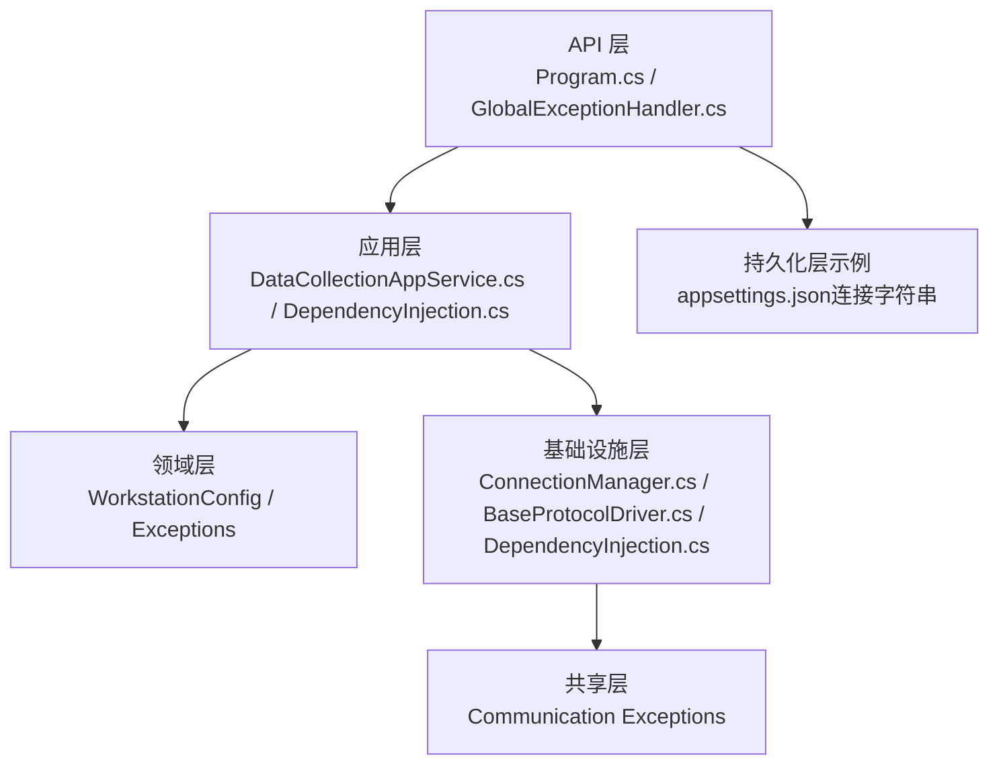
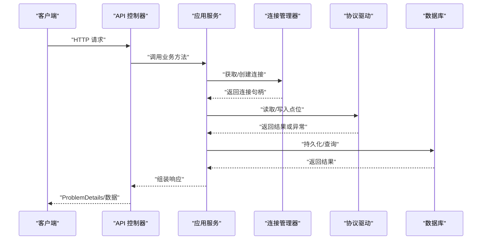
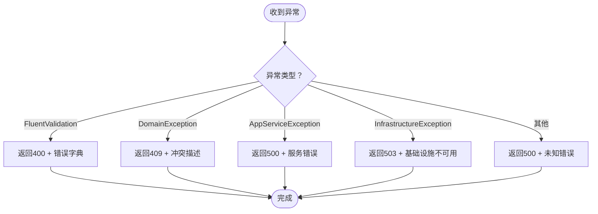
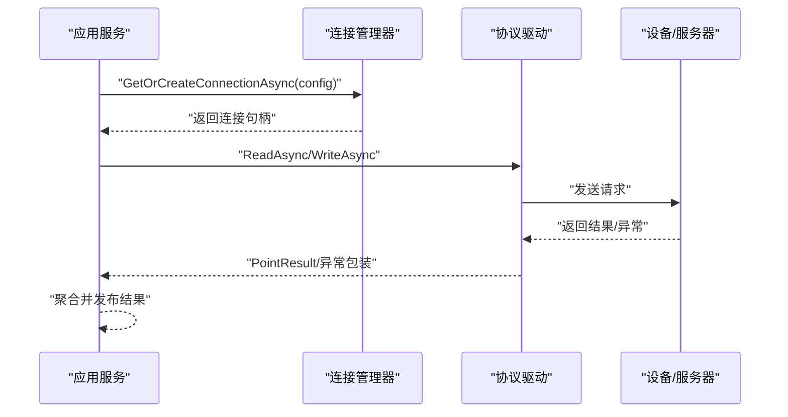
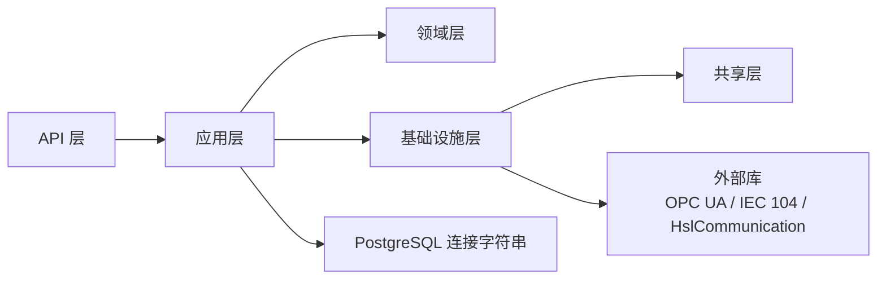

# 常见问题与解决方案

<cite>
**本文引用的文件**
- [Program.cs](file://IndustrialDataSolution/IndustrialDataProcessor.Api/Program.cs)
- [appsettings.json](file://IndustrialDataSolution/IndustrialDataProcessor.Api/appsettings.json)
- [DependencyInjection.cs（应用层）](file://IndustrialDataSolution/IndustrialDataProcessor.Application/DependencyInjection.cs)
- [DependencyInjection.cs（基础设施层）](file://IndustrialDataSolution/IndustrialDataProcessor.Infrastructure/DependencyInjection.cs)
- [GlobalExceptionHandler.cs](file://IndustrialDataSolution/IndustrialDataProcessor.Api/Middleware/GlobalExceptionHandler.cs)
- [IndustrialDataException.cs](file://IndustrialDataSolution/IndustrialDataProcessor.Domain/Exceptions/IndustrialDataException.cs)
- [BaseProtocolDriver.cs](file://IndustrialDataSolution/IndustrialDataProcessor.Infrastructure/Communication/Drivers/TcpCommon/BaseProtocolDriver.cs)
- [ConnectionManager.cs](file://IndustrialDataSolution/IndustrialDataProcessor.Infrastructure/Communication/Connection/ConnectionManager.cs)
- [DataCollectionAppService.cs](file://IndustrialDataSolution/IndustrialDataProcessor.Application/Servicess/DataCollectionAppService.cs)
- [CommunicationException.cs（共享层）](file://IndustrialDataSolution/IndustrialDataProcessor.Share/Exceptions/Communication/CommunicationException.cs)
- [DeviceUnavailableException.cs（共享层）](file://IndustrialDataSolution/IndustrialDataProcessor.Share/Exceptions/Communication/DeviceUnavailableException.cs)
- [SerialPortBusyException.cs（共享层）](file://IndustrialDataSolution/IndustrialDataProcessor.Share/Exceptions/Communication/SerialPortBusyException.cs)
- [DatabaseInterfaceConfig.cs](file://IndustrialDataSolution/IndustrialDataProcessor.Domain/Workstation/Configs/ProtocolSub/DatabaseInterfaceConfig.cs)
- [EquipmentConfig.cs](file://IndustrialDataSolution/IndustrialDataProcessor.Domain/Workstation/Configs/EquipmentConfig.cs)
- [SaveWorkstationConfigCommand.cs](file://IndustrialDataSolution/IndustrialDataProcessor.Application/Commands/SaveWorkstationConfigCommand.cs)
</cite>

## 目录
1. [简介](#简介)
2. [项目结构](#项目结构)
3. [核心组件](#核心组件)
4. [架构总览](#架构总览)
5. [详细组件分析](#详细组件分析)
6. [依赖关系分析](#依赖关系分析)
7. [性能考虑](#性能考虑)
8. [故障排查指南](#故障排查指南)
9. [结论](#结论)
10. [附录](#附录)

## 简介
本文件面向DDD工业数据处理解决方案的运维与开发人员，聚焦以下常见问题与解决方案：
- 数据库连接失败：连接字符串配置、连接池耗尽与超时设置
- API调用异常：400参数错误、409业务冲突、500服务器错误
- 协议通信错误：Modbus通信失败、OPC UA连接中断、IEC 104协议异常
- 设备连接问题：串口占用、设备离线、通信超时
- 配置错误：协议参数设置、设备地址配置、数据格式转换
- 系统资源问题：内存不足、CPU使用率过高、磁盘空间不足
- 紧急情况下的快速修复与临时缓解措施

## 项目结构
系统采用多层架构（API、应用、领域、基础设施、共享层），围绕“工作站配置—协议驱动—连接管理—数据采集—异常处理—持久化”的闭环组织。关键要点：
- API层负责健康检查、控制器、中间件（日志、异常）
- 应用层负责业务编排、任务调度、数据通道
- 领域层定义协议、设备、结果模型与异常基类
- 基础设施层封装通信驱动、连接管理、OPC UA托管服务、序列化转换器
- 共享层提供通信相关异常类型

图表来源
- [Program.cs](file://IndustrialDataSolution/IndustrialDataProcessor.Api/Program.cs#L1-L54)
- [DependencyInjection.cs（应用层）](file://IndustrialDataSolution/IndustrialDataProcessor.Application/DependencyInjection.cs#L1-L40)
- [DependencyInjection.cs（基础设施层）](file://IndustrialDataSolution/IndustrialDataProcessor.Infrastructure/DependencyInjection.cs#L1-L82)
- [GlobalExceptionHandler.cs](file://IndustrialDataSolution/IndustrialDataProcessor.Api/Middleware/GlobalExceptionHandler.cs#L1-L94)
- [ConnectionManager.cs](file://IndustrialDataSolution/IndustrialDataProcessor.Infrastructure/Communication/Connection/ConnectionManager.cs#L1-L396)
- [BaseProtocolDriver.cs](file://IndustrialDataSolution/IndustrialDataProcessor.Infrastructure/Communication/Drivers/TcpCommon/BaseProtocolDriver.cs#L1-L108)
- [appsettings.json](file://IndustrialDataSolution/IndustrialDataProcessor.Api/appsettings.json#L1-L17)

章节来源
- [Program.cs](file://IndustrialDataSolution/IndustrialDataProcessor.Api/Program.cs#L1-L54)
- [DependencyInjection.cs（应用层）](file://IndustrialDataSolution/IndustrialDataProcessor.Application/DependencyInjection.cs#L1-L40)
- [DependencyInjection.cs（基础设施层）](file://IndustrialDataSolution/IndustrialDataProcessor.Infrastructure/DependencyInjection.cs#L1-L82)
- [appsettings.json](file://IndustrialDataSolution/IndustrialDataProcessor.Api/appsettings.json#L1-L17)

## 核心组件
- 异常处理中间件：统一捕获异常并输出RFC 7807风格ProblemDetails，区分400/409/500/503
- 连接管理器：按协议类型创建LAN/COM连接，维护连接复用与清理
- 协议驱动基类：提供读写流程编排、通道锁、异常包装
- 应用服务：拉取配置、启动协议采集任务、聚合结果并发布到数据通道
- 配置与持久化：PostgreSQL连接字符串、授权码校验、健康检查端点

章节来源
- [GlobalExceptionHandler.cs](file://IndustrialDataSolution/IndustrialDataProcessor.Api/Middleware/GlobalExceptionHandler.cs#L1-L94)
- [ConnectionManager.cs](file://IndustrialDataSolution/IndustrialDataProcessor.Infrastructure/Communication/Connection/ConnectionManager.cs#L1-L396)
- [BaseProtocolDriver.cs](file://IndustrialDataSolution/IndustrialDataProcessor.Infrastructure/Communication/Drivers/TcpCommon/BaseProtocolDriver.cs#L1-L108)
- [DataCollectionAppService.cs](file://IndustrialDataSolution/IndustrialDataProcessor.Application/Servicess/DataCollectionAppService.cs#L1-L216)
- [DependencyInjection.cs（基础设施层）](file://IndustrialDataSolution/IndustrialDataProcessor.Infrastructure/DependencyInjection.cs#L1-L82)
- [appsettings.json](file://IndustrialDataSolution/IndustrialDataProcessor.Api/appsettings.json#L1-L17)

## 架构总览
系统通过“配置驱动+协议驱动+连接管理+异常处理”的方式实现稳定的数据采集与对外服务。

图表来源
- [DataCollectionAppService.cs](file://IndustrialDataSolution/IndustrialDataProcessor.Application/Servicess/DataCollectionAppService.cs#L1-L216)
- [ConnectionManager.cs](file://IndustrialDataSolution/IndustrialDataProcessor.Infrastructure/Communication/Connection/ConnectionManager.cs#L1-L396)
- [BaseProtocolDriver.cs](file://IndustrialDataSolution/IndustrialDataProcessor.Infrastructure/Communication/Drivers/TcpCommon/BaseProtocolDriver.cs#L1-L108)
- [GlobalExceptionHandler.cs](file://IndustrialDataSolution/IndustrialDataProcessor.Api/Middleware/GlobalExceptionHandler.cs#L1-L94)

## 详细组件分析

### 数据库连接失败
- 现象
  - 启动阶段授权码缺失或无效导致应用无法启动
  - 运行期连接字符串错误、连接池耗尽、命令超时
- 根因定位
  - 启动期：基础设施层依赖注入中对授权码进行严格校验，缺失或无效会直接抛出异常阻止启动
  - 运行期：PostgreSQL连接字符串位于配置文件，包含连接池与命令超时参数
- 修复步骤
  - 确认授权码配置与授权状态
  - 校验连接字符串参数（主机、端口、数据库、用户名、密码、池大小、生命周期、命令超时）
  - 评估并发与采集频率，必要时调整最大池大小与连接生命周期
  - 对长时间运行的查询增加超时控制，避免阻塞连接池
- 快速缓解
  - 临时降低并发采集任务数量
  - 重启应用以回收连接池
  - 使用健康检查端点确认数据库可达性

章节来源
- [DependencyInjection.cs（基础设施层）](file://IndustrialDataSolution/IndustrialDataProcessor.Infrastructure/DependencyInjection.cs#L17-L29)
- [appsettings.json](file://IndustrialDataSolution/IndustrialDataProcessor.Api/appsettings.json#L10-L12)

### API调用异常（400/409/500）
- 现象
  - 提交数据不满足验证规则（400）
  - 业务规则冲突（409）
  - 应用服务执行失败（500）
  - 基础设施不可用（503）
- 根因定位
  - 全局异常中间件根据异常类型映射HTTP状态码
  - 验证异常会返回标准化错误字典
  - 业务异常与基础设施异常分别映射到不同状态码
- 修复步骤
  - 400：依据返回的字段错误清单修正请求体
  - 409：遵循业务规则，避免重复或冲突操作
  - 500：查看服务端日志，定位具体异常链路
  - 503：检查数据库/外部服务可用性
- 快速缓解
  - 重试幂等请求（注意业务幂等设计）
  - 临时禁用高风险操作，待问题修复后再启用

图表来源
- [GlobalExceptionHandler.cs](file://IndustrialDataSolution/IndustrialDataProcessor.Api/Middleware/GlobalExceptionHandler.cs#L22-L47)

章节来源
- [GlobalExceptionHandler.cs](file://IndustrialDataSolution/IndustrialDataProcessor.Api/Middleware/GlobalExceptionHandler.cs#L1-L94)
- [IndustrialDataException.cs](file://IndustrialDataSolution/IndustrialDataProcessor.Domain/Exceptions/IndustrialDataException.cs#L1-L9)

### 协议通信错误（Modbus/OPC UA/IEC 104）
- 现象
  - Modbus连接失败、读写超时
  - OPC UA找不到有效Endpoint、认证失败
  - IEC 104连接异常
- 根因定位
  - 连接管理器按协议类型创建底层连接，失败时抛出异常
  - 协议驱动基类对读写过程进行异常包装
- 修复步骤
  - Modbus：核对IP/端口、超时设置、站号与寄存器地址
  - OPC UA：确认Endpoint可达、证书策略、账号密码
  - IEC 104：确认远端IP/端口、ASDU配置、链路参数
- 快速缓解
  - 临时关闭对应协议任务，避免持续失败
  - 增大超时参数，观察是否为网络抖动导致

图表来源
- [ConnectionManager.cs](file://IndustrialDataSolution/IndustrialDataProcessor.Infrastructure/Communication/Connection/ConnectionManager.cs#L25-L56)
- [BaseProtocolDriver.cs](file://IndustrialDataSolution/IndustrialDataProcessor.Infrastructure/Communication/Drivers/TcpCommon/BaseProtocolDriver.cs#L26-L81)
- [DataCollectionAppService.cs](file://IndustrialDataSolution/IndustrialDataProcessor.Application/Servicess/DataCollectionAppService.cs#L77-L211)

章节来源
- [ConnectionManager.cs](file://IndustrialDataSolution/IndustrialDataProcessor.Infrastructure/Communication/Connection/ConnectionManager.cs#L61-L347)
- [BaseProtocolDriver.cs](file://IndustrialDataSolution/IndustrialDataProcessor.Infrastructure/Communication/Drivers/TcpCommon/BaseProtocolDriver.cs#L1-L108)
- [DataCollectionAppService.cs](file://IndustrialDataSolution/IndustrialDataProcessor.Application/Servicess/DataCollectionAppService.cs#L1-L216)

### 设备连接问题（串口占用/离线/超时）
- 现象
  - 串口被占用导致打开失败
  - 设备离线或无响应
  - 通信超时频繁
- 根因定位
  - 共享层提供串口占用、设备离线、通信异常等异常类型
  - 连接管理器对串口协议类型进行分支处理
- 修复步骤
  - 关闭占用串口的其他进程或服务
  - 核对串口参数（波特率、数据位、停止位、奇偶校验）
  - 检查设备电源、接线与地址设置
  - 适当增大超时参数，避免瞬时抖动导致失败
- 快速缓解
  - 切换到备用串口或协议
  - 临时禁用该设备的采集任务

章节来源
- [SerialPortBusyException.cs](file://IndustrialDataSolution/IndustrialDataProcessor.Share/Exceptions/Communication/SerialPortBusyException.cs#L1-L6)
- [DeviceUnavailableException.cs](file://IndustrialDataSolution/IndustrialDataProcessor.Share/Exceptions/Communication/DeviceUnavailableException.cs#L1-L6)
- [ConnectionManager.cs](file://IndustrialDataSolution/IndustrialDataProcessor.Infrastructure/Communication/Connection/ConnectionManager.cs#L352-L370)

### 配置错误（协议参数/设备地址/数据格式）
- 现象
  - 协议参数不匹配导致读写失败
  - 设备地址非法或越界
  - 数据格式转换异常
- 根因定位
  - 设备配置包含地址、数据类型、采集开关等关键字段
  - 数据库接口配置包含查询SQL与连接字符串
  - 应用层对配置进行验证与解析
- 修复步骤
  - 校验设备地址与协议地址范围
  - 确认数据类型与表达式转换器兼容
  - 检查数据库接口的连接字符串与SQL语法
- 快速缓解
  - 回滚到上一个已知可用配置
  - 临时禁用问题设备，优先恢复业务

章节来源
- [EquipmentConfig.cs](file://IndustrialDataSolution/IndustrialDataProcessor.Domain/Workstation/Configs/EquipmentConfig.cs#L1-L34)
- [DatabaseInterfaceConfig.cs](file://IndustrialDataSolution/IndustrialDataProcessor.Domain/Workstation/Configs/ProtocolSub/DatabaseInterfaceConfig.cs#L1-L45)
- [SaveWorkstationConfigCommand.cs](file://IndustrialDataSolution/IndustrialDataProcessor.Application/Commands/SaveWorkstationConfigCommand.cs#L1-L9)

## 依赖关系分析
- 组件耦合
  - API层依赖应用层；应用层依赖领域与基础设施；基础设施层依赖第三方通信库
  - 连接管理器与协议驱动通过接口解耦，便于扩展
- 外部依赖
  - PostgreSQL连接字符串、HslCommunication授权码
  - OPC UA客户端库、IEC 104客户端库
- 潜在环路
  - 通过接口与依赖注入避免循环依赖

图表来源
- [DependencyInjection.cs（应用层）](file://IndustrialDataSolution/IndustrialDataProcessor.Application/DependencyInjection.cs#L16-L39)
- [DependencyInjection.cs（基础设施层）](file://IndustrialDataSolution/IndustrialDataProcessor.Infrastructure/DependencyInjection.cs#L17-L79)
- [appsettings.json](file://IndustrialDataSolution/IndustrialDataProcessor.Api/appsettings.json#L10-L12)

章节来源
- [DependencyInjection.cs（应用层）](file://IndustrialDataSolution/IndustrialDataProcessor.Application/DependencyInjection.cs#L1-L40)
- [DependencyInjection.cs（基础设施层）](file://IndustrialDataSolution/IndustrialDataProcessor.Infrastructure/DependencyInjection.cs#L1-L82)
- [appsettings.json](file://IndustrialDataSolution/IndustrialDataProcessor.Api/appsettings.json#L1-L17)

## 性能考虑
- 连接池与超时
  - 合理设置最大池大小与连接生命周期，避免频繁创建销毁
  - 对长查询设置命令超时，防止阻塞连接池
- 采集并发
  - 协议级独立线程，彼此隔离；根据设备数量与网络状况调整并发度
  - 采集周期最小不低于1毫秒，避免CPU飙升
- 序列化与转换
  - JSON选项统一命名策略与大小写敏感性，减少解析开销

章节来源
- [appsettings.json](file://IndustrialDataSolution/IndustrialDataProcessor.Api/appsettings.json#L10-L12)
- [DataCollectionAppService.cs](file://IndustrialDataSolution/IndustrialDataProcessor.Application/Servicess/DataCollectionAppService.cs#L204-L211)
- [DependencyInjection.cs（基础设施层）](file://IndustrialDataSolution/IndustrialDataProcessor.Infrastructure/DependencyInjection.cs#L64-L77)

## 故障排查指南

### 数据库连接失败
- 检查授权码
  - 缺失或无效会导致启动即失败
- 校验连接字符串
  - 主机、端口、数据库、用户名、密码、池参数、超时
- 连接池耗尽
  - 降低并发或提升最大池大小
  - 观察健康检查端点
- 超时设置
  - 增大命令超时，避免长时间查询阻塞

章节来源
- [DependencyInjection.cs（基础设施层）](file://IndustrialDataSolution/IndustrialDataProcessor.Infrastructure/DependencyInjection.cs#L17-L29)
- [appsettings.json](file://IndustrialDataSolution/IndustrialDataProcessor.Api/appsettings.json#L10-L12)

### API调用异常
- 400参数错误
  - 查看返回的字段错误清单，逐项修正
- 409业务冲突
  - 遵循业务规则，避免重复操作
- 500服务器错误
  - 查看服务端日志，定位异常链路
- 503基础设施不可用
  - 检查数据库/外部服务可用性

章节来源
- [GlobalExceptionHandler.cs](file://IndustrialDataSolution/IndustrialDataProcessor.Api/Middleware/GlobalExceptionHandler.cs#L22-L47)

### 协议通信错误
- Modbus
  - 核对IP/端口、超时、站号与寄存器地址
- OPC UA
  - Endpoint可达性、证书策略、账号密码
- IEC 104
  - 远端IP/端口、ASDU配置、链路参数

章节来源
- [ConnectionManager.cs](file://IndustrialDataSolution/IndustrialDataProcessor.Infrastructure/Communication/Connection/ConnectionManager.cs#L61-L347)

### 设备连接问题
- 串口占用
  - 关闭占用串口的进程
- 设备离线
  - 检查电源、接线、地址
- 通信超时
  - 增大超时参数，排除网络抖动

章节来源
- [SerialPortBusyException.cs](file://IndustrialDataSolution/IndustrialDataProcessor.Share/Exceptions/Communication/SerialPortBusyException.cs#L1-L6)
- [DeviceUnavailableException.cs](file://IndustrialDataSolution/IndustrialDataProcessor.Share/Exceptions/Communication/DeviceUnavailableException.cs#L1-L6)
- [ConnectionManager.cs](file://IndustrialDataSolution/IndustrialDataProcessor.Infrastructure/Communication/Connection/ConnectionManager.cs#L352-L370)

### 配置错误
- 协议参数
  - 地址、数据类型、采集开关
- 设备地址
  - 校验地址范围与协议要求
- 数据格式转换
  - 确认转换器与表达式兼容

章节来源
- [EquipmentConfig.cs](file://IndustrialDataSolution/IndustrialDataProcessor.Domain/Workstation/Configs/EquipmentConfig.cs#L1-L34)
- [DatabaseInterfaceConfig.cs](file://IndustrialDataSolution/IndustrialDataProcessor.Domain/Workstation/Configs/ProtocolSub/DatabaseInterfaceConfig.cs#L1-L45)

### 系统资源问题
- 内存不足
  - 优化序列化选项、减少不必要的对象分配
- CPU使用率过高
  - 降低采集并发、避免过小的采集周期
- 磁盘空间不足
  - 清理日志与缓存、扩容磁盘

章节来源
- [DependencyInjection.cs（基础设施层）](file://IndustrialDataSolution/IndustrialDataProcessor.Infrastructure/DependencyInjection.cs#L64-L77)
- [DataCollectionAppService.cs](file://IndustrialDataSolution/IndustrialDataProcessor.Application/Servicess/DataCollectionAppService.cs#L204-L211)

### 紧急快速修复与临时缓解
- 立即措施
  - 重启应用以回收连接池
  - 关闭问题协议/设备的任务
  - 临时放宽超时参数以渡过网络波动
- 临时缓解
  - 降级采集频率、减少并发
  - 回滚到上一个稳定配置
  - 使用健康检查端点监控可用性

章节来源
- [Program.cs](file://IndustrialDataSolution/IndustrialDataProcessor.Api/Program.cs#L27-L49)
- [DataCollectionAppService.cs](file://IndustrialDataSolution/IndustrialDataProcessor.Application/Servicess/DataCollectionAppService.cs#L22-L41)

## 结论
本方案通过严格的异常处理、可扩展的协议驱动与连接管理、完善的配置与健康检查机制，为工业数据采集提供了稳健的运行基础。针对常见问题，建议优先从配置与连接层面入手排查，结合异常中间件返回的标准化信息快速定位根因，并在紧急情况下采用临时缓解措施保障业务连续性。

## 附录
- 健康检查端点：/health
- Swagger文档：/swagger
- 日志级别：默认信息级别，参数错误记录为警告，其他异常记录为错误

章节来源
- [Program.cs](file://IndustrialDataSolution/IndustrialDataProcessor.Api/Program.cs#L27-L49)
- [appsettings.json](file://IndustrialDataSolution/IndustrialDataProcessor.Api/appsettings.json#L2-L6)