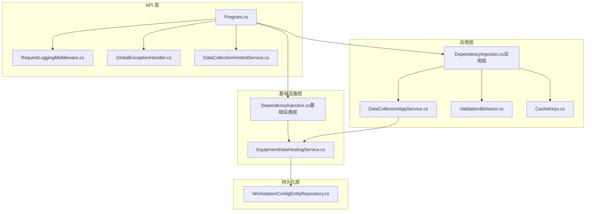
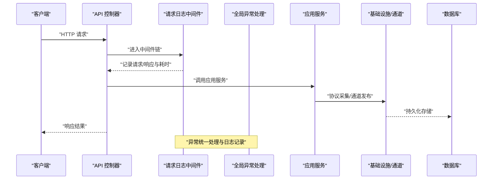
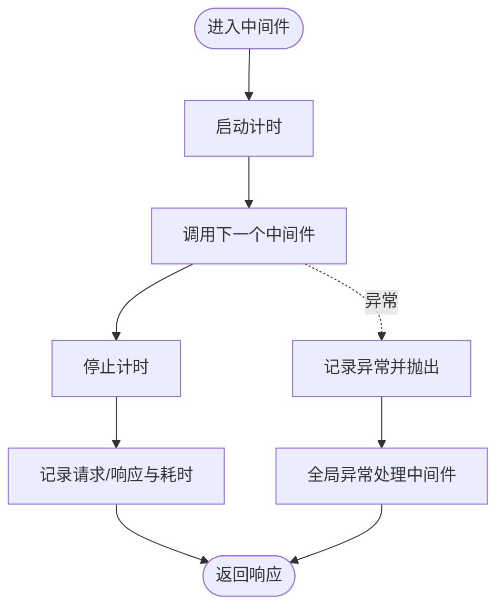
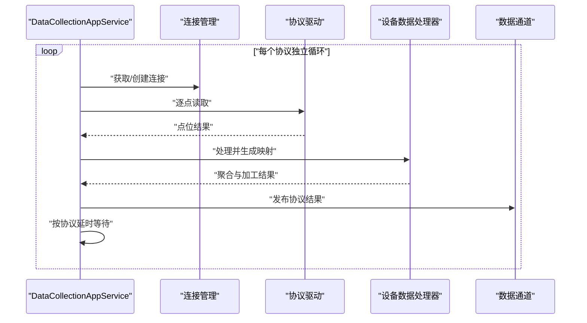
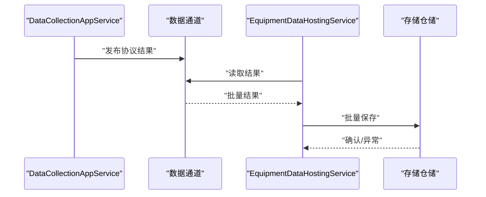
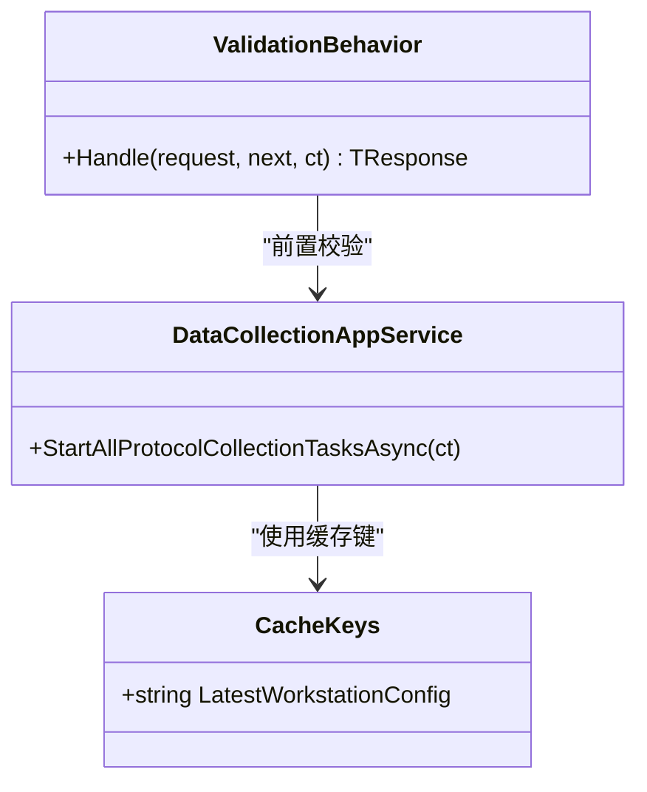
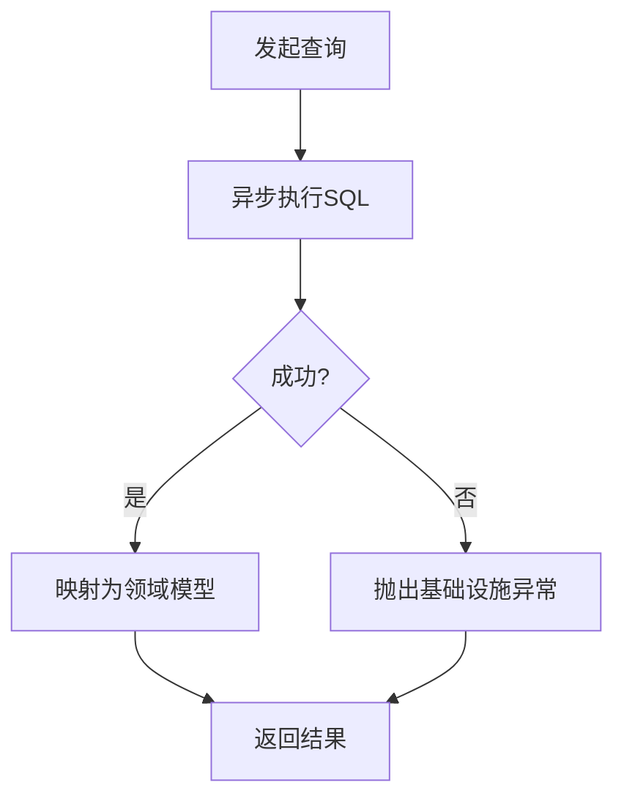
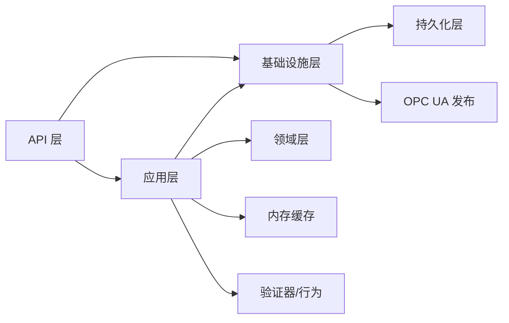

# 性能问题诊断与优化

<cite>
**本文引用的文件**
- [Program.cs](file://IndustrialDataSolution/IndustrialDataProcessor.Api/Program.cs)
- [appsettings.json](file://IndustrialDataSolution/IndustrialDataProcessor.Api/appsettings.json)
- [appsettings.Development.json](file://IndustrialDataSolution/IndustrialDataProcessor.Api/appsettings.Development.json)
- [GlobalExceptionHandler.cs](file://IndustrialDataSolution/IndustrialDataProcessor.Api/Middleware/GlobalExceptionHandler.cs)
- [RequestLoggingMiddleware.cs](file://IndustrialDataSolution/IndustrialDataProcessor.Api/Middleware/RequestLoggingMiddleware.cs)
- [DataCollectionHostedService.cs](file://IndustrialDataSolution/IndustrialDataProcessor.Api/BackgroundServices/DataCollectionHostedService.cs)
- [DependencyInjection.cs（应用层）](file://IndustrialDataSolution/IndustrialDataProcessor.Application/DependencyInjection.cs)
- [DependencyInjection.cs（基础设施层）](file://IndustrialDataSolution/IndustrialDataProcessor.Infrastructure/DependencyInjection.cs)
- [DataCollectionAppService.cs](file://IndustrialDataSolution/IndustrialDataProcessor.Application/Services/DataCollectionAppService.cs)
- [EquipmentDataHostingService.cs](file://IndustrialDataSolution/IndustrialDataProcessor.Infrastructure/BackgroundServices/EquipmentDataHostingService.cs)
- [CacheKeys.cs](file://IndustrialDataSolution/IndustrialDataProcessor.Application/Constants/CacheKeys.cs)
- [ValidationBehavior.cs](file://IndustrialDataSolution/IndustrialDataProcessor.Application/Behaviors/ValidationBehavior.cs)
- [IWorkstationConfigRepository.cs](file://IndustrialDataSolution/IndustrialDataProcessor.Domain/Repositories/IWorkstationConfigRepository.cs)
- [WorkstationConfigEntityRepository.cs](file://IndustrialDataSolution/IndustrialDataProcessor.Infrastructure.Persistence.SqlSugar/Repositories/WorkstationConfigEntityRepository.cs)
</cite>

## 目录
1. [简介](#简介)
2. [项目结构](#项目结构)
3. [核心组件](#核心组件)
4. [架构总览](#架构总览)
5. [详细组件分析](#详细组件分析)
6. [依赖关系分析](#依赖关系分析)
7. [性能考量](#性能考量)
8. [故障排除指南](#故障排除指南)
9. [结论](#结论)
10. [附录](#附录)

## 简介
本文件面向DDD工业数据处理解决方案，聚焦性能问题的识别与优化，覆盖响应时间分析、吞吐量监控、资源使用评估、内存泄漏检测、CPU热点分析、数据库查询优化、缓存性能诊断、并发控制问题以及性能监控工具与基准测试实践。文档结合代码库中的实际实现，给出可操作的诊断路径与优化建议。

## 项目结构
项目采用多层架构（API、应用、领域、基础设施、持久化），围绕“数据采集—处理—存储—发布”的主链路运行。关键性能相关点包括：
- API层：请求日志中间件、全局异常处理、健康检查、后台托管服务注册
- 应用层：数据采集应用服务、任务管理器、验证行为、内存缓存
- 基础设施层：连接管理、协议驱动、OPC UA发布、设备数据处理与存储
- 持久化层：基于SqlSugar的仓储实现与连接池配置

图表来源
- [Program.cs](file://IndustrialDataSolution/IndustrialDataProcessor.Api/Program.cs#L10-L51)
- [RequestLoggingMiddleware.cs](file://IndustrialDataSolution/IndustrialDataProcessor.Api/Middleware/RequestLoggingMiddleware.cs#L16-L84)
- [GlobalExceptionHandler.cs](file://IndustrialDataSolution/IndustrialDataProcessor.Api/Middleware/GlobalExceptionHandler.cs#L12-L47)
- [DataCollectionHostedService.cs](file://IndustrialDataSolution/IndustrialDataProcessor.Api/BackgroundServices/DataCollectionHostedService.cs#L15-L26)
- [DependencyInjection.cs（应用层）](file://IndustrialDataSolution/IndustrialDataProcessor.Application/DependencyInjection.cs#L16-L39)
- [DependencyInjection.cs（基础设施层）](file://IndustrialDataSolution/IndustrialDataProcessor.Infrastructure/DependencyInjection.cs#L17-L81)
- [DataCollectionAppService.cs](file://IndustrialDataSolution/IndustrialDataProcessor.Application/Services/DataCollectionAppService.cs#L22-L41)
- [EquipmentDataHostingService.cs](file://IndustrialDataSolution/IndustrialDataProcessor.Infrastructure/BackgroundServices/EquipmentDataHostingService.cs#L16-L41)
- [WorkstationConfigEntityRepository.cs](file://IndustrialDataSolution/IndustrialDataProcessor.Infrastructure.Persistence.SqlSugar/Repositories/WorkstationConfigEntityRepository.cs#L24-L31)

章节来源
- [Program.cs](file://IndustrialDataSolution/IndustrialDataProcessor.Api/Program.cs#L10-L51)
- [appsettings.json](file://IndustrialDataSolution/IndustrialDataProcessor.Api/appsettings.json#L10-L12)

## 核心组件
- 请求日志中间件：在请求进入与离开时记录耗时、状态码、TraceId，支持可选记录请求/响应体，便于定位慢请求与异常路径。
- 全局异常处理：统一输出RFC 7807格式的ProblemDetails，区分业务错误与系统错误，减少异常传播成本。
- 数据采集后台服务：启动任务管理器，常驻触发采集逻辑，避免主线程阻塞。
- 应用服务采集循环：按协议独立线程采集，协议间互不影响；使用Stopwatch统计各层级耗时，便于性能剖析。
- 设备数据持久化后台服务：从进程内通道读取并批量写入数据库，异常隔离，避免单条失败影响整体。
- 依赖注入：应用层注册内存缓存、验证器、MediatR及验证行为；基础设施层注册连接管理、协议驱动、OPC UA发布与后台服务。

章节来源
- [RequestLoggingMiddleware.cs](file://IndustrialDataSolution/IndustrialDataProcessor.Api/Middleware/RequestLoggingMiddleware.cs#L16-L84)
- [GlobalExceptionHandler.cs](file://IndustrialDataSolution/IndustrialDataProcessor.Api/Middleware/GlobalExceptionHandler.cs#L12-L47)
- [DataCollectionHostedService.cs](file://IndustrialDataSolution/IndustrialDataProcessor.Api/BackgroundServices/DataCollectionHostedService.cs#L15-L26)
- [DataCollectionAppService.cs](file://IndustrialDataSolution/IndustrialDataProcessor.Application/Services/DataCollectionAppService.cs#L22-L41)
- [EquipmentDataHostingService.cs](file://IndustrialDataSolution/IndustrialDataProcessor.Infrastructure/BackgroundServices/EquipmentDataHostingService.cs#L16-L41)
- [DependencyInjection.cs（应用层）](file://IndustrialDataSolution/IndustrialDataProcessor.Application/DependencyInjection.cs#L16-L39)
- [DependencyInjection.cs（基础设施层）](file://IndustrialDataSolution/IndustrialDataProcessor.Infrastructure/DependencyInjection.cs#L17-L81)

## 架构总览
下图展示从HTTP请求到数据采集、处理、存储的关键流程，以及性能相关观测点（日志、异常、通道、数据库）。

图表来源
- [RequestLoggingMiddleware.cs](file://IndustrialDataSolution/IndustrialDataProcessor.Api/Middleware/RequestLoggingMiddleware.cs#L16-L84)
- [GlobalExceptionHandler.cs](file://IndustrialDataSolution/IndustrialDataProcessor.Api/Middleware/GlobalExceptionHandler.cs#L12-L47)
- [DataCollectionAppService.cs](file://IndustrialDataSolution/IndustrialDataProcessor.Application/Services/DataCollectionAppService.cs#L22-L41)
- [EquipmentDataHostingService.cs](file://IndustrialDataSolution/IndustrialDataProcessor.Infrastructure/BackgroundServices/EquipmentDataHostingService.cs#L16-L41)

## 详细组件分析

### 请求日志与异常处理（性能观测入口）
- 请求日志中间件通过Stopwatch统计请求耗时，记录TraceId，支持条件记录请求/响应体，便于定位慢请求与异常路径。
- 全局异常处理统一输出ProblemDetails，区分不同异常类型，减少重复错误处理逻辑，提升可观测性与一致性。

图表来源
- [RequestLoggingMiddleware.cs](file://IndustrialDataSolution/IndustrialDataProcessor.Api/Middleware/RequestLoggingMiddleware.cs#L16-L84)
- [GlobalExceptionHandler.cs](file://IndustrialDataSolution/IndustrialDataProcessor.Api/Middleware/GlobalExceptionHandler.cs#L12-L47)

章节来源
- [RequestLoggingMiddleware.cs](file://IndustrialDataSolution/IndustrialDataProcessor.Api/Middleware/RequestLoggingMiddleware.cs#L16-L84)
- [GlobalExceptionHandler.cs](file://IndustrialDataSolution/IndustrialDataProcessor.Api/Middleware/GlobalExceptionHandler.cs#L12-L47)

### 数据采集与并发（协议级独立线程）
- 应用服务为每个协议启动独立的后台循环，互不阻塞；使用Stopwatch统计协议、设备、点位层级耗时，便于定位热点。
- 采集循环内具备取消令牌检查与异常隔离，协议级异常不影响其他协议，降低级联故障风险。

图表来源
- [DataCollectionAppService.cs](file://IndustrialDataSolution/IndustrialDataProcessor.Application/Services/DataCollectionAppService.cs#L46-L214)

章节来源
- [DataCollectionAppService.cs](file://IndustrialDataSolution/IndustrialDataProcessor.Application/Services/DataCollectionAppService.cs#L22-L41)
- [DataCollectionAppService.cs](file://IndustrialDataSolution/IndustrialDataProcessor.Application/Services/DataCollectionAppService.cs#L46-L214)

### 后台持久化与通道消费
- 设备数据持久化后台服务从进程内通道读取，逐批写入数据库；异常被捕获并记录，避免单条失败影响整体吞吐。
- 通道消费与生产解耦，有助于削峰填谷，提升整体稳定性。

图表来源
- [EquipmentDataHostingService.cs](file://IndustrialDataSolution/IndustrialDataProcessor.Infrastructure/BackgroundServices/EquipmentDataHostingService.cs#L16-L41)

章节来源
- [EquipmentDataHostingService.cs](file://IndustrialDataSolution/IndustrialDataProcessor.Infrastructure/BackgroundServices/EquipmentDataHostingService.cs#L16-L41)

### 缓存与验证（内存缓存与请求前置校验）
- 应用层注册内存缓存，配合缓存键常量用于热点数据快速访问。
- 应用层注册FluentValidation验证器与全局验证行为，提前拦截无效请求，降低后续处理开销。

图表来源
- [CacheKeys.cs](file://IndustrialDataSolution/IndustrialDataProcessor.Application/Constants/CacheKeys.cs#L5-L6)
- [ValidationBehavior.cs](file://IndustrialDataSolution/IndustrialDataProcessor.Application/Behaviors/ValidationBehavior.cs#L12-L29)
- [DataCollectionAppService.cs](file://IndustrialDataSolution/IndustrialDataProcessor.Application/Services/DataCollectionAppService.cs#L22-L41)

章节来源
- [DependencyInjection.cs（应用层）](file://IndustrialDataSolution/IndustrialDataProcessor.Application/DependencyInjection.cs#L16-L39)
- [CacheKeys.cs](file://IndustrialDataSolution/IndustrialDataProcessor.Application/Constants/CacheKeys.cs#L5-L6)
- [ValidationBehavior.cs](file://IndustrialDataSolution/IndustrialDataProcessor.Application/Behaviors/ValidationBehavior.cs#L12-L29)

### 数据库访问与连接池
- 连接字符串启用连接池、设置最小/最大池大小、连接生命周期与命令超时，适合高并发采集场景。
- 仓储实现使用异步查询与插入，异常统一转化为基础设施异常，便于上层感知。

图表来源
- [WorkstationConfigEntityRepository.cs](file://IndustrialDataSolution/IndustrialDataProcessor.Infrastructure.Persistence.SqlSugar/Repositories/WorkstationConfigEntityRepository.cs#L24-L31)
- [appsettings.json](file://IndustrialDataSolution/IndustrialDataProcessor.Api/appsettings.json#L10-L12)

章节来源
- [appsettings.json](file://IndustrialDataSolution/IndustrialDataProcessor.Api/appsettings.json#L10-L12)
- [WorkstationConfigEntityRepository.cs](file://IndustrialDataSolution/IndustrialDataProcessor.Infrastructure.Persistence.SqlSugar/Repositories/WorkstationConfigEntityRepository.cs#L13-L22)

## 依赖关系分析
- API层依赖应用层与基础设施层，注册内存缓存、健康检查、Swagger、后台托管服务。
- 应用层依赖领域仓储、连接管理、协议驱动、设备数据处理器与验证器。
- 基础设施层注册连接管理、协议驱动集合、OPC UA发布与后台服务。
- 持久化层通过SqlSugar访问数据库，仓储实现异步操作与异常转换。

图表来源
- [Program.cs](file://IndustrialDataSolution/IndustrialDataProcessor.Api/Program.cs#L14-L30)
- [DependencyInjection.cs（应用层）](file://IndustrialDataSolution/IndustrialDataProcessor.Application/DependencyInjection.cs#L16-L39)
- [DependencyInjection.cs（基础设施层）](file://IndustrialDataSolution/IndustrialDataProcessor.Infrastructure/DependencyInjection.cs#L17-L81)

章节来源
- [Program.cs](file://IndustrialDataSolution/IndustrialDataProcessor.Api/Program.cs#L14-L30)
- [DependencyInjection.cs（应用层）](file://IndustrialDataSolution/IndustrialDataProcessor.Application/DependencyInjection.cs#L16-L39)
- [DependencyInjection.cs（基础设施层）](file://IndustrialDataSolution/IndustrialDataProcessor.Infrastructure/DependencyInjection.cs#L17-L81)

## 性能考量

### 响应时间分析
- 使用请求日志中间件记录每请求耗时与TraceId，结合异常处理中间件输出的ProblemDetails，定位慢请求与错误路径。
- 建议在高负载场景开启请求/响应体日志时谨慎控制采样比例，避免I/O放大。

章节来源
- [RequestLoggingMiddleware.cs](file://IndustrialDataSolution/IndustrialDataProcessor.Api/Middleware/RequestLoggingMiddleware.cs#L16-L84)
- [GlobalExceptionHandler.cs](file://IndustrialDataSolution/IndustrialDataProcessor.Api/Middleware/GlobalExceptionHandler.cs#L12-L47)

### 吞吐量监控
- 应用服务按协议独立线程采集，协议间互不影响，有利于提升整体吞吐。
- 后台持久化服务从通道批量消费并写库，建议结合数据库写入性能与通道积压情况调整协议采集频率与批量大小。

章节来源
- [DataCollectionAppService.cs](file://IndustrialDataSolution/IndustrialDataProcessor.Application/Services/DataCollectionAppService.cs#L35-L41)
- [EquipmentDataHostingService.cs](file://IndustrialDataSolution/IndustrialDataProcessor.Infrastructure/BackgroundServices/EquipmentDataHostingService.cs#L16-L41)

### 资源使用率评估
- 通过Stopwatch在协议、设备、点位三个层级统计耗时，识别热点环节（如驱动读取、数据处理、通道发布）。
- 建议结合系统监控（CPU、内存、线程数、GC代次）观察资源占用趋势。

章节来源
- [DataCollectionAppService.cs](file://IndustrialDataSolution/IndustrialDataProcessor.Application/Services/DataCollectionAppService.cs#L61-L178)

### 内存泄漏检测
- 使用内存快照对比（如dotMemory、PerfView、dotnet-gcdump）观察对象存活与引用链。
- 关注以下对象与集合：
  - 协议驱动注册集合（Singleton）与连接管理器（Singleton）的生命周期
  - 设备数据处理器与表达式转换器（Singleton）实例
  - 数据通道中的结果映射与队列
- 结合日志与异常处理中间件，定位异常导致的对象未释放或资源未释放场景。

章节来源
- [DependencyInjection.cs（基础设施层）](file://IndustrialDataSolution/IndustrialDataProcessor.Infrastructure/DependencyInjection.cs#L55-L62)
- [DependencyInjection.cs（基础设施层）](file://IndustrialDataSolution/IndustrialDataProcessor.Infrastructure/DependencyInjection.cs#L34-L46)
- [DataCollectionAppService.cs](file://IndustrialDataSolution/IndustrialDataProcessor.Application/Services/DataCollectionAppService.cs#L188-L197)

### CPU使用率分析
- 热点识别：优先关注驱动读取、表达式计算、JSON序列化/反序列化、通道发布与数据库写入。
- 并发瓶颈：确认协议线程数与CPU核数匹配，避免过度并发导致上下文切换开销；必要时限制并发度或引入限流。
- 线程池配置：结合应用服务的Task.Run与后台服务的异步循环，评估线程池饱和与排队时间。

章节来源
- [DataCollectionAppService.cs](file://IndustrialDataSolution/IndustrialDataProcessor.Application/Services/DataCollectionAppService.cs#L35-L41)
- [EquipmentDataHostingService.cs](file://IndustrialDataSolution/IndustrialDataProcessor.Infrastructure/BackgroundServices/EquipmentDataHostingService.cs#L16-L41)

### 数据库查询性能优化
- 慢查询识别：结合连接字符串的命令超时与仓储异常，定位慢查询与阻塞事务。
- 索引优化：对高频查询字段（如排序字段createdAt）建立索引；避免SELECT *，仅查询必要列。
- 连接池调优：根据并发采集与写入峰值调整最小/最大池大小、连接生命周期与命令超时，避免连接争用与超时。

章节来源
- [appsettings.json](file://IndustrialDataSolution/IndustrialDataProcessor.Api/appsettings.json#L10-L12)
- [WorkstationConfigEntityRepository.cs](file://IndustrialDataSolution/IndustrialDataProcessor.Infrastructure.Persistence.SqlSugar/Repositories/WorkstationConfigEntityRepository.cs#L26-L28)

### 缓存性能诊断
- 命中率分析：通过日志统计缓存命中/未命中次数，结合缓存键（如最新工作站配置）评估有效性。
- 过期策略：为热点配置设置合理TTL与失效策略，避免陈旧数据影响实时性。
- 内存使用监控：关注内存缓存占用与GC代次变化，防止缓存膨胀导致内存压力。

章节来源
- [CacheKeys.cs](file://IndustrialDataSolution/IndustrialDataProcessor.Application/Constants/CacheKeys.cs#L5-L6)
- [DependencyInjection.cs（应用层）](file://IndustrialDataSolution/IndustrialDataProcessor.Application/DependencyInjection.cs#L14-L15)

### 并发控制问题
- 死锁检测：数据库层面使用锁等待超时与死锁日志；应用层避免跨协议/跨仓储的长事务与嵌套锁。
- 资源竞争：协议线程间共享资源（连接、通道）需加锁或使用无锁结构；后台服务消费端避免阻塞。
- 线程安全：Singleton组件需保证线程安全；对可变状态使用并发集合或同步原语。

章节来源
- [DataCollectionAppService.cs](file://IndustrialDataSolution/IndustrialDataProcessor.Application/Services/DataCollectionAppService.cs#L79-L80)
- [EquipmentDataHostingService.cs](file://IndustrialDataSolution/IndustrialDataProcessor.Infrastructure/BackgroundServices/EquipmentDataHostingService.cs#L25-L28)

### 性能监控工具使用指南
- Application Insights（建议集成）：启用请求遥测、依赖项遥测、异常遥测与自定义事件；结合日志中间件与异常处理中间件输出的TraceId进行关联分析。
- Prometheus+Grafana：暴露自定义指标（采集耗时、吞吐、通道积压、数据库写入耗时、GC代次），在Grafana中构建仪表盘进行趋势分析。

章节来源
- [RequestLoggingMiddleware.cs](file://IndustrialDataSolution/IndustrialDataProcessor.Api/Middleware/RequestLoggingMiddleware.cs#L16-L84)
- [GlobalExceptionHandler.cs](file://IndustrialDataSolution/IndustrialDataProcessor.Api/Middleware/GlobalExceptionHandler.cs#L12-L47)

### 性能回归测试与基准测试
- 回归测试：在集成测试中固定数据集与环境，测量关键路径（采集、处理、存储）的响应时间与吞吐，持续监控回归。
- 基准测试：使用BenchmarkDotNet对热点方法（驱动读取、表达式计算、序列化）进行微基准测试，识别回归并指导优化。

章节来源
- [DataCollectionAppService.cs](file://IndustrialDataSolution/IndustrialDataProcessor.Application/Services/DataCollectionAppService.cs#L123-L124)
- [EquipmentDataHostingService.cs](file://IndustrialDataSolution/IndustrialDataProcessor.Infrastructure/BackgroundServices/EquipmentDataHostingService.cs#L27-L28)

## 故障排除指南
- 慢请求定位：启用请求日志中间件的请求/响应体记录（采样），结合异常处理中间件输出的ProblemDetails与TraceId进行关联分析。
- 采集异常隔离：协议级异常被捕获并记录，不影响其他协议；若出现大面积失败，检查连接管理器与驱动注册。
- 存储异常：后台持久化服务捕获异常并记录，检查数据库连接与写入性能；必要时降低批量大小或增加数据库资源。
- 缓存问题：检查缓存键与过期策略，观察内存占用与GC代次变化；对热点配置进行预热与TTL调整。

章节来源
- [RequestLoggingMiddleware.cs](file://IndustrialDataSolution/IndustrialDataProcessor.Api/Middleware/RequestLoggingMiddleware.cs#L29-L63)
- [GlobalExceptionHandler.cs](file://IndustrialDataSolution/IndustrialDataProcessor.Api/Middleware/GlobalExceptionHandler.cs#L12-L47)
- [DataCollectionAppService.cs](file://IndustrialDataSolution/IndustrialDataProcessor.Application/Services/DataCollectionAppService.cs#L159-L171)
- [EquipmentDataHostingService.cs](file://IndustrialDataSolution/IndustrialDataProcessor.Infrastructure/BackgroundServices/EquipmentDataHostingService.cs#L30-L34)

## 结论
本方案通过请求日志与异常处理中间件、协议级独立线程采集、后台通道持久化与连接池配置，构建了高可用、可观测的工业数据处理流水线。建议结合内存快照、CPU火焰图、数据库慢查询日志与自定义指标，形成闭环的性能监控与优化体系，并通过回归测试与基准测试保障长期稳定性。

## 附录
- 配置要点
  - 连接池：最小/最大池大小、连接生命周期、命令超时
  - 日志：请求/响应体采样、异常级别、结构化日志
  - 缓存：键命名规范、TTL策略、容量上限
- 建议的监控指标
  - 请求延迟分布、错误率、吞吐量、通道积压、数据库写入耗时、GC代次与暂停时间