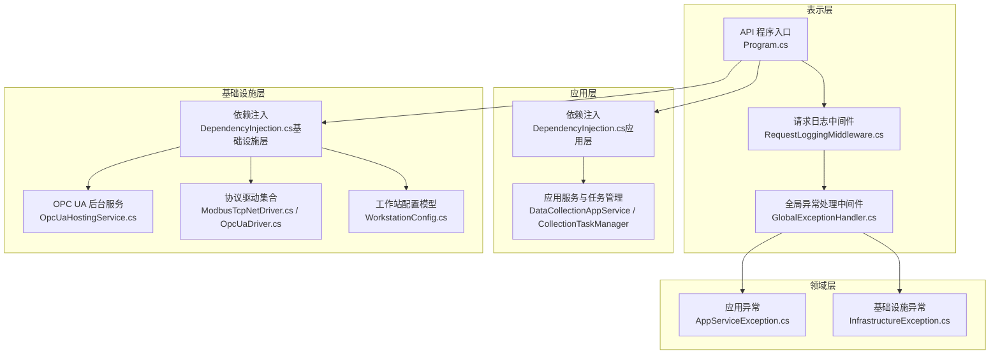
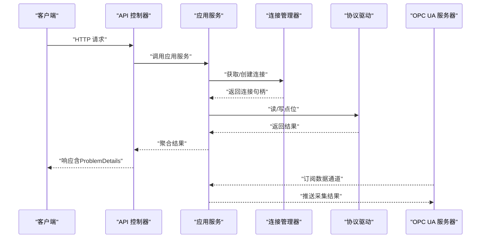
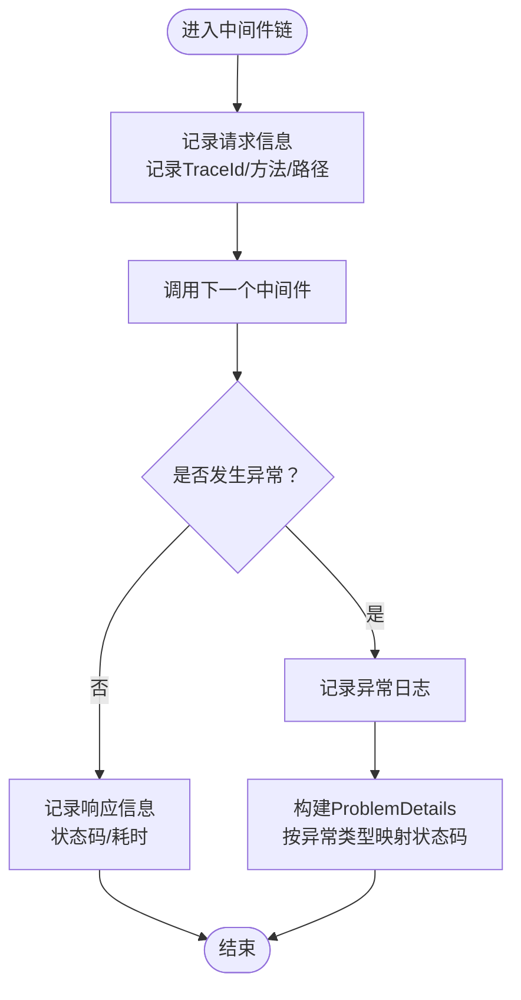
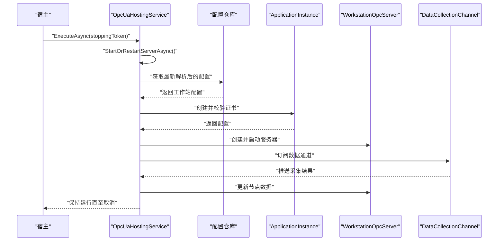
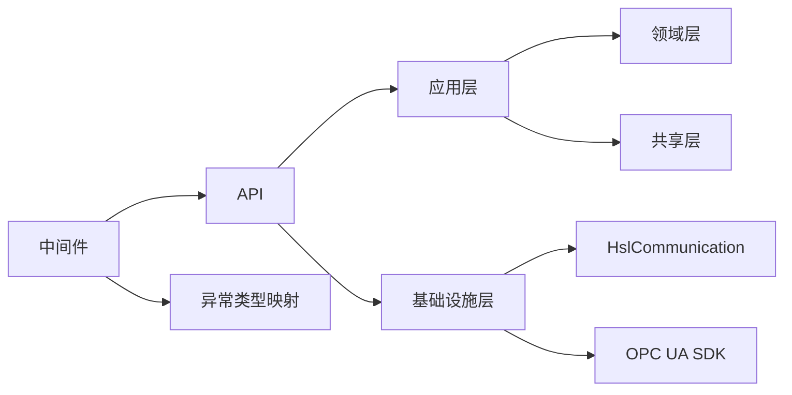

# 故障排除与FAQ

<cite>
**本文引用的文件**
- [Program.cs](file://IndustrialDataSolution/IndustrialDataProcessor.Api/Program.cs)
- [appsettings.json](file://IndustrialDataSolution/IndustrialDataProcessor.Api/appsettings.json)
- [GlobalExceptionHandler.cs](file://IndustrialDataSolution/IndustrialDataProcessor.Api/Middleware/GlobalExceptionHandler.cs)
- [RequestLoggingMiddleware.cs](file://IndustrialDataSolution/IndustrialDataProcessor.Api/Middleware/RequestLoggingMiddleware.cs)
- [DependencyInjection.cs（应用层）](file://IndustrialDataSolution/IndustrialDataProcessor.Application/DependencyInjection.cs)
- [DependencyInjection.cs（基础设施层）](file://IndustrialDataSolution/IndustrialDataProcessor.Infrastructure/DependencyInjection.cs)
- [OpcUaHostingService.cs](file://IndustrialDataSolution/IndustrialDataProcessor.Infrastructure/BackgroundServices/OpcUaHostingService.cs)
- [OpcUaDriver.cs](file://IndustrialDataSolution/IndustrialDataProcessor.Infrastructure/Communication/Drivers/TcpSpecial/OpcUaDriver.cs)
- [ModbusTcpNetDriver.cs](file://IndustrialDataSolution/IndustrialDataProcessor.Infrastructure/Communication/Drivers/TcpCommon/ModbusTcpNetDriver.cs)
- [WorkstationConfig.cs](file://IndustrialDataSolution/IndustrialDataProcessor.Domain/Workstation/Configs/WorkstationConfig.cs)
- [AppServiceException.cs](file://IndustrialDataSolution/IndustrialDataProcessor.Domain/Exceptions/AppServiceException.cs)
- [InfrastructureException.cs](file://IndustrialDataSolution/IndustrialDataProcessor.Domain/Exceptions/InfrastructureException.cs)
- [CommunicationException.cs](file://IndustrialDataSolution/IndustrialDataProcessor.Share/Exceptions/Communication/CommunicationException.cs)
- [ProtocolConfigDtoValidatorTests.cs](file://IndustrialDataSolution/IndustrialDataProcessor.Application.Test/Validators/ProtocolConfigDtoValidatorTests.cs)
</cite>

## 目录
1. [简介](#简介)
2. [项目结构](#项目结构)
3. [核心组件](#核心组件)
4. [架构总览](#架构总览)
5. [详细组件分析](#详细组件分析)
6. [依赖关系分析](#依赖关系分析)
7. [性能考虑](#性能考虑)
8. [故障排除指南](#故障排除指南)
9. [结论](#结论)
10. [附录](#附录)

## 简介
本文件面向DDD工业数据处理解决方案的运维与开发人员，提供系统性的故障排除与常见问题解答。内容涵盖日志分析、错误追踪、性能分析、网络通信排查、配置错误识别与修复、系统崩溃与异常重启处理、紧急修复与回滚策略，以及社区支持与问题反馈渠道。

## 项目结构
系统采用多层架构（表示层、应用层、领域层、基础设施层、共享层），并结合后台托管服务与OPC UA服务器，形成“边缘配置—协议驱动—数据采集—OPC UA发布”的闭环。

图表来源
- [Program.cs](file://IndustrialDataSolution/IndustrialDataProcessor.Api/Program.cs#L36-L51)
- [RequestLoggingMiddleware.cs](file://IndustrialDataSolution/IndustrialDataProcessor.Api/Middleware/RequestLoggingMiddleware.cs#L16-L84)
- [GlobalExceptionHandler.cs](file://IndustrialDataSolution/IndustrialDataProcessor.Api/Middleware/GlobalExceptionHandler.cs#L12-L47)
- [DependencyInjection.cs（应用层）](file://IndustrialDataSolution/IndustrialDataProcessor.Application/DependencyInjection.cs#L16-L39)
- [DependencyInjection.cs（基础设施层）](file://IndustrialDataSolution/IndustrialDataProcessor.Infrastructure/DependencyInjection.cs#L17-L81)
- [OpcUaHostingService.cs](file://IndustrialDataSolution/IndustrialDataProcessor.Infrastructure/BackgroundServices/OpcUaHostingService.cs#L45-L61)
- [ModbusTcpNetDriver.cs](file://IndustrialDataSolution/IndustrialDataProcessor.Infrastructure/Communication/Drivers/TcpCommon/ModbusTcpNetDriver.cs#L11-L40)
- [OpcUaDriver.cs](file://IndustrialDataSolution/IndustrialDataProcessor.Infrastructure/Communication/Drivers/TcpSpecial/OpcUaDriver.cs#L9-L20)
- [WorkstationConfig.cs](file://IndustrialDataSolution/IndustrialDataProcessor.Domain/Workstation/Configs/WorkstationConfig.cs#L6-L27)
- [AppServiceException.cs](file://IndustrialDataSolution/IndustrialDataProcessor.Domain/Exceptions/AppServiceException.cs#L5-L8)
- [InfrastructureException.cs](file://IndustrialDataSolution/IndustrialDataProcessor.Domain/Exceptions/InfrastructureException.cs#L5-L9)

章节来源
- [Program.cs](file://IndustrialDataSolution/IndustrialDataProcessor.Api/Program.cs#L10-L51)
- [DependencyInjection.cs（应用层）](file://IndustrialDataSolution/IndustrialDataProcessor.Application/DependencyInjection.cs#L16-L39)
- [DependencyInjection.cs（基础设施层）](file://IndustrialDataSolution/IndustrialDataProcessor.Infrastructure/DependencyInjection.cs#L17-L81)

## 核心组件
- API入口与中间件链：负责健康检查、Swagger、授权、控制器路由、请求日志与全局异常处理。
- 应用层：注册应用服务、任务管理器、数据采集通道与MediatR验证行为。
- 基础设施层：HslCommunication授权校验、连接管理器、后台服务（设备数据采集、OPC UA）、协议驱动注册、JSON序列化选项。
- 异常体系：应用异常、基础设施异常，配合全局异常中间件统一输出RFC 7807格式的ProblemDetails。
- OPC UA后台服务：启动/重启OPC UA服务器、订阅数据通道、处理客户端写入请求、证书与安全策略配置。

章节来源
- [Program.cs](file://IndustrialDataSolution/IndustrialDataProcessor.Api/Program.cs#L18-L49)
- [DependencyInjection.cs（应用层）](file://IndustrialDataSolution/IndustrialDataProcessor.Application/DependencyInjection.cs#L21-L36)
- [DependencyInjection.cs（基础设施层）](file://IndustrialDataSolution/IndustrialDataProcessor.Infrastructure/DependencyInjection.cs#L19-L46)
- [GlobalExceptionHandler.cs](file://IndustrialDataSolution/IndustrialDataProcessor.Api/Middleware/GlobalExceptionHandler.cs#L22-L46)
- [OpcUaHostingService.cs](file://IndustrialDataSolution/IndustrialDataProcessor.Infrastructure/BackgroundServices/OpcUaHostingService.cs#L63-L99)

## 架构总览
系统通过API接收配置与请求，应用层进行验证与编排，基础设施层通过协议驱动与设备/外部系统交互，OPC UA后台服务将采集结果发布到OPC UA节点，供上位机访问。

图表来源
- [Program.cs](file://IndustrialDataSolution/IndustrialDataProcessor.Api/Program.cs#L27-L49)
- [OpcUaHostingService.cs](file://IndustrialDataSolution/IndustrialDataProcessor.Infrastructure/BackgroundServices/OpcUaHostingService.cs#L160-L174)
- [ModbusTcpNetDriver.cs](file://IndustrialDataSolution/IndustrialDataProcessor.Infrastructure/Communication/Drivers/TcpCommon/ModbusTcpNetDriver.cs#L13-L39)
- [GlobalExceptionHandler.cs](file://IndustrialDataSolution/IndustrialDataProcessor.Api/Middleware/GlobalExceptionHandler.cs#L22-L46)

## 详细组件分析

### API与中间件
- 请求日志中间件：记录请求/响应元数据、耗时与TraceId，支持可选的请求/响应体日志（按条件开启）。
- 全局异常处理中间件：根据异常类型映射HTTP状态码，输出标准化ProblemDetails，包含验证错误字典。

图表来源
- [RequestLoggingMiddleware.cs](file://IndustrialDataSolution/IndustrialDataProcessor.Api/Middleware/RequestLoggingMiddleware.cs#L16-L84)
- [GlobalExceptionHandler.cs](file://IndustrialDataSolution/IndustrialDataProcessor.Api/Middleware/GlobalExceptionHandler.cs#L12-L47)

章节来源
- [RequestLoggingMiddleware.cs](file://IndustrialDataSolution/IndustrialDataProcessor.Api/Middleware/RequestLoggingMiddleware.cs#L16-L84)
- [GlobalExceptionHandler.cs](file://IndustrialDataSolution/IndustrialDataProcessor.Api/Middleware/GlobalExceptionHandler.cs#L12-L47)

### 应用层与验证
- 依赖注入：注册验证器、应用服务、任务管理器、数据采集通道与MediatR验证行为。
- 验证行为：通过ValidationBehavior拦截命令，统一抛出FluentValidation异常，由全局异常中间件处理。

章节来源
- [DependencyInjection.cs（应用层）](file://IndustrialDataSolution/IndustrialDataProcessor.Application/DependencyInjection.cs#L16-L39)

### 基础设施层与协议驱动
- HslCommunication授权：启动阶段校验授权码，缺失或不通过将导致启动失败。
- 连接管理器与驱动注册：自动扫描IProtocolDriver实现并注册为单例，便于按协议类型选择驱动。
- 协议驱动示例：ModbusTcpNetDriver展示如何设置站号、数据格式与地址起始位，再调用HSL扩展方法读写。
- OPC UA驱动：OpcUaDriver作为占位实现，核心逻辑在OpcUaHostingService中通过事件回调处理写入。

章节来源
- [DependencyInjection.cs（基础设施层）](file://IndustrialDataSolution/IndustrialDataProcessor.Infrastructure/DependencyInjection.cs#L19-L62)
- [ModbusTcpNetDriver.cs](file://IndustrialDataSolution/IndustrialDataProcessor.Infrastructure/Communication/Drivers/TcpCommon/ModbusTcpNetDriver.cs#L13-L39)
- [OpcUaDriver.cs](file://IndustrialDataSolution/IndustrialDataProcessor.Infrastructure/Communication/Drivers/TcpSpecial/OpcUaDriver.cs#L9-L20)

### OPC UA后台服务
- 生命周期：首次启动与重启均受控于StartOrRestartServerAsync，内部通过RunServerLoopAsync执行。
- 服务器配置：证书目录、安全策略、传输配额、监听地址与用户策略。
- 数据通道：持续从DataCollectionChannel读取采集结果并更新OPC UA节点管理器。
- 写入回调：根据协议类型选择驱动，执行写入并返回结果。

图表来源
- [OpcUaHostingService.cs](file://IndustrialDataSolution/IndustrialDataProcessor.Infrastructure/BackgroundServices/OpcUaHostingService.cs#L45-L99)
- [OpcUaHostingService.cs](file://IndustrialDataSolution/IndustrialDataProcessor.Infrastructure/BackgroundServices/OpcUaHostingService.cs#L101-L184)
- [OpcUaHostingService.cs](file://IndustrialDataSolution/IndustrialDataProcessor.Infrastructure/BackgroundServices/OpcUaHostingService.cs#L186-L214)

章节来源
- [OpcUaHostingService.cs](file://IndustrialDataSolution/IndustrialDataProcessor.Infrastructure/BackgroundServices/OpcUaHostingService.cs#L45-L99)
- [OpcUaHostingService.cs](file://IndustrialDataSolution/IndustrialDataProcessor.Infrastructure/BackgroundServices/OpcUaHostingService.cs#L101-L184)
- [OpcUaHostingService.cs](file://IndustrialDataSolution/IndustrialDataProcessor.Infrastructure/BackgroundServices/OpcUaHostingService.cs#L186-L214)

### 工作站配置模型
- 包含边缘标识、名称、IP地址与协议列表，作为OPC UA与协议驱动的输入依据。

章节来源
- [WorkstationConfig.cs](file://IndustrialDataSolution/IndustrialDataProcessor.Domain/Workstation/Configs/WorkstationConfig.cs#L6-L27)

## 依赖关系分析
- 表示层依赖应用层与基础设施层；应用层依赖领域层与共享层；基础设施层依赖HslCommunication与OPC UA SDK。
- 异常类型与HTTP状态码映射：验证失败（400）、参数缺失/错误（400）、业务规则冲突（409）、应用服务失败（500）、基础设施不可用（503）、未知错误（500）。
- 协议驱动注册：通过反射扫描IProtocolDriver实现并注册为单例，避免重复实例化。

图表来源
- [DependencyInjection.cs（应用层）](file://IndustrialDataSolution/IndustrialDataProcessor.Application/DependencyInjection.cs#L21-L36)
- [DependencyInjection.cs（基础设施层）](file://IndustrialDataSolution/IndustrialDataProcessor.Infrastructure/DependencyInjection.cs#L55-L62)
- [GlobalExceptionHandler.cs](file://IndustrialDataSolution/IndustrialDataProcessor.Api/Middleware/GlobalExceptionHandler.cs#L22-L46)

章节来源
- [DependencyInjection.cs（基础设施层）](file://IndustrialDataSolution/IndustrialDataProcessor.Infrastructure/DependencyInjection.cs#L55-L62)
- [GlobalExceptionHandler.cs](file://IndustrialDataSolution/IndustrialDataProcessor.Api/Middleware/GlobalExceptionHandler.cs#L22-L46)

## 性能考虑
- 日志开销控制：请求/响应体日志仅在Debug级别且满足条件时记录，避免对生产环境造成额外压力。
- 响应体拦截：中间件使用内存流拦截响应后再写回，注意大响应体可能带来的内存峰值。
- 驱动读写：ModbusTcpNetDriver在每次读写前设置站号、数据格式与地址起始位，减少重复配置开销。
- OPC UA通道：后台服务持续从通道读取数据并更新节点，需关注通道背压与节点更新频率。
- JSON序列化：统一注册JsonSerializerOptions，避免频繁创建实例。

章节来源
- [RequestLoggingMiddleware.cs](file://IndustrialDataSolution/IndustrialDataProcessor.Api/Middleware/RequestLoggingMiddleware.cs#L29-L67)
- [ModbusTcpNetDriver.cs](file://IndustrialDataSolution/IndustrialDataProcessor.Infrastructure/Communication/Drivers/TcpCommon/ModbusTcpNetDriver.cs#L19-L35)
- [DependencyInjection.cs（基础设施层）](file://IndustrialDataSolution/IndustrialDataProcessor.Infrastructure/DependencyInjection.cs#L64-L77)

## 故障排除指南

### 一、日志分析与错误追踪
- 启用请求日志：确认中间件顺序中请求日志位于异常处理之前，以便捕获完整请求轨迹。
- 查看TraceId：通过请求/响应日志中的TraceId串联一次请求的全链路。
- 统一异常输出：全局异常中间件将异常映射为ProblemDetails，便于前端与监控系统消费。
- 验证错误字典：当出现400错误时，检查响应扩展字段中的错误字典，定位具体字段与错误信息。

章节来源
- [Program.cs](file://IndustrialDataSolution/IndustrialDataProcessor.Api/Program.cs#L38-L41)
- [RequestLoggingMiddleware.cs](file://IndustrialDataSolution/IndustrialDataProcessor.Api/Middleware/RequestLoggingMiddleware.cs#L21-L55)
- [GlobalExceptionHandler.cs](file://IndustrialDataSolution/IndustrialDataProcessor.Api/Middleware/GlobalExceptionHandler.cs#L62-L92)

### 二、数据库连接失败
- 连接字符串：检查默认连接字符串是否正确，包括主机、端口、数据库名、用户名与密码。
- 连接池参数：最小/最大池大小、连接生命周期与命令超时需结合实际负载调整。
- 基础设施异常：当底层数据库不可用时，异常中间件会返回503状态码，需优先检查数据库可用性与网络连通性。

章节来源
- [appsettings.json](file://IndustrialDataSolution/IndustrialDataProcessor.Api/appsettings.json#L10-L15)
- [InfrastructureException.cs](file://IndustrialDataSolution/IndustrialDataProcessor.Domain/Exceptions/InfrastructureException.cs#L5-L9)

### 三、API调用异常
- 参数验证：FluentValidation触发的400错误会返回详细错误字典，优先修正对应字段。
- 参数缺失/错误：ArgumentNullException与ArgumentException会被映射为400，检查必填字段与格式。
- 业务规则冲突：DomainException映射为409，需根据业务约束调整请求内容。
- 应用服务失败：AppServiceException映射为500，检查应用服务内部逻辑与依赖。

章节来源
- [GlobalExceptionHandler.cs](file://IndustrialDataSolution/IndustrialDataProcessor.Api/Middleware/GlobalExceptionHandler.cs#L22-L46)
- [AppServiceException.cs](file://IndustrialDataSolution/IndustrialDataProcessor.Domain/Exceptions/AppServiceException.cs#L5-L8)

### 四、协议通信错误
- HslCommunication授权：若未配置或授权失败，系统启动即失败，需核对授权码配置。
- 协议驱动选择：确保协议类型与驱动匹配，否则无法找到对应驱动导致写入失败。
- Modbus参数：站号、数据格式、地址起始位需与设备一致，否则读写失败。
- 通信异常：共享层的CommunicationException可用于包装底层通信错误，便于上层捕获与降级。

章节来源
- [DependencyInjection.cs（基础设施层）](file://IndustrialDataSolution/IndustrialDataProcessor.Infrastructure/DependencyInjection.cs#L19-L28)
- [ModbusTcpNetDriver.cs](file://IndustrialDataSolution/IndustrialDataProcessor.Infrastructure/Communication/Drivers/TcpCommon/ModbusTcpNetDriver.cs#L19-L35)
- [CommunicationException.cs](file://IndustrialDataSolution/IndustrialDataProcessor.Share/Exceptions/Communication/CommunicationException.cs#L3-L5)

### 五、OPC UA连接问题
- 服务器启动：查看后台服务日志，确认证书校验与服务器启动成功。
- 监听地址：默认监听地址为TCP 4840，检查端口占用与防火墙放行。
- 写入回调：若客户端写入失败，检查协议驱动是否存在及返回结果。
- 重启策略：后台服务支持平滑重启，避免并发重启导致端口释放延迟。

章节来源
- [OpcUaHostingService.cs](file://IndustrialDataSolution/IndustrialDataProcessor.Infrastructure/BackgroundServices/OpcUaHostingService.cs#L116-L133)
- [OpcUaHostingService.cs](file://IndustrialDataSolution/IndustrialDataProcessor.Infrastructure/BackgroundServices/OpcUaHostingService.cs#L135-L158)
- [OpcUaHostingService.cs](file://IndustrialDataSolution/IndustrialDataProcessor.Infrastructure/BackgroundServices/OpcUaHostingService.cs#L63-L99)

### 六、性能问题诊断与优化
- CPU使用率：检查OPC UA通道读取频率与节点更新次数，必要时降低更新频率或增加背压处理。
- 内存泄漏：关注中间件拦截响应流的生命周期，确保始终恢复原始响应流；避免在日志中无条件记录大响应体。
- 数据库查询：优化查询SQL与索引，缩短Command Timeout；结合连接池参数平衡并发与资源占用。
- 驱动性能：复用连接句柄，减少重复初始化；在驱动中避免不必要的格式转换。

章节来源
- [RequestLoggingMiddleware.cs](file://IndustrialDataSolution/IndustrialDataProcessor.Api/Middleware/RequestLoggingMiddleware.cs#L33-L83)
- [OpcUaHostingService.cs](file://IndustrialDataSolution/IndustrialDataProcessor.Infrastructure/BackgroundServices/OpcUaHostingService.cs#L160-L174)
- [appsettings.json](file://IndustrialDataSolution/IndustrialDataProcessor.Api/appsettings.json#L10-L15)

### 七、网络通信问题排查
- 端口占用：确认TCP 4840未被其他进程占用；如需变更，修改服务器配置中的监听地址。
- 防火墙配置：确保防火墙允许TCP 4840入站访问；测试从客户端到服务器的连通性。
- 网络延迟：使用ping与traceroute检查网络质量；在驱动侧适当增加超时时间与重试策略。

章节来源
- [OpcUaHostingService.cs](file://IndustrialDataSolution/IndustrialDataProcessor.Infrastructure/BackgroundServices/OpcUaHostingService.cs#L204-L209)

### 八、配置错误识别与修复
- 数据库连接字符串：检查连接字符串完整性与语法；可参考数据库接口验证规则。
- 认证配置：HslCommunication授权码必须配置且有效，否则启动失败。
- 协议参数：数据库接口支持连接字符串或拆分属性（IP/端口/数据库名）二选一或同时提供，确保至少一种方式有效。

章节来源
- [appsettings.json](file://IndustrialDataSolution/IndustrialDataProcessor.Api/appsettings.json#L10-L15)
- [DependencyInjection.cs（基础设施层）](file://IndustrialDataSolution/IndustrialDataProcessor.Infrastructure/DependencyInjection.cs#L19-L28)
- [ProtocolConfigDtoValidatorTests.cs](file://IndustrialDataSolution/IndustrialDataProcessor.Application.Test/Validators/ProtocolConfigDtoValidatorTests.cs#L385-L437)

### 九、系统崩溃与异常重启
- 后台服务保活：宿主通过stoppingToken控制后台服务生命周期，正常停止时忽略取消异常。
- 致命错误记录：后台服务在运行循环中捕获异常并记录严重级别日志，便于后续分析。
- 平滑重启：支持并发重启保护，避免端口释放与重新绑定冲突。

章节来源
- [OpcUaHostingService.cs](file://IndustrialDataSolution/IndustrialDataProcessor.Infrastructure/BackgroundServices/OpcUaHostingService.cs#L52-L61)
- [OpcUaHostingService.cs](file://IndustrialDataSolution/IndustrialDataProcessor.Infrastructure/BackgroundServices/OpcUaHostingService.cs#L176-L183)
- [OpcUaHostingService.cs](file://IndustrialDataSolution/IndustrialDataProcessor.Infrastructure/BackgroundServices/OpcUaHostingService.cs#L33-L34)

### 十、紧急修复与回滚策略
- 快速降级：临时关闭高开销功能（如响应体日志、高频节点更新），降低资源消耗。
- 配置回滚：将连接字符串与协议参数回退到最近一次稳定版本，验证后逐步恢复新配置。
- 版本回滚：若升级后出现系统性异常，回退到上一个稳定版本并保留现场日志。

章节来源
- [RequestLoggingMiddleware.cs](file://IndustrialDataSolution/IndustrialDataProcessor.Api/Middleware/RequestLoggingMiddleware.cs#L29-L67)
- [OpcUaHostingService.cs](file://IndustrialDataSolution/IndustrialDataProcessor.Infrastructure/BackgroundServices/OpcUaHostingService.cs#L160-L174)

### 十一、社区支持与问题反馈
- 问题反馈：请在社区渠道提供以下信息以便快速定位：
  - 系统版本与部署环境
  - 关键配置（连接字符串、协议参数）
  - 最近的日志片段（含TraceId）
  - 复现步骤与期望结果
- 支持渠道：请遵循项目提供的社区支持与问题反馈渠道进行沟通。

[本节为通用指导，不涉及具体代码文件]

## 结论
通过统一的中间件链、清晰的异常映射、完善的后台服务与协议驱动体系，系统具备良好的可观测性与可维护性。建议在生产环境中：
- 启用必要的日志与监控，合理控制日志级别与采样；
- 对数据库与网络进行容量与稳定性评估；
- 在变更配置与升级前做好回滚预案；
- 建立标准化的问题反馈流程，提升协作效率。

[本节为总结性内容，不涉及具体代码文件]

## 附录

### 常见问题与解决方案速查
- 启动即失败：检查HslCommunication授权码配置与有效性。
- 400验证失败：根据响应扩展字段中的错误字典逐项修正。
- 503基础设施不可用：优先检查数据库/外部服务可用性与网络连通性。
- OPC UA无法连接：检查TCP 4840端口占用与防火墙放行，确认证书与安全策略。
- 写入失败：确认协议驱动存在且参数配置正确，查看后台服务日志。

章节来源
- [DependencyInjection.cs（基础设施层）](file://IndustrialDataSolution/IndustrialDataProcessor.Infrastructure/DependencyInjection.cs#L19-L28)
- [GlobalExceptionHandler.cs](file://IndustrialDataSolution/IndustrialDataProcessor.Api/Middleware/GlobalExceptionHandler.cs#L22-L46)
- [OpcUaHostingService.cs](file://IndustrialDataSolution/IndustrialDataProcessor.Infrastructure/BackgroundServices/OpcUaHostingService.cs#L116-L133)
- [ProtocolConfigDtoValidatorTests.cs](file://IndustrialDataSolution/IndustrialDataProcessor.Application.Test/Validators/ProtocolConfigDtoValidatorTests.cs#L385-L437)