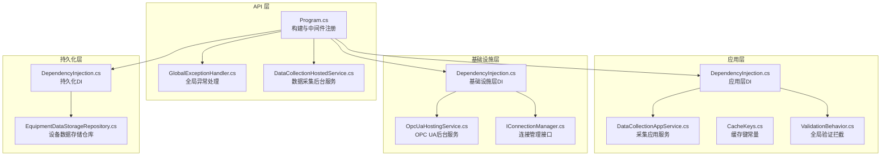
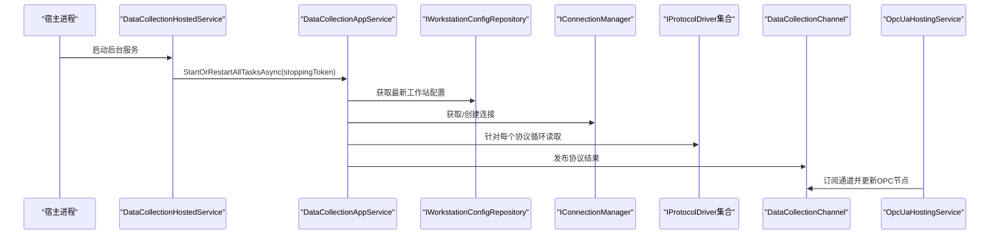
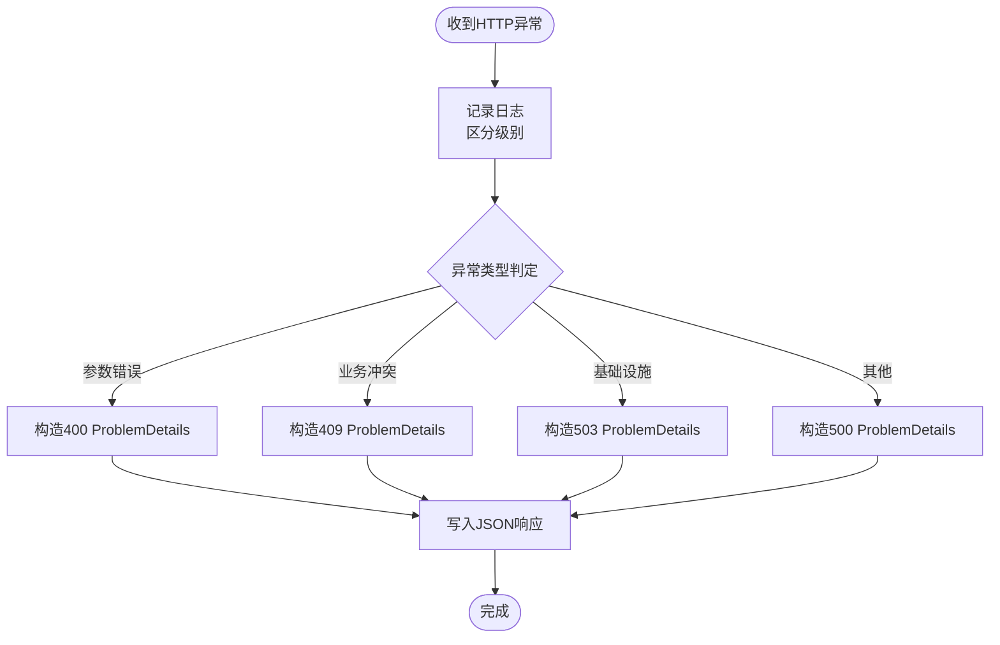
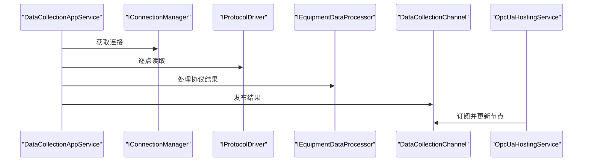
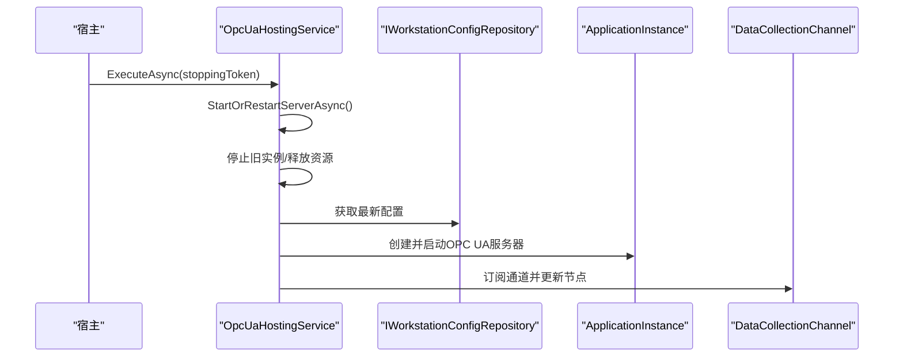
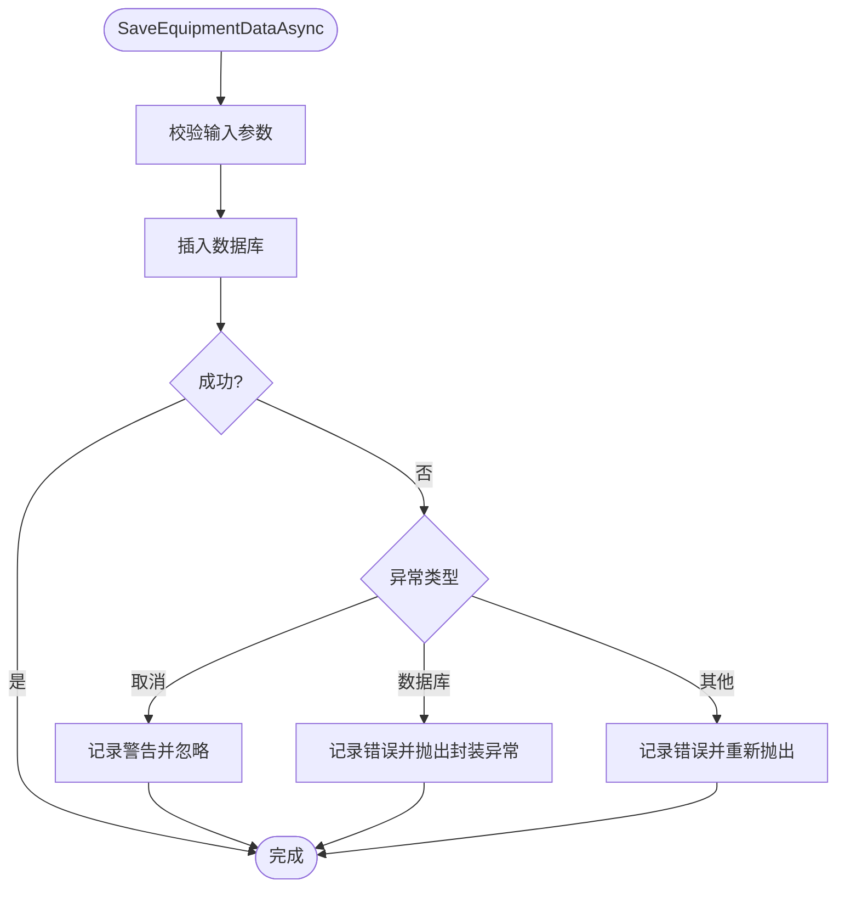
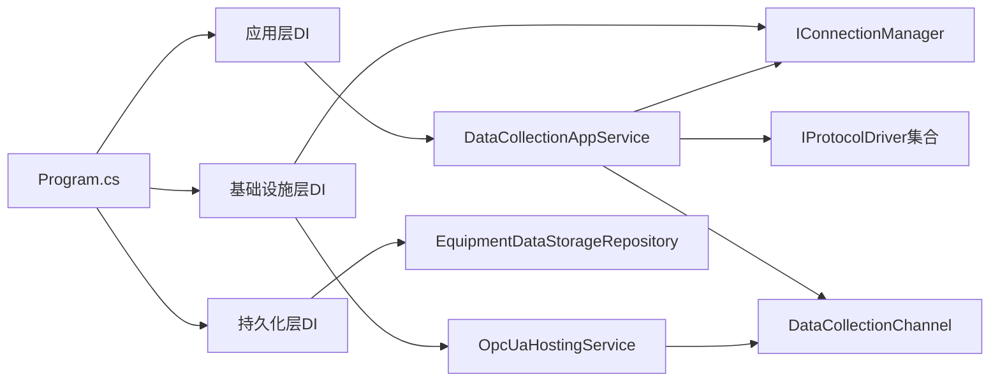

# 紧急情况处理与恢复

<cite>
**本文引用的文件**
- [Program.cs](file://IndustrialDataSolution/IndustrialDataProcessor.Api/Program.cs)
- [GlobalExceptionHandler.cs](file://IndustrialDataSolution/IndustrialDataProcessor.Api/Middleware/GlobalExceptionHandler.cs)
- [DataCollectionHostedService.cs](file://IndustrialDataSolution/IndustrialDataProcessor.Api/BackgroundServices/DataCollectionHostedService.cs)
- [appsettings.json](file://IndustrialDataSolution/IndustrialDataProcessor.Api/appsettings.json)
- [appsettings.Development.json](file://IndustrialDataSolution/IndustrialDataProcessor.Api/appsettings.Development.json)
- [InfrastructureException.cs](file://IndustrialDataSolution/IndustrialDataProcessor.Domain/Exceptions/InfrastructureException.cs)
- [CacheKeys.cs](file://IndustrialDataSolution/IndustrialDataProcessor.Application/Constants/CacheKeys.cs)
- [DataCollectionAppService.cs](file://IndustrialDataSolution/IndustrialDataProcessor.Application/Services/DataCollectionAppService.cs)
- [DependencyInjection.cs（应用层）](file://IndustrialDataSolution/IndustrialDataProcessor.Application/DependencyInjection.cs)
- [DependencyInjection.cs（基础设施层）](file://IndustrialDataSolution/IndustrialDataProcessor.Infrastructure/DependencyInjection.cs)
- [DependencyInjection.cs（持久化层）](file://IndustrialDataSolution/IndustrialDataProcessor.Infrastructure.Persistence.SqlSugar/DependencyInjection.cs)
- [IWorkstationConfigRepository.cs](file://IndustrialDataSolution/IndustrialDataProcessor.Domain/Repositories/IWorkstationConfigRepository.cs)
- [OpcUaHostingService.cs](file://IndustrialDataSolution/IndustrialDataProcessor.Infrastructure/BackgroundServices/OpcUaHostingService.cs)
- [IConnectionManager.cs](file://IndustrialDataSolution/IndustrialDataProcessor.Domain/Communication/IConnection/IConnectionManager.cs)
- [EquipmentDataStorageRepository.cs](file://IndustrialDataSolution/IndustrialDataProcessor.Infrastructure.Persistence.SqlSugar/Repositories/EquipmentDataStorageRepository.cs)
- [ValidationBehavior.cs](file://IndustrialDataSolution/IndustrialDataProcessor.Application/Behaviors/ValidationBehavior.cs)
</cite>

## 目录
1. [简介](#简介)
2. [项目结构](#项目结构)
3. [核心组件](#核心组件)
4. [架构总览](#架构总览)
5. [详细组件分析](#详细组件分析)
6. [依赖关系分析](#依赖关系分析)
7. [性能考量](#性能考量)
8. [故障排查指南](#故障排查指南)
9. [结论](#结论)
10. [附录](#附录)

## 简介
本指南面向DDD工业数据处理解决方案在紧急情况下的应急响应与系统恢复，覆盖系统崩溃与异常重启的快速诊断、服务恢复与数据完整性检查；崩溃转储分析（内存转储获取、符号配置、原因定位）；数据库故障的主从切换、数据恢复与事务回滚；关键服务中断的降级模式、缓存预热与手动同步；灾难恢复计划（备份验证、恢复测试、业务连续性）；紧急回滚策略（版本回退、配置恢复、数据迁移）；以及紧急联系人与升级流程、应急演练与培训计划。

## 项目结构
系统采用多层架构（API、应用、领域、基础设施、持久化），通过依赖注入组织服务，后台托管服务负责数据采集与OPC UA发布，中间件统一异常处理，健康检查暴露运行状态。

图表来源
- [Program.cs](file://IndustrialDataSolution/IndustrialDataProcessor.Api/Program.cs#L10-L51)
- [GlobalExceptionHandler.cs](file://IndustrialDataSolution/IndustrialDataProcessor.Api/Middleware/GlobalExceptionHandler.cs#L8-L47)
- [DataCollectionHostedService.cs](file://IndustrialDataSolution/IndustrialDataProcessor.Api/BackgroundServices/DataCollectionHostedService.cs#L8-L26)
- [DependencyInjection.cs（应用层）](file://IndustrialDataSolution/IndustrialDataProcessor.Application/DependencyInjection.cs#L16-L39)
- [DataCollectionAppService.cs](file://IndustrialDataSolution/IndustrialDataProcessor.Application/Services/DataCollectionAppService.cs#L10-L41)
- [DependencyInjection.cs（基础设施层）](file://IndustrialDataSolution/IndustrialDataProcessor.Infrastructure/DependencyInjection.cs#L17-L46)
- [OpcUaHostingService.cs](file://IndustrialDataSolution/IndustrialDataProcessor.Infrastructure/BackgroundServices/OpcUaHostingService.cs#L20-L61)
- [DependencyInjection.cs（持久化层）](file://IndustrialDataSolution/IndustrialDataProcessor.Infrastructure.Persistence.SqlSugar/DependencyInjection.cs#L11-L46)
- [EquipmentDataStorageRepository.cs](file://IndustrialDataSolution/IndustrialDataProcessor.Infrastructure.Persistence.SqlSugar/Repositories/EquipmentDataStorageRepository.cs#L38-L72)

章节来源
- [Program.cs](file://IndustrialDataSolution/IndustrialDataProcessor.Api/Program.cs#L10-L51)
- [DependencyInjection.cs（应用层）](file://IndustrialDataSolution/IndustrialDataProcessor.Application/DependencyInjection.cs#L16-L39)
- [DependencyInjection.cs（基础设施层）](file://IndustrialDataSolution/IndustrialDataProcessor.Infrastructure/DependencyInjection.cs#L17-L46)
- [DependencyInjection.cs（持久化层）](file://IndustrialDataSolution/IndustrialDataProcessor.Infrastructure.Persistence.SqlSugar/DependencyInjection.cs#L11-L46)

## 核心组件
- API入口与中间件
  - 程序入口注册内存缓存、应用/基础设施/持久化层、后台服务、健康检查、控制器、Swagger与全局异常处理中间件。
- 全局异常处理
  - 统一记录日志并输出RFC 7807风格ProblemDetails，区分参数、业务、基础设施与未知错误，便于监控与告警。
- 数据采集后台服务
  - 启动任务管理器，常驻等待宿主停止信号，负责触发采集逻辑。
- 应用服务与验证
  - 采集应用服务按协议独立循环采集，异常隔离，聚合结果推送至进程内通道；全局验证拦截器在MediatR流水线前置校验。
- 基础设施与OPC UA
  - 基础设施层注册连接管理器、设备数据处理器、协议驱动集合；OPC UA后台服务启动/重启服务器、订阅采集通道并更新节点。
- 持久化与数据库
  - 通过SqlSugar客户端连接PostgreSQL，提供设备数据存储仓库，封装异常与日志。

章节来源
- [Program.cs](file://IndustrialDataSolution/IndustrialDataProcessor.Api/Program.cs#L14-L51)
- [GlobalExceptionHandler.cs](file://IndustrialDataSolution/IndustrialDataProcessor.Api/Middleware/GlobalExceptionHandler.cs#L12-L47)
- [DataCollectionHostedService.cs](file://IndustrialDataSolution/IndustrialDataProcessor.Api/BackgroundServices/DataCollectionHostedService.cs#L15-L26)
- [DependencyInjection.cs（应用层）](file://IndustrialDataSolution/IndustrialDataProcessor.Application/DependencyInjection.cs#L21-L36)
- [DataCollectionAppService.cs](file://IndustrialDataSolution/IndustrialDataProcessor.Application/Services/DataCollectionAppService.cs#L22-L41)
- [DependencyInjection.cs（基础设施层）](file://IndustrialDataSolution/IndustrialDataProcessor.Infrastructure/DependencyInjection.cs#L30-L62)
- [OpcUaHostingService.cs](file://IndustrialDataSolution/IndustrialDataProcessor.Infrastructure/BackgroundServices/OpcUaHostingService.cs#L45-L99)
- [DependencyInjection.cs（持久化层）](file://IndustrialDataSolution/IndustrialDataProcessor.Infrastructure.Persistence.SqlSugar/DependencyInjection.cs#L15-L43)
- [EquipmentDataStorageRepository.cs](file://IndustrialDataSolution/IndustrialDataProcessor.Infrastructure.Persistence.SqlSugar/Repositories/EquipmentDataStorageRepository.cs#L38-L72)

## 架构总览
系统通过“后台服务+进程内通道+OPC UA发布”的方式实现数据采集与对外发布解耦；异常处理与健康检查贯穿API层；数据库通过SqlSugar访问PostgreSQL，仓储负责数据落盘与异常包装。

图表来源
- [DataCollectionHostedService.cs](file://IndustrialDataSolution/IndustrialDataProcessor.Api/BackgroundServices/DataCollectionHostedService.cs#L15-L26)
- [DataCollectionAppService.cs](file://IndustrialDataSolution/IndustrialDataProcessor.Application/Services/DataCollectionAppService.cs#L22-L41)
- [IWorkstationConfigRepository.cs](file://IndustrialDataSolution/IndustrialDataProcessor.Domain/Repositories/IWorkstationConfigRepository.cs#L10)
- [IConnectionManager.cs](file://IndustrialDataSolution/IndustrialDataProcessor.Domain/Communication/IConnection/IConnectionManager.cs#L12)
- [OpcUaHostingService.cs](file://IndustrialDataSolution/IndustrialDataProcessor.Infrastructure/BackgroundServices/OpcUaHostingService.cs#L161)

## 详细组件分析

### 全局异常处理与健康检查
- 异常分类与响应
  - 参数类异常（400）、业务规则冲突（409）、基础设施不可用（503）、未知错误（500）。
  - 返回ProblemDetails，包含状态码、标题、详情、实例与类型URI；验证失败时返回标准化错误字典。
- 健康检查
  - 注册健康检查端点，便于外部探针检测服务可用性。

图表来源
- [GlobalExceptionHandler.cs](file://IndustrialDataSolution/IndustrialDataProcessor.Api/Middleware/GlobalExceptionHandler.cs#L12-L47)
- [Program.cs](file://IndustrialDataSolution/IndustrialDataProcessor.Api/Program.cs#L27-L49)

章节来源
- [GlobalExceptionHandler.cs](file://IndustrialDataSolution/IndustrialDataProcessor.Api/Middleware/GlobalExceptionHandler.cs#L12-L47)
- [Program.cs](file://IndustrialDataSolution/IndustrialDataProcessor.Api/Program.cs#L27-L49)

### 数据采集与通道发布
- 采集流程
  - 加载最新工作站配置，按协议独立循环；每个协议线程独立运行，异常隔离；结果聚合后经设备数据处理器加工并通过通道发布。
- 通道与下游
  - OPC UA后台服务订阅通道，更新节点；采集应用服务在finally中统一收尾并发布，避免断线状态丢失。

图表来源
- [DataCollectionAppService.cs](file://IndustrialDataSolution/IndustrialDataProcessor.Application/Services/DataCollectionAppService.cs#L46-L199)
- [OpcUaHostingService.cs](file://IndustrialDataSolution/IndustrialDataProcessor.Infrastructure/BackgroundServices/OpcUaHostingService.cs#L161)

章节来源
- [DataCollectionAppService.cs](file://IndustrialDataSolution/IndustrialDataProcessor.Application/Services/DataCollectionAppService.cs#L22-L41)
- [DataCollectionAppService.cs](file://IndustrialDataSolution/IndustrialDataProcessor.Application/Services/DataCollectionAppService.cs#L46-L199)
- [OpcUaHostingService.cs](file://IndustrialDataSolution/IndustrialDataProcessor.Infrastructure/BackgroundServices/OpcUaHostingService.cs#L161)

### OPC UA后台服务与重启
- 启动/重启流程
  - 串行化重启，停止旧实例、释放资源、创建新生命周期Token、启动新服务器；订阅通道持续更新节点。
- 写入反推
  - OPC客户端写入触发表达式逆向转换，驱动写入底层设备。

图表来源
- [OpcUaHostingService.cs](file://IndustrialDataSolution/IndustrialDataProcessor.Infrastructure/BackgroundServices/OpcUaHostingService.cs#L45-L99)
- [OpcUaHostingService.cs](file://IndustrialDataSolution/IndustrialDataProcessor.Infrastructure/BackgroundServices/OpcUaHostingService.cs#L101-L184)

章节来源
- [OpcUaHostingService.cs](file://IndustrialDataSolution/IndustrialDataProcessor.Infrastructure/BackgroundServices/OpcUaHostingService.cs#L63-L99)
- [OpcUaHostingService.cs](file://IndustrialDataSolution/IndustrialDataProcessor.Infrastructure/BackgroundServices/OpcUaHostingService.cs#L101-L184)

### 数据库持久化与异常包装
- 存储流程
  - 设备数据入库前进行参数校验；捕获取消、数据库与未知异常，分别记录日志并按场景抛出或返回。
- 连接配置
  - 通过配置节读取PostgreSQL连接字符串，启用连接池与超时设置。

图表来源
- [EquipmentDataStorageRepository.cs](file://IndustrialDataSolution/IndustrialDataProcessor.Infrastructure.Persistence.SqlSugar/Repositories/EquipmentDataStorageRepository.cs#L38-L72)
- [appsettings.json](file://IndustrialDataSolution/IndustrialDataProcessor.Api/appsettings.json#L10-L12)

章节来源
- [EquipmentDataStorageRepository.cs](file://IndustrialDataSolution/IndustrialDataProcessor.Infrastructure.Persistence.SqlSugar/Repositories/EquipmentDataStorageRepository.cs#L38-L72)
- [appsettings.json](file://IndustrialDataSolution/IndustrialDataProcessor.Api/appsettings.json#L10-L12)

## 依赖关系分析
- 层间依赖
  - API层依赖应用层与基础设施层；应用层依赖领域模型与基础设施层的连接管理器与协议驱动；基础设施层依赖领域仓储与OPC UA库；持久化层依赖SqlSugar与PostgreSQL。
- 后台服务耦合
  - 数据采集后台服务与应用服务强耦合；OPC UA后台服务通过通道与采集应用服务解耦。
- 异常边界
  - 基础设施异常在应用层被识别为503，由全局异常处理统一响应。

图表来源
- [Program.cs](file://IndustrialDataSolution/IndustrialDataProcessor.Api/Program.cs#L19-L22)
- [DependencyInjection.cs（应用层）](file://IndustrialDataSolution/IndustrialDataProcessor.Application/DependencyInjection.cs#L21-L29)
- [DependencyInjection.cs（基础设施层）](file://IndustrialDataSolution/IndustrialDataProcessor.Infrastructure/DependencyInjection.cs#L30-L46)
- [DependencyInjection.cs（持久化层）](file://IndustrialDataSolution/IndustrialDataProcessor.Infrastructure.Persistence.SqlSugar/DependencyInjection.cs#L15-L43)

章节来源
- [Program.cs](file://IndustrialDataSolution/IndustrialDataProcessor.Api/Program.cs#L19-L22)
- [DependencyInjection.cs（应用层）](file://IndustrialDataSolution/IndustrialDataProcessor.Application/DependencyInjection.cs#L21-L29)
- [DependencyInjection.cs（基础设施层）](file://IndustrialDataSolution/IndustrialDataProcessor.Infrastructure/DependencyInjection.cs#L30-L46)
- [DependencyInjection.cs（持久化层）](file://IndustrialDataSolution/IndustrialDataProcessor.Infrastructure.Persistence.SqlSugar/DependencyInjection.cs#L15-L43)

## 性能考量
- 连接复用与异常隔离
  - 采集应用服务按协议独立循环，异常不传播到其他协议，降低整体抖动。
- 连接池与超时
  - PostgreSQL连接池参数与命令超时在配置中设置，有助于稳定长连接与查询性能。
- 缓存与通道
  - 内存缓存与进程内通道减少跨进程/网络开销，提升吞吐。

章节来源
- [DataCollectionAppService.cs](file://IndustrialDataSolution/IndustrialDataProcessor.Application/Services/DataCollectionAppService.cs#L46-L199)
- [appsettings.json](file://IndustrialDataSolution/IndustrialDataProcessor.Api/appsettings.json#L10-L12)
- [Program.cs](file://IndustrialDataSolution/IndustrialDataProcessor.Api/Program.cs#L14-L15)

## 故障排查指南

### 系统崩溃与异常重启应急响应
- 快速诊断
  - 查看健康检查端点与日志，确认服务存活与异常类型；结合全局异常处理响应体定位问题来源。
  - 检查采集后台服务是否仍在运行，确认任务管理器是否启动。
- 服务恢复
  - 重启应用进程；若OPC UA异常，调用后台服务的重启方法，确保证书与配置加载成功。
  - 若数据库异常，检查连接字符串与连接池状态，必要时重建连接。
- 数据完整性检查
  - 对比设备数据入库时间戳与采集通道发布时间，确认断点续传与重复写入风险。

章节来源
- [Program.cs](file://IndustrialDataSolution/IndustrialDataProcessor.Api/Program.cs#L27-L49)
- [DataCollectionHostedService.cs](file://IndustrialDataSolution/IndustrialDataProcessor.Api/BackgroundServices/DataCollectionHostedService.cs#L15-L26)
- [OpcUaHostingService.cs](file://IndustrialDataSolution/IndustrialDataProcessor.Infrastructure/BackgroundServices/OpcUaHostingService.cs#L63-L99)
- [EquipmentDataStorageRepository.cs](file://IndustrialDataSolution/IndustrialDataProcessor.Infrastructure.Persistence.SqlSugar/Repositories/EquipmentDataStorageRepository.cs#L38-L72)

### 崩溃转储分析方法
- 内存转储获取
  - 在Windows上可使用任务管理器或调试工具在服务崩溃时生成转储文件；在Linux上可使用gcore或系统崩溃转储机制。
- 符号文件配置
  - 配置PDB符号路径，确保调试器可加载符号；在CI/CD中保留构建产物中的符号文件。
- 崩溃原因分析
  - 结合全局异常处理日志与堆栈信息，定位异常类型与触发点；关注基础设施异常与数据库异常分支。

章节来源
- [GlobalExceptionHandler.cs](file://IndustrialDataSolution/IndustrialDataProcessor.Api/Middleware/GlobalExceptionHandler.cs#L12-L47)
- [InfrastructureException.cs](file://IndustrialDataSolution/IndustrialDataProcessor.Domain/Exceptions/InfrastructureException.cs#L5-L9)

### 数据库故障紧急处理
- 主从切换
  - 将应用连接指向备用数据库实例，确认连接字符串与认证信息；重启应用以重新建立连接池。
- 数据恢复
  - 基于备份进行恢复，优先恢复最近可用时间点；验证关键表完整性与索引。
- 事务回滚
  - 对于误操作事务，基于审计日志与备份进行回滚或补偿；严格控制回滚范围与一致性。

章节来源
- [appsettings.json](file://IndustrialDataSolution/IndustrialDataProcessor.Api/appsettings.json#L10-L12)
- [DependencyInjection.cs（持久化层）](file://IndustrialDataSolution/IndustrialDataProcessor.Infrastructure.Persistence.SqlSugar/DependencyInjection.cs#L15-L26)
- [EquipmentDataStorageRepository.cs](file://IndustrialDataSolution/IndustrialDataProcessor.Infrastructure.Persistence.SqlSugar/Repositories/EquipmentDataStorageRepository.cs#L38-L72)

### 关键服务中断的临时缓解
- 降级模式
  - 关闭非关键后台服务，仅保留数据采集与OPC UA发布；对API端点进行限流与熔断。
- 缓存预热
  - 利用缓存键常量预热热点配置，减少首次访问延迟。
- 手动数据同步
  - 在OPC UA侧手动触发一次全量更新，确保外部系统可见最新状态。

章节来源
- [CacheKeys.cs](file://IndustrialDataSolution/IndustrialDataProcessor.Application/Constants/CacheKeys.cs#L5)
- [OpcUaHostingService.cs](file://IndustrialDataSolution/IndustrialDataProcessor.Infrastructure/BackgroundServices/OpcUaHostingService.cs#L161)

### 灾难恢复计划
- 备份验证
  - 定期验证备份文件可恢复性，模拟恢复流程。
- 恢复测试
  - 在隔离环境进行完整恢复测试，验证数据一致性与服务可用性。
- 业务连续性
  - 准备热备节点与异地多活部署，缩短RTO/RPO目标。

章节来源
- [EquipmentDataStorageRepository.cs](file://IndustrialDataSolution/IndustrialDataProcessor.Infrastructure.Persistence.SqlSugar/Repositories/EquipmentDataStorageRepository.cs#L38-L72)

### 紧急回滚策略
- 版本回退
  - 回退到上一个稳定镜像或容器标签，保持配置不变。
- 配置恢复
  - 使用最近备份的配置文件替换当前配置，确保连接字符串与授权码正确。
- 数据迁移
  - 如涉及Schema变更，先在测试环境验证迁移脚本，再在维护窗口执行。

章节来源
- [appsettings.json](file://IndustrialDataSolution/IndustrialDataProcessor.Api/appsettings.json#L10-L12)
- [appsettings.Development.json](file://IndustrialDataSolution/IndustrialDataProcessor.Api/appsettings.Development.json#L1-L9)

### 紧急联系人与升级流程
- 联系人
  - 运维负责人、数据库管理员、平台架构师、外部供应商支持。
- 升级流程
  - 一线值班人员初步处置；若无法解决，升级至二线专家；重大事件启动应急预案并通知管理层。

章节来源
- [GlobalExceptionHandler.cs](file://IndustrialDataSolution/IndustrialDataProcessor.Api/Middleware/GlobalExceptionHandler.cs#L12-L47)

### 应急演练与培训
- 演练内容
  - 系统重启、数据库故障切换、OPC UA异常重启、采集中断与通道恢复。
- 培训计划
  - 分层培训：基础运维、应用开发、数据库与平台工程；定期考核与复盘。

章节来源
- [DataCollectionHostedService.cs](file://IndustrialDataSolution/IndustrialDataProcessor.Api/BackgroundServices/DataCollectionHostedService.cs#L15-L26)
- [OpcUaHostingService.cs](file://IndustrialDataSolution/IndustrialDataProcessor.Infrastructure/BackgroundServices/OpcUaHostingService.cs#L63-L99)

## 结论
本指南基于现有代码结构与异常处理机制，提供了从快速诊断、服务恢复、数据库故障处理到灾难恢复与回滚策略的完整流程。建议在生产环境中完善监控告警、备份验证与演练机制，持续优化异常分类与日志策略，确保在紧急情况下能够快速、可控地恢复业务。

## 附录
- 配置参考
  - 连接字符串与授权码位于配置文件中，确保在部署时正确注入。
- 验证与行为
  - 全局验证拦截器在请求进入处理链前执行，有助于提前发现参数问题。

章节来源
- [appsettings.json](file://IndustrialDataSolution/IndustrialDataProcessor.Api/appsettings.json#L10-L15)
- [ValidationBehavior.cs](file://IndustrialDataSolution/IndustrialDataProcessor.Application/Behaviors/ValidationBehavior.cs#L12-L28)