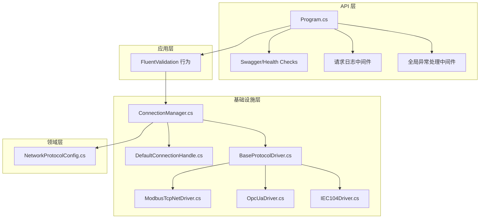
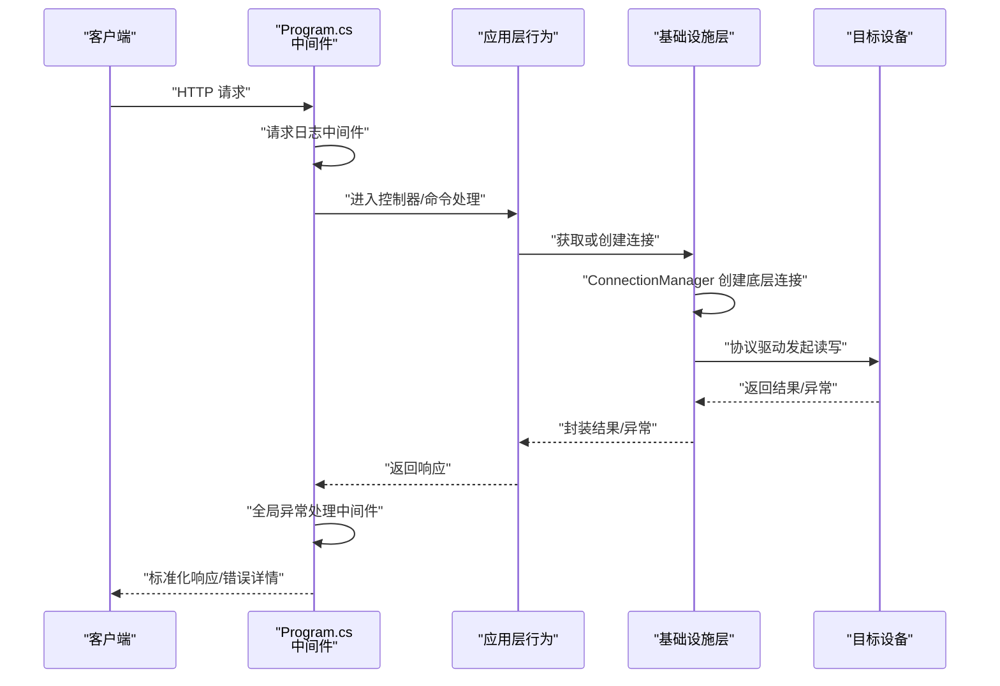
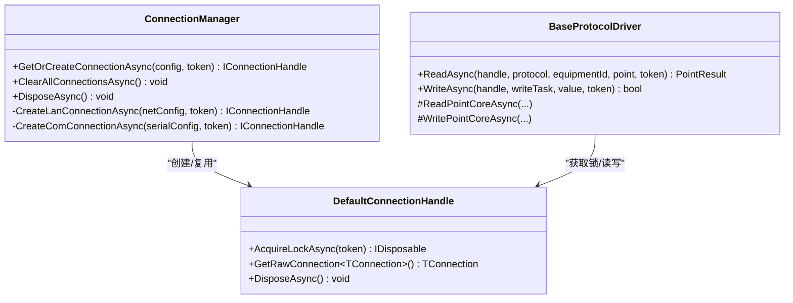
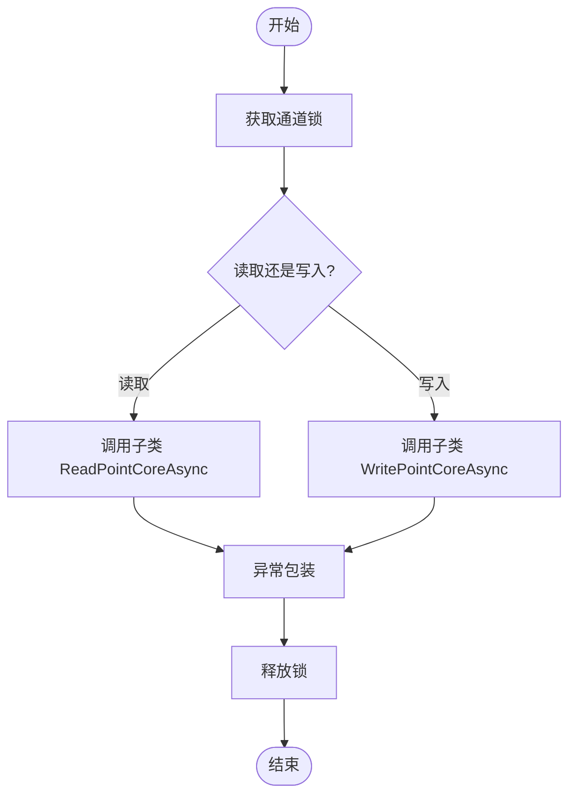
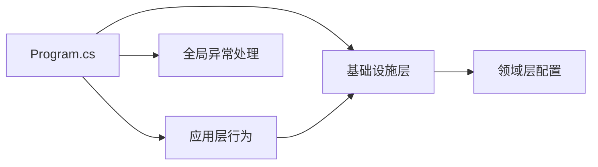

# 网络连接问题排查

<cite>
**本文引用的文件**
- [Program.cs](file://IndustrialDataSolution/IndustrialDataProcessor.Api/Program.cs)
- [appsettings.json](file://IndustrialDataSolution/IndustrialDataProcessor.Api/appsettings.json)
- [appsettings.Development.json](file://IndustrialDataSolution/IndustrialDataProcessor.Api/appsettings.Development.json)
- [GlobalExceptionHandler.cs](file://IndustrialDataSolution/IndustrialDataProcessor.Api/Middleware/GlobalExceptionHandler.cs)
- [ValidationBehavior.cs](file://IndustrialDataSolution/IndustrialDataProcessor.Application/Behaviors/ValidationBehavior.cs)
- [ConnectionManager.cs](file://IndustrialDataSolution/IndustrialDataProcessor.Infrastructure/Communication/Connection/ConnectionManager.cs)
- [DefaultConnectionHandle.cs](file://IndustrialDataSolution/IndustrialDataProcessor.Infrastructure/Communication/Connection/DefaultConnectionHandle.cs)
- [BaseProtocolDriver.cs](file://IndustrialDataSolution/IndustrialDataProcessor.Infrastructure/Communication/Drivers/TcpCommon/BaseProtocolDriver.cs)
- [ModbusTcpNetDriver.cs](file://IndustrialDataSolution/IndustrialDataProcessor.Infrastructure/Communication/Drivers/TcpCommon/ModbusTcpNetDriver.cs)
- [OpcUaDriver.cs](file://IndustrialDataSolution/IndustrialDataProcessor.Infrastructure/Communication/Drivers/TcpSpecial/OpcUaDriver.cs)
- [IEC104Driver.cs](file://IndustrialDataSolution/IndustrialDataProcessor.Infrastructure/Communication/Drivers/TcpSpecial/IEC104Driver.cs)
- [NetworkProtocolConfig.cs](file://IndustrialDataSolution/IndustrialDataProcessor.Domain/Workstation/Configs/ProtocolSub/NetworkProtocolConfig.cs)
- [CommunicationException.cs](file://IndustrialDataSolution/IndustrialDataProcessor.Share/Exceptions/Communication/CommunicationException.cs)
- [DeviceUnavailableException.cs](file://IndustrialDataSolution/IndustrialDataProcessor.Share/Exceptions/Communication/DeviceUnavailableException.cs)
- [TransientCommunicationException.cs](file://IndustrialDataSolution/IndustrialDataProcessor.Share/Exceptions/Communication/TransientCommunicationException.cs)
</cite>

## 目录
1. [简介](#简介)
2. [项目结构](#项目结构)
3. [核心组件](#核心组件)
4. [架构总览](#架构总览)
5. [详细组件分析](#详细组件分析)
6. [依赖关系分析](#依赖关系分析)
7. [性能考量](#性能考量)
8. [故障排查指南](#故障排查指南)
9. [结论](#结论)
10. [附录](#附录)

## 简介
本指南面向DDD工业数据处理解决方案在生产环境中遇到的网络连接问题，提供系统化的排查方法与修复建议。内容覆盖连通性测试（ping、端口扫描、路由追踪）、防火墙配置（入站/出站/端口放行）、端口占用排查（netstat、PID定位、冲突解决）、网络延迟与带宽分析（traceroute、MTU、QoS）、TCP连接问题（三次握手失败、连接超时、半开连接）、工业协议特有问题（Modbus TCP、OPC UA、IEC 104）、DNS解析问题（hosts、DNS服务器、缓存清理），以及网络安全问题（SSL证书验证、网络加密、访问控制）。文档以代码库为依据，结合实际实现细节，帮助快速定位并解决问题。

## 项目结构
本项目采用分层架构，网络连接能力主要由基础设施层的连接管理器与协议驱动实现，应用层负责业务编排，API层提供HTTP入口与中间件处理异常与日志。

图表来源
- [Program.cs](file://IndustrialDataSolution/IndustrialDataProcessor.Api/Program.cs#L36-L51)
- [ConnectionManager.cs](file://IndustrialDataSolution/IndustrialDataProcessor.Infrastructure/Communication/Connection/ConnectionManager.cs#L21-L396)
- [DefaultConnectionHandle.cs](file://IndustrialDataSolution/IndustrialDataProcessor.Infrastructure/Communication/Connection/DefaultConnectionHandle.cs#L6-L50)
- [BaseProtocolDriver.cs](file://IndustrialDataSolution/IndustrialDataProcessor.Infrastructure/Communication/Drivers/TcpCommon/BaseProtocolDriver.cs#L12-L108)
- [ModbusTcpNetDriver.cs](file://IndustrialDataSolution/IndustrialDataProcessor.Infrastructure/Communication/Drivers/TcpCommon/ModbusTcpNetDriver.cs#L11-L41)
- [OpcUaDriver.cs](file://IndustrialDataSolution/IndustrialDataProcessor.Infrastructure/Communication/Drivers/TcpSpecial/OpcUaDriver.cs#L9-L21)
- [IEC104Driver.cs](file://IndustrialDataSolution/IndustrialDataProcessor.Infrastructure/Communication/Drivers/TcpSpecial/IEC104Driver.cs#L3-L6)
- [NetworkProtocolConfig.cs](file://IndustrialDataSolution/IndustrialDataProcessor.Domain/Workstation/Configs/ProtocolSub/NetworkProtocolConfig.cs#L7-L28)

章节来源
- [Program.cs](file://IndustrialDataSolution/IndustrialDataProcessor.Api/Program.cs#L10-L51)
- [appsettings.json](file://IndustrialDataSolution/IndustrialDataProcessor.Api/appsettings.json#L1-L17)

## 核心组件
- 连接管理器：负责根据协议配置创建/复用底层连接，封装超时、重连与异常处理。
- 连接句柄：提供通道级互斥锁，避免并发冲突。
- 协议驱动：抽象模板方法，统一读写流程与异常包装；具体协议驱动实现点位读写。
- 网络协议配置：LAN接口的IP、端口、可选网关等关键字段。
- 异常处理：全局中间件将异常映射为标准化ProblemDetails响应，便于前端与运维定位。

章节来源
- [ConnectionManager.cs](file://IndustrialDataSolution/IndustrialDataProcessor.Infrastructure/Communication/Connection/ConnectionManager.cs#L25-L36)
- [DefaultConnectionHandle.cs](file://IndustrialDataSolution/IndustrialDataProcessor.Infrastructure/Communication/Connection/DefaultConnectionHandle.cs#L15-L19)
- [BaseProtocolDriver.cs](file://IndustrialDataSolution/IndustrialDataProcessor.Infrastructure/Communication/Drivers/TcpCommon/BaseProtocolDriver.cs#L26-L72)
- [NetworkProtocolConfig.cs](file://IndustrialDataSolution/IndustrialDataProcessor.Domain/Workstation/Configs/ProtocolSub/NetworkProtocolConfig.cs#L17-L22)
- [GlobalExceptionHandler.cs](file://IndustrialDataSolution/IndustrialDataProcessor.Api/Middleware/GlobalExceptionHandler.cs#L12-L47)

## 架构总览
下图展示从API到基础设施层的典型调用链，以及异常处理与日志记录的位置。

图表来源
- [Program.cs](file://IndustrialDataSolution/IndustrialDataProcessor.Api/Program.cs#L38-L49)
- [GlobalExceptionHandler.cs](file://IndustrialDataSolution/IndustrialDataProcessor.Api/Middleware/GlobalExceptionHandler.cs#L12-L47)
- [ConnectionManager.cs](file://IndustrialDataSolution/IndustrialDataProcessor.Infrastructure/Communication/Connection/ConnectionManager.cs#L25-L36)
- [BaseProtocolDriver.cs](file://IndustrialDataSolution/IndustrialDataProcessor.Infrastructure/Communication/Drivers/TcpCommon/BaseProtocolDriver.cs#L26-L41)

## 详细组件分析

### 连接管理器（ConnectionManager）
- 功能职责
  - 根据协议配置创建底层连接（如Modbus TCP、OPC UA、IEC 104等）。
  - 支持LAN接口与串口接口的分发。
  - 提供连接复用与清理能力。
- 关键点
  - 超时参数透传到底层连接对象，便于统一配置。
  - OPC UA场景下进行证书校验与Endpoint选择。
  - IEC 104场景下直接建立客户端连接。
- 并发保障
  - 通过连接句柄的信号量实现通道级互斥，避免并发冲突。

图表来源
- [ConnectionManager.cs](file://IndustrialDataSolution/IndustrialDataProcessor.Infrastructure/Communication/Connection/ConnectionManager.cs#L21-L396)
- [DefaultConnectionHandle.cs](file://IndustrialDataSolution/IndustrialDataProcessor.Infrastructure/Communication/Connection/DefaultConnectionHandle.cs#L6-L50)
- [BaseProtocolDriver.cs](file://IndustrialDataSolution/IndustrialDataProcessor.Infrastructure/Communication/Drivers/TcpCommon/BaseProtocolDriver.cs#L12-L108)

章节来源
- [ConnectionManager.cs](file://IndustrialDataSolution/IndustrialDataProcessor.Infrastructure/Communication/Connection/ConnectionManager.cs#L25-L347)
- [DefaultConnectionHandle.cs](file://IndustrialDataSolution/IndustrialDataProcessor.Infrastructure/Communication/Connection/DefaultConnectionHandle.cs#L15-L42)

### 协议驱动（BaseProtocolDriver 与 ModbusTcpNetDriver）
- 模板方法模式
  - 读写流程由基类编排，子类仅实现点位读写核心逻辑。
  - 统一异常包装，便于上层识别协议类型与错误上下文。
- 并发控制
  - 使用连接句柄提供的信号量，确保同一通道的读写串行化。
- Modbus TCP
  - 通过底层库设置站号、数据格式、起始地址等参数，再调用通用扩展方法完成读写。

图表来源
- [BaseProtocolDriver.cs](file://IndustrialDataSolution/IndustrialDataProcessor.Infrastructure/Communication/Drivers/TcpCommon/BaseProtocolDriver.cs#L26-L72)
- [ModbusTcpNetDriver.cs](file://IndustrialDataSolution/IndustrialDataProcessor.Infrastructure/Communication/Drivers/TcpCommon/ModbusTcpNetDriver.cs#L13-L39)

章节来源
- [BaseProtocolDriver.cs](file://IndustrialDataSolution/IndustrialDataProcessor.Infrastructure/Communication/Drivers/TcpCommon/BaseProtocolDriver.cs#L26-L81)
- [ModbusTcpNetDriver.cs](file://IndustrialDataSolution/IndustrialDataProcessor.Infrastructure/Communication/Drivers/TcpCommon/ModbusTcpNetDriver.cs#L13-L39)

### 网络协议配置（NetworkProtocolConfig）
- 字段说明
  - 接口类型：LAN。
  - IP地址：目标设备IP。
  - 端口：目标服务端口。
  - 网关：可选的代理网关。
- 作用
  - 作为连接管理器创建底层连接的输入参数。

章节来源
- [NetworkProtocolConfig.cs](file://IndustrialDataSolution/IndustrialDataProcessor.Domain/Workstation/Configs/ProtocolSub/NetworkProtocolConfig.cs#L7-L28)

### OPC UA 与 IEC 104 驱动
- OPC UA
  - 初始化应用配置与安全策略，自动接受不受信证书（开发环境）。
  - 选择Endpoint并创建会话，支持用户名密码身份标识。
- IEC 104
  - 基于客户端库建立连接，用于电力规约通信。

章节来源
- [ConnectionManager.cs](file://IndustrialDataSolution/IndustrialDataProcessor.Infrastructure/Communication/Connection/ConnectionManager.cs#L252-L331)
- [OpcUaDriver.cs](file://IndustrialDataSolution/IndustrialDataProcessor.Infrastructure/Communication/Drivers/TcpSpecial/OpcUaDriver.cs#L9-L21)
- [IEC104Driver.cs](file://IndustrialDataSolution/IndustrialDataProcessor.Infrastructure/Communication/Drivers/TcpSpecial/IEC104Driver.cs#L3-L6)

## 依赖关系分析
- API层依赖应用层与基础设施层，通过中间件注入日志与异常处理。
- 应用层通过行为管道集成FluentValidation，前置参数校验。
- 基础设施层通过连接管理器与协议驱动实现对多种工业协议的支持。
- 领域层提供协议配置模型，约束LAN接口的关键字段。

图表来源
- [Program.cs](file://IndustrialDataSolution/IndustrialDataProcessor.Api/Program.cs#L19-L35)
- [ValidationBehavior.cs](file://IndustrialDataSolution/IndustrialDataProcessor.Application/Behaviors/ValidationBehavior.cs#L9-L31)
- [ConnectionManager.cs](file://IndustrialDataSolution/IndustrialDataProcessor.Infrastructure/Communication/Connection/ConnectionManager.cs#L21-L396)
- [NetworkProtocolConfig.cs](file://IndustrialDataSolution/IndustrialDataProcessor.Domain/Workstation/Configs/ProtocolSub/NetworkProtocolConfig.cs#L7-L28)

章节来源
- [Program.cs](file://IndustrialDataSolution/IndustrialDataProcessor.Api/Program.cs#L19-L35)
- [ValidationBehavior.cs](file://IndustrialDataSolution/IndustrialDataProcessor.Application/Behaviors/ValidationBehavior.cs#L9-L31)

## 性能考量
- 连接复用：连接管理器基于通道键复用连接，减少频繁创建/销毁带来的开销。
- 并发控制：通道级信号量确保读写串行化，避免底层协议报文交错。
- 超时配置：统一透传连接与接收超时，可根据网络状况调整。
- 日志与异常：中间件记录异常并返回标准化错误，有助于快速定位瓶颈与失败原因。

章节来源
- [ConnectionManager.cs](file://IndustrialDataSolution/IndustrialDataProcessor.Infrastructure/Communication/Connection/ConnectionManager.cs#L25-L36)
- [DefaultConnectionHandle.cs](file://IndustrialDataSolution/IndustrialDataProcessor.Infrastructure/Communication/Connection/DefaultConnectionHandle.cs#L15-L19)
- [BaseProtocolDriver.cs](file://IndustrialDataSolution/IndustrialDataProcessor.Infrastructure/Communication/Drivers/TcpCommon/BaseProtocolDriver.cs#L30-L35)
- [GlobalExceptionHandler.cs](file://IndustrialDataSolution/IndustrialDataProcessor.Api/Middleware/GlobalExceptionHandler.cs#L14-L19)

## 故障排查指南

### 一、网络连通性测试
- Ping 测试
  - 在目标主机执行 ping 目标IP，确认三层可达。
  - 若失败，检查ARP表、交换机VLAN、路由表。
- 端口扫描
  - 使用 nmap 或 telnet 验证端口开放与服务监听。
  - 结合网络协议配置中的端口字段进行核对。
- 路由追踪
  - traceroute/tracert 查看路径与丢包节点，定位网络瓶颈或黑洞路由。

### 二、防火墙配置诊断与修复
- 入站规则
  - 开放目标服务端口（如Modbus TCP默认端口、OPC UA默认端口、IEC 104端口）。
  - 限制源IP范围，仅放行可信网段。
- 出站规则
  - 确保客户端对外访问目标IP与端口的许可。
  - 检查代理/网关是否阻断流量。
- 端口放行
  - 对照网络协议配置中的端口字段逐一放行。
  - 验证放行后立即进行端口扫描确认。

章节来源
- [NetworkProtocolConfig.cs](file://IndustrialDataSolution/IndustrialDataProcessor.Domain/Workstation/Configs/ProtocolSub/NetworkProtocolConfig.cs#L22-L22)
- [ConnectionManager.cs](file://IndustrialDataSolution/IndustrialDataProcessor.Infrastructure/Communication/Connection/ConnectionManager.cs#L68-L75)

### 三、端口占用排查
- netstat 命令
  - 使用 netstat -ano 定位占用端口的PID。
- PID 查找
  - 通过任务管理器或 PowerShell 获取对应进程信息。
- 冲突解决
  - 修改应用或设备端口配置，避免冲突。
  - 如需保留占用，考虑重启服务或更换端口。

### 四、网络延迟与带宽分析
- traceroute 分析
  - 观察各跳延时与丢包，识别高延迟链路。
- MTU 设置
  - 根据路径MTU调整，避免IP分片影响实时性。
- QoS 配置
  - 为工业协议流量设置优先级，保障低抖动与高可靠。

### 五、TCP 连接问题诊断
- 三次握手失败
  - 检查SYN队列与半连接限制，确认防火墙/ACL放行。
- 连接超时
  - 结合连接管理器的超时参数与网络RTT评估，适当增大超时。
- 半开连接
  - 检查KeepAlive与超时设置，及时回收长时间空闲连接。

章节来源
- [ConnectionManager.cs](file://IndustrialDataSolution/IndustrialDataProcessor.Infrastructure/Communication/Connection/ConnectionManager.cs#L70-L72)

### 六、工业协议网络配置专项
- Modbus TCP
  - 确认IP、端口与站号配置一致。
  - 检查数据格式与起始地址设置。
- OPC UA
  - 校验Endpoint可用性与证书策略（开发环境可接受不受信证书，生产需严格校验）。
  - 用户名密码与会话超时需与服务端一致。
- IEC 104
  - 校验IP、端口与ASDU配置，关注链路与应用层状态。

章节来源
- [ModbusTcpNetDriver.cs](file://IndustrialDataSolution/IndustrialDataProcessor.Infrastructure/Communication/Drivers/TcpCommon/ModbusTcpNetDriver.cs#L19-L21)
- [ConnectionManager.cs](file://IndustrialDataSolution/IndustrialDataProcessor.Infrastructure/Communication/Connection/ConnectionManager.cs#L252-L331)
- [IEC104Driver.cs](file://IndustrialDataSolution/IndustrialDataProcessor.Infrastructure/Communication/Drivers/TcpSpecial/IEC104Driver.cs#L3-L6)

### 七、DNS 解析问题
- hosts 文件
  - 临时绑定域名与IP，验证解析是否恢复。
- DNS 服务器
  - 更换至稳定DNS（如内网DNS或公共DNS），排除递归解析异常。
- 缓存清理
  - 清理本地DNS缓存，刷新解析记录。

### 八、网络安全问题
- SSL/TLS 证书验证
  - 生产环境禁用自动接受不受信证书，确保证书链完整、域名匹配。
- 网络加密
  - 启用TLS/SSL通道，防止明文传输被窃听。
- 访问控制
  - 通过ACL与防火墙限制访问源，最小权限原则。

章节来源
- [ConnectionManager.cs](file://IndustrialDataSolution/IndustrialDataProcessor.Infrastructure/Communication/Connection/ConnectionManager.cs#L295-L299)

### 九、异常与日志辅助定位
- 全局异常处理
  - 将异常映射为标准化ProblemDetails，包含状态码、标题、详情与实例路径。
- 请求日志
  - 记录请求路径与方法，便于回溯问题发生上下文。
- 参数校验
  - 使用FluentValidation行为在进入业务前拦截无效参数，降低运行期异常概率。

章节来源
- [GlobalExceptionHandler.cs](file://IndustrialDataSolution/IndustrialDataProcessor.Api/Middleware/GlobalExceptionHandler.cs#L22-L47)
- [ValidationBehavior.cs](file://IndustrialDataSolution/IndustrialDataProcessor.Application/Behaviors/ValidationBehavior.cs#L12-L29)

### 十、常见异常类型与建议
- 通信异常
  - 通信异常：设备不可达或协议不匹配。
  - 设备不可用：目标设备离线或端口未监听。
  - 临时通信异常：瞬时网络波动，建议重试。
- 建议
  - 优先确认物理链路与二层连通性。
  - 核对协议配置与端口一致性。
  - 结合日志与异常处理响应定位根因。

章节来源
- [CommunicationException.cs](file://IndustrialDataSolution/IndustrialDataProcessor.Share/Exceptions/Communication/CommunicationException.cs#L3-L5)
- [DeviceUnavailableException.cs](file://IndustrialDataSolution/IndustrialDataProcessor.Share/Exceptions/Communication/DeviceUnavailableException.cs#L3-L5)
- [TransientCommunicationException.cs](file://IndustrialDataSolution/IndustrialDataProcessor.Share/Exceptions/Communication/TransientCommunicationException.cs#L3-L5)

## 结论
本指南基于代码库的实际实现，梳理了从API到基础设施层的网络连接路径，并提供了系统化的排查步骤。建议在生产环境中：
- 明确网络边界与访问控制策略；
- 严格证书与加密配置；
- 合理设置超时与重试；
- 利用日志与异常处理机制快速定位问题；
- 针对工业协议特性进行专项验证与优化。

## 附录
- 配置文件位置参考
  - [appsettings.json](file://IndustrialDataSolution/IndustrialDataProcessor.Api/appsettings.json#L10-L12)
  - [appsettings.Development.json](file://IndustrialDataSolution/IndustrialDataProcessor.Api/appsettings.Development.json#L1-L9)
- 关键实现参考
  - [Program.cs](file://IndustrialDataSolution/IndustrialDataProcessor.Api/Program.cs#L36-L51)
  - [ConnectionManager.cs](file://IndustrialDataSolution/IndustrialDataProcessor.Infrastructure/Communication/Connection/ConnectionManager.cs#L25-L347)
  - [BaseProtocolDriver.cs](file://IndustrialDataSolution/IndustrialDataProcessor.Infrastructure/Communication/Drivers/TcpCommon/BaseProtocolDriver.cs#L26-L72)
  - [NetworkProtocolConfig.cs](file://IndustrialDataSolution/IndustrialDataProcessor.Domain/Workstation/Configs/ProtocolSub/NetworkProtocolConfig.cs#L17-L22)