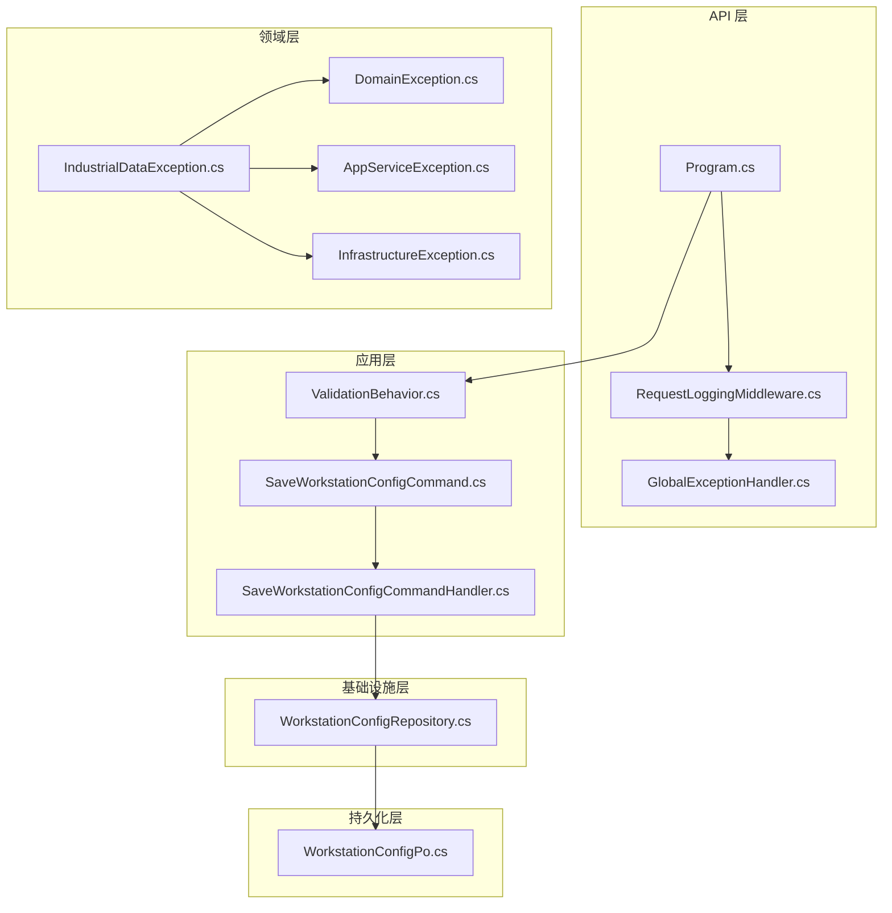
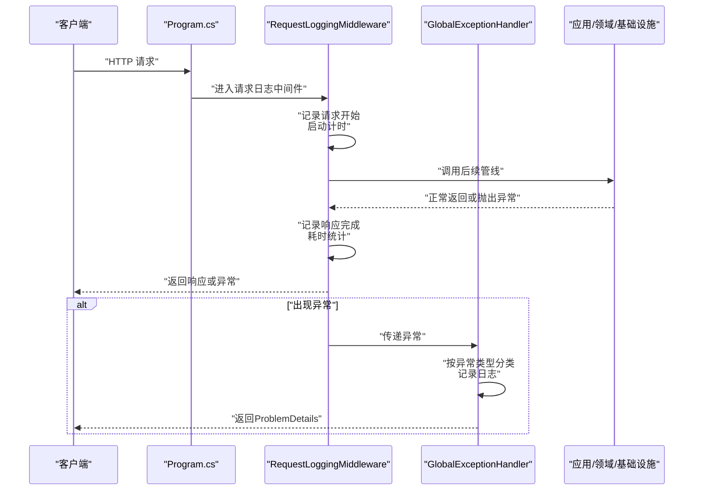
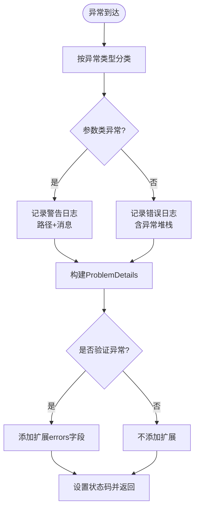
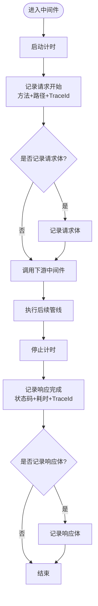
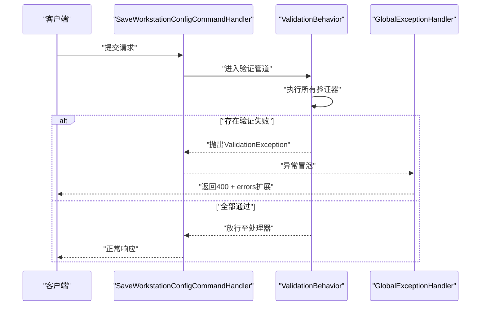
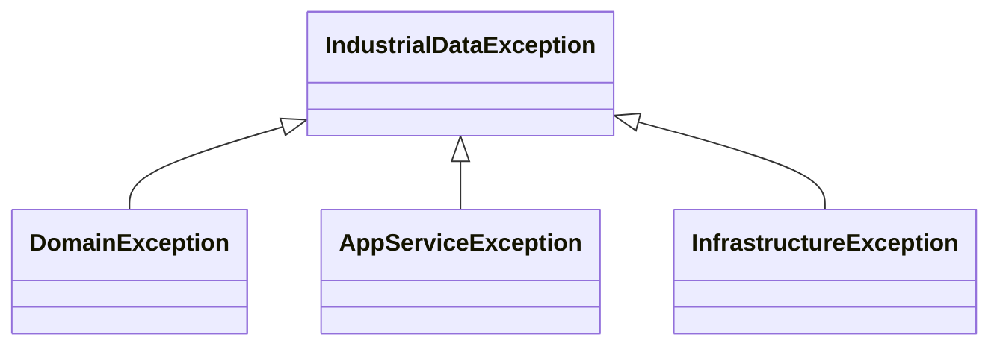
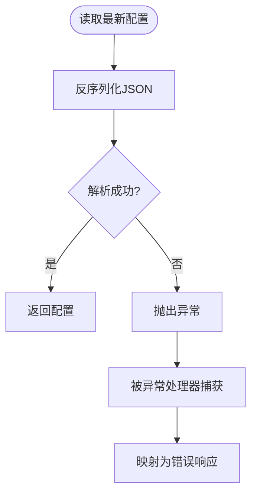
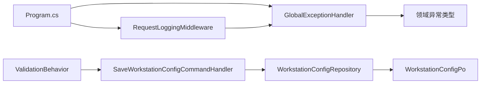

# 问题诊断与日志分析

<cite>
**本文引用的文件**
- [Program.cs](file://IndustrialDataSolution/IndustrialDataProcessor.Api/Program.cs)
- [GlobalExceptionHandler.cs](file://IndustrialDataSolution/IndustrialDataProcessor.Api/Middleware/GlobalExceptionHandler.cs)
- [RequestLoggingMiddleware.cs](file://IndustrialDataSolution/IndustrialDataProcessor.Api/Middleware/RequestLoggingMiddleware.cs)
- [ValidationBehavior.cs](file://IndustrialDataSolution/IndustrialDataProcessor.Application/Behaviors/ValidationBehavior.cs)
- [SaveWorkstationConfigCommand.cs](file://IndustrialDataSolution/IndustrialDataProcessor.Application/Commands/SaveWorkstationConfigCommand.cs)
- [SaveWorkstationConfigCommandHandler.cs](file://IndustrialDataSolution/IndustrialDataProcessor.Application/CommandHandlers/SaveWorkstationConfigCommandHandler.cs)
- [IndustrialDataException.cs](file://IndustrialDataSolution/IndustrialDataProcessor.Domain/Exceptions/IndustrialDataException.cs)
- [DomainException.cs](file://IndustrialDataSolution/IndustrialDataProcessor.Domain/Exceptions/DomainException.cs)
- [AppServiceException.cs](file://IndustrialDataSolution/IndustrialDataProcessor.Domain/Exceptions/AppServiceException.cs)
- [InfrastructureException.cs](file://IndustrialDataSolution/IndustrialDataProcessor.Domain/Exceptions/InfrastructureException.cs)
- [appsettings.json](file://IndustrialDataSolution/IndustrialDataProcessor.Api/appsettings.json)
- [appsettings.Development.json](file://IndustrialDataSolution/IndustrialDataProcessor.Api/appsettings.Development.json)
- [WorkstationConfigRepository.cs](file://IndustrialDataSolution/IndustrialDataProcessor.Infrastructure/Repositories/WorkstationConfigRepository.cs)
- [WorkstationConfigPo.cs](file://IndustrialDataSolution/IndustrialDataProcessor.Infrastructure.Persistence.SqlSugar/DbEntities/WorkstationConfigPo.cs)
</cite>

## 目录
1. [简介](#简介)
2. [项目结构](#项目结构)
3. [核心组件](#核心组件)
4. [架构总览](#架构总览)
5. [详细组件分析](#详细组件分析)
6. [依赖关系分析](#依赖关系分析)
7. [性能考量](#性能考量)
8. [故障排查指南](#故障排查指南)
9. [结论](#结论)
10. [附录](#附录)

## 简介
本文件面向DDD工业数据处理解决方案的问题诊断与日志分析，围绕以下目标展开：
- 使用全局异常处理器进行问题定位：异常类型识别、日志记录格式、错误响应构建
- 请求日志中间件的工作原理：HTTP请求跟踪、响应时间分析、请求参数验证
- 日志级别选择指南：区分警告、错误与严重错误
- 异常堆栈信息分析：识别根因与影响范围
- 日志文件位置、轮转策略与存储配置
- 常见异常类型的诊断方法：参数验证失败、业务规则冲突、应用服务执行失败
- 使用日志聚合工具进行批量问题分析

## 项目结构
本项目采用分层架构（API、应用、领域、基础设施、持久化），日志与异常处理集中在API层的中间件与异常处理器中，并通过配置文件控制日志级别。

**图表来源**
- [Program.cs](file://IndustrialDataSolution/IndustrialDataProcessor.Api/Program.cs#L32-L41)
- [RequestLoggingMiddleware.cs](file://IndustrialDataSolution/IndustrialDataProcessor.Api/Middleware/RequestLoggingMiddleware.cs#L16-L84)
- [GlobalExceptionHandler.cs](file://IndustrialDataSolution/IndustrialDataProcessor.Api/Middleware/GlobalExceptionHandler.cs#L12-L47)
- [ValidationBehavior.cs](file://IndustrialDataSolution/IndustrialDataProcessor.Application/Behaviors/ValidationBehavior.cs#L12-L29)
- [SaveWorkstationConfigCommand.cs](file://IndustrialDataSolution/IndustrialDataProcessor.Application/Commands/SaveWorkstationConfigCommand.cs#L7)
- [SaveWorkstationConfigCommandHandler.cs](file://IndustrialDataSolution/IndustrialDataProcessor.Application/CommandHandlers/SaveWorkstationConfigCommandHandler.cs#L18-L30)
- [IndustrialDataException.cs](file://IndustrialDataSolution/IndustrialDataProcessor.Domain/Exceptions/IndustrialDataException.cs#L4-L8)
- [DomainException.cs](file://IndustrialDataSolution/IndustrialDataProcessor.Domain/Exceptions/DomainException.cs#L4-L7)
- [AppServiceException.cs](file://IndustrialDataSolution/IndustrialDataProcessor.Domain/Exceptions/AppServiceException.cs#L5-L8)
- [InfrastructureException.cs](file://IndustrialDataSolution/IndustrialDataProcessor.Domain/Exceptions/InfrastructureException.cs#L5-L9)
- [WorkstationConfigRepository.cs](file://IndustrialDataSolution/IndustrialDataProcessor.Infrastructure/Repositories/WorkstationConfigRepository.cs#L23-L42)
- [WorkstationConfigPo.cs](file://IndustrialDataSolution/IndustrialDataProcessor.Infrastructure.Persistence.SqlSugar/DbEntities/WorkstationConfigPo.cs#L5-L13)

**章节来源**
- [Program.cs](file://IndustrialDataSolution/IndustrialDataProcessor.Api/Program.cs#L32-L41)

## 核心组件
- 全局异常处理器：统一捕获未处理异常，按异常类型映射HTTP状态码与错误标题，记录结构化日志并返回RFC 7807兼容的ProblemDetails响应。
- 请求日志中间件：在请求进入与完成时记录请求/响应摘要、耗时与TraceId；可选记录请求/响应体（受条件限制）。
- 验证行为：在MediatR管道中统一执行FluentValidation验证，失败时抛出ValidationException。
- 应用命令与处理器：将DTO转换为领域模型并持久化，发布领域事件。
- 异常层次：基于领域层基类的分层异常（业务规则、应用服务、基础设施）。

**章节来源**
- [GlobalExceptionHandler.cs](file://IndustrialDataSolution/IndustrialDataProcessor.Api/Middleware/GlobalExceptionHandler.cs#L12-L47)
- [RequestLoggingMiddleware.cs](file://IndustrialDataSolution/IndustrialDataProcessor.Api/Middleware/RequestLoggingMiddleware.cs#L16-L84)
- [ValidationBehavior.cs](file://IndustrialDataSolution/IndustrialDataProcessor.Application/Behaviors/ValidationBehavior.cs#L12-L29)
- [SaveWorkstationConfigCommandHandler.cs](file://IndustrialDataSolution/IndustrialDataProcessor.Application/CommandHandlers/SaveWorkstationConfigCommandHandler.cs#L18-L30)
- [IndustrialDataException.cs](file://IndustrialDataSolution/IndustrialDataProcessor.Domain/Exceptions/IndustrialDataException.cs#L4-L8)

## 架构总览
下图展示请求在中间件与异常处理中的流转，以及异常分类与响应映射。

**图表来源**
- [Program.cs](file://IndustrialDataSolution/IndustrialDataProcessor.Api/Program.cs#L38-L41)
- [RequestLoggingMiddleware.cs](file://IndustrialDataSolution/IndustrialDataProcessor.Api/Middleware/RequestLoggingMiddleware.cs#L16-L84)
- [GlobalExceptionHandler.cs](file://IndustrialDataSolution/IndustrialDataProcessor.Api/Middleware/GlobalExceptionHandler.cs#L12-L47)

## 详细组件分析

### 全局异常处理器（问题定位与错误响应）
- 异常类型识别与映射
  - 参数类异常（如参数缺失、参数错误）映射为400
  - 验证异常（FluentValidation）映射为400，扩展字段包含字段级错误字典
  - 业务规则冲突（领域异常）映射为409
  - 应用服务执行失败（应用层异常）映射为500
  - 基础设施故障（基础设施异常）映射为503
  - 其他未知异常映射为500
- 日志记录格式
  - 参数类异常：记录路径与消息，使用警告级别
  - 其他异常：记录路径、方法、消息与异常堆栈，使用错误级别
- 错误响应构建
  - 返回RFC 7807的ProblemDetails，包含状态码、标题、详情、实例与类型
  - 验证异常扩展errors字段，键为属性名，值为错误消息数组

**图表来源**
- [GlobalExceptionHandler.cs](file://IndustrialDataSolution/IndustrialDataProcessor.Api/Middleware/GlobalExceptionHandler.cs#L15-L47)

**章节来源**
- [GlobalExceptionHandler.cs](file://IndustrialDataSolution/IndustrialDataProcessor.Api/Middleware/GlobalExceptionHandler.cs#L12-L92)

### 请求日志中间件（HTTP请求跟踪与响应时间分析）
- 请求跟踪
  - 记录方法、路径、TraceId，便于跨服务串联
  - 可选记录请求体（仅对POST/PUT/PATCH且JSON）
- 响应时间分析
  - 使用高精度计时器统计耗时，完成后记录状态码与耗时
  - 可选记录响应体（仅成功且JSON）
- 请求参数验证
  - 通过前置验证行为在应用层统一拦截参数错误，避免进入业务逻辑

**图表来源**
- [RequestLoggingMiddleware.cs](file://IndustrialDataSolution/IndustrialDataProcessor.Api/Middleware/RequestLoggingMiddleware.cs#L16-L84)

**章节来源**
- [RequestLoggingMiddleware.cs](file://IndustrialDataSolution/IndustrialDataProcessor.Api/Middleware/RequestLoggingMiddleware.cs#L16-L131)

### 验证行为与参数验证失败诊断
- 验证行为在MediatR管道中统一执行，收集所有验证器结果，失败时抛出ValidationException
- 全局异常处理器将此类异常映射为400，并在响应扩展中输出字段级错误字典，便于前端逐项提示

**图表来源**
- [ValidationBehavior.cs](file://IndustrialDataSolution/IndustrialDataProcessor.Application/Behaviors/ValidationBehavior.cs#L12-L29)
- [SaveWorkstationConfigCommandHandler.cs](file://IndustrialDataSolution/IndustrialDataProcessor.Application/CommandHandlers/SaveWorkstationConfigCommandHandler.cs#L18-L30)
- [GlobalExceptionHandler.cs](file://IndustrialDataSolution/IndustrialDataProcessor.Api/Middleware/GlobalExceptionHandler.cs#L22-L42)

**章节来源**
- [ValidationBehavior.cs](file://IndustrialDataSolution/IndustrialDataProcessor.Application/Behaviors/ValidationBehavior.cs#L12-L29)
- [SaveWorkstationConfigCommand.cs](file://IndustrialDataSolution/IndustrialDataProcessor.Application/Commands/SaveWorkstationConfigCommand.cs#L7)
- [SaveWorkstationConfigCommandHandler.cs](file://IndustrialDataSolution/IndustrialDataProcessor.Application/CommandHandlers/SaveWorkstationConfigCommandHandler.cs#L18-L30)
- [GlobalExceptionHandler.cs](file://IndustrialDataSolution/IndustrialDataProcessor.Api/Middleware/GlobalExceptionHandler.cs#L22-L42)

### 业务规则冲突与应用服务执行失败
- 业务规则冲突（领域异常）：映射为409，通常由领域模型校验或业务规则破坏导致
- 应用服务执行失败（应用层异常）：映射为500，通常由用例执行失败、并发冲突或工作流失败导致
- 基础设施故障（基础设施异常）：映射为503，通常由数据库或外部服务不可用导致

**图表来源**
- [IndustrialDataException.cs](file://IndustrialDataSolution/IndustrialDataProcessor.Domain/Exceptions/IndustrialDataException.cs#L4-L8)
- [DomainException.cs](file://IndustrialDataSolution/IndustrialDataProcessor.Domain/Exceptions/DomainException.cs#L4-L7)
- [AppServiceException.cs](file://IndustrialDataSolution/IndustrialDataProcessor.Domain/Exceptions/AppServiceException.cs#L5-L8)
- [InfrastructureException.cs](file://IndustrialDataSolution/IndustrialDataProcessor.Domain/Exceptions/InfrastructureException.cs#L5-L9)

**章节来源**
- [DomainException.cs](file://IndustrialDataSolution/IndustrialDataProcessor.Domain/Exceptions/DomainException.cs#L4-L7)
- [AppServiceException.cs](file://IndustrialDataSolution/IndustrialDataProcessor.Domain/Exceptions/AppServiceException.cs#L5-L8)
- [InfrastructureException.cs](file://IndustrialDataSolution/IndustrialDataProcessor.Domain/Exceptions/InfrastructureException.cs#L5-L9)
- [GlobalExceptionHandler.cs](file://IndustrialDataSolution/IndustrialDataProcessor.Api/Middleware/GlobalExceptionHandler.cs#L31-L38)

### JSON解析与持久化异常（配置加载失败场景）
- 基础设施层在解析JSON配置时可能抛出异常，此时会抛出通用异常并由上层异常处理器捕获
- 建议结合请求日志中的TraceId与异常处理器日志快速定位根因

**图表来源**
- [WorkstationConfigRepository.cs](file://IndustrialDataSolution/IndustrialDataProcessor.Infrastructure/Repositories/WorkstationConfigRepository.cs#L31-L42)
- [GlobalExceptionHandler.cs](file://IndustrialDataSolution/IndustrialDataProcessor.Api/Middleware/GlobalExceptionHandler.cs#L12-L47)

**章节来源**
- [WorkstationConfigRepository.cs](file://IndustrialDataSolution/IndustrialDataProcessor.Infrastructure/Repositories/WorkstationConfigRepository.cs#L31-L42)

## 依赖关系分析
- API层依赖注入注册顺序：先请求日志中间件，再异常处理，确保异常能被统一捕获
- 应用层通过验证行为统一拦截参数错误
- 异常处理器依赖领域层异常类型进行分类映射

**图表来源**
- [Program.cs](file://IndustrialDataSolution/IndustrialDataProcessor.Api/Program.cs#L38-L41)
- [RequestLoggingMiddleware.cs](file://IndustrialDataSolution/IndustrialDataProcessor.Api/Middleware/RequestLoggingMiddleware.cs#L16-L84)
- [GlobalExceptionHandler.cs](file://IndustrialDataSolution/IndustrialDataProcessor.Api/Middleware/GlobalExceptionHandler.cs#L12-L47)
- [ValidationBehavior.cs](file://IndustrialDataSolution/IndustrialDataProcessor.Application/Behaviors/ValidationBehavior.cs#L12-L29)
- [SaveWorkstationConfigCommandHandler.cs](file://IndustrialDataSolution/IndustrialDataProcessor.Application/CommandHandlers/SaveWorkstationConfigCommandHandler.cs#L18-L30)
- [WorkstationConfigRepository.cs](file://IndustrialDataSolution/IndustrialDataProcessor.Infrastructure/Repositories/WorkstationConfigRepository.cs#L23-L42)
- [WorkstationConfigPo.cs](file://IndustrialDataSolution/IndustrialDataProcessor.Infrastructure.Persistence.SqlSugar/DbEntities/WorkstationConfigPo.cs#L5-L13)

**章节来源**
- [Program.cs](file://IndustrialDataSolution/IndustrialDataProcessor.Api/Program.cs#L32-L41)

## 性能考量
- 请求/响应体记录默认关闭，仅在Debug级别且满足条件时开启，避免对生产性能造成显著影响
- 计时器使用高精度计时，建议在生产中关注日志量与磁盘IO开销
- 验证行为在进入业务逻辑前拦截参数错误，减少无效调用与后续处理成本

[本节为通用指导，无需列出具体文件来源]

## 故障排查指南

### 日志级别选择指南
- 警告（Warning）：参数类异常（如参数缺失、参数错误），用于提示输入问题
- 错误（Error）：除参数类以外的异常（如业务规则冲突、应用服务执行失败、基础设施故障），用于记录异常堆栈
- 严重错误（Fatal）：在当前实现中未显式使用，建议通过自定义日志扩展或外部监控系统处理

**章节来源**
- [GlobalExceptionHandler.cs](file://IndustrialDataSolution/IndustrialDataProcessor.Api/Middleware/GlobalExceptionHandler.cs#L15-L19)
- [appsettings.json](file://IndustrialDataSolution/IndustrialDataProcessor.Api/appsettings.json#L3-L6)
- [appsettings.Development.json](file://IndustrialDataSolution/IndustrialDataProcessor.Api/appsettings.Development.json#L3-L6)

### 分析异常堆栈信息
- 关注异常类型与继承链：领域异常通常表示业务规则冲突；应用层异常表示用例执行失败；基础设施异常表示外部依赖问题
- 结合请求日志中的TraceId快速定位同一事务内的请求与异常
- 对于验证异常，优先检查响应扩展中的errors字段，逐项修复

**章节来源**
- [GlobalExceptionHandler.cs](file://IndustrialDataSolution/IndustrialDataProcessor.Api/Middleware/GlobalExceptionHandler.cs#L22-L42)
- [RequestLoggingMiddleware.cs](file://IndustrialDataSolution/IndustrialDataProcessor.Api/Middleware/RequestLoggingMiddleware.cs#L23-L27)

### 日志文件位置、轮转策略与存储配置
- 默认日志级别：应用程序默认为Information，Microsoft.AspNetCore为Warning
- 日志文件位置：默认输出到控制台；生产环境可通过日志框架配置文件或运行时参数指定文件输出与轮转策略
- 存储配置：当前仓库未包含日志文件轮转与存储的具体配置，需在部署环境中补充

**章节来源**
- [appsettings.json](file://IndustrialDataSolution/IndustrialDataProcessor.Api/appsettings.json#L3-L6)
- [appsettings.Development.json](file://IndustrialDataSolution/IndustrialDataProcessor.Api/appsettings.Development.json#L3-L6)

### 常见异常类型诊断方法
- 参数验证失败
  - 现象：400错误，响应包含errors扩展
  - 处理：根据字段级错误逐一修正请求参数
- 业务规则冲突
  - 现象：409错误，提示业务规则冲突
  - 处理：检查领域模型状态与业务约束，调整请求内容或等待资源释放
- 应用服务执行失败
  - 现象：500错误，提示应用服务执行失败
  - 处理：查看异常日志堆栈，定位用例执行流程中的具体环节
- 基础设施故障
  - 现象：503错误，提示基础设施不可用
  - 处理：检查数据库连接、外部API可用性与网络连通性

**章节来源**
- [GlobalExceptionHandler.cs](file://IndustrialDataSolution/IndustrialDataProcessor.Api/Middleware/GlobalExceptionHandler.cs#L22-L38)
- [DomainException.cs](file://IndustrialDataSolution/IndustrialDataProcessor.Domain/Exceptions/DomainException.cs#L4-L7)
- [AppServiceException.cs](file://IndustrialDataSolution/IndustrialDataProcessor.Domain/Exceptions/AppServiceException.cs#L5-L8)
- [InfrastructureException.cs](file://IndustrialDataSolution/IndustrialDataProcessor.Domain/Exceptions/InfrastructureException.cs#L5-L9)

### 使用日志聚合工具进行批量问题分析
- 步骤
  - 收集日志：确保日志输出到文件或标准输出，启用必要的日志级别
  - 导入：将日志导入集中式日志平台（如ELK、Splunk、Azure Monitor等）
  - 查询：按TraceId、异常类型、时间窗口进行过滤与聚合
  - 分析：识别高频异常、根因趋势与影响范围
- 建议
  - 保留足够的上下文信息（TraceId、请求方法、路径、状态码、耗时）
  - 对敏感信息进行脱敏处理

[本节为通用指导，无需列出具体文件来源]

## 结论
通过请求日志中间件与全局异常处理器的协同，本方案实现了对请求全生命周期的可观测性与对异常的统一响应。配合清晰的异常类型映射与结构化日志，能够快速定位问题根因并评估影响范围。建议在生产环境中完善日志文件输出、轮转与存储配置，并引入日志聚合工具以支持批量问题分析与趋势监控。

[本节为总结性内容，无需列出具体文件来源]

## 附录

### API错误响应示例（ProblemDetails）
- 参数验证失败（400）
  - 包含标题、详情与扩展errors字段（字段级错误数组）
- 业务规则冲突（409）
  - 包含标题与详情
- 应用服务执行失败（500）
  - 包含标题与详情
- 基础设施不可用（503）
  - 包含标题与详情

**章节来源**
- [GlobalExceptionHandler.cs](file://IndustrialDataSolution/IndustrialDataProcessor.Api/Middleware/GlobalExceptionHandler.cs#L49-L92)