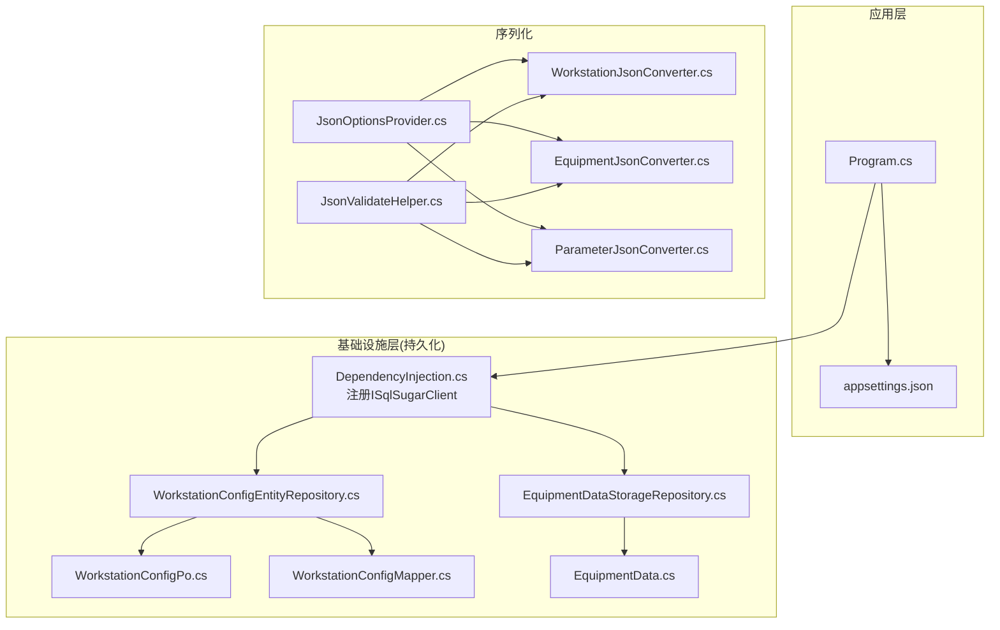
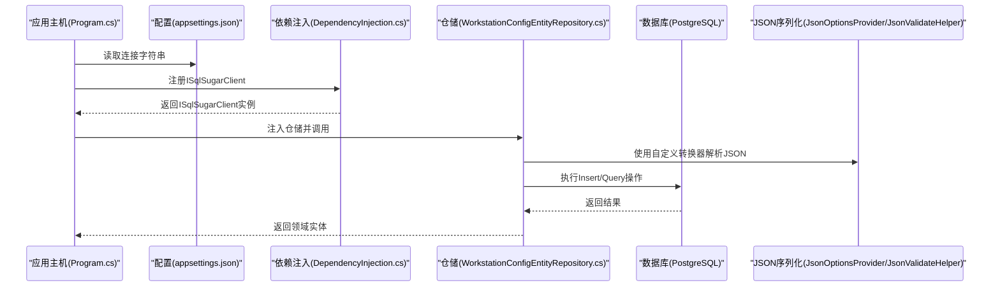
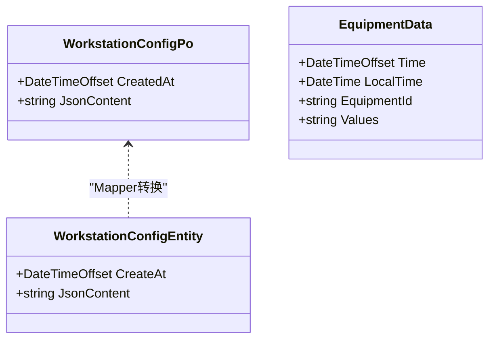
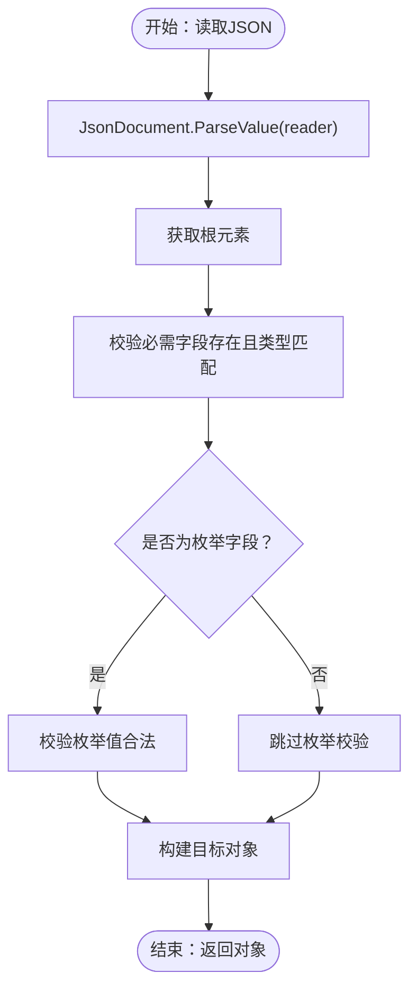
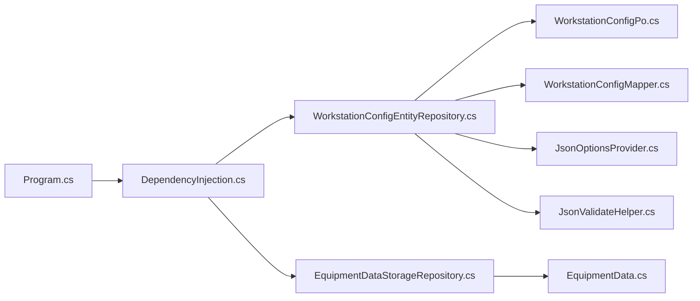

# ORM配置

<cite>
**本文引用的文件**
- [Program.cs](file://IndustrialDataSolution/IndustrialDataProcessor.Api/Program.cs)
- [appsettings.json](file://IndustrialDataSolution/IndustrialDataProcessor.Api/appsettings.json)
- [appsettings.Development.json](file://IndustrialDataSolution/IndustrialDataProcessor.Api/appsettings.Development.json)
- [DependencyInjection.cs](file://IndustrialDataSolution/IndustrialDataProcessor.Infrastructure.Persistence.SqlSugar/DependencyInjection.cs)
- [WorkstationConfigEntityRepository.cs](file://IndustrialDataSolution/IndustrialDataProcessor.Infrastructure.Persistence.SqlSugar/Repositories/WorkstationConfigEntityRepository.cs)
- [EquipmentDataStorageRepository.cs](file://IndustrialDataSolution/IndustrialDataProcessor.Infrastructure.Persistence.SqlSugar/Repositories/EquipmentDataStorageRepository.cs)
- [WorkstationConfigPo.cs](file://IndustrialDataSolution/IndustrialDataProcessor.Infrastructure.Persistence.SqlSugar/DbEntities/WorkstationConfigPo.cs)
- [EquipmentData.cs](file://IndustrialDataSolution/IndustrialDataProcessor.Infrastructure.Persistence.SqlSugar/DbEntities/EquipmentData.cs)
- [WorkstationConfigMapper.cs](file://IndustrialDataSolution/IndustrialDataProcessor.Infrastructure.Persistence.SqlSugar/Mappers/WorkstationConfigMapper.cs)
- [JsonOptionsProvider.cs](file://IndustrialDataSolution/IndustrialDataProcessor.Infrastructure/Helpers/JsonOptionsProvider.cs)
- [JsonValidateHelper.cs](file://IndustrialDataSolution/IndustrialDataProcessor.Infrastructure/Helpers/JsonValidateHelper.cs)
- [WorkstationJsonConverter.cs](file://IndustrialDataSolution/IndustrialDataProcessor.Infrastructure/Serialization/Converters/WorkstationJsonConverter.cs)
- [EquipmentJsonConverter.cs](file://IndustrialDataSolution/IndustrialDataProcessor.Infrastructure/Serialization/Converters/EquipmentJsonConverter.cs)
- [ParameterJsonConverter.cs](file://IndustrialDataSolution/IndustrialDataProcessor.Infrastructure/Serialization/Converters/ParameterJsonConverter.cs)
</cite>

## 目录
1. [简介](#简介)
2. [项目结构](#项目结构)
3. [核心组件](#核心组件)
4. [架构总览](#架构总览)
5. [详细组件分析](#详细组件分析)
6. [依赖关系分析](#依赖关系分析)
7. [性能考虑](#性能考虑)
8. [故障排查指南](#故障排查指南)
9. [结论](#结论)
10. [附录](#附录)

## 简介
本文件面向DDD工业数据处理解决方案中的ORM配置，系统性说明SqlSugar ORM在该项目中的初始化与使用方式，涵盖以下主题：
- 连接字符串设置、连接池参数与事务隔离级别的配置现状与建议
- 实体映射配置（表名映射、字段映射、复杂类型序列化）
- Json序列化转换器的实现与复杂对象的序列化/反序列化流程
- ORM性能优化配置（批量操作、查询缓存、连接复用）
- 异常处理与错误恢复（连接超时、重试策略）
- 日志配置与调试选项

## 项目结构
本项目的ORM相关代码主要分布在以下位置：
- 应用启动与配置：Program.cs、appsettings.json
- SqlSugar ORM注入与配置：Infrastructure.Persistence.SqlSugar/DependencyInjection.cs
- 仓储实现：Infrastructure.Persistence.SqlSugar/Repositories/*
- 数据库实体PO：Infrastructure.Persistence.SqlSugar/DbEntities/*
- 映射器：Infrastructure.Persistence.SqlSugar/Mappers/*
- JSON序列化与验证：Infrastructure/Helpers/* 与 Infrastructure/Serialization/Converters/*

图表来源
- [Program.cs](file://IndustrialDataSolution/IndustrialDataProcessor.Api/Program.cs#L1-L37)
- [appsettings.json](file://IndustrialDataSolution/IndustrialDataProcessor.Api/appsettings.json#L1-L17)
- [DependencyInjection.cs](file://IndustrialDataSolution/IndustrialDataProcessor.Infrastructure.Persistence.SqlSugar/DependencyInjection.cs#L1-L47)
- [WorkstationConfigEntityRepository.cs](file://IndustrialDataSolution/IndustrialDataProcessor.Infrastructure.Persistence.SqlSugar/Repositories/WorkstationConfigEntityRepository.cs#L1-L32)
- [EquipmentDataStorageRepository.cs](file://IndustrialDataSolution/IndustrialDataProcessor.Infrastructure.Persistence.SqlSugar/Repositories/EquipmentDataStorageRepository.cs#L1-L74)
- [WorkstationConfigPo.cs](file://IndustrialDataSolution/IndustrialDataProcessor.Infrastructure.Persistence.SqlSugar/DbEntities/WorkstationConfigPo.cs#L1-L15)
- [EquipmentData.cs](file://IndustrialDataSolution/IndustrialDataProcessor.Infrastructure.Persistence.SqlSugar/DbEntities/EquipmentData.cs#L1-L38)
- [WorkstationConfigMapper.cs](file://IndustrialDataSolution/IndustrialDataProcessor.Infrastructure.Persistence.SqlSugar/Mappers/WorkstationConfigMapper.cs#L1-L26)
- [JsonOptionsProvider.cs](file://IndustrialDataSolution/IndustrialDataProcessor.Infrastructure/Helpers/JsonOptionsProvider.cs#L1-L22)
- [JsonValidateHelper.cs](file://IndustrialDataSolution/IndustrialDataProcessor.Infrastructure/Helpers/JsonValidateHelper.cs#L1-L256)
- [WorkstationJsonConverter.cs](file://IndustrialDataSolution/IndustrialDataProcessor.Infrastructure/Serialization/Converters/WorkstationJsonConverter.cs#L1-L40)
- [EquipmentJsonConverter.cs](file://IndustrialDataSolution/IndustrialDataProcessor.Infrastructure/Serialization/Converters/EquipmentJsonConverter.cs#L1-L44)
- [ParameterJsonConverter.cs](file://IndustrialDataSolution/IndustrialDataProcessor.Infrastructure/Serialization/Converters/ParameterJsonConverter.cs#L1-L24)

章节来源
- [Program.cs](file://IndustrialDataSolution/IndustrialDataProcessor.Api/Program.cs#L1-L37)
- [appsettings.json](file://IndustrialDataSolution/IndustrialDataProcessor.Api/appsettings.json#L1-L17)

## 核心组件
- ISqlSugarClient注入与配置：通过依赖注入注册ISqlSugarClient，设置PostgreSQL连接、自动关闭连接、PgSql大小写策略等。
- 仓储实现：WorkstationConfigEntityRepository与EquipmentDataStorageRepository分别封装了插入与查询逻辑，并对异常进行分类处理。
- 数据库实体：WorkstationConfigPo与EquipmentData定义了表名、主键、列名、列类型（含json/jsonb）等映射信息。
- 映射器：WorkstationConfigMapper在领域实体与PO之间进行转换。
- JSON序列化：JsonOptionsProvider集中注册自定义转换器；JsonValidateHelper提供严格的JSON字段存在性、类型与枚举校验。

章节来源
- [DependencyInjection.cs](file://IndustrialDataSolution/IndustrialDataProcessor.Infrastructure.Persistence.SqlSugar/DependencyInjection.cs#L1-L47)
- [WorkstationConfigEntityRepository.cs](file://IndustrialDataSolution/IndustrialDataProcessor.Infrastructure.Persistence.SqlSugar/Repositories/WorkstationConfigEntityRepository.cs#L1-L32)
- [EquipmentDataStorageRepository.cs](file://IndustrialDataSolution/IndustrialDataProcessor.Infrastructure.Persistence.SqlSugar/Repositories/EquipmentDataStorageRepository.cs#L1-L74)
- [WorkstationConfigPo.cs](file://IndustrialDataSolution/IndustrialDataProcessor.Infrastructure.Persistence.SqlSugar/DbEntities/WorkstationConfigPo.cs#L1-L15)
- [EquipmentData.cs](file://IndustrialDataSolution/IndustrialDataProcessor.Infrastructure.Persistence.SqlSugar/DbEntities/EquipmentData.cs#L1-L38)
- [WorkstationConfigMapper.cs](file://IndustrialDataSolution/IndustrialDataProcessor.Infrastructure.Persistence.SqlSugar/Mappers/WorkstationConfigMapper.cs#L1-L26)
- [JsonOptionsProvider.cs](file://IndustrialDataSolution/IndustrialDataProcessor.Infrastructure/Helpers/JsonOptionsProvider.cs#L1-L22)
- [JsonValidateHelper.cs](file://IndustrialDataSolution/IndustrialDataProcessor.Infrastructure/Helpers/JsonValidateHelper.cs#L1-L256)

## 架构总览
下图展示了应用启动、配置加载、ORM注入、仓储调用以及JSON序列化的整体流程。

图表来源
- [Program.cs](file://IndustrialDataSolution/IndustrialDataProcessor.Api/Program.cs#L1-L37)
- [appsettings.json](file://IndustrialDataSolution/IndustrialDataProcessor.Api/appsettings.json#L10-L12)
- [DependencyInjection.cs](file://IndustrialDataSolution/IndustrialDataProcessor.Infrastructure.Persistence.SqlSugar/DependencyInjection.cs#L11-L46)
- [WorkstationConfigEntityRepository.cs](file://IndustrialDataSolution/IndustrialDataProcessor.Infrastructure.Persistence.SqlSugar/Repositories/WorkstationConfigEntityRepository.cs#L10-L31)
- [JsonOptionsProvider.cs](file://IndustrialDataSolution/IndustrialDataProcessor.Infrastructure/Helpers/JsonOptionsProvider.cs#L6-L21)
- [JsonValidateHelper.cs](file://IndustrialDataSolution/IndustrialDataProcessor.Infrastructure/Helpers/JsonValidateHelper.cs#L5-L256)

## 详细组件分析

### SqlSugar ORM初始化与配置
- 连接字符串来源：从配置文件中读取DefaultConnection，包含主机、端口、数据库、用户名、密码、连接池参数与命令超时。
- 客户端配置：设置数据库类型为PostgreSQL，启用自动关闭连接；PgSqlIsAutoToLower=false以保留列名大小写。
- 日志：DEBUG条件下可启用SQL执行日志回调（当前示例为注释状态）。

章节来源
- [appsettings.json](file://IndustrialDataSolution/IndustrialDataProcessor.Api/appsettings.json#L10-L12)
- [DependencyInjection.cs](file://IndustrialDataSolution/IndustrialDataProcessor.Infrastructure.Persistence.SqlSugar/DependencyInjection.cs#L11-L46)

### 实体映射配置
- 表名映射：通过SugarTable特性将PO类映射到数据库表。
- 字段映射：通过SugarColumn特性指定列名、主键、长度、是否可空、数据库类型（如json/jsonb）等。
- 复杂类型序列化：JsonContent与Values字段采用字符串存储，结合自定义JSON转换器在读取时进行严格校验与反序列化。

图表来源
- [WorkstationConfigPo.cs](file://IndustrialDataSolution/IndustrialDataProcessor.Infrastructure.Persistence.SqlSugar/DbEntities/WorkstationConfigPo.cs#L5-L13)
- [EquipmentData.cs](file://IndustrialDataSolution/IndustrialDataProcessor.Infrastructure.Persistence.SqlSugar/DbEntities/EquipmentData.cs#L11-L37)
- [WorkstationConfigMapper.cs](file://IndustrialDataSolution/IndustrialDataProcessor.Infrastructure.Persistence.SqlSugar/Mappers/WorkstationConfigMapper.cs#L6-L25)

章节来源
- [WorkstationConfigPo.cs](file://IndustrialDataSolution/IndustrialDataProcessor.Infrastructure.Persistence.SqlSugar/DbEntities/WorkstationConfigPo.cs#L1-L15)
- [EquipmentData.cs](file://IndustrialDataSolution/IndustrialDataProcessor.Infrastructure.Persistence.SqlSugar/DbEntities/EquipmentData.cs#L1-L38)
- [WorkstationConfigMapper.cs](file://IndustrialDataSolution/IndustrialDataProcessor.Infrastructure.Persistence.SqlSugar/Mappers/WorkstationConfigMapper.cs#L1-L26)

### Json序列化转换器与复杂对象处理
- 自定义转换器：WorkstationJsonConverter、EquipmentJsonConverter、ParameterJsonConverter等，均继承System.Text.Json.JsonConverter<T>，实现Read方法进行严格校验与反序列化。
- 选项提供：JsonOptionsProvider集中注册转换器与禁用尾随逗号等选项。
- 严格校验：JsonValidateHelper提供EnsurePropertyExistsAndTypeIsRight、EnsurePropertyExistsAndEnumIsRight、ValidateOptionalFields等方法，确保字段存在、类型正确、枚举值合法。

图表来源
- [WorkstationJsonConverter.cs](file://IndustrialDataSolution/IndustrialDataProcessor.Infrastructure/Serialization/Converters/WorkstationJsonConverter.cs#L8-L39)
- [EquipmentJsonConverter.cs](file://IndustrialDataSolution/IndustrialDataProcessor.Infrastructure/Serialization/Converters/EquipmentJsonConverter.cs#L9-L43)
- [ParameterJsonConverter.cs](file://IndustrialDataSolution/IndustrialDataProcessor.Infrastructure/Serialization/Converters/ParameterJsonConverter.cs#L10-L24)
- [JsonValidateHelper.cs](file://IndustrialDataSolution/IndustrialDataProcessor.Infrastructure/Helpers/JsonValidateHelper.cs#L7-L186)

章节来源
- [JsonOptionsProvider.cs](file://IndustrialDataSolution/IndustrialDataProcessor.Infrastructure/Helpers/JsonOptionsProvider.cs#L6-L21)
- [JsonValidateHelper.cs](file://IndustrialDataSolution/IndustrialDataProcessor.Infrastructure/Helpers/JsonValidateHelper.cs#L1-L256)
- [WorkstationJsonConverter.cs](file://IndustrialDataSolution/IndustrialDataProcessor.Infrastructure/Serialization/Converters/WorkstationJsonConverter.cs#L1-L40)
- [EquipmentJsonConverter.cs](file://IndustrialDataSolution/IndustrialDataProcessor.Infrastructure/Serialization/Converters/EquipmentJsonConverter.cs#L1-L44)
- [ParameterJsonConverter.cs](file://IndustrialDataSolution/IndustrialDataProcessor.Infrastructure/Serialization/Converters/ParameterJsonConverter.cs#L1-L24)

### 仓储与事务隔离级别
- 当前实现：仓储通过ISqlSugarClient执行单条插入与查询，未显式开启事务。
- 事务隔离级别：未在配置中设置，使用SqlSugar默认行为。
- 建议：对于需要一致性的批量写入场景，可在仓储方法中使用BeginTran/Commit/Rollback进行事务控制；隔离级别可根据业务需求调整（如ReadCommitted/RepeatableRead等）。

章节来源
- [WorkstationConfigEntityRepository.cs](file://IndustrialDataSolution/IndustrialDataProcessor.Infrastructure.Persistence.SqlSugar/Repositories/WorkstationConfigEntityRepository.cs#L10-L31)
- [EquipmentDataStorageRepository.cs](file://IndustrialDataSolution/IndustrialDataProcessor.Infrastructure.Persistence.SqlSugar/Repositories/EquipmentDataStorageRepository.cs#L11-L74)
- [DependencyInjection.cs](file://IndustrialDataSolution/IndustrialDataProcessor.Infrastructure.Persistence.SqlSugar/DependencyInjection.cs#L15-L38)

### 性能优化配置
- 连接池参数：连接字符串中包含Pooling=true、Minimum Pool Size、Maximum Pool Size、Connection Lifetime、Command Timeout等参数，有助于连接复用与超时控制。
- 查询缓存：未发现显式的查询缓存配置或实现，建议在高频只读查询场景中评估使用SqlSugar的查询缓存或应用层缓存。
- 批量操作：未见批量插入/更新的实现，建议在大量写入场景中使用Insertable/Updateable的批量接口以减少往返。
- 连接复用：ISqlSugarClient按需注入，结合连接池参数可实现连接复用。

章节来源
- [appsettings.json](file://IndustrialDataSolution/IndustrialDataProcessor.Api/appsettings.json#L10-L12)
- [DependencyInjection.cs](file://IndustrialDataSolution/IndustrialDataProcessor.Infrastructure.Persistence.SqlSugar/DependencyInjection.cs#L15-L38)

### 异常处理与错误恢复
- 取消令牌：仓储方法普遍支持CancellationToken，便于取消操作。
- 分类异常处理：EquipmentDataStorageRepository捕获OperationCanceledException（记录警告）、SqlSugarException（记录错误并包装为InvalidOperationException）、其他异常（记录错误并重新抛出）。
- 错误恢复：当前未实现重试策略，建议在瞬时故障场景引入指数退避重试（如基于TransientCommunicationException等）。

章节来源
- [EquipmentDataStorageRepository.cs](file://IndustrialDataSolution/IndustrialDataProcessor.Infrastructure.Persistence.SqlSugar/Repositories/EquipmentDataStorageRepository.cs#L38-L72)

### 日志配置与调试
- 应用日志：通过appsettings.json配置日志级别，默认Information及以上。
- SQL日志：在DEBUG条件下可启用SqlSugar的Aop.OnLogExecuting回调输出SQL与参数（当前示例为注释）。

章节来源
- [appsettings.json](file://IndustrialDataSolution/IndustrialDataProcessor.Api/appsettings.json#L2-L7)
- [DependencyInjection.cs](file://IndustrialDataSolution/IndustrialDataProcessor.Infrastructure.Persistence.SqlSugar/DependencyInjection.cs#L28-L35)

## 依赖关系分析
- 应用启动依赖配置与依赖注入，注入ISqlSugarClient后由仓储使用。
- 仓储依赖实体PO与映射器，PO依赖SqlSugar特性进行表/列映射。
- JSON序列化依赖转换器与验证助手，用于严格解析复杂对象。

图表来源
- [Program.cs](file://IndustrialDataSolution/IndustrialDataProcessor.Api/Program.cs#L1-L37)
- [DependencyInjection.cs](file://IndustrialDataSolution/IndustrialDataProcessor.Infrastructure.Persistence.SqlSugar/DependencyInjection.cs#L1-L47)
- [WorkstationConfigEntityRepository.cs](file://IndustrialDataSolution/IndustrialDataProcessor.Infrastructure.Persistence.SqlSugar/Repositories/WorkstationConfigEntityRepository.cs#L1-L32)
- [EquipmentDataStorageRepository.cs](file://IndustrialDataSolution/IndustrialDataProcessor.Infrastructure.Persistence.SqlSugar/Repositories/EquipmentDataStorageRepository.cs#L1-L74)
- [WorkstationConfigPo.cs](file://IndustrialDataSolution/IndustrialDataProcessor.Infrastructure.Persistence.SqlSugar/DbEntities/WorkstationConfigPo.cs#L1-L15)
- [EquipmentData.cs](file://IndustrialDataSolution/IndustrialDataProcessor.Infrastructure.Persistence.SqlSugar/DbEntities/EquipmentData.cs#L1-L38)
- [WorkstationConfigMapper.cs](file://IndustrialDataSolution/IndustrialDataProcessor.Infrastructure.Persistence.SqlSugar/Mappers/WorkstationConfigMapper.cs#L1-L26)
- [JsonOptionsProvider.cs](file://IndustrialDataSolution/IndustrialDataProcessor.Infrastructure/Helpers/JsonOptionsProvider.cs#L1-L22)
- [JsonValidateHelper.cs](file://IndustrialDataSolution/IndustrialDataProcessor.Infrastructure/Helpers/JsonValidateHelper.cs#L1-L256)

## 性能考虑
- 连接池参数：合理设置Minimum/Maximum Pool Size与Lifetime，避免频繁创建/销毁连接；Command Timeout用于控制阻塞查询。
- 批量操作：在大量写入场景中使用批量接口，减少网络往返与事务开销。
- 查询缓存：对高频只读查询启用缓存，降低数据库压力。
- 连接复用：ISqlSugarClient按需注入，结合连接池参数实现复用。
- JSON序列化：使用严格校验与预注册的转换器，避免运行时反射带来的性能损耗。

## 故障排查指南
- 连接失败：检查连接字符串与网络连通性；确认连接池参数合理。
- SQL执行异常：查看日志与异常堆栈，定位具体SQL与参数；必要时启用SQL日志回调。
- JSON解析失败：检查输入JSON格式与字段类型；利用JsonValidateHelper提供的严格校验定位问题。
- 取消操作：确认CancellationToken传递路径，避免无效取消。
- 事务一致性：对需要一致性的操作使用事务包裹，明确隔离级别。

章节来源
- [EquipmentDataStorageRepository.cs](file://IndustrialDataSolution/IndustrialDataProcessor.Infrastructure.Persistence.SqlSugar/Repositories/EquipmentDataStorageRepository.cs#L55-L71)
- [DependencyInjection.cs](file://IndustrialDataSolution/IndustrialDataProcessor.Infrastructure.Persistence.SqlSugar/DependencyInjection.cs#L28-L35)

## 结论
本项目基于SqlSugar实现了PostgreSQL的轻量ORM集成，配合严格的JSON序列化与验证，满足工业数据处理场景下的高可靠与高性能要求。建议在批量写入与事务一致性方面进一步完善，在查询缓存与重试策略方面持续优化，以提升整体吞吐与稳定性。

## 附录
- 配置项参考
  - 连接字符串关键参数：Pooling、Minimum Pool Size、Maximum Pool Size、Connection Lifetime、Command Timeout
  - 日志级别：Default、Microsoft.AspNetCore
- 推荐实践
  - 对高频只读查询增加缓存
  - 对批量写入使用批量接口
  - 对瞬时故障引入指数退避重试
  - 明确事务隔离级别并进行压测验证