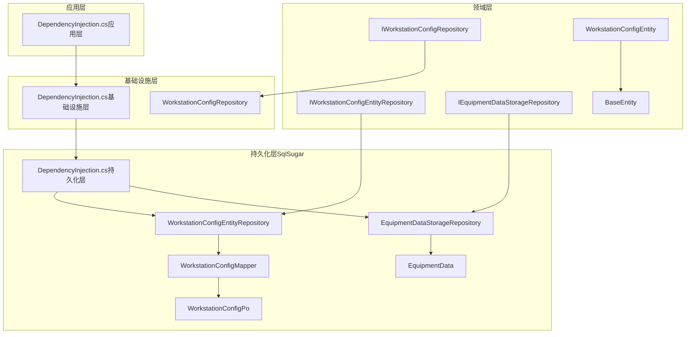
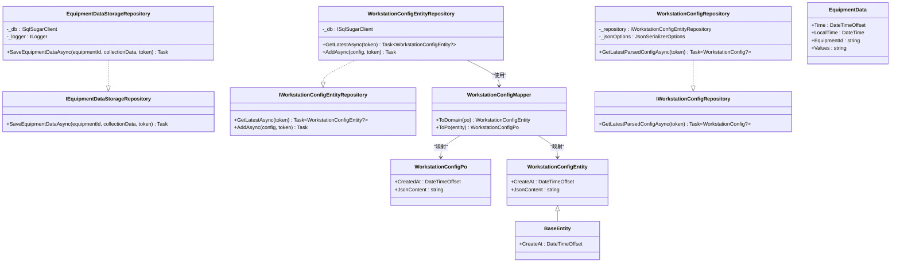
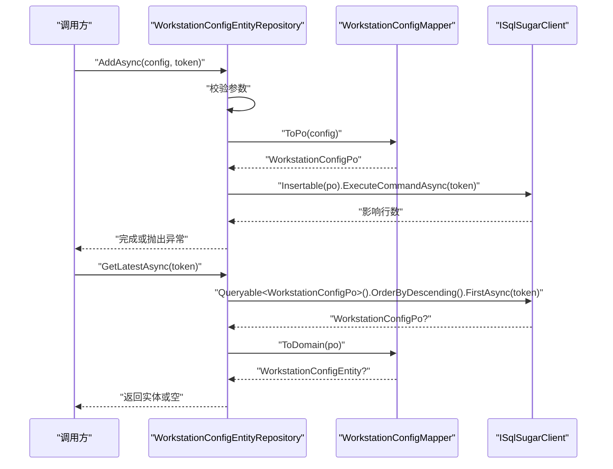
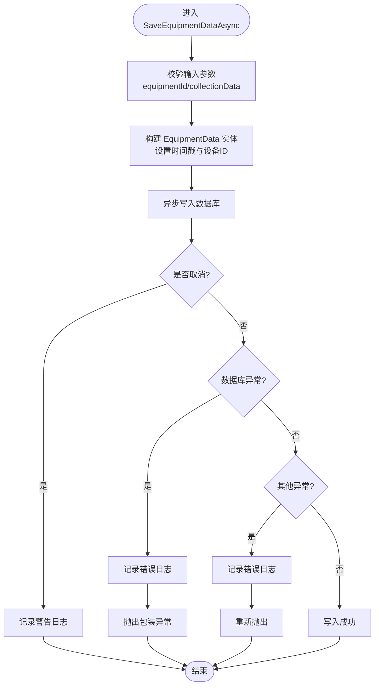
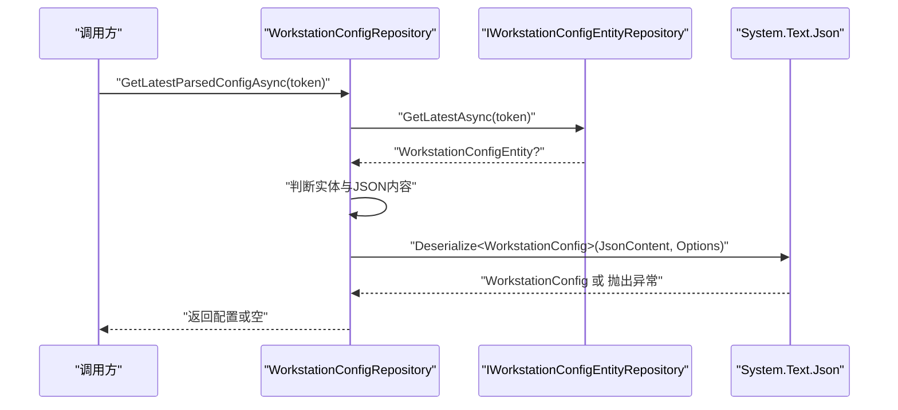
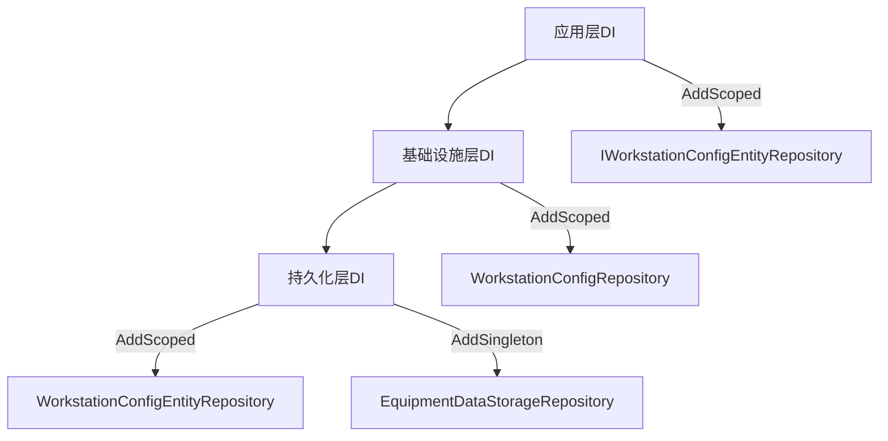

# 仓储模式实现

<cite>
**本文档引用的文件**
- [IWorkstationConfigEntityRepository.cs](file://IndustrialDataSolution/IndustrialDataProcessor.Domain/Repositories/IWorkstationConfigEntityRepository.cs)
- [IEquipmentDataStorageRepository.cs](file://IndustrialDataSolution/IndustrialDataProcessor.Domain/Repositories/IEquipmentDataStorageRepository.cs)
- [IWorkstationConfigRepository.cs](file://IndustrialDataSolution/IndustrialDataProcessor.Domain/Repositories/IWorkstationConfigRepository.cs)
- [WorkstationConfigEntityRepository.cs](file://IndustrialDataSolution/IndustrialDataProcessor.Infrastructure.Persistence.SqlSugar/Repositories/WorkstationConfigEntityRepository.cs)
- [EquipmentDataStorageRepository.cs](file://IndustrialDataSolution/IndustrialDataProcessor.Infrastructure.Persistence.SqlSugar/Repositories/EquipmentDataStorageRepository.cs)
- [WorkstationConfigEntity.cs](file://IndustrialDataSolution/IndustrialDataProcessor.Domain/Entities/WorkstationConfigEntity.cs)
- [BaseEntity.cs](file://IndustrialDataSolution/IndustrialDataProcessor.Domain/Entities/BaseEntity.cs)
- [WorkstationConfigPo.cs](file://IndustrialDataSolution/IndustrialDataProcessor.Infrastructure.Persistence.SqlSugar/DbEntities/WorkstationConfigPo.cs)
- [EquipmentData.cs](file://IndustrialDataSolution/IndustrialDataProcessor.Infrastructure.Persistence.SqlSugar/DbEntities/EquipmentData.cs)
- [WorkstationConfigMapper.cs](file://IndustrialDataSolution/IndustrialDataProcessor.Infrastructure.Persistence.SqlSugar/Mappers/WorkstationConfigMapper.cs)
- [WorkstationConfigRepository.cs](file://IndustrialDataSolution/IndustrialDataProcessor.Infrastructure/Repositories/WorkstationConfigRepository.cs)
- [DependencyInjection.cs（应用层）](file://IndustrialDataSolution/IndustrialDataProcessor.Application/DependencyInjection.cs)
- [DependencyInjection.cs（基础设施层）](file://IndustrialDataSolution/IndustrialDataProcessor.Infrastructure/DependencyInjection.cs)
- [DependencyInjection.cs（持久化层）](file://IndustrialDataSolution/IndustrialDataProcessor.Infrastructure.Persistence.SqlSugar/DependencyInjection.cs)
- [WorkstationConfigServiceTests.cs](file://IndustrialDataSolution/IndustrialDataProcessor.Application.Test/Services/WorkstationConfigServiceTests.cs)
- [ModbusTcpDriverIntegrationTests.cs](file://IndustrialDataSolution/IndustrialDataProcessor.Infrastructure.Tests/Integration/ModbusTcpDriverIntegrationTests.cs)
</cite>

## 目录
1. [引言](#引言)
2. [项目结构](#项目结构)
3. [核心组件](#核心组件)
4. [架构概览](#架构概览)
5. [详细组件分析](#详细组件分析)
6. [依赖分析](#依赖分析)
7. [性能考虑](#性能考虑)
8. [故障排除指南](#故障排除指南)
9. [结论](#结论)
10. [附录](#附录)

## 引言
本文件系统性阐述该DDD工业数据处理解决方案中的仓储模式实现，重点覆盖以下方面：
- 仓储模式在DDD中的作用与领域/基础设施解耦策略
- 通用仓储接口设计（CRUD标准与扩展原则）
- 具体仓储实现细节（WorkstationConfigEntityRepository、EquipmentDataStorageRepository）
- 异步操作与并发安全（线程安全、资源管理）
- 仓储层单元测试策略（Mock与集成测试）
- 仓储层与领域实体映射关系（Mapper与数据转换）

## 项目结构
该项目采用分层架构，仓储模式贯穿领域层接口与基础设施层实现，配合独立的持久化层（SqlSugar）与映射器，形成清晰的职责边界。

图表来源
- [IWorkstationConfigEntityRepository.cs](file://IndustrialDataSolution/IndustrialDataProcessor.Domain/Repositories/IWorkstationConfigEntityRepository.cs#L1-L10)
- [IEquipmentDataStorageRepository.cs](file://IndustrialDataSolution/IndustrialDataProcessor.Domain/Repositories/IEquipmentDataStorageRepository.cs#L1-L10)
- [IWorkstationConfigRepository.cs](file://IndustrialDataSolution/IndustrialDataProcessor.Domain/Repositories/IWorkstationConfigRepository.cs#L1-L12)
- [WorkstationConfigEntityRepository.cs](file://IndustrialDataSolution/IndustrialDataProcessor.Infrastructure.Persistence.SqlSugar/Repositories/WorkstationConfigEntityRepository.cs#L1-L32)
- [EquipmentDataStorageRepository.cs](file://IndustrialDataSolution/IndustrialDataProcessor.Infrastructure.Persistence.SqlSugar/Repositories/EquipmentDataStorageRepository.cs#L1-L74)
- [WorkstationConfigRepository.cs](file://IndustrialDataSolution/IndustrialDataProcessor.Infrastructure/Repositories/WorkstationConfigRepository.cs#L1-L43)
- [WorkstationConfigMapper.cs](file://IndustrialDataSolution/IndustrialDataProcessor.Infrastructure.Persistence.SqlSugar/Mappers/WorkstationConfigMapper.cs#L1-L26)
- [WorkstationConfigPo.cs](file://IndustrialDataSolution/IndustrialDataProcessor.Infrastructure.Persistence.SqlSugar/DbEntities/WorkstationConfigPo.cs#L1-L15)
- [EquipmentData.cs](file://IndustrialDataSolution/IndustrialDataProcessor.Infrastructure.Persistence.SqlSugar/DbEntities/EquipmentData.cs#L1-L38)
- [DependencyInjection.cs（应用层）](file://IndustrialDataSolution/IndustrialDataProcessor.Application/DependencyInjection.cs#L1-L40)
- [DependencyInjection.cs（基础设施层）](file://IndustrialDataSolution/IndustrialDataProcessor.Infrastructure/DependencyInjection.cs#L1-L82)
- [DependencyInjection.cs（持久化层）](file://IndustrialDataSolution/IndustrialDataProcessor.Infrastructure.Persistence.SqlSugar/DependencyInjection.cs#L1-L47)

章节来源
- [DependencyInjection.cs（应用层）](file://IndustrialDataSolution/IndustrialDataProcessor.Application/DependencyInjection.cs#L1-L40)
- [DependencyInjection.cs（基础设施层）](file://IndustrialDataSolution/IndustrialDataProcessor.Infrastructure/DependencyInjection.cs#L1-L82)
- [DependencyInjection.cs（持久化层）](file://IndustrialDataSolution/IndustrialDataProcessor.Infrastructure.Persistence.SqlSugar/DependencyInjection.cs#L1-L47)

## 核心组件
- 领域仓储接口
  - IWorkstationConfigEntityRepository：面向领域实体的仓储接口，提供获取最新配置与新增配置的异步方法。
  - IEquipmentDataStorageRepository：面向设备数据存储的仓储接口，提供异步保存设备数据的方法。
  - IWorkstationConfigRepository：面向领域模型的仓储接口，负责获取并解析最新的工作站配置。
- 领域实体
  - BaseEntity：基础实体，包含创建时间等通用属性。
  - WorkstationConfigEntity：继承自BaseEntity，承载JSON配置内容。
- 基础设施仓储实现
  - WorkstationConfigRepository：在基础设施层完成JSON解析与转换，依赖IWorkstationConfigEntityRepository。
  - WorkstationConfigEntityRepository：基于SqlSugar实现，负责实体的查询与插入。
  - EquipmentDataStorageRepository：基于SqlSugar实现，负责将设备实时数据写入TimescaleDB。
- 映射器与持久化实体
  - WorkstationConfigMapper：在领域实体与PO之间进行双向映射。
  - WorkstationConfigPo：对应数据库表workstation_config的PO类。
  - EquipmentData：对应TimescaleDB超表equipment_real_time_data的PO类。

章节来源
- [IWorkstationConfigEntityRepository.cs](file://IndustrialDataSolution/IndustrialDataProcessor.Domain/Repositories/IWorkstationConfigEntityRepository.cs#L1-L10)
- [IEquipmentDataStorageRepository.cs](file://IndustrialDataSolution/IndustrialDataProcessor.Domain/Repositories/IEquipmentDataStorageRepository.cs#L1-L10)
- [IWorkstationConfigRepository.cs](file://IndustrialDataSolution/IndustrialDataProcessor.Domain/Repositories/IWorkstationConfigRepository.cs#L1-L12)
- [WorkstationConfigEntity.cs](file://IndustrialDataSolution/IndustrialDataProcessor.Domain/Entities/WorkstationConfigEntity.cs#L1-L7)
- [BaseEntity.cs](file://IndustrialDataSolution/IndustrialDataProcessor.Domain/Entities/BaseEntity.cs#L1-L7)
- [WorkstationConfigRepository.cs](file://IndustrialDataSolution/IndustrialDataProcessor.Infrastructure/Repositories/WorkstationConfigRepository.cs#L1-L43)
- [WorkstationConfigEntityRepository.cs](file://IndustrialDataSolution/IndustrialDataProcessor.Infrastructure.Persistence.SqlSugar/Repositories/WorkstationConfigEntityRepository.cs#L1-L32)
- [EquipmentDataStorageRepository.cs](file://IndustrialDataSolution/IndustrialDataProcessor.Infrastructure.Persistence.SqlSugar/Repositories/EquipmentDataStorageRepository.cs#L1-L74)
- [WorkstationConfigMapper.cs](file://IndustrialDataSolution/IndustrialDataProcessor.Infrastructure.Persistence.SqlSugar/Mappers/WorkstationConfigMapper.cs#L1-L26)
- [WorkstationConfigPo.cs](file://IndustrialDataSolution/IndustrialDataProcessor.Infrastructure.Persistence.SqlSugar/DbEntities/WorkstationConfigPo.cs#L1-L15)
- [EquipmentData.cs](file://IndustrialDataSolution/IndustrialDataProcessor.Infrastructure.Persistence.SqlSugar/DbEntities/EquipmentData.cs#L1-L38)

## 架构概览
仓储模式在本项目中的作用：
- 领域层仅定义仓储接口，屏蔽数据访问细节，确保业务逻辑与技术实现解耦。
- 基础设施层提供具体实现，结合持久化框架（SqlSugar）与数据库（PostgreSQL/TimescaleDB）。
- 映射器负责领域模型与持久化实体之间的数据转换，保证数据一致性与可维护性。

图表来源
- [IWorkstationConfigEntityRepository.cs](file://IndustrialDataSolution/IndustrialDataProcessor.Domain/Repositories/IWorkstationConfigEntityRepository.cs#L1-L10)
- [IEquipmentDataStorageRepository.cs](file://IndustrialDataSolution/IndustrialDataProcessor.Domain/Repositories/IEquipmentDataStorageRepository.cs#L1-L10)
- [IWorkstationConfigRepository.cs](file://IndustrialDataSolution/IndustrialDataProcessor.Domain/Repositories/IWorkstationConfigRepository.cs#L1-L12)
- [WorkstationConfigEntityRepository.cs](file://IndustrialDataSolution/IndustrialDataProcessor.Infrastructure.Persistence.SqlSugar/Repositories/WorkstationConfigEntityRepository.cs#L1-L32)
- [EquipmentDataStorageRepository.cs](file://IndustrialDataSolution/IndustrialDataProcessor.Infrastructure.Persistence.SqlSugar/Repositories/EquipmentDataStorageRepository.cs#L1-L74)
- [WorkstationConfigRepository.cs](file://IndustrialDataSolution/IndustrialDataProcessor.Infrastructure/Repositories/WorkstationConfigRepository.cs#L1-L43)
- [WorkstationConfigEntity.cs](file://IndustrialDataSolution/IndustrialDataProcessor.Domain/Entities/WorkstationConfigEntity.cs#L1-L7)
- [BaseEntity.cs](file://IndustrialDataSolution/IndustrialDataProcessor.Domain/Entities/BaseEntity.cs#L1-L7)
- [WorkstationConfigPo.cs](file://IndustrialDataSolution/IndustrialDataProcessor.Infrastructure.Persistence.SqlSugar/DbEntities/WorkstationConfigPo.cs#L1-L15)
- [EquipmentData.cs](file://IndustrialDataSolution/IndustrialDataProcessor.Infrastructure.Persistence.SqlSugar/DbEntities/EquipmentData.cs#L1-L38)
- [WorkstationConfigMapper.cs](file://IndustrialDataSolution/IndustrialDataProcessor.Infrastructure.Persistence.SqlSugar/Mappers/WorkstationConfigMapper.cs#L1-L26)

## 详细组件分析

### WorkstationConfigEntityRepository 分析
- 设计要点
  - 通过ISqlSugarClient执行数据库操作，封装查询与插入逻辑。
  - 使用Mapper在领域实体与PO之间进行转换，保持领域层与持久化层的解耦。
  - 对空值与异常进行显式校验与处理，提升健壮性。
- 异步与并发
  - 所有数据库操作均采用异步API，支持取消令牌，便于在高并发场景下优雅取消。
  - 依赖SqlSugar的连接管理与事务控制，避免资源泄漏。
- 错误处理
  - 插入失败时抛出基础设施异常，便于上层捕获与统一处理。
  - 查询无结果时返回空值，避免空引用异常。

图表来源
- [WorkstationConfigEntityRepository.cs](file://IndustrialDataSolution/IndustrialDataProcessor.Infrastructure.Persistence.SqlSugar/Repositories/WorkstationConfigEntityRepository.cs#L1-L32)
- [WorkstationConfigMapper.cs](file://IndustrialDataSolution/IndustrialDataProcessor.Infrastructure.Persistence.SqlSugar/Mappers/WorkstationConfigMapper.cs#L1-L26)
- [WorkstationConfigPo.cs](file://IndustrialDataSolution/IndustrialDataProcessor.Infrastructure.Persistence.SqlSugar/DbEntities/WorkstationConfigPo.cs#L1-L15)

章节来源
- [WorkstationConfigEntityRepository.cs](file://IndustrialDataSolution/IndustrialDataProcessor.Infrastructure.Persistence.SqlSugar/Repositories/WorkstationConfigEntityRepository.cs#L1-L32)
- [WorkstationConfigMapper.cs](file://IndustrialDataSolution/IndustrialDataProcessor.Infrastructure.Persistence.SqlSugar/Mappers/WorkstationConfigMapper.cs#L1-L26)
- [WorkstationConfigPo.cs](file://IndustrialDataSolution/IndustrialDataProcessor.Infrastructure.Persistence.SqlSugar/DbEntities/WorkstationConfigPo.cs#L1-L15)

### EquipmentDataStorageRepository 分析
- 设计要点
  - 专门负责设备实时数据的写入，目标数据库为TimescaleDB（通过SqlSugar配置PostgreSQL）。
  - 提供完善的输入校验与异常分类处理，区分取消、数据库异常与未知异常。
- 异步与并发
  - 支持取消令牌，取消时记录警告日志并静默处理。
  - 使用SqlSugar异步写入，避免阻塞主线程。
- 错误处理
  - 数据库异常包装为InvalidOperationException并携带原始异常，便于上层统一处理。
  - 其他异常记录错误日志后重新抛出，确保问题可追踪。

图表来源
- [EquipmentDataStorageRepository.cs](file://IndustrialDataSolution/IndustrialDataProcessor.Infrastructure.Persistence.SqlSugar/Repositories/EquipmentDataStorageRepository.cs#L1-L74)
- [EquipmentData.cs](file://IndustrialDataSolution/IndustrialDataProcessor.Infrastructure.Persistence.SqlSugar/DbEntities/EquipmentData.cs#L1-L38)

章节来源
- [EquipmentDataStorageRepository.cs](file://IndustrialDataSolution/IndustrialDataProcessor.Infrastructure.Persistence.SqlSugar/Repositories/EquipmentDataStorageRepository.cs#L1-L74)
- [EquipmentData.cs](file://IndustrialDataSolution/IndustrialDataProcessor.Infrastructure.Persistence.SqlSugar/DbEntities/EquipmentData.cs#L1-L38)

### WorkstationConfigRepository 分析
- 设计要点
  - 在基础设施层完成JSON解析，依赖IWorkstationConfigEntityRepository获取最新实体。
  - 使用自定义JsonSerializerOptions，注册多态转换器，确保复杂配置的正确反序列化。
- 错误处理
  - JSON解析失败时抛出异常并附带上下文，便于定位问题。
  - 当实体为空或JSON内容为空时返回空值，避免空引用。

图表来源
- [WorkstationConfigRepository.cs](file://IndustrialDataSolution/IndustrialDataProcessor.Infrastructure/Repositories/WorkstationConfigRepository.cs#L1-L43)
- [IWorkstationConfigEntityRepository.cs](file://IndustrialDataSolution/IndustrialDataProcessor.Domain/Repositories/IWorkstationConfigEntityRepository.cs#L1-L10)

章节来源
- [WorkstationConfigRepository.cs](file://IndustrialDataSolution/IndustrialDataProcessor.Infrastructure/Repositories/WorkstationConfigRepository.cs#L1-L43)
- [IWorkstationConfigEntityRepository.cs](file://IndustrialDataSolution/IndustrialDataProcessor.Domain/Repositories/IWorkstationConfigEntityRepository.cs#L1-L10)

### Mapper 与数据转换策略
- WorkstationConfigMapper
  - 提供ToDomain与ToPo两个方向的映射，确保领域实体与持久化实体的一致性。
  - 仅映射必要字段，避免冗余数据传输与潜在的安全风险。
- 数据类型与约束
  - WorkstationConfigPo使用jsonb类型存储JSON内容，支持高效查询与更新。
  - EquipmentData使用时间戳作为主键，适配TimescaleDB的时序特性。

章节来源
- [WorkstationConfigMapper.cs](file://IndustrialDataSolution/IndustrialDataProcessor.Infrastructure.Persistence.SqlSugar/Mappers/WorkstationConfigMapper.cs#L1-L26)
- [WorkstationConfigPo.cs](file://IndustrialDataSolution/IndustrialDataProcessor.Infrastructure.Persistence.SqlSugar/DbEntities/WorkstationConfigPo.cs#L1-L15)
- [EquipmentData.cs](file://IndustrialDataSolution/IndustrialDataProcessor.Infrastructure.Persistence.SqlSugar/DbEntities/EquipmentData.cs#L1-L38)

## 依赖分析
- 依赖注入配置
  - 应用层：注册应用服务与MediatR，确保仓储接口在应用层可用。
  - 基础设施层：注册领域仓储实现（WorkstationConfigRepository）与连接管理器。
  - 持久化层：注册SqlSugar客户端与具体仓储实现，按生命周期注入（Scoped/Singleton）。
- 组件耦合
  - 领域层仅依赖仓储接口，降低对基础设施的耦合度。
  - 基础设施层通过接口与领域层解耦，便于替换不同实现。

图表来源
- [DependencyInjection.cs（应用层）](file://IndustrialDataSolution/IndustrialDataProcessor.Application/DependencyInjection.cs#L1-L40)
- [DependencyInjection.cs（基础设施层）](file://IndustrialDataSolution/IndustrialDataProcessor.Infrastructure/DependencyInjection.cs#L1-L82)
- [DependencyInjection.cs（持久化层）](file://IndustrialDataSolution/IndustrialDataProcessor.Infrastructure.Persistence.SqlSugar/DependencyInjection.cs#L1-L47)

章节来源
- [DependencyInjection.cs（应用层）](file://IndustrialDataSolution/IndustrialDataProcessor.Application/DependencyInjection.cs#L1-L40)
- [DependencyInjection.cs（基础设施层）](file://IndustrialDataSolution/IndustrialDataProcessor.Infrastructure/DependencyInjection.cs#L1-L82)
- [DependencyInjection.cs（持久化层）](file://IndustrialDataSolution/IndustrialDataProcessor.Infrastructure.Persistence.SqlSugar/DependencyInjection.cs#L1-L47)

## 性能考虑
- 异步与取消
  - 所有数据库操作均采用异步API，支持取消令牌，减少阻塞与资源占用。
- 连接管理
  - SqlSugar客户端按需创建并自动关闭连接，避免连接池耗尽。
- 并发安全
  - 基于SqlSugar的线程安全机制与数据库层面的并发控制，保障高并发下的稳定性。
- 序时数据库优化
  - EquipmentData使用时间戳主键，适配TimescaleDB的分区与压缩策略，提升写入与查询性能。

## 故障排除指南
- 常见异常与处理
  - OperationCanceledException：记录警告日志并静默处理，确认调用方是否正确传递取消令牌。
  - InfrastructureException：数据库写入失败，检查连接字符串与权限。
  - InvalidOperationException：数据库异常包装，查看内部异常详情。
  - JsonException：JSON解析失败，检查配置内容格式与转换器注册。
- 调试建议
  - 在调试环境下启用SqlSugar日志输出，定位SQL执行问题。
  - 使用单元测试验证仓储接口的行为，确保异常路径覆盖完整。

章节来源
- [EquipmentDataStorageRepository.cs](file://IndustrialDataSolution/IndustrialDataProcessor.Infrastructure.Persistence.SqlSugar/Repositories/EquipmentDataStorageRepository.cs#L1-L74)
- [WorkstationConfigRepository.cs](file://IndustrialDataSolution/IndustrialDataProcessor.Infrastructure/Repositories/WorkstationConfigRepository.cs#L1-L43)

## 结论
本项目的仓储模式通过清晰的分层与接口隔离，实现了领域层与基础设施层的解耦。通用仓储接口定义了标准的CRUD能力，结合具体的SqlSugar实现与Mapper转换，既保证了数据访问的灵活性，又确保了领域模型的纯净性。异步与取消令牌的广泛使用提升了系统的响应性与可运维性，而完善的异常处理与日志记录则增强了系统的可观测性与稳定性。

## 附录
- 单元测试策略
  - 应用层测试：使用Moq模拟仓储接口，验证业务流程与异常传播。
  - 基础设施层测试：针对JSON解析与转换逻辑编写单元测试，覆盖边界条件与错误场景。
  - 集成测试：通过真实数据库或模拟服务验证仓储实现与数据库交互的正确性。
- 示例参考
  - 应用层测试模板与断言示例可参考现有注释测试文件。
  - 集成测试示例可参考基础设施层的集成测试文件。

章节来源
- [WorkstationConfigServiceTests.cs](file://IndustrialDataSolution/IndustrialDataProcessor.Application.Test/Services/WorkstationConfigServiceTests.cs#L1-L643)
- [ModbusTcpDriverIntegrationTests.cs](file://IndustrialDataSolution/IndustrialDataProcessor.Infrastructure.Tests/Integration/ModbusTcpDriverIntegrationTests.cs#L1-L118)