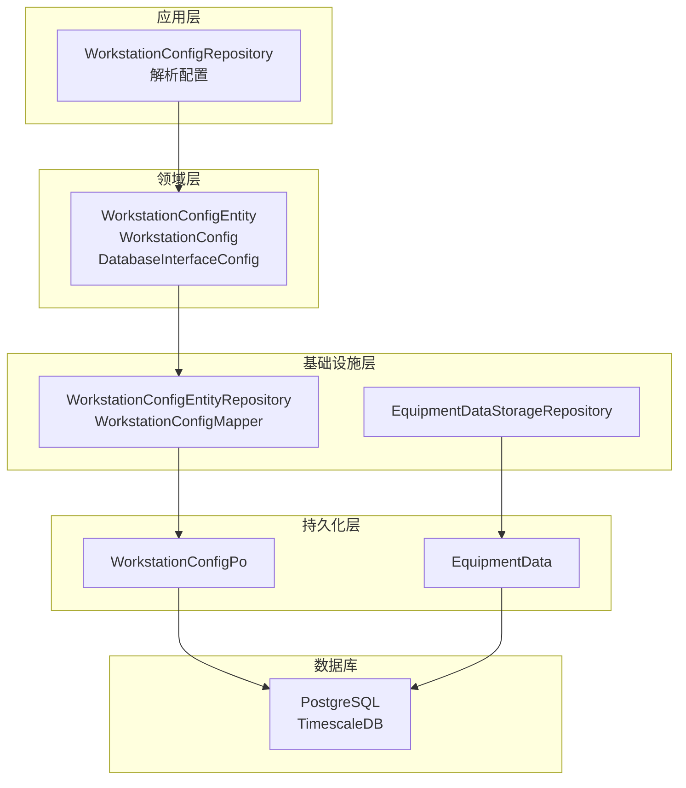
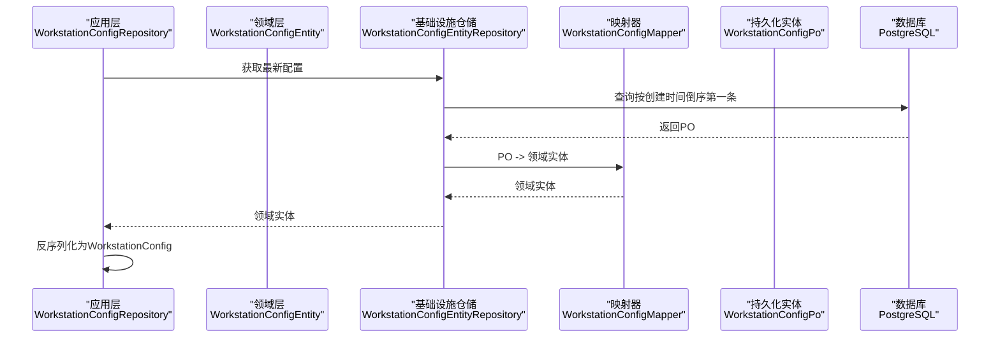
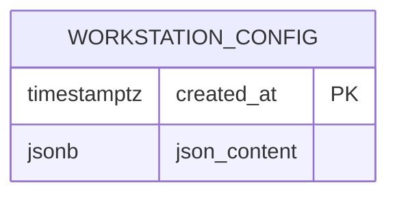
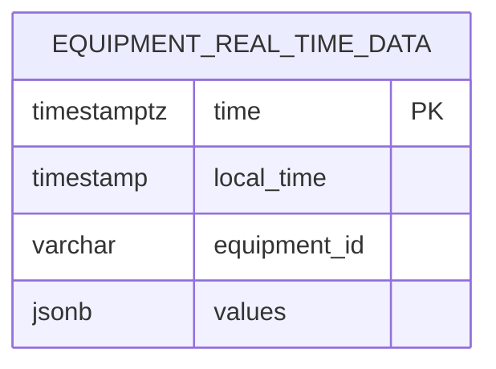
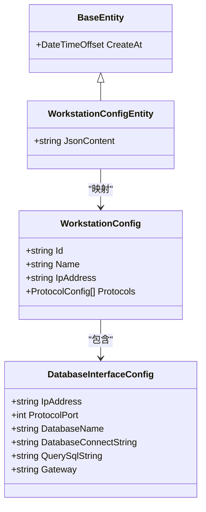
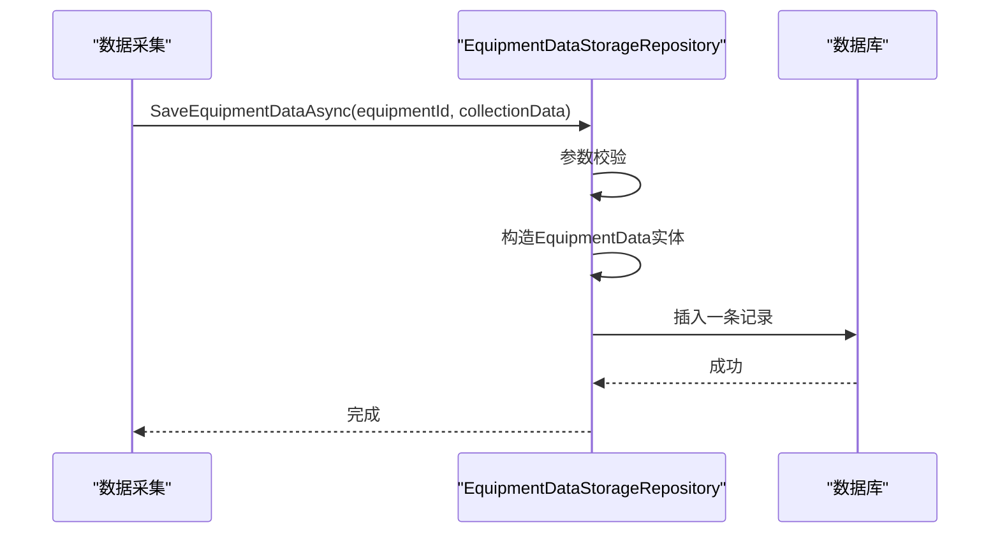
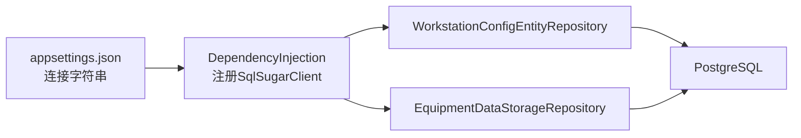

# 数据库设计

<cite>
**本文引用的文件**
- [WorkstationConfigPo.cs](file://IndustrialDataSolution/IndustrialDataProcessor.Infrastructure.Persistence.SqlSugar/DbEntities/WorkstationConfigPo.cs)
- [EquipmentData.cs](file://IndustrialDataSolution/IndustrialDataProcessor.Infrastructure.Persistence.SqlSugar/DbEntities/EquipmentData.cs)
- [EquipmentDataStorageRepository.cs](file://IndustrialDataSolution/IndustrialDataProcessor.Infrastructure.Persistence.SqlSugar/Repositories/EquipmentDataStorageRepository.cs)
- [WorkstationConfigEntityRepository.cs](file://IndustrialDataSolution/IndustrialDataProcessor.Infrastructure.Persistence.SqlSugar/Repositories/WorkstationConfigEntityRepository.cs)
- [WorkstationConfigMapper.cs](file://IndustrialDataSolution/IndustrialDataProcessor.Infrastructure.Persistence.SqlSugar/Mappers/WorkstationConfigMapper.cs)
- [WorkstationConfigRepository.cs](file://IndustrialDataSolution/IndustrialDataProcessor.Infrastructure/Repositories/WorkstationConfigRepository.cs)
- [WorkstationConfigEntity.cs](file://IndustrialDataSolution/IndustrialDataProcessor.Domain/Entities/WorkstationConfigEntity.cs)
- [WorkstationConfig.cs](file://IndustrialDataSolution/IndustrialDataProcessor.Domain/Workstation/Configs/WorkstationConfig.cs)
- [DatabaseInterfaceConfig.cs](file://IndustrialDataSolution/IndustrialDataProcessor.Domain/Workstation/Configs/ProtocolSub/DatabaseInterfaceConfig.cs)
- [BaseEntity.cs](file://IndustrialDataSolution/IndustrialDataProcessor.Domain/Entities/BaseEntity.cs)
- [DependencyInjection.cs](file://IndustrialDataSolution/IndustrialDataProcessor.Infrastructure.Persistence.SqlSugar/DependencyInjection.cs)
- [appsettings.json](file://IndustrialDataSolution/IndustrialDataProcessor.Api/appsettings.json)
</cite>

## 目录
1. [简介](#简介)
2. [项目结构](#项目结构)
3. [核心组件](#核心组件)
4. [架构总览](#架构总览)
5. [详细组件分析](#详细组件分析)
6. [依赖关系分析](#依赖关系分析)
7. [性能考量](#性能考量)
8. [故障排查指南](#故障排查指南)
9. [结论](#结论)
10. [附录](#附录)

## 简介
本文件面向DDD工业数据处理解决方案，系统化梳理数据库设计与实现要点，重点覆盖以下方面：
- 核心表结构设计：WorkstationConfigPo与EquipmentData
- 主键、外键与索引策略
- 规范化与反规范化取舍
- 数据类型与约束设置
- Schema演进与迁移策略
- 数据完整性与业务规则约束
- 性能优化：分区、统计信息与查询计划

## 项目结构
该方案采用DDD分层架构，数据库持久化通过SqlSugar实现，PostgreSQL作为关系型数据库，结合TimescaleDB用于时序数据存储。关键文件分布如下：
- 领域层：WorkstationConfigEntity、WorkstationConfig及协议配置类
- 基础设施层：SqlSugar仓储与实体映射
- 应用层：配置解析与序列化选项
- 配置层：连接字符串与依赖注入

图表来源
- [WorkstationConfigRepository.cs](file://IndustrialDataSolution/IndustrialDataProcessor.Infrastructure/Repositories/WorkstationConfigRepository.cs#L23-L42)
- [WorkstationConfigEntityRepository.cs](file://IndustrialDataSolution/IndustrialDataProcessor.Infrastructure.Persistence.SqlSugar/Repositories/WorkstationConfigEntityRepository.cs#L13-L31)
- [WorkstationConfigMapper.cs](file://IndustrialDataSolution/IndustrialDataProcessor.Infrastructure.Persistence.SqlSugar/Mappers/WorkstationConfigMapper.cs#L8-L24)
- [WorkstationConfigPo.cs](file://IndustrialDataSolution/IndustrialDataProcessor.Infrastructure.Persistence.SqlSugar/DbEntities/WorkstationConfigPo.cs#L5-L12)
- [EquipmentData.cs](file://IndustrialDataSolution/IndustrialDataProcessor.Infrastructure.Persistence.SqlSugar/DbEntities/EquipmentData.cs#L11-L37)
- [EquipmentDataStorageRepository.cs](file://IndustrialDataSolution/IndustrialDataProcessor.Infrastructure.Persistence.SqlSugar/Repositories/EquipmentDataStorageRepository.cs#L38-L53)

章节来源
- [WorkstationConfigPo.cs](file://IndustrialDataSolution/IndustrialDataProcessor.Infrastructure.Persistence.SqlSugar/DbEntities/WorkstationConfigPo.cs#L1-L15)
- [EquipmentData.cs](file://IndustrialDataSolution/IndustrialDataProcessor.Infrastructure.Persistence.SqlSugar/DbEntities/EquipmentData.cs#L1-L38)
- [WorkstationConfigEntityRepository.cs](file://IndustrialDataSolution/IndustrialDataProcessor.Infrastructure.Persistence.SqlSugar/Repositories/WorkstationConfigEntityRepository.cs#L1-L32)
- [WorkstationConfigMapper.cs](file://IndustrialDataSolution/IndustrialDataProcessor.Infrastructure.Persistence.SqlSugar/Mappers/WorkstationConfigMapper.cs#L1-L26)
- [WorkstationConfigRepository.cs](file://IndustrialDataSolution/IndustrialDataProcessor.Infrastructure/Repositories/WorkstationConfigRepository.cs#L1-L43)
- [DependencyInjection.cs](file://IndustrialDataSolution/IndustrialDataProcessor.Infrastructure.Persistence.SqlSugar/DependencyInjection.cs#L11-L46)
- [appsettings.json](file://IndustrialDataSolution/IndustrialDataProcessor.Api/appsettings.json#L10-L12)

## 核心组件
本节聚焦两个核心表及其职责边界：
- WorkstationConfigPo：存储工作站配置的JSON内容，按创建时间作为主键，确保“最新配置”可直接查询
- EquipmentData：存储设备实时数据，采用TimescaleDB超表模式，以时间戳为主键，支持高效时序查询与压缩

章节来源
- [WorkstationConfigPo.cs](file://IndustrialDataSolution/IndustrialDataProcessor.Infrastructure.Persistence.SqlSugar/DbEntities/WorkstationConfigPo.cs#L5-L12)
- [EquipmentData.cs](file://IndustrialDataSolution/IndustrialDataProcessor.Infrastructure.Persistence.SqlSugar/DbEntities/EquipmentData.cs#L11-L37)
- [WorkstationConfigEntityRepository.cs](file://IndustrialDataSolution/IndustrialDataProcessor.Infrastructure.Persistence.SqlSugar/Repositories/WorkstationConfigEntityRepository.cs#L24-L31)
- [EquipmentDataStorageRepository.cs](file://IndustrialDataSolution/IndustrialDataProcessor.Infrastructure.Persistence.SqlSugar/Repositories/EquipmentDataStorageRepository.cs#L38-L53)

## 架构总览
下图展示从应用到数据库的调用链路与数据流向。

图表来源
- [WorkstationConfigRepository.cs](file://IndustrialDataSolution/IndustrialDataProcessor.Infrastructure/Repositories/WorkstationConfigRepository.cs#L23-L42)
- [WorkstationConfigEntityRepository.cs](file://IndustrialDataSolution/IndustrialDataProcessor.Infrastructure.Persistence.SqlSugar/Repositories/WorkstationConfigEntityRepository.cs#L24-L31)
- [WorkstationConfigMapper.cs](file://IndustrialDataSolution/IndustrialDataProcessor.Infrastructure.Persistence.SqlSugar/Mappers/WorkstationConfigMapper.cs#L8-L24)
- [WorkstationConfigPo.cs](file://IndustrialDataSolution/IndustrialDataProcessor.Infrastructure.Persistence.SqlSugar/DbEntities/WorkstationConfigPo.cs#L5-L12)

## 详细组件分析

### WorkstationConfigPo 表设计
- 表名：workstation_config
- 主键：created_at（DateTimeOffset），用于标识配置创建时间，确保“最新配置”可快速定位
- 字段：
  - created_at：主键，唯一标识每条配置记录
  - json_content：JSONB类型，存储完整的配置对象（序列化后的JSON）
- 约束与类型：
  - json_content为非空；插入时显式转换为jsonb类型，保证类型一致性
- 设计动机：
  - 将复杂配置以JSON形式整体落库，简化领域模型与数据库之间的映射成本
  - 通过主键排序实现“取最新配置”的高效率查询

图表来源
- [WorkstationConfigPo.cs](file://IndustrialDataSolution/IndustrialDataProcessor.Infrastructure.Persistence.SqlSugar/DbEntities/WorkstationConfigPo.cs#L5-L12)

章节来源
- [WorkstationConfigPo.cs](file://IndustrialDataSolution/IndustrialDataProcessor.Infrastructure.Persistence.SqlSugar/DbEntities/WorkstationConfigPo.cs#L5-L12)
- [WorkstationConfigEntityRepository.cs](file://IndustrialDataSolution/IndustrialDataProcessor.Infrastructure.Persistence.SqlSugar/Repositories/WorkstationConfigEntityRepository.cs#L24-L31)
- [WorkstationConfigMapper.cs](file://IndustrialDataSolution/IndustrialDataProcessor.Infrastructure.Persistence.SqlSugar/Mappers/WorkstationConfigMapper.cs#L8-L24)

### EquipmentData 表设计（TimescaleDB超表）
- 表名：equipment_real_time_data
- 主键：time（DateTimeOffset，带时区），作为TimescaleDB的分区键，避免自增主键带来的并发瓶颈
- 字段：
  - time：主键，时序核心字段
  - local_time：本地时间（无时区）
  - equipment_id：设备ID，长度限制50字符
  - values：JSONB类型，存储设备参数集合
- 设计动机：
  - 采用时间戳主键契合时序场景，便于分区与压缩
  - values使用JSONB支持灵活扩展，避免频繁变更Schema带来的维护成本

图表来源
- [EquipmentData.cs](file://IndustrialDataSolution/IndustrialDataProcessor.Infrastructure.Persistence.SqlSugar/DbEntities/EquipmentData.cs#L11-L37)

章节来源
- [EquipmentData.cs](file://IndustrialDataSolution/IndustrialDataProcessor.Infrastructure.Persistence.SqlSugar/DbEntities/EquipmentData.cs#L11-L37)
- [EquipmentDataStorageRepository.cs](file://IndustrialDataSolution/IndustrialDataProcessor.Infrastructure.Persistence.SqlSugar/Repositories/EquipmentDataStorageRepository.cs#L38-L53)

### 领域模型与持久化映射
- WorkstationConfigEntity：继承基础实体，包含创建时间与JSON内容
- WorkstationConfig：领域配置聚合根，包含边缘信息与协议列表
- DatabaseInterfaceConfig：数据库协议子配置，包含连接串、IP、端口、数据库名与查询SQL等
- 映射器：在仓储中将领域实体与PO进行双向转换

图表来源
- [BaseEntity.cs](file://IndustrialDataSolution/IndustrialDataProcessor.Domain/Entities/BaseEntity.cs#L3-L6)
- [WorkstationConfigEntity.cs](file://IndustrialDataSolution/IndustrialDataProcessor.Domain/Entities/WorkstationConfigEntity.cs#L3-L6)
- [WorkstationConfig.cs](file://IndustrialDataSolution/IndustrialDataProcessor.Domain/Workstation/Configs/WorkstationConfig.cs#L6-L26)
- [DatabaseInterfaceConfig.cs](file://IndustrialDataSolution/IndustrialDataProcessor.Domain/Workstation/Configs/ProtocolSub/DatabaseInterfaceConfig.cs#L7-L43)

章节来源
- [WorkstationConfigEntity.cs](file://IndustrialDataSolution/IndustrialDataProcessor.Domain/Entities/WorkstationConfigEntity.cs#L1-L7)
- [WorkstationConfig.cs](file://IndustrialDataSolution/IndustrialDataProcessor.Domain/Workstation/Configs/WorkstationConfig.cs#L1-L27)
- [DatabaseInterfaceConfig.cs](file://IndustrialDataSolution/IndustrialDataProcessor.Domain/Workstation/Configs/ProtocolSub/DatabaseInterfaceConfig.cs#L1-L44)
- [WorkstationConfigMapper.cs](file://IndustrialDataSolution/IndustrialDataProcessor.Infrastructure.Persistence.SqlSugar/Mappers/WorkstationConfigMapper.cs#L8-L24)

### 写入流程（设备数据）
- 输入：设备ID与采集到的数据（JSON字符串）
- 处理：构造EquipmentData实体，填充时间戳、本地时间、设备ID与values
- 输出：通过SqlSugar批量写入TimescaleDB

图表来源
- [EquipmentDataStorageRepository.cs](file://IndustrialDataSolution/IndustrialDataProcessor.Infrastructure.Persistence.SqlSugar/Repositories/EquipmentDataStorageRepository.cs#L38-L53)
- [EquipmentData.cs](file://IndustrialDataSolution/IndustrialDataProcessor.Infrastructure.Persistence.SqlSugar/DbEntities/EquipmentData.cs#L17-L37)

章节来源
- [EquipmentDataStorageRepository.cs](file://IndustrialDataSolution/IndustrialDataProcessor.Infrastructure.Persistence.SqlSugar/Repositories/EquipmentDataStorageRepository.cs#L38-L72)
- [EquipmentData.cs](file://IndustrialDataSolution/IndustrialDataProcessor.Infrastructure.Persistence.SqlSugar/DbEntities/EquipmentData.cs#L17-L37)

## 依赖关系分析
- 数据库连接：通过依赖注入注册SqlSugarClient，使用PostgreSQL连接字符串
- 仓储依赖：WorkstationConfigEntityRepository依赖SqlSugarClient执行查询与插入
- 配置解析：WorkstationConfigRepository在基础设施层完成JSON到领域模型的反序列化

图表来源
- [DependencyInjection.cs](file://IndustrialDataSolution/IndustrialDataProcessor.Infrastructure.Persistence.SqlSugar/DependencyInjection.cs#L11-L46)
- [appsettings.json](file://IndustrialDataSolution/IndustrialDataProcessor.Api/appsettings.json#L10-L12)

章节来源
- [DependencyInjection.cs](file://IndustrialDataSolution/IndustrialDataProcessor.Infrastructure.Persistence.SqlSugar/DependencyInjection.cs#L11-L46)
- [appsettings.json](file://IndustrialDataSolution/IndustrialDataProcessor.Api/appsettings.json#L10-L12)

## 性能考量
- 分区策略
  - EquipmentData以time为主键，适配TimescaleDB超表分区，建议按天/周/月进行压缩与归档，降低查询扫描范围
- 统计信息与查询计划
  - PostgreSQL定期更新统计信息，有助于查询优化器生成更优执行计划
- 写入路径优化
  - 使用批量写入与连接池配置，减少事务开销与上下文切换
- JSONB使用
  - values采用JSONB，支持灵活扩展；对高频访问字段可考虑反规范化为结构化列以提升查询性能

[本节为通用性能指导，不直接分析具体代码文件]

## 故障排查指南
- 数据库异常
  - EquipmentDataStorageRepository捕获SqlSugarException并包装为InvalidOperationException，便于上层识别
- 取消操作
  - 当取消令牌触发时，记录警告日志但不抛出异常，符合预期行为
- 参数校验
  - WorkstationConfigRepository在解析前对JSON内容进行判空处理，避免无效配置进入领域层

章节来源
- [EquipmentDataStorageRepository.cs](file://IndustrialDataSolution/IndustrialDataProcessor.Infrastructure.Persistence.SqlSugar/Repositories/EquipmentDataStorageRepository.cs#L55-L71)
- [WorkstationConfigRepository.cs](file://IndustrialDataSolution/IndustrialDataProcessor.Infrastructure/Repositories/WorkstationConfigRepository.cs#L28-L41)

## 结论
本设计方案以“配置JSON化+时序数据超表”为核心，兼顾灵活性与性能：
- WorkstationConfigPo通过主键排序实现“取最新配置”的高效查询
- EquipmentData采用时间戳主键与JSONB，满足工业场景的高吞吐与时序分析需求
- 通过依赖注入与仓储模式，清晰分离领域与基础设施层，便于演进与测试

[本节为总结性内容，不直接分析具体代码文件]

## 附录

### 主键、外键与索引设计策略
- WorkstationConfigPo
  - 主键：created_at（唯一、递增，适合“最新配置”查询）
  - 建议：若未来需按设备维度检索配置，可在设备维度增加二级索引
- EquipmentData
  - 主键：time（TimescaleDB分区键）
  - 建议：为equipment_id建立索引，加速按设备过滤；为local_time建立索引，支持本地时间范围查询

[本节为通用设计建议，不直接分析具体代码文件]

### 规范化与反规范化选择原则
- WorkstationConfigPo
  - 采用反规范化：将完整配置以JSONB存储，避免复杂关联表与频繁JOIN
- EquipmentData
  - values采用JSONB，支持灵活扩展；对热点字段可考虑部分反规范化为结构化列以提升查询性能

[本节为通用设计建议，不直接分析具体代码文件]

### 数据类型与约束设置
- WorkstationConfigPo
  - created_at：主键，唯一标识
  - json_content：jsonb，非空，插入时强制转换为jsonb
- EquipmentData
  - time：主键，带时区
  - equipment_id：varchar(50)，长度约束
  - values：jsonb，非空

章节来源
- [WorkstationConfigPo.cs](file://IndustrialDataSolution/IndustrialDataProcessor.Infrastructure.Persistence.SqlSugar/DbEntities/WorkstationConfigPo.cs#L8-L12)
- [EquipmentData.cs](file://IndustrialDataSolution/IndustrialDataProcessor.Infrastructure.Persistence.SqlSugar/DbEntities/EquipmentData.cs#L17-L37)

### 数据完整性约束
- 参照完整性
  - 当前无外键约束，WorkstationConfigPo与EquipmentData均为独立表
- 业务规则约束
  - WorkstationConfigRepository对JSON内容进行判空处理
  - EquipmentDataStorageRepository对输入参数进行校验

章节来源
- [WorkstationConfigRepository.cs](file://IndustrialDataSolution/IndustrialDataProcessor.Infrastructure/Repositories/WorkstationConfigRepository.cs#L28-L41)
- [EquipmentDataStorageRepository.cs](file://IndustrialDataSolution/IndustrialDataProcessor.Infrastructure.Persistence.SqlSugar/Repositories/EquipmentDataStorageRepository.cs#L40-L41)

### Schema演进与迁移策略
- 版本控制
  - 采用数据库版本号或迁移脚本编号，确保环境一致
- 迁移脚本规范
  - 新增/修改列时保留默认值与注释；对JSONB列进行类型转换时使用显式CAST
  - 对TimescaleDB分区表，先添加列再重建索引，避免长时间锁表
- 回滚策略
  - 保留逆向脚本，确保回滚至前一版本时数据安全

[本节为通用演进策略，不直接分析具体代码文件]