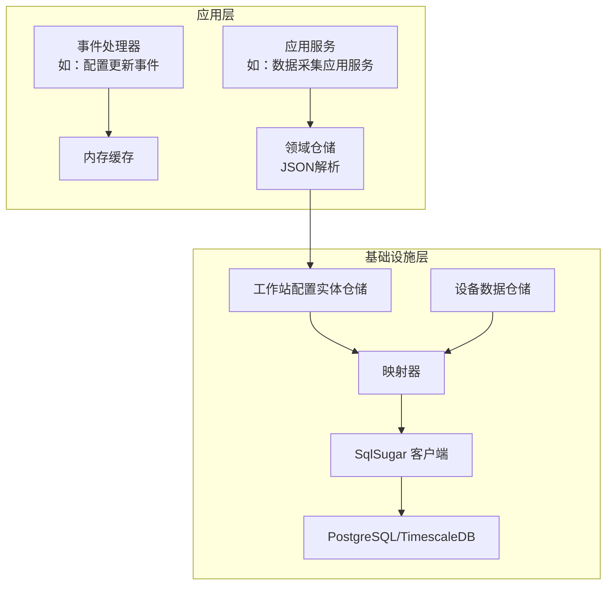
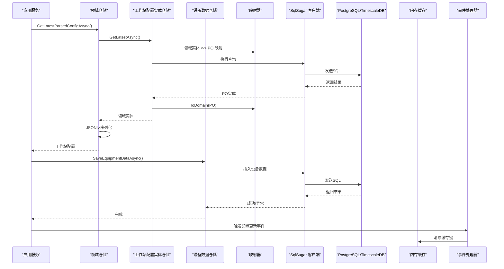
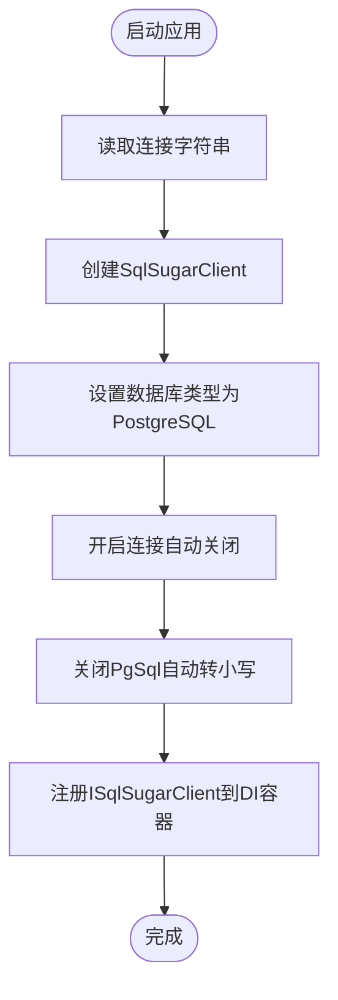
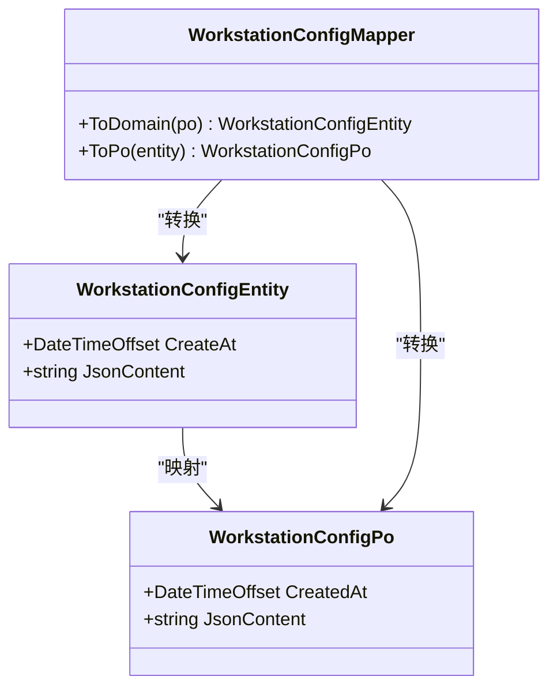
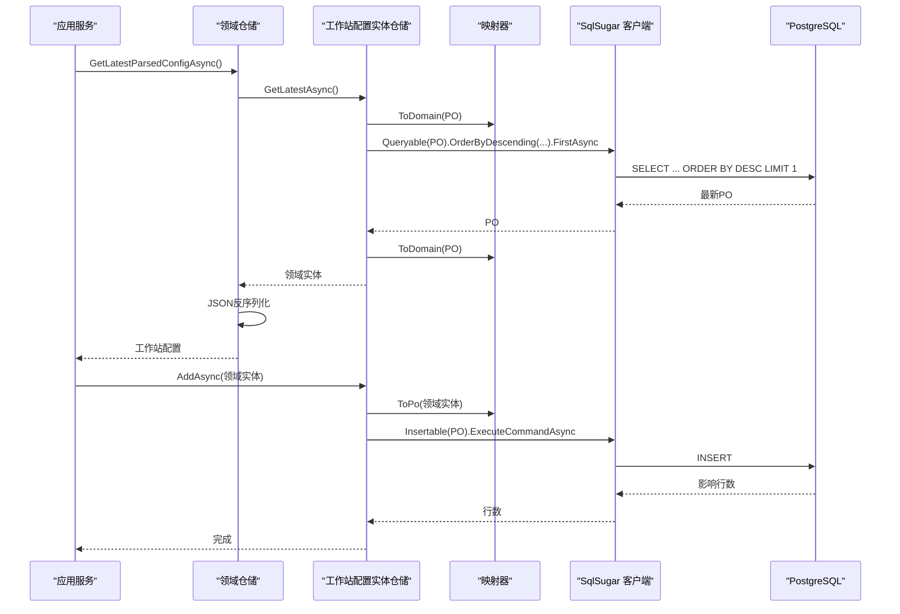
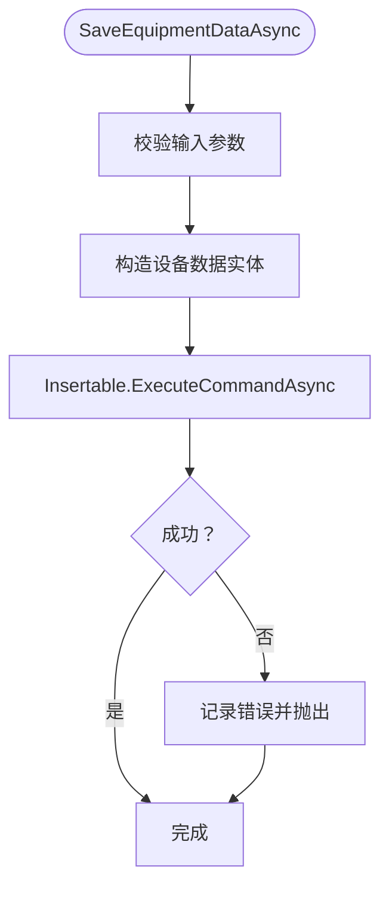
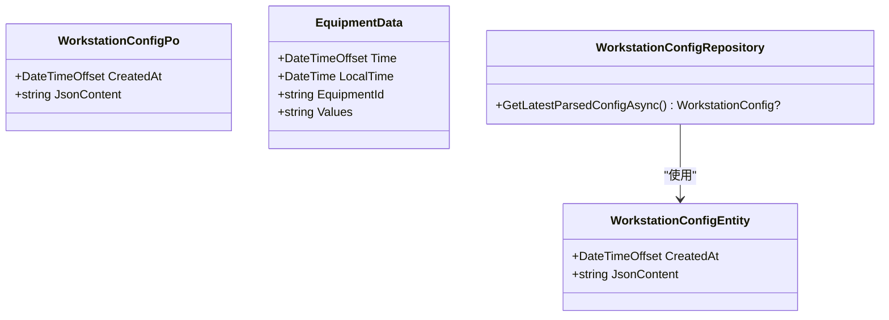
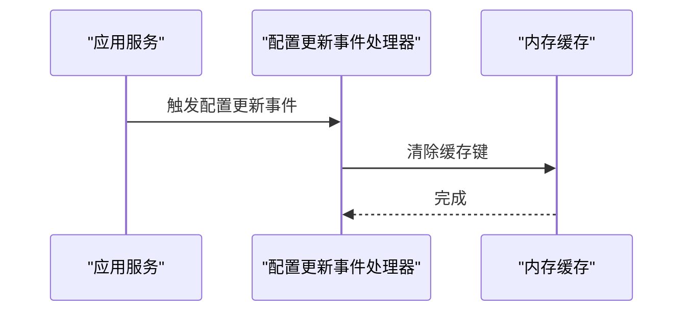
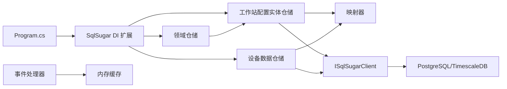

# 数据持久化

<cite>
**本文引用的文件**
- [Program.cs](file://IndustrialDataSolution/IndustrialDataProcessor.Api/Program.cs)
- [appsettings.json](file://IndustrialDataSolution/IndustrialDataProcessor.Api/appsettings.json)
- [DependencyInjection.cs](file://IndustrialDataSolution/IndustrialDataProcessor.Infrastructure/DependencyInjection.cs)
- [WorkstationConfigEntityRepository.cs](file://IndustrialDataSolution/IndustrialDataProcessor.Infrastructure/Persistence/Repositories/WorkstationConfigEntityRepository.cs)
- [EquipmentDataStorageRepository.cs](file://IndustrialDataSolution/IndustrialDataProcessor.Infrastructure/Persistence/Repositories/EquipmentDataStorageRepository.cs)
- [WorkstationConfigPo.cs](file://IndustrialDataSolution/IndustrialDataProcessor.Infrastructure/Persistence/DbEntities/WorkstationConfigPo.cs)
- [EquipmentData.cs](file://IndustrialDataSolution/IndustrialDataProcessor.Infrastructure/Persistence/DbEntities/EquipmentData.cs)
- [WorkstationConfigMapper.cs](file://IndustrialDataSolution/IndustrialDataProcessor.Infrastructure/Persistence/Mappers/WorkstationConfigMapper.cs)
- [IWorkstationConfigEntityRepository.cs](file://IndustrialDataSolution/IndustrialDataProcessor.Domain/Repositories/IWorkstationConfigEntityRepository.cs)
- [IEquipmentDataStorageRepository.cs](file://IndustrialDataSolution/IndustrialDataProcessor.Domain/Repositories/IEquipmentDataStorageRepository.cs)
- [WorkstationConfigEntity.cs](file://IndustrialDataSolution/IndustrialDataProcessor.Domain/Entities/WorkstationConfigEntity.cs)
- [BaseEntity.cs](file://IndustrialDataSolution/IndustrialDataProcessor.Domain/Entities/BaseEntity.cs)
- [WorkstationConfigRepository.cs](file://IndustrialDataSolution/IndustrialDataProcessor.Infrastructure/Repositories/WorkstationConfigRepository.cs)
- [CacheKeys.cs](file://IndustrialDataSolution/IndustrialDataProcessor.Application/Constants/CacheKeys.cs)
- [ClearConfigCacheEventHandler.cs](file://IndustrialDataSolution/IndustrialDataProcessor.Application/EventHandlers/ClearConfigCacheEventHandler.cs)
- [WorkstationConfigUpdatedEventHandler.cs](file://IndustrialDataSolution/IndustrialDataProcessor.Application/EventHandlers/WorkstationConfigUpdatedEventHandler.cs)
- [GlobalExceptionHandler.cs](file://IndustrialDataSolution/IndustrialDataProcessor.Api/Middleware/GlobalExceptionHandler.cs)
- [RequestLoggingMiddleware.cs](file://IndustrialDataSolution/IndustrialDataProcessor.Api/Middleware/RequestLoggingMiddleware.cs)
</cite>

## 更新摘要
**变更内容**
- SqlSugar ORM 持久化组件已完全移除，项目不再依赖 SqlSugarCore 包
- 保留了原有的实体映射、仓储实现和依赖注入配置
- 应用层通过领域仓储进行 JSON 配置解析，基础设施仓储负责数据库操作
- 事件驱动的缓存同步机制继续保留

## 目录
1. [简介](#简介)
2. [项目结构](#项目结构)
3. [核心组件](#核心组件)
4. [架构总览](#架构总览)
5. [详细组件分析](#详细组件分析)
6. [依赖分析](#依赖分析)
7. [性能考虑](#性能考虑)
8. [故障排查指南](#故障排查指南)
9. [结论](#结论)
10. [附录](#附录)

## 简介
本文件面向DDD工业数据处理解决方案中的数据持久化子系统，基于当前的基础设施架构，涵盖以下主题：
- 数据库连接配置与SqlSugar ORM的使用
- 实体映射的设计原则与领域模型到数据库表的映射策略
- 仓储模式的实现（领域仓储与实体仓储分离）
- 查询优化策略与异常处理机制
- 缓存策略与数据库同步方案
- CRUD操作示例与性能优化建议

## 项目结构
本项目的持久化层位于"IndustrialDataProcessor.Infrastructure"中，采用分层组织：
- 配置与DI：通过扩展方法注册SqlSugar客户端与仓储实现
- 实体与映射：领域实体与PO（持久化对象）之间的双向转换
- 仓储：领域仓储负责JSON配置解析，实体仓储负责数据库操作
- 应用层集成：通过事件与缓存实现数据库变更后的同步

**图表来源**
- [Program.cs](file://IndustrialDataSolution/IndustrialDataProcessor.Api/Program.cs#L14-L15)
- [DependencyInjection.cs](file://IndustrialDataSolution/IndustrialDataProcessor.Infrastructure/DependencyInjection.cs#L24-L74)
- [WorkstationConfigEntityRepository.cs](file://IndustrialDataSolution/IndustrialDataProcessor.Infrastructure/Persistence/Repositories/WorkstationConfigEntityRepository.cs#L13-L18)
- [EquipmentDataStorageRepository.cs](file://IndustrialDataSolution/IndustrialDataProcessor.Infrastructure/Persistence/Repositories/EquipmentDataStorageRepository.cs#L11-L20)
- [WorkstationConfigPo.cs](file://IndustrialDataSolution/IndustrialDataProcessor.Infrastructure/Persistence/DbEntities/WorkstationConfigPo.cs#L8-L16)
- [EquipmentData.cs](file://IndustrialDataSolution/IndustrialDataProcessor.Infrastructure/Persistence/DbEntities/EquipmentData.cs#L10-L36)

**章节来源**
- [Program.cs](file://IndustrialDataSolution/IndustrialDataProcessor.Api/Program.cs#L14-L15)
- [DependencyInjection.cs](file://IndustrialDataSolution/IndustrialDataProcessor.Infrastructure/DependencyInjection.cs#L24-L74)

## 核心组件
- SqlSugar客户端配置与连接池
  - 通过扩展方法注册ISqlSugarClient，设置连接字符串、数据库类型、连接自动关闭与大小写策略等
  - 连接池参数来源于配置文件中的连接字符串（最小/最大池大小、生命周期、命令超时等）

- 仓储接口与实现
  - 工作站配置实体仓储：提供新增与查询最新配置的能力
  - 设备数据仓储：面向TimescaleDB的设备实时数据写入
  - 领域仓储：负责JSON配置的序列化与反序列化

- 实体与映射
  - 领域实体与PO的双向映射，确保领域模型与数据库表字段一致
  - 使用特性标注表名与列名，明确主键、可空性与数据类型

- 缓存与事件
  - 应用层通过事件处理器在配置更新后清理内存缓存，保证缓存与数据库的一致性

**章节来源**
- [DependencyInjection.cs](file://IndustrialDataSolution/IndustrialDataProcessor.Infrastructure/DependencyInjection.cs#L24-L74)
- [IWorkstationConfigEntityRepository.cs](file://IndustrialDataSolution/IndustrialDataProcessor.Domain/Repositories/IWorkstationConfigEntityRepository.cs#L5-L9)
- [IEquipmentDataStorageRepository.cs](file://IndustrialDataSolution/IndustrialDataProcessor.Domain/Repositories/IEquipmentDataStorageRepository.cs#L3-L9)
- [WorkstationConfigEntityRepository.cs](file://IndustrialDataSolution/IndustrialDataProcessor.Infrastructure/Persistence/Repositories/WorkstationConfigEntityRepository.cs#L13-L18)
- [EquipmentDataStorageRepository.cs](file://IndustrialDataSolution/IndustrialDataProcessor.Infrastructure/Persistence/Repositories/EquipmentDataStorageRepository.cs#L11-L20)
- [WorkstationConfigPo.cs](file://IndustrialDataSolution/IndustrialDataProcessor.Infrastructure/Persistence/DbEntities/WorkstationConfigPo.cs#L8-L16)
- [EquipmentData.cs](file://IndustrialDataSolution/IndustrialDataProcessor.Infrastructure/Persistence/DbEntities/EquipmentData.cs#L10-L36)
- [WorkstationConfigEntity.cs](file://IndustrialDataSolution/IndustrialDataProcessor.Domain/Entities/WorkstationConfigEntity.cs#L3-L6)
- [BaseEntity.cs](file://IndustrialDataSolution/IndustrialDataProcessor.Domain/Entities/BaseEntity.cs#L3-L6)
- [WorkstationConfigMapper.cs](file://IndustrialDataSolution/IndustrialDataProcessor.Infrastructure/Persistence/Mappers/WorkstationConfigMapper.cs#L9-L34)
- [CacheKeys.cs](file://IndustrialDataSolution/IndustrialDataProcessor.Application/Constants/CacheKeys.cs#L3-L5)
- [ClearConfigCacheEventHandler.cs](file://IndustrialDataSolution/IndustrialDataProcessor.Application/EventHandlers/ClearConfigCacheEventHandler.cs#L11-L24)

## 架构总览
下图展示了从应用服务到仓储再到数据库的调用链路，以及缓存与事件的交互。

**图表来源**
- [WorkstationConfigEntityRepository.cs](file://IndustrialDataSolution/IndustrialDataProcessor.Infrastructure/Persistence/Repositories/WorkstationConfigEntityRepository.cs#L41-L48)
- [EquipmentDataStorageRepository.cs](file://IndustrialDataSolution/IndustrialDataProcessor.Infrastructure/Persistence/Repositories/EquipmentDataStorageRepository.cs#L25-L56)
- [WorkstationConfigMapper.cs](file://IndustrialDataSolution/IndustrialDataProcessor.Infrastructure/Persistence/Mappers/WorkstationConfigMapper.cs#L14-L33)
- [ClearConfigCacheEventHandler.cs](file://IndustrialDataSolution/IndustrialDataProcessor.Application/EventHandlers/ClearConfigCacheEventHandler.cs#L16-L23)
- [WorkstationConfigRepository.cs](file://IndustrialDataSolution/IndustrialDataProcessor.Infrastructure/Repositories/WorkstationConfigRepository.cs#L28-L71)

## 详细组件分析

### SqlSugar ORM配置与连接池
- 连接字符串来源：应用配置文件中的"DefaultConnection"
- 客户端初始化：设置数据库类型为PostgreSQL，启用连接自动关闭，关闭PgSql自动转小写
- 连接池参数：由连接字符串提供（最小/最大池大小、生命周期、命令超时等）
- DI注册：以Transient注册ISqlSugarClient，按需注入到仓储；仓储以Scoped/Singletion注册

**图表来源**
- [DependencyInjection.cs](file://IndustrialDataSolution/IndustrialDataProcessor.Infrastructure/DependencyInjection.cs#L54-L74)
- [appsettings.json](file://IndustrialDataSolution/IndustrialDataProcessor.Api/appsettings.json#L13-L15)

**章节来源**
- [DependencyInjection.cs](file://IndustrialDataSolution/IndustrialDataProcessor.Infrastructure/DependencyInjection.cs#L54-L74)
- [appsettings.json](file://IndustrialDataSolution/IndustrialDataProcessor.Api/appsettings.json#L13-L15)

### 实体映射与领域模型
- 领域实体：包含基础属性（如创建时间），用于表达业务语义
- PO实体：使用特性标注表名与列名，明确主键、可空性与数据类型（如jsonb）
- 映射器：提供领域实体与PO之间的双向转换，保持字段一致性

**图表来源**
- [WorkstationConfigEntity.cs](file://IndustrialDataSolution/IndustrialDataProcessor.Domain/Entities/WorkstationConfigEntity.cs#L3-L6)
- [BaseEntity.cs](file://IndustrialDataSolution/IndustrialDataProcessor.Domain/Entities/BaseEntity.cs#L3-L6)
- [WorkstationConfigPo.cs](file://IndustrialDataSolution/IndustrialDataProcessor.Infrastructure/Persistence/DbEntities/WorkstationConfigPo.cs#L8-L16)
- [WorkstationConfigMapper.cs](file://IndustrialDataSolution/IndustrialDataProcessor.Infrastructure/Persistence/Mappers/WorkstationConfigMapper.cs#L9-L34)

**章节来源**
- [WorkstationConfigEntity.cs](file://IndustrialDataSolution/IndustrialDataProcessor.Domain/Entities/WorkstationConfigEntity.cs#L3-L6)
- [BaseEntity.cs](file://IndustrialDataSolution/IndustrialDataProcessor.Domain/Entities/BaseEntity.cs#L3-L6)
- [WorkstationConfigPo.cs](file://IndustrialDataSolution/IndustrialDataProcessor.Infrastructure/Persistence/DbEntities/WorkstationConfigPo.cs#L8-L16)
- [WorkstationConfigMapper.cs](file://IndustrialDataSolution/IndustrialDataProcessor.Infrastructure/Persistence/Mappers/WorkstationConfigMapper.cs#L9-L34)

### 仓储模式实现
- 工作站配置实体仓储：实现新增与查询最新配置，使用映射器进行实体转换，返回领域实体
- 设备数据仓储：面向TimescaleDB的设备实时数据写入，包含输入校验、异常捕获与日志记录
- 领域仓储：负责JSON配置的序列化与反序列化，提供完整的配置解析能力

**图表来源**
- [WorkstationConfigEntityRepository.cs](file://IndustrialDataSolution/IndustrialDataProcessor.Infrastructure/Persistence/Repositories/WorkstationConfigEntityRepository.cs#L25-L48)
- [WorkstationConfigMapper.cs](file://IndustrialDataSolution/IndustrialDataProcessor.Infrastructure/Persistence/Mappers/WorkstationConfigMapper.cs#L14-L33)
- [IWorkstationConfigEntityRepository.cs](file://IndustrialDataSolution/IndustrialDataProcessor.Domain/Repositories/IWorkstationConfigEntityRepository.cs#L5-L9)
- [WorkstationConfigRepository.cs](file://IndustrialDataSolution/IndustrialDataProcessor.Infrastructure/Repositories/WorkstationConfigRepository.cs#L28-L71)

**章节来源**
- [WorkstationConfigEntityRepository.cs](file://IndustrialDataSolution/IndustrialDataProcessor.Infrastructure/Persistence/Repositories/WorkstationConfigEntityRepository.cs#L13-L48)
- [IWorkstationConfigEntityRepository.cs](file://IndustrialDataSolution/IndustrialDataProcessor.Domain/Repositories/IWorkstationConfigEntityRepository.cs#L5-L9)
- [WorkstationConfigRepository.cs](file://IndustrialDataSolution/IndustrialDataProcessor.Infrastructure/Repositories/WorkstationConfigRepository.cs#L9-L71)

### TimescaleDB设备数据写入
- 设备数据实体：包含时序核心字段（带时区）、本地时间、设备ID与JSONB参数
- 写入流程：参数校验 -> 构造实体 -> 插入 -> 异常处理（取消、数据库异常、其他异常）

**图表来源**
- [EquipmentDataStorageRepository.cs](file://IndustrialDataSolution/IndustrialDataProcessor.Infrastructure/Persistence/Repositories/EquipmentDataStorageRepository.cs#L25-L56)
- [EquipmentData.cs](file://IndustrialDataSolution/IndustrialDataProcessor.Infrastructure/Persistence/DbEntities/EquipmentData.cs#L10-L36)

**章节来源**
- [EquipmentDataStorageRepository.cs](file://IndustrialDataSolution/IndustrialDataProcessor.Infrastructure/Persistence/Repositories/EquipmentDataStorageRepository.cs#L11-L56)
- [EquipmentData.cs](file://IndustrialDataSolution/IndustrialDataProcessor.Infrastructure/Persistence/DbEntities/EquipmentData.cs#L6-L36)

### JSON配置存储实现
- 配置实体：使用jsonb类型存储完整的工作站配置JSON
- 存储策略：通过InsertSql强制转换确保数据类型正确
- 查询优化：按时间戳倒序查询最新配置
- 领域解析：应用层通过领域仓储完成JSON到领域模型的转换

**图表来源**
- [WorkstationConfigPo.cs](file://IndustrialDataSolution/IndustrialDataProcessor.Infrastructure/Persistence/DbEntities/WorkstationConfigPo.cs#L8-L16)
- [EquipmentData.cs](file://IndustrialDataSolution/IndustrialDataProcessor.Infrastructure/Persistence/DbEntities/EquipmentData.cs#L10-L36)
- [WorkstationConfigEntity.cs](file://IndustrialDataSolution/IndustrialDataProcessor.Domain/Entities/WorkstationConfigEntity.cs#L7-L13)
- [WorkstationConfigRepository.cs](file://IndustrialDataSolution/IndustrialDataProcessor.Infrastructure/Repositories/WorkstationConfigRepository.cs#L9-L71)

**章节来源**
- [WorkstationConfigPo.cs](file://IndustrialDataSolution/IndustrialDataProcessor.Infrastructure/Persistence/DbEntities/WorkstationConfigPo.cs#L8-L16)
- [EquipmentData.cs](file://IndustrialDataSolution/IndustrialDataProcessor.Infrastructure/Persistence/DbEntities/EquipmentData.cs#L10-L36)

### 缓存策略与数据库同步
- 缓存键：应用层定义缓存键常量
- 同步机制：配置更新事件处理器在收到事件后清除缓存，确保后续读取从数据库获取最新数据

**图表来源**
- [CacheKeys.cs](file://IndustrialDataSolution/IndustrialDataProcessor.Application/Constants/CacheKeys.cs#L3-L5)
- [ClearConfigCacheEventHandler.cs](file://IndustrialDataSolution/IndustrialDataProcessor.Application/EventHandlers/ClearConfigCacheEventHandler.cs#L16-L23)

**章节来源**
- [CacheKeys.cs](file://IndustrialDataSolution/IndustrialDataProcessor.Application/Constants/CacheKeys.cs#L3-L5)
- [ClearConfigCacheEventHandler.cs](file://IndustrialDataSolution/IndustrialDataProcessor.Application/EventHandlers/ClearConfigCacheEventHandler.cs#L11-L24)

## 依赖分析
- 组件耦合
  - 仓储依赖SqlSugar客户端与映射器，职责清晰、内聚度高
  - 应用层通过事件与缓存解耦，避免直接依赖数据库
  - 领域仓储与实体仓储分离，实现关注点分离

- 外部依赖
  - PostgreSQL/TimescaleDB：通过SqlSugar ORM访问
  - Microsoft.Extensions.Logging：用于仓储层异常日志记录
  - MemoryCache：用于缓存最新配置

**图表来源**
- [Program.cs](file://IndustrialDataSolution/IndustrialDataProcessor.Api/Program.cs#L14-L15)
- [DependencyInjection.cs](file://IndustrialDataSolution/IndustrialDataProcessor.Infrastructure/DependencyInjection.cs#L54-L103)
- [WorkstationConfigEntityRepository.cs](file://IndustrialDataSolution/IndustrialDataProcessor.Infrastructure/Persistence/Repositories/WorkstationConfigEntityRepository.cs#L15-L20)
- [EquipmentDataStorageRepository.cs](file://IndustrialDataSolution/IndustrialDataProcessor.Infrastructure/Persistence/Repositories/EquipmentDataStorageRepository.cs#L13-L20)
- [WorkstationConfigRepository.cs](file://IndustrialDataSolution/IndustrialDataProcessor.Infrastructure/Repositories/WorkstationConfigRepository.cs#L11-L19)
- [ClearConfigCacheEventHandler.cs](file://IndustrialDataSolution/IndustrialDataProcessor.Application/EventHandlers/ClearConfigCacheEventHandler.cs#L11-L14)

**章节来源**
- [Program.cs](file://IndustrialDataSolution/IndustrialDataProcessor.Api/Program.cs#L14-L15)
- [DependencyInjection.cs](file://IndustrialDataSolution/IndustrialDataProcessor.Infrastructure/DependencyInjection.cs#L54-L103)

## 性能考虑
- 连接池与超时
  - 连接池参数在连接字符串中配置，应结合业务并发与数据库资源合理设置
  - 建议为长事务或批处理场景设置合理的命令超时

- 查询优化
  - 对于按时间排序的查询（如查询最新配置），建议在时间字段上建立索引
  - TimescaleDB场景下，利用超表与时间分区提升时序查询性能

- 批量操作
  - 对于设备数据写入，建议采用批量插入或流式写入策略，减少往返开销
  - 控制每批次大小，避免单次事务过大导致锁竞争

- 缓存命中率
  - 对热点配置读取使用内存缓存，降低数据库压力
  - 通过事件驱动的缓存失效保证一致性

## 故障排查指南
- 异常处理
  - 仓储层对取消、数据库异常与未知异常分别记录日志并按需重新抛出
  - 应用层通过全局中间件统一处理异常，输出标准化错误响应

- 常见问题定位
  - 连接失败：检查连接字符串与网络连通性
  - 写入失败：确认PO映射字段与表结构一致，查看日志定位具体异常
  - 缓存不同步：确认事件处理器是否正常执行，缓存键是否匹配

**章节来源**
- [EquipmentDataStorageRepository.cs](file://IndustrialDataSolution/IndustrialDataProcessor.Infrastructure/Persistence/Repositories/EquipmentDataStorageRepository.cs#L42-L55)
- [GlobalExceptionHandler.cs](file://IndustrialDataSolution/IndustrialDataProcessor.Api/Middleware/GlobalExceptionHandler.cs)
- [RequestLoggingMiddleware.cs](file://IndustrialDataSolution/IndustrialDataProcessor.Api/Middleware/RequestLoggingMiddleware.cs)

## 结论
本方案基于SqlSugar在PostgreSQL/TimescaleDB上实现了清晰的数据持久化层：
- 通过特性驱动的实体映射与仓储接口，实现领域模型与数据库的稳定对接
- 借助DI与事件/缓存机制，确保数据变更后的同步与一致性
- 提供了连接池、异常处理与缓存策略的实践路径，便于进一步扩展与优化

## 附录

### CRUD操作示例（步骤说明）
- 新增工作站配置
  - 准备领域实体，调用仓储AddAsync，内部完成PO转换与插入
  - 参考路径：[WorkstationConfigEntityRepository.cs](file://IndustrialDataSolution/IndustrialDataProcessor.Infrastructure/Persistence/Repositories/WorkstationConfigEntityRepository.cs#L25-L36)

- 查询最新工作站配置
  - 调用仓储GetLatestAsync，按时间倒序取第一条，再映射为领域实体
  - 参考路径：[WorkstationConfigEntityRepository.cs](file://IndustrialDataSolution/IndustrialDataProcessor.Infrastructure/Persistence/Repositories/WorkstationConfigEntityRepository.cs#L41-L48)

- 写入设备实时数据
  - 参数校验后构造实体，调用仓储SaveEquipmentDataAsync执行插入
  - 参考路径：[EquipmentDataStorageRepository.cs](file://IndustrialDataSolution/IndustrialDataProcessor.Infrastructure/Persistence/Repositories/EquipmentDataStorageRepository.cs#L25-L56)

- 获取解析后的配置
  - 通过领域仓储获取最新配置并进行JSON解析
  - 参考路径：[WorkstationConfigRepository.cs](file://IndustrialDataSolution/IndustrialDataProcessor.Infrastructure/Repositories/WorkstationConfigRepository.cs#L28-L71)

### 数据迁移与版本管理
- 建议采用数据库迁移工具（如DbUp、EF Core Migrations）管理schema演进
- 迁移脚本应包含：
  - 表结构变更（新增/删除/修改列）
  - 索引与约束调整
  - TimescaleDB超表与压缩策略的配置
- 版本控制：每次发布前冻结迁移脚本，确保生产环境可回滚与升级

### TimescaleDB配置建议
- 超表创建：为设备数据表创建时间序列超表
- 分区策略：根据时间维度自动分区
- 压缩策略：对历史数据启用自动压缩以节省存储空间
- 连接池优化：为TimescaleDB设置合适的连接池参数