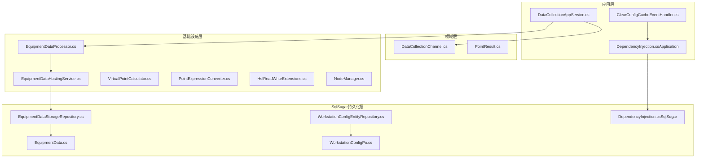
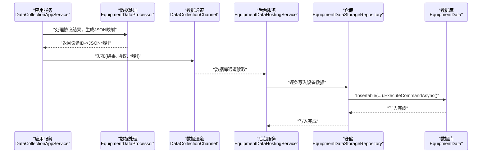
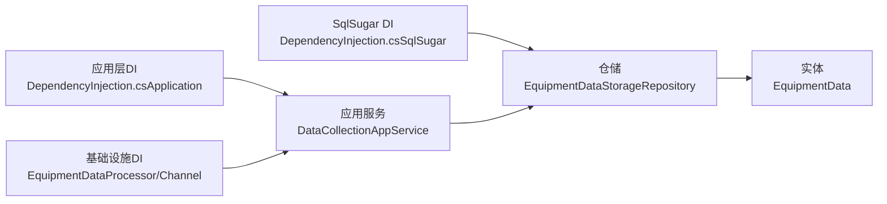

# 查询优化策略

<cite>
**本文档引用的文件**
- [EquipmentDataStorageRepository.cs](file://IndustrialDataSolution/IndustrialDataProcessor.Infrastructure.Persistence.SqlSugar/Repositories/EquipmentDataStorageRepository.cs)
- [WorkstationConfigEntityRepository.cs](file://IndustrialDataSolution/IndustrialDataProcessor.Infrastructure.Persistence.SqlSugar/Repositories/WorkstationConfigEntityRepository.cs)
- [EquipmentData.cs](file://IndustrialDataSolution/IndustrialDataProcessor.Infrastructure.Persistence.SqlSugar/DbEntities/EquipmentData.cs)
- [WorkstationConfigPo.cs](file://IndustrialDataSolution/IndustrialDataProcessor.Infrastructure.Persistence.SqlSugar/DbEntities/WorkstationConfigPo.cs)
- [DependencyInjection.cs（SqlSugar）](file://IndustrialDataSolution/IndustrialDataProcessor.Infrastructure.Persistence.SqlSugar/DependencyInjection.cs)
- [DependencyInjection.cs（Application）](file://IndustrialDataSolution/IndustrialDataProcessor.Application/DependencyInjection.cs)
- [DataCollectionAppService.cs](file://IndustrialDataSolution/IndustrialDataProcessor.Application/Services/DataCollectionAppService.cs)
- [DataCollectionChannel.cs](file://IndustrialDataSolution/IndustrialDataProcessor.Domain/Workstation/Results/DataCollectionChannel.cs)
- [EquipmentDataHostingService.cs](file://IndustrialDataSolution/IndustrialDataProcessor.Infrastructure/BackgroundServices/EquipmentDataHostingService.cs)
- [EquipmentDataProcessor.cs](file://IndustrialDataSolution/IndustrialDataProcessor.Infrastructure/EquipmentCollectionDataProcessing/EquipmentDataProcessor.cs)
- [CacheKeys.cs](file://IndustrialDataSolution/IndustrialDataProcessor.Application/Constants/CacheKeys.cs)
- [ClearConfigCacheEventHandler.cs](file://IndustrialDataSolution/IndustrialDataProcessor.Application/EventHandlers/ClearConfigCacheEventHandler.cs)
- [VirtualPointCalculator.cs](file://IndustrialDataSolution/IndustrialDataProcessor.Infrastructure/EquipmentCollectionDataProcessing/VirtualPointCalculator.cs)
- [PointExpressionConverter.cs](file://IndustrialDataSolution/IndustrialDataProcessor.Infrastructure/EquipmentCollectionDataProcessing/PointExpressionConverter.cs)
- [HslReadWriteExtensions.cs](file://IndustrialDataSolution/IndustrialDataProcessor.Infrastructure/Communication/Extensions/HslReadWriteExtensions.cs)
- [NodeManager.cs](file://IndustrialDataSolution/IndustrialDataProcessor.Infrastructure/OpcUa/NodeManager.cs)
- [Worker.cs](file://IndustrialDataSolution/IndustrialDataProcessor.Simulator/Worker.cs)
</cite>

## 目录
1. [简介](#简介)
2. [项目结构](#项目结构)
3. [核心组件](#核心组件)
4. [架构总览](#架构总览)
5. [详细组件分析](#详细组件分析)
6. [依赖关系分析](#依赖关系分析)
7. [性能考量与优化建议](#性能考量与优化建议)
8. [故障排查指南](#故障排查指南)
9. [结论](#结论)
10. [附录](#附录)

## 简介
本文件面向DDD工业数据处理解决方案，聚焦于基于SqlSugar的查询与写入优化策略，结合项目现有实现，系统阐述以下主题：
- Linq查询的性能分析与执行计划优化思路
- 索引设计原则（复合索引、覆盖索引、前缀索引）
- 批量操作优化（批量插入、更新、删除）
- 分页查询策略（大表分页与无状态分页）
- 查询缓存与结果集缓存机制
- 慢查询诊断与瓶颈定位
- 内存使用与垃圾回收影响

本文件严格基于仓库现有代码进行分析，避免臆测。

## 项目结构
本项目采用分层与领域驱动设计（DDD）组织方式，核心与数据访问层分离，查询与写入路径清晰：
- 应用层：负责业务编排、事件处理与服务注册
- 领域层：定义实体、结果模型与通道
- 基础设施层：封装通信、数据处理与持久化
- SqlSugar持久化层：提供仓储与实体映射

图表来源
- [DataCollectionAppService.cs](file://IndustrialDataSolution/IndustrialDataProcessor.Application/Services/DataCollectionAppService.cs#L1-L216)
- [DataCollectionChannel.cs](file://IndustrialDataSolution/IndustrialDataProcessor.Domain/Workstation/Results/DataCollectionChannel.cs#L1-L36)
- [EquipmentDataProcessor.cs](file://IndustrialDataSolution/IndustrialDataProcessor.Infrastructure/EquipmentCollectionDataProcessing/EquipmentDataProcessor.cs#L1-L124)
- [EquipmentDataHostingService.cs](file://IndustrialDataSolution/IndustrialDataProcessor.Infrastructure/BackgroundServices/EquipmentDataHostingService.cs#L1-L26)
- [EquipmentDataStorageRepository.cs](file://IndustrialDataSolution/IndustrialDataProcessor.Infrastructure.Persistence.SqlSugar/Repositories/EquipmentDataStorageRepository.cs#L1-L74)
- [WorkstationConfigEntityRepository.cs](file://IndustrialDataSolution/IndustrialDataProcessor.Infrastructure.Persistence.SqlSugar/Repositories/WorkstationConfigEntityRepository.cs#L1-L32)
- [EquipmentData.cs](file://IndustrialDataSolution/IndustrialDataProcessor.Infrastructure.Persistence.SqlSugar/DbEntities/EquipmentData.cs#L1-L38)
- [WorkstationConfigPo.cs](file://IndustrialDataSolution/IndustrialDataProcessor.Infrastructure.Persistence.SqlSugar/DbEntities/WorkstationConfigPo.cs#L1-L15)
- [DependencyInjection.cs（Application）](file://IndustrialDataSolution/IndustrialDataProcessor.Application/DependencyInjection.cs#L1-L40)
- [DependencyInjection.cs（SqlSugar）](file://IndustrialDataSolution/IndustrialDataProcessor.Infrastructure.Persistence.SqlSugar/DependencyInjection.cs#L1-L47)

章节来源
- [DependencyInjection.cs（Application）](file://IndustrialDataSolution/IndustrialDataProcessor.Application/DependencyInjection.cs#L1-L40)
- [DependencyInjection.cs（SqlSugar）](file://IndustrialDataSolution/IndustrialDataProcessor.Infrastructure.Persistence.SqlSugar/DependencyInjection.cs#L1-L47)

## 核心组件
- 设备数据写入仓储：负责将采集结果写入TimescaleDB超表，采用单条插入，具备异常处理与取消支持。
- 工作站配置仓储：提供“获取最新配置”能力，使用OrderByDescending + First实现Top-N查询。
- 实体映射：设备实时数据表与工作流配置表，分别标注主键与JSONB列类型。
- 应用服务：负责协议级采集循环、耗时统计与结果发布至多路通道。
- 通道与后台服务：将采集结果分发至OPC UA与数据库通道，数据库侧由后台服务消费并写入。

章节来源
- [EquipmentDataStorageRepository.cs](file://IndustrialDataSolution/IndustrialDataProcessor.Infrastructure.Persistence.SqlSugar/Repositories/EquipmentDataStorageRepository.cs#L1-L74)
- [WorkstationConfigEntityRepository.cs](file://IndustrialDataSolution/IndustrialDataProcessor.Infrastructure.Persistence.SqlSugar/Repositories/WorkstationConfigEntityRepository.cs#L1-L32)
- [EquipmentData.cs](file://IndustrialDataSolution/IndustrialDataProcessor.Infrastructure.Persistence.SqlSugar/DbEntities/EquipmentData.cs#L1-L38)
- [WorkstationConfigPo.cs](file://IndustrialDataSolution/IndustrialDataProcessor.Infrastructure.Persistence.SqlSugar/DbEntities/WorkstationConfigPo.cs#L1-L15)
- [DataCollectionAppService.cs](file://IndustrialDataSolution/IndustrialDataProcessor.Application/Services/DataCollectionAppService.cs#L1-L216)
- [DataCollectionChannel.cs](file://IndustrialDataSolution/IndustrialDataProcessor.Domain/Workstation/Results/DataCollectionChannel.cs#L1-L36)
- [EquipmentDataHostingService.cs](file://IndustrialDataSolution/IndustrialDataProcessor.Infrastructure/BackgroundServices/EquipmentDataHostingService.cs#L1-L26)

## 架构总览
下图展示从采集到入库的关键流程，以及与SqlSugar的交互位置。

图表来源
- [DataCollectionAppService.cs](file://IndustrialDataSolution/IndustrialDataProcessor.Application/Services/DataCollectionAppService.cs#L185-L198)
- [EquipmentDataProcessor.cs](file://IndustrialDataSolution/IndustrialDataProcessor.Infrastructure/EquipmentCollectionDataProcessing/EquipmentDataProcessor.cs#L21-L112)
- [DataCollectionChannel.cs](file://IndustrialDataSolution/IndustrialDataProcessor.Domain/Workstation/Results/DataCollectionChannel.cs#L25-L36)
- [EquipmentDataHostingService.cs](file://IndustrialDataSolution/IndustrialDataProcessor.Infrastructure/BackgroundServices/EquipmentDataHostingService.cs#L16-L26)
- [EquipmentDataStorageRepository.cs](file://IndustrialDataSolution/IndustrialDataProcessor.Infrastructure.Persistence.SqlSugar/Repositories/EquipmentDataStorageRepository.cs#L38-L72)
- [EquipmentData.cs](file://IndustrialDataSolution/IndustrialDataProcessor.Infrastructure.Persistence.SqlSugar/DbEntities/EquipmentData.cs#L10-L38)

## 详细组件分析

### 设备数据写入仓储（EquipmentDataStorageRepository）
- 职责：接收设备ID与采集数据字符串，构造实体并执行单条插入。
- 性能要点：
  - 使用Insertable单条插入，适合高吞吐写入场景；如需更高吞吐，可引入批量写入策略（见“批量操作优化”）。
  - 提供取消令牌支持，保证长时间写入可中断。
  - 异常处理完善：区分取消、数据库异常与未知异常，便于可观测性与恢复。
- 可优化方向：
  - 引入批量缓冲与异步提交，减少往返次数。
  - 在TimescaleDB侧评估压缩与分区策略，结合实体主键设计（time为主键）。

章节来源
- [EquipmentDataStorageRepository.cs](file://IndustrialDataSolution/IndustrialDataProcessor.Infrastructure.Persistence.SqlSugar/Repositories/EquipmentDataStorageRepository.cs#L1-L74)
- [EquipmentData.cs](file://IndustrialDataSolution/IndustrialDataProcessor.Infrastructure.Persistence.SqlSugar/DbEntities/EquipmentData.cs#L10-L38)

### 工作站配置仓储（WorkstationConfigEntityRepository）
- 职责：将领域实体映射为持久化对象，提供“获取最新配置”能力。
- 查询模式：OrderByDescending + First，实现按CreatedAt倒序取第一条。
- 性能要点：
  - 若按CreatedAt查询频繁，应确保该列有索引；OrderByDescending + First通常可利用索引高效定位。
  - 返回值映射使用Mapper，避免重复转换逻辑。

章节来源
- [WorkstationConfigEntityRepository.cs](file://IndustrialDataSolution/IndustrialDataProcessor.Infrastructure.Persistence.SqlSugar/Repositories/WorkstationConfigEntityRepository.cs#L1-L32)
- [WorkstationConfigPo.cs](file://IndustrialDataSolution/IndustrialDataProcessor.Infrastructure.Persistence.SqlSugar/DbEntities/WorkstationConfigPo.cs#L5-L15)

### 实体与表结构（EquipmentData、WorkstationConfigPo）
- EquipmentData：以time为主键（TimescaleDB超表分区键），包含equipment_id与jsonb类型的values列。
- WorkstationConfigPo：以createdAt为主键，json_content为jsonb列。
- 设计启示：
  - 主键选择与分区键一致，有利于时序数据的高效写入与查询。
  - jsonb列适合灵活存储设备参数，但查询时需谨慎，优先通过索引或物化列优化。

章节来源
- [EquipmentData.cs](file://IndustrialDataSolution/IndustrialDataProcessor.Infrastructure.Persistence.SqlSugar/DbEntities/EquipmentData.cs#L10-L38)
- [WorkstationConfigPo.cs](file://IndustrialDataSolution/IndustrialDataProcessor.Infrastructure.Persistence.SqlSugar/DbEntities/WorkstationConfigPo.cs#L5-L15)

### 应用服务与通道（DataCollectionAppService、DataCollectionChannel）
- DataCollectionAppService：协议级采集循环，统计各阶段耗时，最终将结果与JSON映射发布到通道。
- DataCollectionChannel：双通道（OPC UA与数据库）扇出，提高解耦与并发能力。
- 后台服务：EquipmentDataHostingService从数据库通道读取并调用仓储写入。

章节来源
- [DataCollectionAppService.cs](file://IndustrialDataSolution/IndustrialDataProcessor.Application/Services/DataCollectionAppService.cs#L19-L214)
- [DataCollectionChannel.cs](file://IndustrialDataSolution/IndustrialDataProcessor.Domain/Workstation/Results/DataCollectionChannel.cs#L1-L36)
- [EquipmentDataHostingService.cs](file://IndustrialDataSolution/IndustrialDataProcessor.Infrastructure/BackgroundServices/EquipmentDataHostingService.cs#L1-L26)

### 数据处理与虚拟点（EquipmentDataProcessor、VirtualPointCalculator、PointExpressionConverter）
- EquipmentDataProcessor：将采集结果转换为JSON映射，处理虚拟点与表达式计算。
- VirtualPointCalculator：基于表达式引擎计算虚拟点值。
- PointExpressionConverter：支持表达式逆向转换，便于写入场景还原。

章节来源
- [EquipmentDataProcessor.cs](file://IndustrialDataSolution/IndustrialDataProcessor.Infrastructure/EquipmentCollectionDataProcessing/EquipmentDataProcessor.cs#L1-L124)
- [VirtualPointCalculator.cs](file://IndustrialDataSolution/IndustrialDataProcessor.Infrastructure/EquipmentCollectionDataProcessing/VirtualPointCalculator.cs#L1-L39)
- [PointExpressionConverter.cs](file://IndustrialDataSolution/IndustrialDataProcessor.Infrastructure/EquipmentCollectionDataProcessing/PointExpressionConverter.cs#L68-L109)

## 依赖关系分析
- 依赖注入：
  - Application层注册应用服务、验证器、MediatR与内存缓存事件处理器。
  - Infrastructure层注册通道与数据处理组件。
  - SqlSugar层注册ISqlSugarClient与仓储实现。
- 组件耦合：
  - 应用服务依赖仓储接口与通道；仓储依赖SqlSugarClient；后台服务依赖仓储接口。
  - 事件处理器依赖内存缓存，用于清理配置缓存。

图表来源
- [DependencyInjection.cs（Application）](file://IndustrialDataSolution/IndustrialDataProcessor.Application/DependencyInjection.cs#L16-L39)
- [DependencyInjection.cs（SqlSugar）](file://IndustrialDataSolution/IndustrialDataProcessor.Infrastructure.Persistence.SqlSugar/DependencyInjection.cs#L11-L46)
- [DataCollectionAppService.cs](file://IndustrialDataSolution/IndustrialDataProcessor.Application/Services/DataCollectionAppService.cs#L10-L21)
- [EquipmentDataStorageRepository.cs](file://IndustrialDataSolution/IndustrialDataProcessor.Infrastructure.Persistence.SqlSugar/Repositories/EquipmentDataStorageRepository.cs#L11-L27)
- [EquipmentData.cs](file://IndustrialDataSolution/IndustrialDataProcessor.Infrastructure.Persistence.SqlSugar/DbEntities/EquipmentData.cs#L10-L38)

章节来源
- [DependencyInjection.cs（Application）](file://IndustrialDataSolution/IndustrialDataProcessor.Application/DependencyInjection.cs#L1-L40)
- [DependencyInjection.cs（SqlSugar）](file://IndustrialDataSolution/IndustrialDataProcessor.Infrastructure.Persistence.SqlSugar/DependencyInjection.cs#L1-L47)

## 性能考量与优化建议

### SqlSugar查询优化与执行计划优化
- Linq查询模式与索引配合：
  - WorkstationConfigEntityRepository使用OrderByDescending + First，建议在created_at列建立索引，确保查询走索引扫描而非全表扫描。
  - EquipmentData以time为主键，写入路径高效；查询时尽量使用time范围过滤，避免全表扫描。
- 参数化与日志：
  - 可在开发环境开启AOP日志，观察生成的SQL与参数，辅助定位慢查询。
- 批量写入：
  - 当前为单条插入，建议引入批量缓冲与异步提交，减少网络往返与事务开销。

章节来源
- [WorkstationConfigEntityRepository.cs](file://IndustrialDataSolution/IndustrialDataProcessor.Infrastructure.Persistence.SqlSugar/Repositories/WorkstationConfigEntityRepository.cs#L24-L31)
- [EquipmentDataStorageRepository.cs](file://IndustrialDataSolution/IndustrialDataProcessor.Infrastructure.Persistence.SqlSugar/Repositories/EquipmentDataStorageRepository.cs#L38-L72)
- [DependencyInjection.cs（SqlSugar）](file://IndustrialDataSolution/IndustrialDataProcessor.Infrastructure.Persistence.SqlSugar/DependencyInjection.cs#L28-L35)

### 索引策略设计原则
- 复合索引：
  - 对于高频过滤条件组合（如equipment_id + time），可考虑复合索引以提升范围查询效率。
- 覆盖索引：
  - 若查询仅涉及少量列，可通过覆盖索引避免回表，降低IO。
- 前缀索引：
  - 对于equipment_id这类前缀匹配场景，结合实际数据分布评估是否需要前缀索引。
- 注意事项：
  - 索引越多，写入成本越高；需结合读写比例与热点数据进行权衡。

（本节为通用优化建议，不直接分析具体文件）

### 批量操作优化方案
- 批量插入：
  - 使用SqlSugar的批量插入API（如Insertable(...).ExecuteCommandAsync），在应用层聚合一定数量后再提交。
- 批量更新/删除：
  - 通过Where条件与Update/Delete语句实现，避免逐条循环带来的性能损耗。
- 异步与并发：
  - 结合后台服务与通道，实现异步写入与背压控制，避免阻塞主线程。

章节来源
- [EquipmentDataStorageRepository.cs](file://IndustrialDataSolution/IndustrialDataProcessor.Infrastructure.Persistence.SqlSugar/Repositories/EquipmentDataStorageRepository.cs#L38-L72)
- [EquipmentDataHostingService.cs](file://IndustrialDataSolution/IndustrialDataProcessor.Infrastructure/BackgroundServices/EquipmentDataHostingService.cs#L16-L26)

### 分页查询实现策略
- 大表分页：
  - 基于时间窗口的游标分页：以time为游标，每次查询大于上次最大time的记录，避免offset跳转带来的性能问题。
- 无状态分页：
  - 使用LastKey或时间窗口作为无状态标记，客户端仅需记住上次的游标，服务端据此继续拉取。
- 注意：
  - 对于TimescaleDB超表，优先使用时间分区键进行过滤，减少扫描范围。

（本节为通用优化建议，不直接分析具体文件）

### 查询缓存与结果集缓存
- 内存缓存：
  - 应用层使用MemoryCache缓存最新工作站配置，事件更新时主动清理，避免脏读。
- 结果集缓存：
  - 对于稳定查询（如“获取最新配置”），可考虑短期缓存，结合ETag或版本号实现失效策略。
- 查询计划缓存：
  - PostgreSQL层面的查询计划缓存由数据库管理；应用侧可通过参数化SQL与索引优化提升命中率。

章节来源
- [CacheKeys.cs](file://IndustrialDataSolution/IndustrialDataProcessor.Application/Constants/CacheKeys.cs#L1-L7)
- [ClearConfigCacheEventHandler.cs](file://IndustrialDataSolution/IndustrialDataProcessor.Application/EventHandlers/ClearConfigCacheEventHandler.cs#L1-L26)

### 慢查询诊断与优化
- 诊断手段：
  - 开启SqlSugar AOP日志，捕获慢SQL与执行参数。
  - 结合应用层Stopwatch统计，定位协议级、设备级与点位级耗时瓶颈。
- 优化步骤：
  - 确认索引是否生效（EXPLAIN/ANALYZE）。
  - 减少不必要的JSONB解析，必要时物化常用字段。
  - 控制批量大小与并发度，避免数据库拥塞。

章节来源
- [DataCollectionAppService.cs](file://IndustrialDataSolution/IndustrialDataProcessor.Application/Services/DataCollectionAppService.cs#L61-L178)
- [DependencyInjection.cs（SqlSugar）](file://IndustrialDataSolution/IndustrialDataProcessor.Infrastructure.Persistence.SqlSugar/DependencyInjection.cs#L28-L35)

### 内存使用与垃圾回收影响
- 字符串与JSON序列化：
  - 大量JSON序列化与字符串拼接可能引发GC压力；建议复用缓冲区与避免中间对象过多。
- 并发与通道：
  - 使用Unbounded通道时需关注内存占用，结合背压策略限制堆积。
- 类型转换与表达式计算：
  - 表达式引擎与类型转换需谨慎，避免频繁装箱拆箱。

章节来源
- [EquipmentDataProcessor.cs](file://IndustrialDataSolution/IndustrialDataProcessor.Infrastructure/EquipmentCollectionDataProcessing/EquipmentDataProcessor.cs#L10-L19)
- [DataCollectionChannel.cs](file://IndustrialDataSolution/IndustrialDataProcessor.Domain/Workstation/Results/DataCollectionChannel.cs#L16-L20)

## 故障排查指南
- 写入异常处理：
  - 取消操作：记录警告，不向上抛出，避免干扰调用链。
  - 数据库异常：记录错误并包装为InvalidOperationException，便于上层感知。
  - 未知异常：统一记录并重新抛出，保留堆栈信息。
- 采集异常处理：
  - 协议级异常被捕获并记录，确保系统状态可见，避免静默失败。
- OPC UA写入：
  - 类型转换严格校验，防止BadTypeMismatch；异常时返回标准错误码。

章节来源
- [EquipmentDataStorageRepository.cs](file://IndustrialDataSolution/IndustrialDataProcessor.Infrastructure.Persistence.SqlSugar/Repositories/EquipmentDataStorageRepository.cs#L53-L71)
- [DataCollectionAppService.cs](file://IndustrialDataSolution/IndustrialDataProcessor.Application/Services/DataCollectionAppService.cs#L154-L171)
- [NodeManager.cs](file://IndustrialDataSolution/IndustrialDataProcessor.Infrastructure/OpcUa/NodeManager.cs#L385-L402)

## 结论
本方案通过清晰的分层与通道解耦，结合SqlSugar的简洁API与TimescaleDB的时序特性，实现了高吞吐的工业数据采集与写入。针对查询优化，建议重点围绕索引设计、参数化SQL与执行计划分析展开；在写入侧，优先采用批量与异步策略，并结合内存与GC策略降低峰值压力。通过事件驱动的缓存清理与可观测性日志，可进一步提升系统的稳定性与可维护性。

## 附录
- 相关背景服务与模拟器：
  - Worker用于演示后台任务运行，便于理解生命周期与取消信号。
  
章节来源
- [Worker.cs](file://IndustrialDataSolution/IndustrialDataProcessor.Simulator/Worker.cs#L1-L23)