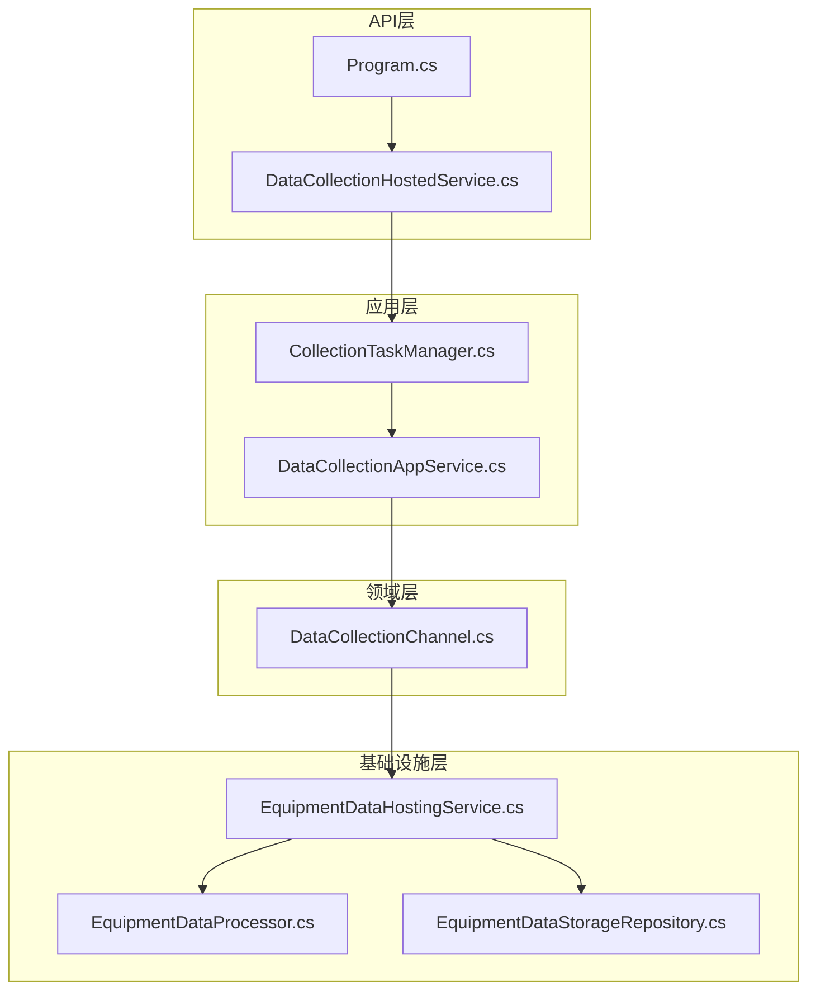
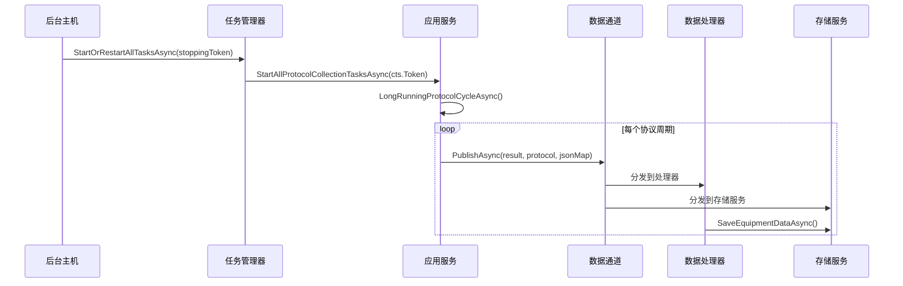
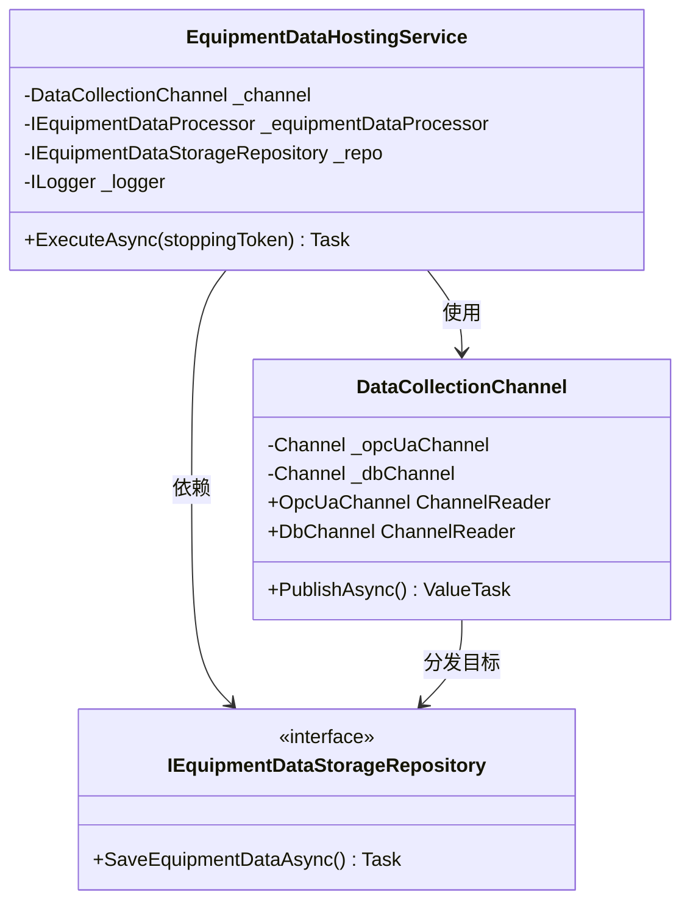
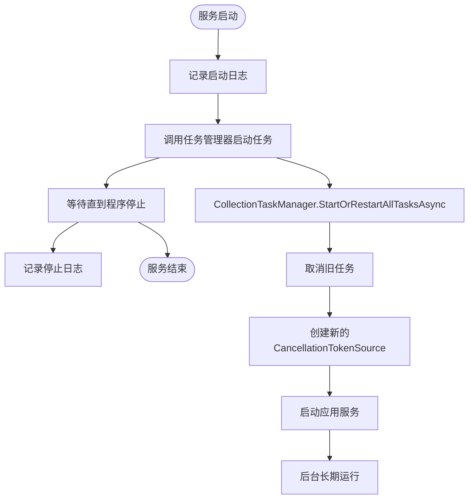
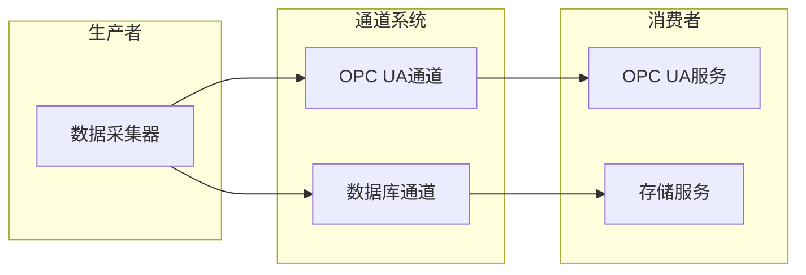
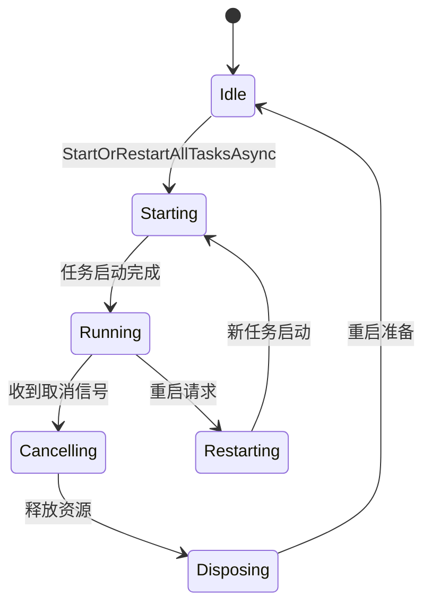
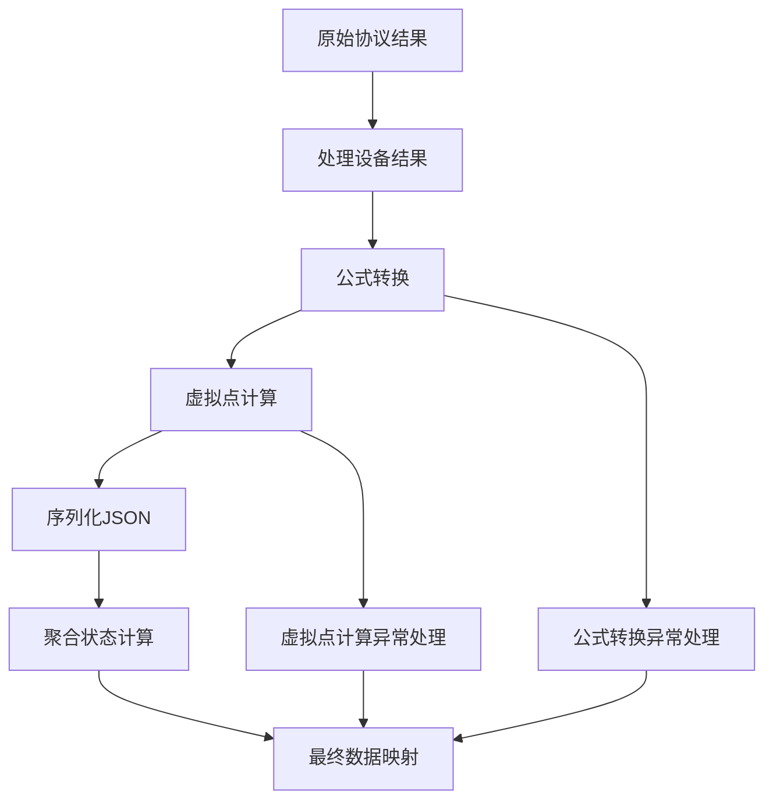
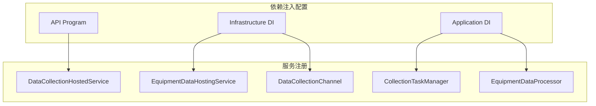

# 后台服务实现

<cite>
**本文档引用的文件**
- [EquipmentDataHostingService.cs](file://IndustrialDataSolution/IndustrialDataProcessor.Infrastructure/BackgroundServices/EquipmentDataHostingService.cs)
- [DataCollectionHostedService.cs](file://IndustrialDataSolution/IndustrialDataProcessor.Api/BackgroundServices/DataCollectionHostedService.cs)
- [DataCollectionChannel.cs](file://IndustrialDataSolution/IndustrialDataProcessor.Domain/Workstation/Results/DataCollectionChannel.cs)
- [CollectionTaskManager.cs](file://IndustrialDataSolution/IndustrialDataProcessor.Application/Services/CollectionTaskManager.cs)
- [DataCollectionAppService.cs](file://IndustrialDataSolution/IndustrialDataProcessor.Application/Services/DataCollectionAppService.cs)
- [EquipmentDataProcessor.cs](file://IndustrialDataSolution/IndustrialDataProcessor.Infrastructure/EquipmentCollectionDataProcessing/EquipmentDataProcessor.cs)
- [EquipmentDataStorageRepository.cs](file://IndustrialDataSolution/IndustrialDataProcessor.Infrastructure.Persistence.SqlSugar/Repositories/EquipmentDataStorageRepository.cs)
- [Program.cs](file://IndustrialDataSolution/IndustrialDataProcessor.Api/Program.cs)
- [DependencyInjection.cs](file://IndustrialDataSolution/IndustrialDataProcessor.Infrastructure/DependencyInjection.cs)
- [GlobalExceptionHandler.cs](file://IndustrialDataSolution/IndustrialDataProcessor.Api/Middleware/GlobalExceptionHandler.cs)
</cite>

## 目录
1. [简介](#简介)
2. [项目结构](#项目结构)
3. [核心组件](#核心组件)
4. [架构概览](#架构概览)
5. [详细组件分析](#详细组件分析)
6. [依赖关系分析](#依赖关系分析)
7. [性能考虑](#性能考虑)
8. [故障排除指南](#故障排除指南)
9. [结论](#结论)
10. [附录](#附录)

## 简介
本文档深入分析工业数据采集系统的后台服务实现，重点涵盖EquipmentDataHostingService和DataCollectionHostedService的设计架构与实现细节。系统采用基于通道(Channel)的异步数据流处理机制，通过BackgroundService基类实现服务的生命周期管理，包括启动、运行和停止过程。文档详细解释了取消令牌(stoppingToken)的使用和优雅关闭机制，以及服务注册和依赖注入的配置方式。

## 项目结构
系统采用分层架构设计，主要分为以下层次：
- API层：提供Web服务入口和后台托管服务注册
- 应用层：包含业务逻辑和服务编排
- 基础设施层：实现具体的数据处理和存储功能
- 领域层：定义核心业务模型和结果类型



**图表来源**
- [Program.cs](file://IndustrialDataSolution/IndustrialDataProcessor.Api/Program.cs#L1-L54)
- [DataCollectionHostedService.cs](file://IndustrialDataSolution/IndustrialDataProcessor.Api/BackgroundServices/DataCollectionHostedService.cs#L1-L28)
- [DataCollectionAppService.cs](file://IndustrialDataSolution/IndustrialDataProcessor.Application/Services/DataCollectionAppService.cs#L1-L216)
- [EquipmentDataHostingService.cs](file://IndustrialDataSolution/IndustrialDataProcessor.Infrastructure/BackgroundServices/EquipmentDataHostingService.cs#L1-L43)
- [DataCollectionChannel.cs](file://IndustrialDataSolution/IndustrialDataProcessor.Domain/Workstation/Results/DataCollectionChannel.cs#L1-L37)

**章节来源**
- [Program.cs](file://IndustrialDataSolution/IndustrialDataProcessor.Api/Program.cs#L1-L54)
- [DependencyInjection.cs](file://IndustrialDataSolution/IndustrialDataProcessor.Infrastructure/DependencyInjection.cs#L26-L81)

## 核心组件
系统的核心组件包括：

### 后台服务组件
- **DataCollectionHostedService**：负责启动和管理数据采集任务的后台服务
- **EquipmentDataHostingService**：专门处理设备数据持久化的后台服务

### 通道机制
- **DataCollectionChannel**：实现双通道数据分发，支持OPC UA和数据库两种输出路径

### 数据处理组件
- **CollectionTaskManager**：管理多个协议采集任务的启动、重启和取消
- **EquipmentDataProcessor**：处理设备数据转换、公式计算和状态聚合

**章节来源**
- [EquipmentDataHostingService.cs](file://IndustrialDataSolution/IndustrialDataProcessor.Infrastructure/BackgroundServices/EquipmentDataHostingService.cs#L1-L43)
- [DataCollectionHostedService.cs](file://IndustrialDataSolution/IndustrialDataProcessor.Api/BackgroundServices/DataCollectionHostedService.cs#L1-L28)
- [DataCollectionChannel.cs](file://IndustrialDataSolution/IndustrialDataProcessor.Domain/Workstation/Results/DataCollectionChannel.cs#L1-L37)

## 架构概览
系统采用事件驱动的异步架构，通过通道机制实现解耦的数据流处理：



**图表来源**
- [DataCollectionHostedService.cs](file://IndustrialDataSolution/IndustrialDataProcessor.Api/BackgroundServices/DataCollectionHostedService.cs#L15-L26)
- [CollectionTaskManager.cs](file://IndustrialDataSolution/IndustrialDataProcessor.Application/Services/CollectionTaskManager.cs#L19-L51)
- [DataCollectionAppService.cs](file://IndustrialDataSolution/IndustrialDataProcessor.Application/Services/DataCollectionAppService.cs#L22-L41)
- [DataCollectionChannel.cs](file://IndustrialDataSolution/IndustrialDataProcessor.Domain/Workstation/Results/DataCollectionChannel.cs#L29-L35)

## 详细组件分析

### EquipmentDataHostingService 分析
EquipmentDataHostingService是专门处理设备数据持久化的后台服务，实现了以下关键功能：

#### 核心实现机制
- 继承自BackgroundService基类，重写ExecuteAsync方法
- 使用DataCollectionChannel的DbChannel进行异步数据消费
- 通过stoppingToken实现优雅关闭



**图表来源**
- [EquipmentDataHostingService.cs](file://IndustrialDataSolution/IndustrialDataProcessor.Infrastructure/BackgroundServices/EquipmentDataHostingService.cs#L9-L42)
- [DataCollectionChannel.cs](file://IndustrialDataSolution/IndustrialDataProcessor.Domain/Workstation/Results/DataCollectionChannel.cs#L10-L36)

#### 生命周期管理
服务启动时：
1. 记录启动日志信息
2. 监听DataCollectionChannel的DbChannel
3. 处理传入的数据映射

服务停止时：
1. 捕获OperationCanceledException
2. 记录停止日志
3. 释放资源

**章节来源**
- [EquipmentDataHostingService.cs](file://IndustrialDataSolution/IndustrialDataProcessor.Infrastructure/BackgroundServices/EquipmentDataHostingService.cs#L16-L41)

### DataCollectionHostedService 分析
DataCollectionHostedService负责协调整个数据采集系统的启动和运行：

#### 任务管理流程


**图表来源**
- [DataCollectionHostedService.cs](file://IndustrialDataSolution/IndustrialDataProcessor.Api/BackgroundServices/DataCollectionHostedService.cs#L15-L26)
- [CollectionTaskManager.cs](file://IndustrialDataSolution/IndustrialDataProcessor.Application/Services/CollectionTaskManager.cs#L19-L51)

#### 关键实现特性
- 使用stoppingToken确保服务停止时能够优雅地取消所有子任务
- 通过Task.Delay(Timeout.Infinite, stoppingToken)实现无限期挂起
- 提供清晰的启动和停止日志记录

**章节来源**
- [DataCollectionHostedService.cs](file://IndustrialDataSolution/IndustrialDataProcessor.Api/BackgroundServices/DataCollectionHostedService.cs#L15-L26)

### DataCollectionChannel 通道机制分析
DataCollectionChannel实现了双通道的扇出(fan-out)机制：

#### 通道设计模式


**图表来源**
- [DataCollectionChannel.cs](file://IndustrialDataSolution/IndustrialDataProcessor.Domain/Workstation/Results/DataCollectionChannel.cs#L10-L36)

#### 实现特点
- 使用System.Threading.Channels实现线程安全的异步通信
- 支持无界通道，避免背压问题
- 提供PublishAsync方法实现并行扇出
- 每个通道都有独立的Reader接口供不同消费者订阅

**章节来源**
- [DataCollectionChannel.cs](file://IndustrialDataSolution/IndustrialDataProcessor.Domain/Workstation/Results/DataCollectionChannel.cs#L10-L36)

### CollectionTaskManager 任务管理分析
CollectionTaskManager负责管理多个协议采集任务的生命周期：

#### 任务管理策略


**图表来源**
- [CollectionTaskManager.cs](file://IndustrialDataSolution/IndustrialDataProcessor.Application/Services/CollectionTaskManager.cs#L19-L51)

#### 关键实现机制
- 使用SemaphoreSlim确保重启操作的互斥性
- 通过CancellationTokenSource.CreateLinkedTokenSource实现任务链式取消
- 支持动态重启现有任务
- 提供详细的日志记录和异常处理

**章节来源**
- [CollectionTaskManager.cs](file://IndustrialDataSolution/IndustrialDataProcessor.Application/Services/CollectionTaskManager.cs#L6-L60)

### EquipmentDataProcessor 数据处理分析
EquipmentDataProcessor负责设备数据的转换、计算和状态聚合：

#### 数据处理流程


**图表来源**
- [EquipmentDataProcessor.cs](file://IndustrialDataSolution/IndustrialDataProcessor.Infrastructure/EquipmentCollectionDataProcessing/EquipmentDataProcessor.cs#L21-L48)

#### 处理策略
- 支持虚拟点的特殊处理逻辑
- 实现公式转换和数值计算
- 提供最终的状态聚合和统计
- 包含完善的异常处理和日志记录

**章节来源**
- [EquipmentDataProcessor.cs](file://IndustrialDataSolution/IndustrialDataProcessor.Infrastructure/EquipmentCollectionDataProcessing/EquipmentDataProcessor.cs#L9-L157)

## 依赖关系分析

### 服务注册配置
系统通过依赖注入容器管理服务的生命周期和依赖关系：



**图表来源**
- [Program.cs](file://IndustrialDataSolution/IndustrialDataProcessor.Api/Program.cs#L24-L25)
- [DependencyInjection.cs](file://IndustrialDataSolution/IndustrialDataProcessor.Infrastructure/DependencyInjection.cs#L37-L38)
- [DependencyInjection.cs](file://IndustrialDataSolution/IndustrialDataProcessor.Application/DependencyInjection.cs#L23-L26)

### 依赖注入最佳实践
- 使用AddScoped注册应用服务，确保DbContext的作用域正确性
- 使用AddSingleton注册无状态的服务以提升性能
- 通过IServiceScopeFactory实现作用域内服务解析
- 支持动态协议驱动的自动注册

**章节来源**
- [DependencyInjection.cs](file://IndustrialDataSolution/IndustrialDataProcessor.Infrastructure/DependencyInjection.cs#L55-L62)
- [DependencyInjection.cs](file://IndustrialDataSolution/IndustrialDataProcessor.Application/DependencyInjection.cs#L16-L28)

## 性能考虑

### 异步处理优化
系统采用多层异步处理机制：
- 使用Channels实现无阻塞的数据传输
- 通过Task.Run实现协议级独立线程池
- 支持并行的扇出处理，避免串行瓶颈

### 内存管理
- 使用ConcurrentDictionary进行线程安全的数据存储
- 通过虚拟点计算器减少不必要的计算开销
- 实现合理的对象池和缓存策略

### 监控和诊断
- 提供详细的性能计时和统计信息
- 支持协议级和设备级的性能监控
- 包含完整的异常日志和错误追踪

## 故障排除指南

### 常见问题及解决方案

#### 服务启动失败
**症状**：后台服务无法启动或立即退出
**可能原因**：
- 依赖注入配置错误
- 数据库连接失败
- 配置文件缺失

**解决步骤**：
1. 检查Program.cs中的服务注册顺序
2. 验证数据库连接字符串配置
3. 确认appsettings.json配置完整

#### 数据采集异常
**症状**：设备数据无法正常采集或存储
**可能原因**：
- 协议驱动不匹配
- 网络连接不稳定
- 设备配置错误

**解决步骤**：
1. 检查协议类型配置
2. 验证网络连通性
3. 确认设备地址和参数设置

#### 性能问题
**症状**：系统响应缓慢或内存占用过高
**可能原因**：
- 通道积压
- 处理器负载过重
- 存储性能瓶颈

**解决步骤**：
1. 监控通道队列长度
2. 优化处理器算法
3. 调整存储配置

**章节来源**
- [GlobalExceptionHandler.cs](file://IndustrialDataSolution/IndustrialDataProcessor.Api/Middleware/GlobalExceptionHandler.cs#L12-L47)
- [EquipmentDataStorageRepository.cs](file://IndustrialDataSolution/IndustrialDataProcessor.Infrastructure.Persistence.SqlSugar/Repositories/EquipmentDataStorageRepository.cs#L55-L71)

## 结论
该工业数据采集系统的后台服务实现展现了现代.NET应用的最佳实践。通过合理的分层架构、异步处理机制和依赖注入配置，系统实现了高可用性和可扩展性。关键特性包括：

1. **模块化设计**：各组件职责明确，便于维护和测试
2. **异步处理**：充分利用.NET的异步编程模型提升性能
3. **优雅关闭**：完善的取消令牌机制确保服务稳定退出
4. **可观测性**：全面的日志记录和异常处理机制
5. **可扩展性**：支持动态协议驱动和灵活的服务配置

该实现为工业物联网应用提供了可靠的数据采集和处理基础，具备良好的性能表现和故障恢复能力。

## 附录

### 使用示例

#### 服务注册示例
```csharp
// 在Program.cs中注册后台服务
builder.Services.AddHostedService<DataCollectionHostedService>();
builder.Services.AddHostedService<EquipmentDataHostingService>();
```

#### 配置依赖注入
```csharp
// 在Infrastructure层注册
services.AddHostedService<EquipmentDataHostingService>();
services.AddSingleton<DataCollectionChannel>();
services.AddSingleton<IEquipmentDataProcessor, EquipmentDataProcessor>();
```

### 最佳实践建议
1. **错误处理**：始终捕获并记录异常，避免服务崩溃
2. **资源管理**：及时释放CancellationTokenSource和数据库连接
3. **性能监控**：定期检查通道队列长度和处理延迟
4. **日志配置**：合理设置日志级别，平衡信息详细程度和性能影响
5. **测试策略**：为关键组件编写单元测试和集成测试