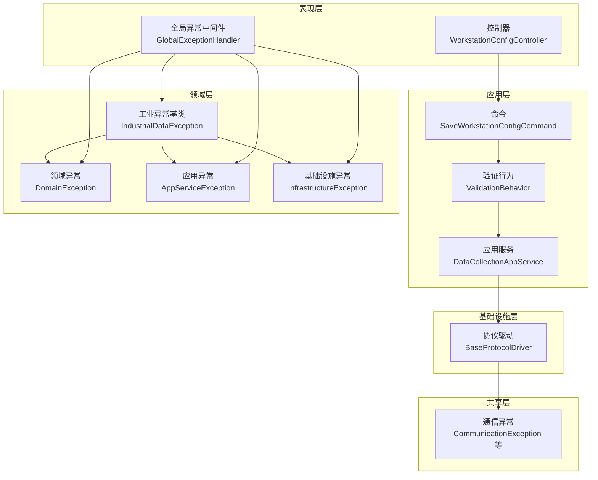
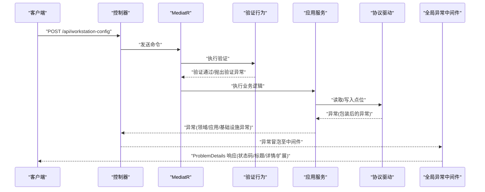
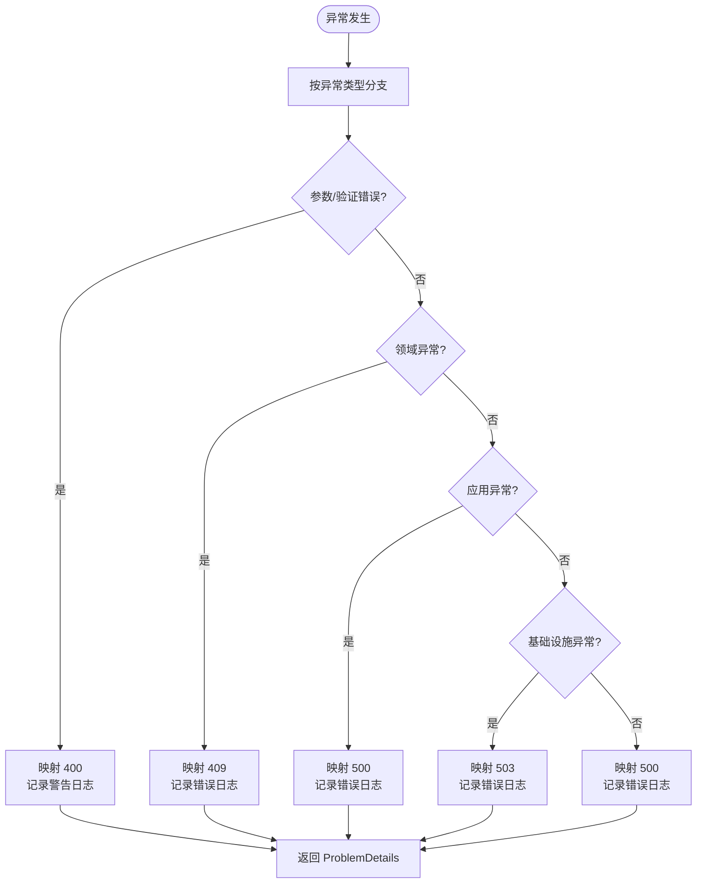
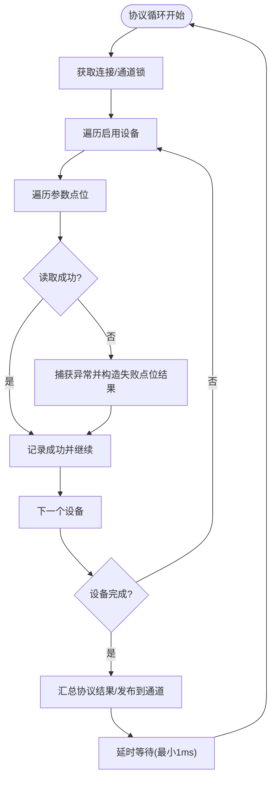
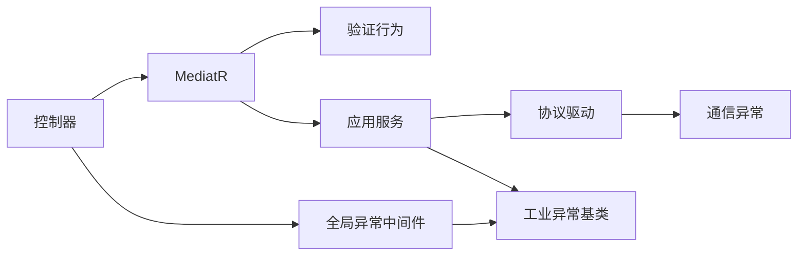

# 异常处理机制

<cite>
**本文引用的文件**
- [IndustrialDataException.cs](file://IndustrialDataSolution/IndustrialDataProcessor.Domain/Exceptions/IndustrialDataException.cs)
- [DomainException.cs](file://IndustrialDataSolution/IndustrialDataProcessor.Domain/Exceptions/DomainException.cs)
- [AppServiceException.cs](file://IndustrialDataSolution/IndustrialDataProcessor.Domain/Exceptions/AppServiceException.cs)
- [InfrastructureException.cs](file://IndustrialDataSolution/IndustrialDataProcessor.Domain/Exceptions/InfrastructureException.cs)
- [CommunicationException.cs](file://IndustrialDataSolution/IndustrialDataProcessor.Share/Exceptions/Communication/CommunicationException.cs)
- [TransientCommunicationException.cs](file://IndustrialDataSolution/IndustrialDataProcessor.Share/Exceptions/Communication/TransientCommunicationException.cs)
- [DeviceUnavailableException.cs](file://IndustrialDataSolution/IndustrialDataProcessor.Share/Exceptions/Communication/DeviceUnavailableException.cs)
- [ProtocolNotSupportedException.cs](file://IndustrialDataSolution/IndustrialDataProcessor.Share/Exceptions/Communication/ProtocolNotSupportedException.cs)
- [GlobalExceptionHandler.cs](file://IndustrialDataSolution/IndustrialDataProcessor.Api/Middleware/GlobalExceptionHandler.cs)
- [ValidationBehavior.cs](file://IndustrialDataSolution/IndustrialDataProcessor.Application/Behaviors/ValidationBehavior.cs)
- [DataCollectionAppService.cs](file://IndustrialDataSolution/IndustrialDataProcessor.Application/Services/DataCollectionAppService.cs)
- [BaseProtocolDriver.cs](file://IndustrialDataSolution/IndustrialDataProcessor.Infrastructure/Communication/Drivers/TcpCommon/BaseProtocolDriver.cs)
- [WorkstationConfigController.cs](file://IndustrialDataSolution/IndustrialDataProcessor.Api/Controllers/WorkstationConfigController.cs)
- [SaveWorkstationConfigCommand.cs](file://IndustrialDataSolution/IndustrialDataProcessor.Application/Commands/SaveWorkstationConfigCommand.cs)
- [appsettings.Development.json](file://IndustrialDataSolution/IndustrialDataProcessor.Api/appsettings.Development.json)
</cite>

## 目录
1. [引言](#引言)
2. [项目结构](#项目结构)
3. [核心组件](#核心组件)
4. [架构总览](#架构总览)
5. [详细组件分析](#详细组件分析)
6. [依赖关系分析](#依赖关系分析)
7. [性能考量](#性能考量)
8. [故障排查指南](#故障排查指南)
9. [结论](#结论)
10. [附录](#附录)

## 引言
本文件系统性梳理工业数据采集系统的异常处理机制，覆盖异常分类体系、异常传播路径与处理优先级、日志记录与错误格式化、用户友好提示、异常恢复与降级策略、监控与告警建议，以及常见场景的最佳实践与调试技巧。重点解读领域层异常基类与应用层异常类的设计意图与使用边界；阐述通信异常的特殊处理与可恢复策略；并给出端到端的异常处理流程图与关键组件交互序列图。

## 项目结构
异常处理涉及多层协作：
- 领域层：定义全局异常基类与领域/应用/基础设施层专用异常，统一语义与传播边界。
- 共享层：通信相关异常类型，用于表达设备、协议、瞬时故障等场景。
- 应用层：采集服务在协议级进行隔离与恢复，避免单点异常影响整体。
- 基础设施层：协议驱动封装底层读写异常，向上抛出统一包装后的异常。
- 表现层：全局异常中间件负责将异常映射为标准化的 ProblemDetails 响应，并记录结构化日志。

图表来源
- [WorkstationConfigController.cs](file://IndustrialDataSolution/IndustrialDataProcessor.Api/Controllers/WorkstationConfigController.cs#L1-L22)
- [SaveWorkstationConfigCommand.cs](file://IndustrialDataSolution/IndustrialDataProcessor.Application/Commands/SaveWorkstationConfigCommand.cs#L1-L9)
- [ValidationBehavior.cs](file://IndustrialDataSolution/IndustrialDataProcessor.Application/Behaviors/ValidationBehavior.cs#L1-L31)
- [DataCollectionAppService.cs](file://IndustrialDataSolution/IndustrialDataProcessor.Application/Services/DataCollectionAppService.cs#L1-L216)
- [IndustrialDataException.cs](file://IndustrialDataSolution/IndustrialDataProcessor.Domain/Exceptions/IndustrialDataException.cs#L1-L9)
- [DomainException.cs](file://IndustrialDataSolution/IndustrialDataProcessor.Domain/Exceptions/DomainException.cs#L1-L7)
- [AppServiceException.cs](file://IndustrialDataSolution/IndustrialDataProcessor.Domain/Exceptions/AppServiceException.cs#L1-L9)
- [InfrastructureException.cs](file://IndustrialDataSolution/IndustrialDataProcessor.Domain/Exceptions/InfrastructureException.cs#L1-L10)
- [CommunicationException.cs](file://IndustrialDataSolution/IndustrialDataProcessor.Share/Exceptions/Communication/CommunicationException.cs#L1-L6)
- [BaseProtocolDriver.cs](file://IndustrialDataSolution/IndustrialDataProcessor.Infrastructure/Communication/Drivers/TcpCommon/BaseProtocolDriver.cs#L1-L108)
- [GlobalExceptionHandler.cs](file://IndustrialDataSolution/IndustrialDataProcessor.Api/Middleware/GlobalExceptionHandler.cs#L1-L94)

章节来源
- [WorkstationConfigController.cs](file://IndustrialDataSolution/IndustrialDataProcessor.Api/Controllers/WorkstationConfigController.cs#L1-L22)
- [DataCollectionAppService.cs](file://IndustrialDataSolution/IndustrialDataProcessor.Application/Services/DataCollectionAppService.cs#L1-L216)
- [GlobalExceptionHandler.cs](file://IndustrialDataSolution/IndustrialDataProcessor.Api/Middleware/GlobalExceptionHandler.cs#L1-L94)

## 核心组件
- 工业异常基类（领域层）
  - 作为全局异常基类，统一消息与内层异常承载，便于跨层识别与处理。
  - 位置：领域层异常命名空间，供领域/应用/基础设施层继承或抛出。
- 领域异常（DomainException）
  - 用于表达业务规则破坏、聚合状态无效等场景，HTTP 映射为 409 冲突。
- 应用异常（AppServiceException）
  - 用于用例执行失败、并发冲突、工作流失败等，HTTP 映射为 500。
- 基础设施异常（InfrastructureException）
  - 用于数据库/外部服务不可用等，HTTP 映射为 503。
- 通信异常（共享层）
  - CommunicationException：通用通信错误。
  - TransientCommunicationException：瞬时通信异常，强调可重试。
  - DeviceUnavailableException：设备不可达。
  - ProtocolNotSupportedException：协议不支持。

章节来源
- [IndustrialDataException.cs](file://IndustrialDataSolution/IndustrialDataProcessor.Domain/Exceptions/IndustrialDataException.cs#L1-L9)
- [DomainException.cs](file://IndustrialDataSolution/IndustrialDataProcessor.Domain/Exceptions/DomainException.cs#L1-L7)
- [AppServiceException.cs](file://IndustrialDataSolution/IndustrialDataProcessor.Domain/Exceptions/AppServiceException.cs#L1-L9)
- [InfrastructureException.cs](file://IndustrialDataSolution/IndustrialDataProcessor.Domain/Exceptions/InfrastructureException.cs#L1-L10)
- [CommunicationException.cs](file://IndustrialDataSolution/IndustrialDataProcessor.Share/Exceptions/Communication/CommunicationException.cs#L1-L6)
- [TransientCommunicationException.cs](file://IndustrialDataSolution/IndustrialDataProcessor.Share/Exceptions/Communication/TransientCommunicationException.cs#L1-L6)
- [DeviceUnavailableException.cs](file://IndustrialDataSolution/IndustrialDataProcessor.Share/Exceptions/Communication/DeviceUnavailableException.cs#L1-L6)
- [ProtocolNotSupportedException.cs](file://IndustrialDataSolution/IndustrialDataProcessor.Share/Exceptions/Communication/ProtocolNotSupportedException.cs#L1-L6)

## 架构总览
异常处理遵循“分层语义 + 统一映射 + 结构化日志 + 用户友好响应”的设计原则：
- 分层语义：领域/应用/基础设施异常分别对应不同语义与处理策略。
- 统一映射：全局中间件将异常映射为标准化 ProblemDetails，含状态码、标题、详情与扩展字段。
- 结构化日志：中间件按异常类型记录上下文信息（路径、方法、消息），便于审计与检索。
- 用户友好：对验证错误输出 RFC 7807 标准格式，包含字段级错误字典；对业务冲突与基础设施故障提供明确提示。

图表来源
- [WorkstationConfigController.cs](file://IndustrialDataSolution/IndustrialDataProcessor.Api/Controllers/WorkstationConfigController.cs#L1-L22)
- [ValidationBehavior.cs](file://IndustrialDataSolution/IndustrialDataProcessor.Application/Behaviors/ValidationBehavior.cs#L1-L31)
- [DataCollectionAppService.cs](file://IndustrialDataSolution/IndustrialDataProcessor.Application/Services/DataCollectionAppService.cs#L1-L216)
- [BaseProtocolDriver.cs](file://IndustrialDataSolution/IndustrialDataProcessor.Infrastructure/Communication/Drivers/TcpCommon/BaseProtocolDriver.cs#L1-L108)
- [GlobalExceptionHandler.cs](file://IndustrialDataSolution/IndustrialDataProcessor.Api/Middleware/GlobalExceptionHandler.cs#L1-L94)

## 详细组件分析

### 异常分类与传播路径
- 分类体系
  - 领域层：DomainException（409 冲突）。
  - 应用层：AppServiceException（500 服务错误）。
  - 基础设施层：InfrastructureException（503 不可用）。
  - 通信层：CommunicationException 及其子类（瞬时/设备不可达/协议不支持）。
- 传播路径
  - 控制器接收请求，MediatR 调用命令处理器，应用服务执行采集或业务逻辑。
  - 协议驱动在读写时捕获底层异常并统一包装，向上抛出。
  - 全局中间件捕获异常，按类型映射为标准 ProblemDetails，并记录日志。
- 处理优先级
  - 参数类异常（空/参数错误）优先映射为 400。
  - 验证异常（FluentValidation）映射为 400 并输出字段级错误字典。
  - 领域异常映射为 409。
  - 应用异常映射为 500。
  - 基础设施异常映射为 503。
  - 其他未知异常映射为 500。

图表来源
- [GlobalExceptionHandler.cs](file://IndustrialDataSolution/IndustrialDataProcessor.Api/Middleware/GlobalExceptionHandler.cs#L12-L47)

章节来源
- [GlobalExceptionHandler.cs](file://IndustrialDataSolution/IndustrialDataProcessor.Api/Middleware/GlobalExceptionHandler.cs#L1-L94)

### 通信异常的特殊处理机制
- 瞬时通信异常（TransientCommunicationException）
  - 表示可重试的通信故障，建议采用指数退避重试策略，避免雪崩。
- 设备不可达（DeviceUnavailableException）
  - 标识目标设备暂时不可用，应用层可选择降级或延迟重试。
- 协议不支持（ProtocolNotSupportedException）
  - 在协议选择或配置阶段尽早发现，避免运行期反复尝试。
- 通用通信异常（CommunicationException）
  - 作为通信层异常的基类，便于统一捕获与日志记录。

章节来源
- [TransientCommunicationException.cs](file://IndustrialDataSolution/IndustrialDataProcessor.Share/Exceptions/Communication/TransientCommunicationException.cs#L1-L6)
- [DeviceUnavailableException.cs](file://IndustrialDataSolution/IndustrialDataProcessor.Share/Exceptions/Communication/DeviceUnavailableException.cs#L1-L6)
- [ProtocolNotSupportedException.cs](file://IndustrialDataSolution/IndustrialDataProcessor.Share/Exceptions/Communication/ProtocolNotSupportedException.cs#L1-L6)
- [CommunicationException.cs](file://IndustrialDataSolution/IndustrialDataProcessor.Share/Exceptions/Communication/CommunicationException.cs#L1-L6)

### 应用服务中的异常恢复与降级
- 协议级隔离
  - 每个协议在独立线程中循环执行，单协议异常不影响其他协议。
- 点位级容错
  - 驱动层捕获异常并包装，应用服务记录错误点位但继续执行后续点位。
- 协议级失败降级
  - 当出现底层连接或全局异常时，协议结果标记失败，下游仍可收到断线状态，避免静默失败。
- 数据通道写入兜底
  - 即使写入通道失败也记录日志，保证可观测性。

图表来源
- [DataCollectionAppService.cs](file://IndustrialDataSolution/IndustrialDataProcessor.Application/Services/DataCollectionAppService.cs#L46-L214)
- [BaseProtocolDriver.cs](file://IndustrialDataSolution/IndustrialDataProcessor.Infrastructure/Communication/Drivers/TcpCommon/BaseProtocolDriver.cs#L26-L72)

章节来源
- [DataCollectionAppService.cs](file://IndustrialDataSolution/IndustrialDataProcessor.Application/Services/DataCollectionAppService.cs#L1-L216)
- [BaseProtocolDriver.cs](file://IndustrialDataSolution/IndustrialDataProcessor.Infrastructure/Communication/Drivers/TcpCommon/BaseProtocolDriver.cs#L1-L108)

### 日志记录、错误格式化与用户友好提示
- 结构化日志
  - 中间件区分参数验证失败与一般异常，记录请求路径、方法与消息，便于检索。
- ProblemDetails 标准化
  - 统一状态码、标题、详情与实例路径；验证异常输出字段级错误字典到扩展字段。
- 用户提示
  - 对业务冲突与基础设施不可用提供明确提示，帮助用户理解并采取行动。

章节来源
- [GlobalExceptionHandler.cs](file://IndustrialDataSolution/IndustrialDataProcessor.Api/Middleware/GlobalExceptionHandler.cs#L14-L92)

### 异常恢复策略与降级方案
- 瞬时故障重试
  - 对瞬时通信异常采用指数退避重试，限制最大重试次数与总超时。
- 设备不可达降级
  - 暂停对该设备的采集，保留配置并在设备恢复后自动恢复。
- 协议不支持提示
  - 在配置阶段阻止无效协议，避免运行期浪费资源。
- 协议级失败降级
  - 协议失败时仍发布断线状态，下游可根据状态进行降级处理。

章节来源
- [TransientCommunicationException.cs](file://IndustrialDataSolution/IndustrialDataProcessor.Share/Exceptions/Communication/TransientCommunicationException.cs#L1-L6)
- [DeviceUnavailableException.cs](file://IndustrialDataSolution/IndustrialDataProcessor.Share/Exceptions/Communication/DeviceUnavailableException.cs#L1-L6)
- [ProtocolNotSupportedException.cs](file://IndustrialDataSolution/IndustrialDataProcessor.Share/Exceptions/Communication/ProtocolNotSupportedException.cs#L1-L6)
- [DataCollectionAppService.cs](file://IndustrialDataSolution/IndustrialDataProcessor.Application/Services/DataCollectionAppService.cs#L159-L171)

### 异常监控与告警
- 建议指标
  - 各类异常计数（400/409/500/503）、验证失败字段分布、协议失败率、设备不可达次数。
- 告警阈值
  - 连续 N 分钟内协议失败率超过阈值、验证失败占比异常升高、基础设施不可用持续时间过长。
- 日志与追踪
  - 结合请求路径与异常类型建立索引，支持按路径/异常类型检索；在分布式场景下注入 TraceId。

章节来源
- [GlobalExceptionHandler.cs](file://IndustrialDataSolution/IndustrialDataProcessor.Api/Middleware/GlobalExceptionHandler.cs#L14-L47)
- [appsettings.Development.json](file://IndustrialDataSolution/IndustrialDataProcessor.Api/appsettings.Development.json#L1-L8)

### 常见异常场景与最佳实践
- 参数缺失/错误
  - 使用 ArgumentNullException/ArgumentException，映射 400；记录警告日志。
- 配置验证失败
  - 使用 FluentValidation，输出字段级错误字典；记录 400。
- 业务规则冲突
  - 抛出 DomainException，映射 409；记录错误日志。
- 用例执行失败
  - 抛出 AppServiceException，映射 500；记录错误日志。
- 基础设施不可用
  - 抛出 InfrastructureException，映射 503；记录错误日志。
- 通信瞬时故障
  - 使用 TransientCommunicationException，实施重试；记录错误日志。
- 设备不可达
  - 使用 DeviceUnavailableException，暂停采集并延迟重试；记录错误日志。
- 协议不支持
  - 使用 ProtocolNotSupportedException，在配置阶段拦截；记录错误日志。

章节来源
- [GlobalExceptionHandler.cs](file://IndustrialDataSolution/IndustrialDataProcessor.Api/Middleware/GlobalExceptionHandler.cs#L22-L46)
- [ValidationBehavior.cs](file://IndustrialDataSolution/IndustrialDataProcessor.Application/Behaviors/ValidationBehavior.cs#L12-L28)
- [DataCollectionAppService.cs](file://IndustrialDataSolution/IndustrialDataProcessor.Application/Services/DataCollectionAppService.cs#L159-L171)
- [BaseProtocolDriver.cs](file://IndustrialDataSolution/IndustrialDataProcessor.Infrastructure/Communication/Drivers/TcpCommon/BaseProtocolDriver.cs#L36-L40)

### 异常调试与问题定位技巧
- 结构化日志
  - 关注中间件日志中的请求路径、方法与消息，快速定位异常来源。
- 验证异常定位
  - 查看 ProblemDetails 扩展字段中的错误字典，定位具体字段与错误信息。
- 协议级失败排查
  - 观察协议循环日志与最终发布的协议结果，确认失败原因与影响范围。
- 驱动异常包装
  - 驱动层统一包装异常，注意异常消息中的协议名与点位地址，便于快速定位。

章节来源
- [GlobalExceptionHandler.cs](file://IndustrialDataSolution/IndustrialDataProcessor.Api/Middleware/GlobalExceptionHandler.cs#L14-L92)
- [DataCollectionAppService.cs](file://IndustrialDataSolution/IndustrialDataProcessor.Application/Services/DataCollectionAppService.cs#L159-L171)
- [BaseProtocolDriver.cs](file://IndustrialDataSolution/IndustrialDataProcessor.Infrastructure/Communication/Drivers/TcpCommon/BaseProtocolDriver.cs#L36-L40)

## 依赖关系分析
- 控制器通过 MediatR 发送命令，命令经验证行为与应用服务处理。
- 应用服务依赖协议驱动与连接管理，驱动层封装底层异常并向上传递。
- 全局异常中间件横切各层，统一处理异常并输出标准化响应。

图表来源
- [WorkstationConfigController.cs](file://IndustrialDataSolution/IndustrialDataProcessor.Api/Controllers/WorkstationConfigController.cs#L1-L22)
- [ValidationBehavior.cs](file://IndustrialDataSolution/IndustrialDataProcessor.Application/Behaviors/ValidationBehavior.cs#L1-L31)
- [DataCollectionAppService.cs](file://IndustrialDataSolution/IndustrialDataProcessor.Application/Services/DataCollectionAppService.cs#L1-L216)
- [BaseProtocolDriver.cs](file://IndustrialDataSolution/IndustrialDataProcessor.Infrastructure/Communication/Drivers/TcpCommon/BaseProtocolDriver.cs#L1-L108)
- [GlobalExceptionHandler.cs](file://IndustrialDataSolution/IndustrialDataProcessor.Api/Middleware/GlobalExceptionHandler.cs#L1-L94)

章节来源
- [WorkstationConfigController.cs](file://IndustrialDataSolution/IndustrialDataProcessor.Api/Controllers/WorkstationConfigController.cs#L1-L22)
- [ValidationBehavior.cs](file://IndustrialDataSolution/IndustrialDataProcessor.Application/Behaviors/ValidationBehavior.cs#L1-L31)
- [DataCollectionAppService.cs](file://IndustrialDataSolution/IndustrialDataProcessor.Application/Services/DataCollectionAppService.cs#L1-L216)
- [BaseProtocolDriver.cs](file://IndustrialDataSolution/IndustrialDataProcessor.Infrastructure/Communication/Drivers/TcpCommon/BaseProtocolDriver.cs#L1-L108)
- [GlobalExceptionHandler.cs](file://IndustrialDataSolution/IndustrialDataProcessor.Api/Middleware/GlobalExceptionHandler.cs#L1-L94)

## 性能考量
- 协议级线程隔离：避免相互阻塞，提升吞吐与稳定性。
- 最小延时保障：协议循环延时至少 1ms，防止 CPU 空转。
- 通道锁粒度：驱动层获取通道锁，避免并发冲突导致的重试风暴。
- 日志级别：开发环境默认日志级别，生产环境结合采样与异步日志优化性能。

章节来源
- [DataCollectionAppService.cs](file://IndustrialDataSolution/IndustrialDataProcessor.Application/Services/DataCollectionAppService.cs#L204-L210)
- [BaseProtocolDriver.cs](file://IndustrialDataSolution/IndustrialDataProcessor.Infrastructure/Communication/Drivers/TcpCommon/BaseProtocolDriver.cs#L30-L34)
- [appsettings.Development.json](file://IndustrialDataSolution/IndustrialDataProcessor.Api/appsettings.Development.json#L1-L8)

## 故障排查指南
- 快速定位
  - 查看中间件日志中的路径与方法，结合异常类型快速判断来源。
- 验证失败
  - 检查返回的字段级错误字典，逐项修正。
- 业务冲突
  - 根据 DomainException 的消息与上下文，检查业务规则与数据一致性。
- 基础设施不可用
  - 检查数据库/外部服务状态，确认 503 提示是否合理。
- 通信瞬时故障
  - 观察重试策略与退避参数，确认是否达到最大重试次数。
- 设备不可达
  - 检查设备连接状态与网络可达性，必要时暂停采集并延迟恢复。
- 协议不支持
  - 核对协议配置与驱动支持列表，避免无效配置。

章节来源
- [GlobalExceptionHandler.cs](file://IndustrialDataSolution/IndustrialDataProcessor.Api/Middleware/GlobalExceptionHandler.cs#L14-L92)
- [DataCollectionAppService.cs](file://IndustrialDataSolution/IndustrialDataProcessor.Application/Services/DataCollectionAppService.cs#L159-L171)
- [TransientCommunicationException.cs](file://IndustrialDataSolution/IndustrialDataProcessor.Share/Exceptions/Communication/TransientCommunicationException.cs#L1-L6)
- [DeviceUnavailableException.cs](file://IndustrialDataSolution/IndustrialDataProcessor.Share/Exceptions/Communication/DeviceUnavailableException.cs#L1-L6)
- [ProtocolNotSupportedException.cs](file://IndustrialDataSolution/IndustrialDataProcessor.Share/Exceptions/Communication/ProtocolNotSupportedException.cs#L1-L6)

## 结论
该系统通过清晰的异常分层与统一的中间件映射，实现了从底层通信异常到用户响应的一致化处理。应用服务采用协议级隔离与点位级容错，显著提升了系统的鲁棒性与可观测性。建议在生产环境中完善监控与告警策略，结合瞬时异常的重试与设备不可达的降级机制，进一步增强系统的弹性与用户体验。

## 附录
- 关键流程参考
  - 控制器发送命令与应用服务执行采集循环的交互序列参见“架构总览”。
  - 验证行为与全局异常中间件的处理流程参见“异常分类与传播路径”。