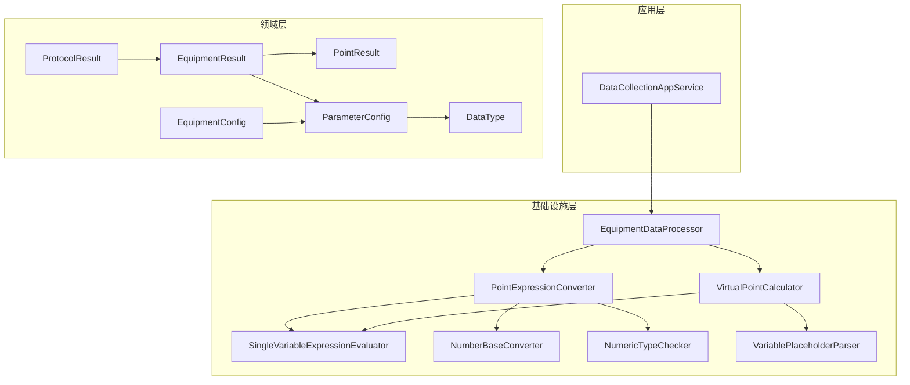
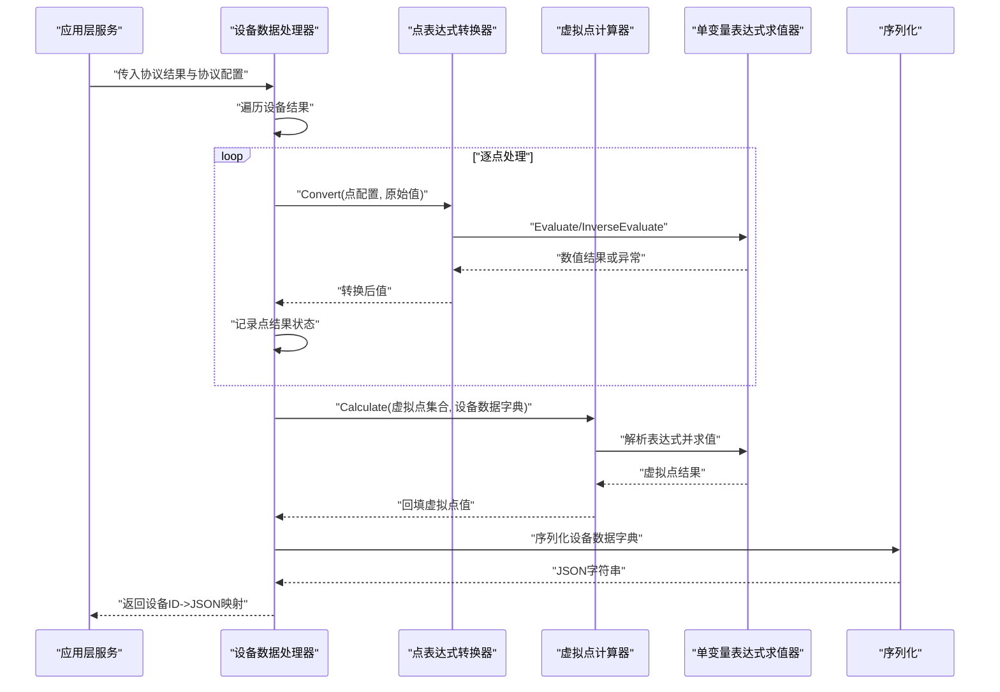
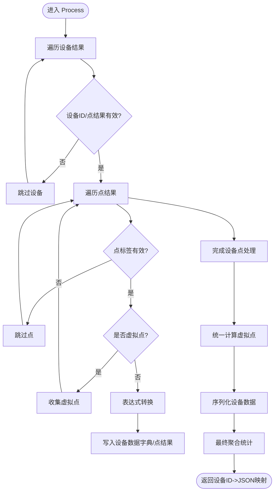
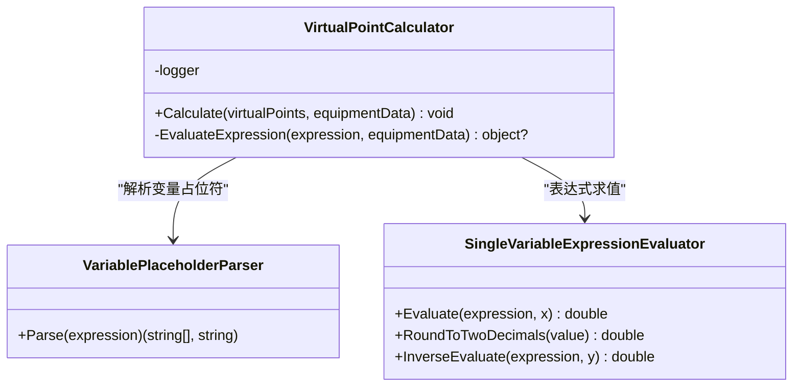
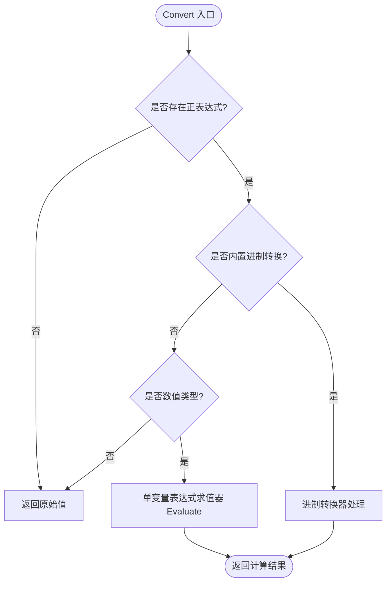
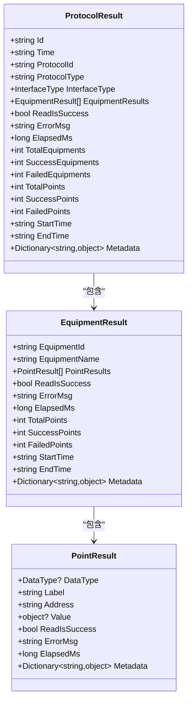
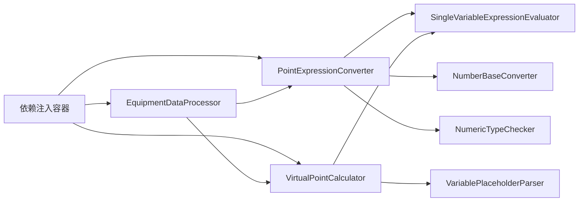

# 数据处理引擎

<cite>
**本文引用的文件**
- [EquipmentDataProcessor.cs](file://IndustrialDataSolution/IndustrialDataProcessor.Infrastructure/EquipmentCollectionDataProcessing/EquipmentDataProcessor.cs)
- [VirtualPointCalculator.cs](file://IndustrialDataSolution/IndustrialDataProcessor.Infrastructure/EquipmentCollectionDataProcessing/VirtualPointCalculator.cs)
- [PointExpressionConverter.cs](file://IndustrialDataSolution/IndustrialDataProcessor.Infrastructure/EquipmentCollectionDataProcessing/PointExpressionConverter.cs)
- [SingleVariableExpressionEvaluator.cs](file://IndustrialDataSolution/IndustrialDataProcessor.Infrastructure/EquipmentCollectionDataProcessing/SingleVariableExpressionEvaluator.cs)
- [NumberBaseConverter.cs](file://IndustrialDataSolution/IndustrialDataProcessor.Infrastructure/EquipmentCollectionDataProcessing/NumberBaseConverter.cs)
- [NumericTypeChecker.cs](file://IndustrialDataSolution/IndustrialDataProcessor.Infrastructure/EquipmentCollectionDataProcessing/NumericTypeChecker.cs)
- [VariablePlaceholderParser.cs](file://IndustrialDataSolution/IndustrialDataProcessor.Infrastructure/EquipmentCollectionDataProcessing/VariablePlaceholderParser.cs)
- [IEquipmentDataProcessor.cs](file://IndustrialDataSolution/IndustrialDataProcessor.Domain/Repositories/IEquipmentDataProcessor.cs)
- [EquipmentResult.cs](file://IndustrialDataSolution/IndustrialDataProcessor.Domain/Workstation/Results/EquipmentResult.cs)
- [PointResult.cs](file://IndustrialDataSolution/IndustrialDataProcessor.Domain/Workstation/Results/PointResult.cs)
- [ProtocolResult.cs](file://IndustrialDataSolution/IndustrialDataProcessor.Domain/Workstation/Results/ProtocolResult.cs)
- [ParameterConfig.cs](file://IndustrialDataSolution/IndustrialDataProcessor.Domain/Workstation/Configs/ParameterConfig.cs)
- [EquipmentConfig.cs](file://IndustrialDataSolution/IndustrialDataProcessor.Domain/Workstation/Configs/EquipmentConfig.cs)
- [DataType.cs](file://IndustrialDataSolution/IndustrialDataProcessor.Domain/Enums/DataType.cs)
- [DataCollectionAppService.cs](file://IndustrialDataSolution/IndustrialDataProcessor.Application/Services/DataCollectionAppService.cs)
- [EquipmentDataHostingService.cs](file://IndustrialDataSolution/IndustrialDataProcessor.Infrastructure/BackgroundServices/EquipmentDataHostingService.cs)
</cite>

## 目录
1. [简介](#简介)
2. [项目结构](#项目结构)
3. [核心组件](#核心组件)
4. [架构总览](#架构总览)
5. [详细组件分析](#详细组件分析)
6. [依赖关系分析](#依赖关系分析)
7. [性能考量](#性能考量)
8. [故障排查指南](#故障排查指南)
9. [结论](#结论)
10. [附录](#附录)

## 简介
本文件面向工业数据采集与处理场景，系统化梳理“数据处理引擎”的设计与实现，重点围绕以下关键能力展开：
- 设备数据处理器（EquipmentDataProcessor）的处理流程与聚合统计
- 虚拟点计算器（VirtualPointCalculator）的表达式求值与计算机制
- 点表达式转换器（PointExpressionConverter）的解析、转换与逆向转换
- 数据结果（EquipmentResult/ProtocolResult）的数据结构与状态管理
- 数据格式转换、数值计算与表达式求值的实现细节
- 数据验证、类型转换与精度控制策略
- 性能优化与异常处理、错误恢复机制
- 实际处理示例与调试技巧

## 项目结构
数据处理引擎位于基础设施层（Infrastructure），通过领域模型（Domain）定义的数据结构与配置，完成对采集结果的转换、计算与序列化输出。应用层（Application）的服务负责编排与调度，后台服务（BackgroundServices）负责持续运行与数据写入。

图表来源
- [EquipmentDataProcessor.cs](file://IndustrialDataSolution/IndustrialDataProcessor.Infrastructure/EquipmentCollectionDataProcessing/EquipmentDataProcessor.cs#L1-L157)
- [PointExpressionConverter.cs](file://IndustrialDataSolution/IndustrialDataProcessor.Infrastructure/EquipmentCollectionDataProcessing/PointExpressionConverter.cs#L1-L110)
- [VirtualPointCalculator.cs](file://IndustrialDataSolution/IndustrialDataProcessor.Infrastructure/EquipmentCollectionDataProcessing/VirtualPointCalculator.cs#L1-L50)
- [SingleVariableExpressionEvaluator.cs](file://IndustrialDataSolution/IndustrialDataProcessor.Infrastructure/EquipmentCollectionDataProcessing/SingleVariableExpressionEvaluator.cs#L1-L105)
- [NumberBaseConverter.cs](file://IndustrialDataSolution/IndustrialDataProcessor.Infrastructure/EquipmentCollectionDataProcessing/NumberBaseConverter.cs#L1-L50)
- [NumericTypeChecker.cs](file://IndustrialDataSolution/IndustrialDataProcessor.Infrastructure/EquipmentCollectionDataProcessing/NumericTypeChecker.cs#L1-L61)
- [VariablePlaceholderParser.cs](file://IndustrialDataSolution/IndustrialDataProcessor.Infrastructure/EquipmentCollectionDataProcessing/VariablePlaceholderParser.cs#L1-L61)
- [ProtocolResult.cs](file://IndustrialDataSolution/IndustrialDataProcessor.Domain/Workstation/Results/ProtocolResult.cs#L1-L26)
- [EquipmentResult.cs](file://IndustrialDataSolution/IndustrialDataProcessor.Domain/Workstation/Results/EquipmentResult.cs#L1-L18)
- [PointResult.cs](file://IndustrialDataSolution/IndustrialDataProcessor.Domain/Workstation/Results/PointResult.cs#L1-L15)
- [ParameterConfig.cs](file://IndustrialDataSolution/IndustrialDataProcessor.Domain/Workstation/Configs/ParameterConfig.cs#L1-L84)
- [EquipmentConfig.cs](file://IndustrialDataSolution/IndustrialDataProcessor.Domain/Workstation/Configs/EquipmentConfig.cs#L1-L34)
- [DataType.cs](file://IndustrialDataSolution/IndustrialDataProcessor.Domain/Enums/DataType.cs#L1-L69)

章节来源
- [EquipmentDataProcessor.cs](file://IndustrialDataSolution/IndustrialDataProcessor.Infrastructure/EquipmentCollectionDataProcessing/EquipmentDataProcessor.cs#L1-L157)
- [IEquipmentDataProcessor.cs](file://IndustrialDataSolution/IndustrialDataProcessor.Domain/Repositories/IEquipmentDataProcessor.cs#L1-L11)

## 核心组件
- 设备数据处理器（EquipmentDataProcessor）
  - 负责遍历协议结果中的设备集合，逐点执行表达式转换、收集虚拟点、统一序列化输出，并在全部处理完成后进行最终聚合统计。
- 虚拟点计算器（VirtualPointCalculator）
  - 基于动态表达式引擎，解析表达式中的变量占位符，从设备数据字典中读取变量值，计算并回填虚拟点结果。
- 点表达式转换器（PointExpressionConverter）
  - 支持内置进制转换（HEX2DEC/DEC2HEX）与通用单变量表达式求值；提供逆向转换能力用于写入前的物理值还原。
- 单变量表达式求值器（SingleVariableExpressionEvaluator）
  - 使用动态表达式引擎对形如“x*0.02+1”的表达式进行求值与反解，支持精度控制与异常友好提示。
- 进制转换器（NumberBaseConverter）
  - 提供十六进制与十进制之间的互转，兼容带/不带前缀的输入。
- 类型检查器（NumericTypeChecker）
  - 统一识别数值类型（含JsonElement数字、可解析字符串），保障后续计算的安全性。
- 变量占位符解析器（VariablePlaceholderParser）
  - 从表达式中抽取变量名并去除花括号占位符，提升表达式引擎的可读性与可维护性。

章节来源
- [EquipmentDataProcessor.cs](file://IndustrialDataSolution/IndustrialDataProcessor.Infrastructure/EquipmentCollectionDataProcessing/EquipmentDataProcessor.cs#L9-L48)
- [VirtualPointCalculator.cs](file://IndustrialDataSolution/IndustrialDataProcessor.Infrastructure/EquipmentCollectionDataProcessing/VirtualPointCalculator.cs#L7-L34)
- [PointExpressionConverter.cs](file://IndustrialDataSolution/IndustrialDataProcessor.Infrastructure/EquipmentCollectionDataProcessing/PointExpressionConverter.cs#L7-L35)
- [SingleVariableExpressionEvaluator.cs](file://IndustrialDataSolution/IndustrialDataProcessor.Infrastructure/EquipmentCollectionDataProcessing/SingleVariableExpressionEvaluator.cs#L10-L44)
- [NumberBaseConverter.cs](file://IndustrialDataSolution/IndustrialDataProcessor.Infrastructure/EquipmentCollectionDataProcessing/NumberBaseConverter.cs#L9-L29)
- [NumericTypeChecker.cs](file://IndustrialDataSolution/IndustrialDataProcessor.Infrastructure/EquipmentCollectionDataProcessing/NumericTypeChecker.cs#L6-L32)
- [VariablePlaceholderParser.cs](file://IndustrialDataSolution/IndustrialDataProcessor.Infrastructure/EquipmentCollectionDataProcessing/VariablePlaceholderParser.cs#L7-L59)

## 架构总览
设备数据处理器作为核心编排者，串联表达式转换与虚拟点计算两大子系统，最终产出序列化的设备数据字典与协议级统计结果。应用层与后台服务通过依赖注入获取处理器实例，形成清晰的分层与职责边界。

图表来源
- [EquipmentDataProcessor.cs](file://IndustrialDataSolution/IndustrialDataProcessor.Infrastructure/EquipmentCollectionDataProcessing/EquipmentDataProcessor.cs#L21-L48)
- [PointExpressionConverter.cs](file://IndustrialDataSolution/IndustrialDataProcessor.Infrastructure/EquipmentCollectionDataProcessing/PointExpressionConverter.cs#L16-L35)
- [VirtualPointCalculator.cs](file://IndustrialDataSolution/IndustrialDataProcessor.Infrastructure/EquipmentCollectionDataProcessing/VirtualPointCalculator.cs#L16-L34)
- [SingleVariableExpressionEvaluator.cs](file://IndustrialDataSolution/IndustrialDataProcessor.Infrastructure/EquipmentCollectionDataProcessing/SingleVariableExpressionEvaluator.cs#L16-L44)

## 详细组件分析

### 设备数据处理器（EquipmentDataProcessor）
- 主要职责
  - 遍历协议结果中的每个设备，校验设备ID与点结果有效性
  - 区分普通点与虚拟点，普通点执行表达式转换，虚拟点收集后统一计算
  - 将转换与计算后的结果序列化为JSON字符串，按设备ID归集
  - 在全部处理完成后，统计设备与点的成功/失败数量，更新协议级状态
- 关键流程
  - 设备过滤与配置匹配：依据设备ID在协议配置中查找对应设备
  - 点结果校验：空标签或空值跳过
  - 表达式转换：调用点表达式转换器，异常时标记点失败并保留错误信息
  - 虚拟点计算：统一调用虚拟点计算器，回填虚拟点值与状态
  - 最终聚合：统计设备与点的成功/失败计数，决定设备与协议整体状态
- 并发与容错
  - 使用并发字典与并发集合，保证多设备并行处理的线程安全
  - 异常捕获与降级：表达式转换与虚拟点计算异常均进行降级处理，避免中断整体流程

图表来源
- [EquipmentDataProcessor.cs](file://IndustrialDataSolution/IndustrialDataProcessor.Infrastructure/EquipmentCollectionDataProcessing/EquipmentDataProcessor.cs#L21-L48)
- [EquipmentDataProcessor.cs](file://IndustrialDataSolution/IndustrialDataProcessor.Infrastructure/EquipmentCollectionDataProcessing/EquipmentDataProcessor.cs#L50-L79)
- [EquipmentDataProcessor.cs](file://IndustrialDataSolution/IndustrialDataProcessor.Infrastructure/EquipmentCollectionDataProcessing/EquipmentDataProcessor.cs#L83-L112)
- [EquipmentDataProcessor.cs](file://IndustrialDataSolution/IndustrialDataProcessor.Infrastructure/EquipmentCollectionDataProcessing/EquipmentDataProcessor.cs#L117-L155)

章节来源
- [EquipmentDataProcessor.cs](file://IndustrialDataSolution/IndustrialDataProcessor.Infrastructure/EquipmentCollectionDataProcessing/EquipmentDataProcessor.cs#L9-L48)
- [EquipmentDataProcessor.cs](file://IndustrialDataSolution/IndustrialDataProcessor.Infrastructure/EquipmentCollectionDataProcessing/EquipmentDataProcessor.cs#L50-L155)
- [IEquipmentDataProcessor.cs](file://IndustrialDataSolution/IndustrialDataProcessor.Domain/Repositories/IEquipmentDataProcessor.cs#L7-L10)

### 虚拟点计算器（VirtualPointCalculator）
- 实现原理
  - 从参数配置中读取正表达式，解析表达式中的变量占位符，构建变量名集合
  - 使用动态表达式引擎设置变量值（缺失或空值按0处理），执行表达式求值
  - 将计算结果回填至设备数据字典，异常时记录日志并将值置空
- 应用场景
  - 设备侧派生指标计算（如温度补偿、功率换算等）
  - 多点组合生成新指标（如平均值、差值、报警逻辑等）

图表来源
- [VirtualPointCalculator.cs](file://IndustrialDataSolution/IndustrialDataProcessor.Infrastructure/EquipmentCollectionDataProcessing/VirtualPointCalculator.cs#L7-L34)
- [VariablePlaceholderParser.cs](file://IndustrialDataSolution/IndustrialDataProcessor.Infrastructure/EquipmentCollectionDataProcessing/VariablePlaceholderParser.cs#L7-L59)
- [SingleVariableExpressionEvaluator.cs](file://IndustrialDataSolution/IndustrialDataProcessor.Infrastructure/EquipmentCollectionDataProcessing/SingleVariableExpressionEvaluator.cs#L10-L44)

章节来源
- [VirtualPointCalculator.cs](file://IndustrialDataSolution/IndustrialDataProcessor.Infrastructure/EquipmentCollectionDataProcessing/VirtualPointCalculator.cs#L7-L34)
- [VariablePlaceholderParser.cs](file://IndustrialDataSolution/IndustrialDataProcessor.Infrastructure/EquipmentCollectionDataProcessing/VariablePlaceholderParser.cs#L7-L59)
- [SingleVariableExpressionEvaluator.cs](file://IndustrialDataSolution/IndustrialDataProcessor.Infrastructure/EquipmentCollectionDataProcessing/SingleVariableExpressionEvaluator.cs#L10-L44)

### 点表达式转换器（PointExpressionConverter）
- 解析机制
  - 若无正表达式，直接返回原始值
  - 内置进制转换：HEX2DEC/DEC2HEX，分别处理十六进制与十进制互转
  - 通用表达式：先判断数值类型，再委托单变量表达式求值器进行计算
- 转换逻辑
  - 数值类型识别：支持原生数值、JsonElement数字、可解析字符串
  - 表达式求值：使用动态表达式引擎，变量名为x，值为原始数值
  - 逆向转换：针对写入下发值，提供反解能力（仅限一元一次方程）
- 降级策略
  - 表达式求值异常时，返回四舍五入后的原值，确保系统可用性

图表来源
- [PointExpressionConverter.cs](file://IndustrialDataSolution/IndustrialDataProcessor.Infrastructure/EquipmentCollectionDataProcessing/PointExpressionConverter.cs#L16-L35)
- [PointExpressionConverter.cs](file://IndustrialDataSolution/IndustrialDataProcessor.Infrastructure/EquipmentCollectionDataProcessing/PointExpressionConverter.cs#L37-L57)
- [NumberBaseConverter.cs](file://IndustrialDataSolution/IndustrialDataProcessor.Infrastructure/EquipmentCollectionDataProcessing/NumberBaseConverter.cs#L9-L29)
- [NumericTypeChecker.cs](file://IndustrialDataSolution/IndustrialDataProcessor.Infrastructure/EquipmentCollectionDataProcessing/NumericTypeChecker.cs#L6-L32)
- [SingleVariableExpressionEvaluator.cs](file://IndustrialDataSolution/IndustrialDataProcessor.Infrastructure/EquipmentCollectionDataProcessing/SingleVariableExpressionEvaluator.cs#L16-L44)

章节来源
- [PointExpressionConverter.cs](file://IndustrialDataSolution/IndustrialDataProcessor.Infrastructure/EquipmentCollectionDataProcessing/PointExpressionConverter.cs#L7-L35)
- [PointExpressionConverter.cs](file://IndustrialDataSolution/IndustrialDataProcessor.Infrastructure/EquipmentCollectionDataProcessing/PointExpressionConverter.cs#L37-L82)
- [NumberBaseConverter.cs](file://IndustrialDataSolution/IndustrialDataProcessor.Infrastructure/EquipmentCollectionDataProcessing/NumberBaseConverter.cs#L9-L48)
- [NumericTypeChecker.cs](file://IndustrialDataSolution/IndustrialDataProcessor.Infrastructure/EquipmentCollectionDataProcessing/NumericTypeChecker.cs#L6-L32)
- [SingleVariableExpressionEvaluator.cs](file://IndustrialDataSolution/IndustrialDataProcessor.Infrastructure/EquipmentCollectionDataProcessing/SingleVariableExpressionEvaluator.cs#L16-L44)

### 数据结果（EquipmentResult/ProtocolResult）
- EquipmentResult
  - 字段：设备ID、名称、点结果列表、读取状态、错误信息、耗时、点统计、时间窗口、元数据
  - 作用：承载单台设备的采集结果与状态，供上层统计与持久化
- ProtocolResult
  - 字段：协议唯一标识、时间戳、协议类型与接口类型、设备结果列表、协议级状态与统计、时间窗口、元数据
  - 作用：承载整批采集任务的汇总结果，用于对外展示与后续处理

图表来源
- [ProtocolResult.cs](file://IndustrialDataSolution/IndustrialDataProcessor.Domain/Workstation/Results/ProtocolResult.cs#L5-L25)
- [EquipmentResult.cs](file://IndustrialDataSolution/IndustrialDataProcessor.Domain/Workstation/Results/EquipmentResult.cs#L3-L17)
- [PointResult.cs](file://IndustrialDataSolution/IndustrialDataProcessor.Domain/Workstation/Results/PointResult.cs#L5-L14)

章节来源
- [EquipmentResult.cs](file://IndustrialDataSolution/IndustrialDataProcessor.Domain/Workstation/Results/EquipmentResult.cs#L3-L17)
- [ProtocolResult.cs](file://IndustrialDataSolution/IndustrialDataProcessor.Domain/Workstation/Results/ProtocolResult.cs#L5-L25)

### 数据结构与配置（ParameterConfig/EquipmentConfig/DataType）
- ParameterConfig
  - 字段：标签、地址、是否监控、站号、数据格式、偏移、仪表类型、数据类型、长度、默认值、采集周期、正表达式、上下限、写入值
  - 作用：定义点位的采集与转换规则，包括虚拟点标识与表达式
- EquipmentConfig
  - 字段：设备ID、是否采集、名称、设备类型、参数列表
  - 作用：组织设备与其点位配置
- DataType
  - 枚举：Bool、UShort、Short、UInt、Int、ULong、Long、Float、Double、String
  - 作用：统一数据类型定义，便于序列化与显示

章节来源
- [ParameterConfig.cs](file://IndustrialDataSolution/IndustrialDataProcessor.Domain/Workstation/Configs/ParameterConfig.cs#L7-L83)
- [EquipmentConfig.cs](file://IndustrialDataSolution/IndustrialDataProcessor.Domain/Workstation/Configs/EquipmentConfig.cs#L7-L33)
- [DataType.cs](file://IndustrialDataSolution/IndustrialDataProcessor.Domain/Enums/DataType.cs#L8-L68)

## 依赖关系分析
- 依赖注入
  - 设备数据处理器注册为单例，依赖点表达式转换器与虚拟点计算器
  - 应用层服务通过接口注入处理器，实现松耦合
- 组件耦合
  - 设备数据处理器与两个子系统强关联，但通过接口隔离，便于替换与扩展
  - 表达式求值器与进制转换器为纯函数式工具，低耦合高内聚

图表来源
- [EquipmentDataProcessor.cs](file://IndustrialDataSolution/IndustrialDataProcessor.Infrastructure/EquipmentCollectionDataProcessing/EquipmentDataProcessor.cs#L15-L19)
- [PointExpressionConverter.cs](file://IndustrialDataSolution/IndustrialDataProcessor.Infrastructure/EquipmentCollectionDataProcessing/PointExpressionConverter.cs#L11-L14)
- [VirtualPointCalculator.cs](file://IndustrialDataSolution/IndustrialDataProcessor.Infrastructure/EquipmentCollectionDataProcessing/VirtualPointCalculator.cs#L11-L14)
- [DataCollectionAppService.cs](file://IndustrialDataSolution/IndustrialDataProcessor.Application/Services/DataCollectionAppService.cs#L9-L16)
- [EquipmentDataHostingService.cs](file://IndustrialDataSolution/IndustrialDataProcessor.Infrastructure/BackgroundServices/EquipmentDataHostingService.cs#L8-L11)

章节来源
- [EquipmentDataProcessor.cs](file://IndustrialDataSolution/IndustrialDataProcessor.Infrastructure/EquipmentCollectionDataProcessing/EquipmentDataProcessor.cs#L15-L19)
- [DataCollectionAppService.cs](file://IndustrialDataSolution/IndustrialDataProcessor.Application/Services/DataCollectionAppService.cs#L9-L16)
- [EquipmentDataHostingService.cs](file://IndustrialDataSolution/IndustrialDataProcessor.Infrastructure/BackgroundServices/EquipmentDataHostingService.cs#L8-L11)

## 性能考量
- 并发处理
  - 使用并发字典与并发集合，支持多设备并行处理，减少串行瓶颈
- 表达式求值
  - 动态表达式引擎每次新建实例，确保线程安全；建议在高频路径中复用已解析的表达式树（需评估复杂度与内存占用）
- 类型检查与转换
  - 数值类型检查与转换尽量前置，避免重复解析；对JsonElement优先使用GetDouble
- 精度控制
  - 统一采用“四舍五入到两位小数”的策略，兼顾精度与稳定性
- I/O与序列化
  - 序列化选项启用非严格转义，降低编码开销；建议在批量写入时合并批次

[本节为通用性能建议，无需特定文件引用]

## 故障排查指南
- 表达式转换异常
  - 现象：点结果标记失败，错误信息包含公式转换异常
  - 排查：确认表达式语法、变量名与设备数据字典中的键一致；检查数值类型是否可转换
- 虚拟点计算失败
  - 现象：虚拟点值为空，点结果标记失败
  - 排查：检查表达式是否合法、变量是否存在且可解析；查看日志中的错误详情
- 进制转换异常
  - 现象：HEX2DEC/DEC2HEX转换抛出格式异常
  - 排查：确认输入格式（带/不带0x前缀）、字符合法性与数值范围
- 协议级状态异常
  - 现象：协议整体成功但部分设备失败
  - 排查：检查设备点统计与错误信息，定位具体失败点位

章节来源
- [EquipmentDataProcessor.cs](file://IndustrialDataSolution/IndustrialDataProcessor.Infrastructure/EquipmentCollectionDataProcessing/EquipmentDataProcessor.cs#L64-L77)
- [EquipmentDataProcessor.cs](file://IndustrialDataSolution/IndustrialDataProcessor.Infrastructure/EquipmentCollectionDataProcessing/EquipmentDataProcessor.cs#L99-L104)
- [VirtualPointCalculator.cs](file://IndustrialDataSolution/IndustrialDataProcessor.Infrastructure/EquipmentCollectionDataProcessing/VirtualPointCalculator.cs#L23-L32)
- [PointExpressionConverter.cs](file://IndustrialDataSolution/IndustrialDataProcessor.Infrastructure/EquipmentCollectionDataProcessing/PointExpressionConverter.cs#L18-L34)

## 结论
数据处理引擎通过“表达式转换 + 虚拟点计算 + 统一序列化 + 最终聚合统计”的流水线，实现了对工业采集数据的高效处理与可靠输出。其模块化设计与严格的异常降级策略，既保证了系统的鲁棒性，也为后续扩展（如更多内置表达式、更复杂的虚拟点逻辑）提供了清晰的演进路径。

[本节为总结性内容，无需特定文件引用]

## 附录

### 处理示例与调试技巧
- 示例场景
  - 普通点：原始值为数值，配置正表达式为“x*0.02+1”，转换后得到计算值
  - 虚拟点：表达式为“{温度} + {湿度}”，变量来自设备数据字典，计算后回填
  - 进制转换：原始值为十六进制字符串，配置正表达式为“HEX2DEC”
- 调试技巧
  - 开启日志：关注表达式解析与求值过程中的异常信息
  - 分步验证：先验证数值类型检查与进制转换，再验证通用表达式
  - 单点测试：针对失败点位单独构造测试用例，缩小问题范围
  - 状态核对：对比点级ReadIsSuccess与设备/协议级统计，确保一致性

[本节为实践建议，无需特定文件引用]