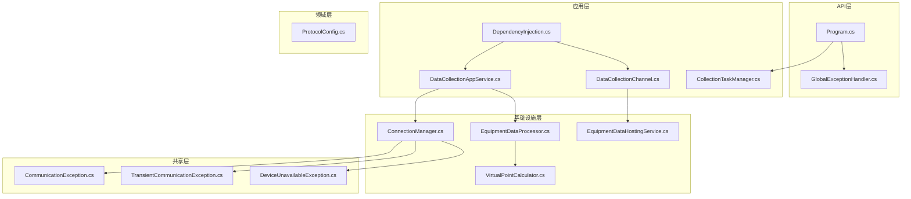
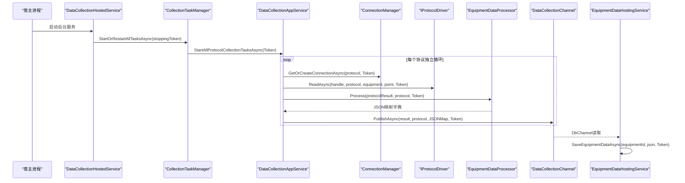
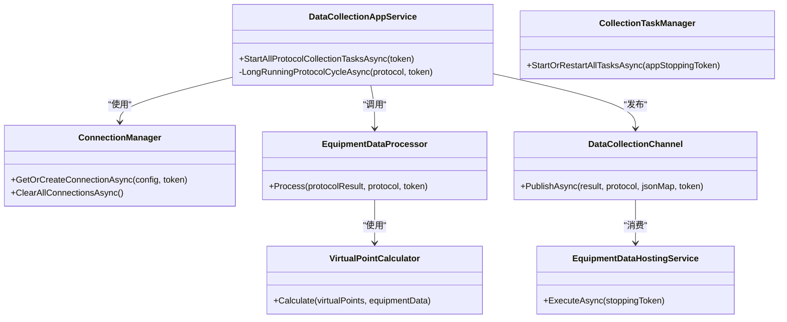

# 数据采集系统

<cite>
**本文引用的文件**
- [IndustrialDataProcessor.Api/Program.cs](file://IndustrialDataProcessor.Api/Program.cs)
- [IndustrialDataProcessor.Api/appsettings.json](file://IndustrialDataProcessor.Api/appsettings.json)
- [IndustrialDataProcessor.Api/BackgroundServices/DataCollectionHostedService.cs](file://IndustrialDataProcessor.Api/BackgroundServices/DataCollectionHostedService.cs)
- [IndustrialDataProcessor.Api/Middleware/GlobalExceptionHandler.cs](file://IndustrialDataProcessor.Api/Middleware/GlobalExceptionHandler.cs)
- [IndustrialDataProcessor.Application/Services/CollectionTaskManager.cs](file://IndustrialDataProcessor.Application/Services/CollectionTaskManager.cs)
- [IndustrialDataProcessor.Application/Services/DataCollectionAppService.cs](file://IndustrialDataProcessor.Application/Services/DataCollectionAppService.cs)
- [IndustrialDataProcessor.Application/DependencyInjection.cs](file://IndustrialDataProcessor.Application/DependencyInjection.cs)
- [IndustrialDataProcessor.Domain/Workstation/Configs/ProtocolConfig.cs](file://IndustrialDataProcessor.Domain/Workstation/Configs/ProtocolConfig.cs)
- [IndustrialDataProcessor.Domain/Workstation/Results/DataCollectionChannel.cs](file://IndustrialDataProcessor.Domain/Workstation/Results/DataCollectionChannel.cs)
- [IndustrialDataProcessor.Infrastructure/BackgroundServices/EquipmentDataHostingService.cs](file://IndustrialDataProcessor.Infrastructure/BackgroundServices/EquipmentDataHostingService.cs)
- [IndustrialDataProcessor.Infrastructure/Communication/Connection/ConnectionManager.cs](file://IndustrialDataProcessor.Infrastructure/Communication/Connection/ConnectionManager.cs)
- [IndustrialDataProcessor.Infrastructure/EquipmentCollectionDataProcessing/EquipmentDataProcessor.cs](file://IndustrialDataProcessor.Infrastructure/EquipmentCollectionDataProcessing/EquipmentDataProcessor.cs)
- [IndustrialDataProcessor.Infrastructure/EquipmentCollectionDataProcessing/VirtualPointCalculator.cs](file://IndustrialDataProcessor.Infrastructure/EquipmentCollectionDataProcessing/VirtualPointCalculator.cs)
- [IndustrialDataProcessor.Share/Exceptions/Communication/CommunicationException.cs](file://IndustrialDataProcessor.Share/Exceptions/Communication/CommunicationException.cs)
- [IndustrialDataProcessor.Share/Exceptions/Communication/DeviceUnavailableException.cs](file://IndustrialDataProcessor.Share/Exceptions/Communication/DeviceUnavailableException.cs)
- [IndustrialDataProcessor.Share/Exceptions/Communication/TransientCommunicationException.cs](file://IndustrialDataProcessor.Share/Exceptions/Communication/TransientCommunicationException.cs)
</cite>

## 目录
1. [简介](#简介)
2. [项目结构](#项目结构)
3. [核心组件](#核心组件)
4. [架构总览](#架构总览)
5. [详细组件分析](#详细组件分析)
6. [依赖关系分析](#依赖关系分析)
7. [性能考虑](#性能考虑)
8. [故障排除指南](#故障排除指南)
9. [结论](#结论)
10. [附录](#附录)

## 简介
本文件面向DDD工业数据处理解决方案中的“数据采集系统”，系统性阐述从配置加载、协议驱动、设备连接管理、数据转换处理、到数据存储与监控的完整流程。重点包括：
- 后台托管服务设计与调度机制：EquipmentDataHostingService与DataCollectionHostedService
- 设备连接管理：连接池复用、心跳与故障恢复策略
- 数据转换处理引擎：格式转换、表达式计算、数据验证与聚合
- 异常处理机制：通信异常、协议异常、系统异常的分级处置
- 性能优化：并发控制、资源管理、内存优化
- 监控与告警：健康检查、日志与异常上报
- 配置示例与故障排除

## 项目结构
系统采用多层架构，分为API层、应用层、领域层、基础设施层与共享层。数据采集相关的关键模块分布如下：
- API层：注册后台服务、中间件与健康检查
- 应用层：采集任务管理、采集应用服务、数据通道
- 领域层：协议配置、采集结果模型
- 基础设施层：连接管理、协议驱动、数据处理引擎、后台存储服务
- 共享层：通信异常类型

图表来源
- [IndustrialDataProcessor.Api/Program.cs](file://IndustrialDataProcessor.Api/Program.cs#L1-L54)
- [IndustrialDataProcessor.Application/DependencyInjection.cs](file://IndustrialDataProcessor.Application/DependencyInjection.cs#L1-L40)
- [IndustrialDataProcessor.Application/Services/DataCollectionAppService.cs](file://IndustrialDataProcessor.Application/Services/DataCollectionAppService.cs#L1-L216)
- [IndustrialDataProcessor.Domain/Workstation/Configs/ProtocolConfig.cs](file://IndustrialDataProcessor.Domain/Workstation/Configs/ProtocolConfig.cs#L1-L64)
- [IndustrialDataProcessor.Domain/Workstation/Results/DataCollectionChannel.cs](file://IndustrialDataProcessor.Domain/Workstation/Results/DataCollectionChannel.cs#L1-L37)
- [IndustrialDataProcessor.Infrastructure/Communication/Connection/ConnectionManager.cs](file://IndustrialDataProcessor.Infrastructure/Communication/Connection/ConnectionManager.cs#L1-L396)
- [IndustrialDataProcessor.Infrastructure/EquipmentCollectionDataProcessing/EquipmentDataProcessor.cs](file://IndustrialDataProcessor.Infrastructure/EquipmentCollectionDataProcessing/EquipmentDataProcessor.cs#L1-L157)
- [IndustrialDataProcessor.Infrastructure/EquipmentCollectionDataProcessing/VirtualPointCalculator.cs](file://IndustrialDataProcessor.Infrastructure/EquipmentCollectionDataProcessing/VirtualPointCalculator.cs#L1-L50)
- [IndustrialDataProcessor.Infrastructure/BackgroundServices/EquipmentDataHostingService.cs](file://IndustrialDataProcessor.Infrastructure/BackgroundServices/EquipmentDataHostingService.cs#L1-L43)
- [IndustrialDataProcessor.Share/Exceptions/Communication/CommunicationException.cs](file://IndustrialDataProcessor.Share/Exceptions/Communication/CommunicationException.cs)
- [IndustrialDataProcessor.Share/Exceptions/Communication/TransientCommunicationException.cs](file://IndustrialDataProcessor.Share/Exceptions/Communication/TransientCommunicationException.cs)
- [IndustrialDataProcessor.Share/Exceptions/Communication/DeviceUnavailableException.cs](file://IndustrialDataProcessor.Share/Exceptions/Communication/DeviceUnavailableException.cs)

章节来源
- [IndustrialDataProcessor.Api/Program.cs](file://IndustrialDataProcessor.Api/Program.cs#L1-L54)
- [IndustrialDataProcessor.Application/DependencyInjection.cs](file://IndustrialDataProcessor.Application/DependencyInjection.cs#L1-L40)

## 核心组件
- 后台托管服务
  - DataCollectionHostedService：启动采集任务管理器，常驻等待宿主停止信号
  - EquipmentDataHostingService：消费数据通道，异步持久化设备数据
- 采集任务管理
  - CollectionTaskManager：统一启动/重启所有协议采集任务，支持取消与资源回收
- 采集应用服务
  - DataCollectionAppService：按协议独立循环采集，连接复用、异常隔离、结果聚合与通道发布
- 通道与存储
  - DataCollectionChannel：无界通道，扇出至OPC UA与数据库消费者
  - EquipmentDataHostingService：数据库消费者，逐条保存设备JSON映射
- 连接管理
  - ConnectionManager：按接口类型与协议类型创建/复用连接，支持LAN与COM协议族
- 数据处理引擎
  - EquipmentDataProcessor：点位转换、虚拟点计算、最终聚合状态计算
  - VirtualPointCalculator：基于DynamicExpresso的表达式求值

章节来源
- [IndustrialDataProcessor.Api/BackgroundServices/DataCollectionHostedService.cs](file://IndustrialDataProcessor.Api/BackgroundServices/DataCollectionHostedService.cs#L1-L28)
- [IndustrialDataProcessor.Infrastructure/BackgroundServices/EquipmentDataHostingService.cs](file://IndustrialDataProcessor.Infrastructure/BackgroundServices/EquipmentDataHostingService.cs#L1-L43)
- [IndustrialDataProcessor.Application/Services/CollectionTaskManager.cs](file://IndustrialDataProcessor.Application/Services/CollectionTaskManager.cs#L1-L61)
- [IndustrialDataProcessor.Application/Services/DataCollectionAppService.cs](file://IndustrialDataProcessor.Application/Services/DataCollectionAppService.cs#L1-L216)
- [IndustrialDataProcessor.Domain/Workstation/Results/DataCollectionChannel.cs](file://IndustrialDataProcessor.Domain/Workstation/Results/DataCollectionChannel.cs#L1-L37)
- [IndustrialDataProcessor.Infrastructure/Communication/Connection/ConnectionManager.cs](file://IndustrialDataProcessor.Infrastructure/Communication/Connection/ConnectionManager.cs#L1-L396)
- [IndustrialDataProcessor.Infrastructure/EquipmentCollectionDataProcessing/EquipmentDataProcessor.cs](file://IndustrialDataProcessor.Infrastructure/EquipmentCollectionDataProcessing/EquipmentDataProcessor.cs#L1-L157)
- [IndustrialDataProcessor.Infrastructure/EquipmentCollectionDataProcessing/VirtualPointCalculator.cs](file://IndustrialDataProcessor.Infrastructure/EquipmentCollectionDataProcessing/VirtualPointCalculator.cs#L1-L50)

## 架构总览
系统以“配置驱动 + 通道扇出”的方式组织数据采集链路：
- 配置加载：应用层从仓储获取工作站配置，包含多个协议与设备
- 协议循环：每个协议独立后台线程，按配置周期采集
- 连接复用：连接管理器按协议类型创建/复用底层连接
- 数据转换：采集结果经处理器进行格式转换与虚拟点计算，产出JSON映射
- 通道发布：结果与JSON映射同时扇出至OPC UA与数据库通道
- 存储消费：数据库消费者异步持久化每条设备JSON

图表来源
- [IndustrialDataProcessor.Api/BackgroundServices/DataCollectionHostedService.cs](file://IndustrialDataProcessor.Api/BackgroundServices/DataCollectionHostedService.cs#L1-L28)
- [IndustrialDataProcessor.Application/Services/CollectionTaskManager.cs](file://IndustrialDataProcessor.Application/Services/CollectionTaskManager.cs#L1-L61)
- [IndustrialDataProcessor.Application/Services/DataCollectionAppService.cs](file://IndustrialDataProcessor.Application/Services/DataCollectionAppService.cs#L1-L216)
- [IndustrialDataProcessor.Infrastructure/Communication/Connection/ConnectionManager.cs](file://IndustrialDataProcessor.Infrastructure/Communication/Connection/ConnectionManager.cs#L1-L396)
- [IndustrialDataProcessor.Infrastructure/EquipmentCollectionDataProcessing/EquipmentDataProcessor.cs](file://IndustrialDataProcessor.Infrastructure/EquipmentCollectionDataProcessing/EquipmentDataProcessor.cs#L1-L157)
- [IndustrialDataProcessor.Domain/Workstation/Results/DataCollectionChannel.cs](file://IndustrialDataProcessor.Domain/Workstation/Results/DataCollectionChannel.cs#L1-L37)
- [IndustrialDataProcessor.Infrastructure/BackgroundServices/EquipmentDataHostingService.cs](file://IndustrialDataProcessor.Infrastructure/BackgroundServices/EquipmentDataHostingService.cs#L1-L43)

## 详细组件分析

### 后台托管服务：DataCollectionHostedService
- 职责：启动采集任务管理器，常驻等待宿主停止；将stoppingToken传递给任务管理器，确保优雅退出
- 关键点：日志记录、无限等待、异常捕获（取消）

章节来源
- [IndustrialDataProcessor.Api/BackgroundServices/DataCollectionHostedService.cs](file://IndustrialDataProcessor.Api/BackgroundServices/DataCollectionHostedService.cs#L1-L28)

### 后台托管服务：EquipmentDataHostingService
- 职责：从DbChannel读取采集结果与JSON映射，逐条持久化到存储库
- 关键点：foreach遍历、异常日志记录、取消令牌传播、正常退出捕获

章节来源
- [IndustrialDataProcessor.Infrastructure/BackgroundServices/EquipmentDataHostingService.cs](file://IndustrialDataProcessor.Infrastructure/BackgroundServices/EquipmentDataHostingService.cs#L1-L43)

### 采集任务管理：CollectionTaskManager
- 职责：统一启动/重启所有协议采集任务；支持并发重启互斥；创建链接取消令牌；在作用域内解析应用服务
- 关键点：CancellationTokenSource管理、旧任务安全取消与资源释放、日志记录

章节来源
- [IndustrialDataProcessor.Application/Services/CollectionTaskManager.cs](file://IndustrialDataProcessor.Application/Services/CollectionTaskManager.cs#L1-L61)

### 采集应用服务：DataCollectionAppService
- 职责：加载配置、为每个协议创建独立后台循环；按协议周期采集；连接复用；异常隔离；结果聚合与通道发布
- 关键点：协议独立循环、取消令牌、虚拟点占位、异常捕获与协议级失败标记、耗时统计、通道发布

章节来源
- [IndustrialDataProcessor.Application/Services/DataCollectionAppService.cs](file://IndustrialDataProcessor.Application/Services/DataCollectionAppService.cs#L1-L216)

### 协议配置：ProtocolConfig
- 职责：描述协议的通用属性（接口类型、协议类型、延时、超时、账号密码、备注、附加选项、设备列表）
- 关键点：通信延时、接收/连接超时、设备集合

章节来源
- [IndustrialDataProcessor.Domain/Workstation/Configs/ProtocolConfig.cs](file://IndustrialDataProcessor.Domain/Workstation/Configs/ProtocolConfig.cs#L1-L64)

### 数据通道：DataCollectionChannel
- 职责：进程内无界通道，分别暴露OPC UA与数据库通道Reader；发布时并行写入两个通道
- 关键点：扇出、异步写入、取消令牌

章节来源
- [IndustrialDataProcessor.Domain/Workstation/Results/DataCollectionChannel.cs](file://IndustrialDataProcessor.Domain/Workstation/Results/DataCollectionChannel.cs#L1-L37)

### 连接管理：ConnectionManager
- 职责：按接口类型（LAN/COM）与协议类型创建/复用连接；支持多种协议（Modbus、西门子S7、欧姆龙、IEC 60870-5-104、OPC UA、DLT/CJT等）
- 关键点：接口类型分发、协议类型分支、连接超时/接收超时设置、OPC UA证书与用户身份配置、清理与释放

章节来源
- [IndustrialDataProcessor.Infrastructure/Communication/Connection/ConnectionManager.cs](file://IndustrialDataProcessor.Infrastructure/Communication/Connection/ConnectionManager.cs#L1-L396)

### 数据处理引擎：EquipmentDataProcessor
- 职责：对设备点位进行格式转换、收集虚拟点、序列化为JSON映射；完成后计算协议/设备/点位聚合状态
- 关键点：并发字典与集合、表达式转换异常处理、虚拟点计算回写、最终聚合状态落锤

章节来源
- [IndustrialDataProcessor.Infrastructure/EquipmentCollectionDataProcessing/EquipmentDataProcessor.cs](file://IndustrialDataProcessor.Infrastructure/EquipmentCollectionDataProcessing/EquipmentDataProcessor.cs#L1-L157)

### 虚拟点计算器：VirtualPointCalculator
- 职责：基于表达式解析器对虚拟点进行求值，将结果写回设备数据字典
- 关键点：变量占位解析、动态求值、异常日志

章节来源
- [IndustrialDataProcessor.Infrastructure/EquipmentCollectionDataProcessing/VirtualPointCalculator.cs](file://IndustrialDataProcessor.Infrastructure/EquipmentCollectionDataProcessing/VirtualPointCalculator.cs#L1-L50)

### 异常处理：全局异常中间件
- 职责：统一捕获未处理异常，按类型映射HTTP状态码与问题详情，支持FluentValidation错误格式化
- 关键点：日志记录、ProblemDetails响应、验证错误字典

章节来源
- [IndustrialDataProcessor.Api/Middleware/GlobalExceptionHandler.cs](file://IndustrialDataProcessor.Api/Middleware/GlobalExceptionHandler.cs#L1-L94)

### 配置示例：appsettings.json
- 职责：日志级别、连接字符串（PostgreSQL）、第三方授权码
- 关键点：连接池参数、命令超时、HslCommunication授权码

章节来源
- [IndustrialDataProcessor.Api/appsettings.json](file://IndustrialDataProcessor.Api/appsettings.json#L1-L17)

## 依赖关系分析
- 组件耦合
  - DataCollectionAppService依赖IConnectionManager、IEnumerable<IProtocolDriver>、IEquipmentDataProcessor、DataCollectionChannel
  - EquipmentDataProcessor依赖PointExpressionConverter与VirtualPointCalculator
  - EquipmentDataHostingService依赖IEquipmentDataStorageRepository与DataCollectionChannel
- 外部依赖
  - HslCommunication、lib60870、OPC UA客户端库、DynamicExpresso
- 接口契约
  - IConnectionManager、IConnectionHandle、IProtocolDriver、IEquipmentDataProcessor、IEquipmentDataStorageRepository

图表来源
- [IndustrialDataProcessor.Application/Services/DataCollectionAppService.cs](file://IndustrialDataProcessor.Application/Services/DataCollectionAppService.cs#L1-L216)
- [IndustrialDataProcessor.Application/Services/CollectionTaskManager.cs](file://IndustrialDataProcessor.Application/Services/CollectionTaskManager.cs#L1-L61)
- [IndustrialDataProcessor.Infrastructure/Communication/Connection/ConnectionManager.cs](file://IndustrialDataProcessor.Infrastructure/Communication/Connection/ConnectionManager.cs#L1-L396)
- [IndustrialDataProcessor.Infrastructure/EquipmentCollectionDataProcessing/EquipmentDataProcessor.cs](file://IndustrialDataProcessor.Infrastructure/EquipmentCollectionDataProcessing/EquipmentDataProcessor.cs#L1-L157)
- [IndustrialDataProcessor.Infrastructure/EquipmentCollectionDataProcessing/VirtualPointCalculator.cs](file://IndustrialDataProcessor.Infrastructure/EquipmentCollectionDataProcessing/VirtualPointCalculator.cs#L1-L50)
- [IndustrialDataProcessor.Domain/Workstation/Results/DataCollectionChannel.cs](file://IndustrialDataProcessor.Domain/Workstation/Results/DataCollectionChannel.cs#L1-L37)
- [IndustrialDataProcessor.Infrastructure/BackgroundServices/EquipmentDataHostingService.cs](file://IndustrialDataProcessor.Infrastructure/BackgroundServices/EquipmentDataHostingService.cs#L1-L43)

## 性能考虑
- 并发控制
  - 协议级独立线程循环，互不影响；通过CommunicationDelay控制周期，避免CPU空转
  - 使用ConcurrentDictionary/ConcurrentBag提升并发写入性能
- 资源管理
  - 连接复用：按协议Id创建/复用连接，减少握手开销
  - 作用域管理：CollectionTaskManager在新任务启动前释放旧任务并等待资源回收
  - 通道无界：注意背压与内存占用，建议在生产环境引入背压策略或限流
- 内存优化
  - JSON序列化使用UnsafeRelaxedJsonEscaping，减少转义开销
  - 虚拟点表达式求值仅在必要时进行，避免重复计算
- I/O与网络
  - 连接/接收超时参数可调，平衡稳定性与延迟
  - OPC UA会话与证书配置可优化握手与认证成本

[本节为通用性能指导，无需特定文件引用]

## 故障排除指南
- 通信异常
  - 症状：连接失败、读取超时、设备不可达
  - 排查：检查IP/端口、账号密码、协议类型匹配；查看ConnectionManager日志；确认HslCommunication授权码
  - 参考异常类型：CommunicationException、TransientCommunicationException、DeviceUnavailableException
- 协议异常
  - 症状：协议不支持、驱动缺失、参数非法
  - 排查：确认ProtocolConfig与IProtocolDriver匹配；检查设备地址与数据类型；查看DataCollectionAppService日志
- 系统异常
  - 症状：应用服务执行失败、基础设施不可用
  - 排查：查看GlobalExceptionHandler输出的ProblemDetails；检查数据库连接与健康检查
- 存储异常
  - 症状：持久化失败
  - 排查：查看EquipmentDataHostingService日志；确认存储库实现与连接字符串

章节来源
- [IndustrialDataProcessor.Share/Exceptions/Communication/CommunicationException.cs](file://IndustrialDataProcessor.Share/Exceptions/Communication/CommunicationException.cs)
- [IndustrialDataProcessor.Share/Exceptions/Communication/TransientCommunicationException.cs](file://IndustrialDataProcessor.Share/Exceptions/Communication/TransientCommunicationException.cs)
- [IndustrialDataProcessor.Share/Exceptions/Communication/DeviceUnavailableException.cs](file://IndustrialDataProcessor.Share/Exceptions/Communication/DeviceUnavailableException.cs)
- [IndustrialDataProcessor.Api/Middleware/GlobalExceptionHandler.cs](file://IndustrialDataProcessor.Api/Middleware/GlobalExceptionHandler.cs#L1-L94)
- [IndustrialDataProcessor.Infrastructure/BackgroundServices/EquipmentDataHostingService.cs](file://IndustrialDataProcessor.Infrastructure/BackgroundServices/EquipmentDataHostingService.cs#L1-L43)

## 结论
本数据采集系统通过“配置驱动 + 通道扇出 + 协议独立循环 + 连接复用 + 异常隔离”的设计，实现了高可用、可扩展、可观测的工业数据采集能力。结合连接管理、数据处理引擎与后台托管服务，系统在稳定性与性能之间取得良好平衡。建议在生产环境中进一步完善通道背压、指标监控与告警策略。

[本节为总结性内容，无需特定文件引用]

## 附录

### 配置示例
- 应用配置（appsettings.json）
  - 日志级别、连接字符串（PostgreSQL）、第三方授权码
  - 参考路径：IndustrialDataProcessor.Api/appsettings.json
- 采集配置（ProtocolConfig）
  - 协议Id、接口类型、协议类型、通信延时、接收/连接超时、账号密码、设备列表
  - 参考路径：IndustrialDataProcessor.Domain/Workstation/Configs/ProtocolConfig.cs

章节来源
- [IndustrialDataProcessor.Api/appsettings.json](file://IndustrialDataProcessor.Api/appsettings.json#L1-L17)
- [IndustrialDataProcessor.Domain/Workstation/Configs/ProtocolConfig.cs](file://IndustrialDataProcessor.Domain/Workstation/Configs/ProtocolConfig.cs#L1-L64)

### 监控与健康检查
- 健康检查端点：/health
- 请求日志中间件：优先于异常处理中间件注册
- 全局异常处理：标准化ProblemDetails响应

章节来源
- [IndustrialDataProcessor.Api/Program.cs](file://IndustrialDataProcessor.Api/Program.cs#L1-L54)
- [IndustrialDataProcessor.Api/Middleware/GlobalExceptionHandler.cs](file://IndustrialDataProcessor.Api/Middleware/GlobalExceptionHandler.cs#L1-L94)