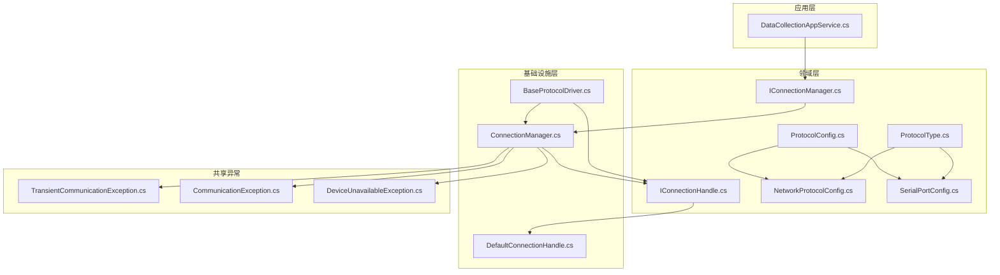
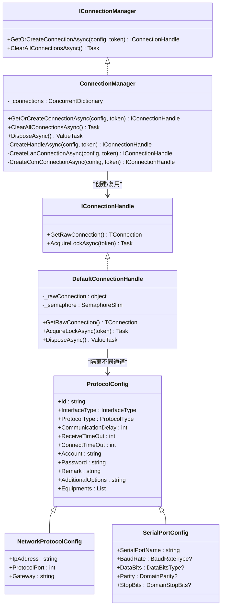
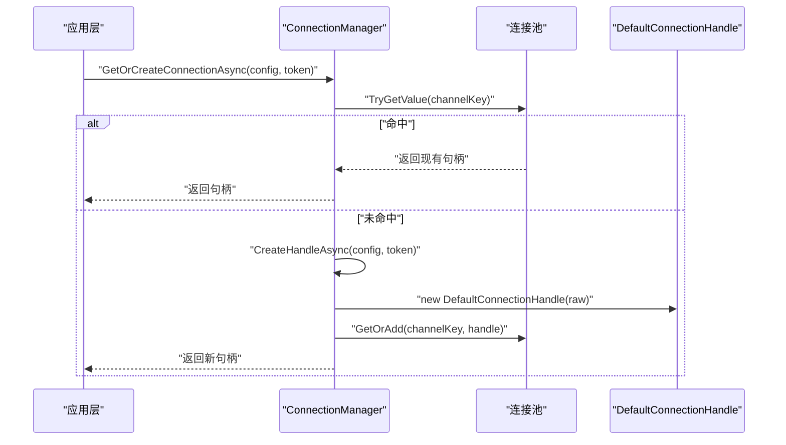
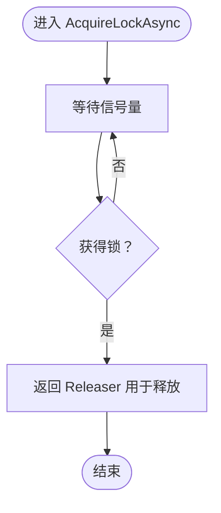
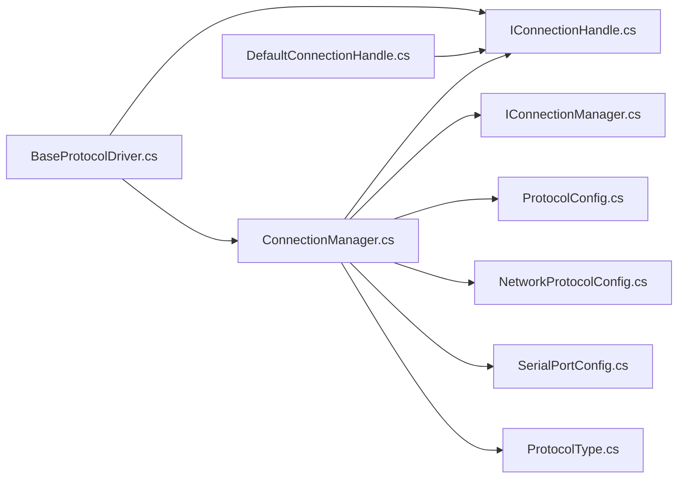

# 设备连接管理

<cite>
**本文引用的文件**
- [IConnectionManager.cs](file://IndustrialDataSolution/IndustrialDataProcessor.Domain/Communication/IConnection/IConnectionManager.cs)
- [IConnectionHandle.cs](file://IndustrialDataProcessor.Domain/Communication/IConnection/IConnectionHandle.cs)
- [ConnectionManager.cs](file://IndustrialDataProcessor.Infrastructure/Communication/Connection/ConnectionManager.cs)
- [DefaultConnectionHandle.cs](file://IndustrialDataProcessor.Infrastructure/Communication/Connection/DefaultConnectionHandle.cs)
- [ProtocolConfig.cs](file://IndustrialDataProcessor.Domain/Workstation/Configs/ProtocolConfig.cs)
- [NetworkProtocolConfig.cs](file://IndustrialDataProcessor.Domain/Workstation/Configs/ProtocolSub/NetworkProtocolConfig.cs)
- [SerialPortConfig.cs](file://IndustrialDataProcessor.Domain/Workstation/Configs/ProtocolSub/SerialPortConfig.cs)
- [ProtocolType.cs](file://IndustrialDataProcessor.Domain/Enums/ProtocolType.cs)
- [BaseProtocolDriver.cs](file://IndustrialDataProcessor.Infrastructure/Communication/Drivers/TcpCommon/BaseProtocolDriver.cs)
- [DataCollectionAppService.cs](file://IndustrialDataProcessor.Application/Services/DataCollectionAppService.cs)
- [TransientCommunicationException.cs](file://IndustrialDataProcessor.Share/Exceptions/Communication/TransientCommunicationException.cs)
- [CommunicationException.cs](file://IndustrialDataProcessor.Share/Exceptions/Communication/CommunicationException.cs)
- [DeviceUnavailableException.cs](file://IndustrialDataProcessor.Share/Exceptions/Communication/DeviceUnavailableException.cs)
</cite>

## 目录
1. [引言](#引言)
2. [项目结构](#项目结构)
3. [核心组件](#核心组件)
4. [架构总览](#架构总览)
5. [详细组件分析](#详细组件分析)
6. [依赖关系分析](#依赖关系分析)
7. [性能考虑](#性能考虑)
8. [故障排查指南](#故障排查指南)
9. [结论](#结论)
10. [附录](#附录)

## 引言
本文件面向设备连接管理系统，围绕连接管理器与连接句柄两大核心模块进行系统化说明。重点包括：
- 连接管理器(ConnectionManager)的设计与实现
- IConnectionManager 接口的职责与扩展策略
- 连接句柄 IConnectionHandle 的作用与 DefaultConnectionHandle 的通用处理
- 连接池管理、连接状态监控与连接复用机制
- 心跳检测、超时处理与故障恢复策略
- 连接配置最佳实践与性能优化建议
- 异常处理与重连机制的实现细节
- 配置示例与调试指南

## 项目结构
本系统采用分层与领域驱动设计，连接管理位于基础设施层，面向应用层提供稳定可靠的连接能力；领域层定义协议配置与接口契约；应用层通过连接句柄完成对底层通信库的统一访问。

图表来源
- [ConnectionManager.cs](file://IndustrialDataProcessor.Infrastructure/Communication/Connection/ConnectionManager.cs#L21-L396)
- [IConnectionManager.cs](file://IndustrialDataProcessor.Domain/Communication/IConnection/IConnectionManager.cs#L5-L18)
- [IConnectionHandle.cs](file://IndustrialDataProcessor.Domain/Communication/IConnection/IConnectionHandle.cs#L3-L18)
- [DefaultConnectionHandle.cs](file://IndustrialDataProcessor.Infrastructure/Communication/Connection/DefaultConnectionHandle.cs#L6-L50)
- [ProtocolConfig.cs](file://IndustrialDataProcessor.Domain/Workstation/Configs/ProtocolConfig.cs#L8-L64)
- [NetworkProtocolConfig.cs](file://IndustrialDataProcessor.Domain/Workstation/Configs/ProtocolSub/NetworkProtocolConfig.cs#L7-L28)
- [SerialPortConfig.cs](file://IndustrialDataProcessor.Domain/Workstation/Configs/ProtocolSub/SerialPortConfig.cs#L7-L38)
- [ProtocolType.cs](file://IndustrialDataProcessor.Domain/Enums/ProtocolType.cs#L9-L231)
- [BaseProtocolDriver.cs](file://IndustrialDataProcessor.Infrastructure/Communication/Drivers/TcpCommon/BaseProtocolDriver.cs#L12-L108)
- [DataCollectionAppService.cs](file://IndustrialDataProcessor.Application/Services/DataCollectionAppService.cs#L74-L104)
- [TransientCommunicationException.cs](file://IndustrialDataProcessor.Share/Exceptions/Communication/TransientCommunicationException.cs#L1-L6)
- [CommunicationException.cs](file://IndustrialDataProcessor.Share/Exceptions/Communication/CommunicationException.cs#L1-L5)
- [DeviceUnavailableException.cs](file://IndustrialDataProcessor.Share/Exceptions/Communication/DeviceUnavailableException.cs#L1-L6)

章节来源
- [ConnectionManager.cs](file://IndustrialDataProcessor.Infrastructure/Communication/Connection/ConnectionManager.cs#L1-L396)
- [IConnectionManager.cs](file://IndustrialDataProcessor.Domain/Communication/IConnection/IConnectionManager.cs#L1-L19)
- [IConnectionHandle.cs](file://IndustrialDataProcessor.Domain/Communication/IConnection/IConnectionHandle.cs#L1-L19)
- [DefaultConnectionHandle.cs](file://IndustrialDataProcessor.Infrastructure/Communication/Connection/DefaultConnectionHandle.cs#L1-L50)
- [ProtocolConfig.cs](file://IndustrialDataProcessor.Domain/Workstation/Configs/ProtocolConfig.cs#L1-L64)
- [NetworkProtocolConfig.cs](file://IndustrialDataProcessor.Domain/Workstation/Configs/ProtocolSub/NetworkProtocolConfig.cs#L1-L28)
- [SerialPortConfig.cs](file://IndustrialDataProcessor.Domain/Workstation/Configs/ProtocolSub/SerialPortConfig.cs#L1-L38)
- [ProtocolType.cs](file://IndustrialDataProcessor.Domain/Enums/ProtocolType.cs#L1-L231)
- [BaseProtocolDriver.cs](file://IndustrialDataProcessor.Infrastructure/Communication/Drivers/TcpCommon/BaseProtocolDriver.cs#L1-L108)
- [DataCollectionAppService.cs](file://IndustrialDataProcessor.Application/Services/DataCollectionAppService.cs#L74-L104)
- [TransientCommunicationException.cs](file://IndustrialDataProcessor.Share/Exceptions/Communication/TransientCommunicationException.cs#L1-L6)
- [CommunicationException.cs](file://IndustrialDataProcessor.Share/Exceptions/Communication/CommunicationException.cs#L1-L5)
- [DeviceUnavailableException.cs](file://IndustrialDataProcessor.Share/Exceptions/Communication/DeviceUnavailableException.cs#L1-L6)

## 核心组件
- IConnectionManager：定义连接获取与清理能力，支持按协议配置获取或创建连接句柄，并提供全局清理能力。
- IConnectionHandle：抽象底层连接对象的访问与并发控制，提供原始连接获取与通道锁。
- ConnectionManager：实现 IConnectionManager，负责连接池管理、按接口类型与协议类型分发、连接创建与复用、全局清理与异步释放。
- DefaultConnectionHandle：实现 IConnectionHandle，封装底层连接对象，提供基于信号量的通道锁，支持类型安全的原始连接获取与资源释放。
- 协议配置模型：ProtocolConfig 及其派生 NetworkProtocolConfig、SerialPortConfig，承载连接所需的网络/串口参数与协议元数据。
- 协议枚举：ProtocolType 定义所有受支持的协议类型及其接口类型约束与参数校验特性。

章节来源
- [IConnectionManager.cs](file://IndustrialDataProcessor.Domain/Communication/IConnection/IConnectionManager.cs#L5-L18)
- [IConnectionHandle.cs](file://IndustrialDataProcessor.Domain/Communication/IConnection/IConnectionHandle.cs#L3-L18)
- [ConnectionManager.cs](file://IndustrialDataProcessor.Infrastructure/Communication/Connection/ConnectionManager.cs#L21-L396)
- [DefaultConnectionHandle.cs](file://IndustrialDataProcessor.Infrastructure/Communication/Connection/DefaultConnectionHandle.cs#L6-L50)
- [ProtocolConfig.cs](file://IndustrialDataProcessor.Domain/Workstation/Configs/ProtocolConfig.cs#L8-L64)
- [NetworkProtocolConfig.cs](file://IndustrialDataProcessor.Domain/Workstation/Configs/ProtocolSub/NetworkProtocolConfig.cs#L7-L28)
- [SerialPortConfig.cs](file://IndustrialDataProcessor.Domain/Workstation/Configs/ProtocolSub/SerialPortConfig.cs#L7-L38)
- [ProtocolType.cs](file://IndustrialDataProcessor.Domain/Enums/ProtocolType.cs#L9-L231)

## 架构总览
连接管理的整体架构遵循“接口契约 + 工厂分发 + 句柄抽象 + 并发控制”的设计模式。应用层通过 IConnectionManager 获取连接句柄，驱动层通过 IConnectionHandle 访问底层通信对象并执行读写操作。连接管理器内部维护连接池，按协议配置进行连接复用；DefaultConnectionHandle 提供串行化读写的通道锁，避免并发冲突。

图表来源
- [ConnectionManager.cs](file://IndustrialDataProcessor.Infrastructure/Communication/Connection/ConnectionManager.cs#L21-L396)
- [IConnectionManager.cs](file://IndustrialDataProcessor.Domain/Communication/IConnection/IConnectionManager.cs#L5-L18)
- [IConnectionHandle.cs](file://IndustrialDataProcessor.Domain/Communication/IConnection/IConnectionHandle.cs#L3-L18)
- [DefaultConnectionHandle.cs](file://IndustrialDataProcessor.Infrastructure/Communication/Connection/DefaultConnectionHandle.cs#L6-L50)
- [ProtocolConfig.cs](file://IndustrialDataProcessor.Domain/Workstation/Configs/ProtocolConfig.cs#L8-L64)
- [NetworkProtocolConfig.cs](file://IndustrialDataProcessor.Domain/Workstation/Configs/ProtocolSub/NetworkProtocolConfig.cs#L7-L28)
- [SerialPortConfig.cs](file://IndustrialDataProcessor.Domain/Workstation/Configs/ProtocolSub/SerialPortConfig.cs#L7-L38)

## 详细组件分析

### IConnectionManager 接口与连接池策略
- 职责边界
  - GetOrCreateConnectionAsync：根据协议配置生成唯一通道键，优先复用现有连接，否则创建新连接并加入连接池。
  - ClearAllConnectionsAsync：清空连接池并逐个释放句柄，适用于配置变更后的强制重建场景。
- 连接池管理
  - 使用并发字典存储通道键到连接句柄的映射，确保多线程安全与高并发下的快速查找。
  - 复用策略：以协议配置 Id 作为通道键，确保同一配置下的设备集合共享同一底层连接，降低资源消耗。
- 扩展策略
  - 支持 LAN/COM/API/DATABASE 等多种接口类型，LAN 类型下按 ProtocolType 细分处理；COM 类型下按协议类型细分处理。
  - 未来可通过新增配置类型分支扩展更多接口类型与协议类型。

章节来源
- [IConnectionManager.cs](file://IndustrialDataProcessor.Domain/Communication/IConnection/IConnectionManager.cs#L5-L18)
- [ConnectionManager.cs](file://IndustrialDataProcessor.Infrastructure/Communication/Connection/ConnectionManager.cs#L25-L36)
- [ConnectionManager.cs](file://IndustrialDataProcessor.Infrastructure/Communication/Connection/ConnectionManager.cs#L372-L394)

### ConnectionManager 实现原理
- 连接创建流程
  - 依据配置类型分发：NetworkProtocolConfig 走 LAN 分支，SerialPortConfig 走 COM 分支。
  - LAN 分支：按 ProtocolType 分支创建对应底层通信对象，设置超时参数后尝试连接，成功则封装为 DefaultConnectionHandle 返回。
  - COM 分支：按 ProtocolType 分支创建串口通信对象，返回 DefaultConnectionHandle。
- 连接复用与清理
  - 复用：通过通道键命中已有句柄，避免重复创建。
  - 清理：清空字典并逐个释放句柄；DisposeAsync 同步释放所有连接。
- 异常处理
  - 对不支持的接口类型与协议类型抛出异常；底层连接失败时抛出异常，便于上层感知与处理。

图表来源
- [ConnectionManager.cs](file://IndustrialDataProcessor.Infrastructure/Communication/Connection/ConnectionManager.cs#L25-L36)
- [DefaultConnectionHandle.cs](file://IndustrialDataProcessor.Infrastructure/Communication/Connection/DefaultConnectionHandle.cs#L10-L13)

章节来源
- [ConnectionManager.cs](file://IndustrialDataProcessor.Infrastructure/Communication/Connection/ConnectionManager.cs#L25-L56)
- [ConnectionManager.cs](file://IndustrialDataProcessor.Infrastructure/Communication/Connection/ConnectionManager.cs#L61-L347)
- [ConnectionManager.cs](file://IndustrialDataProcessor.Infrastructure/Communication/Connection/ConnectionManager.cs#L352-L370)

### IConnectionHandle 与 DefaultConnectionHandle
- IConnectionHandle 能力
  - GetRawConnection<TConnection>()：类型安全地获取底层通信对象，便于驱动层直接调用底层 API。
  - AcquireLockAsync(token)：获取通道锁，确保同一物理通道（尤其是串口）的读写串行化，避免并发冲突。
- DefaultConnectionHandle 实现
  - 保存底层连接对象，构造时传入 raw connection。
  - 使用信号量实现互斥锁，返回 Releaser 以支持 using 语法自动释放。
  - DisposeAsync：释放底层连接（若实现 IDisposable/IReadWriteNet），并释放信号量。
  - 类型断言失败时抛出 InvalidCastException，便于快速定位类型不匹配问题。

图表来源
- [DefaultConnectionHandle.cs](file://IndustrialDataProcessor.Infrastructure/Communication/Connection/DefaultConnectionHandle.cs#L15-L19)

章节来源
- [IConnectionHandle.cs](file://IndustrialDataProcessor.Domain/Communication/IConnection/IConnectionHandle.cs#L3-L18)
- [DefaultConnectionHandle.cs](file://IndustrialDataProcessor.Infrastructure/Communication/Connection/DefaultConnectionHandle.cs#L6-L50)

### 协议配置与参数
- ProtocolConfig：统一承载协议标识、接口类型、协议类型、超时参数、账号密码、备注与附加选项、设备列表等。
- NetworkProtocolConfig：LAN 场景下的 IP/端口/网关等网络参数。
- SerialPortConfig：COM 场景下的串口名称、波特率、数据位、校验位、停止位等串口参数。
- ProtocolType：枚举所有受支持的协议类型，标注接口类型与参数校验特性，为配置校验与驱动选择提供依据。

章节来源
- [ProtocolConfig.cs](file://IndustrialDataProcessor.Domain/Workstation/Configs/ProtocolConfig.cs#L8-L64)
- [NetworkProtocolConfig.cs](file://IndustrialDataProcessor.Domain/Workstation/Configs/ProtocolSub/NetworkProtocolConfig.cs#L7-L28)
- [SerialPortConfig.cs](file://IndustrialDataProcessor.Domain/Workstation/Configs/ProtocolSub/SerialPortConfig.cs#L7-L38)
- [ProtocolType.cs](file://IndustrialDataProcessor.Domain/Enums/ProtocolType.cs#L9-L231)

### 驱动层与连接句柄协作
- BaseProtocolDriver：提供读写流程的模板方法，统一获取通道锁、异常包装与取消令牌处理，子类聚焦具体协议的读写实现。
- DataCollectionAppService：在采集流程中先通过 ConnectionManager 获取连接句柄，再遍历设备参数执行读取，体现连接复用与并发控制的实际应用。

章节来源
- [BaseProtocolDriver.cs](file://IndustrialDataProcessor.Infrastructure/Communication/Drivers/TcpCommon/BaseProtocolDriver.cs#L26-L72)
- [DataCollectionAppService.cs](file://IndustrialDataProcessor.Application/Services/DataCollectionAppService.cs#L74-L104)

## 依赖关系分析
- 组件耦合
  - ConnectionManager 依赖协议配置模型与底层通信库，通过 ProtocolType 与 InterfaceType 进行分发。
  - DefaultConnectionHandle 仅依赖 IConnectionHandle 接口与底层连接对象，保持低耦合。
  - 驱动层通过 IConnectionHandle 间接依赖底层连接对象，形成清晰的抽象边界。
- 外部依赖
  - 底层通信库：Modbus、Omron、Siemens、OPC UA、IEC 60870-5-104 等。
  - 并发工具：ConcurrentDictionary、SemaphoreSlim。
- 循环依赖
  - 未发现循环依赖，接口契约与实现分离良好。

图表来源
- [ConnectionManager.cs](file://IndustrialDataProcessor.Infrastructure/Communication/Connection/ConnectionManager.cs#L1-L396)
- [IConnectionManager.cs](file://IndustrialDataProcessor.Domain/Communication/IConnection/IConnectionManager.cs#L1-L19)
- [IConnectionHandle.cs](file://IndustrialDataProcessor.Domain/Communication/IConnection/IConnectionHandle.cs#L1-L19)
- [ProtocolConfig.cs](file://IndustrialDataProcessor.Domain/Workstation/Configs/ProtocolConfig.cs#L1-L64)
- [NetworkProtocolConfig.cs](file://IndustrialDataProcessor.Domain/Workstation/Configs/ProtocolSub/NetworkProtocolConfig.cs#L1-L28)
- [SerialPortConfig.cs](file://IndustrialDataProcessor.Domain/Workstation/Configs/ProtocolSub/SerialPortConfig.cs#L1-L38)
- [ProtocolType.cs](file://IndustrialDataProcessor.Domain/Enums/ProtocolType.cs#L1-L231)
- [DefaultConnectionHandle.cs](file://IndustrialDataProcessor.Infrastructure/Communication/Connection/DefaultConnectionHandle.cs#L1-L50)
- [BaseProtocolDriver.cs](file://IndustrialDataProcessor.Infrastructure/Communication/Drivers/TcpCommon/BaseProtocolDriver.cs#L1-L108)

## 性能考虑
- 连接复用
  - 以配置 Id 作为通道键，减少重复创建连接带来的握手与认证开销。
  - LAN/COM 分支分别针对不同介质优化参数设置（如超时、持久连接等）。
- 并发控制
  - DefaultConnectionHandle 的信号量确保同一通道串行化访问，避免底层协议栈并发冲突。
  - 驱动层在每次读写前获取通道锁，保障稳定性。
- 资源释放
  - 连接池清理与异步释放确保资源及时回收，避免内存泄漏。
- 超时参数
  - ConnectTimeOut、ReceiveTimeOut 与 CommunicationDelay 的合理配置直接影响吞吐与稳定性，应结合网络环境与设备响应时间调整。

章节来源
- [ConnectionManager.cs](file://IndustrialDataProcessor.Infrastructure/Communication/Connection/ConnectionManager.cs#L25-L36)
- [DefaultConnectionHandle.cs](file://IndustrialDataProcessor.Infrastructure/Communication/Connection/DefaultConnectionHandle.cs#L15-L19)
- [ProtocolConfig.cs](file://IndustrialDataProcessor.Domain/Workstation/Configs/ProtocolConfig.cs#L27-L38)

## 故障排查指南
- 常见异常类型
  - 临时性通信异常：TransientCommunicationException，适合重试策略。
  - 通信异常：CommunicationException，通常需要检查网络与设备状态。
  - 设备不可用：DeviceUnavailableException，指示设备离线或资源占用。
- 连接失败排查
  - 检查协议类型与接口类型是否匹配（ProtocolType 与 InterfaceType）。
  - 核对网络参数（IP、端口、网关）或串口参数（波特率、数据位、校验位、停止位）。
  - 关注超时设置是否过短，必要时增大 ConnectTimeOut/ReceiveTimeOut。
- 并发冲突
  - 若出现串口读写冲突或 TCP 报文错乱，确认驱动层是否正确获取通道锁。
- 日志与诊断
  - 在连接创建与异常抛出处增加日志，记录配置 Id、协议类型与错误消息，便于定位问题。

章节来源
- [TransientCommunicationException.cs](file://IndustrialDataProcessor.Share/Exceptions/Communication/TransientCommunicationException.cs#L1-L6)
- [CommunicationException.cs](file://IndustrialDataProcessor.Share/Exceptions/Communication/CommunicationException.cs#L1-L5)
- [DeviceUnavailableException.cs](file://IndustrialDataProcessor.Share/Exceptions/Communication/DeviceUnavailableException.cs#L1-L6)
- [ConnectionManager.cs](file://IndustrialDataProcessor.Infrastructure/Communication/Connection/ConnectionManager.cs#L64-L346)
- [BaseProtocolDriver.cs](file://IndustrialDataProcessor.Infrastructure/Communication/Drivers/TcpCommon/BaseProtocolDriver.cs#L26-L72)

## 结论
该连接管理体系通过清晰的接口契约、工厂化的连接创建与统一的句柄抽象，实现了对多种协议与接口类型的稳定支持。配合连接池复用与通道级并发控制，系统在性能与可靠性之间取得平衡。建议在生产环境中结合网络与设备特性优化超时参数，并完善异常分类与重试策略，以进一步提升鲁棒性。

## 附录

### 配置示例与最佳实践
- LAN 协议配置要点
  - 指定 InterfaceType 为 LAN，设置 ProtocolType 与 IP/端口。
  - 合理设置 ConnectTimeOut、ReceiveTimeOut 与 CommunicationDelay。
  - 对需要鉴权的协议（如 OPC UA）配置 Account/Password。
- COM 协议配置要点
  - 指定 InterfaceType 为 COM，设置 SerialPortName 与波特率、数据位、校验位、停止位。
  - 注意串口被占用的情况，避免并发写入导致冲突。
- 最佳实践
  - 以设备组或协议维度划分配置 Id，确保连接复用粒度合理。
  - 在配置变更时调用 ClearAllConnectionsAsync，触发全量重建。
  - 对不稳定网络引入指数退避重试与熔断保护。

章节来源
- [NetworkProtocolConfig.cs](file://IndustrialDataProcessor.Domain/Workstation/Configs/ProtocolSub/NetworkProtocolConfig.cs#L7-L28)
- [SerialPortConfig.cs](file://IndustrialDataProcessor.Domain/Workstation/Configs/ProtocolSub/SerialPortConfig.cs#L7-L38)
- [ProtocolConfig.cs](file://IndustrialDataProcessor.Domain/Workstation/Configs/ProtocolConfig.cs#L8-L64)
- [ConnectionManager.cs](file://IndustrialDataProcessor.Infrastructure/Communication/Connection/ConnectionManager.cs#L372-L394)