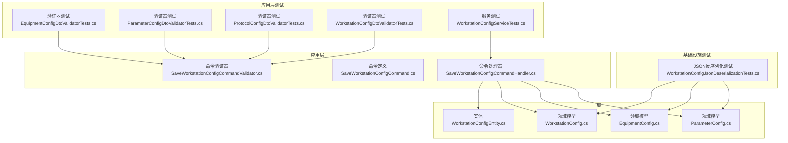
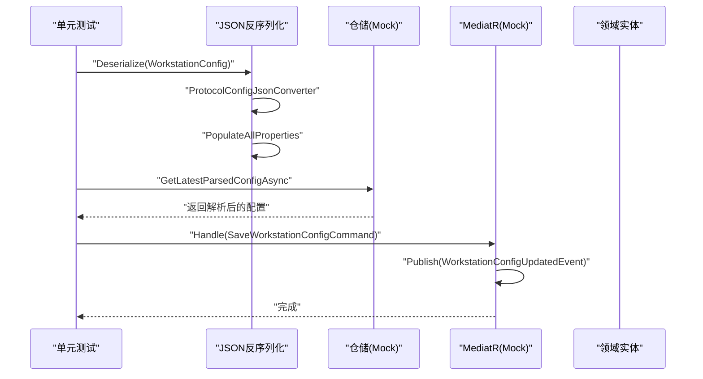
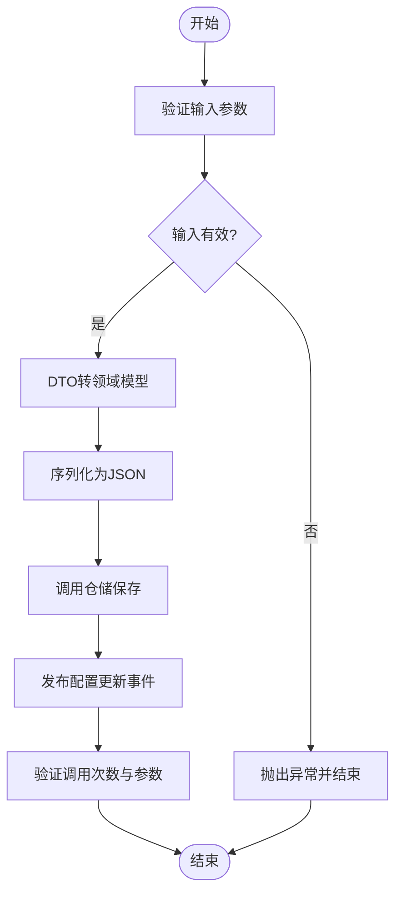
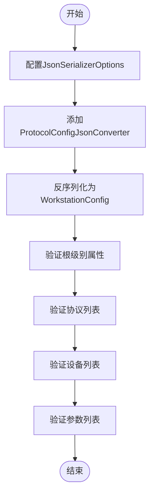
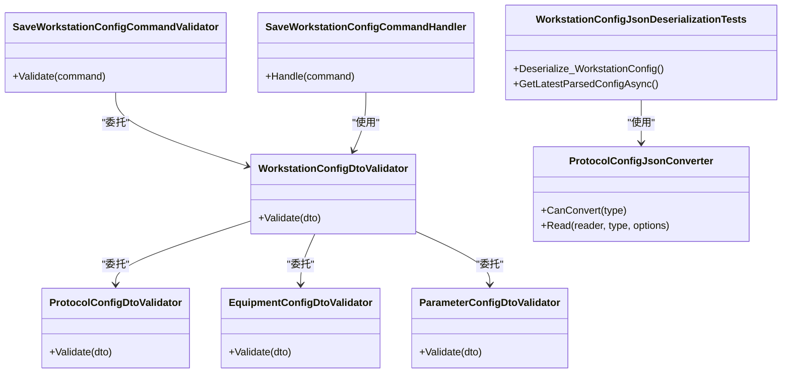

# 单元测试

<cite>
**本文引用的文件**
- [IndustrialDataProcessor.Application.Test\Services\WorkstationConfigServiceTests.cs](file://IndustrialDataProcessor.Application.Test/Services/WorkstationConfigServiceTests.cs)
- [IndustrialDataProcessor.Application.Test\Validators\EquipmentConfigDtoValidatorTests.cs](file://IndustrialDataProcessor.Application.Test/Validators/EquipmentConfigDtoValidatorTests.cs)
- [IndustrialDataProcessor.Application.Test\Validators\ParameterConfigDtoValidatorTests.cs](file://IndustrialDataProcessor.Application.Test/Validators/ParameterConfigDtoValidatorTests.cs)
- [IndustrialDataProcessor.Application.Test\Validators\ProtocolConfigDtoValidatorTests.cs](file://IndustrialDataProcessor.Application.Test/Validators/ProtocolConfigDtoValidatorTests.cs)
- [IndustrialDataProcessor.Application.Test\Validators\WorkstationConfigDtoValidatorTests.cs](file://IndustrialDataProcessor.Application.Test/Validators/WorkstationConfigDtoValidatorTests.cs)
- [IndustrialDataProcessor.Application\CommandHandlers\SaveWorkstationConfigCommandHandler.cs](file://IndustrialDataProcessor.Application/CommandHandlers/SaveWorkstationConfigCommandHandler.cs)
- [IndustrialDataProcessor.Application\Commands\SaveWorkstationConfigCommand.cs](file://IndustrialDataProcessor.Application/Commands/SaveWorkstationConfigCommand.cs)
- [IndustrialDataProcessor.Application\Validators\SaveWorkstationConfigCommandValidator.cs](file://IndustrialDataProcessor.Application/Validators/SaveWorkstationConfigCommandValidator.cs)
- [IndustrialDataProcessor.Application\Services\DataCollectionAppService.cs](file://IndustrialDataProcessor.Application/Services/DataCollectionAppService.cs)
- [IndustrialDataProcessor.Domain\Entities\WorkstationConfigEntity.cs](file://IndustrialDataProcessor.Domain/Entities/WorkstationConfigEntity.cs)
- [IndustrialDataProcessor.Domain\Workstation\Configs\WorkstationConfig.cs](file://IndustrialDataProcessor.Domain/Workstation/Configs/WorkstationConfig.cs)
- [IndustrialDataProcessor.Domain\Workstation\Configs\EquipmentConfig.cs](file://IndustrialDataProcessor.Domain/Workstation/Configs/EquipmentConfig.cs)
- [IndustrialDataProcessor.Domain\Workstation\Configs\ParameterConfig.cs](file://IndustrialDataProcessor.Domain/Workstation/Configs/ParameterConfig.cs)
- [IndustrialDataProcessor\Application\Dtos\WorkstationDto\WorkstationConfigDto.cs](file://IndustrialDataProcessor.Application/Dtos/WorkstationDto/WorkstationConfigDto.cs)
- [IndustrialDataProcessor.Infrastructure.Tests\WorkstationConfigJsonDeserializationTests.cs](file://IndustrialDataProcessor.Infrastructure.Tests/WorkstationConfigJsonDeserializationTests.cs)
- [IndustrialDataProcessor.Infrastructure\Repositories\WorkstationConfigRepository.cs](file://IndustrialDataProcessor.Infrastructure/Repositories/WorkstationConfigRepository.cs)
- [IndustrialDataProcessor.Infrastructure\Serialization\Converters\ProtocolConfigJsonConverter.cs](file://IndustrialDataProcessor.Infrastructure/Serialization/Converters/ProtocolConfigJsonConverter.cs)
</cite>

## 目录
1. [引言](#引言)
2. [项目结构](#项目结构)
3. [核心组件](#核心组件)
4. [架构总览](#架构总览)
5. [详细组件分析](#详细组件分析)
6. [依赖关系分析](#依赖关系分析)
7. [性能考量](#性能考量)
8. [故障排查指南](#故障排查指南)
9. [结论](#结论)
10. [附录](#附录)

## 引言
本文件面向DDD工业数据处理解决方案，系统化梳理单元测试的设计原则、测试金字塔定位、测试用例编写规范、断言策略与测试数据准备方法，并重点覆盖应用层服务、命令处理器、验证器以及领域模型/值对象的测试策略。文档还解释了Mock框架在依赖注入与外部依赖隔离中的使用方式，给出针对工作站配置、设备配置与参数配置的验证逻辑测试示例路径，并提出测试覆盖率与质量度量建议。

**更新** 新增基础设施层的JSON反序列化单元测试，涵盖配置解析验证与仓储集成测试，完善测试金字塔的完整性。

## 项目结构
本项目采用分层与领域驱动设计（DDD）组织，测试主要分布在以下位置：
- 应用层测试：Application.Test（验证器与服务）
- 域测试：Domain（领域模型与值对象）
- 基础设施测试：Infrastructure.Tests（JSON反序列化与仓储集成测试）
- API测试：Api.Test（集成测试）

**图表来源**
- [IndustrialDataProcessor.Application.Test\Validators\EquipmentConfigDtoValidatorTests.cs](file://IndustrialDataProcessor.Application.Test/Validators/EquipmentConfigDtoValidatorTests.cs#L1-L359)
- [IndustrialDataProcessor.Application.Test\Validators\ParameterConfigDtoValidatorTests.cs](file://IndustrialDataProcessor.Application.Test/Validators/ParameterConfigDtoValidatorTests.cs#L1-L334)
- [IndustrialDataProcessor.Application.Test\Validators\ProtocolConfigDtoValidatorTests.cs](file://IndustrialDataProcessor.Application.Test/Validators/ProtocolConfigDtoValidatorTests.cs#L1-L791)
- [IndustrialDataProcessor.Application.Test\Validators\WorkstationConfigDtoValidatorTests.cs](file://IndustrialDataProcessor.Application.Test/Validators/WorkstationConfigDtoValidatorTests.cs#L1-L488)
- [IndustrialDataProcessor.Application.Test\Services\WorkstationConfigServiceTests.cs](file://IndustrialDataProcessor.Application.Test/Services/WorkstationConfigServiceTests.cs#L1-L643)
- [IndustrialDataProcessor.Infrastructure.Tests\WorkstationConfigJsonDeserializationTests.cs](file://IndustrialDataProcessor.Infrastructure.Tests/WorkstationConfigJsonDeserializationTests.cs#L1-L101)

**章节来源**
- [IndustrialDataProcessor.Application.Test\Services\WorkstationConfigServiceTests.cs](file://IndustrialDataProcessor.Application.Test/Services/WorkstationConfigServiceTests.cs#L1-L643)
- [IndustrialDataProcessor.Application.Test\Validators\EquipmentConfigDtoValidatorTests.cs](file://IndustrialDataProcessor.Application.Test/Validators/EquipmentConfigDtoValidatorTests.cs#L1-L359)
- [IndustrialDataProcessor.Application.Test\Validators\ParameterConfigDtoValidatorTests.cs](file://IndustrialDataProcessor.Application.Test/Validators/ParameterConfigDtoValidatorTests.cs#L1-L334)
- [IndustrialDataProcessor.Application.Test\Validators\ProtocolConfigDtoValidatorTests.cs](file://IndustrialDataProcessor.Application.Test/Validators/ProtocolConfigDtoValidatorTests.cs#L1-L791)
- [IndustrialDataProcessor.Application.Test\Validators\WorkstationConfigDtoValidatorTests.cs](file://IndustrialDataProcessor.Application.Test/Validators/WorkstationConfigDtoValidatorTests.cs#L1-L488)
- [IndustrialDataProcessor.Infrastructure.Tests\WorkstationConfigJsonDeserializationTests.cs](file://IndustrialDataProcessor.Infrastructure.Tests/WorkstationConfigJsonDeserializationTests.cs#L1-L101)

## 核心组件
- 应用层命令处理器：负责接收命令、序列化领域模型、持久化并发布事件。
- 验证器：基于FluentValidation，覆盖工作站、协议、设备、参数四类DTO的完整校验规则。
- 领域模型与值对象：WorkstationConfig、EquipmentConfig、ParameterConfig及其DTO映射。
- 服务与应用服务：数据采集应用服务负责多协议并发采集与结果发布。
- **新增** 基础设施层JSON反序列化测试：验证配置解析、仓储集成与序列化转换器的正确性。

**章节来源**
- [IndustrialDataProcessor.Application\CommandHandlers\SaveWorkstationConfigCommandHandler.cs](file://IndustrialDataProcessor.Application/CommandHandlers/SaveWorkstationConfigCommandHandler.cs#L1-L32)
- [IndustrialDataProcessor.Application\Validators\SaveWorkstationConfigCommandValidator.cs](file://IndustrialDataProcessor.Application/Validators/SaveWorkstationConfigCommandValidator.cs#L1-L13)
- [IndustrialDataProcessor.Domain\Workstation\Configs\WorkstationConfig.cs](file://IndustrialDataProcessor.Domain/Workstation/Configs/WorkstationConfig.cs#L1-L27)
- [IndustrialDataProcessor.Domain\Workstation\Configs\EquipmentConfig.cs](file://IndustrialDataProcessor.Domain/Workstation/Configs/EquipmentConfig.cs#L1-L34)
- [IndustrialDataProcessor.Domain\Workstation\Configs\ParameterConfig.cs](file://IndustrialDataProcessor.Domain/Workstation/Configs/ParameterConfig.cs#L1-L84)
- [IndustrialDataProcessor.Infrastructure.Tests\WorkstationConfigJsonDeserializationTests.cs](file://IndustrialDataProcessor.Infrastructure.Tests/WorkstationConfigJsonDeserializationTests.cs#L1-L101)

## 架构总览
单元测试在测试金字塔中承担"最底层"的快速反馈角色，确保验证器与应用服务的行为稳定可靠，减少回归风险。新增的基础设施测试进一步完善了测试金字塔的完整性，确保配置解析与仓储集成的可靠性。

**图表来源**
- [IndustrialDataProcessor.Infrastructure.Tests\WorkstationConfigJsonDeserializationTests.cs](file://IndustrialDataProcessor.Infrastructure.Tests/WorkstationConfigJsonDeserializationTests.cs#L30-L67)
- [IndustrialDataProcessor.Infrastructure.Tests\WorkstationConfigJsonDeserializationTests.cs](file://IndustrialDataProcessor.Infrastructure.Tests/WorkstationConfigJsonDeserializationTests.cs#L69-L99)
- [IndustrialDataProcessor.Application\CommandHandlers\SaveWorkstationConfigCommandHandler.cs](file://IndustrialDataProcessor.Application/CommandHandlers/SaveWorkstationConfigCommandHandler.cs#L18-L30)

## 详细组件分析

### 应用层命令处理器单元测试
- 目标：验证命令处理器在输入DTO合法时，能正确序列化、持久化并发布事件；在输入非法时应提前失败。
- 关键断言：
  - 输入为空/空白/格式错误时抛出相应异常（如ArgumentNullException/ArgumentException）。
  - 验证器调用次数为1，仓储AddAsync调用次数为1。
  - 保存的JSON可被反序列化为DTO。
  - 取消令牌正确传递至验证器与仓储。
  - 异常场景（如OperationCanceledException）正确传播。
- 测试数据准备：
  - 使用辅助方法构造有效/无效DTO，覆盖最小有效配置、多协议/多设备/多参数、特殊字符等边界场景。

**图表来源**
- [IndustrialDataProcessor.Application.Test\Services\WorkstationConfigServiceTests.cs](file://IndustrialDataProcessor.Application.Test/Services/WorkstationConfigServiceTests.cs#L68-L138)
- [IndustrialDataProcessor.Application.Test\Services\WorkstationConfigServiceTests.cs](file://IndustrialDataProcessor.Application.Test/Services/WorkstationConfigServiceTests.cs#L207-L283)

**章节来源**
- [IndustrialDataProcessor.Application.Test\Services\WorkstationConfigServiceTests.cs](file://IndustrialDataProcessor.Application.Test/Services/WorkstationConfigServiceTests.cs#L1-L643)

### 工作站配置DTO验证器单元测试
- 目标：验证工作站DTO的Id/IP地址/协议列表必填与格式校验，以及嵌套协议、设备、参数的子项验证。
- 关键断言：
  - Id/IP地址为空/格式错误时返回验证异常。
  - Protocols为空/为null时返回验证异常。
  - 嵌套协议/设备/参数字段无效时返回对应错误。
  - 多协议、多设备、多参数的复杂结构仍可通过验证。
- 测试数据准备：
  - 使用辅助方法构建最小有效配置、LAN/COM/DB/API协议、多设备/多参数组合。

**章节来源**
- [IndustrialDataProcessor.Application.Test\Validators\WorkstationConfigDtoValidatorTests.cs](file://IndustrialDataProcessor.Application.Test/Validators/WorkstationConfigDtoValidatorTests.cs#L1-L488)

### 协议配置DTO验证器单元测试
- 目标：验证协议DTO的Id、接口类型、协议类型、串口/网口/数据库/API等接口特定字段的校验。
- 关键断言：
  - 接口类型与协议类型不兼容时返回验证异常。
  - COM接口必填字段（波特率、数据位、校验位、停止位、串口号）缺失时返回验证异常。
  - LAN接口IP地址格式与端口范围校验。
  - DATABASE接口连接字符串与拆分属性至少满足一种。
  - API接口请求方式与访问API语句必填。
  - 嵌套设备与参数字段的子项验证。
- 测试数据准备：
  - 分别构造COM/LAN/DATABASE/API协议的有效与无效配置，覆盖边界与异常场景。

**章节来源**
- [IndustrialDataProcessor.Application.Test\Validators\ProtocolConfigDtoValidatorTests.cs](file://IndustrialDataProcessor.Application.Test/Validators/ProtocolConfigDtoValidatorTests.cs#L1-L791)

### 设备配置DTO验证器单元测试
- 目标：验证设备DTO的Id、协议类型、设备类型、参数列表必填与有效性。
- 关键断言：
  - Id为空/空白/null时返回验证异常。
  - 参数列表为null/空集合时返回验证异常。
  - 参数子项（Label/Address/DataType/Cycle/MinValue/MaxValue等）无效时返回验证异常。
  - 协议特定字段缺失（如ModbusTcpNet要求StationNo）时返回验证异常。
- 测试数据准备：
  - 构造完全有效设备配置，逐步破坏字段以覆盖边界条件。

**章节来源**
- [IndustrialDataProcessor.Application.Test\Validators\EquipmentConfigDtoValidatorTests.cs](file://IndustrialDataProcessor.Application.Test/Validators/EquipmentConfigDtoValidatorTests.cs#L1-L359)

### 参数配置DTO验证器单元测试
- 目标：验证参数DTO的Label/Address、DataType/DataFormat/InstrumentType、Cycle、Min/Max值关系、协议特定字段等。
- 关键断言：
  - Label/Address为空/空白/Null时返回验证异常。
  - DataType/DataFormat/InstrumentType枚举越界时返回验证异常。
  - Cycle为负数时返回验证异常。
  - MinValue大于MaxValue时返回验证异常（数值可解析时）。
  - 协议特定字段缺失（如ModbusTcpNet要求DataFormat/StationNo/DataType/AddressStartWithZero，CJT188要求InstrumentType）时返回验证异常。
  - OPC UA协议仅需Label/Address/IsMonitor。
- 测试数据准备：
  - 构造基础有效参数配置，按协议类型分别破坏字段以覆盖边界与异常场景。

**章节来源**
- [IndustrialDataProcessor.Application.Test\Validators\ParameterConfigDtoValidatorTests.cs](file://IndustrialDataProcessor.Application.Test/Validators/ParameterConfigDtoValidatorTests.cs#L1-L334)

### 领域模型与值对象单元测试方法
- 设计原则：
  - 优先测试不变量与边界条件（如枚举越界、数值范围、字符串格式）。
  - 针对协议特定约束（如StationNo、DataFormat、InstrumentType）进行专项验证。
  - 使用最小有效配置作为基线，逐步增加复杂度。
- 断言策略：
  - 使用FluentValidation.TestHelper进行字段级断言。
  - 对于复杂结构，使用嵌套路径断言（如Parameters[0].Label）。
- 测试数据准备：
  - 提供辅助方法创建最小有效对象，再按需修改字段。
  - 包含特殊字符、边界端口、无效IP等场景。

**章节来源**
- [IndustrialDataProcessor.Domain\Workstation\Configs\WorkstationConfig.cs](file://IndustrialDataProcessor.Domain/Workstation/Configs/WorkstationConfig.cs#L1-L27)
- [IndustrialDataProcessor.Domain\Workstation\Configs\EquipmentConfig.cs](file://IndustrialDataProcessor.Domain/Workstation/Configs/EquipmentConfig.cs#L1-L34)
- [IndustrialDataProcessor.Domain\Workstation\Configs\ParameterConfig.cs](file://IndustrialDataProcessor.Domain/Workstation/Configs/ParameterConfig.cs#L1-L84)

### 基础设施层JSON反序列化单元测试
- **新增** 目标：验证工作站配置的JSON反序列化过程，确保配置解析的完整性与准确性。
- 关键断言：
  - 使用ProtocolConfigJsonConverter正确解析协议配置。
  - 所有根级别属性（Id、Name、IpAddress）正确填充。
  - 协议列表、设备列表、参数列表的数量与内容正确。
  - 特定协议类型（如NetworkProtocolConfig）的专用字段可访问。
- 测试数据准备：
  - 使用完整的JSON配置字符串，包含工作站、协议、设备、参数的完整层级结构。
  - 覆盖不同协议类型的组合场景。

**图表来源**
- [IndustrialDataProcessor.Infrastructure.Tests\WorkstationConfigJsonDeserializationTests.cs](file://IndustrialDataProcessor.Infrastructure.Tests/WorkstationConfigJsonDeserializationTests.cs#L21-L28)
- [IndustrialDataProcessor.Infrastructure.Tests\WorkstationConfigJsonDeserializationTests.cs](file://IndustrialDataProcessor.Infrastructure.Tests/WorkstationConfigJsonDeserializationTests.cs#L30-L67)

**章节来源**
- [IndustrialDataProcessor.Infrastructure.Tests\WorkstationConfigJsonDeserializationTests.cs](file://IndustrialDataProcessor.Infrastructure.Tests/WorkstationConfigJsonDeserializationTests.cs#L1-L101)

### 仓储集成测试
- **新增** 目标：验证WorkstationConfigRepository的GetLatestParsedConfigAsync方法与仓储集成的正确性。
- 关键断言：
  - Mock IWorkstationConfigEntityRepository正确返回WorkstationConfigEntity。
  - GetLatestParsedConfigAsync返回解析后的WorkstationConfig对象。
  - 解析后的配置对象包含完整的层级结构（协议、设备、参数）。
  - 日志记录器正确初始化并可用于调试信息。
- 测试数据准备：
  - 使用Mock框架模拟仓储接口，返回预定义的WorkstationConfigEntity。
  - 配置取消令牌以支持异步操作。

**章节来源**
- [IndustrialDataProcessor.Infrastructure.Tests\WorkstationConfigJsonDeserializationTests.cs](file://IndustrialDataProcessor.Infrastructure.Tests/WorkstationConfigJsonDeserializationTests.cs#L69-L99)

### Mock框架与依赖注入隔离
- 使用Moq对仓储与验证器进行Mock，确保测试仅关注应用服务的编排逻辑。
- 在命令处理器测试中，通过Mock验证器与仓储，断言调用次数与参数，避免真实持久化与事件发布带来的副作用。
- 在应用服务测试中，通过Mock连接管理器、驱动与处理器，隔离外部通信与硬件依赖。
- **新增** 在基础设施测试中，使用Mock隔离仓储依赖，专注于序列化转换器的验证。

**章节来源**
- [IndustrialDataProcessor.Application.Test\Services\WorkstationConfigServiceTests.cs](file://IndustrialDataProcessor.Application.Test/Services/WorkstationConfigServiceTests.cs#L16-L27)
- [IndustrialDataProcessor.Application\Services\DataCollectionAppService.cs](file://IndustrialDataProcessor.Application/Services/DataCollectionAppService.cs#L10-L17)
- [IndustrialDataProcessor.Infrastructure.Tests\WorkstationConfigJsonDeserializationTests.cs](file://IndustrialDataProcessor.Infrastructure.Tests/WorkstationConfigJsonDeserializationTests.cs#L72-L86)

### 测试用例示例（路径指引）
- 工作站配置保存（命令处理器）：
  - [SaveWorkstationConfigAsync_WhenValidationSucceeds_ShouldSaveToDatabase](file://IndustrialDataProcessor.Application.Test/Services/WorkstationConfigServiceTests.cs#L207-L235)
  - [SaveWorkstationConfigAsync_WhenValidationFails_ShouldThrowValidationException](file://IndustrialDataProcessor.Application.Test/Services/WorkstationConfigServiceTests.cs#L144-L168)
  - [SaveWorkstationConfigAsync_ShouldCallValidatorOnce](file://IndustrialDataProcessor.Application.Test/Services/WorkstationConfigServiceTests.cs#L237-L255)
- 工作站配置DTO验证：
  - [Id_WhenEmpty_ShouldHaveValidationError](file://IndustrialDataProcessor.Application.Test/Validators/WorkstationConfigDtoValidatorTests.cs#L21-L37)
  - [IpAddress_WhenInvalidFormat_ShouldHaveValidationError](file://IndustrialDataProcessor.Application.Test/Validators/WorkstationConfigDtoValidatorTests.cs#L86-L98)
  - [Protocols_WhenContainsInvalidProtocolType_ShouldHaveValidationError](file://IndustrialDataProcessor.Application.Test/Validators/WorkstationConfigDtoValidatorTests.cs#L231-L243)
- 协议配置DTO验证（LAN）：
  - [IpAddress_WhenLanAndInvalidFormat_ShouldHaveValidationError](file://IndustrialDataProcessor.Application.Test/Validators/ProtocolConfigDtoValidatorTests.cs#L249-L265)
  - [ProtocolPort_WhenLanAndZeroOrNegative_ShouldHaveValidationError](file://IndustrialDataProcessor.Application.Test/Validators/ProtocolConfigDtoValidatorTests.cs#L300-L313)
- 设备配置DTO验证：
  - [Parameters_WhenContainsInvalidLabel_ShouldHaveValidationError](file://IndustrialDataProcessor.Application.Test/Validators/EquipmentConfigDtoValidatorTests.cs#L165-L177)
  - [Parameters_WhenContainsInvalidDataType_ShouldHaveValidationError](file://IndustrialDataProcessor.Application.Test/Validators/EquipmentConfigDtoValidatorTests.cs#L193-L205)
- 参数配置DTO验证（协议特定）：
  - [DataFormat_WhenRequiredByProtocolButMissing_ShouldHaveValidationError](file://IndustrialDataProcessor.Application.Test/Validators/ParameterConfigDtoValidatorTests.cs#L200-L214)
  - [StationNo_WhenRequiredByProtocolButMissing_ShouldHaveValidationError](file://IndustrialDataProcessor.Application.Test/Validators/ParameterConfigDtoValidatorTests.cs#L216-L233)
- **新增** JSON反序列化测试：
  - [Deserialize_WorkstationConfig_ShouldPopulateAllProperties](file://IndustrialDataProcessor.Infrastructure.Tests/WorkstationConfigJsonDeserializationTests.cs#L30-L67)
  - [WorkstationConfigRepository_GetLatestParsedConfigAsync_ShouldReturnCorrectData](file://IndustrialDataProcessor.Infrastructure.Tests/WorkstationConfigJsonDeserializationTests.cs#L69-L99)

## 依赖关系分析
- 验证器依赖：
  - SaveWorkstationConfigCommandValidator将命令DTO委托给WorkstationConfigDtoValidator进行验证。
  - WorkstationConfigDtoValidator进一步委托给ProtocolConfigDtoValidator、EquipmentConfigDtoValidator、ParameterConfigDtoValidator。
- 命令处理器依赖：
  - SaveWorkstationConfigCommandHandler依赖仓储与MediatR，负责序列化与事件发布。
- 领域模型依赖：
  - DTO与领域模型之间通过映射器进行转换，命令处理器内部完成序列化。
- **新增** 基础设施测试依赖：
  - WorkstationConfigJsonDeserializationTests依赖ProtocolConfigJsonConverter进行协议配置解析。
  - 测试覆盖从JSON字符串到WorkstationConfig对象的完整转换链路。

**图表来源**
- [IndustrialDataProcessor.Application\Validators\SaveWorkstationConfigCommandValidator.cs](file://IndustrialDataProcessor.Application/Validators/SaveWorkstationConfigCommandValidator.cs#L6-L12)
- [IndustrialDataProcessor.Application\Test\Validators\WorkstationConfigDtoValidatorTests.cs](file://IndustrialDataProcessor.Application.Test/Validators/WorkstationConfigDtoValidatorTests.cs#L1-L488)
- [IndustrialDataProcessor.Application\Test\Validators\ProtocolConfigDtoValidatorTests.cs](file://IndustrialDataProcessor.Application.Test/Validators/ProtocolConfigDtoValidatorTests.cs#L1-L791)
- [IndustrialDataProcessor.Application\Test\Validators\EquipmentConfigDtoValidatorTests.cs](file://IndustrialDataProcessor.Application.Test/Validators/EquipmentConfigDtoValidatorTests.cs#L1-L359)
- [IndustrialDataProcessor.Application\Test\Validators\ParameterConfigDtoValidatorTests.cs](file://IndustrialDataProcessor.Application.Test/Validators/ParameterConfigDtoValidatorTests.cs#L1-L334)
- [IndustrialDataProcessor.Application\CommandHandlers\SaveWorkstationConfigCommandHandler.cs](file://IndustrialDataProcessor.Application/CommandHandlers/SaveWorkstationConfigCommandHandler.cs#L11-L16)
- [IndustrialDataProcessor.Infrastructure.Tests\WorkstationConfigJsonDeserializationTests.cs](file://IndustrialDataProcessor.Infrastructure.Tests/WorkstationConfigJsonDeserializationTests.cs#L14-L28)
- [IndustrialDataProcessor.Infrastructure\Serialization\Converters\ProtocolConfigJsonConverter.cs](file://IndustrialDataProcessor.Infrastructure/Serialization/Converters/ProtocolConfigJsonConverter.cs)

**章节来源**
- [IndustrialDataProcessor.Application\Validators\SaveWorkstationConfigCommandValidator.cs](file://IndustrialDataProcessor.Application/Validators/SaveWorkstationConfigCommandValidator.cs#L1-L13)
- [IndustrialDataProcessor.Application\CommandHandlers\SaveWorkstationConfigCommandHandler.cs](file://IndustrialDataProcessor.Application/CommandHandlers/SaveWorkstationConfigCommandHandler.cs#L1-L32)
- [IndustrialDataProcessor.Infrastructure.Tests\WorkstationConfigJsonDeserializationTests.cs](file://IndustrialDataProcessor.Infrastructure.Tests/WorkstationConfigJsonDeserializationTests.cs#L1-L101)

## 性能考量
- 单元测试应保持快速与稳定，避免外部依赖与同步阻塞。
- 对于涉及异步与取消令牌的场景，确保测试中正确传递与验证，避免超时或悬挂。
- 对于复杂DTO验证，优先使用子项断言与组合断言，减少重复测试逻辑。
- **新增** JSON反序列化测试应避免不必要的字符串操作，使用预定义的测试JSON字符串以提高执行效率。

## 故障排查指南
- 验证失败：
  - 检查DTO字段是否符合枚举范围与格式要求。
  - 检查协议特定字段是否缺失（如StationNo、DataFormat、InstrumentType）。
- 序列化/反序列化问题：
  - 确认保存的JSON可被正确反序列化为目标DTO。
  - **新增** 检查ProtocolConfigJsonConverter是否正确注册到JsonSerializerOptions中。
  - **新增** 验证JSON字符串格式是否符合预期的配置结构。
- 依赖注入与Mock：
  - 确保Mock对象的Setup与Verify匹配，避免遗漏调用或误判。
  - **新增** 在仓储集成测试中，确认Mock仓储返回的数据结构与实际实体一致。
- 取消令牌：
  - 确认取消令牌正确传递至验证器与仓储，异常场景应传播OperationCanceledException。
- **新增** 配置解析问题：
  - 检查WorkstationConfigEntity的JsonContent格式是否正确。
  - 验证GetLatestParsedConfigAsync方法是否正确处理异步操作。

**章节来源**
- [IndustrialDataProcessor.Application.Test\Services\WorkstationConfigServiceTests.cs](file://IndustrialDataProcessor.Application.Test/Services/WorkstationConfigServiceTests.cs#L289-L347)
- [IndustrialDataProcessor.Application.Test\Validators\ParameterConfigDtoValidatorTests.cs](file://IndustrialDataProcessor.Application.Test/Validators/ParameterConfigDtoValidatorTests.cs#L200-L265)
- [IndustrialDataProcessor.Infrastructure.Tests\WorkstationConfigJsonDeserializationTests.cs](file://IndustrialDataProcessor.Infrastructure.Tests/WorkstationConfigJsonDeserializationTests.cs#L69-L99)

## 结论
本项目的单元测试围绕验证器与应用服务展开，通过Mock隔离外部依赖，覆盖工作站、协议、设备与参数的完整验证逻辑与边界条件。新增的基础设施层JSON反序列化测试进一步完善了测试金字塔，确保配置解析与仓储集成的可靠性。配合清晰的断言策略与测试数据准备方法，能够有效保障配置验证的正确性与稳定性。建议持续完善覆盖率与质量度量，确保关键路径与异常分支均得到充分验证。

## 附录
- 测试金字塔定位：
  - 单元测试：验证器与应用服务行为，数量最多，反馈最快。
  - **新增** 基础设施测试：JSON反序列化与仓储集成，确保配置解析的完整性。
  - 集成测试：仓储、事件发布与API交互（见Api.Test/Infrastructure.Test）。
  - 端到端测试：系统级流程验证（见Api.Test/Infrastructure.Test）。
- 测试覆盖率与质量度量建议（通用实践）：
  - 行覆盖率：建议≥80%，关键路径≥90%。
  - 分支覆盖率：建议≥70%，关键分支≥85%。
  - 圈复杂度：控制在合理区间，避免过度复杂验证器。
  - 缺陷密度：单位代码的缺陷数量应持续下降。
  - 回归用例比例：新增功能配套用例比例≥100%。
  - **新增** JSON解析覆盖率：确保所有协议类型与配置场景都有对应的反序列化测试。