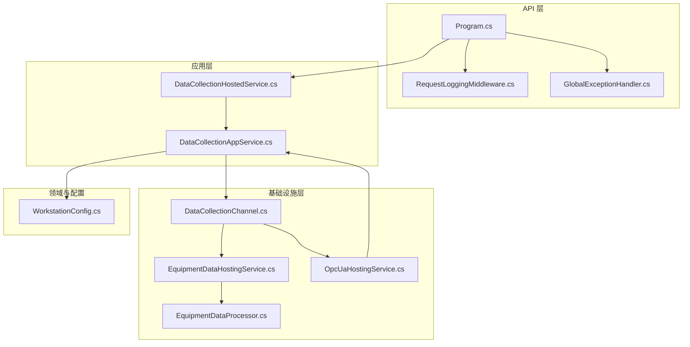
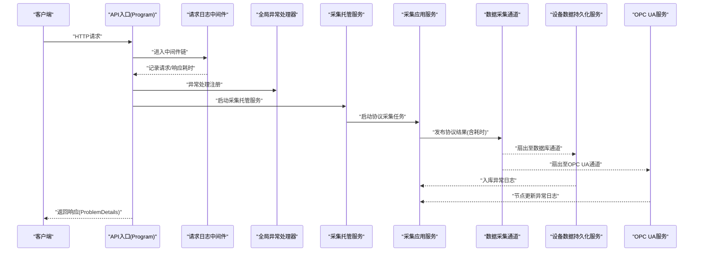
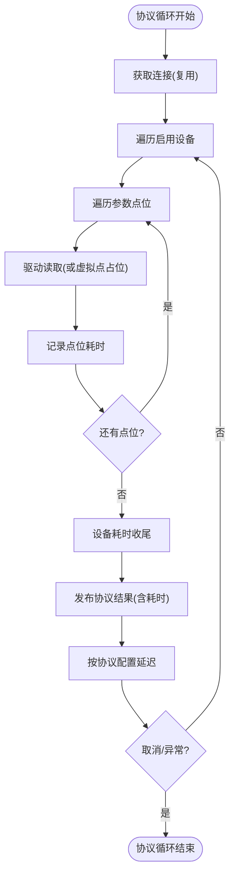
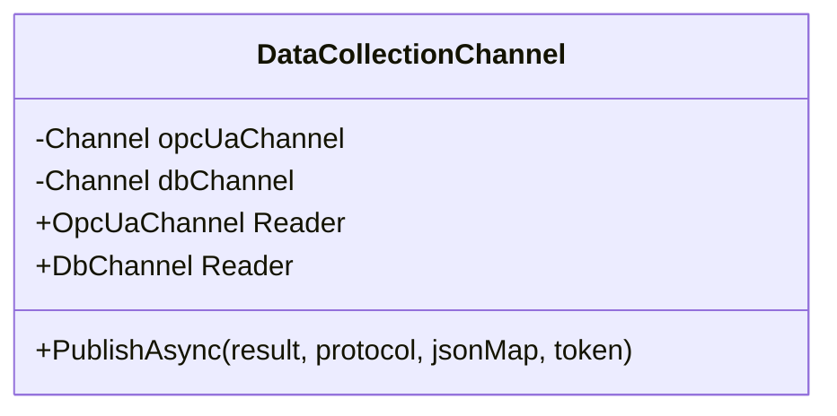
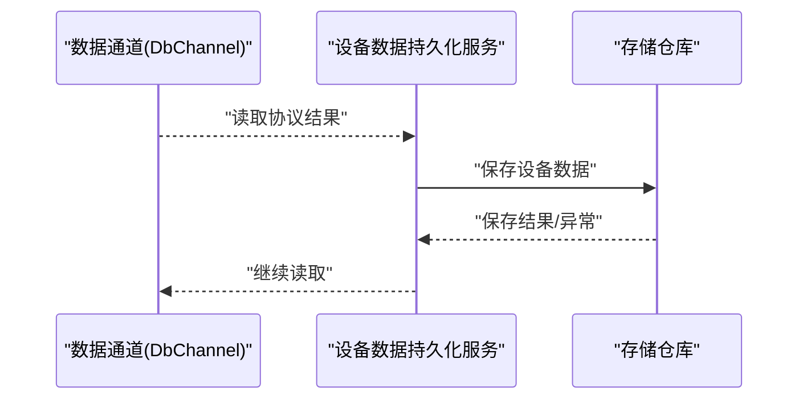
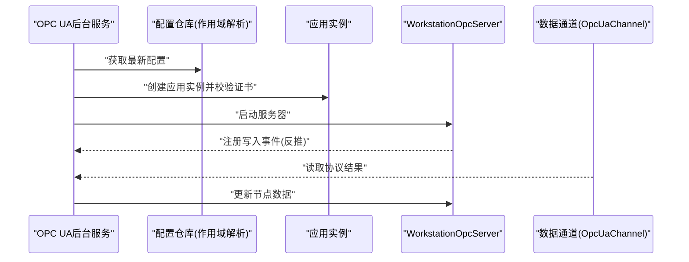
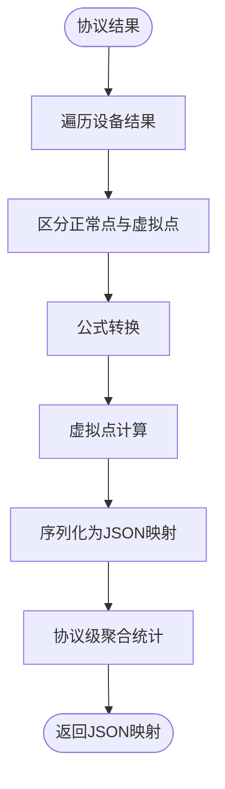
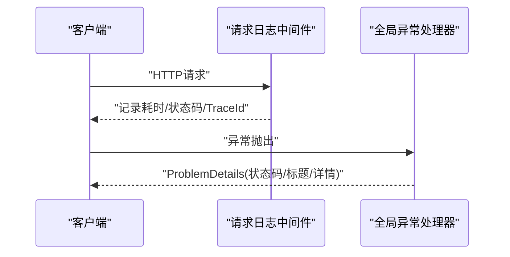
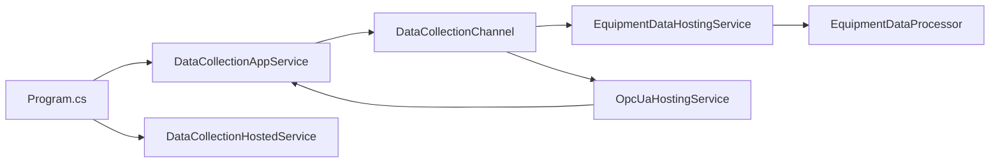

# 性能测试

<cite>
**本文引用的文件**
- [Program.cs](file://IndustrialDataSolution/IndustrialDataProcessor.Api/Program.cs)
- [appsettings.json](file://IndustrialDataSolution/IndustrialDataProcessor.Api/appsettings.json)
- [DataCollectionAppService.cs](file://IndustrialDataSolution/IndustrialDataProcessor.Application/Services/DataCollectionAppService.cs)
- [EquipmentDataHostingService.cs](file://IndustrialDataSolution/IndustrialDataProcessor.Infrastructure/BackgroundServices/EquipmentDataHostingService.cs)
- [OpcUaHostingService.cs](file://IndustrialDataSolution/IndustrialDataProcessor.Infrastructure/BackgroundServices/OpcUaHostingService.cs)
- [DataCollectionChannel.cs](file://IndustrialDataSolution/IndustrialDataProcessor.Domain/Workstation/Results/DataCollectionChannel.cs)
- [EquipmentDataProcessor.cs](file://IndustrialDataSolution/IndustrialDataProcessor.Infrastructure/EquipmentCollectionDataProcessing/EquipmentDataProcessor.cs)
- [DataCollectionHostedService.cs](file://IndustrialDataSolution/IndustrialDataProcessor.Api/BackgroundServices/DataCollectionHostedService.cs)
- [WorkstationConfig.cs](file://IndustrialDataSolution/IndustrialDataProcessor.Domain/Workstation/Configs/WorkstationConfig.cs)
- [RequestLoggingMiddleware.cs](file://IndustrialDataSolution/IndustrialDataProcessor.Api/Middleware/RequestLoggingMiddleware.cs)
- [GlobalExceptionHandler.cs](file://IndustrialDataSolution/IndustrialDataProcessor.Api/Middleware/GlobalExceptionHandler.cs)
- [WorkstationConfigApiTests.cs](file://IndustrialDataSolution/IndustrialDataProcessor.Api.Tests/Integration/WorkstationConfigApiTests.cs)
- [ModbusTcpDriverIntegrationTests.cs](file://IndustrialDataSolution/IndustrialDataProcessor.Infrastructure.Tests/Integration/ModbusTcpDriverIntegrationTests.cs)
- [WorkstationConfigServiceTests.cs](file://IndustrialDataSolution/IndustrialDataProcessor.Application.Test/Services/WorkstationConfigServiceTests.cs)
</cite>

## 目录
1. [引言](#引言)
2. [项目结构](#项目结构)
3. [核心组件](#核心组件)
4. [架构总览](#架构总览)
5. [详细组件分析](#详细组件分析)
6. [依赖关系分析](#依赖关系分析)
7. [性能考量](#性能考量)
8. [故障排查指南](#故障排查指南)
9. [结论](#结论)
10. [附录](#附录)

## 引言
本指南面向DDD工业数据处理解决方案，提供一套可落地的性能测试实施方法论。重点围绕以下目标展开：
- 明确性能测试目标与意义：响应时间、吞吐量、资源利用率三要素的测量与分析。
- 负载测试设计：并发用户数设定、测试场景模拟、瓶颈识别与定位。
- 压力测试策略：系统极限测试、稳定性测试、恢复能力测试。
- 基准测试建立：基线数据收集、指标定义、结果分析。
- 性能测试用例示例：覆盖数据采集链路的端到端性能评估。
- 监控与优化：性能监控工具使用、优化建议、测试报告生成。

## 项目结构
本项目采用多层架构（API、应用、领域、基础设施、共享），围绕“数据采集—处理—存储—发布”的主路径组织代码。性能测试应聚焦于以下关键路径：
- API层：请求处理、异常处理、健康检查、中间件日志。
- 应用层：采集任务调度、协议循环、点位读取、耗时统计。
- 基础设施层：后台服务、连接管理、OPC UA服务器、数据持久化。
- 领域模型：工作站配置、协议配置、采集结果通道。

**图表来源**
- [Program.cs](file://IndustrialDataSolution/IndustrialDataProcessor.Api/Program.cs#L1-L54)
- [RequestLoggingMiddleware.cs](file://IndustrialDataSolution/IndustrialDataProcessor.Api/Middleware/RequestLoggingMiddleware.cs#L1-L141)
- [GlobalExceptionHandler.cs](file://IndustrialDataSolution/IndustrialDataProcessor.Api/Middleware/GlobalExceptionHandler.cs#L1-L94)
- [DataCollectionHostedService.cs](file://IndustrialDataSolution/IndustrialDataProcessor.Api/BackgroundServices/DataCollectionHostedService.cs#L1-L28)
- [DataCollectionAppService.cs](file://IndustrialDataSolution/IndustrialDataProcessor.Application/Services/DataCollectionAppService.cs#L1-L216)
- [EquipmentDataHostingService.cs](file://IndustrialDataSolution/IndustrialDataProcessor.Infrastructure/BackgroundServices/EquipmentDataHostingService.cs#L1-L43)
- [OpcUaHostingService.cs](file://IndustrialDataSolution/IndustrialDataProcessor.Infrastructure/BackgroundServices/OpcUaHostingService.cs#L1-L228)
- [DataCollectionChannel.cs](file://IndustrialDataSolution/IndustrialDataProcessor.Domain/Workstation/Results/DataCollectionChannel.cs#L1-L37)
- [EquipmentDataProcessor.cs](file://IndustrialDataSolution/IndustrialDataProcessor.Infrastructure/EquipmentCollectionDataProcessing/EquipmentDataProcessor.cs#L1-L157)
- [WorkstationConfig.cs](file://IndustrialDataSolution/IndustrialDataProcessor.Domain/Workstation/Configs/WorkstationConfig.cs#L1-L27)

**章节来源**
- [Program.cs](file://IndustrialDataSolution/IndustrialDataProcessor.Api/Program.cs#L1-L54)
- [DataCollectionHostedService.cs](file://IndustrialDataSolution/IndustrialDataProcessor.Api/BackgroundServices/DataCollectionHostedService.cs#L1-L28)

## 核心组件
- API入口与中间件
  - 程序入口注册服务、中间件顺序与健康检查，便于在不同阶段采集性能数据。
  - 请求日志中间件提供请求/响应耗时、状态码、TraceId等关键指标。
  - 全局异常处理器统一输出ProblemDetails，便于定位错误率与错误类型分布。
- 应用层采集服务
  - 协议级独立循环、设备级循环、点位级循环均带有Stopwatch计时，支持逐层耗时分析。
  - 协议级延迟由配置控制，避免CPU占用过高。
  - 通道发布采用异步扇出，支持OPC UA与数据库两条路径并行。
- 基础设施层后台服务
  - 设备数据持久化后台服务从通道读取并批量入库，异常日志记录有助于定位存储瓶颈。
  - OPC UA后台服务启动/重启控制、客户端写入反推、节点更新循环，支撑发布链路。
- 领域与配置
  - 工作站配置包含协议列表，是性能测试场景构建的基础数据源。

**章节来源**
- [Program.cs](file://IndustrialDataSolution/IndustrialDataProcessor.Api/Program.cs#L1-L54)
- [RequestLoggingMiddleware.cs](file://IndustrialDataSolution/IndustrialDataProcessor.Api/Middleware/RequestLoggingMiddleware.cs#L16-L84)
- [GlobalExceptionHandler.cs](file://IndustrialDataSolution/IndustrialDataProcessor.Api/Middleware/GlobalExceptionHandler.cs#L12-L47)
- [DataCollectionAppService.cs](file://IndustrialDataSolution/IndustrialDataProcessor.Application/Services/DataCollectionAppService.cs#L22-L214)
- [EquipmentDataHostingService.cs](file://IndustrialDataSolution/IndustrialDataProcessor.Infrastructure/BackgroundServices/EquipmentDataHostingService.cs#L16-L41)
- [OpcUaHostingService.cs](file://IndustrialDataSolution/IndustrialDataProcessor.Infrastructure/BackgroundServices/OpcUaHostingService.cs#L45-L184)
- [DataCollectionChannel.cs](file://IndustrialDataSolution/IndustrialDataProcessor.Domain/Workstation/Results/DataCollectionChannel.cs#L29-L35)
- [WorkstationConfig.cs](file://IndustrialDataSolution/IndustrialDataProcessor.Domain/Workstation/Configs/WorkstationConfig.cs#L6-L27)

## 架构总览
下图展示了数据采集与发布的端到端路径，以及性能测试关注的关键节点：

**图表来源**
- [Program.cs](file://IndustrialDataSolution/IndustrialDataProcessor.Api/Program.cs#L36-L51)
- [RequestLoggingMiddleware.cs](file://IndustrialDataSolution/IndustrialDataProcessor.Api/Middleware/RequestLoggingMiddleware.cs#L16-L84)
- [GlobalExceptionHandler.cs](file://IndustrialDataSolution/IndustrialDataProcessor.Api/Middleware/GlobalExceptionHandler.cs#L12-L47)
- [DataCollectionHostedService.cs](file://IndustrialDataSolution/IndustrialDataProcessor.Api/BackgroundServices/DataCollectionHostedService.cs#L15-L26)
- [DataCollectionAppService.cs](file://IndustrialDataSolution/IndustrialDataProcessor.Application/Services/DataCollectionAppService.cs#L22-L214)
- [DataCollectionChannel.cs](file://IndustrialDataSolution/IndustrialDataProcessor.Domain/Workstation/Results/DataCollectionChannel.cs#L29-L35)
- [EquipmentDataHostingService.cs](file://IndustrialDataSolution/IndustrialDataProcessor.Infrastructure/BackgroundServices/EquipmentDataHostingService.cs#L16-L41)
- [OpcUaHostingService.cs](file://IndustrialDataSolution/IndustrialDataProcessor.Infrastructure/BackgroundServices/OpcUaHostingService.cs#L101-L184)

## 详细组件分析

### 数据采集应用服务（逐层耗时与并发）
- 协议级循环：Stopwatch计时，协议级延迟受配置控制，避免CPU飙升。
- 设备级循环：记录设备耗时，便于识别慢设备或慢点位。
- 点位级循环：记录点位耗时，支持异常点位定位。
- 通道发布：异步扇出，避免阻塞主采集循环。
- 异常处理：协议级异常不影响其他协议线程，具备隔离性。

**图表来源**
- [DataCollectionAppService.cs](file://IndustrialDataSolution/IndustrialDataProcessor.Application/Services/DataCollectionAppService.cs#L46-L214)

**章节来源**
- [DataCollectionAppService.cs](file://IndustrialDataSolution/IndustrialDataProcessor.Application/Services/DataCollectionAppService.cs#L22-L214)

### 数据采集通道（扇出与并行）
- 两条无界通道：OPC UA通道与数据库通道，分别供不同消费者订阅。
- 发布采用Task.WhenAll并行写入，降低扇出等待时间。

**图表来源**
- [DataCollectionChannel.cs](file://IndustrialDataSolution/IndustrialDataProcessor.Domain/Workstation/Results/DataCollectionChannel.cs#L10-L37)

**章节来源**
- [DataCollectionChannel.cs](file://IndustrialDataSolution/IndustrialDataProcessor.Domain/Workstation/Results/DataCollectionChannel.cs#L10-L37)

### 设备数据持久化后台服务（存储瓶颈定位）
- 从通道读取，逐条入库；异常日志记录，便于定位存储瓶颈。
- 使用停止令牌优雅退出，保障测试期间的可控性。

**图表来源**
- [EquipmentDataHostingService.cs](file://IndustrialDataSolution/IndustrialDataProcessor.Infrastructure/BackgroundServices/EquipmentDataHostingService.cs#L16-L41)

**章节来源**
- [EquipmentDataHostingService.cs](file://IndustrialDataSolution/IndustrialDataProcessor.Infrastructure/BackgroundServices/EquipmentDataHostingService.cs#L16-L41)

### OPC UA后台服务（发布与写入反推）
- 启动/重启控制、客户端写入事件反推、节点更新循环。
- 通过通道接收采集结果并更新节点，支撑发布链路。

**图表来源**
- [OpcUaHostingService.cs](file://IndustrialDataSolution/IndustrialDataProcessor.Infrastructure/BackgroundServices/OpcUaHostingService.cs#L45-L184)

**章节来源**
- [OpcUaHostingService.cs](file://IndustrialDataSolution/IndustrialDataProcessor.Infrastructure/BackgroundServices/OpcUaHostingService.cs#L63-L184)

### 设备数据处理器（公式转换与聚合）
- 设备级数据转换、虚拟点计算、序列化。
- 协议级最终聚合统计（成功/失败设备与点位），用于指标汇总。

**图表来源**
- [EquipmentDataProcessor.cs](file://IndustrialDataSolution/IndustrialDataProcessor.Infrastructure/EquipmentCollectionDataProcessing/EquipmentDataProcessor.cs#L21-L157)

**章节来源**
- [EquipmentDataProcessor.cs](file://IndustrialDataSolution/IndustrialDataProcessor.Infrastructure/EquipmentCollectionDataProcessing/EquipmentDataProcessor.cs#L21-L157)

### API中间件与异常处理（可观测性）
- 请求日志中间件：记录请求/响应耗时、状态码、TraceId，支持性能归因。
- 全局异常处理器：标准化ProblemDetails输出，便于错误率与错误类型分析。

**图表来源**
- [RequestLoggingMiddleware.cs](file://IndustrialDataSolution/IndustrialDataProcessor.Api/Middleware/RequestLoggingMiddleware.cs#L16-L84)
- [GlobalExceptionHandler.cs](file://IndustrialDataSolution/IndustrialDataProcessor.Api/Middleware/GlobalExceptionHandler.cs#L12-L47)

**章节来源**
- [RequestLoggingMiddleware.cs](file://IndustrialDataSolution/IndustrialDataProcessor.Api/Middleware/RequestLoggingMiddleware.cs#L16-L84)
- [GlobalExceptionHandler.cs](file://IndustrialDataSolution/IndustrialDataProcessor.Api/Middleware/GlobalExceptionHandler.cs#L12-L47)

## 依赖关系分析
- 组件耦合与内聚
  - 应用层采集服务与基础设施层驱动、连接管理器、通道紧密耦合，但通过接口解耦，便于替换与测试。
  - 后台服务通过通道与应用层解耦，形成松耦合的发布/订阅模式。
- 外部依赖
  - 数据库连接池配置影响并发与连接复用，需结合测试结果调整。
  - OPC UA证书与安全策略影响启动与写入性能。

**图表来源**
- [DataCollectionAppService.cs](file://IndustrialDataSolution/IndustrialDataProcessor.Application/Services/DataCollectionAppService.cs#L10-L17)
- [DataCollectionChannel.cs](file://IndustrialDataSolution/IndustrialDataProcessor.Domain/Workstation/Results/DataCollectionChannel.cs#L12-L24)
- [EquipmentDataHostingService.cs](file://IndustrialDataSolution/IndustrialDataProcessor.Infrastructure/BackgroundServices/EquipmentDataHostingService.cs#L9-L14)
- [OpcUaHostingService.cs](file://IndustrialDataSolution/IndustrialDataProcessor.Infrastructure/BackgroundServices/OpcUaHostingService.cs#L20-L27)
- [EquipmentDataProcessor.cs](file://IndustrialDataSolution/IndustrialDataProcessor.Infrastructure/EquipmentCollectionDataProcessing/EquipmentDataProcessor.cs#L9-L19)
- [Program.cs](file://IndustrialDataSolution/IndustrialDataProcessor.Api/Program.cs#L19-L25)
- [DataCollectionHostedService.cs](file://IndustrialDataSolution/IndustrialDataProcessor.Api/BackgroundServices/DataCollectionHostedService.cs#L8-L13)

**章节来源**
- [Program.cs](file://IndustrialDataSolution/IndustrialDataProcessor.Api/Program.cs#L19-L25)
- [DataCollectionAppService.cs](file://IndustrialDataSolution/IndustrialDataProcessor.Application/Services/DataCollectionAppService.cs#L10-L17)
- [DataCollectionChannel.cs](file://IndustrialDataSolution/IndustrialDataProcessor.Domain/Workstation/Results/DataCollectionChannel.cs#L12-L24)
- [EquipmentDataHostingService.cs](file://IndustrialDataSolution/IndustrialDataProcessor.Infrastructure/BackgroundServices/EquipmentDataHostingService.cs#L9-L14)
- [OpcUaHostingService.cs](file://IndustrialDataSolution/IndustrialDataProcessor.Infrastructure/BackgroundServices/OpcUaHostingService.cs#L20-L27)
- [EquipmentDataProcessor.cs](file://IndustrialDataSolution/IndustrialDataProcessor.Infrastructure/EquipmentCollectionDataProcessing/EquipmentDataProcessor.cs#L9-L19)

## 性能考量
- 响应时间
  - API层：请求日志中间件记录请求/响应耗时，可用于端到端响应时间分析。
  - 应用层：协议/设备/点位级Stopwatch计时，支持逐层耗时拆解。
- 吞吐量
  - 通道扇出并行写入，提升发布吞吐；数据库持久化服务的批量入库策略影响入库吞吐。
  - 协议级独立循环，提高并发采集吞吐。
- 资源利用率
  - 数据库连接池参数（最大池大小、连接超时）直接影响并发与资源占用。
  - OPC UA证书校验与安全策略可能带来额外开销。
- 瓶颈识别
  - 通过逐层耗时与异常日志定位瓶颈（网络驱动、公式转换、序列化、存储）。
  - 并发场景下观察通道背压与消费者处理速度。

**章节来源**
- [RequestLoggingMiddleware.cs](file://IndustrialDataSolution/IndustrialDataProcessor.Api/Middleware/RequestLoggingMiddleware.cs#L18-L55)
- [DataCollectionAppService.cs](file://IndustrialDataSolution/IndustrialDataProcessor.Application/Services/DataCollectionAppService.cs#L61-L178)
- [EquipmentDataHostingService.cs](file://IndustrialDataSolution/IndustrialDataProcessor.Infrastructure/BackgroundServices/EquipmentDataHostingService.cs#L21-L35)
- [appsettings.json](file://IndustrialDataSolution/IndustrialDataProcessor.Api/appsettings.json#L10-L12)

## 故障排查指南
- 异常处理与日志
  - 全局异常处理器统一输出ProblemDetails，便于错误分类与趋势分析。
  - 请求日志中间件记录TraceId，支持端到端追踪。
- 存储异常
  - 设备数据持久化服务在异常时记录日志，优先排查存储超时与连接池耗尽。
- OPC UA异常
  - OPC UA后台服务在启动/重启与节点更新时记录异常，优先排查证书与安全策略。
- 并发与超时
  - 驱动读取并发测试参考集成测试思路，确保底层锁与连接复用正确。

**章节来源**
- [GlobalExceptionHandler.cs](file://IndustrialDataSolution/IndustrialDataProcessor.Api/Middleware/GlobalExceptionHandler.cs#L12-L47)
- [RequestLoggingMiddleware.cs](file://IndustrialDataSolution/IndustrialDataProcessor.Api/Middleware/RequestLoggingMiddleware.cs#L69-L79)
- [EquipmentDataHostingService.cs](file://IndustrialDataSolution/IndustrialDataProcessor.Infrastructure/BackgroundServices/EquipmentDataHostingService.cs#L30-L34)
- [OpcUaHostingService.cs](file://IndustrialDataSolution/IndustrialDataProcessor.Infrastructure/BackgroundServices/OpcUaHostingService.cs#L170-L173)
- [ModbusTcpDriverIntegrationTests.cs](file://IndustrialDataSolution/IndustrialDataProcessor.Infrastructure.Tests/Integration/ModbusTcpDriverIntegrationTests.cs#L89-L116)

## 结论
本指南基于现有代码结构，明确了性能测试的观测点、测试设计与优化方向。通过逐层耗时、通道并行、异常日志与中间件可观测性，可系统性地评估与优化数据采集系统的性能表现。

## 附录

### 性能测试目标与重要性
- 响应时间：端到端响应时间、API层处理耗时、采集链路逐层耗时。
- 吞吐量：每秒事务数（TPS）、并发采集速率、入库吞吐。
- 资源利用率：CPU、内存、数据库连接池占用、网络I/O。

### 负载测试设计与实现
- 并发用户数设定：从低到高逐步增加，观察响应时间与错误率拐点。
- 场景模拟：基于工作站配置的协议/设备/点位组合，模拟真实采集场景。
- 瓶颈识别：结合逐层耗时与异常日志，定位网络驱动、转换/序列化、存储等瓶颈。

### 压力测试策略
- 系统极限测试：持续高压直至系统崩溃，记录崩溃点与错误类型。
- 稳定性测试：长时间稳定运行，观察内存泄漏与资源渐进消耗。
- 恢复能力测试：主动中断/重启关键组件（如OPC UA、数据库），验证自动恢复与数据一致性。

### 基准测试建立
- 基线数据收集：在稳定环境收集响应时间、吞吐量、资源占用基线。
- 指标定义：明确KPI（P95/P99响应时间、错误率、吞吐量、CPU/内存/连接池利用率）。
- 结果分析：对比不同版本/配置的差异，量化优化收益。

### 性能测试用例示例（数据采集系统）
- 用例A：单协议多设备多点位采集
  - 目标：评估协议级循环与设备级循环的耗时与稳定性。
  - 关注：协议延迟配置、设备慢点位识别、异常点位占比。
- 用例B：多协议并发采集
  - 目标：评估多协议独立循环的并发性能与资源占用。
  - 关注：CPU占用、连接复用效果、通道背压。
- 用例C：公式转换与序列化压力
  - 目标：评估公式转换与序列化的性能瓶颈。
  - 关注：虚拟点计算、序列化耗时、聚合统计耗时。
- 用例D：数据库入库压力
  - 目标：评估持久化服务的入库吞吐与异常处理。
  - 关注：连接池占用、入库异常日志、批量策略效果。
- 用例E：OPC UA发布压力
  - 目标：评估OPC UA节点更新的吞吐与稳定性。
  - 关注：节点更新耗时、写入反推耗时、异常日志。

### 性能监控工具与实践
- 日志与追踪
  - 使用请求日志中间件记录请求/响应耗时与TraceId，结合全局异常处理器输出的ProblemDetails进行错误分析。
- 指标采集
  - 在关键路径埋点（Stopwatch）与通道发布处记录耗时，形成逐层指标。
- 数据库监控
  - 关注连接池使用率、命令超时、慢查询日志。
- OPC UA监控
  - 关注证书校验耗时、安全策略影响、客户端写入耗时。

### 性能优化建议
- 优化采集循环
  - 合理设置协议延迟，避免CPU占用过高。
  - 优化公式转换与序列化逻辑，减少不必要的对象分配。
- 提升通道吞吐
  - 保持通道扇出并行，避免阻塞。
  - 调整数据库批量入库策略，减少IO往返。
- 资源与连接
  - 根据并发需求调整数据库连接池参数，避免连接争用。
  - 优化连接复用策略，减少握手开销。

### 性能测试报告生成
- 报告要素
  - 测试目标、测试环境、测试场景、关键指标（响应时间、吞吐量、资源利用率）、瓶颈分析、优化建议、结论。
- 输出形式
  - 结构化报告（CSV/Excel）与可视化图表（趋势图、热力图、瀑布图）。