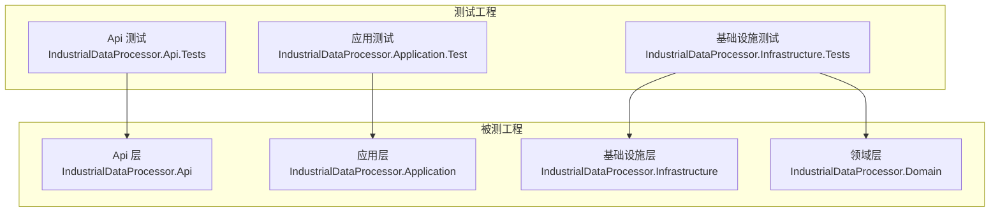
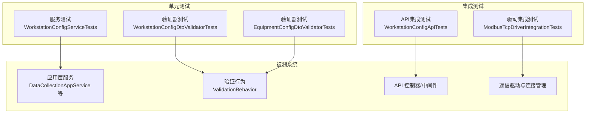
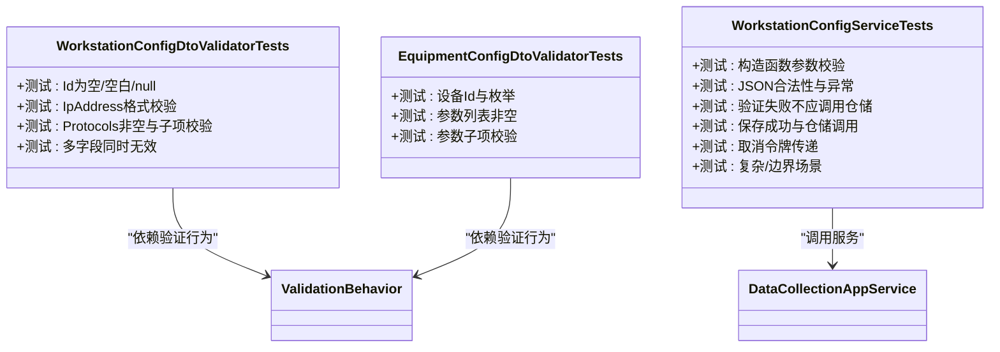
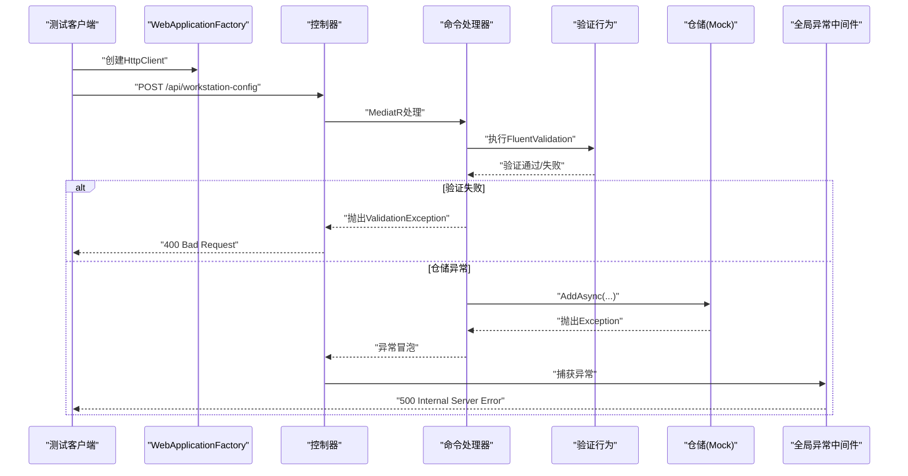
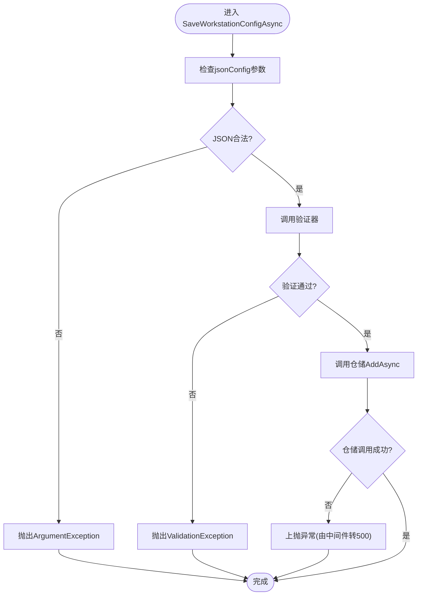
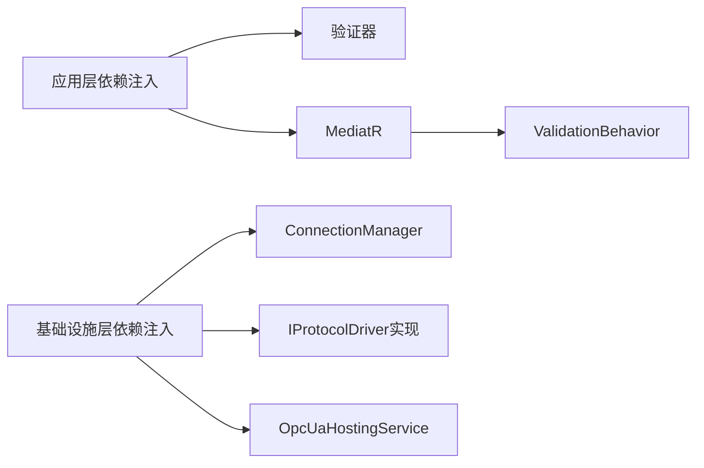

# 测试策略

<cite>
**本文引用的文件**   
- [IndustrialDataProcessor.Api.Tests.csproj](file://IndustrialDataSolution/IndustrialDataProcessor.Api.Tests/IndustrialDataProcessor.Api.Tests.csproj)
- [IndustrialDataProcessor.Application.Tests.csproj](file://IndustrialDataSolution/IndustrialDataProcessor.Application.Test/IndustrialDataProcessor.Application.Tests.csproj)
- [IndustrialDataProcessor.Infrastructure.Tests.csproj](file://IndustrialDataSolution/IndustrialDataProcessor.Infrastructure.Tests/IndustrialDataProcessor.Infrastructure.Tests.csproj)
- [WorkstationConfigApiTests.cs](file://IndustrialDataSolution/IndustrialDataProcessor.Api.Tests/Integration/WorkstationConfigApiTests.cs)
- [WorkstationConfigServiceTests.cs](file://IndustrialDataSolution/IndustrialDataProcessor.Application.Test/Services/WorkstationConfigServiceTests.cs)
- [ModbusTcpDriverIntegrationTests.cs](file://IndustrialDataSolution/IndustrialDataProcessor.Infrastructure.Tests/Integration/ModbusTcpDriverIntegrationTests.cs)
- [EquipmentConfigDtoValidatorTests.cs](file://IndustrialDataSolution/IndustrialDataProcessor.Application.Test/Validators/EquipmentConfigDtoValidatorTests.cs)
- [WorkstationConfigDtoValidatorTests.cs](file://IndustrialDataSolution/IndustrialDataProcessor.Application.Test/Validators/WorkstationConfigDtoValidatorTests.cs)
- [ValidationBehavior.cs](file://IndustrialDataSolution/IndustrialDataProcessor.Application/Behaviors/ValidationBehavior.cs)
- [SaveWorkstationConfigCommand.cs](file://IndustrialDataSolution/IndustrialDataProcessor.Application/Commands/SaveWorkstationConfigCommand.cs)
- [SaveWorkstationConfigCommandValidator.cs](file://IndustrialDataSolution/IndustrialDataProcessor.Application/Validators/SaveWorkstationConfigCommandValidator.cs)
- [DependencyInjection.cs（应用层）](file://IndustrialDataSolution/IndustrialDataProcessor.Application/DependencyInjection.cs)
- [DependencyInjection.cs（基础设施层）](file://IndustrialDataSolution/IndustrialDataProcessor.Infrastructure/DependencyInjection.cs)
- [appsettings.Development.json（API）](file://IndustrialDataSolution/IndustrialDataProcessor.Api/appsettings.Development.json)
- [launchSettings.json（API）](file://IndustrialDataSolution/IndustrialDataProcessor.Api/Properties/launchSettings.json)
- [launchSettings.json（模拟器）](file://IndustrialDataSolution/IndustrialDataProcessor.Simulator/Properties/launchSettings.json)
</cite>

## 目录
1. [引言](#引言)
2. [项目结构](#项目结构)
3. [核心组件](#核心组件)
4. [架构总览](#架构总览)
5. [详细组件分析](#详细组件分析)
6. [依赖关系分析](#依赖关系分析)
7. [性能考虑](#性能考虑)
8. [故障排查指南](#故障排查指南)
9. [结论](#结论)
10. [附录](#附录)

## 引言
本文件面向DDD工业数据处理解决方案，构建一套完整的测试策略文档，覆盖测试金字塔的三层：单元测试、集成测试与端到端测试。重点阐述：
- 测试框架与工具选型（xUnit、Moq、FluentAssertions、TestContainers）
- 单元测试设计原则与用例组织
- 集成测试设计（API、通信驱动、外部系统）
- 测试数据管理（生成、隔离、环境）
- 性能与压力测试方案
- 测试自动化与CI配置要点
- 测试覆盖率与质量度量
- 具体测试用例路径与最佳实践

## 项目结构
项目采用多项目分层结构，测试工程与被测工程一一对应，分别位于：
- API 层测试：IndustrialDataProcessor.Api.Tests
- 应用层测试：IndustrialDataProcessor.Application.Test
- 基础设施层测试：IndustrialDataProcessor.Infrastructure.Tests

各测试工程均引用对应的被测工程，并引入必要的测试SDK、断言库、模拟框架与容器化依赖。

**图表来源**
- [IndustrialDataProcessor.Api.Tests.csproj](file://IndustrialDataSolution/IndustrialDataProcessor.Api.Tests/IndustrialDataProcessor.Api.Tests.csproj#L29-L31)
- [IndustrialDataProcessor.Application.Tests.csproj](file://IndustrialDataSolution/IndustrialDataProcessor.Application.Test/IndustrialDataProcessor.Application.Tests.csproj#L26-L28)
- [IndustrialDataProcessor.Infrastructure.Tests.csproj](file://IndustrialDataSolution/IndustrialDataProcessor.Infrastructure.Tests/IndustrialDataProcessor.Infrastructure.Tests.csproj#L27-L30)

**章节来源**
- [IndustrialDataProcessor.Api.Tests.csproj](file://IndustrialDataSolution/IndustrialDataProcessor.Api.Tests/IndustrialDataProcessor.Api.Tests.csproj#L1-L37)
- [IndustrialDataProcessor.Application.Tests.csproj](file://IndustrialDataSolution/IndustrialDataProcessor.Application.Test/IndustrialDataProcessor.Application.Tests.csproj#L1-L34)
- [IndustrialDataProcessor.Infrastructure.Tests.csproj](file://IndustrialDataSolution/IndustrialDataProcessor.Infrastructure.Tests/IndustrialDataProcessor.Infrastructure.Tests.csproj#L1-L36)

## 核心组件
- 单元测试（应用层与验证器）
  - 验证器测试：覆盖DTO字段、枚举、集合与嵌套结构的验证规则
  - 服务测试：覆盖构造函数参数校验、参数合法性、异常传播、取消令牌传递、复杂场景与边界条件
- 集成测试（API与基础设施）
  - API集成测试：基于WebApplicationFactory进行端到端HTTP请求验证，含异常与边界场景
  - 驱动集成测试：基于TestContainers与本地虚拟Modbus服务，验证连接复用、并发安全与读取正确性
- 测试工具链
  - xUnit v3、xUnit.VisualStudio、Microsoft.NET.Test.Sdk
  - Moq用于依赖注入与外部依赖模拟
  - FluentAssertions用于断言链式表达
  - TestContainers用于PostgreSQL容器化集成测试（已引入）

**章节来源**
- [WorkstationConfigDtoValidatorTests.cs](file://IndustrialDataSolution/IndustrialDataProcessor.Application.Test/Validators/WorkstationConfigDtoValidatorTests.cs#L1-L488)
- [EquipmentConfigDtoValidatorTests.cs](file://IndustrialDataSolution/IndustrialDataProcessor.Application.Test/Validators/EquipmentConfigDtoValidatorTests.cs#L1-L359)
- [WorkstationConfigServiceTests.cs](file://IndustrialDataSolution/IndustrialDataProcessor.Application.Test/Services/WorkstationConfigServiceTests.cs#L1-L643)
- [WorkstationConfigApiTests.cs](file://IndustrialDataSolution/IndustrialDataProcessor.Api.Tests/Integration/WorkstationConfigApiTests.cs#L1-L313)
- [ModbusTcpDriverIntegrationTests.cs](file://IndustrialDataSolution/IndustrialDataProcessor.Infrastructure.Tests/Integration/ModbusTcpDriverIntegrationTests.cs#L1-L118)

## 架构总览
测试金字塔在本项目中的落地体现：
- 单元测试：验证应用层服务与验证器的行为，确保业务规则与边界条件正确
- 集成测试：验证API端到端流程与基础设施通信驱动，确保跨模块协作稳定
- 端到端测试：通过WebApplicationFactory对真实路由与中间件进行验证

**图表来源**
- [ValidationBehavior.cs](file://IndustrialDataSolution/IndustrialDataProcessor.Application/Behaviors/ValidationBehavior.cs#L9-L30)
- [SaveWorkstationConfigCommand.cs](file://IndustrialDataSolution/IndustrialDataProcessor.Application/Commands/SaveWorkstationConfigCommand.cs#L7-L9)
- [SaveWorkstationConfigCommandValidator.cs](file://IndustrialDataSolution/IndustrialDataProcessor.Application/Validators/SaveWorkstationConfigCommandValidator.cs#L6-L12)
- [WorkstationConfigServiceTests.cs](file://IndustrialDataSolution/IndustrialDataProcessor.Application.Test/Services/WorkstationConfigServiceTests.cs#L14-L27)
- [WorkstationConfigApiTests.cs](file://IndustrialDataSolution/IndustrialDataProcessor.Api.Tests/Integration/WorkstationConfigApiTests.cs#L15-L26)
- [ModbusTcpDriverIntegrationTests.cs](file://IndustrialDataSolution/IndustrialDataProcessor.Infrastructure.Tests/Integration/ModbusTcpDriverIntegrationTests.cs#L13-L42)

## 详细组件分析

### 单元测试：验证器与服务
- 验证器测试（WorkstationConfigDtoValidatorTests）
  - 覆盖工作站ID、IP地址格式、协议列表非空、协议字段有效性、嵌套设备与参数的验证
  - 使用FluentValidation.TestHelper进行断言，覆盖多字段同时无效的场景
- 验证器测试（EquipmentConfigDtoValidatorTests）
  - 覆盖设备ID、枚举值、参数列表非空、参数子项（标签、地址、数据类型、周期、数值范围、协议必填字段）等
- 服务测试（WorkstationConfigServiceTests）
  - 构造函数参数校验、JSON合法性与反序列化异常、验证失败与成功分支、仓储调用次数与参数、取消令牌传递、复杂/边界场景

**图表来源**
- [WorkstationConfigDtoValidatorTests.cs](file://IndustrialDataSolution/IndustrialDataProcessor.Application.Test/Validators/WorkstationConfigDtoValidatorTests.cs#L10-L17)
- [EquipmentConfigDtoValidatorTests.cs](file://IndustrialDataSolution/IndustrialDataProcessor.Application.Test/Validators/EquipmentConfigDtoValidatorTests.cs#L9-L16)
- [WorkstationConfigServiceTests.cs](file://IndustrialDataSolution/IndustrialDataProcessor.Application.Test/Services/WorkstationConfigServiceTests.cs#L14-L27)

**章节来源**
- [WorkstationConfigDtoValidatorTests.cs](file://IndustrialDataSolution/IndustrialDataProcessor.Application.Test/Validators/WorkstationConfigDtoValidatorTests.cs#L19-L363)
- [EquipmentConfigDtoValidatorTests.cs](file://IndustrialDataSolution/IndustrialDataProcessor.Application.Test/Validators/EquipmentConfigDtoValidatorTests.cs#L18-L359)
- [WorkstationConfigServiceTests.cs](file://IndustrialDataSolution/IndustrialDataProcessor.Application.Test/Services/WorkstationConfigServiceTests.cs#L29-L458)

### 集成测试：API与通信驱动
- API集成测试（WorkstationConfigApiTests）
  - 使用WebApplicationFactory创建HttpClient，对控制器端点进行POST请求
  - 验证正常流程（200 OK）、模型验证失败（400 Bad Request）、异常处理（500 Internal Server Error）
  - 通过替换DI容器中的仓储为Mock，验证异常路径与全局异常中间件输出格式
- 驱动集成测试（ModbusTcpDriverIntegrationTests）
  - 使用TestContainers或本地虚拟Modbus服务，验证连接复用、驱动读取正确性与并发安全性
  - 并发场景下确保底层锁机制保障不报错且数据正确

**图表来源**
- [WorkstationConfigApiTests.cs](file://IndustrialDataSolution/IndustrialDataProcessor.Api.Tests/Integration/WorkstationConfigApiTests.cs#L15-L312)
- [ValidationBehavior.cs](file://IndustrialDataSolution/IndustrialDataProcessor.Application/Behaviors/ValidationBehavior.cs#L9-L30)
- [SaveWorkstationConfigCommandValidator.cs](file://IndustrialDataSolution/IndustrialDataProcessor.Application/Validators/SaveWorkstationConfigCommandValidator.cs#L6-L12)

**章节来源**
- [WorkstationConfigApiTests.cs](file://IndustrialDataSolution/IndustrialDataProcessor.Api.Tests/Integration/WorkstationConfigApiTests.cs#L14-L312)
- [ModbusTcpDriverIntegrationTests.cs](file://IndustrialDataSolution/IndustrialDataProcessor.Infrastructure.Tests/Integration/ModbusTcpDriverIntegrationTests.cs#L12-L118)

### 复杂逻辑流程图：服务保存配置

**图表来源**
- [WorkstationConfigServiceTests.cs](file://IndustrialDataSolution/IndustrialDataProcessor.Application.Test/Services/WorkstationConfigServiceTests.cs#L68-L138)
- [WorkstationConfigServiceTests.cs](file://IndustrialDataSolution/IndustrialDataProcessor.Application.Test/Services/WorkstationConfigServiceTests.cs#L207-L283)

**章节来源**
- [WorkstationConfigServiceTests.cs](file://IndustrialDataSolution/IndustrialDataProcessor.Application.Test/Services/WorkstationConfigServiceTests.cs#L68-L138)
- [WorkstationConfigServiceTests.cs](file://IndustrialDataSolution/IndustrialDataProcessor.Application.Test/Services/WorkstationConfigServiceTests.cs#L207-L283)

## 依赖关系分析
- 应用层依赖注入
  - 注册验证器、MediatR与全局验证行为，确保命令进入处理器前统一验证
- 基础设施层依赖注入
  - 注册连接管理器、驱动实现、OPC UA托管服务、序列化选项等
- 测试工程依赖
  - Api测试工程引入Microsoft.AspNetCore.Mvc.Testing与Testcontainers.PostgreSql
  - Application与Infrastructure测试工程引入Moq、FluentAssertions与xUnit

**图表来源**
- [DependencyInjection.cs（应用层）](file://IndustrialDataSolution/IndustrialDataProcessor.Application/DependencyInjection.cs#L16-L39)
- [DependencyInjection.cs（基础设施层）](file://IndustrialDataSolution/IndustrialDataProcessor.Infrastructure/DependencyInjection.cs#L17-L81)

**章节来源**
- [DependencyInjection.cs（应用层）](file://IndustrialDataSolution/IndustrialDataProcessor.Application/DependencyInjection.cs#L16-L39)
- [DependencyInjection.cs（基础设施层）](file://IndustrialDataSolution/IndustrialDataProcessor.Infrastructure/DependencyInjection.cs#L17-L81)

## 性能考虑
- 数据采集性能
  - 服务层记录每个点位与请求的耗时，便于定位慢点位与慢请求
- 并发与稳定性
  - 驱动集成测试包含并发读取场景，验证底层锁与并发安全
- 压力测试建议
  - 使用xUnit并行执行能力与第三方压测工具（如K6、JMeter）对API端点进行并发与吞吐测试
  - 结合容器化环境（TestContainers）对数据库与外部系统进行压力验证

**章节来源**
- [DataCollectionAppService.cs](file://IndustrialDataSolution/IndustrialDataProcessor.Application/Services/DataCollectionAppService.cs#L124-L150)
- [ModbusTcpDriverIntegrationTests.cs](file://IndustrialDataSolution/IndustrialDataProcessor.Infrastructure.Tests/Integration/ModbusTcpDriverIntegrationTests.cs#L89-L116)

## 故障排查指南
- API异常处理
  - 通过替换仓储为Mock，验证500错误路径与全局异常中间件输出格式
- 验证失败路径
  - 通过验证器测试与服务测试，确认异常消息与调用次数符合预期
- 环境与配置
  - 开发环境日志级别与启动配置，便于定位问题

**章节来源**
- [WorkstationConfigApiTests.cs](file://IndustrialDataSolution/IndustrialDataProcessor.Api.Tests/Integration/WorkstationConfigApiTests.cs#L273-L311)
- [appsettings.Development.json（API）](file://IndustrialDataSolution/IndustrialDataProcessor.Api/appsettings.Development.json#L1-L8)
- [launchSettings.json（API）](file://IndustrialDataSolution/IndustrialDataProcessor.Api/Properties/launchSettings.json#L1-L31)
- [launchSettings.json（模拟器）](file://IndustrialDataSolution/IndustrialDataProcessor.Simulator/Properties/launchSettings.json#L1-L12)

## 结论
本测试策略以测试金字塔为核心，结合xUnit、Moq、FluentAssertions与TestContainers，覆盖从验证器到服务、从API到通信驱动的全栈测试。通过清晰的测试用例组织与依赖注入约束，确保业务规则、边界条件与跨模块协作的稳定性。建议在CI中启用并行执行、覆盖率统计与质量门禁，持续提升测试效率与质量。

## 附录
- 测试用例示例路径
  - 验证器：[WorkstationConfigDtoValidatorTests.cs](file://IndustrialDataSolution/IndustrialDataProcessor.Application.Test/Validators/WorkstationConfigDtoValidatorTests.cs#L20-L322)
  - 验证器：[EquipmentConfigDtoValidatorTests.cs](file://IndustrialDataSolution/IndustrialDataProcessor.Application.Test/Validators/EquipmentConfigDtoValidatorTests.cs#L18-L278)
  - 服务：[WorkstationConfigServiceTests.cs](file://IndustrialDataSolution/IndustrialDataProcessor.Application.Test/Services/WorkstationConfigServiceTests.cs#L68-L283)
  - API集成：[WorkstationConfigApiTests.cs](file://IndustrialDataSolution/IndustrialDataProcessor.Api.Tests/Integration/WorkstationConfigApiTests.cs#L84-L311)
  - 驱动集成：[ModbusTcpDriverIntegrationTests.cs](file://IndustrialDataSolution/IndustrialDataProcessor.Infrastructure.Tests/Integration/ModbusTcpDriverIntegrationTests.cs#L44-L116)
- 测试框架与工具
  - [IndustrialDataProcessor.Api.Tests.csproj](file://IndustrialDataSolution/IndustrialDataProcessor.Api.Tests/IndustrialDataProcessor.Api.Tests.csproj#L12-L26)
  - [IndustrialDataProcessor.Application.Tests.csproj](file://IndustrialDataSolution/IndustrialDataProcessor.Application.Test/IndustrialDataProcessor.Application.Tests.csproj#L12-L18)
  - [IndustrialDataProcessor.Infrastructure.Tests.csproj](file://IndustrialDataSolution/IndustrialDataProcessor.Infrastructure.Tests/IndustrialDataProcessor.Infrastructure.Tests.csproj#L12-L19)