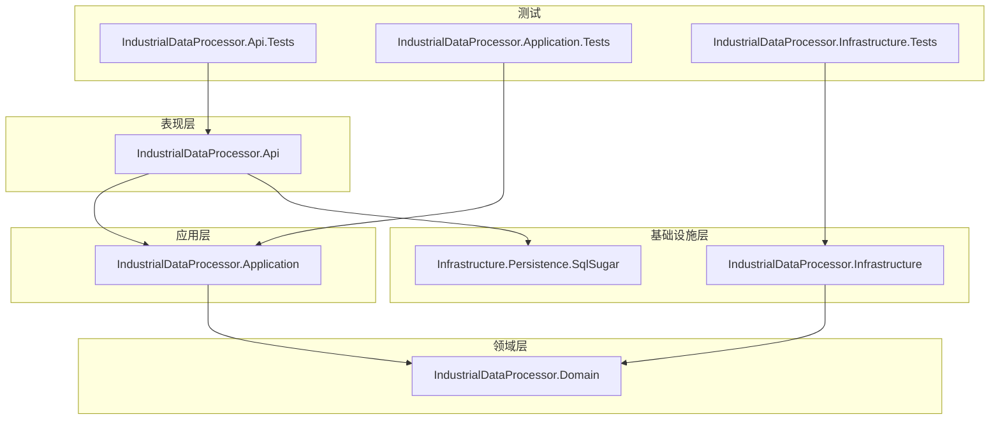
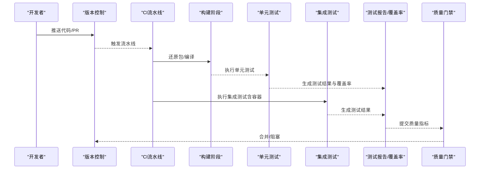
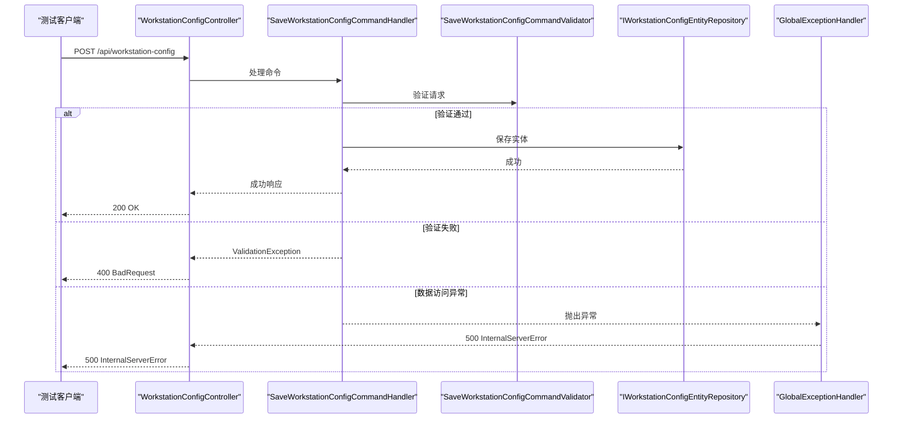
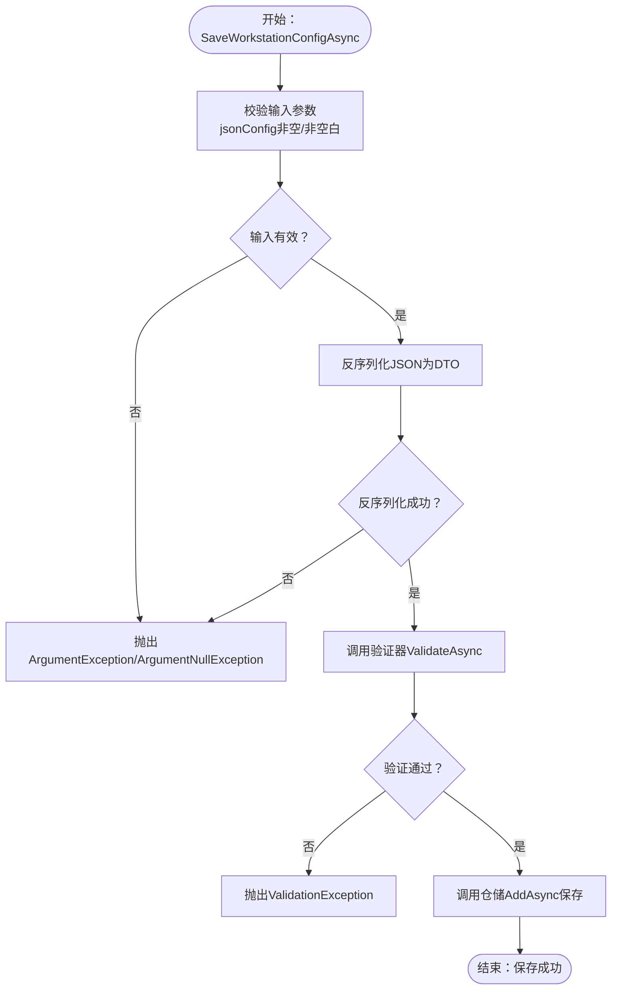
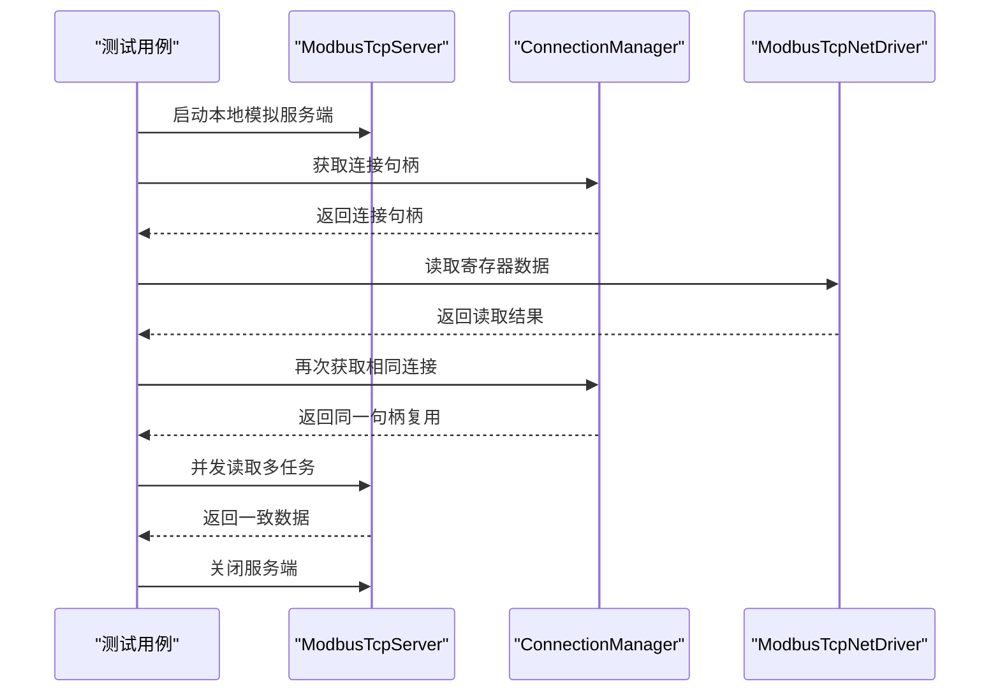
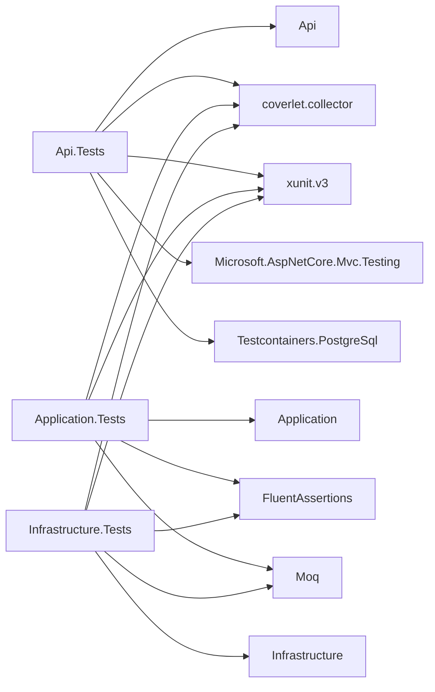

# 测试自动化与持续集成

<cite>
**本文引用的文件**
- [IndustrialDataProcessor.Api.Tests.csproj](file://IndustrialDataSolution/IndustrialDataProcessor.Api.Tests/IndustrialDataProcessor.Api.Tests.csproj)
- [IndustrialDataProcessor.Infrastructure.Tests.csproj](file://IndustrialDataSolution/IndustrialDataProcessor.Infrastructure.Tests/IndustrialDataProcessor.Infrastructure.Tests.csproj)
- [IndustrialDataProcessor.Api.csproj](file://IndustrialDataSolution/IndustrialDataProcessor.Api/IndustrialDataProcessor.Api.csproj)
- [IndustrialDataProcessor.Application.csproj](file://IndustrialDataSolution/IndustrialDataProcessor.Application/IndustrialDataProcessor.Application.csproj)
- [IndustrialDataProcessor.Infrastructure.csproj](file://IndustrialDataSolution/IndustrialDataProcessor.Infrastructure/IndustrialDataProcessor.Infrastructure.csproj)
- [WorkstationConfigApiTests.cs](file://IndustrialDataSolution/IndustrialDataProcessor.Api.Tests/Integration/WorkstationConfigApiTests.cs)
- [WorkstationConfigServiceTests.cs](file://IndustrialDataSolution/IndustrialDataProcessor.Application.Test/Services/WorkstationConfigServiceTests.cs)
- [ModbusTcpDriverIntegrationTests.cs](file://IndustrialDataSolution/IndustrialDataProcessor.Infrastructure.Tests/Integration/ModbusTcpDriverIntegrationTests.cs)
- [appsettings.json](file://IndustrialDataSolution/IndustrialDataProcessor.Api/appsettings.json)
- [appsettings.Development.json](file://IndustrialDataSolution/IndustrialDataProcessor.Api/appsettings.Development.json)
</cite>

## 目录
1. [引言](#引言)
2. [项目结构](#项目结构)
3. [核心组件](#核心组件)
4. [架构总览](#架构总览)
5. [详细组件分析](#详细组件分析)
6. [依赖关系分析](#依赖关系分析)
7. [性能考虑](#性能考虑)
8. [故障排查指南](#故障排查指南)
9. [结论](#结论)
10. [附录](#附录)

## 引言
本文件面向DDD工业数据处理解决方案，系统性阐述测试自动化与持续集成（CI/CD）的配置与实施要点，覆盖以下主题：
- CI/CD流水线设计与实现：测试自动化的配置、构建触发器与测试报告生成
- 测试执行策略：并行测试、测试分组与优先级设定
- 测试报告与质量度量：覆盖率、性能与质量指标收集
- 测试环境管理：测试数据库准备、测试数据清理与测试容器配置
- 平台示例：Azure DevOps、GitHub Actions等CI平台的配置思路
- 质量门禁、失败处理与最佳实践

## 项目结构
该项目采用多项目解决方案，按领域分层组织，便于分别进行单元测试、集成测试与API测试：
- 表现层：IndustrialDataProcessor.Api（ASP.NET Core Web API）
- 应用层：IndustrialDataProcessor.Application（命令、验证、事件、服务等）
- 领域层：IndustrialDataProcessor.Domain（实体、枚举、接口、异常等）
- 基础设施层：IndustrialDataProcessor.Infrastructure（通信驱动、连接管理、OPC UA、存储适配等）
- 测试项目：
  - IndustrialDataProcessor.Api.Tests（API集成测试）
  - IndustrialDataProcessor.Application.Tests（应用层服务与验证测试）
  - IndustrialDataProcessor.Infrastructure.Tests（基础设施集成测试）

图表来源
- [IndustrialDataProcessor.Api.csproj](file://IndustrialDataSolution/IndustrialDataProcessor.Api/IndustrialDataProcessor.Api.csproj#L1-L21)
- [IndustrialDataProcessor.Application.csproj](file://IndustrialDataSolution/IndustrialDataProcessor.Application/IndustrialDataProcessor.Application.csproj#L1-L23)
- [IndustrialDataProcessor.Infrastructure.csproj](file://IndustrialDataSolution/IndustrialDataProcessor.Infrastructure/IndustrialDataProcessor.Infrastructure.csproj#L1-L33)
- [IndustrialDataProcessor.Api.Tests.csproj](file://IndustrialDataSolution/IndustrialDataProcessor.Api.Tests/IndustrialDataProcessor.Api.Tests.csproj#L1-L38)
- [IndustrialDataProcessor.Application.Test.csproj](file://IndustrialDataSolution/IndustrialDataProcessor.Application.Test/IndustrialDataProcessor.Application.Tests.csproj#L1-L37)
- [IndustrialDataProcessor.Infrastructure.Tests.csproj](file://IndustrialDataSolution/IndustrialDataProcessor.Infrastructure.Tests/IndustrialDataProcessor.Infrastructure.Tests.csproj#L1-L37)

章节来源
- [IndustrialDataProcessor.Api.csproj](file://IndustrialDataSolution/IndustrialDataProcessor.Api/IndustrialDataProcessor.Api.csproj#L1-L21)
- [IndustrialDataProcessor.Application.csproj](file://IndustrialDataSolution/IndustrialDataProcessor.Application/IndustrialDataProcessor.Application.csproj#L1-L23)
- [IndustrialDataProcessor.Infrastructure.csproj](file://IndustrialDataSolution/IndustrialDataProcessor.Infrastructure/IndustrialDataProcessor.Infrastructure.csproj#L1-L33)
- [IndustrialDataProcessor.Api.Tests.csproj](file://IndustrialDataSolution/IndustrialDataProcessor.Api.Tests/IndustrialDataProcessor.Api.Tests.csproj#L1-L38)
- [IndustrialDataProcessor.Infrastructure.Tests.csproj](file://IndustrialDataSolution/IndustrialDataProcessor.Infrastructure.Tests/IndustrialDataProcessor.Infrastructure.Tests.csproj#L1-L37)

## 核心组件
- 测试框架与工具
  - 单元测试：xUnit v3（含xunit.v3包）、FluentAssertions、Moq
  - 集成测试：Microsoft.AspNetCore.Mvc.Testing（WebApplicationFactory）
  - 覆盖率：coverlet.collector（用于生成覆盖率报告）
  - 容器化测试：Testcontainers.PostgreSql（用于PostgreSQL容器）
- 项目依赖与测试目标
  - 测试项目标记为测试项目（IsTestProject），目标框架为.NET 8
  - 测试项目引用被测项目，确保可编译与可测试

章节来源
- [IndustrialDataProcessor.Api.Tests.csproj](file://IndustrialDataSolution/IndustrialDataProcessor.Api.Tests/IndustrialDataProcessor.Api.Tests.csproj#L1-L38)
- [IndustrialDataProcessor.Infrastructure.Tests.csproj](file://IndustrialDataSolution/IndustrialDataProcessor.Infrastructure.Tests/IndustrialDataProcessor.Infrastructure.Tests.csproj#L1-L37)

## 架构总览
下图展示了测试自动化在CI中的总体流程：代码提交触发构建，执行单元/集成测试，生成覆盖率与测试报告，并根据质量门禁决定是否合并。

## 详细组件分析

### API集成测试（WorkstationConfigApiTests）
- 目标：验证API端点在不同输入下的行为，包括正常流程、参数校验失败、异常与边界情况
- 关键特性
  - 使用WebApplicationFactory创建测试主机，避免真实部署
  - 使用HttpClient对/api/workstation-config进行POST请求
  - 使用FluentAssertions与断言库进行响应断言
  - 使用Mock替换仓储以模拟数据库异常，验证500错误路径
- 测试分组与优先级
  - 使用Trait进行分组（如Integration），便于筛选运行
  - 优先级建议：参数校验失败 > 正常流程 > 异常处理 > 边界情况
- 并行执行
  - 建议按测试类隔离，避免共享状态；必要时使用Fact/Skipped组合控制并行

图表来源
- [WorkstationConfigApiTests.cs](file://IndustrialDataSolution/IndustrialDataProcessor.Api.Tests/Integration/WorkstationConfigApiTests.cs#L1-L313)

章节来源
- [WorkstationConfigApiTests.cs](file://IndustrialDataSolution/IndustrialDataProcessor.Api.Tests/Integration/WorkstationConfigApiTests.cs#L1-L313)

### 应用层服务测试（WorkstationConfigServiceTests）
- 目标：验证服务层的参数校验、JSON反序列化、验证失败与成功保存、取消令牌传递、复杂场景与边界条件
- 关键特性
  - 使用Moq模拟仓储与验证器，隔离外部依赖
  - 验证验证器仅调用一次、取消令牌正确传递
  - 验证保存的JSON可反序列化，确保数据一致性
- 测试分组与优先级
  - 分组：UnitTests + 具体服务名称
  - 优先级：构造函数与参数校验 > JSON反序列化 > 验证失败 > 成功保存 > 取消令牌 > 复杂/边界场景
- 并行执行
  - 每个测试独立构造Mock，天然支持并行

图表来源
- [WorkstationConfigServiceTests.cs](file://IndustrialDataSolution/IndustrialDataProcessor.Application.Test/Services/WorkstationConfigServiceTests.cs#L1-L643)

章节来源
- [WorkstationConfigServiceTests.cs](file://IndustrialDataSolution/IndustrialDataProcessor.Application.Test/Services/WorkstationConfigServiceTests.cs#L1-L643)

### 基础设施集成测试（ModbusTcpDriverIntegrationTests）
- 目标：验证通信驱动与连接管理在真实网络环境下的行为，包括连接复用、并发安全与数据读取
- 关键特性
  - 使用HslCommunication的ModbusTcpServer作为本地模拟服务端
  - 使用ConnectionManager复用连接句柄
  - 使用并发任务验证底层锁与并发安全性
- 测试分组与优先级
  - 分组：Integration + 具体模块（如ModbusTcpDriver）
  - 优先级：连接复用 > 数据读取 > 并发安全
- 并行执行
  - 建议每个测试独立启动/关闭模拟服务端，避免端口冲突

图表来源
- [ModbusTcpDriverIntegrationTests.cs](file://IndustrialDataSolution/IndustrialDataProcessor.Infrastructure.Tests/Integration/ModbusTcpDriverIntegrationTests.cs#L1-L118)

章节来源
- [ModbusTcpDriverIntegrationTests.cs](file://IndustrialDataSolution/IndustrialDataProcessor.Infrastructure.Tests/Integration/ModbusTcpDriverIntegrationTests.cs#L1-L118)

### 测试环境管理
- 测试数据库准备
  - 使用Testcontainers.PostgreSql启动PostgreSQL容器，确保测试数据库隔离与可重复
  - 在appsettings.json中配置连接字符串，开发环境与测试环境可分离
- 测试数据清理
  - 建议在测试类/测试集级别使用事务回滚或删除测试数据，避免污染
- 测试容器配置
  - 通过容器镜像版本固定与卷挂载，确保跨平台一致性
  - 为模拟服务（如ModbusTcpServer）准备独立端口，避免冲突

章节来源
- [IndustrialDataProcessor.Api.Tests.csproj](file://IndustrialDataSolution/IndustrialDataProcessor.Api.Tests/IndustrialDataProcessor.Api.Tests.csproj#L21-L21)
- [appsettings.json](file://IndustrialDataSolution/IndustrialDataProcessor.Api/appsettings.json#L10-L12)
- [appsettings.Development.json](file://IndustrialDataSolution/IndustrialDataProcessor.Api/appsettings.Development.json#L1-L9)

## 依赖关系分析
- 测试项目与被测项目的依赖关系清晰：测试项目引用被测项目，便于在CI中统一构建与测试
- 测试项目引入的NuGet包涵盖测试框架、断言、Mock、覆盖率与容器化能力

图表来源
- [IndustrialDataProcessor.Api.Tests.csproj](file://IndustrialDataSolution/IndustrialDataProcessor.Api.Tests/IndustrialDataProcessor.Api.Tests.csproj#L1-L38)
- [IndustrialDataProcessor.Infrastructure.Tests.csproj](file://IndustrialDataSolution/IndustrialDataProcessor.Infrastructure.Tests/IndustrialDataProcessor.Infrastructure.Tests.csproj#L1-L37)

章节来源
- [IndustrialDataProcessor.Api.Tests.csproj](file://IndustrialDataSolution/IndustrialDataProcessor.Api.Tests/IndustrialDataProcessor.Api.Tests.csproj#L1-L38)
- [IndustrialDataProcessor.Infrastructure.Tests.csproj](file://IndustrialDataSolution/IndustrialDataProcessor.Infrastructure.Tests/IndustrialDataProcessor.Infrastructure.Tests.csproj#L1-L37)

## 性能考虑
- 测试执行性能
  - 将重资源测试（如容器启动、网络模拟）拆分为独立作业，减少串行等待
  - 使用并行测试运行器，合理分片测试集，缩短总耗时
- 覆盖率与报告
  - 使用coverlet.collector生成XML/Cobertura格式覆盖率报告，便于CI可视化
  - 对关键路径（验证、持久化、异常分支）重点保障覆盖率
- 环境与资源
  - 复用容器与连接，避免重复初始化
  - 控制并发度，避免资源争用导致的不稳定

## 故障排查指南
- 常见问题
  - 测试数据库连接失败：检查连接字符串、容器健康状态与端口映射
  - 并发测试不稳定：确认底层锁与线程安全实现，适当降低并发度
  - 覆盖率缺失：确认coverlet.collector已正确安装与启用
- 排查步骤
  - 在本地复现测试，逐步缩小范围
  - 查看测试日志与异常堆栈，定位具体断言失败点
  - 对比不同平台（Windows/Linux/容器）差异，统一环境变量与依赖版本

## 结论
本方案通过明确的测试分层、完善的测试工具链与可重复的测试环境，实现了高覆盖率与高可靠性的测试自动化。结合CI平台的并行执行与质量门禁，能够稳定支撑持续交付与发布。

## 附录

### CI/CD流水线设计与实现（概念性说明）
- 触发器
  - 主干推送：全量测试
  - PR触发：增量测试（按变更模块选择测试集）
- 阶段划分
  - 构建：还原包、编译、打包
  - 单元测试：执行Application层与基础设施层单元测试
  - 集成测试：执行API与通信驱动集成测试（含容器）
  - 质量门禁：覆盖率阈值、测试失败数、性能回归阈值
  - 报告：生成测试报告与覆盖率报告，上传Artifacts
- 并行策略
  - 将测试集按模块分片并行执行，减少总耗时
  - 对共享资源（数据库、端口）加锁或隔离

### Azure DevOps配置要点（概念性说明）
- YAML流水线
  - 使用dotnet restore/build/test矩阵并行
  - 使用Container作业运行PostgreSQL容器
  - 使用PublishTestResults与PublishCodeCoverage任务输出报告
- 质量门禁
  - 在“检查”中配置覆盖率与测试失败阈值
- 变量组
  - 将连接字符串与授权码放入受保护变量组

### GitHub Actions配置要点（概念性说明）
- 工作流
  - 使用actions/checkout与setup-dotnet
  - 使用docker://postgres启动测试数据库
  - 使用dotnet test与code coverage工具输出报告
- 缓存与并发
  - 启用dotnet cache与GITHUB_TOKEN缓存
  - 使用concurrency group限制同一PR并发

### 测试报告与质量度量
- 测试报告
  - 使用xUnit XML输出，结合CI平台的测试结果展示
- 覆盖率
  - 使用coverlet.collector生成Cobertura/XML格式，上传至CI平台覆盖率视图
- 性能报告
  - 对关键API与驱动读取场景添加基准测试，记录延迟与吞吐
- 质量度量
  - 失败用例数、阻塞分支覆盖率、平均测试时长、容器启动时间

### 测试质量门禁与失败处理
- 门禁规则
  - 覆盖率阈值（如语句覆盖率≥80%）
  - 测试失败数≤0，新增阻塞分支覆盖率下降不超过阈值
- 失败处理
  - 自动标注PR并附带报告链接
  - 对偶发失败增加重试机制与忽略列表
- 维护最佳实践
  - 保持测试命名与分组规范，便于筛选与并行
  - 定期重构测试，移除冗余与脆弱断言
  - 将关键路径纳入回归测试矩阵