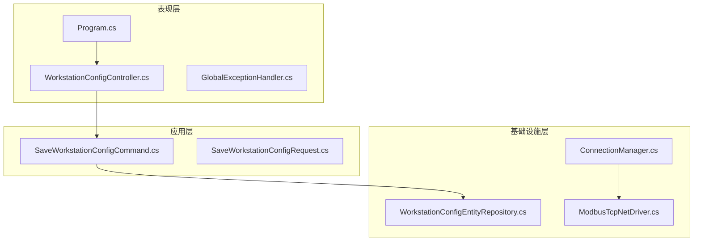
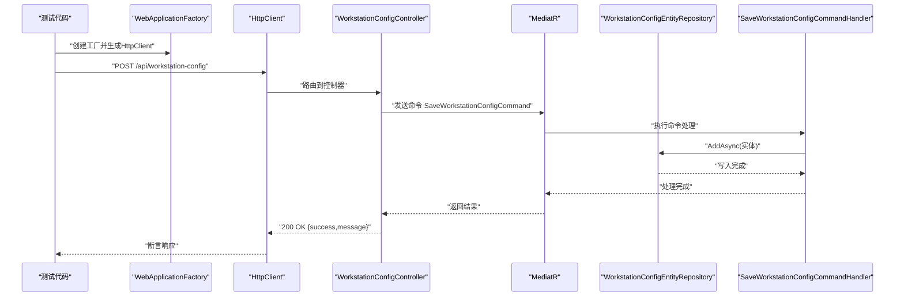
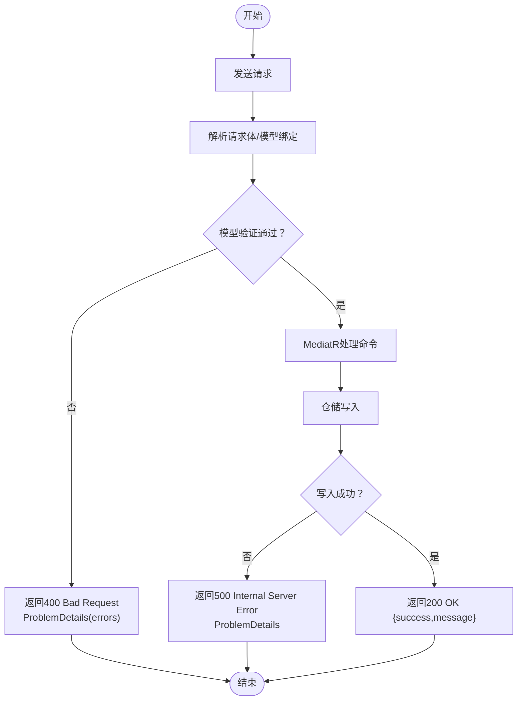
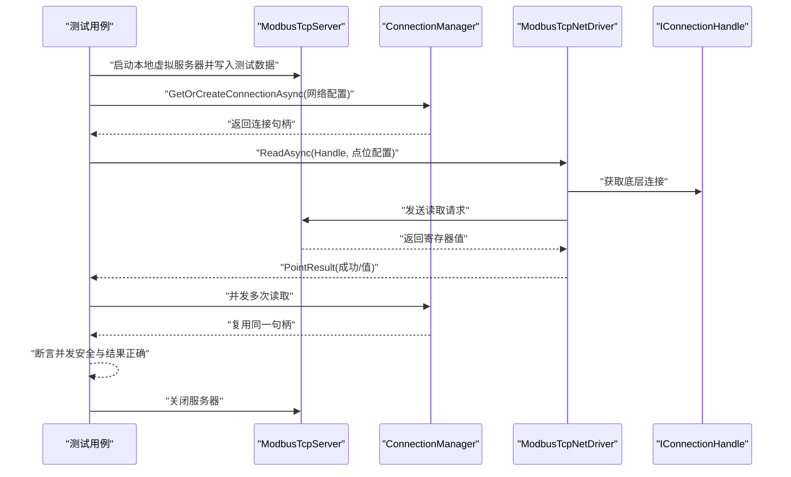
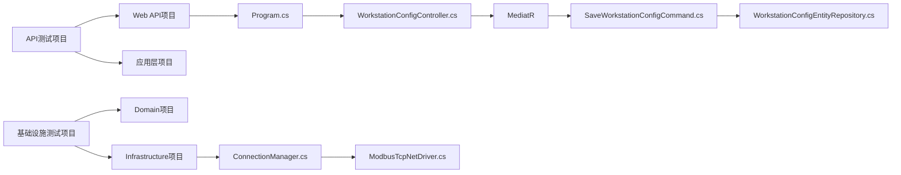

# 集成测试

<cite>
**本文引用的文件**
- [Program.cs](file://IndustrialDataSolution/IndustrialDataProcessor.Api/Program.cs)
- [WorkstationConfigController.cs](file://IndustrialDataSolution/IndustrialDataProcessor.Api/Controllers/WorkstationConfigController.cs)
- [GlobalExceptionHandler.cs](file://IndustrialDataSolution/IndustrialDataProcessor.Api/Middleware/GlobalExceptionHandler.cs)
- [SaveWorkstationConfigCommand.cs](file://IndustrialDataSolution/IndustrialDataProcessor.Application/Commands/SaveWorkstationConfigCommand.cs)
- [SaveWorkstationConfigRequest.cs](file://IndustrialDataSolution/IndustrialDataProcessor.Application/Dtos/SaveWorkstationConfigRequest.cs)
- [WorkstationConfigEntityRepository.cs](file://IndustrialDataSolution/IndustrialDataProcessor.Infrastructure.Persistence.SqlSugar/Repositories/WorkstationConfigEntityRepository.cs)
- [appsettings.json](file://IndustrialDataSolution/IndustrialDataProcessor.Api/appsettings.json)
- [appsettings.Development.json](file://IndustrialDataSolution/IndustrialDataProcessor.Api/appsettings.Development.json)
- [ConnectionManager.cs](file://IndustrialDataSolution/IndustrialDataProcessor.Infrastructure/Communication/Connection/ConnectionManager.cs)
- [ModbusTcpNetDriver.cs](file://IndustrialDataSolution/IndustrialDataProcessor.Infrastructure/Communication/Drivers/TcpCommon/ModbusTcpNetDriver.cs)
- [WorkstationConfigApiTests.cs](file://IndustrialDataSolution/IndustrialDataProcessor.Api.Tests/Integration/WorkstationConfigApiTests.cs)
- [ModbusTcpDriverIntegrationTests.cs](file://IndustrialDataSolution/IndustrialDataProcessor.Infrastructure.Tests/Integration/ModbusTcpDriverIntegrationTests.cs)
- [IndustrialDataProcessor.Api.Tests.csproj](file://IndustrialDataSolution/IndustrialDataProcessor.Api.Tests/IndustrialDataProcessor.Api.Tests.csproj)
- [IndustrialDataProcessor.Infrastructure.Tests.csproj](file://IndustrialDataSolution/IndustrialDataProcessor.Infrastructure.Tests/IndustrialDataProcessor.Infrastructure.Tests.csproj)
</cite>

## 目录
1. [引言](#引言)
2. [项目结构](#项目结构)
3. [核心组件](#核心组件)
4. [架构总览](#架构总览)
5. [详细组件分析](#详细组件分析)
6. [依赖关系分析](#依赖关系分析)
7. [性能考虑](#性能考虑)
8. [故障排查指南](#故障排查指南)
9. [结论](#结论)
10. [附录](#附录)

## 引言
本文件面向DDD工业数据处理解决方案，提供一套完整的集成测试文档，覆盖API集成测试、数据库集成测试与外部系统（工业通信协议）集成测试。重点阐述WebApplicationFactory在测试环境中的使用、依赖注入容器的重写策略、数据库连接的模拟与隔离、API测试的实现要点（请求发送、响应验证、错误处理）、数据库测试策略（测试数据准备、事务管理、一致性验证），以及Modbus TCP驱动集成测试的具体示例与最佳实践。

## 项目结构
该项目采用多项目分层结构，核心模块包括：
- 表现层：ASP.NET Core Web API，负责接收HTTP请求、路由至应用层命令并通过MediatR处理。
- 应用层：封装业务用例、命令与DTO，负责编排业务逻辑与验证。
- 基础设施层：提供通信驱动（含Modbus TCP等）、连接管理、数据持久化（SqlSugar）等。
- 测试项目：分别在API与基础设施层提供集成测试，验证端到端行为。

图表来源
- [Program.cs](file://IndustrialDataSolution/IndustrialDataProcessor.Api/Program.cs#L1-L54)
- [WorkstationConfigController.cs](file://IndustrialDataSolution/IndustrialDataProcessor.Api/Controllers/WorkstationConfigController.cs#L1-L22)
- [GlobalExceptionHandler.cs](file://IndustrialDataSolution/IndustrialDataProcessor.Api/Middleware/GlobalExceptionHandler.cs#L1-L94)
- [SaveWorkstationConfigCommand.cs](file://IndustrialDataSolution/IndustrialDataProcessor.Application/Commands/SaveWorkstationConfigCommand.cs#L1-L9)
- [SaveWorkstationConfigRequest.cs](file://IndustrialDataSolution/IndustrialDataProcessor.Application/Dtos/SaveWorkstationConfigRequest.cs#L1-L12)
- [WorkstationConfigEntityRepository.cs](file://IndustrialDataSolution/IndustrialDataProcessor.Infrastructure.Persistence.SqlSugar/Repositories/WorkstationConfigEntityRepository.cs#L1-L32)
- [ConnectionManager.cs](file://IndustrialDataSolution/IndustrialDataProcessor.Infrastructure/Communication/Connection/ConnectionManager.cs#L1-L396)
- [ModbusTcpNetDriver.cs](file://IndustrialDataSolution/IndustrialDataProcessor.Infrastructure/Communication/Drivers/TcpCommon/ModbusTcpNetDriver.cs#L1-L41)

章节来源
- [Program.cs](file://IndustrialDataSolution/IndustrialDataProcessor.Api/Program.cs#L1-L54)
- [WorkstationConfigController.cs](file://IndustrialDataSolution/IndustrialDataProcessor.Api/Controllers/WorkstationConfigController.cs#L1-L22)
- [SaveWorkstationConfigCommand.cs](file://IndustrialDataSolution/IndustrialDataProcessor.Application/Commands/SaveWorkstationConfigCommand.cs#L1-L9)
- [SaveWorkstationConfigRequest.cs](file://IndustrialDataSolution/IndustrialDataProcessor.Application/Dtos/SaveWorkstationConfigRequest.cs#L1-L12)
- [WorkstationConfigEntityRepository.cs](file://IndustrialDataSolution/IndustrialDataProcessor.Infrastructure.Persistence.SqlSugar/Repositories/WorkstationConfigEntityRepository.cs#L1-L32)
- [ConnectionManager.cs](file://IndustrialDataSolution/IndustrialDataProcessor.Infrastructure/Communication/Connection/ConnectionManager.cs#L1-L396)
- [ModbusTcpNetDriver.cs](file://IndustrialDataSolution/IndustrialDataProcessor.Infrastructure/Communication/Drivers/TcpCommon/ModbusTcpNetDriver.cs#L1-L41)

## 核心组件
- WebApplicationFactory与测试环境
  - 使用Microsoft.AspNetCore.Mvc.Testing提供的WebApplicationFactory<Program>启动最小化主机，创建HttpClient进行端到端测试。
  - 可通过WithWebHostBuilder替换DI容器中的服务实现，以注入Mock或测试替身，实现数据库连接模拟与异常注入。
- API控制器与MediatR命令
  - 控制器接收HTTP请求，封装为应用层命令，交由MediatR处理，返回统一结果。
- 全局异常处理
  - 自定义全局异常处理器，将不同异常映射为RFC 7807标准ProblemDetails响应，便于测试断言状态码与错误结构。
- 数据持久化仓库
  - 基于SqlSugar的仓储实现，负责写入与查询最新配置，测试中可替换为Mock以验证异常路径。
- 工业通信驱动与连接管理
  - ConnectionManager按协议类型创建底层连接，ModbusTcpNetDriver基于HslCommunication库实现读写操作，测试中可结合本地虚拟服务器进行真实协议交互。

章节来源
- [WorkstationConfigApiTests.cs](file://IndustrialDataSolution/IndustrialDataProcessor.Api.Tests/Integration/WorkstationConfigApiTests.cs#L14-L313)
- [GlobalExceptionHandler.cs](file://IndustrialDataSolution/IndustrialDataProcessor.Api/Middleware/GlobalExceptionHandler.cs#L1-L94)
- [WorkstationConfigController.cs](file://IndustrialDataSolution/IndustrialDataProcessor.Api/Controllers/WorkstationConfigController.cs#L1-L22)
- [SaveWorkstationConfigCommand.cs](file://IndustrialDataSolution/IndustrialDataProcessor.Application/Commands/SaveWorkstationConfigCommand.cs#L1-L9)
- [WorkstationConfigEntityRepository.cs](file://IndustrialDataSolution/IndustrialDataProcessor.Infrastructure.Persistence.SqlSugar/Repositories/WorkstationConfigEntityRepository.cs#L1-L32)
- [ConnectionManager.cs](file://IndustrialDataSolution/IndustrialDataProcessor.Infrastructure/Communication/Connection/ConnectionManager.cs#L1-L396)
- [ModbusTcpNetDriver.cs](file://IndustrialDataSolution/IndustrialDataProcessor.Infrastructure/Communication/Drivers/TcpCommon/ModbusTcpNetDriver.cs#L1-L41)

## 架构总览
下图展示了API集成测试的关键交互流程：客户端通过WebApplicationFactory创建的HttpClient向控制器发送请求，经MediatR路由到应用层命令，再由基础设施层仓储持久化，最终返回统一的响应；异常路径由全局中间件转换为ProblemDetails。

图表来源
- [WorkstationConfigController.cs](file://IndustrialDataSolution/IndustrialDataProcessor.Api/Controllers/WorkstationConfigController.cs#L1-L22)
- [SaveWorkstationConfigCommand.cs](file://IndustrialDataSolution/IndustrialDataProcessor.Application/Commands/SaveWorkstationConfigCommand.cs#L1-L9)
- [WorkstationConfigEntityRepository.cs](file://IndustrialDataSolution/IndustrialDataProcessor.Infrastructure.Persistence.SqlSugar/Repositories/WorkstationConfigEntityRepository.cs#L1-L32)

## 详细组件分析

### API集成测试
- 目标与范围
  - 验证控制器端点行为、模型绑定、业务验证、框架验证与全局异常处理。
  - 包括正常流程（200 OK）、各层级验证失败（400 Bad Request）、异常路径（500 Internal Server Error）。
- 测试实现要点
  - 使用WebApplicationFactory创建HttpClient，构造合法与非法JSON请求体，断言状态码与ProblemDetails结构。
  - 通过WithWebHostBuilder替换仓储实现，注入Mock以触发数据库异常路径，验证500错误格式。
  - 断言错误字段包含预期属性名，确保验证失败信息可读性与可定位性。
- 关键流程图（异常与边界场景）

图表来源
- [WorkstationConfigApiTests.cs](file://IndustrialDataSolution/IndustrialDataProcessor.Api.Tests/Integration/WorkstationConfigApiTests.cs#L227-L312)
- [GlobalExceptionHandler.cs](file://IndustrialDataSolution/IndustrialDataProcessor.Api/Middleware/GlobalExceptionHandler.cs#L1-L94)
- [WorkstationConfigController.cs](file://IndustrialDataSolution/IndustrialDataProcessor.Api/Controllers/WorkstationConfigController.cs#L1-L22)

章节来源
- [WorkstationConfigApiTests.cs](file://IndustrialDataSolution/IndustrialDataProcessor.Api.Tests/Integration/WorkstationConfigApiTests.cs#L14-L313)
- [GlobalExceptionHandler.cs](file://IndustrialDataSolution/IndustrialDataProcessor.Api/Middleware/GlobalExceptionHandler.cs#L1-L94)
- [WorkstationConfigController.cs](file://IndustrialDataSolution/IndustrialDataProcessor.Api/Controllers/WorkstationConfigController.cs#L1-L22)

### 数据库集成测试
- 目标与范围
  - 验证仓储写入与查询逻辑、数据库连接可用性、异常路径下的错误响应。
- 测试策略
  - 使用真实PostgreSQL连接字符串（开发环境配置），确保连接池、超时等参数生效。
  - 通过替换仓储实现注入Mock，模拟数据库异常（如连接超时、写入失败），验证全局异常处理器返回500。
  - 准备最小化测试数据，避免跨测试污染；在测试结束后清理或回滚。
- 数据一致性验证
  - 写入后立即查询最新记录，比对关键字段一致性；对数值型字段允许合理精度误差。
- 事务管理
  - 对需要隔离的测试，可在测试前开启事务并在测试后回滚，确保测试间无副作用。

章节来源
- [appsettings.json](file://IndustrialDataSolution/IndustrialDataProcessor.Api/appsettings.json#L10-L12)
- [WorkstationConfigEntityRepository.cs](file://IndustrialDataSolution/IndustrialDataProcessor.Infrastructure.Persistence.SqlSugar/Repositories/WorkstationConfigEntityRepository.cs#L1-L32)
- [WorkstationConfigApiTests.cs](file://IndustrialDataSolution/IndustrialDataProcessor.Api.Tests/Integration/WorkstationConfigApiTests.cs#L273-L312)

### 外部系统集成测试（Modbus TCP驱动）
- 目标与范围
  - 验证连接管理器对同一目标的连接复用、驱动读取正确性、并发安全性。
- 测试实现
  - 使用HslCommunication的ModbusTcpServer在本地端口启动虚拟设备，预置寄存器值。
  - 通过ConnectionManager获取连接句柄，使用ModbusTcpNetDriver读取不同数据类型的点位，断言读取成功与值正确。
  - 并发测试：同时发起多个读取任务，断言均成功且值一致，验证底层锁机制保障并发安全。
- 测试数据管理
  - 在测试初始化阶段写入固定值，避免随机性；在测试结束释放连接与服务器资源。
- 执行顺序与隔离
  - 使用IAsyncLifetime在每个测试类生命周期内启动/关闭虚拟服务器，确保每个测试独立运行。

图表来源
- [ModbusTcpDriverIntegrationTests.cs](file://IndustrialDataSolution/IndustrialDataProcessor.Infrastructure.Tests/Integration/ModbusTcpDriverIntegrationTests.cs#L12-L118)
- [ConnectionManager.cs](file://IndustrialDataSolution/IndustrialDataProcessor.Infrastructure/Communication/Connection/ConnectionManager.cs#L25-L36)
- [ModbusTcpNetDriver.cs](file://IndustrialDataSolution/IndustrialDataProcessor.Infrastructure/Communication/Drivers/TcpCommon/ModbusTcpNetDriver.cs#L13-L25)

章节来源
- [ModbusTcpDriverIntegrationTests.cs](file://IndustrialDataSolution/IndustrialDataProcessor.Infrastructure.Tests/Integration/ModbusTcpDriverIntegrationTests.cs#L12-L118)
- [ConnectionManager.cs](file://IndustrialDataSolution/IndustrialDataProcessor.Infrastructure/Communication/Connection/ConnectionManager.cs#L1-L396)
- [ModbusTcpNetDriver.cs](file://IndustrialDataSolution/IndustrialDataProcessor.Infrastructure/Communication/Drivers/TcpCommon/ModbusTcpNetDriver.cs#L1-L41)

## 依赖关系分析
- 测试项目依赖
  - API测试项目依赖Web API与应用层，使用Microsoft.AspNetCore.Mvc.Testing与xUnit进行端到端验证。
  - 基础设施测试项目依赖Domain与Infrastructure，使用xUnit与HslCommunication进行协议级集成测试。
- 关键依赖链
  - API测试 -> WebApplicationFactory -> Program -> Controllers -> MediatR -> Application -> Infrastructure -> Persistence
  - 基础设施测试 -> ConnectionManager -> ModbusTcpNetDriver -> HslCommunication

图表来源
- [IndustrialDataProcessor.Api.Tests.csproj](file://IndustrialDataSolution/IndustrialDataProcessor.Api.Tests/IndustrialDataProcessor.Api.Tests.csproj#L1-L38)
- [IndustrialDataProcessor.Infrastructure.Tests.csproj](file://IndustrialDataSolution/IndustrialDataProcessor.Infrastructure.Tests/IndustrialDataProcessor.Infrastructure.Tests.cs#L1-L37)
- [Program.cs](file://IndustrialDataSolution/IndustrialDataProcessor.Api/Program.cs#L1-L54)
- [WorkstationConfigController.cs](file://IndustrialDataSolution/IndustrialDataProcessor.Api/Controllers/WorkstationConfigController.cs#L1-L22)
- [SaveWorkstationConfigCommand.cs](file://IndustrialDataSolution/IndustrialDataProcessor.Application/Commands/SaveWorkstationConfigCommand.cs#L1-L9)
- [WorkstationConfigEntityRepository.cs](file://IndustrialDataSolution/IndustrialDataProcessor.Infrastructure.Persistence.SqlSugar/Repositories/WorkstationConfigEntityRepository.cs#L1-L32)
- [ConnectionManager.cs](file://IndustrialDataSolution/IndustrialDataProcessor.Infrastructure/Communication/Connection/ConnectionManager.cs#L1-L396)
- [ModbusTcpNetDriver.cs](file://IndustrialDataSolution/IndustrialDataProcessor.Infrastructure/Communication/Drivers/TcpCommon/ModbusTcpNetDriver.cs#L1-L41)

章节来源
- [IndustrialDataProcessor.Api.Tests.csproj](file://IndustrialDataSolution/IndustrialDataProcessor.Api.Tests/IndustrialDataProcessor.Api.Tests.csproj#L1-L38)
- [IndustrialDataProcessor.Infrastructure.Tests.csproj](file://IndustrialDataSolution/IndustrialDataProcessor.Infrastructure.Tests/IndustrialDataProcessor.Infrastructure.Tests.cs#L1-L37)

## 性能考虑
- 连接复用
  - ConnectionManager通过通道键复用连接，减少重复握手与资源消耗，提高并发读取吞吐。
- 并发控制
  - 驱动内部加锁保证同一连接的读写排队执行，避免底层协议报文交错导致错误。
- 测试并发
  - 并发测试使用Task.WhenAll聚合大量读取任务，验证锁机制与稳定性；建议在测试环境中限制并发度以避免资源争用。
- 数据库连接池
  - 开发配置启用连接池与超时设置，测试中可通过调整池大小与超时验证边界条件。

章节来源
- [ConnectionManager.cs](file://IndustrialDataSolution/IndustrialDataProcessor.Infrastructure/Communication/Connection/ConnectionManager.cs#L25-L36)
- [ModbusTcpNetDriver.cs](file://IndustrialDataSolution/IndustrialDataProcessor.Infrastructure/Communication/Drivers/TcpCommon/ModbusTcpNetDriver.cs#L13-L25)
- [appsettings.json](file://IndustrialDataSolution/IndustrialDataProcessor.Api/appsettings.json#L10-L12)

## 故障排查指南
- 400 Bad Request（模型/业务验证）
  - 检查请求体格式与必填字段；验证全局异常处理器是否返回包含errors字段的ProblemDetails。
- 409 Conflict（业务规则冲突）
  - 检查应用层异常类型映射，确认业务规则触发点与消息内容。
- 500 Internal Server Error（未知异常）
  - 检查仓储实现与底层异常是否被包装为InfrastructureException；确认全局异常处理器对未知异常的降级处理。
- 503 Service Unavailable（基础设施不可用）
  - 检查数据库连接字符串与可达性；确认连接池配置与超时设置。
- 协议读取失败
  - 检查虚拟服务器端口与地址；确认驱动参数（站号、数据格式、起始地址）与实际设备一致。

章节来源
- [GlobalExceptionHandler.cs](file://IndustrialDataSolution/IndustrialDataProcessor.Api/Middleware/GlobalExceptionHandler.cs#L22-L47)
- [WorkstationConfigEntityRepository.cs](file://IndustrialDataSolution/IndustrialDataProcessor.Infrastructure.Persistence.SqlSugar/Repositories/WorkstationConfigEntityRepository.cs#L21-L22)
- [appsettings.json](file://IndustrialDataSolution/IndustrialDataProcessor.Api/appsettings.json#L10-L12)

## 结论
本集成测试方案覆盖API、数据库与工业通信协议三个维度，通过WebApplicationFactory与依赖注入容器重写实现可控的测试环境，结合Mock与本地虚拟服务器验证真实行为与边界条件。遵循测试数据管理、环境隔离与执行顺序的最佳实践，可有效提升系统的可靠性与可维护性。

## 附录
- 测试项目包引用参考
  - API测试项目引入Microsoft.AspNetCore.Mvc.Testing、xUnit、FluentAssertions、Moq与Testcontainers.PostgreSql。
  - 基础设施测试项目引入xUnit、FluentAssertions、Moq与HslCommunication相关依赖。
- 配置文件
  - 开发环境配置包含PostgreSQL连接字符串与HslCommunication授权码，确保测试可直接连接数据库与加载通信库。

章节来源
- [IndustrialDataProcessor.Api.Tests.csproj](file://IndustrialDataSolution/IndustrialDataProcessor.Api.Tests/IndustrialDataProcessor.Api.Tests.csproj#L12-L27)
- [IndustrialDataProcessor.Infrastructure.Tests.csproj](file://IndustrialDataSolution/IndustrialDataProcessor.Infrastructure.Tests/IndustrialDataProcessor.Infrastructure.Tests.csproj#L12-L25)
- [appsettings.json](file://IndustrialDataSolution/IndustrialDataProcessor.Api/appsettings.json#L10-L15)
- [appsettings.Development.json](file://IndustrialDataSolution/IndustrialDataProcessor.Api/appsettings.Development.json#L1-L9)