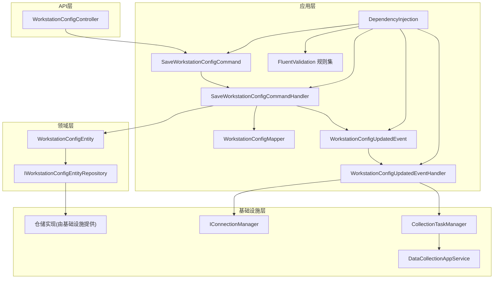
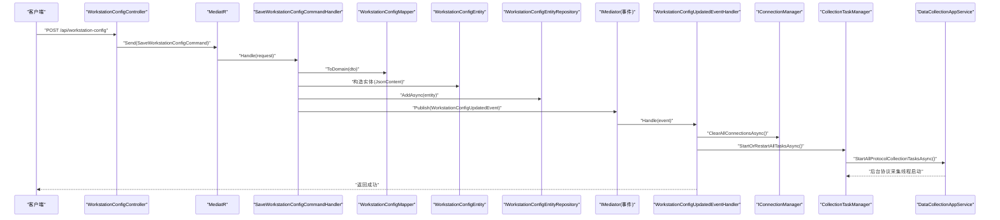
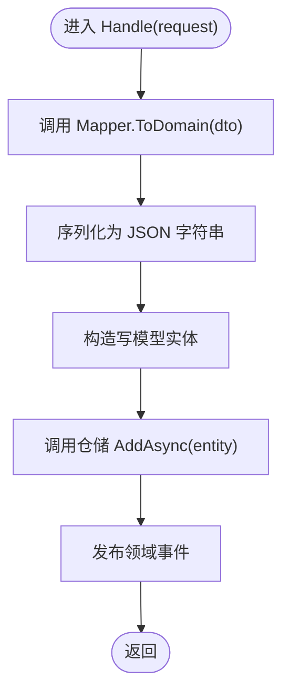
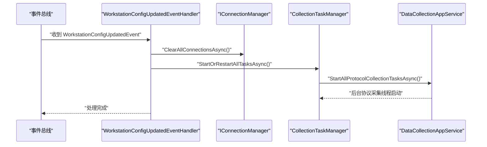
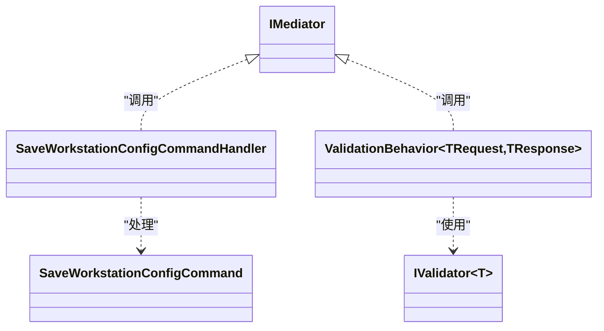
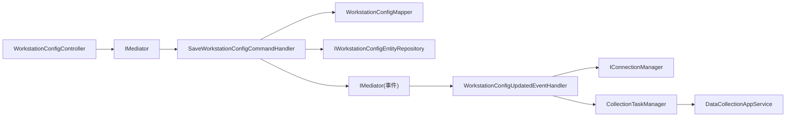

# CQRS模式实现

<cite>
**本文引用的文件**
- [SaveWorkstationConfigCommand.cs](file://IndustrialDataSolution/IndustrialDataProcessor.Application/Commands/SaveWorkstationConfigCommand.cs)
- [SaveWorkstationConfigCommandHandler.cs](file://IndustrialDataSolution/IndustrialDataProcessor.Application/CommandHandlers/SaveWorkstationConfigCommandHandler.cs)
- [WorkstationConfigUpdatedEvent.cs](file://IndustrialDataSolution/IndustrialDataProcessor.Application/Events/WorkstationConfigUpdatedEvent.cs)
- [WorkstationConfigUpdatedEventHandler.cs](file://IndustrialDataSolution/IndustrialDataProcessor.Application/EventHandlers/WorkstationConfigUpdatedEventHandler.cs)
- [DependencyInjection.cs](file://IndustrialDataSolution/IndustrialDataProcessor.Application/DependencyInjection.cs)
- [ValidationBehavior.cs](file://IndustrialDataSolution/IndustrialDataProcessor.Application/Behaviors/ValidationBehavior.cs)
- [WorkstationConfigController.cs](file://IndustrialDataSolution/IndustrialDataProcessor.Api/Controllers/WorkstationConfigController.cs)
- [Program.cs](file://IndustrialDataSolution/IndustrialDataProcessor.Api/Program.cs)
- [WorkstationConfigEntity.cs](file://IndustrialDataSolution/IndustrialDataProcessor.Domain/Entities/WorkstationConfigEntity.cs)
- [IWorkstationConfigEntityRepository.cs](file://IndustrialDataSolution/IndustrialDataProcessor.Domain/Repositories/IWorkstationConfigEntityRepository.cs)
- [WorkstationConfigMapper.cs](file://IndustrialDataSolution/IndustrialDataProcessor.Application/Mappers/WorkstationConfigMapper.cs)
- [DataCollectionAppService.cs](file://IndustrialDataSolution/IndustrialDataProcessor.Application/Services/DataCollectionAppService.cs)
- [CollectionTaskManager.cs](file://IndustrialDataSolution/IndustrialDataProcessor.Application/Services/CollectionTaskManager.cs)
</cite>

## 目录
1. [引言](#引言)
2. [项目结构](#项目结构)
3. [核心组件](#核心组件)
4. [架构总览](#架构总览)
5. [详细组件分析](#详细组件分析)
6. [依赖关系分析](#依赖关系分析)
7. [性能考量](#性能考量)
8. [故障排查指南](#故障排查指南)
9. [结论](#结论)
10. [附录](#附录)

## 引言
本文件面向DDD工业数据处理解决方案，系统性阐述CQRS（命令查询职责分离）在该项目中的落地实践。重点覆盖：
- 命令与查询的职责分离、命令处理流水线与行为拦截器
- 事件驱动架构：领域事件的定义、发布与处理
- 写模型与查询模型的分离策略及一致性保障
- 使用MediatR实现命令管道与全局验证拦截
- 以SaveWorkstationConfigCommand及其处理器为核心，串联控制器、应用服务、仓储与事件处理的完整链路

## 项目结构
项目采用多层架构与领域驱动设计，围绕“命令-事件-查询”主线组织模块：
- API层：暴露HTTP端点，接收请求并转为命令
- 应用层：命令、查询、事件、处理器、验证器、映射器、服务
- 领域层：实体、枚举、仓库接口、工作流与结果模型
- 基础设施层：通信、驱动、仓储实现、持久化、后台服务

图表来源
- [WorkstationConfigController.cs](file://IndustrialDataSolution/IndustrialDataProcessor.Api/Controllers/WorkstationConfigController.cs#L1-L22)
- [SaveWorkstationConfigCommand.cs](file://IndustrialDataSolution/IndustrialDataProcessor.Application/Commands/SaveWorkstationConfigCommand.cs#L1-L9)
- [SaveWorkstationConfigCommandHandler.cs](file://IndustrialDataSolution/IndustrialDataProcessor.Application/CommandHandlers/SaveWorkstationConfigCommandHandler.cs#L1-L32)
- [WorkstationConfigMapper.cs](file://IndustrialDataSolution/IndustrialDataProcessor.Application/Mappers/WorkstationConfigMapper.cs#L1-L106)
- [WorkstationConfigEntity.cs](file://IndustrialDataSolution/IndustrialDataProcessor.Domain/Entities/WorkstationConfigEntity.cs#L1-L7)
- [IWorkstationConfigEntityRepository.cs](file://IndustrialDataSolution/IndustrialDataProcessor.Domain/Repositories/IWorkstationConfigEntityRepository.cs#L1-L10)
- [WorkstationConfigUpdatedEvent.cs](file://IndustrialDataSolution/IndustrialDataProcessor.Application/Events/WorkstationConfigUpdatedEvent.cs#L1-L11)
- [WorkstationConfigUpdatedEventHandler.cs](file://IndustrialDataSolution/IndustrialDataProcessor.Application/EventHandlers/WorkstationConfigUpdatedEventHandler.cs#L1-L40)
- [CollectionTaskManager.cs](file://IndustrialDataSolution/IndustrialDataProcessor.Application/Services/CollectionTaskManager.cs#L1-L61)
- [DataCollectionAppService.cs](file://IndustrialDataSolution/IndustrialDataProcessor.Application/Services/DataCollectionAppService.cs#L1-L216)
- [DependencyInjection.cs](file://IndustrialDataSolution/IndustrialDataProcessor.Application/DependencyInjection.cs#L1-L40)

章节来源
- [Program.cs](file://IndustrialDataSolution/IndustrialDataProcessor.Api/Program.cs#L1-L54)
- [DependencyInjection.cs](file://IndustrialDataSolution/IndustrialDataProcessor.Application/DependencyInjection.cs#L1-L40)

## 核心组件
- 命令与处理器
  - SaveWorkstationConfigCommand：承载写入工作站配置的请求载荷
  - SaveWorkstationConfigCommandHandler：负责将DTO映射为领域模型、序列化持久化、发布领域事件
- 事件与事件处理器
  - WorkstationConfigUpdatedEvent：表示配置已更新的通知
  - WorkstationConfigUpdatedEventHandler：清理旧连接、重启采集任务、重建数据发布服务
- 映射器
  - WorkstationConfigMapper：将DTO转换为领域配置对象树
- 仓储接口与实体
  - IWorkstationConfigEntityRepository：写模型仓储接口
  - WorkstationConfigEntity：写模型实体
- 应用服务与任务管理
  - DataCollectionAppService：按协议启动后台采集循环
  - CollectionTaskManager：统一管理采集任务的启停与重启
- 控制器与依赖注入
  - WorkstationConfigController：HTTP入口，封装命令并交由MediatR处理
  - DependencyInjection：注册MediatR、验证器、服务与全局行为拦截器

章节来源
- [SaveWorkstationConfigCommand.cs](file://IndustrialDataSolution/IndustrialDataProcessor.Application/Commands/SaveWorkstationConfigCommand.cs#L1-L9)
- [SaveWorkstationConfigCommandHandler.cs](file://IndustrialDataSolution/IndustrialDataProcessor.Application/CommandHandlers/SaveWorkstationConfigCommandHandler.cs#L1-L32)
- [WorkstationConfigUpdatedEvent.cs](file://IndustrialDataSolution/IndustrialDataProcessor.Application/Events/WorkstationConfigUpdatedEvent.cs#L1-L11)
- [WorkstationConfigUpdatedEventHandler.cs](file://IndustrialDataSolution/IndustrialDataProcessor.Application/EventHandlers/WorkstationConfigUpdatedEventHandler.cs#L1-L40)
- [WorkstationConfigMapper.cs](file://IndustrialDataSolution/IndustrialDataProcessor.Application/Mappers/WorkstationConfigMapper.cs#L1-L106)
- [WorkstationConfigEntity.cs](file://IndustrialDataSolution/IndustrialDataProcessor.Domain/Entities/WorkstationConfigEntity.cs#L1-L7)
- [IWorkstationConfigEntityRepository.cs](file://IndustrialDataSolution/IndustrialDataProcessor.Domain/Repositories/IWorkstationConfigEntityRepository.cs#L1-L10)
- [DataCollectionAppService.cs](file://IndustrialDataSolution/IndustrialDataProcessor.Application/Services/DataCollectionAppService.cs#L1-L216)
- [CollectionTaskManager.cs](file://IndustrialDataSolution/IndustrialDataProcessor.Application/Services/CollectionTaskManager.cs#L1-L61)
- [WorkstationConfigController.cs](file://IndustrialDataSolution/IndustrialDataProcessor.Api/Controllers/WorkstationConfigController.cs#L1-L22)
- [DependencyInjection.cs](file://IndustrialDataSolution/IndustrialDataProcessor.Application/DependencyInjection.cs#L1-L40)

## 架构总览
CQRS在此项目中体现为：
- 写模型：命令处理完成后持久化写模型实体，并发布领域事件
- 事件驱动：事件处理器响应配置变更，触发连接与任务的重建
- 查询模型：采集服务从仓储读取最新配置，构建查询视图供采集循环使用

图表来源
- [WorkstationConfigController.cs](file://IndustrialDataSolution/IndustrialDataProcessor.Api/Controllers/WorkstationConfigController.cs#L1-L22)
- [SaveWorkstationConfigCommand.cs](file://IndustrialDataSolution/IndustrialDataProcessor.Application/Commands/SaveWorkstationConfigCommand.cs#L1-L9)
- [SaveWorkstationConfigCommandHandler.cs](file://IndustrialDataSolution/IndustrialDataProcessor.Application/CommandHandlers/SaveWorkstationConfigCommandHandler.cs#L1-L32)
- [WorkstationConfigMapper.cs](file://IndustrialDataSolution/IndustrialDataProcessor.Application/Mappers/WorkstationConfigMapper.cs#L1-L106)
- [WorkstationConfigEntity.cs](file://IndustrialDataSolution/IndustrialDataProcessor.Domain/Entities/WorkstationConfigEntity.cs#L1-L7)
- [IWorkstationConfigEntityRepository.cs](file://IndustrialDataSolution/IndustrialDataProcessor.Domain/Repositories/IWorkstationConfigEntityRepository.cs#L1-L10)
- [WorkstationConfigUpdatedEvent.cs](file://IndustrialDataSolution/IndustrialDataProcessor.Application/Events/WorkstationConfigUpdatedEvent.cs#L1-L11)
- [WorkstationConfigUpdatedEventHandler.cs](file://IndustrialDataSolution/IndustrialDataProcessor.Application/EventHandlers/WorkstationConfigUpdatedEventHandler.cs#L1-L40)
- [CollectionTaskManager.cs](file://IndustrialDataSolution/IndustrialDataProcessor.Application/Services/CollectionTaskManager.cs#L1-L61)
- [DataCollectionAppService.cs](file://IndustrialDataSolution/IndustrialDataProcessor.Application/Services/DataCollectionAppService.cs#L1-L216)

## 详细组件分析

### SaveWorkstationConfigCommand 与 SaveWorkstationConfigCommandHandler
- 命令定义
  - 作为IRequest标记类，承载WorkstationConfigDto
- 处理器职责
  - 将DTO映射为领域模型并序列化为JSON字符串
  - 构造写模型实体并持久化
  - 发布配置更新事件，触发后续事件处理

图表来源
- [SaveWorkstationConfigCommandHandler.cs](file://IndustrialDataSolution/IndustrialDataProcessor.Application/CommandHandlers/SaveWorkstationConfigCommandHandler.cs#L1-L32)
- [WorkstationConfigMapper.cs](file://IndustrialDataSolution/IndustrialDataProcessor.Application/Mappers/WorkstationConfigMapper.cs#L1-L106)
- [WorkstationConfigEntity.cs](file://IndustrialDataSolution/IndustrialDataProcessor.Domain/Entities/WorkstationConfigEntity.cs#L1-L7)
- [IWorkstationConfigEntityRepository.cs](file://IndustrialDataSolution/IndustrialDataProcessor.Domain/Repositories/IWorkstationConfigEntityRepository.cs#L1-L10)

章节来源
- [SaveWorkstationConfigCommand.cs](file://IndustrialDataSolution/IndustrialDataProcessor.Application/Commands/SaveWorkstationConfigCommand.cs#L1-L9)
- [SaveWorkstationConfigCommandHandler.cs](file://IndustrialDataSolution/IndustrialDataProcessor.Application/CommandHandlers/SaveWorkstationConfigCommandHandler.cs#L1-L32)

### 事件驱动：WorkstationConfigUpdatedEvent 与 WorkstationConfigUpdatedEventHandler
- 领域事件
  - 表示配置已更新，携带更新时间戳
- 事件处理器
  - 清理旧连接
  - 重启采集任务
  - 重启数据发布服务
  - 记录日志，确保下一轮轮询使用全新配置

图表来源
- [WorkstationConfigUpdatedEvent.cs](file://IndustrialDataSolution/IndustrialDataProcessor.Application/Events/WorkstationConfigUpdatedEvent.cs#L1-L11)
- [WorkstationConfigUpdatedEventHandler.cs](file://IndustrialDataSolution/IndustrialDataProcessor.Application/EventHandlers/WorkstationConfigUpdatedEventHandler.cs#L1-L40)
- [CollectionTaskManager.cs](file://IndustrialDataSolution/IndustrialDataProcessor.Application/Services/CollectionTaskManager.cs#L1-L61)
- [DataCollectionAppService.cs](file://IndustrialDataSolution/IndustrialDataProcessor.Application/Services/DataCollectionAppService.cs#L1-L216)

章节来源
- [WorkstationConfigUpdatedEvent.cs](file://IndustrialDataSolution/IndustrialDataProcessor.Application/Events/WorkstationConfigUpdatedEvent.cs#L1-L11)
- [WorkstationConfigUpdatedEventHandler.cs](file://IndustrialDataSolution/IndustrialDataProcessor.Application/EventHandlers/WorkstationConfigUpdatedEventHandler.cs#L1-L40)

### 查询模型与写模型分离
- 写模型
  - 以WorkstationConfigEntity为载体，持久化JSON化的配置
  - 通过IWorkstationConfigEntityRepository写入
- 查询模型
  - 采集服务从仓储读取最新配置并解析为领域对象，供采集循环使用
- 一致性保障
  - 通过事件处理器在配置变更后，统一触发连接与任务的重建，确保后续读取使用最新配置

章节来源
- [WorkstationConfigEntity.cs](file://IndustrialDataSolution/IndustrialDataProcessor.Domain/Entities/WorkstationConfigEntity.cs#L1-L7)
- [IWorkstationConfigEntityRepository.cs](file://IndustrialDataSolution/IndustrialDataProcessor.Domain/Repositories/IWorkstationConfigEntityRepository.cs#L1-L10)
- [DataCollectionAppService.cs](file://IndustrialDataSolution/IndustrialDataProcessor.Application/Services/DataCollectionAppService.cs#L1-L216)
- [WorkstationConfigUpdatedEventHandler.cs](file://IndustrialDataSolution/IndustrialDataProcessor.Application/EventHandlers/WorkstationConfigUpdatedEventHandler.cs#L1-L40)

### MediatR在CQRS中的应用
- 命令管道
  - 控制器通过IMediator.Send将命令投递至对应处理器
- 行为拦截器
  - ValidationBehavior对所有进入的请求执行FluentValidation验证
  - 通过AddOpenBehavior注册为全局行为，自动拦截并抛出验证异常
- 依赖注入
  - AddMediatR扫描包含命令的程序集，注册处理器
  - 同时注册全局验证行为

图表来源
- [SaveWorkstationConfigCommand.cs](file://IndustrialDataSolution/IndustrialDataProcessor.Application/Commands/SaveWorkstationConfigCommand.cs#L1-L9)
- [SaveWorkstationConfigCommandHandler.cs](file://IndustrialDataSolution/IndustrialDataProcessor.Application/CommandHandlers/SaveWorkstationConfigCommandHandler.cs#L1-L32)
- [ValidationBehavior.cs](file://IndustrialDataSolution/IndustrialDataProcessor.Application/Behaviors/ValidationBehavior.cs#L1-L31)
- [DependencyInjection.cs](file://IndustrialDataSolution/IndustrialDataProcessor.Application/DependencyInjection.cs#L1-L40)

章节来源
- [WorkstationConfigController.cs](file://IndustrialDataSolution/IndustrialDataProcessor.Api/Controllers/WorkstationConfigController.cs#L1-L22)
- [DependencyInjection.cs](file://IndustrialDataSolution/IndustrialDataProcessor.Application/DependencyInjection.cs#L1-L40)
- [ValidationBehavior.cs](file://IndustrialDataSolution/IndustrialDataProcessor.Application/Behaviors/ValidationBehavior.cs#L1-L31)

### 采集服务与任务管理
- DataCollectionAppService
  - 从仓储读取最新配置，按协议启动独立后台线程
  - 对每个协议维护独立的长驻循环，互不阻塞
  - 将采集结果通过进程内通道广播给订阅者
- CollectionTaskManager
  - 统一管理任务启停与重启
  - 通过IServiceScopeFactory解析依赖DbContext的作用域服务
  - 保证在宿主停止或配置变更时安全取消旧任务并启动新任务

章节来源
- [DataCollectionAppService.cs](file://IndustrialDataSolution/IndustrialDataProcessor.Application/Services/DataCollectionAppService.cs#L1-L216)
- [CollectionTaskManager.cs](file://IndustrialDataSolution/IndustrialDataProcessor.Application/Services/CollectionTaskManager.cs#L1-L61)

## 依赖关系分析
- 控制器依赖MediatR，MediatR依赖命令处理器
- 命令处理器依赖映射器、仓储接口与事件总线
- 事件处理器依赖连接管理器、任务管理器与数据发布管理器
- 应用服务依赖仓储、连接管理器、协议驱动集合与数据通道
- 依赖注入在应用层集中注册，确保作用域与生命周期正确

图表来源
- [WorkstationConfigController.cs](file://IndustrialDataSolution/IndustrialDataProcessor.Api/Controllers/WorkstationConfigController.cs#L1-L22)
- [SaveWorkstationConfigCommandHandler.cs](file://IndustrialDataSolution/IndustrialDataProcessor.Application/CommandHandlers/SaveWorkstationConfigCommandHandler.cs#L1-L32)
- [WorkstationConfigUpdatedEventHandler.cs](file://IndustrialDataSolution/IndustrialDataProcessor.Application/EventHandlers/WorkstationConfigUpdatedEventHandler.cs#L1-L40)
- [CollectionTaskManager.cs](file://IndustrialDataSolution/IndustrialDataProcessor.Application/Services/CollectionTaskManager.cs#L1-L61)
- [DataCollectionAppService.cs](file://IndustrialDataSolution/IndustrialDataProcessor.Application/Services/DataCollectionAppService.cs#L1-L216)

章节来源
- [DependencyInjection.cs](file://IndustrialDataSolution/IndustrialDataProcessor.Application/DependencyInjection.cs#L1-L40)

## 性能考量
- 并发采集
  - 每个协议独立线程，互不影响，提升吞吐
- 轻量验证
  - 全局验证行为在命令进入处理器前统一校验，减少无效处理
- 事件解耦
  - 事件处理器仅做必要资源重建，避免阻塞命令处理
- 通道广播
  - 进程内消息通道降低跨进程通信成本，提高实时性

## 故障排查指南
- 命令未生效
  - 检查控制器是否正确构造并发送命令
  - 确认MediatR已注册并扫描到处理器
- 配置更新后未生效
  - 检查事件是否发布与处理
  - 确认事件处理器已调用连接清理与任务重启
- 采集异常
  - 查看采集服务日志，定位协议驱动与连接问题
  - 检查任务管理器是否正确取消旧任务并启动新任务

章节来源
- [WorkstationConfigController.cs](file://IndustrialDataSolution/IndustrialDataProcessor.Api/Controllers/WorkstationConfigController.cs#L1-L22)
- [SaveWorkstationConfigCommandHandler.cs](file://IndustrialDataSolution/IndustrialDataProcessor.Application/CommandHandlers/SaveWorkstationConfigCommandHandler.cs#L1-L32)
- [WorkstationConfigUpdatedEventHandler.cs](file://IndustrialDataSolution/IndustrialDataProcessor.Application/EventHandlers/WorkstationConfigUpdatedEventHandler.cs#L1-L40)
- [DataCollectionAppService.cs](file://IndustrialDataSolution/IndustrialDataProcessor.Application/Services/DataCollectionAppService.cs#L1-L216)
- [CollectionTaskManager.cs](file://IndustrialDataSolution/IndustrialDataProcessor.Application/Services/CollectionTaskManager.cs#L1-L61)

## 结论
本项目以MediatR为核心，实现了清晰的CQRS与事件驱动架构：
- 写模型通过命令处理器持久化配置并发布事件
- 事件处理器统一协调连接与任务重建，确保查询模型与写模型一致
- 应用服务与任务管理器提供高并发、可重启的采集能力
- 全局验证行为提升可靠性与可维护性

## 附录
- API端点
  - POST /api/workstation-config：提交工作站配置
- 关键实现路径
  - 命令定义：[SaveWorkstationConfigCommand.cs](file://IndustrialDataSolution/IndustrialDataProcessor.Application/Commands/SaveWorkstationConfigCommand.cs#L1-L9)
  - 命令处理：[SaveWorkstationConfigCommandHandler.cs](file://IndustrialDataSolution/IndustrialDataProcessor.Application/CommandHandlers/SaveWorkstationConfigCommandHandler.cs#L1-L32)
  - 事件定义：[WorkstationConfigUpdatedEvent.cs](file://IndustrialDataSolution/IndustrialDataProcessor.Application/Events/WorkstationConfigUpdatedEvent.cs#L1-L11)
  - 事件处理：[WorkstationConfigUpdatedEventHandler.cs](file://IndustrialDataSolution/IndustrialDataProcessor.Application/EventHandlers/WorkstationConfigUpdatedEventHandler.cs#L1-L40)
  - 映射器：[WorkstationConfigMapper.cs](file://IndustrialDataSolution/IndustrialDataProcessor.Application/Mappers/WorkstationConfigMapper.cs#L1-L106)
  - 写模型实体：[WorkstationConfigEntity.cs](file://IndustrialDataSolution/IndustrialDataProcessor.Domain/Entities/WorkstationConfigEntity.cs#L1-L7)
  - 仓储接口：[IWorkstationConfigEntityRepository.cs](file://IndustrialDataSolution/IndustrialDataProcessor.Domain/Repositories/IWorkstationConfigEntityRepository.cs#L1-L10)
  - 应用服务：[DataCollectionAppService.cs](file://IndustrialDataSolution/IndustrialDataProcessor.Application/Services/DataCollectionAppService.cs#L1-L216)
  - 任务管理：[CollectionTaskManager.cs](file://IndustrialDataSolution/IndustrialDataProcessor.Application/Services/CollectionTaskManager.cs#L1-L61)
  - 控制器：[WorkstationConfigController.cs](file://IndustrialDataSolution/IndustrialDataProcessor.Api/Controllers/WorkstationConfigController.cs#L1-L22)
  - 依赖注入：[DependencyInjection.cs](file://IndustrialDataSolution/IndustrialDataProcessor.Application/DependencyInjection.cs#L1-L40)
  - 程序入口：[Program.cs](file://IndustrialDataSolution/IndustrialDataProcessor.Api/Program.cs#L1-L54)