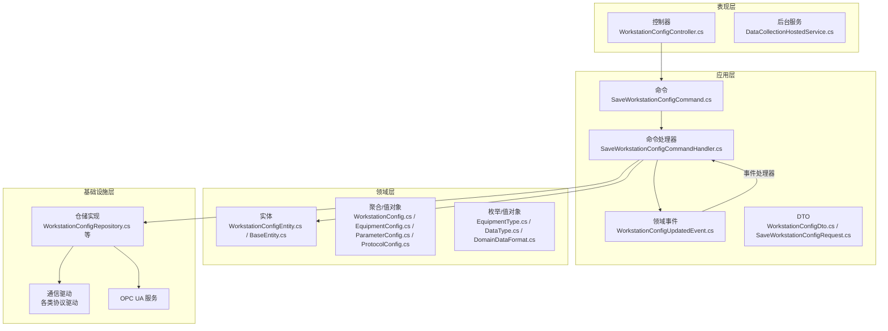
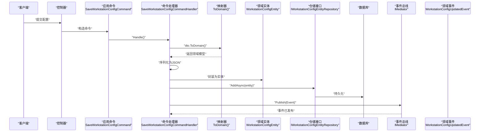
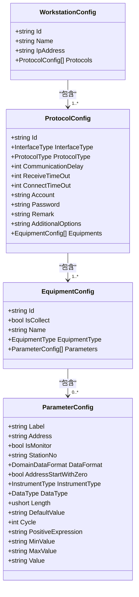
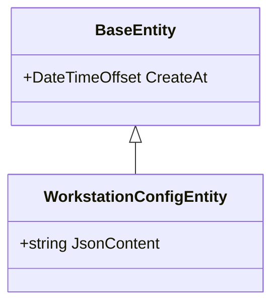
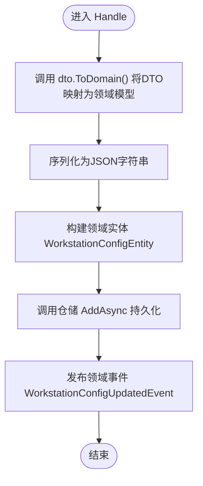
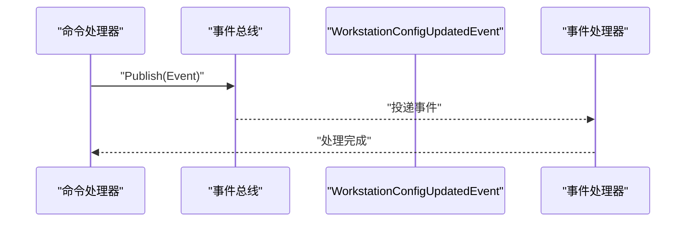
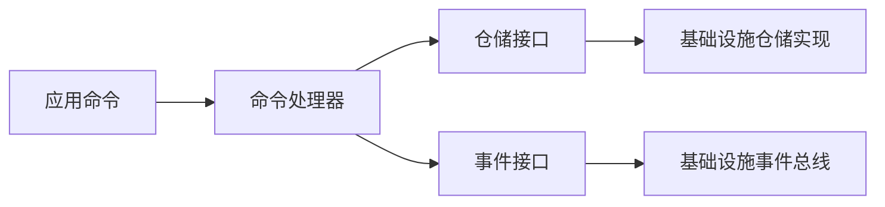

# DDD领域建模

<cite>
**本文引用的文件**
- [WorkstationConfigEntity.cs](file://IndustrialDataSolution/IndustrialDataProcessor.Domain/Entities/WorkstationConfigEntity.cs)
- [BaseEntity.cs](file://IndustrialDataSolution/IndustrialDataProcessor.Domain/Entities/BaseEntity.cs)
- [WorkstationConfig.cs](file://IndustrialDataSolution/IndustrialDataProcessor.Domain/Workstation/Configs/WorkstationConfig.cs)
- [EquipmentConfig.cs](file://IndustrialDataSolution/IndustrialDataProcessor.Domain/Workstation/Configs/EquipmentConfig.cs)
- [ParameterConfig.cs](file://IndustrialDataSolution/IndustrialDataProcessor.Domain/Workstation/Configs/ParameterConfig.cs)
- [ProtocolConfig.cs](file://IndustrialDataSolution/IndustrialDataProcessor.Domain/Workstation/Configs/ProtocolConfig.cs)
- [EquipmentType.cs](file://IndustrialDataSolution/IndustrialDataProcessor.Domain/Enums/EquipmentType.cs)
- [DataType.cs](file://IndustrialDataSolution/IndustrialDataProcessor.Domain/Enums/DataType.cs)
- [DomainDataFormat.cs](file://IndustrialDataSolution/IndustrialDataProcessor.Domain/Enums/DomainDataFormat.cs)
- [WorkstationConfigUpdatedEvent.cs](file://IndustrialDataSolution/IndustrialDataProcessor.Application/Events/WorkstationConfigUpdatedEvent.cs)
- [SaveWorkstationConfigCommand.cs](file://IndustrialDataSolution/IndustrialDataProcessor.Application/Commands/SaveWorkstationConfigCommand.cs)
- [SaveWorkstationConfigCommandHandler.cs](file://IndustrialDataSolution/IndustrialDataProcessor.Application/CommandHandlers/SaveWorkstationConfigCommandHandler.cs)
- [WorkstationConfigDto.cs](file://IndustrialDataSolution/IndustrialDataProcessor.Application/Dtos/WorkstationDto/WorkstationConfigDto.cs)
- [SaveWorkstationConfigRequest.cs](file://IndustrialDataSolution/IndustrialDataProcessor.Application/Dtos/SaveWorkstationConfigRequest.cs)
</cite>

## 目录
1. 引言
2. 项目结构
3. 核心组件
4. 架构总览
5. 详细组件分析
6. 依赖关系分析
7. 性能考量
8. 故障排查指南
9. 结论
10. 附录

## 引言
本文件面向“DDD工业数据处理解决方案”，系统化梳理领域驱动设计在项目中的落地实践，重点覆盖以下方面：
- 实体、值对象、聚合根的设计原则与实现方式
- 工作站配置、设备配置、参数配置等核心领域模型的设计思路
- 领域服务的职责划分与实现模式
- 不变量（Invariants）的维护与业务规则的封装
- 领域事件的触发时机与处理机制
- 领域模型演进与重构策略
- 领域模型与基础设施层的解耦方式

## 项目结构
该项目采用分层架构与DDD分层组织方式，主要分为四层：
- 表现层：控制器与后台服务
- 应用层：命令、查询、事件、验证器、应用服务与映射器
- 领域层：实体、值对象、聚合、领域服务与仓储接口
- 基础设施层：通信驱动、存储实现、OPC UA、后台任务等

图表来源
- [SaveWorkstationConfigCommandHandler.cs](file://IndustrialDataSolution/IndustrialDataProcessor.Application/CommandHandlers/SaveWorkstationConfigCommandHandler.cs#L1-L32)
- [WorkstationConfigEntity.cs](file://IndustrialDataSolution/IndustrialDataProcessor.Domain/Entities/WorkstationConfigEntity.cs#L1-L7)
- [WorkstationConfig.cs](file://IndustrialDataSolution/IndustrialDataProcessor.Domain/Workstation/Configs/WorkstationConfig.cs#L1-L27)
- [EquipmentConfig.cs](file://IndustrialDataSolution/IndustrialDataProcessor.Domain/Workstation/Configs/EquipmentConfig.cs#L1-L34)
- [ParameterConfig.cs](file://IndustrialDataSolution/IndustrialDataProcessor.Domain/Workstation/Configs/ParameterConfig.cs#L1-L84)
- [ProtocolConfig.cs](file://IndustrialDataSolution/IndustrialDataProcessor.Domain/Workstation/Configs/ProtocolConfig.cs#L1-L64)

章节来源
- [SaveWorkstationConfigCommandHandler.cs](file://IndustrialDataSolution/IndustrialDataProcessor.Application/CommandHandlers/SaveWorkstationConfigCommandHandler.cs#L1-L32)
- [WorkstationConfigEntity.cs](file://IndustrialDataSolution/IndustrialDataProcessor.Domain/Entities/WorkstationConfigEntity.cs#L1-L7)
- [WorkstationConfig.cs](file://IndustrialDataSolution/IndustrialDataProcessor.Domain/Workstation/Configs/WorkstationConfig.cs#L1-L27)
- [EquipmentConfig.cs](file://IndustrialDataSolution/IndustrialDataProcessor.Domain/Workstation/Configs/EquipmentConfig.cs#L1-L34)
- [ParameterConfig.cs](file://IndustrialDataSolution/IndustrialDataProcessor.Domain/Workstation/Configs/ParameterConfig.cs#L1-L84)
- [ProtocolConfig.cs](file://IndustrialDataSolution/IndustrialDataProcessor.Domain/Workstation/Configs/ProtocolConfig.cs#L1-L64)

## 核心组件
本节聚焦于DDD核心要素在项目中的体现与职责边界。

- 实体（Entity）
  - 领域实体用于承载唯一标识与生命周期状态，便于跨事务保持一致性。例如工作站在领域层的持久化实体用于承载序列化后的完整配置。
  - 示例路径：[WorkstationConfigEntity.cs](file://IndustrialDataSolution/IndustrialDataProcessor.Domain/Entities/WorkstationConfigEntity.cs#L1-L7)，[BaseEntity.cs](file://IndustrialDataSolution/IndustrialDataProcessor.Domain/Entities/BaseEntity.cs#L1-L7)

- 值对象（Value Object）
  - 值对象通过属性组合表达语义且无唯一标识。项目中广泛使用值对象来描述配置项，如工作站配置、设备配置、参数配置与协议配置。
  - 示例路径：[WorkstationConfig.cs](file://IndustrialDataSolution/IndustrialDataProcessor.Domain/Workstation/Configs/WorkstationConfig.cs#L1-L27)，[EquipmentConfig.cs](file://IndustrialDataSolution/IndustrialDataProcessor.Domain/Workstation/Configs/EquipmentConfig.cs#L1-L34)，[ParameterConfig.cs](file://IndustrialDataSolution/IndustrialDataProcessor.Domain/Workstation/Configs/ParameterConfig.cs#L1-L84)，[ProtocolConfig.cs](file://IndustrialDataSolution/IndustrialDataProcessor.Domain/Workstation/Configs/ProtocolConfig.cs#L1-L64)

- 枚举（值对象的一种）
  - 通过枚举表达离散取值，如设备类型、数据类型、数据格式等，增强类型安全与可读性。
  - 示例路径：[EquipmentType.cs](file://IndustrialDataSolution/IndustrialDataProcessor.Domain/Enums/EquipmentType.cs#L1-L22)，[DataType.cs](file://IndustrialDataSolution/IndustrialDataProcessor.Domain/Enums/DataType.cs#L1-L69)，[DomainDataFormat.cs](file://IndustrialDataSolution/IndustrialDataProcessor.Domain/Enums/DomainDataFormat.cs#L1-L9)

- 聚合根（Aggregate Root）
  - 聚合根是聚合的入口，负责维护聚合内部的一致性与不变量。本项目以“工作站配置”为核心聚合根，包含协议配置、设备配置与参数配置等子对象。
  - 示例路径：[WorkstationConfig.cs](file://IndustrialDataSolution/IndustrialDataProcessor.Domain/Workstation/Configs/WorkstationConfig.cs#L1-L27)

- 领域服务（Domain Service）
  - 当业务行为不自然归属任一实体或值对象时，应抽象为领域服务。本项目中未直接暴露显式的领域服务类，但通过命令处理器承担了协调与编排职责，体现了领域服务的职责划分。

- 仓储接口（Repository）
  - 仓储接口隔离领域与基础设施，应用层通过仓储接口访问持久化能力，避免泄漏基础设施细节至领域层。
  - 示例路径：[IWorkstationConfigEntityRepository.cs](file://IndustrialDataSolution/IndustrialDataProcessor.Domain/Repositories/IWorkstationConfigEntityRepository.cs)，[IWorkstationConfigRepository.cs](file://IndustrialDataSolution/IndustrialDataProcessor.Domain/Repositories/IWorkstationConfigRepository.cs)

章节来源
- [WorkstationConfigEntity.cs](file://IndustrialDataSolution/IndustrialDataProcessor.Domain/Entities/WorkstationConfigEntity.cs#L1-L7)
- [BaseEntity.cs](file://IndustrialDataSolution/IndustrialDataProcessor.Domain/Entities/BaseEntity.cs#L1-L7)
- [WorkstationConfig.cs](file://IndustrialDataSolution/IndustrialDataProcessor.Domain/Workstation/Configs/WorkstationConfig.cs#L1-L27)
- [EquipmentConfig.cs](file://IndustrialDataSolution/IndustrialDataProcessor.Domain/Workstation/Configs/EquipmentConfig.cs#L1-L34)
- [ParameterConfig.cs](file://IndustrialDataSolution/IndustrialDataProcessor.Domain/Workstation/Configs/ParameterConfig.cs#L1-L84)
- [ProtocolConfig.cs](file://IndustrialDataSolution/IndustrialDataProcessor.Domain/Workstation/Configs/ProtocolConfig.cs#L1-L64)
- [EquipmentType.cs](file://IndustrialDataSolution/IndustrialDataProcessor.Domain/Enums/EquipmentType.cs#L1-L22)
- [DataType.cs](file://IndustrialDataSolution/IndustrialDataProcessor.Domain/Enums/DataType.cs#L1-L69)
- [DomainDataFormat.cs](file://IndustrialDataSolution/IndustrialDataProcessor.Domain/Enums/DomainDataFormat.cs#L1-L9)

## 架构总览
下图展示了从请求到持久化的端到端流程，以及领域事件的发布与处理路径：

图表来源
- [SaveWorkstationConfigCommand.cs](file://IndustrialDataSolution/IndustrialDataProcessor.Application/Commands/SaveWorkstationConfigCommand.cs#L1-L9)
- [SaveWorkstationConfigCommandHandler.cs](file://IndustrialDataSolution/IndustrialDataProcessor.Application/CommandHandlers/SaveWorkstationConfigCommandHandler.cs#L1-L32)
- [WorkstationConfigEntity.cs](file://IndustrialDataSolution/IndustrialDataProcessor.Domain/Entities/WorkstationConfigEntity.cs#L1-L7)

章节来源
- [SaveWorkstationConfigCommand.cs](file://IndustrialDataSolution/IndustrialDataProcessor.Application/Commands/SaveWorkstationConfigCommand.cs#L1-L9)
- [SaveWorkstationConfigCommandHandler.cs](file://IndustrialDataSolution/IndustrialDataProcessor.Application/CommandHandlers/SaveWorkstationConfigCommandHandler.cs#L1-L32)

## 详细组件分析

### 工作站配置聚合（聚合根与值对象）
工作站配置作为聚合根，聚合内包含协议配置、设备配置与参数配置等值对象。这些值对象共同构成完整的采集配置，并由聚合根统一对外暴露。

图表来源
- [WorkstationConfig.cs](file://IndustrialDataSolution/IndustrialDataProcessor.Domain/Workstation/Configs/WorkstationConfig.cs#L1-L27)
- [ProtocolConfig.cs](file://IndustrialDataSolution/IndustrialDataProcessor.Domain/Workstation/Configs/ProtocolConfig.cs#L1-L64)
- [EquipmentConfig.cs](file://IndustrialDataSolution/IndustrialDataProcessor.Domain/Workstation/Configs/EquipmentConfig.cs#L1-L34)
- [ParameterConfig.cs](file://IndustrialDataSolution/IndustrialDataProcessor.Domain/Workstation/Configs/ParameterConfig.cs#L1-L84)

章节来源
- [WorkstationConfig.cs](file://IndustrialDataSolution/IndustrialDataProcessor.Domain/Workstation/Configs/WorkstationConfig.cs#L1-L27)
- [ProtocolConfig.cs](file://IndustrialDataSolution/IndustrialDataProcessor.Domain/Workstation/Configs/ProtocolConfig.cs#L1-L64)
- [EquipmentConfig.cs](file://IndustrialDataSolution/IndustrialDataProcessor.Domain/Workstation/Configs/EquipmentConfig.cs#L1-L34)
- [ParameterConfig.cs](file://IndustrialDataSolution/IndustrialDataProcessor.Domain/Workstation/Configs/ParameterConfig.cs#L1-L84)

### 领域实体与不变量
领域实体承载唯一标识与时间戳等横切信息，确保跨事务的一致性与可追踪性。本项目通过实体承载序列化后的完整配置，保证聚合根的不可变边界与可审计性。

图表来源
- [BaseEntity.cs](file://IndustrialDataSolution/IndustrialDataProcessor.Domain/Entities/BaseEntity.cs#L1-L7)
- [WorkstationConfigEntity.cs](file://IndustrialDataSolution/IndustrialDataProcessor.Domain/Entities/WorkstationConfigEntity.cs#L1-L7)

章节来源
- [BaseEntity.cs](file://IndustrialDataSolution/IndustrialDataProcessor.Domain/Entities/BaseEntity.cs#L1-L7)
- [WorkstationConfigEntity.cs](file://IndustrialDataSolution/IndustrialDataProcessor.Domain/Entities/WorkstationConfigEntity.cs#L1-L7)

### 命令与命令处理器（应用层）
命令处理器负责将外部请求转换为领域操作，协调序列化、持久化与事件发布，体现应用层的编排职责。

图表来源
- [SaveWorkstationConfigCommandHandler.cs](file://IndustrialDataSolution/IndustrialDataProcessor.Application/CommandHandlers/SaveWorkstationConfigCommandHandler.cs#L1-L32)

章节来源
- [SaveWorkstationConfigCommandHandler.cs](file://IndustrialDataSolution/IndustrialDataProcessor.Application/CommandHandlers/SaveWorkstationConfigCommandHandler.cs#L1-L32)

### 领域事件与事件处理
当配置发生变更后，应用层发布领域事件，用于触发下游副作用（如清理缓存、通知订阅者等）。事件本身不携带业务逻辑，仅作为跨边界的信号。

图表来源
- [WorkstationConfigUpdatedEvent.cs](file://IndustrialDataSolution/IndustrialDataProcessor.Application/Events/WorkstationConfigUpdatedEvent.cs#L1-L11)
- [SaveWorkstationConfigCommandHandler.cs](file://IndustrialDataSolution/IndustrialDataProcessor.Application/CommandHandlers/SaveWorkstationConfigCommandHandler.cs#L1-L32)

章节来源
- [WorkstationConfigUpdatedEvent.cs](file://IndustrialDataSolution/IndustrialDataProcessor.Application/Events/WorkstationConfigUpdatedEvent.cs#L1-L11)
- [SaveWorkstationConfigCommandHandler.cs](file://IndustrialDataSolution/IndustrialDataProcessor.Application/CommandHandlers/SaveWorkstationConfigCommandHandler.cs#L1-L32)

### DTO与请求模型
应用层通过DTO与请求模型承接外部输入，进行必要的校验与转换，再交由领域层处理。

- 请求模型：用于接收原始请求体并进行基础校验
  - 示例路径：[SaveWorkstationConfigRequest.cs](file://IndustrialDataSolution/IndustrialDataProcessor.Application/Dtos/SaveWorkstationConfigRequest.cs#L1-L12)

- DTO：面向应用层的轻量数据载体，便于跨边界传输
  - 示例路径：[WorkstationConfigDto.cs](file://IndustrialDataSolution/IndustrialDataProcessor.Application/Dtos/WorkstationDto/WorkstationConfigDto.cs#L1-L27)

章节来源
- [SaveWorkstationConfigRequest.cs](file://IndustrialDataSolution/IndustrialDataProcessor.Application/Dtos/SaveWorkstationConfigRequest.cs#L1-L12)
- [WorkstationConfigDto.cs](file://IndustrialDataSolution/IndustrialDataProcessor.Application/Dtos/WorkstationDto/WorkstationConfigDto.cs#L1-L27)

## 依赖关系分析
应用层对领域层与基础设施层的依赖遵循“依赖倒置”原则：应用层仅依赖抽象（仓储接口、事件接口），领域层不依赖应用/基础设施层，从而实现清晰的职责分离与可测试性。

图表来源
- [SaveWorkstationConfigCommandHandler.cs](file://IndustrialDataSolution/IndustrialDataProcessor.Application/CommandHandlers/SaveWorkstationConfigCommandHandler.cs#L1-L32)

章节来源
- [SaveWorkstationConfigCommandHandler.cs](file://IndustrialDataSolution/IndustrialDataProcessor.Application/CommandHandlers/SaveWorkstationConfigCommandHandler.cs#L1-L32)

## 性能考量
- 序列化成本控制：聚合根在持久化前进行序列化，建议在应用层统一配置序列化选项，减少重复开销。
- 事件风暴治理：当事件数量激增时，考虑引入事件分片、限流与重试策略，避免阻塞主流程。
- 仓储批量写入：若配置变更频繁，可评估批量插入或合并写入策略，降低数据库压力。
- 缓存一致性：事件发布后及时清理相关缓存键，避免脏读。

## 故障排查指南
- 命令处理失败
  - 检查命令处理器中的序列化与实体构建步骤，确认JSON格式与字段映射正确。
  - 关注事件发布是否成功，必要时增加重试与死信队列。
  - 参考路径：[SaveWorkstationConfigCommandHandler.cs](file://IndustrialDataSolution/IndustrialDataProcessor.Application/CommandHandlers/SaveWorkstationConfigCommandHandler.cs#L1-L32)

- 领域事件未被消费
  - 确认事件处理器已注册并正确监听对应事件类型。
  - 检查事件总线配置与异常处理链路。
  - 参考路径：[WorkstationConfigUpdatedEvent.cs](file://IndustrialDataSolution/IndustrialDataProcessor.Application/Events/WorkstationConfigUpdatedEvent.cs#L1-L11)

- 配置持久化异常
  - 核对仓储接口实现与数据库连接状态，关注超时与并发冲突。
  - 参考路径：[IWorkstationConfigEntityRepository.cs](file://IndustrialDataSolution/IndustrialDataProcessor.Domain/Repositories/IWorkstationConfigEntityRepository.cs)

## 结论
本项目在DDD层面实现了清晰的分层与职责划分：应用层负责编排与事件发布，领域层专注于业务模型与不变量，基础设施层提供通信与存储能力。通过聚合根与值对象的合理拆分、事件驱动的副作用处理以及依赖倒置的架构设计，系统具备良好的可扩展性与可维护性。后续可在以下方向持续演进：
- 引入更丰富的领域服务与工厂，进一步封装复杂业务逻辑
- 对事件处理进行模块化与幂等化改造
- 增强领域模型的测试覆盖率与模拟环境
- 在聚合边界内细化不变量与校验规则，提升模型健壮性

## 附录
- 术语说明
  - 实体：具有唯一标识与生命周期的对象
  - 值对象：通过属性组合表达语义且无唯一标识的对象
  - 聚合根：聚合的入口，负责维护聚合内部一致性
  - 领域事件：用于跨边界传递业务事实的通知
  - 仓储接口：隔离领域与基础设施的持久化抽象