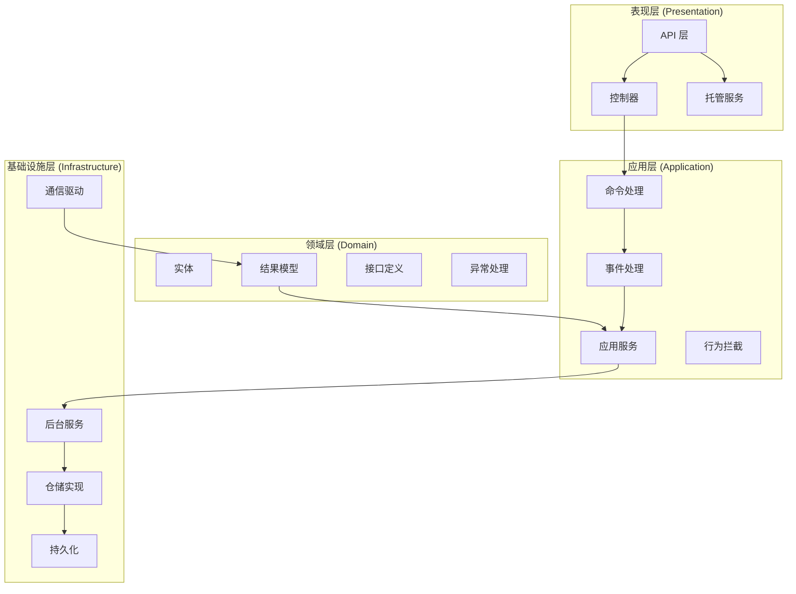
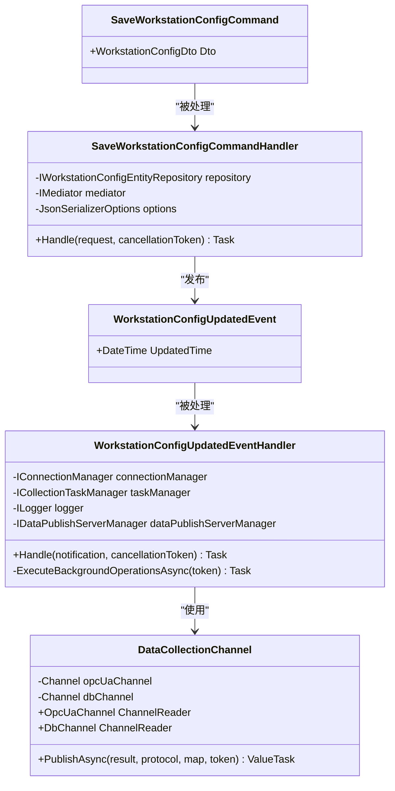
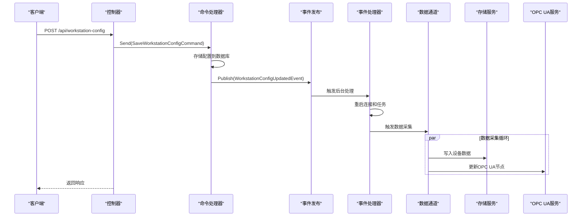
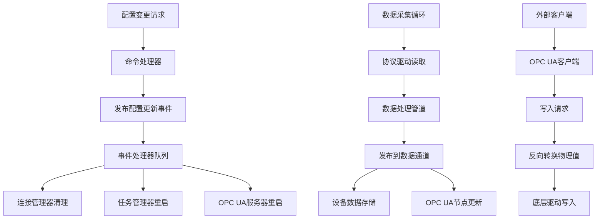
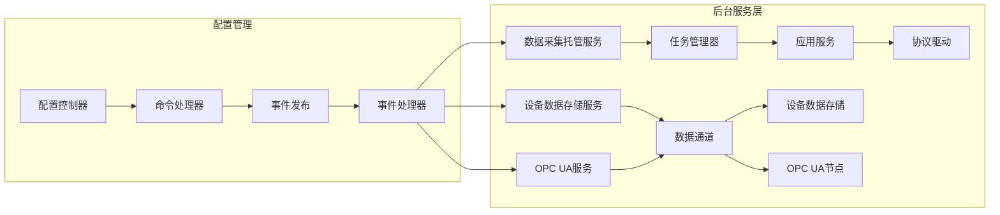
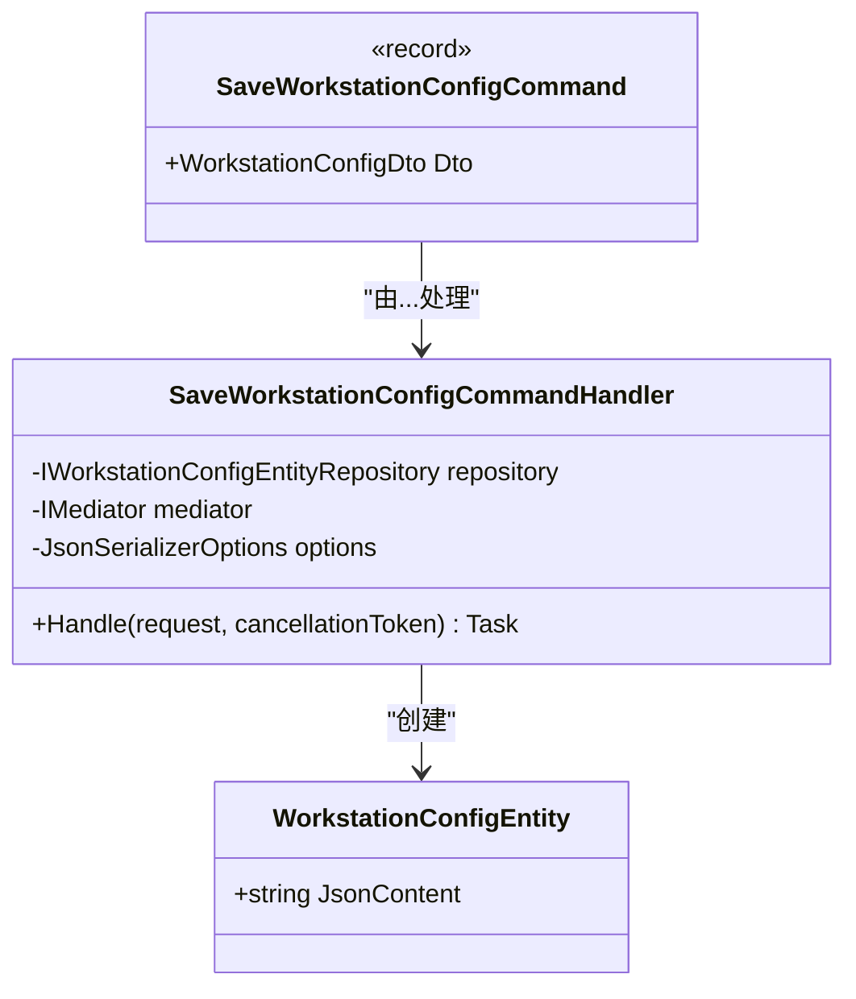
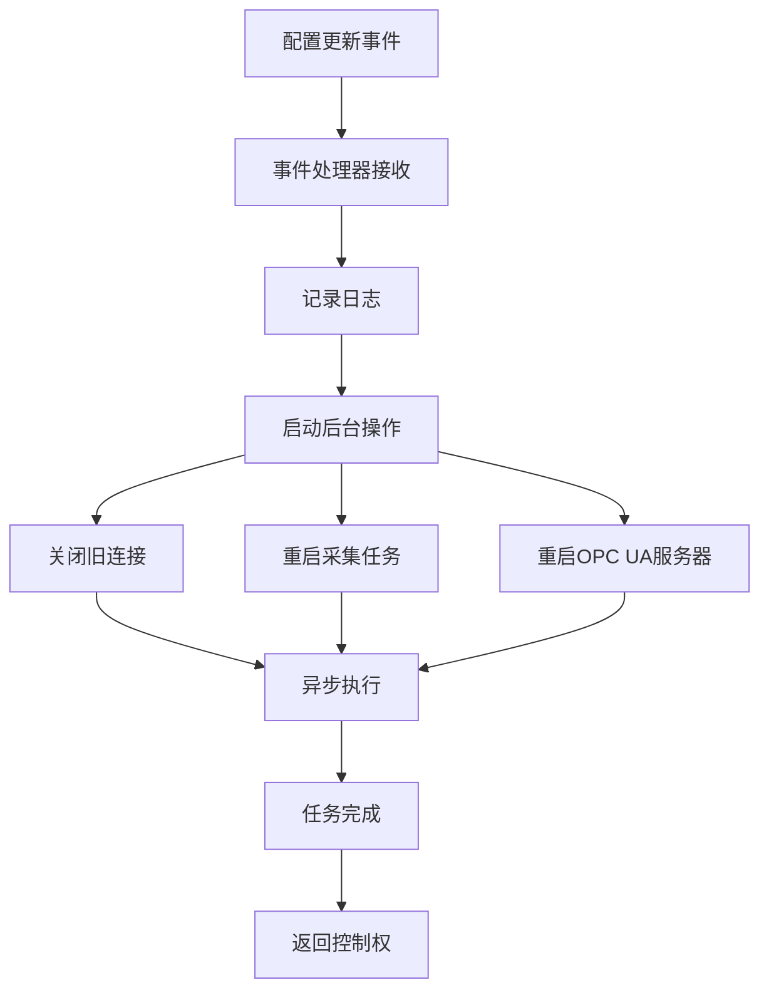
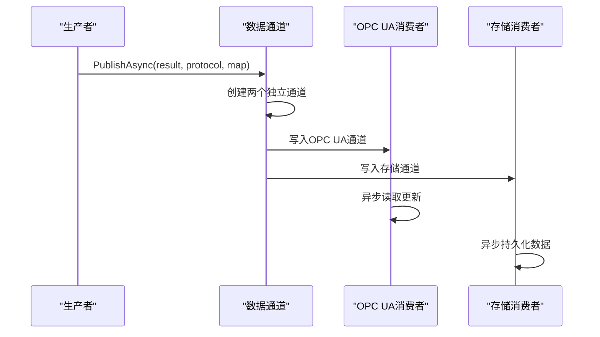
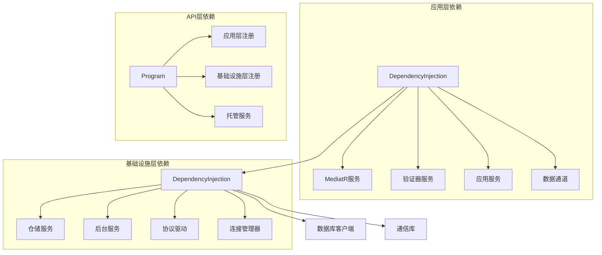
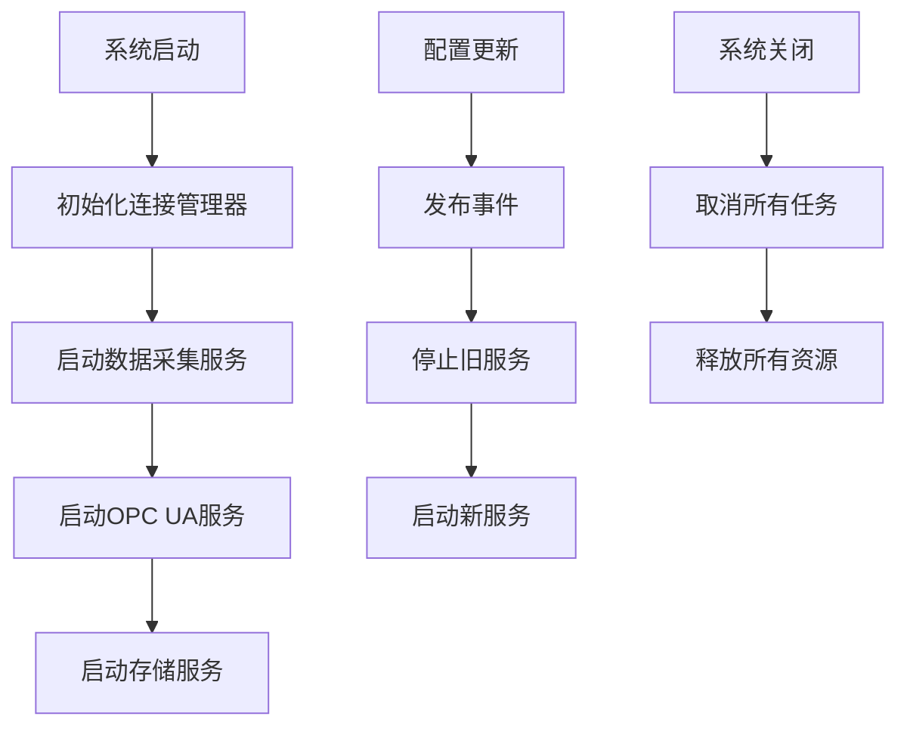

# 事件驱动架构

<cite>
**本文档引用的文件**
- [Program.cs](file://IndustrialDataSolution/IndustrialDataProcessor.Api/Program.cs)
- [DependencyInjection.cs](file://IndustrialDataSolution/IndustrialDataProcessor.Application/DependencyInjection.cs)
- [DependencyInjection.cs](file://IndustrialDataSolution/IndustrialDataProcessor.Infrastructure/DependencyInjection.cs)
- [SaveWorkstationConfigCommand.cs](file://IndustrialDataSolution/IndustrialDataProcessor.Application/Features/SaveWorkstationConfigCommand.cs)
- [WorkstationConfigUpdatedEvent.cs](file://IndustrialDataSolution/IndustrialDataProcessor.Application/Features/WorkstationConfigUpdatedEvent.cs)
- [DataCollectionAppService.cs](file://IndustrialDataSolution/IndustrialDataProcessor.Application/Services/DataCollectionAppService.cs)
- [DataCollectionChannel.cs](file://IndustrialDataSolution/IndustrialDataProcessor.Domain/Workstation/Results/DataCollectionChannel.cs)
- [EquipmentDataHostingService.cs](file://IndustrialDataSolution/IndustrialDataProcessor.Infrastructure/BackgroundServices/EquipmentDataHostingService.cs)
- [OpcUaHostingService.cs](file://IndustrialDataSolution/IndustrialDataProcessor.Infrastructure/BackgroundServices/OpcUaHostingService.cs)
- [CollectionTaskManager.cs](file://IndustrialDataSolution/IndustrialDataProcessor.Application/Services/CollectionTaskManager.cs)
- [DataCollectionHostedService.cs](file://IndustrialDataSolution/IndustrialDataProcessor.Api/BackgroundServices/DataCollectionHostedService.cs)
- [WorkstationConfigController.cs](file://IndustrialDataSolution/IndustrialDataProcessor.Api/Controllers/WorkstationConfigController.cs)
- [WorkstationConfigEntity.cs](file://IndustrialDataSolution/IndustrialDataProcessor.Domain/Entities/WorkstationConfigEntity.cs)
</cite>

## 目录
1. [简介](#简介)
2. [项目结构](#项目结构)
3. [核心组件](#核心组件)
4. [架构概览](#架构概览)
5. [详细组件分析](#详细组件分析)
6. [依赖关系分析](#依赖关系分析)
7. [性能考虑](#性能考虑)
8. [故障排除指南](#故障排除指南)
9. [结论](#结论)

## 简介

这是一个基于事件驱动架构的工业数据处理系统。该系统采用领域驱动设计(DDD)原则，通过事件发布-订阅模式实现松耦合的组件通信，支持实时数据采集、OPC UA服务器发布和数据库持久化。

系统的核心特点是：
- **事件驱动**：通过MediatR实现命令-事件-处理器的解耦架构
- **进程内消息总线**：使用System.Threading.Channels实现高性能数据传输
- **后台服务**：支持独立的采集、发布和存储后台任务
- **异步处理**：采用Fire-and-Forget模式处理耗时操作

## 项目结构

系统采用多层架构设计，分为四个主要层次：

**图表来源**
- [Program.cs](file://IndustrialDataSolution/IndustrialDataProcessor.Api/Program.cs#L1-L52)
- [DependencyInjection.cs](file://IndustrialDataSolution/IndustrialDataProcessor.Application/DependencyInjection.cs#L1-L41)
- [DependencyInjection.cs](file://IndustrialDataSolution/IndustrialDataProcessor.Infrastructure/DependencyInjection.cs#L1-L163)

**章节来源**
- [Program.cs](file://IndustrialDataSolution/IndustrialDataProcessor.Api/Program.cs#L1-L52)
- [DependencyInjection.cs](file://IndustrialDataSolution/IndustrialDataProcessor.Application/DependencyInjection.cs#L1-L41)

## 核心组件

### 事件驱动架构组件

系统的核心组件包括事件发布器、事件处理器和消息通道：

**图表来源**
- [WorkstationConfigUpdatedEvent.cs](file://IndustrialDataSolution/IndustrialDataProcessor.Application/Features/WorkstationConfigUpdatedEvent.cs#L12-L77)
- [SaveWorkstationConfigCommand.cs](file://IndustrialDataSolution/IndustrialDataProcessor.Application/Features/SaveWorkstationConfigCommand.cs#L14-L42)
- [DataCollectionChannel.cs](file://IndustrialDataSolution/IndustrialDataProcessor.Domain/Workstation/Results/DataCollectionChannel.cs#L10-L37)

### 数据流处理组件

**图表来源**
- [WorkstationConfigController.cs](file://IndustrialDataSolution/IndustrialDataProcessor.Api/Controllers/WorkstationConfigController.cs#L34-L61)
- [SaveWorkstationConfigCommand.cs](file://IndustrialDataSolution/IndustrialDataProcessor.Application/Features/SaveWorkstationConfigCommand.cs#L28-L41)
- [WorkstationConfigUpdatedEvent.cs](file://IndustrialDataSolution/IndustrialDataProcessor.Application/Features/WorkstationConfigUpdatedEvent.cs#L36-L77)

**章节来源**
- [WorkstationConfigUpdatedEvent.cs](file://IndustrialDataSolution/IndustrialDataProcessor.Application/Features/WorkstationConfigUpdatedEvent.cs#L1-L77)
- [SaveWorkstationConfigCommand.cs](file://IndustrialDataSolution/IndustrialDataProcessor.Application/Features/SaveWorkstationConfigCommand.cs#L1-L42)
- [DataCollectionChannel.cs](file://IndustrialDataSolution/IndustrialDataProcessor.Domain/Workstation/Results/DataCollectionChannel.cs#L1-L37)

## 架构概览

系统采用事件驱动的微服务架构，通过以下关键机制实现松耦合：

### 事件发布-订阅模式

**图表来源**
- [WorkstationConfigUpdatedEvent.cs](file://IndustrialDataSolution/IndustrialDataProcessor.Application/Features/WorkstationConfigUpdatedEvent.cs#L25-L77)
- [DataCollectionAppService.cs](file://IndustrialDataSolution/IndustrialDataProcessor.Application/Services/DataCollectionAppService.cs#L46-L215)

### 后台服务架构

**图表来源**
- [DataCollectionHostedService.cs](file://IndustrialDataSolution/IndustrialDataProcessor.Api/BackgroundServices/DataCollectionHostedService.cs#L8-L28)
- [CollectionTaskManager.cs](file://IndustrialDataSolution/IndustrialDataProcessor.Application/Services/CollectionTaskManager.cs#L6-L61)
- [EquipmentDataHostingService.cs](file://IndustrialDataSolution/IndustrialDataProcessor.Infrastructure/BackgroundServices/EquipmentDataHostingService.cs#L9-L43)
- [OpcUaHostingService.cs](file://IndustrialDataSolution/IndustrialDataProcessor.Infrastructure/BackgroundServices/OpcUaHostingService.cs#L20-L228)

**章节来源**
- [DataCollectionHostedService.cs](file://IndustrialDataSolution/IndustrialDataProcessor.Api/BackgroundServices/DataCollectionHostedService.cs#L1-L28)
- [CollectionTaskManager.cs](file://IndustrialDataSolution/IndustrialDataProcessor.Application/Services/CollectionTaskManager.cs#L1-L61)
- [EquipmentDataHostingService.cs](file://IndustrialDataSolution/IndustrialDataProcessor.Infrastructure/BackgroundServices/EquipmentDataHostingService.cs#L1-L43)
- [OpcUaHostingService.cs](file://IndustrialDataSolution/IndustrialDataProcessor.Infrastructure/BackgroundServices/OpcUaHostingService.cs#L1-L228)

## 详细组件分析

### 命令处理组件

命令处理组件实现了CQRS模式，将业务逻辑封装在专门的处理器中：

**图表来源**
- [SaveWorkstationConfigCommand.cs](file://IndustrialDataSolution/IndustrialDataProcessor.Application/Features/SaveWorkstationConfigCommand.cs#L14-L42)
- [WorkstationConfigEntity.cs](file://IndustrialDataSolution/IndustrialDataProcessor.Domain/Entities/WorkstationConfigEntity.cs#L7-L14)

### 事件处理组件

事件处理器采用Fire-and-Forget模式，确保API响应的快速返回：

**图表来源**
- [WorkstationConfigUpdatedEvent.cs](file://IndustrialDataSolution/IndustrialDataProcessor.Application/Features/WorkstationConfigUpdatedEvent.cs#L36-L77)

### 数据通道组件

数据通道实现了进程内消息总线，支持多路广播：

**图表来源**
- [DataCollectionChannel.cs](file://IndustrialDataSolution/IndustrialDataProcessor.Domain/Workstation/Results/DataCollectionChannel.cs#L29-L36)

**章节来源**
- [SaveWorkstationConfigCommand.cs](file://IndustrialDataSolution/IndustrialDataProcessor.Application/Features/SaveWorkstationConfigCommand.cs#L1-L42)
- [WorkstationConfigUpdatedEvent.cs](file://IndustrialDataSolution/IndustrialDataProcessor.Application/Features/WorkstationConfigUpdatedEvent.cs#L1-L77)
- [DataCollectionChannel.cs](file://IndustrialDataSolution/IndustrialDataProcessor.Domain/Workstation/Results/DataCollectionChannel.cs#L1-L37)

## 依赖关系分析

系统通过依赖注入实现清晰的依赖关系：

**图表来源**
- [DependencyInjection.cs](file://IndustrialDataSolution/IndustrialDataProcessor.Application/DependencyInjection.cs#L16-L41)
- [DependencyInjection.cs](file://IndustrialDataSolution/IndustrialDataProcessor.Infrastructure/DependencyInjection.cs#L22-L49)
- [Program.cs](file://IndustrialDataSolution/IndustrialDataProcessor.Api/Program.cs#L17-L30)

**章节来源**
- [DependencyInjection.cs](file://IndustrialDataSolution/IndustrialDataProcessor.Application/DependencyInjection.cs#L1-L41)
- [DependencyInjection.cs](file://IndustrialDataSolution/IndustrialDataProcessor.Infrastructure/DependencyInjection.cs#L1-L163)
- [Program.cs](file://IndustrialDataSolution/IndustrialDataProcessor.Api/Program.cs#L1-L52)

## 性能考虑

### 异步处理策略

系统采用多种异步处理策略确保高性能：

1. **Fire-and-Forget模式**：事件处理器立即返回，后台异步执行耗时操作
2. **并行数据处理**：每个协议独立线程运行，互不影响
3. **无阻塞通道**：使用System.Threading.Channels实现非阻塞数据传输
4. **连接复用**：连接管理器复用底层连接，减少建立连接的开销

### 资源管理

**图表来源**
- [CollectionTaskManager.cs](file://IndustrialDataSolution/IndustrialDataProcessor.Application/Services/CollectionTaskManager.cs#L19-L61)
- [OpcUaHostingService.cs](file://IndustrialDataSolution/IndustrialDataProcessor.Infrastructure/BackgroundServices/OpcUaHostingService.cs#L63-L99)

## 故障排除指南

### 常见问题及解决方案

1. **事件未被处理**
   - 检查事件处理器是否正确注册
   - 验证事件处理器的异步执行状态
   - 查看日志中的异常信息

2. **数据采集停止**
   - 检查协议驱动是否正确加载
   - 验证连接管理器的状态
   - 确认取消令牌是否被正确传播

3. **OPC UA服务异常**
   - 检查证书配置
   - 验证端口占用情况
   - 确认网络连接状态

4. **数据库连接问题**
   - 验证连接字符串配置
   - 检查数据库服务状态
   - 确认权限设置

**章节来源**
- [WorkstationConfigUpdatedEvent.cs](file://IndustrialDataSolution/IndustrialDataProcessor.Application/Features/WorkstationConfigUpdatedEvent.cs#L67-L77)
- [EquipmentDataHostingService.cs](file://IndustrialDataSolution/IndustrialDataProcessor.Infrastructure/BackgroundServices/EquipmentDataHostingService.cs#L30-L35)
- [OpcUaHostingService.cs](file://IndustrialDataSolution/IndustrialDataProcessor.Infrastructure/BackgroundServices/OpcUaHostingService.cs#L176-L184)

## 结论

该工业数据处理系统成功实现了基于事件驱动架构的设计理念，通过以下关键特性提供了可靠的工业数据处理能力：

1. **松耦合设计**：事件驱动模式实现了组件间的松耦合，便于维护和扩展
2. **高可用性**：后台服务架构确保了系统的持续运行能力
3. **高性能**：异步处理和并行执行策略提升了系统性能
4. **可扩展性**：模块化设计支持功能的灵活扩展

系统的核心优势在于能够快速响应配置变更，自动重启相关服务，并通过进程内消息总线实现高效的数据传输。这种架构特别适合工业环境对实时性和可靠性的严格要求。

建议在未来版本中进一步增强监控和告警机制，以及考虑引入分布式消息队列以支持更大规模的部署场景。