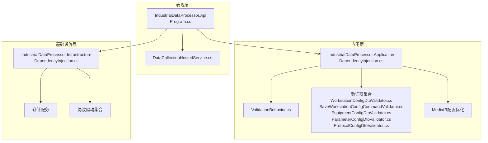
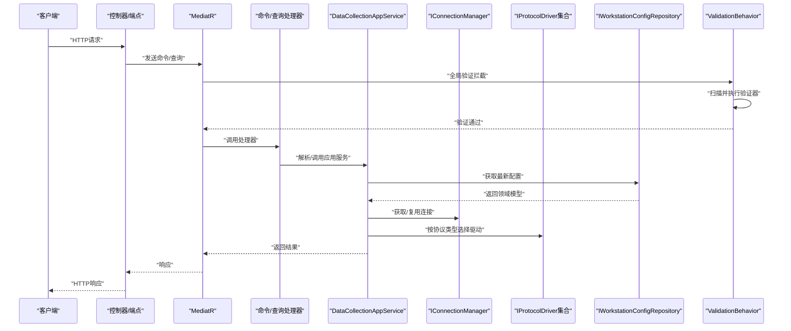
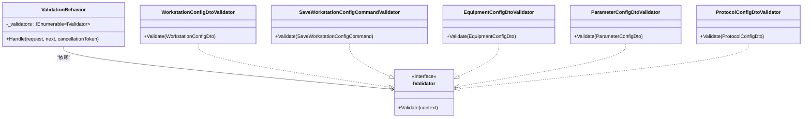

# 依赖注入配置

<cite>
**本文档引用的文件**
- [Program.cs](file://IndustrialDataSolution/IndustrialDataProcessor.Api/Program.cs)
- [DependencyInjection.cs（应用层）](file://IndustrialDataSolution/IndustrialDataProcessor.Application/DependencyInjection.cs)
- [DependencyInjection.cs（基础设施层）](file://IndustrialDataSolution/IndustrialDataProcessor.Infrastructure/DependencyInjection.cs)
- [ValidationBehavior.cs](file://IndustrialDataSolution/IndustrialDataProcessor.Application/Behaviors/ValidationBehavior.cs)
- [WorkstationConfigDtoValidator.cs](file://IndustrialDataSolution/IndustrialDataProcessor.Application/Validators/WorkstationConfigDtoValidator.cs)
- [SaveWorkstationConfigCommandValidator.cs](file://IndustrialDataSolution/IndustrialDataProcessor.Application/Validators/SaveWorkstationConfigCommandValidator.cs)
- [EquipmentConfigDtoValidator.cs](file://IndustrialDataSolution/IndustrialDataProcessor.Application/Validators/EquipmentConfigDtoValidator.cs)
- [ParameterConfigDtoValidator.cs](file://IndustrialDataSolution/IndustrialDataProcessor.Application/Validators/ParameterConfigDtoValidator.cs)
- [ProtocolConfigDtoValidator.cs](file://IndustrialDataSolution/IndustrialDataProcessor.Application/Validators/ProtocolConfigDtoValidator.cs)
- [IndustrialDataProcessor.Application.csproj](file://IndustrialDataSolution/IndustrialDataProcessor.Application/IndustrialDataProcessor.Application.csproj)
- [IndustrialDataProcessor.Api.csproj](file://IndustrialDataSolution/IndustrialDataProcessor.Api/IndustrialDataProcessor.Api.csproj)
</cite>

## 更新摘要
**所做更改**
- 新增验证器自动扫描与ValidationBehavior拦截器集成配置
- 完善FluentValidation与MediatR的全局验证拦截机制
- 增强依赖注入配置的完整性和可维护性

## 目录
1. [引言](#引言)
2. [项目结构](#项目结构)
3. [核心组件](#核心组件)
4. [架构总览](#架构总览)
5. [详细组件分析](#详细组件分析)
6. [验证器体系与全局拦截](#验证器体系与全局拦截)
7. [依赖分析](#依赖分析)
8. [性能考虑](#性能考虑)
9. [故障排查指南](#故障排查指南)
10. [结论](#结论)
11. [附录](#附录)

## 引言
本文件围绕DDD工业数据处理解决方案的依赖注入（DI）配置展开，系统性阐述IServiceCollection扩展方法的使用、注册模式与生命周期策略，对比应用层与基础设施层的服务注册差异，说明接口与实现的绑定策略及跨层依赖处理方式。文档还涵盖AutoMapper、FluentValidation、MediatR等第三方库的集成要点，给出最佳实践示例路径、循环依赖规避方法、性能优化技巧，并讨论DI在测试中的应用与Mock策略，最后总结DI对系统可测试性与可维护性的提升。

## 项目结构
本项目采用多层架构与清晰的项目划分：
- 表现层：IndustrialDataProcessor.Api（ASP.NET Core Web API）
- 应用层：IndustrialDataProcessor.Application（业务编排、验证行为、MediatR注册）
- 领域层：IndustrialDataProcessor.Domain（领域模型、接口与枚举）
- 基础设施层：IndustrialDataProcessor.Infrastructure（通信、驱动、后台服务、OPC UA、JSON序列化、SqlSugar持久化）

**图表来源**
- [Program.cs:17-24](file://IndustrialDataSolution/IndustrialDataProcessor.Api/Program.cs#L17-L24)
- [DependencyInjection.cs（应用层）:15-42](file://IndustrialDataSolution/IndustrialDataProcessor.Application/DependencyInjection.cs#L15-L42)
- [DependencyInjection.cs（基础设施层）:19-57](file://IndustrialDataSolution/IndustrialDataProcessor.Infrastructure/DependencyInjection.cs#L19-L57)

**章节来源**
- [Program.cs:17-24](file://IndustrialDataSolution/IndustrialDataProcessor.Api/Program.cs#L17-L24)
- [IndustrialDataProcessor.Application.csproj:9-16](file://IndustrialDataSolution/IndustrialDataProcessor.Application/IndustrialDataProcessor.Application.csproj#L9-L16)
- [IndustrialDataProcessor.Infrastructure.csproj:9-19](file://IndustrialDataSolution/IndustrialDataProcessor.Infrastructure/IndustrialDataProcessor.Infrastructure.csproj#L9-L19)
- [IndustrialDataProcessor.Api.csproj:9-12](file://IndustrialDataSolution/IndustrialDataProcessor.Api/IndustrialDataProcessor.Api.csproj#L9-L12)

## 核心组件
- 应用层DI扩展：注册验证器、应用服务、任务管理器、进程内消息通道、**【重要更新】优化后的MediatR配置**（仅扫描应用层程序集）与全局验证行为。
- 基础设施层DI扩展：配置SqlSugar数据库客户端、授权校验、仓储、连接管理器、后台服务、设备数据处理器、协议驱动自动注册、JSON序列化选项。
- 表现层入口：Program.cs统一注册各层DI，构建WebApplicationBuilder并装配中间件，注册DataCollectionHostedService作为后台托管服务。

**章节来源**
- [DependencyInjection.cs（应用层）:15-42](file://IndustrialDataSolution/IndustrialDataProcessor.Application/DependencyInjection.cs#L15-L42)
- [DependencyInjection.cs（基础设施层）:24-57](file://IndustrialDataSolution/IndustrialDataProcessor.Infrastructure/DependencyInjection.cs#L24-L57)
- [Program.cs:17-24](file://IndustrialDataSolution/IndustrialDataProcessor.Api/Program.cs#L17-L24)

## 架构总览
下图展示了从请求到应用服务再到基础设施与持久化的典型调用链路，以及DI容器如何在各层之间传递依赖。

**图表来源**
- [Program.cs:17-24](file://IndustrialDataSolution/IndustrialDataProcessor.Api/Program.cs#L17-L24)
- [DependencyInjection.cs（应用层）:28-38](file://IndustrialDataSolution/IndustrialDataProcessor.Application/DependencyInjection.cs#L28-L38)
- [ValidationBehavior.cs:9-30](file://IndustrialDataSolution/IndustrialDataProcessor.Application/Behaviors/ValidationBehavior.cs#L9-L30)

## 详细组件分析

### 应用层依赖注入与生命周期
- 验证器注册：使用`AddValidatorsFromAssemblyContaining`自动扫描验证器，确保命令/DTO验证器在MediatR管线前生效。
- 应用服务：IDataCollectionAppService注册为Scoped，因依赖仓储（Scoped）。
- 任务管理器：ICollectionTaskManager注册为Singleton，配合IServiceScopeFactory在运行时创建短生命周期作用域。
- 进程内消息通道：DataCollectionChannel注册为Singleton，作为轻量级进程内事件总线。
- **【重要更新】MediatR配置优化**：注册服务并附加ValidationBehavior开放泛型行为，**【关键改进】**明确指定只扫描应用层程序集，避免重复注册和潜在的性能问题。
- 生命周期选择依据：
  - Scoped：应用服务与仓储一致，避免跨请求污染状态。
  - Singleton：无状态工具类、通道、任务管理器与OPC UA托管服务实例。
  - Transient：SqlSugar客户端按需创建，适合短生命周期上下文。

**章节来源**
- [DependencyInjection.cs（应用层）:15-42](file://IndustrialDataSolution/IndustrialDataProcessor.Application/DependencyInjection.cs#L15-L42)
- [ValidationBehavior.cs:9-30](file://IndustrialDataSolution/IndustrialDataProcessor.Application/Behaviors/ValidationBehavior.cs#L9-L30)

### 基础设施层依赖注入与生命周期
- 数据库客户端配置：ConfigureSqlSugar方法按配置字符串创建SqlSugar客户端，设置PostgreSQL数据库类型，启用自动关闭连接，配置PgSqlIsAutoToLower=false。
- 授权校验：启动阶段读取配置并校验第三方库授权码，失败即终止启动，确保合规使用。
- 仓储注册：IWorkstationConfigRepository注册为Scoped（负责JSON解析），IWorkstationConfigPersistenceRepository注册为Scoped（实体仓储），IEquipmentDataStorageRepository注册为Singleton（设备数据存储）。
- 连接管理器：IConnectionManager注册为Singleton，提供连接复用与自动重连能力。
- 后台服务注册：设备数据采集后台服务和OPC UA托管服务通过AddHostedService注册，生命周期由Host管理。
- 设备数据处理器：IEquipmentDataProcessor、PointExpressionConverter、VirtualPointCalculator注册为Singleton。
- **【重要更新】协议驱动自动注册**：动态扫描实现IProtocolDriver的非抽象类并注册为Singleton，便于扩展。
- JSON序列化：注册自定义JsonSerializerOptions，包含多态转换器，确保配置反序列化正确。
- 生命周期选择依据：
  - Scoped：仓储与依赖DbContext的作用域一致。
  - Singleton：无状态驱动、连接管理器、OPC UA托管服务实例、序列化选项工厂、设备数据处理器。
  - Transient：SqlSugar客户端按需创建。

**章节来源**
- [DependencyInjection.cs（基础设施层）:62-82](file://IndustrialDataSolution/IndustrialDataProcessor.Infrastructure/DependencyInjection.cs#L62-L82)
- [DependencyInjection.cs（基础设施层）:101-111](file://IndustrialDataSolution/IndustrialDataProcessor.Infrastructure/DependencyInjection.cs#L101-L111)
- [DependencyInjection.cs（基础设施层）:116-125](file://IndustrialDataSolution/IndustrialDataProcessor.Infrastructure/DependencyInjection.cs#L116-L125)
- [DependencyInjection.cs（基础设施层）:130-135](file://IndustrialDataSolution/IndustrialDataProcessor.Infrastructure/DependencyInjection.cs#L130-L135)
- [DependencyInjection.cs（基础设施层）:149-158](file://IndustrialDataSolution/IndustrialDataProcessor.Infrastructure/DependencyInjection.cs#L149-L158)
- [DependencyInjection.cs（基础设施层）:252-266](file://IndustrialDataSolution/IndustrialDataProcessor.Infrastructure/DependencyInjection.cs#L252-L266)

### 表现层入口与中间件装配
- 统一注册：在Program.cs中按顺序注册基础设施层、应用层、后台托管服务。
- 后台托管服务：在应用层与基础设施层注册完成后，再注册DataCollectionHostedService。
- 中间件：日志中间件、异常处理中间件、健康检查、Swagger与授权。

**章节来源**
- [Program.cs:17-24](file://IndustrialDataSolution/IndustrialDataProcessor.Api/Program.cs#L17-L24)
- [Program.cs](file://IndustrialDataSolution/IndustrialDataProcessor.Api/Program.cs#L24)

### 验证行为与全局拦截
- ValidationBehavior：拦截所有进入MediatR的请求，批量执行FluentValidation验证器，聚合错误后抛出异常，未通过则阻断后续处理。
- **【重要更新】配置优化**：在应用层DI中通过AddOpenBehavior附加到MediatR配置，**【关键改进】**只扫描应用层程序集，避免重复注册。
- 注册位置：在应用层DI中配置。

**章节来源**
- [ValidationBehavior.cs:9-30](file://IndustrialDataSolution/IndustrialDataProcessor.Application/Behaviors/ValidationBehavior.cs#L9-L30)
- [DependencyInjection.cs（应用层）:28-38](file://IndustrialDataSolution/IndustrialDataProcessor.Application/DependencyInjection.cs#L28-L38)

## 验证器体系与全局拦截

### 验证器自动扫描机制
应用层通过`AddValidatorsFromAssemblyContaining<WorkstationConfigDtoValidator>()`实现验证器的自动扫描注册，确保所有继承自AbstractValidator<T>的验证器都被自动发现和注册。

### 全局验证拦截器
ValidationBehavior作为MediatR的管道拦截器，实现了以下功能：
- 扫描所有针对请求类型的验证器
- 并行执行所有验证器的验证逻辑
- 聚合验证失败结果并统一抛出ValidationException
- 验证通过后继续执行后续处理器

### 验证器层次结构
项目包含完整的验证器层次结构：

#### 命令级验证器
- **SaveWorkstationConfigCommandValidator**：验证保存工作站配置命令的完整性

#### DTO级验证器
- **WorkstationConfigDtoValidator**：验证工作站配置DTO的协议列表有效性
- **EquipmentConfigDtoValidator**：验证设备配置DTO的设备ID、类型等基础字段
- **ParameterConfigDtoValidator**：验证参数配置DTO的数据类型、地址、数值范围等
- **ProtocolConfigDtoValidator**：验证协议配置DTO的接口类型、协议类型、连接参数等

#### 协议特性驱动验证
验证器采用协议特性驱动的动态验证机制，根据不同的协议类型（LAN、COM、DATABASE、API）进行针对性验证，包括：
- 接口类型与协议类型的兼容性验证
- IP地址、端口、串口参数的有效性验证
- 数据库连接字符串的解析和验证
- API请求方法和地址的验证

**章节来源**
- [DependencyInjection.cs（应用层）:17-19](file://IndustrialDataSolution/IndustrialDataProcessor.Application/DependencyInjection.cs#L17-L19)
- [ValidationBehavior.cs:9-30](file://IndustrialDataSolution/IndustrialDataProcessor.Application/Behaviors/ValidationBehavior.cs#L9-L30)
- [SaveWorkstationConfigCommandValidator.cs:9-18](file://IndustrialDataSolution/IndustrialDataProcessor.Application/Validators/SaveWorkstationConfigCommandValidator.cs#L9-L18)
- [WorkstationConfigDtoValidator.cs:11-24](file://IndustrialDataSolution/IndustrialDataProcessor.Application/Validators/WorkstationConfigDtoValidator.cs#L11-L24)
- [EquipmentConfigDtoValidator.cs:9-46](file://IndustrialDataSolution/IndustrialDataProcessor.Application/Validators/EquipmentConfigDtoValidator.cs#L9-L46)
- [ParameterConfigDtoValidator.cs:12-139](file://IndustrialDataSolution/IndustrialDataProcessor.Application/Validators/ParameterConfigDtoValidator.cs#L12-L139)
- [ProtocolConfigDtoValidator.cs:11-201](file://IndustrialDataSolution/IndustrialDataProcessor.Application/Validators/ProtocolConfigDtoValidator.cs#L11-L201)

### MediatR配置优化与项目引用管理
- **【重要更新】MediatR配置优化**：在应用层DependencyInjection中，明确指定只扫描应用层程序集（typeof(DependencyInjection).Assembly），避免使用RegisterServicesFromAssemblyContaining可能带来的重复扫描问题。
- **【重要更新】项目引用管理**：表现层项目文件中注释说明MediatR已通过Application项目传递引用，无需在表现层重复添加，体现了良好的依赖层次管理。
- **【重要更新】版本管理**：应用层使用MediatR 14.0.0版本，确保与FluentValidation的兼容性。
- **【重要更新】集成效果**：通过AddOpenBehavior注册ValidationBehavior，形成全局验证拦截，提升请求处理的一致性与可靠性。

**章节来源**
- [DependencyInjection.cs（应用层）:28-38](file://IndustrialDataSolution/IndustrialDataProcessor.Application/DependencyInjection.cs#L28-L38)
- [IndustrialDataProcessor.Api.csproj:10-10](file://IndustrialDataSolution/IndustrialDataProcessor.Api/IndustrialDataProcessor.Api.csproj#L10-L10)
- [IndustrialDataProcessor.Application.csproj:12-12](file://IndustrialDataSolution/IndustrialDataProcessor.Application/IndustrialDataProcessor.Application.csproj#L12-L12)

## 依赖分析
- 层间依赖方向：表现层依赖应用层；应用层依赖领域层与基础设施层；基础设施层依赖领域层。
- 接口与实现绑定：应用层通过接口解耦仓储与驱动；基础设施层通过接口暴露连接管理器与OPC UA服务。
- 循环依赖规避：通过接口隔离与作用域限定避免循环；应用服务与任务管理器均以接口形式注入，避免直接相互引用。
- **【重要更新】第三方库集成优化**：
  - FluentValidation：自动扫描验证器，结合ValidationBehavior实现全局验证。
  - **【重要更新】MediatR**：通过优化的程序集扫描策略，仅注册应用层相关服务，避免重复注册和性能问题。
  - SqlSugar：用于PostgreSQL数据库连接，支持自动关闭连接和配置更多设置。
  - HslCommunication：用于各种工业通信协议，需要授权码验证。

**图表来源**
- [ValidationBehavior.cs:9-30](file://IndustrialDataSolution/IndustrialDataProcessor.Application/Behaviors/ValidationBehavior.cs#L9-L30)
- [WorkstationConfigDtoValidator.cs:11-24](file://IndustrialDataSolution/IndustrialDataProcessor.Application/Validators/WorkstationConfigDtoValidator.cs#L11-L24)
- [SaveWorkstationConfigCommandValidator.cs:9-18](file://IndustrialDataSolution/IndustrialDataProcessor.Application/Validators/SaveWorkstationConfigCommandValidator.cs#L9-L18)
- [EquipmentConfigDtoValidator.cs:9-46](file://IndustrialDataSolution/IndustrialDataProcessor.Application/Validators/EquipmentConfigDtoValidator.cs#L9-L46)
- [ParameterConfigDtoValidator.cs:12-139](file://IndustrialDataSolution/IndustrialDataProcessor.Application/Validators/ParameterConfigDtoValidator.cs#L12-L139)
- [ProtocolConfigDtoValidator.cs:11-201](file://IndustrialDataSolution/IndustrialDataProcessor.Application/Validators/ProtocolConfigDtoValidator.cs#L11-L201)

## 性能考虑
- 生命周期优化
  - 无状态工具类与处理器注册为Singleton（如协议驱动、设备数据处理器、任务管理器、JSON序列化选项工厂），减少实例化开销。
  - 应用服务与仓储注册为Scoped，避免跨请求共享状态，降低锁竞争与上下文污染风险。
  - SqlSugar客户端注册为Transient，按需创建，适合短生命周期上下文。
- **【重要更新】数据库连接池优化**：SqlSugar配置了连接池参数，包括最小池大小、最大池大小、连接生命周期和命令超时时间。
- 并发与隔离
  - 应用服务内部为每个协议创建独立后台循环，彼此互不影响，降低耦合与故障传播。
  - 使用CancellationToken与finally块确保资源释放与状态收尾。
- **【重要更新】协议驱动并发控制**：BaseProtocolDriver通过连接句柄的AcquireLockAsync确保同一串口/TCP通道不会发生并发冲突。
- 序列化与解析
  - 在基础设施层统一配置JsonSerializerOptions与多态转换器，避免重复初始化。
- 启动期校验
  - 基础设施层在启动阶段校验第三方库授权码，失败即终止，避免运行期资源浪费。
- **【重要更新】MediatR性能优化**：通过限制程序集扫描范围，减少启动时间和内存占用，避免重复注册导致的性能问题。
- **【重要更新】验证器并行执行**：ValidationBehavior使用Task.WhenAll并行执行多个验证器，提升验证效率。

**章节来源**
- [DependencyInjection.cs（基础设施层）:67-81](file://IndustrialDataSolution/IndustrialDataProcessor.Infrastructure/DependencyInjection.cs#L67-L81)
- [ValidationBehavior.cs:18-25](file://IndustrialDataSolution/IndustrialDataProcessor.Application/Behaviors/ValidationBehavior.cs#L18-L25)

## 故障排查指南
- 启动失败：若基础设施层未配置授权码或授权失败，将抛出异常并终止启动。请检查配置节点与授权码有效性。
- **【重要更新】数据库连接问题**：SqlSugar客户端配置错误会导致数据库操作失败。检查连接字符串、数据库类型和连接池设置。
- 验证失败：ValidationBehavior会收集所有验证器的错误并统一抛出异常。请根据异常信息定位具体命令/DTO的验证规则。
- 连接问题：IConnectionManager负责连接复用与自动重连。若出现连接异常，检查协议配置、网络连通性与底层驱动实现。
- **【重要更新】协议驱动问题**：BaseProtocolDriver的连接锁机制可能导致死锁。检查连接句柄的正确使用和异常处理。
- 任务重启：CollectionTaskManager通过IServiceScopeFactory创建作用域解析应用服务，确保DbContext等Scoped服务可用。若任务无法重启，检查作用域创建与取消令牌传递。
- 数据解析：WorkstationConfigRepository在基础设施层完成JSON到领域模型的转换。若解析失败，检查配置内容与多态转换器注册。
- **【重要更新】MediatR配置问题**：如果出现请求处理异常或验证行为不生效，检查应用层MediatR配置是否正确，确认只扫描了应用层程序集且ValidationBehavior已正确注册。
- **【重要更新】验证器扫描问题**：如果验证器未被扫描到，检查验证器是否正确继承AbstractValidator<T>且位于应用层程序集中。

**章节来源**
- [DependencyInjection.cs（基础设施层）:87-96](file://IndustrialDataSolution/IndustrialDataProcessor.Infrastructure/DependencyInjection.cs#L87-L96)
- [ValidationBehavior.cs:23-25](file://IndustrialDataSolution/IndustrialDataProcessor.Application/Behaviors/ValidationBehavior.cs#L23-L25)
- [DependencyInjection.cs（应用层）:17-19](file://IndustrialDataSolution/IndustrialDataProcessor.Application/DependencyInjection.cs#L17-L19)

## 结论
本项目的依赖注入配置遵循DDD分层原则，通过接口与实现分离、明确的生命周期策略与全局验证拦截，实现了高内聚、低耦合与强可测试性。**【重要更新】应用层MediatR配置的优化通过限制程序集扫描范围，显著提升了启动性能并避免了重复注册问题。** **【重要更新】验证器自动扫描与ValidationBehavior拦截器的集成，形成了完整的请求验证体系，确保了数据的完整性和系统的稳定性。** 基础设施层的重构引入了SqlSugar数据库客户端、自动协议驱动注册机制、设备数据处理器和后台托管服务，大大增强了系统的可扩展性和可维护性。应用层与基础设施层的职责边界清晰，MediatR与FluentValidation的集成提升了请求处理的一致性与可靠性。通过Singleton无状态组件与Scoped应用服务的组合，既保证了性能又避免了状态污染。**【重要更新】项目引用管理的优化体现了良好的软件工程实践，避免了重复依赖和版本冲突问题。** 建议在引入AutoMapper时采用Profile与Mapper注册扩展方法，并在测试中优先使用接口Mock与内存仓储替代真实依赖，进一步增强可测试性与可维护性。

## 附录
- 第三方库集成清单
  - FluentValidation：自动扫描验证器，结合ValidationBehavior实现全局验证。
  - **【重要更新】MediatR**：通过优化的程序集扫描策略，仅注册应用层相关服务，避免重复注册和性能问题。
  - SqlSugar：用于PostgreSQL数据库连接，支持自动关闭连接和配置更多设置。
  - HslCommunication：用于各种工业通信协议，需要授权码验证。
  - AutoMapper：未在本项目中直接使用，如需可在应用层通过扩展方法注册Profile与Mapper。
- 最佳实践示例路径
  - 应用层验证器注册与全局行为：[DependencyInjection.cs（应用层）:17-38](file://IndustrialDataSolution/IndustrialDataProcessor.Application/DependencyInjection.cs#L17-L38)
  - 验证器层次结构：[WorkstationConfigDtoValidator.cs:11-24](file://IndustrialDataSolution/IndustrialDataProcessor.Application/Validators/WorkstationConfigDtoValidator.cs#L11-L24)，[EquipmentConfigDtoValidator.cs:9-46](file://IndustrialDataSolution/IndustrialDataProcessor.Application/Validators/EquipmentConfigDtoValidator.cs#L9-L46)，[ParameterConfigDtoValidator.cs:12-139](file://IndustrialDataSolution/IndustrialDataProcessor.Application/Validators/ParameterConfigDtoValidator.cs#L12-L139)，[ProtocolConfigDtoValidator.cs:11-201](file://IndustrialDataSolution/IndustrialDataProcessor.Application/Validators/ProtocolConfigDtoValidator.cs#L11-L201)
  - 应用服务与任务管理器：[DataCollectionAppService.cs:10-17](file://IndustrialDataSolution/IndustrialDataProcessor.Application/Services/DataCollectionAppService.cs#L10-L17)，[CollectionTaskManager.cs:6-59](file://IndustrialDataSolution/IndustrialDataProcessor.Application/Services/CollectionTaskManager.cs#L6-L59)
  - 基础设施层数据库配置与仓储注册：[DependencyInjection.cs（基础设施层）:62-111](file://IndustrialDataSolution/IndustrialDataProcessor.Infrastructure/DependencyInjection.cs#L62-L111)
  - 基础设施层后台服务与协议驱动注册：[DependencyInjection.cs（基础设施层）:116-158](file://IndustrialDataSolution/IndustrialDataProcessor.Infrastructure/DependencyInjection.cs#L116-L158)
  - 表现层入口与中间件：[Program.cs:17-24](file://IndustrialDataSolution/IndustrialDataProcessor.Api/Program.cs#L17-L24)
  - **【重要更新】MediatR配置优化**：[DependencyInjection.cs（应用层）:28-38](file://IndustrialDataSolution/IndustrialDataProcessor.Application/DependencyInjection.cs#L28-L38)
  - **【重要更新】项目引用管理**：[IndustrialDataProcessor.Api.csproj:10-10](file://IndustrialDataSolution/IndustrialDataProcessor.Api/IndustrialDataProcessor.Api.csproj#L10-L10)