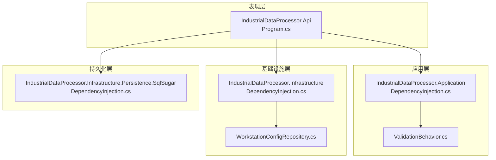
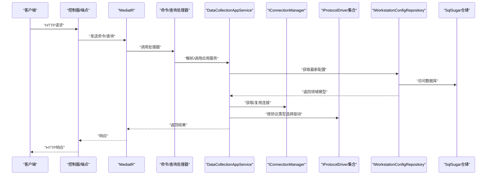
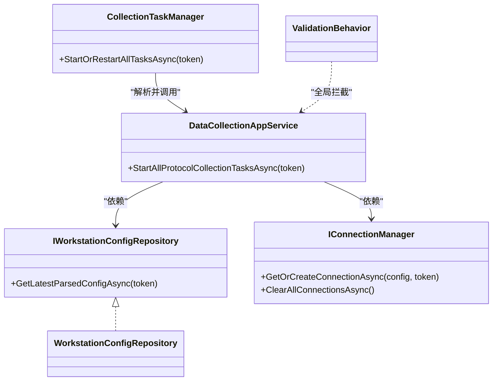

# 依赖注入配置

<cite>
**本文引用的文件**
- [Program.cs](file://IndustrialDataSolution/IndustrialDataProcessor.Api/Program.cs)
- [DependencyInjection.cs（应用层）](file://IndustrialDataSolution/IndustrialDataProcessor.Application/DependencyInjection.cs)
- [DependencyInjection.cs（基础设施层）](file://IndustrialDataSolution/IndustrialDataProcessor.Infrastructure/DependencyInjection.cs)
- [DependencyInjection.cs（持久化层）](file://IndustrialDataSolution/IndustrialDataProcessor.Infrastructure.Persistence.SqlSugar/DependencyInjection.cs)
- [ValidationBehavior.cs](file://IndustrialDataSolution/IndustrialDataProcessor.Application/Behaviors/ValidationBehavior.cs)
- [DataCollectionAppService.cs](file://IndustrialDataSolution/IndustrialDataProcessor.Application/Services/DataCollectionAppService.cs)
- [CollectionTaskManager.cs](file://IndustrialDataSolution/IndustrialDataProcessor.Application/Services/CollectionTaskManager.cs)
- [WorkstationConfigRepository.cs](file://IndustrialDataSolution/IndustrialDataProcessor.Infrastructure/Repositories/WorkstationConfigRepository.cs)
- [IWorkstationConfigRepository.cs](file://IndustrialDataSolution/IndustrialDataProcessor.Domain/Repositories/IWorkstationConfigRepository.cs)
- [IConnectionManager.cs](file://IndustrialDataSolution/IndustrialDataProcessor.Domain/Communication/IConnection/IConnectionManager.cs)
- [IDataCollectionAppService.cs](file://IndustrialDataSolution/IndustrialDataProcessor.Application/Services/IDataCollectionAppService.cs)
- [ICollectionTaskManager.cs](file://IndustrialDataSolution/IndustrialDataProcessor.Application/Services/ICollectionTaskManager.cs)
- [IndustrialDataProcessor.Application.csproj](file://IndustrialDataSolution/IndustrialDataProcessor.Application/IndustrialDataProcessor.Application.csproj)
- [IndustrialDataProcessor.Infrastructure.csproj](file://IndustrialDataSolution/IndustrialDataProcessor.Infrastructure/IndustrialDataProcessor.Infrastructure.csproj)
- [IndustrialDataProcessor.Api.csproj](file://IndustrialDataSolution/IndustrialDataProcessor.Api/IndustrialDataProcessor.Api.csproj)
</cite>

## 目录
1. [引言](#引言)
2. [项目结构](#项目结构)
3. [核心组件](#核心组件)
4. [架构总览](#架构总览)
5. [详细组件分析](#详细组件分析)
6. [依赖分析](#依赖分析)
7. [性能考虑](#性能考虑)
8. [故障排查指南](#故障排查指南)
9. [结论](#结论)
10. [附录](#附录)

## 引言
本文件围绕DDD工业数据处理解决方案的依赖注入（DI）配置展开，系统性阐述IServiceCollection扩展方法的使用、注册模式与生命周期策略，对比应用层与基础设施层的服务注册差异，说明接口与实现的绑定策略及跨层依赖处理方式。文档还涵盖AutoMapper、FluentValidation、MediatR等第三方库的集成要点，给出最佳实践示例路径、循环依赖规避方法、性能优化技巧，并讨论DI在测试中的应用与Mock策略，最后总结DI对系统可测试性与可维护性的提升。

## 项目结构
本项目采用多层架构与清晰的项目划分：
- 表现层：IndustrialDataProcessor.Api（ASP.NET Core Web API）
- 应用层：IndustrialDataProcessor.Application（业务编排、验证行为、MediatR注册）
- 领域层：IndustrialDataProcessor.Domain（领域模型、接口与枚举）
- 基础设施层：IndustrialDataProcessor.Infrastructure（通信、驱动、后台服务、OPC UA、JSON序列化）
- 持久化层：IndustrialDataProcessor.Infrastructure.Persistence.SqlSugar（SqlSugar客户端与仓储实现）

图表来源
- [Program.cs](file://IndustrialDataSolution/IndustrialDataProcessor.Api/Program.cs#L10-L30)
- [DependencyInjection.cs（应用层）](file://IndustrialDataSolution/IndustrialDataProcessor.Application/DependencyInjection.cs#L16-L39)
- [DependencyInjection.cs（基础设施层）](file://IndustrialDataSolution/IndustrialDataProcessor.Infrastructure/DependencyInjection.cs#L17-L79)
- [DependencyInjection.cs（持久化层）](file://IndustrialDataSolution/IndustrialDataProcessor.Infrastructure.Persistence.SqlSugar/DependencyInjection.cs#L11-L46)
- [WorkstationConfigRepository.cs](file://IndustrialDataSolution/IndustrialDataProcessor.Infrastructure/Repositories/WorkstationConfigRepository.cs#L8-L42)
- [ValidationBehavior.cs](file://IndustrialDataSolution/IndustrialDataProcessor.Application/Behaviors/ValidationBehavior.cs#L9-L30)

章节来源
- [Program.cs](file://IndustrialDataSolution/IndustrialDataProcessor.Api/Program.cs#L10-L30)
- [IndustrialDataProcessor.Application.csproj](file://IndustrialDataSolution/IndustrialDataProcessor.Application/IndustrialDataProcessor.Application.csproj#L9-L16)
- [IndustrialDataProcessor.Infrastructure.csproj](file://IndustrialDataSolution/IndustrialDataProcessor.Infrastructure/IndustrialDataProcessor.Infrastructure.csproj#L9-L19)
- [IndustrialDataProcessor.Api.csproj](file://IndustrialDataSolution/IndustrialDataProcessor.Api/IndustrialDataProcessor.Api.csproj#L9-L12)

## 核心组件
- 应用层DI扩展：注册验证器、应用服务、任务管理器、进程内消息通道、MediatR与全局验证行为。
- 基础设施层DI扩展：授权校验、仓储、连接管理器、后台服务、OPC UA托管服务、协议驱动集合、JSON序列化选项。
- 持久化层DI扩展：基于配置注册SqlSugar客户端、注入仓储实现。
- 表现层入口：Program.cs统一注册各层DI，构建WebApplicationBuilder并装配中间件。

章节来源
- [DependencyInjection.cs（应用层）](file://IndustrialDataSolution/IndustrialDataProcessor.Application/DependencyInjection.cs#L16-L39)
- [DependencyInjection.cs（基础设施层）](file://IndustrialDataSolution/IndustrialDataProcessor.Infrastructure/DependencyInjection.cs#L17-L79)
- [DependencyInjection.cs（持久化层）](file://IndustrialDataSolution/IndustrialDataProcessor.Infrastructure.Persistence.SqlSugar/DependencyInjection.cs#L11-L46)
- [Program.cs](file://IndustrialDataSolution/IndustrialDataProcessor.Api/Program.cs#L10-L30)

## 架构总览
下图展示了从请求到应用服务再到基础设施与持久化的典型调用链路，以及DI容器如何在各层之间传递依赖。

图表来源
- [Program.cs](file://IndustrialDataSolution/IndustrialDataProcessor.Api/Program.cs#L18-L25)
- [DependencyInjection.cs（应用层）](file://IndustrialDataSolution/IndustrialDataProcessor.Application/DependencyInjection.cs#L23-L29)
- [DataCollectionAppService.cs](file://IndustrialDataSolution/IndustrialDataProcessor.Application/Services/DataCollectionAppService.cs#L10-L17)
- [WorkstationConfigRepository.cs](file://IndustrialDataSolution/IndustrialDataProcessor.Infrastructure/Repositories/WorkstationConfigRepository.cs#L23-L42)
- [IWorkstationConfigRepository.cs](file://IndustrialDataSolution/IndustrialDataProcessor.Domain/Repositories/IWorkstationConfigRepository.cs#L5-L11)
- [IConnectionManager.cs](file://IndustrialDataSolution/IndustrialDataProcessor.Domain/Communication/IConnection/IConnectionManager.cs#L5-L18)

## 详细组件分析

### 应用层依赖注入与生命周期
- 验证器注册：使用自动扫描注册，确保命令/DTO验证器在MediatR管线前生效。
- 应用服务：IDataCollectionAppService注册为Scoped，因依赖仓储（Scoped）。
- 任务管理器：ICollectionTaskManager注册为Singleton，配合IServiceScopeFactory在运行时创建短生命周期作用域。
- 进程内消息通道：DataCollectionChannel注册为Singleton，作为轻量级进程内事件总线。
- MediatR：注册服务并附加ValidationBehavior开放泛型行为，形成全局验证拦截。
- 生命周期选择依据：
  - Scoped：应用服务与仓储一致，避免跨请求污染状态。
  - Singleton：无状态工具类、通道、任务管理器与OPC UA托管服务实例。
  - Transient：SqlSugar客户端按需创建，适合短生命周期上下文。

章节来源
- [DependencyInjection.cs（应用层）](file://IndustrialDataSolution/IndustrialDataProcessor.Application/DependencyInjection.cs#L16-L39)
- [ValidationBehavior.cs](file://IndustrialDataSolution/IndustrialDataProcessor.Application/Behaviors/ValidationBehavior.cs#L9-L30)
- [IDataCollectionAppService.cs](file://IndustrialDataSolution/IndustrialDataProcessor.Application/Services/IDataCollectionAppService.cs#L6-L12)
- [ICollectionTaskManager.cs](file://IndustrialDataSolution/IndustrialDataProcessor.Application/Services/ICollectionTaskManager.cs#L3-L6)

### 基础设施层依赖注入与生命周期
- 授权校验：启动阶段读取配置并校验第三方库授权码，失败即终止启动，确保合规使用。
- 仓储：IWorkstationConfigRepository注册为Scoped，负责JSON解析与领域模型转换。
- 连接管理器：IConnectionManager注册为Singleton，提供连接复用与自动重连能力。
- 后台服务：设备数据采集与OPC UA托管服务通过AddHostedService注册，生命周期由Host管理。
- 协议驱动：动态扫描实现IProtocolDriver的非抽象类并注册为Singleton，便于扩展。
- JSON序列化：注册自定义JsonSerializerOptions，包含多态转换器，确保配置反序列化正确。
- 生命周期选择依据：
  - Scoped：仓储与依赖DbContext的作用域一致。
  - Singleton：无状态驱动、连接管理器、OPC UA托管服务实例、序列化选项工厂。
  - Transient：SqlSugar客户端按需创建。

章节来源
- [DependencyInjection.cs（基础设施层）](file://IndustrialDataSolution/IndustrialDataProcessor.Infrastructure/DependencyInjection.cs#L17-L79)
- [WorkstationConfigRepository.cs](file://IndustrialDataSolution/IndustrialDataProcessor.Infrastructure/Repositories/WorkstationConfigRepository.cs#L8-L42)
- [IConnectionManager.cs](file://IndustrialDataSolution/IndustrialDataProcessor.Domain/Communication/IConnection/IConnectionManager.cs#L5-L18)

### 持久化层依赖注入与生命周期
- SqlSugar客户端：按配置字符串创建，IsAutoCloseConnection启用，适合请求/作用域内使用。
- 仓储实现：IWorkstationConfigEntityRepository注册为Scoped，IEquipmentDataStorageRepository注册为Singleton。
- 生命周期选择依据：
  - Transient：SqlSugarClient（短生命周期）。
  - Scoped：实体仓储。
  - Singleton：设备数据存储仓储（无状态工具类）。

章节来源
- [DependencyInjection.cs（持久化层）](file://IndustrialDataSolution/IndustrialDataProcessor.Infrastructure.Persistence.SqlSugar/DependencyInjection.cs#L11-L46)

### 表现层入口与中间件装配
- 统一注册：在Program.cs中按顺序注册应用层、基础设施层、持久化层DI。
- 后台服务：在应用层与基础设施层注册完成后，再注册DataCollectionHostedService。
- 中间件：日志中间件、异常处理中间件、健康检查、Swagger与授权。

章节来源
- [Program.cs](file://IndustrialDataSolution/IndustrialDataProcessor.Api/Program.cs#L10-L51)

### 验证行为与全局拦截
- ValidationBehavior：拦截所有进入MediatR的请求，批量执行FluentValidation验证器，聚合错误后抛出异常，未通过则阻断后续处理。
- 注册位置：在应用层DI中通过AddOpenBehavior附加到MediatR配置。

章节来源
- [ValidationBehavior.cs](file://IndustrialDataSolution/IndustrialDataProcessor.Application/Behaviors/ValidationBehavior.cs#L9-L30)
- [DependencyInjection.cs（应用层）](file://IndustrialDataSolution/IndustrialDataProcessor.Application/DependencyInjection.cs#L29-L36)

### 应用服务与后台任务管理
- DataCollectionAppService：依赖仓储、连接管理器、协议驱动集合、日志、进程内通道与设备数据处理器，负责启动并维护每个协议的独立采集循环。
- CollectionTaskManager：通过IServiceScopeFactory在运行时创建作用域解析应用服务，协调任务启动/重启与取消。

章节来源
- [DataCollectionAppService.cs](file://IndustrialDataSolution/IndustrialDataProcessor.Application/Services/DataCollectionAppService.cs#L10-L17)
- [CollectionTaskManager.cs](file://IndustrialDataSolution/IndustrialDataProcessor.Application/Services/CollectionTaskManager.cs#L6-L59)

### 领域与基础设施的仓储契约
- IWorkstationConfigRepository：定义获取并解析最新工作站配置的方法，职责清晰，便于替换实现。
- WorkstationConfigRepository：在基础设施层实现，负责JSON反序列化与多态转换器的应用。

章节来源
- [IWorkstationConfigRepository.cs](file://IndustrialDataSolution/IndustrialDataProcessor.Domain/Repositories/IWorkstationConfigRepository.cs#L5-L11)
- [WorkstationConfigRepository.cs](file://IndustrialDataSolution/IndustrialDataProcessor.Infrastructure/Repositories/WorkstationConfigRepository.cs#L8-L42)

## 依赖分析
- 层间依赖方向：表现层依赖应用层；应用层依赖领域层与基础设施层；基础设施层依赖领域层；持久化层依赖基础设施层与领域层。
- 接口与实现绑定：应用层通过接口解耦仓储与驱动；基础设施层通过接口暴露连接管理器与OPC UA服务；持久化层通过接口暴露实体仓储。
- 循环依赖规避：通过接口隔离与作用域限定避免循环；应用服务与任务管理器均以接口形式注入，避免直接相互引用。
- 第三方库集成：
  - FluentValidation：自动扫描验证器，结合ValidationBehavior实现全局验证。
  - MediatR：注册服务并附加ValidationBehavior，形成统一的请求处理与验证管道。
  - AutoMapper：未在本项目中直接使用，如需可在应用层通过扩展方法注册Profile与Mapper。

图表来源
- [IWorkstationConfigRepository.cs](file://IndustrialDataSolution/IndustrialDataProcessor.Domain/Repositories/IWorkstationConfigRepository.cs#L5-L11)
- [WorkstationConfigRepository.cs](file://IndustrialDataSolution/IndustrialDataProcessor.Infrastructure/Repositories/WorkstationConfigRepository.cs#L8-L42)
- [IConnectionManager.cs](file://IndustrialDataSolution/IndustrialDataProcessor.Domain/Communication/IConnection/IConnectionManager.cs#L5-L18)
- [DataCollectionAppService.cs](file://IndustrialDataSolution/IndustrialDataProcessor.Application/Services/DataCollectionAppService.cs#L10-L17)
- [CollectionTaskManager.cs](file://IndustrialDataSolution/IndustrialDataProcessor.Application/Services/CollectionTaskManager.cs#L6-L59)
- [ValidationBehavior.cs](file://IndustrialDataSolution/IndustrialDataProcessor.Application/Behaviors/ValidationBehavior.cs#L9-L30)

## 性能考虑
- 生命周期优化
  - 无状态工具类与处理器注册为Singleton（如协议驱动、设备数据处理器、任务管理器、JSON序列化选项工厂），减少实例化开销。
  - 应用服务与仓储注册为Scoped，避免跨请求共享状态，降低锁竞争与上下文污染风险。
  - SqlSugar客户端注册为Transient，按需创建，适合短生命周期上下文。
- 并发与隔离
  - 应用服务内部为每个协议创建独立后台循环，彼此互不影响，降低耦合与故障传播。
  - 使用CancellationToken与finally块确保资源释放与状态收尾。
- 序列化与解析
  - 在基础设施层统一配置JsonSerializerOptions与多态转换器，避免重复初始化。
- 启动期校验
  - 基础设施层在启动阶段校验第三方库授权码，失败即终止，避免运行期资源浪费。

章节来源
- [DependencyInjection.cs（基础设施层）](file://IndustrialDataSolution/IndustrialDataProcessor.Infrastructure/DependencyInjection.cs#L17-L79)
- [DependencyInjection.cs（应用层）](file://IndustrialDataSolution/IndustrialDataProcessor.Application/DependencyInjection.cs#L16-L39)
- [DependencyInjection.cs（持久化层）](file://IndustrialDataSolution/IndustrialDataProcessor.Infrastructure.Persistence.SqlSugar/DependencyInjection.cs#L11-L46)
- [DataCollectionAppService.cs](file://IndustrialDataSolution/IndustrialDataProcessor.Application/Services/DataCollectionAppService.cs#L46-L214)

## 故障排查指南
- 启动失败：若基础设施层未配置授权码或授权失败，将抛出异常并终止启动。请检查配置节点与授权码有效性。
- 验证失败：ValidationBehavior会收集所有验证器的错误并统一抛出异常。请根据异常信息定位具体命令/DTO的验证规则。
- 连接问题：IConnectionManager负责连接复用与自动重连。若出现连接异常，检查协议配置、网络连通性与底层驱动实现。
- 任务重启：CollectionTaskManager通过IServiceScopeFactory创建作用域解析应用服务，确保DbContext等Scoped服务可用。若任务无法重启，检查作用域创建与取消令牌传递。
- 数据解析：WorkstationConfigRepository在基础设施层完成JSON到领域模型的转换。若解析失败，检查配置内容与多态转换器注册。

章节来源
- [DependencyInjection.cs（基础设施层）](file://IndustrialDataSolution/IndustrialDataProcessor.Infrastructure/DependencyInjection.cs#L17-L28)
- [ValidationBehavior.cs](file://IndustrialDataSolution/IndustrialDataProcessor.Application/Behaviors/ValidationBehavior.cs#L12-L28)
- [IConnectionManager.cs](file://IndustrialDataSolution/IndustrialDataProcessor.Domain/Communication/IConnection/IConnectionManager.cs#L5-L18)
- [CollectionTaskManager.cs](file://IndustrialDataSolution/IndustrialDataProcessor.Application/Services/CollectionTaskManager.cs#L19-L51)
- [WorkstationConfigRepository.cs](file://IndustrialDataSolution/IndustrialDataProcessor.Infrastructure/Repositories/WorkstationConfigRepository.cs#L23-L42)

## 结论
本项目的依赖注入配置遵循DDD分层原则，通过接口与实现分离、明确的生命周期策略与全局验证拦截，实现了高内聚、低耦合与强可测试性。应用层与基础设施层的职责边界清晰，MediatR与FluentValidation的集成提升了请求处理的一致性与可靠性。通过Singleton无状态组件与Scoped应用服务的组合，既保证了性能又避免了状态污染。建议在引入AutoMapper时采用Profile与Mapper注册扩展方法，并在测试中优先使用接口Mock与内存仓储替代真实依赖，进一步增强可测试性与可维护性。

## 附录
- 第三方库集成清单
  - FluentValidation：自动扫描验证器，结合ValidationBehavior实现全局验证。
  - MediatR：注册服务并附加ValidationBehavior，形成统一请求处理与验证管道。
  - AutoMapper：未在本项目中直接使用，如需可在应用层通过扩展方法注册Profile与Mapper。
- 最佳实践示例路径
  - 应用层验证器注册与全局行为：[DependencyInjection.cs（应用层）](file://IndustrialDataSolution/IndustrialDataProcessor.Application/DependencyInjection.cs#L21-L36)
  - 应用服务与任务管理器：[DataCollectionAppService.cs](file://IndustrialDataSolution/IndustrialDataProcessor.Application/Services/DataCollectionAppService.cs#L10-L17)，[CollectionTaskManager.cs](file://IndustrialDataSolution/IndustrialDataProcessor.Application/Services/CollectionTaskManager.cs#L6-L59)
  - 基础设施层授权与驱动注册：[DependencyInjection.cs（基础设施层）](file://IndustrialDataSolution/IndustrialDataProcessor.Infrastructure/DependencyInjection.cs#L17-L62)
  - 持久化层客户端与仓储：[DependencyInjection.cs（持久化层）](file://IndustrialDataSolution/IndustrialDataProcessor.Infrastructure.Persistence.SqlSugar/DependencyInjection.cs#L11-L46)
  - 表现层入口与中间件：[Program.cs](file://IndustrialDataSolution/IndustrialDataProcessor.Api/Program.cs#L10-L51)