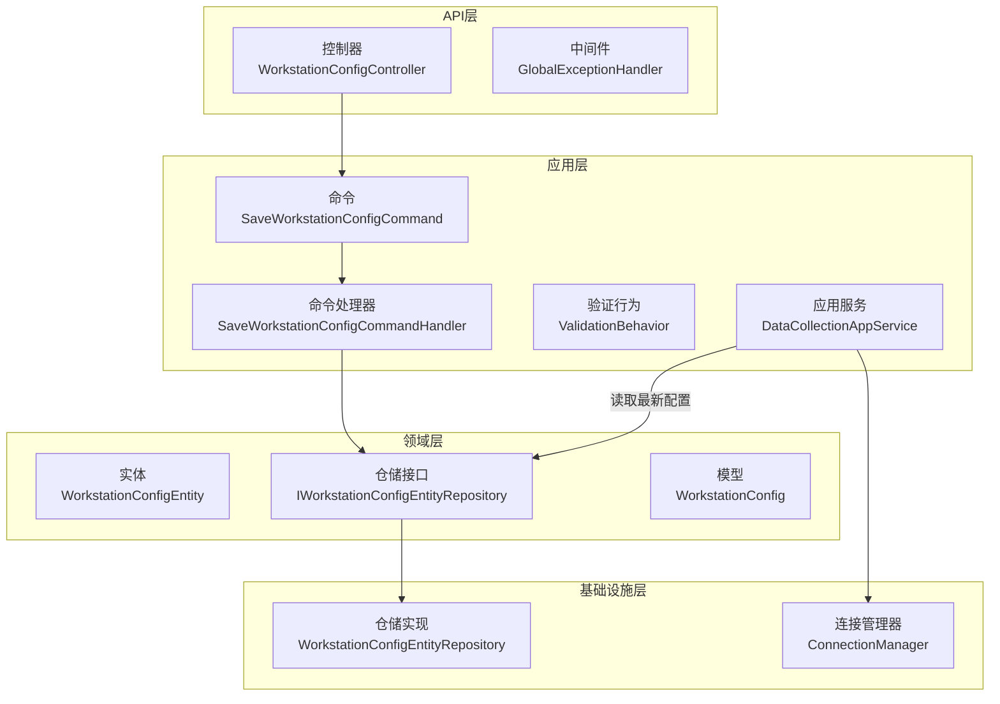
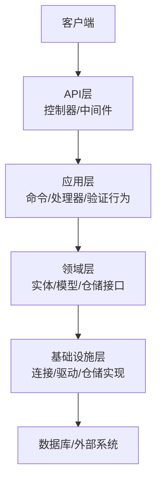
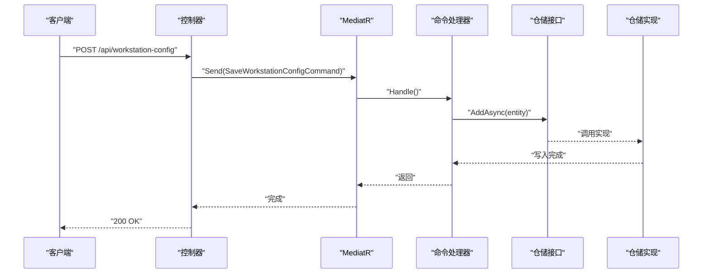
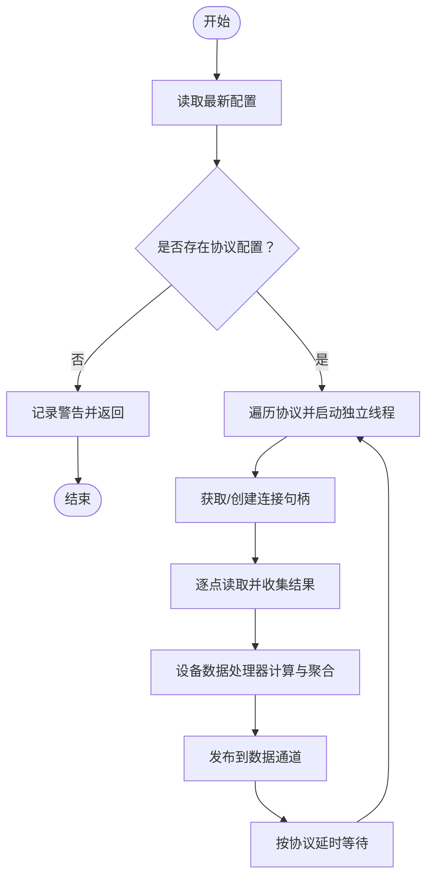
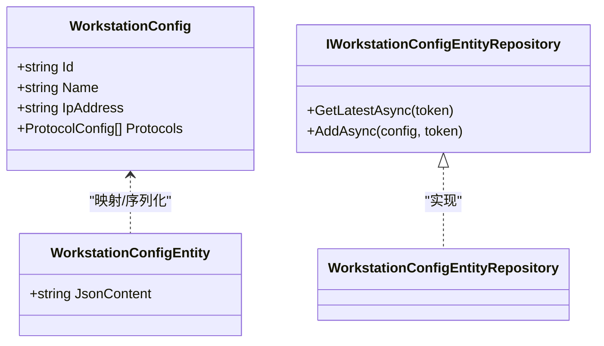
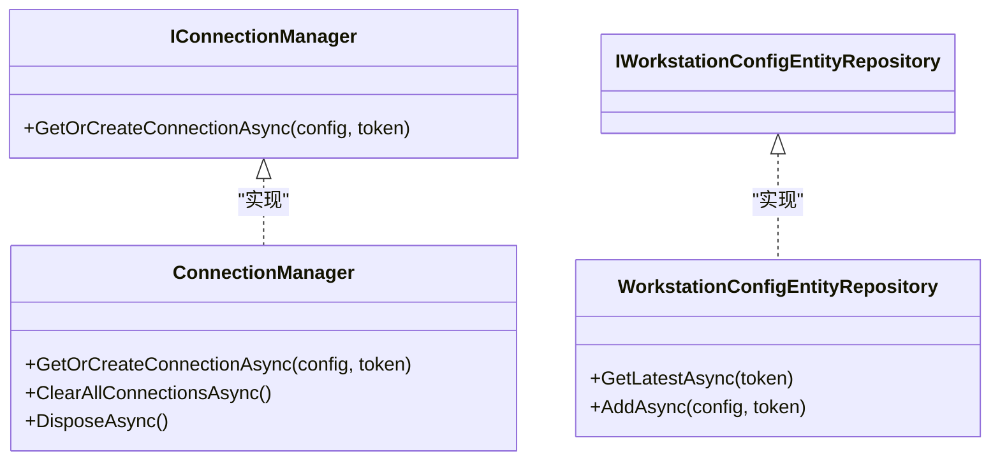
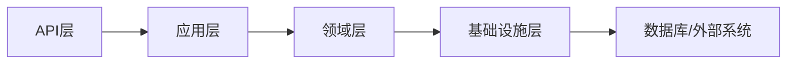

# 分层架构详解

<cite>
**本文档引用的文件**
- [Program.cs](file://IndustrialDataSolution/IndustrialDataProcessor.Api/Program.cs)
- [WorkstationConfigController.cs](file://IndustrialDataSolution/IndustrialDataProcessor.Api/Controllers/WorkstationConfigController.cs)
- [GlobalExceptionHandler.cs](file://IndustrialDataSolution/IndustrialDataProcessor.Api/Middleware/GlobalExceptionHandler.cs)
- [DependencyInjection.cs（应用层）](file://IndustrialDataSolution/IndustrialDataProcessor.Application/DependencyInjection.cs)
- [ValidationBehavior.cs](file://IndustrialDataSolution/IndustrialDataProcessor.Application/Behaviors/ValidationBehavior.cs)
- [SaveWorkstationConfigCommand.cs](file://IndustrialDataSolution/IndustrialDataProcessor.Application/Commands/SaveWorkstationConfigCommand.cs)
- [SaveWorkstationConfigCommandHandler.cs](file://IndustrialDataSolution/IndustrialDataProcessor.Application/CommandHandlers/SaveWorkstationConfigCommandHandler.cs)
- [IDataCollectionAppService.cs](file://IndustrialDataSolution/IndustrialDataProcessor.Application/Services/IDataCollectionAppService.cs)
- [DataCollectionAppService.cs](file://IndustrialDataSolution/IndustrialDataProcessor.Application/Services/DataCollectionAppService.cs)
- [DependencyInjection.cs（基础设施层）](file://IndustrialDataSolution/IndustrialDataProcessor.Infrastructure/DependencyInjection.cs)
- [ConnectionManager.cs](file://IndustrialDataSolution/IndustrialDataProcessor.Infrastructure/Communication/Connection/ConnectionManager.cs)
- [WorkstationConfigEntityRepository.cs](file://IndustrialDataSolution/IndustrialDataProcessor.Infrastructure.Persistence.SqlSugar/Repositories/WorkstationConfigEntityRepository.cs)
- [WorkstationConfig.cs](file://IndustrialDataSolution/IndustrialDataProcessor.Domain/Workstation/Configs/WorkstationConfig.cs)
- [WorkstationConfigEntity.cs](file://IndustrialDataSolution/IndustrialDataProcessor.Domain/Entities/WorkstationConfigEntity.cs)
- [IWorkstationConfigEntityRepository.cs](file://IndustrialDataSolution/IndustrialDataProcessor.Domain/Repositories/IWorkstationConfigEntityRepository.cs)
- [IndustrialDataProcessor.Api.csproj](file://IndustrialDataSolution/IndustrialDataProcessor.Api/IndustrialDataProcessor.Api.csproj)
- [IndustrialDataProcessor.Application.csproj](file://IndustrialDataSolution/IndustrialDataProcessor.Application/IndustrialDataProcessor.Application.csproj)
- [IndustrialDataProcessor.Domain.csproj](file://IndustrialDataSolution/IndustrialDataProcessor.Domain/IndustrialDataProcessor.Domain.csproj)
</cite>

## 目录
1. [引言](#引言)
2. [项目结构](#项目结构)
3. [核心组件](#核心组件)
4. [架构总览](#架构总览)
5. [详细组件分析](#详细组件分析)
6. [依赖分析](#依赖分析)
7. [性能考量](#性能考量)
8. [故障排查指南](#故障排查指南)
9. [结论](#结论)
10. [附录](#附录)

## 引言
本文件面向DDD工业数据处理解决方案，系统化阐述四层架构（API层、应用层、领域层、基础设施层）的设计理念与实现细节。重点说明：
- 各层职责边界与交互方式
- 层间依赖关系与数据流向
- 如何通过分层实现关注点分离、可测试性与可维护性
- 层间调用模式与接口设计最佳实践
- 常见反模式与规避策略

## 项目结构
该项目采用多项目解决方案，按职责划分为四层：
- API层：ASP.NET Core Web API，负责HTTP请求入口、中间件与健康检查
- 应用层：应用服务、命令/查询、验证器、行为管道、事件与映射器
- 领域层：实体、值对象、枚举、仓储接口、业务异常与工作区配置模型
- 基础设施层：通信连接管理、协议驱动、OPC UA、持久化仓储实现、序列化转换器

图表来源
- [Program.cs](file://IndustrialDataSolution/IndustrialDataProcessor.Api/Program.cs#L10-L52)
- [WorkstationConfigController.cs](file://IndustrialDataSolution/IndustrialDataProcessor.Api/Controllers/WorkstationConfigController.cs#L10-L22)
- [SaveWorkstationConfigCommand.cs](file://IndustrialDataSolution/IndustrialDataProcessor.Application/Commands/SaveWorkstationConfigCommand.cs#L7-L8)
- [SaveWorkstationConfigCommandHandler.cs](file://IndustrialDataSolution/IndustrialDataProcessor.Application/CommandHandlers/SaveWorkstationConfigCommandHandler.cs#L11-L31)
- [IWorkstationConfigEntityRepository.cs](file://IndustrialDataSolution/IndustrialDataProcessor.Domain/Repositories/IWorkstationConfigEntityRepository.cs#L5-L9)
- [WorkstationConfigEntityRepository.cs](file://IndustrialDataSolution/IndustrialDataProcessor.Infrastructure.Persistence.SqlSugar/Repositories/WorkstationConfigEntityRepository.cs#L10-L31)
- [DataCollectionAppService.cs](file://IndustrialDataSolution/IndustrialDataProcessor.Application/Services/DataCollectionAppService.cs#L10-L216)
- [ConnectionManager.cs](file://IndustrialDataSolution/IndustrialDataProcessor.Infrastructure/Communication/Connection/ConnectionManager.cs#L21-L396)

章节来源
- [IndustrialDataProcessor.Api.csproj](file://IndustrialDataSolution/IndustrialDataProcessor.Api/IndustrialDataProcessor.Api.csproj#L14-L18)
- [IndustrialDataProcessor.Application.csproj](file://IndustrialDataSolution/IndustrialDataProcessor.Application/IndustrialDataProcessor.Application.csproj#L18-L20)
- [IndustrialDataProcessor.Domain.csproj](file://IndustrialDataSolution/IndustrialDataProcessor.Domain/IndustrialDataProcessor.Domain.csproj#L1-L10)

## 核心组件
- API层入口与中间件
  - 程序入口注册应用层、基础设施层与后台服务，启用Swagger、健康检查与异常处理中间件
  - 控制器接收HTTP请求，封装为命令并通过MediatR转发
- 应用层编排与保障
  - 命令处理器负责DTO到领域模型的转换、持久化与事件发布
  - 验证行为统一拦截并执行FluentValidation
  - 应用服务承载数据采集的长驻任务与协议驱动调度
- 领域层模型与规则
  - 工作站配置模型与实体承载业务语义
  - 仓储接口定义访问契约
- 基础设施层实现
  - 连接管理器按协议类型创建与复用连接句柄
  - 仓储实现对接数据库，完成持久化

章节来源
- [Program.cs](file://IndustrialDataSolution/IndustrialDataProcessor.Api/Program.cs#L10-L52)
- [WorkstationConfigController.cs](file://IndustrialDataSolution/IndustrialDataProcessor.Api/Controllers/WorkstationConfigController.cs#L10-L22)
- [DependencyInjection.cs（应用层）](file://IndustrialDataSolution/IndustrialDataProcessor.Application/DependencyInjection.cs#L16-L39)
- [ValidationBehavior.cs](file://IndustrialDataSolution/IndustrialDataProcessor.Application/Behaviors/ValidationBehavior.cs#L9-L30)
- [SaveWorkstationConfigCommandHandler.cs](file://IndustrialDataSolution/IndustrialDataProcessor.Application/CommandHandlers/SaveWorkstationConfigCommandHandler.cs#L11-L31)
- [DataCollectionAppService.cs](file://IndustrialDataSolution/IndustrialDataProcessor.Application/Services/DataCollectionAppService.cs#L10-L216)
- [ConnectionManager.cs](file://IndustrialDataSolution/IndustrialDataProcessor.Infrastructure/Communication/Connection/ConnectionManager.cs#L21-L396)

## 架构总览
四层架构通过清晰的依赖方向与职责划分，实现关注点分离：
- API层仅负责输入与输出，不包含业务逻辑
- 应用层编排业务流程、协调资源、执行跨边界的动作（如事件发布）
- 领域层专注业务模型与不变式
- 基础设施层提供技术实现，对上层透明

图表来源
- [Program.cs](file://IndustrialDataSolution/IndustrialDataProcessor.Api/Program.cs#L18-L30)
- [DependencyInjection.cs（应用层）](file://IndustrialDataSolution/IndustrialDataProcessor.Application/DependencyInjection.cs#L16-L39)
- [DependencyInjection.cs（基础设施层）](file://IndustrialDataSolution/IndustrialDataProcessor.Infrastructure/DependencyInjection.cs#L17-L79)

## 详细组件分析

### API层：系统入口与异常处理
- 职责
  - 注册应用与基础设施服务、后台服务与中间件
  - 提供REST接口，将HTTP请求转为命令
  - 全局异常处理，输出标准化ProblemDetails
- 关键交互
  - 控制器接收请求，构造命令并交由MediatR处理
  - 全局异常中间件捕获异常，按类型映射HTTP状态码

图表来源
- [WorkstationConfigController.cs](file://IndustrialDataSolution/IndustrialDataProcessor.Api/Controllers/WorkstationConfigController.cs#L14-L21)
- [SaveWorkstationConfigCommand.cs](file://IndustrialDataSolution/IndustrialDataProcessor.Application/Commands/SaveWorkstationConfigCommand.cs#L7-L8)
- [SaveWorkstationConfigCommandHandler.cs](file://IndustrialDataSolution/IndustrialDataProcessor.Application/CommandHandlers/SaveWorkstationConfigCommandHandler.cs#L18-L30)
- [IWorkstationConfigEntityRepository.cs](file://IndustrialDataSolution/IndustrialDataProcessor.Domain/Repositories/IWorkstationConfigEntityRepository.cs#L7-L8)
- [WorkstationConfigEntityRepository.cs](file://IndustrialDataSolution/IndustrialDataProcessor.Infrastructure.Persistence.SqlSugar/Repositories/WorkstationConfigEntityRepository.cs#L13-L22)

章节来源
- [Program.cs](file://IndustrialDataSolution/IndustrialDataProcessor.Api/Program.cs#L18-L52)
- [GlobalExceptionHandler.cs](file://IndustrialDataSolution/IndustrialDataProcessor.Api/Middleware/GlobalExceptionHandler.cs#L12-L47)

### 应用层：业务编排与验证
- 职责
  - 通过MediatR组织命令/查询处理
  - 使用验证行为统一执行FluentValidation
  - 编排数据采集任务，协调连接与协议驱动
- 关键实现
  - 命令处理器将DTO映射为领域实体，序列化后持久化，并发布领域事件
  - 应用服务按协议独立启动采集循环，异常隔离，支持取消令牌

图表来源
- [DataCollectionAppService.cs](file://IndustrialDataSolution/IndustrialDataProcessor.Application/Services/DataCollectionAppService.cs#L22-L214)
- [ConnectionManager.cs](file://IndustrialDataSolution/IndustrialDataProcessor.Infrastructure/Communication/Connection/ConnectionManager.cs#L25-L36)

章节来源
- [DependencyInjection.cs（应用层）](file://IndustrialDataSolution/IndustrialDataProcessor.Application/DependencyInjection.cs#L16-L39)
- [ValidationBehavior.cs](file://IndustrialDataSolution/IndustrialDataProcessor.Application/Behaviors/ValidationBehavior.cs#L9-L30)
- [SaveWorkstationConfigCommandHandler.cs](file://IndustrialDataSolution/IndustrialDataProcessor.Application/CommandHandlers/SaveWorkstationConfigCommandHandler.cs#L18-L30)

### 领域层：业务模型与规则
- 职责
  - 定义实体与值对象，承载业务不变式
  - 抽象仓储接口，约束访问契约
- 关键模型
  - 工作站配置模型包含标识、名称、IP与协议集合
  - 实体承载JSON内容，便于持久化与回放

图表来源
- [WorkstationConfig.cs](file://IndustrialDataSolution/IndustrialDataProcessor.Domain/Workstation/Configs/WorkstationConfig.cs#L6-L27)
- [WorkstationConfigEntity.cs](file://IndustrialDataSolution/IndustrialDataProcessor.Domain/Entities/WorkstationConfigEntity.cs#L3-L6)
- [IWorkstationConfigEntityRepository.cs](file://IndustrialDataSolution/IndustrialDataProcessor.Domain/Repositories/IWorkstationConfigEntityRepository.cs#L5-L9)
- [WorkstationConfigEntityRepository.cs](file://IndustrialDataSolution/IndustrialDataProcessor.Infrastructure.Persistence.SqlSugar/Repositories/WorkstationConfigEntityRepository.cs#L10-L31)

章节来源
- [WorkstationConfig.cs](file://IndustrialDataSolution/IndustrialDataProcessor.Domain/Workstation/Configs/WorkstationConfig.cs#L6-L27)
- [WorkstationConfigEntity.cs](file://IndustrialDataSolution/IndustrialDataProcessor.Domain/Entities/WorkstationConfigEntity.cs#L3-L6)
- [IWorkstationConfigEntityRepository.cs](file://IndustrialDataSolution/IndustrialDataProcessor.Domain/Repositories/IWorkstationConfigEntityRepository.cs#L5-L9)

### 基础设施层：技术实现细节
- 职责
  - 提供连接管理、协议驱动、OPC UA、序列化与持久化实现
- 关键实现
  - 连接管理器按接口类型与协议类型创建连接句柄，支持LAN/COM与多种协议
  - 仓储实现基于SqlSugar，完成实体到PO的映射与数据库写入

图表来源
- [ConnectionManager.cs](file://IndustrialDataSolution/IndustrialDataProcessor.Infrastructure/Communication/Connection/ConnectionManager.cs#L21-L396)
- [IWorkstationConfigEntityRepository.cs](file://IndustrialDataSolution/IndustrialDataProcessor.Domain/Repositories/IWorkstationConfigEntityRepository.cs#L5-L9)
- [WorkstationConfigEntityRepository.cs](file://IndustrialDataSolution/IndustrialDataProcessor.Infrastructure.Persistence.SqlSugar/Repositories/WorkstationConfigEntityRepository.cs#L10-L31)

章节来源
- [DependencyInjection.cs（基础设施层）](file://IndustrialDataSolution/IndustrialDataProcessor.Infrastructure/DependencyInjection.cs#L17-L79)
- [ConnectionManager.cs](file://IndustrialDataSolution/IndustrialDataProcessor.Infrastructure/Communication/Connection/ConnectionManager.cs#L21-L396)

## 依赖分析
- 依赖方向
  - API层依赖应用层
  - 应用层依赖领域层（接口）
  - 基础设施层实现领域层接口
- 依赖图

图表来源
- [IndustrialDataProcessor.Api.csproj](file://IndustrialDataSolution/IndustrialDataProcessor.Api/IndustrialDataProcessor.Api.csproj#L14-L18)
- [IndustrialDataProcessor.Application.csproj](file://IndustrialDataSolution/IndustrialDataProcessor.Application/IndustrialDataProcessor.Application.csproj#L18-L20)
- [IndustrialDataProcessor.Domain.csproj](file://IndustrialDataSolution/IndustrialDataProcessor.Domain/IndustrialDataProcessor.Domain.csproj#L1-L10)

章节来源
- [IndustrialDataProcessor.Api.csproj](file://IndustrialDataSolution/IndustrialDataProcessor.Api/IndustrialDataProcessor.Api.csproj#L14-L18)
- [IndustrialDataProcessor.Application.csproj](file://IndustrialDataSolution/IndustrialDataProcessor.Application/IndustrialDataProcessor.Application.csproj#L18-L20)

## 性能考量
- 独立协议采集线程
  - 每个协议独立Task运行，互不影响，提升吞吐与稳定性
  - 通过协议级延时控制采集节奏，避免CPU占用过高
- 连接复用与异常隔离
  - 连接管理器按协议通道键复用连接，减少握手开销
  - 协议级异常被捕获并隔离，不影响其他协议线程
- 序列化与映射
  - 统一JSON选项与转换器，降低序列化成本
  - 领域实体与PO映射在仓储层完成，避免重复转换

章节来源
- [DataCollectionAppService.cs](file://IndustrialDataSolution/IndustrialDataProcessor.Application/Services/DataCollectionAppService.cs#L35-L41)
- [ConnectionManager.cs](file://IndustrialDataSolution/IndustrialDataProcessor.Infrastructure/Communication/Connection/ConnectionManager.cs#L25-L36)

## 故障排查指南
- 异常处理与状态映射
  - 全局异常中间件将不同异常映射为标准HTTP状态码与ProblemDetails
  - 验证异常返回字段级错误字典，便于前端定位
- 常见问题定位
  - 参数缺失/错误：检查控制器绑定与验证器
  - 业务规则冲突：检查领域异常类型与应用服务逻辑
  - 基础设施不可用：检查数据库连接与外部服务可用性
  - 未知异常：查看日志与堆栈，确认异常类型映射

章节来源
- [GlobalExceptionHandler.cs](file://IndustrialDataSolution/IndustrialDataProcessor.Api/Middleware/GlobalExceptionHandler.cs#L12-L47)

## 结论
该四层架构通过清晰的职责划分与严格的依赖方向，实现了：
- 关注点分离：输入、业务编排、领域模型与技术实现相互独立
- 可测试性：应用层与领域层可通过接口隔离进行单元测试
- 可维护性：变更集中在特定层，降低耦合与风险
同时，结合MediatR、验证行为与全局异常处理，形成一致的调用与错误处理模式，适合复杂工业数据场景的演进与扩展。

## 附录
- 层间调用模式最佳实践
  - API层只做薄薄的适配，不包含业务逻辑
  - 应用层通过命令/查询与处理器解耦，必要时引入验证行为
  - 领域层保持纯净，仅暴露接口，实现延迟绑定至基础设施层
  - 基础设施层提供可替换实现，遵循依赖倒置原则
- 常见反模式与规避
  - 反模式：API层直接调用仓储或驱动
    - 规避：通过应用层编排，保持API层无状态
  - 反模式：领域层持有基础设施细节
    - 规避：使用接口抽象，避免硬编码实现
  - 反模式：全局异常处理过于宽泛
    - 规避：细化异常类型映射，输出结构化错误