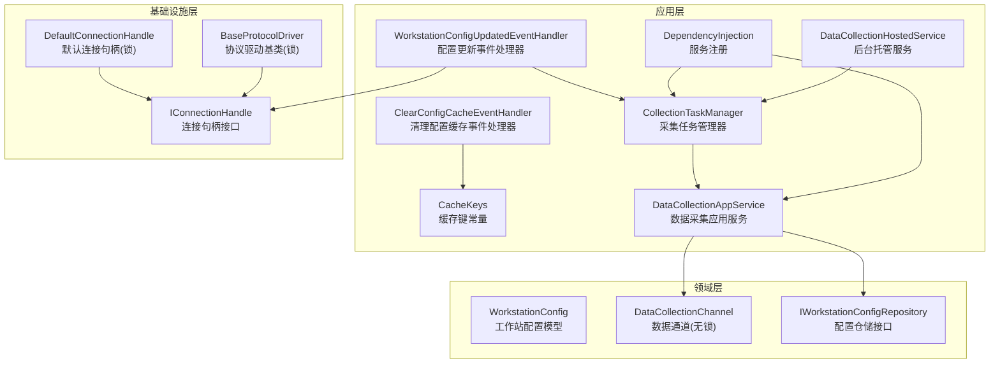
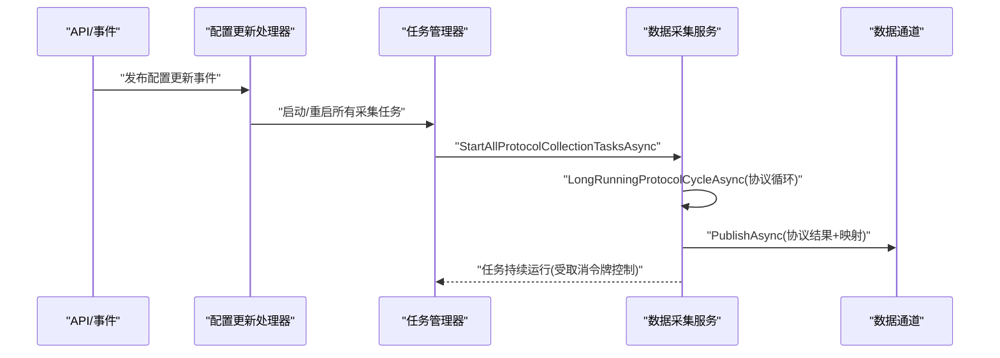
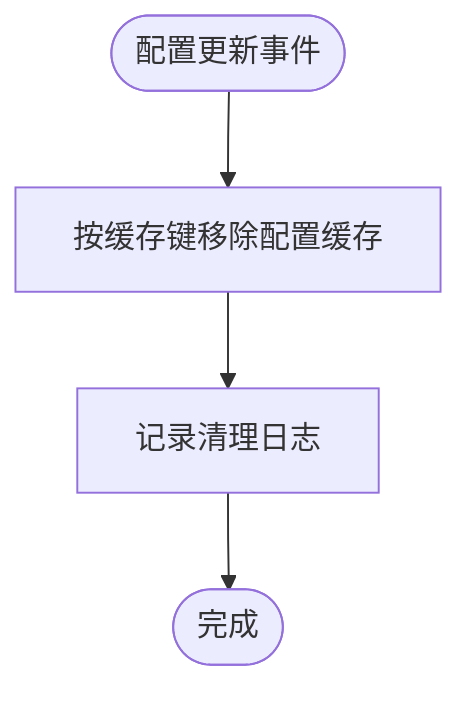
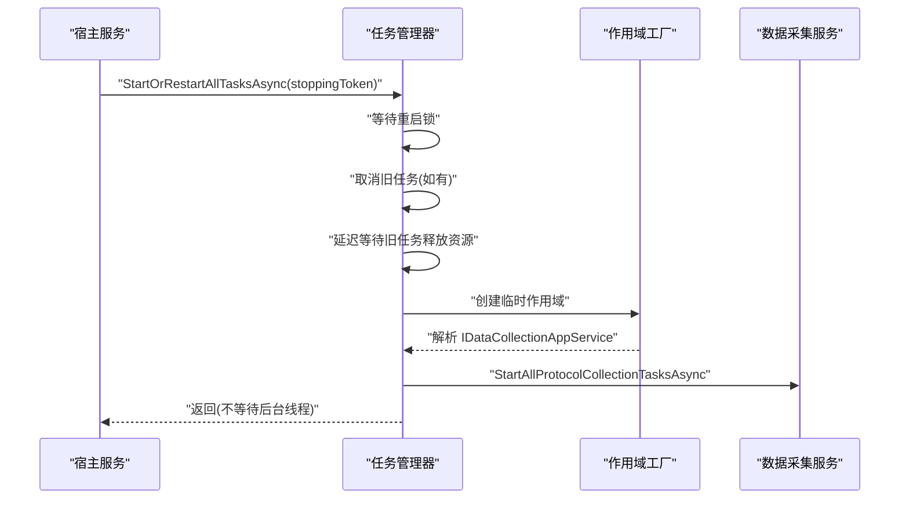
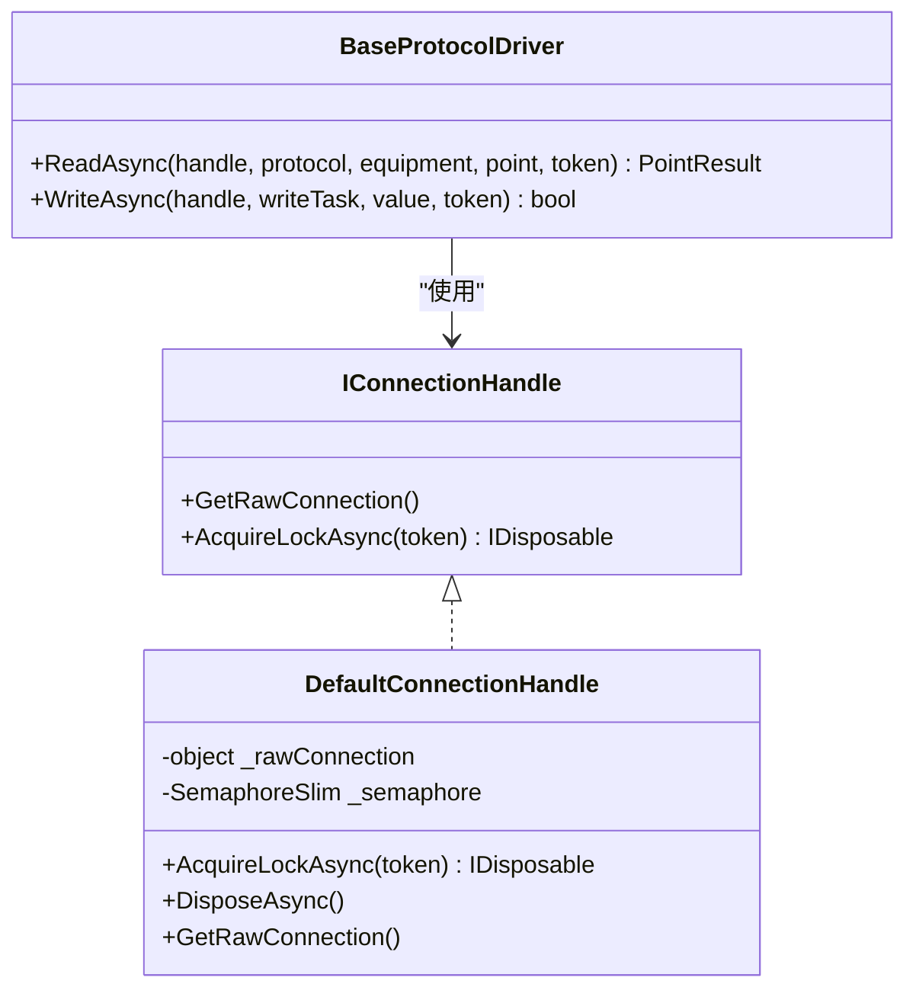
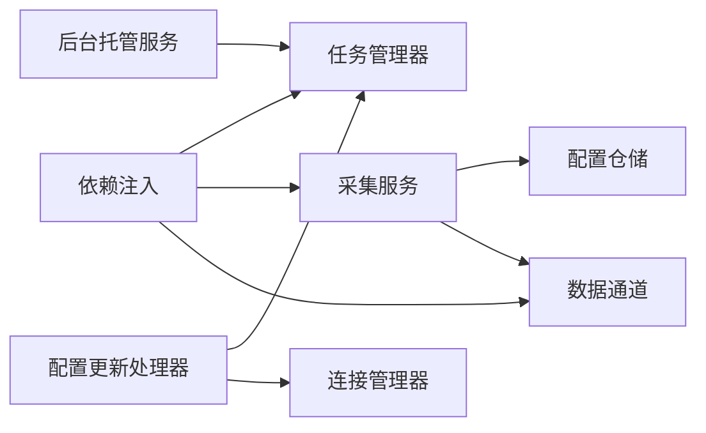

# 缓存与性能优化

<cite>
**本文引用的文件**
- [CacheKeys.cs](file://IndustrialDataSolution/IndustrialDataProcessor.Application/Constants/CacheKeys.cs)
- [ClearConfigCacheEventHandler.cs](file://IndustrialDataSolution/IndustrialDataProcessor.Application/EventHandlers/ClearConfigCacheEventHandler.cs)
- [WorkstationConfigUpdatedEventHandler.cs](file://IndustrialDataSolution/IndustrialDataProcessor.Application/EventHandlers/WorkstationConfigUpdatedEventHandler.cs)
- [CollectionTaskManager.cs](file://IndustrialDataSolution/IndustrialDataProcessor.Application/Serivces/CollectionTaskManager.cs)
- [DataCollectionAppService.cs](file://IndustrialDataSolution/IndustrialDataProcessor.Application/Serivces/DataCollectionAppService.cs)
- [IDataCollectionAppService.cs](file://IndustrialDataSolution/IndustrialDataProcessor.Application/Serivces/IDataCollectionAppService.cs)
- [ICollectionTaskManager.cs](file://IndustrialDataSolution/IndustrialDataProcessor.Application/Serivces/ICollectionTaskManager.cs)
- [DependencyInjection.cs](file://IndustrialDataSolution/IndustrialDataProcessor.Application/DependencyInjection.cs)
- [DataCollectionHostedService.cs](file://IndustrialDataSolution/IndustrialDataProcessor.Api/BackgroundServices/DataCollectionHostedService.cs)
- [IWorkstationConfigRepository.cs](file://IndustrialDataSolution/IndustrialDataProcessor.Domain/Repositories/IWorkstationConfigRepository.cs)
- [WorkstationConfig.cs](file://IndustrialDataSolution/IndustrialDataProcessor.Domain/Workstation/Configs/WorkstationConfig.cs)
- [DataCollectionChannel.cs](file://IndustrialDataSolution/IndustrialDataProcessor.Domain/Workstation/Results/DataCollectionChannel.cs)
- [IConnectionHandle.cs](file://IndustrialDataSolution/IndustrialDataProcessor.Domain/Communication/IConnection/IConnectionHandle.cs)
- [DefaultConnectionHandle.cs](file://IndustrialDataSolution/IndustrialDataProcessor.Infrastructure/Communication/Connection/DefaultConnectionHandle.cs)
- [BaseProtocolDriver.cs](file://IndustrialDataSolution/IndustrialDataProcessor.Infrastructure/Communication/Drivers/TcpCommon/BaseProtocolDriver.cs)
</cite>

## 目录
1. [简介](#简介)
2. [项目结构](#项目结构)
3. [核心组件](#核心组件)
4. [架构总览](#架构总览)
5. [详细组件分析](#详细组件分析)
6. [依赖关系分析](#依赖关系分析)
7. [性能考量](#性能考量)
8. [故障排查指南](#故障排查指南)
9. [结论](#结论)
10. [附录](#附录)

## 简介
本文件聚焦于DDD工业数据处理解决方案中的缓存与性能优化主题，系统性阐述以下内容：
- 缓存策略设计：配置缓存与数据缓存的实现方式与触发清理机制
- 缓存键命名规范与管理：CacheKeys常量的设计与使用
- 任务调度机制：CollectionTaskManager的任务创建、执行监控与资源管理
- 内存缓存配置与优化：缓存大小控制、过期策略与清理机制
- 性能监控与指标收集：关键指标定义与监控工具集成建议
- 并发控制与线程安全：锁机制与无锁数据结构选择
- 性能测试与基准测试方法论
- 具体优化案例与最佳实践

## 项目结构
本项目采用分层架构，缓存与性能优化相关的关键位置如下：
- 应用层：缓存键常量、事件处理器、任务管理器、数据采集服务
- 领域层：工作流配置模型、数据通道（无锁并发传输）
- 基础设施层：连接句柄与协议驱动的并发控制

图表来源
- [CacheKeys.cs](file://IndustrialDataSolution/IndustrialDataProcessor.Application/Constants/CacheKeys.cs#L1-L7)
- [ClearConfigCacheEventHandler.cs](file://IndustrialDataSolution/IndustrialDataProcessor.Application/EventHandlers/ClearConfigCacheEventHandler.cs#L1-L26)
- [WorkstationConfigUpdatedEventHandler.cs](file://IndustrialDataSolution/IndustrialDataProcessor.Application/EventHandlers/WorkstationConfigUpdatedEventHandler.cs#L1-L40)
- [CollectionTaskManager.cs](file://IndustrialDataSolution/IndustrialDataProcessor.Application/Serivces/CollectionTaskManager.cs#L1-L61)
- [DataCollectionAppService.cs](file://IndustrialDataSolution/IndustrialDataProcessor.Application/Serivces/DataCollectionAppService.cs#L1-L216)
- [DependencyInjection.cs](file://IndustrialDataSolution/IndustrialDataProcessor.Application/DependencyInjection.cs#L1-L40)
- [DataCollectionHostedService.cs](file://IndustrialDataSolution/IndustrialDataProcessor.Api/BackgroundServices/DataCollectionHostedService.cs#L1-L28)
- [WorkstationConfig.cs](file://IndustrialDataSolution/IndustrialDataProcessor.Domain/Workstation/Configs/WorkstationConfig.cs#L1-L27)
- [DataCollectionChannel.cs](file://IndustrialDataSolution/IndustrialDataProcessor.Domain/Workstation/Results/DataCollectionChannel.cs#L1-L26)
- [IWorkstationConfigRepository.cs](file://IndustrialDataSolution/IndustrialDataProcessor.Domain/Repositories/IWorkstationConfigRepository.cs#L1-L12)
- [IConnectionHandle.cs](file://IndustrialDataSolution/IndustrialDataProcessor.Domain/Communication/IConnection/IConnectionHandle.cs#L1-L18)
- [DefaultConnectionHandle.cs](file://IndustrialDataSolution/IndustrialDataProcessor.Infrastructure/Communication/Connection/DefaultConnectionHandle.cs#L1-L50)
- [BaseProtocolDriver.cs](file://IndustrialDataSolution/IndustrialDataProcessor.Infrastructure/Communication/Drivers/TcpCommon/BaseProtocolDriver.cs#L27-L58)

章节来源
- [DependencyInjection.cs](file://IndustrialDataSolution/IndustrialDataProcessor.Application/DependencyInjection.cs#L16-L39)
- [DataCollectionHostedService.cs](file://IndustrialDataSolution/IndustrialDataProcessor.Api/BackgroundServices/DataCollectionHostedService.cs#L15-L26)

## 核心组件
- 缓存键常量：集中定义配置缓存键，便于统一管理与替换
- 清理事件处理器：监听配置更新事件，主动移除对应缓存键
- 任务管理器：统一启动/重启采集任务，协调取消与资源释放
- 数据采集服务：按协议独立循环采集，聚合结果并推送至通道
- 数据通道：无锁并发通道，解耦生产者与消费者
- 连接句柄与驱动：在物理通道级别加锁，保障串口/TCP并发安全

章节来源
- [CacheKeys.cs](file://IndustrialDataSolution/IndustrialDataProcessor.Application/Constants/CacheKeys.cs#L5-L6)
- [ClearConfigCacheEventHandler.cs](file://IndustrialDataSolution/IndustrialDataProcessor.Application/EventHandlers/ClearConfigCacheEventHandler.cs#L16-L24)
- [CollectionTaskManager.cs](file://IndustrialDataSolution/IndustrialDataProcessor.Application/Serivces/CollectionTaskManager.cs#L19-L59)
- [DataCollectionAppService.cs](file://IndustrialDataSolution/IndustrialDataProcessor.Application/Serivces/DataCollectionAppService.cs#L22-L41)
- [DataCollectionChannel.cs](file://IndustrialDataSolution/IndustrialDataProcessor.Domain/Workstation/Results/DataCollectionChannel.cs#L10-L26)
- [IConnectionHandle.cs](file://IndustrialDataSolution/IndustrialDataProcessor.Domain/Communication/IConnection/IConnectionHandle.cs#L12-L17)
- [DefaultConnectionHandle.cs](file://IndustrialDataSolution/IndustrialDataProcessor.Infrastructure/Communication/Connection/DefaultConnectionHandle.cs#L15-L19)
- [BaseProtocolDriver.cs](file://IndustrialDataSolution/IndustrialDataProcessor.Infrastructure/Communication/Drivers/TcpCommon/BaseProtocolDriver.cs#L27-L41)

## 架构总览
系统以“事件驱动 + 任务管理 + 无锁通道”的模式实现高性能采集与缓存一致性：
- 配置更新事件触发缓存清理与任务重启
- 任务管理器统一协调采集任务生命周期
- 采集服务按协议独立循环，使用连接句柄锁避免并发冲突
- 结果通过无锁通道广播给下游（OPC UA、数据库）

图表来源
- [WorkstationConfigUpdatedEventHandler.cs](file://IndustrialDataSolution/IndustrialDataProcessor.Application/EventHandlers/WorkstationConfigUpdatedEventHandler.cs#L24-L38)
- [CollectionTaskManager.cs](file://IndustrialDataSolution/IndustrialDataProcessor.Application/Serivces/CollectionTaskManager.cs#L19-L59)
- [DataCollectionAppService.cs](file://IndustrialDataSolution/IndustrialDataProcessor.Application/Serivces/DataCollectionAppService.cs#L22-L41)
- [DataCollectionChannel.cs](file://IndustrialDataSolution/IndustrialDataProcessor.Domain/Workstation/Results/DataCollectionChannel.cs#L22-L26)

## 详细组件分析

### 缓存策略与键管理
- 设计理念
  - 配置缓存：以工作站配置为单位缓存解析后的最新配置，减少重复查询与解析成本
  - 触发清理：当配置更新事件到达时，主动移除对应缓存键，确保后续读取到最新配置
- 键命名规范
  - 使用语义化常量统一管理，避免魔法字符串散落各处
  - 建议扩展命名空间与前缀，区分不同模块与作用域
- 实现要点
  - 清理处理器依赖内存缓存接口，按常量键删除
  - 事件处理器在清理缓存后记录日志，便于审计与排障

图表来源
- [ClearConfigCacheEventHandler.cs](file://IndustrialDataSolution/IndustrialDataProcessor.Application/EventHandlers/ClearConfigCacheEventHandler.cs#L16-L24)
- [CacheKeys.cs](file://IndustrialDataSolution/IndustrialDataProcessor.Application/Constants/CacheKeys.cs#L5-L6)

章节来源
- [CacheKeys.cs](file://IndustrialDataSolution/IndustrialDataProcessor.Application/Constants/CacheKeys.cs#L5-L6)
- [ClearConfigCacheEventHandler.cs](file://IndustrialDataSolution/IndustrialDataProcessor.Application/EventHandlers/ClearConfigCacheEventHandler.cs#L16-L24)
- [WorkstationConfigUpdatedEventHandler.cs](file://IndustrialDataSolution/IndustrialDataProcessor.Application/EventHandlers/WorkstationConfigUpdatedEventHandler.cs#L24-L38)

### 任务调度机制（CollectionTaskManager）
- 任务创建
  - 通过作用域工厂解析应用服务，启动所有协议采集任务
  - 每个协议独立循环，互不影响
- 执行监控
  - 使用取消令牌链路，确保宿主停止或手动重启时可优雅退出
  - 通过日志记录启动/重启/取消/完成状态
- 资源管理
  - 旧任务取消后延迟释放，避免资源争用
  - 重启过程使用信号量防止并发重启

图表来源
- [CollectionTaskManager.cs](file://IndustrialDataSolution/IndustrialDataProcessor.Application/Serivces/CollectionTaskManager.cs#L19-L59)
- [DataCollectionHostedService.cs](file://IndustrialDataSolution/IndustrialDataProcessor.Api/BackgroundServices/DataCollectionHostedService.cs#L15-L20)
- [DataCollectionAppService.cs](file://IndustrialDataSolution/IndustrialDataProcessor.Application/Serivces/DataCollectionAppService.cs#L22-L41)

章节来源
- [CollectionTaskManager.cs](file://IndustrialDataSolution/IndustrialDataProcessor.Application/Serivces/CollectionTaskManager.cs#L19-L59)
- [DataCollectionHostedService.cs](file://IndustrialDataSolution/IndustrialDataProcessor.Api/BackgroundServices/DataCollectionHostedService.cs#L15-L26)
- [IDataCollectionAppService.cs](file://IndustrialDataSolution/IndustrialDataProcessor.Application/Serivces/IDataCollectionAppService.cs#L6-L12)

### 内存缓存配置与优化
- 缓存大小控制
  - 使用内存缓存时，结合配置对象体积与数量设置合理上限
  - 对热点配置采用短生命周期与低内存占用的序列化形式
- 过期策略
  - 针对配置类缓存建议使用绝对过期或滑动过期，结合事件清理形成“强一致”
- 清理机制
  - 事件驱动清理：配置更新即刻失效
  - 定时扫描：定期检查过期条目，降低峰值压力

章节来源
- [ClearConfigCacheEventHandler.cs](file://IndustrialDataSolution/IndustrialDataProcessor.Application/EventHandlers/ClearConfigCacheEventHandler.cs#L16-L24)
- [WorkstationConfigUpdatedEventHandler.cs](file://IndustrialDataSolution/IndustrialDataProcessor.Application/EventHandlers/WorkstationConfigUpdatedEventHandler.cs#L24-L38)

### 并发控制与线程安全
- 物理通道锁
  - 连接句柄在读写前获取互斥锁，避免串口/TCP并发冲突
  - 驱动基类统一加锁，子类仅关注协议细节
- 无锁数据通道
  - 使用并发通道承载采集结果，解耦生产者与消费者
  - 通道Reader独立订阅，避免共享状态竞争

图表来源
- [IConnectionHandle.cs](file://IndustrialDataSolution/IndustrialDataProcessor.Domain/Communication/IConnection/IConnectionHandle.cs#L12-L17)
- [DefaultConnectionHandle.cs](file://IndustrialDataSolution/IndustrialDataProcessor.Infrastructure/Communication/Connection/DefaultConnectionHandle.cs#L15-L19)
- [BaseProtocolDriver.cs](file://IndustrialDataSolution/IndustrialDataProcessor.Infrastructure/Communication/Drivers/TcpCommon/BaseProtocolDriver.cs#L27-L41)

章节来源
- [DefaultConnectionHandle.cs](file://IndustrialDataSolution/IndustrialDataProcessor.Infrastructure/Communication/Connection/DefaultConnectionHandle.cs#L15-L19)
- [BaseProtocolDriver.cs](file://IndustrialDataSolution/IndustrialDataProcessor.Infrastructure/Communication/Drivers/TcpCommon/BaseProtocolDriver.cs#L27-L41)
- [DataCollectionChannel.cs](file://IndustrialDataSolution/IndustrialDataProcessor.Domain/Workstation/Results/DataCollectionChannel.cs#L10-L26)

### 性能监控与指标收集
- 关键指标
  - 协议级吞吐：每协议每周期采集点数与耗时
  - 设备级成功率：成功/失败设备数量与平均耗时
  - 点位级耗时分布：读取耗时直方图/分位数
  - 通道积压：OPC UA/数据库通道Reader消费速率与队列长度
  - 任务重启次数与时延：评估配置变更对稳定性的影响
- 监控工具集成
  - 使用应用内置日志记录关键节点耗时
  - 结合外部指标系统（如Prometheus）暴露自定义指标端点
  - 为通道与任务管理器增加轻量计数器与直方图

章节来源
- [DataCollectionAppService.cs](file://IndustrialDataSolution/IndustrialDataProcessor.Application/Serivces/DataCollectionAppService.cs#L61-L178)
- [DataCollectionChannel.cs](file://IndustrialDataSolution/IndustrialDataProcessor.Domain/Workstation/Results/DataCollectionChannel.cs#L10-L26)

## 依赖关系分析
- 服务注册
  - 应用层通过依赖注入注册任务管理器、采集服务与数据通道
  - 后台托管服务依赖任务管理器启动采集
- 事件链路
  - 配置更新事件触发清理缓存与任务重启
  - 连接管理器负责底层连接的断开与重建
- 仓储与模型
  - 采集服务依赖配置仓储获取最新解析配置
  - 工作站配置模型承载协议集合，驱动多协议并发

图表来源
- [DependencyInjection.cs](file://IndustrialDataSolution/IndustrialDataProcessor.Application/DependencyInjection.cs#L16-L39)
- [DataCollectionHostedService.cs](file://IndustrialDataSolution/IndustrialDataProcessor.Api/BackgroundServices/DataCollectionHostedService.cs#L8-L20)
- [WorkstationConfigUpdatedEventHandler.cs](file://IndustrialDataSolution/IndustrialDataProcessor.Application/EventHandlers/WorkstationConfigUpdatedEventHandler.cs#L13-L35)
- [IWorkstationConfigRepository.cs](file://IndustrialDataSolution/IndustrialDataProcessor.Domain/Repositories/IWorkstationConfigRepository.cs#L10-L10)

章节来源
- [DependencyInjection.cs](file://IndustrialDataSolution/IndustrialDataProcessor.Application/DependencyInjection.cs#L16-L39)
- [DataCollectionHostedService.cs](file://IndustrialDataSolution/IndustrialDataProcessor.Api/BackgroundServices/DataCollectionHostedService.cs#L8-L20)
- [WorkstationConfigUpdatedEventHandler.cs](file://IndustrialDataSolution/IndustrialDataProcessor.Application/EventHandlers/WorkstationConfigUpdatedEventHandler.cs#L13-L35)
- [IWorkstationConfigRepository.cs](file://IndustrialDataSolution/IndustrialDataProcessor.Domain/Repositories/IWorkstationConfigRepository.cs#L10-L10)

## 性能考量
- 任务并发与隔离
  - 每协议独立线程池任务，互不阻塞；通过取消令牌实现优雅退出
  - 协议级延时最小化（至少1ms），避免CPU空转
- 通道与序列化
  - 无锁通道降低上下文切换与锁竞争
  - 将最终结果序列化为JSON字符串，减少下游反序列化开销
- 连接与锁
  - 通道级互斥锁避免底层协议冲突
  - 避免在热路径中进行昂贵的序列化/反序列化
- 缓存策略
  - 配置缓存与事件清理配合，确保一致性与命中率平衡

章节来源
- [DataCollectionAppService.cs](file://IndustrialDataSolution/IndustrialDataProcessor.Application/Serivces/DataCollectionAppService.cs#L35-L41)
- [DataCollectionAppService.cs](file://IndustrialDataSolution/IndustrialDataProcessor.Application/Serivces/DataCollectionAppService.cs#L204-L211)
- [DataCollectionChannel.cs](file://IndustrialDataSolution/IndustrialDataProcessor.Domain/Workstation/Results/DataCollectionChannel.cs#L10-L26)
- [DefaultConnectionHandle.cs](file://IndustrialDataSolution/IndustrialDataProcessor.Infrastructure/Communication/Connection/DefaultConnectionHandle.cs#L15-L19)

## 故障排查指南
- 配置更新后仍使用旧配置
  - 检查清理事件处理器是否执行缓存移除
  - 确认事件发布与订阅是否生效
- 采集任务无法停止
  - 检查取消令牌是否正确传递至采集循环
  - 确认任务管理器的重启锁与旧任务释放流程
- 并发冲突导致读写错误
  - 核查连接句柄锁是否在读写前获取
  - 检查驱动基类加锁逻辑是否被绕过
- 通道积压或消费滞后
  - 监控通道Reader消费速率与队列长度
  - 评估下游处理能力，必要时拆分消费者

章节来源
- [ClearConfigCacheEventHandler.cs](file://IndustrialDataSolution/IndustrialDataProcessor.Application/EventHandlers/ClearConfigCacheEventHandler.cs#L16-L24)
- [CollectionTaskManager.cs](file://IndustrialDataSolution/IndustrialDataProcessor.Application/Serivces/CollectionTaskManager.cs#L31-L40)
- [IConnectionHandle.cs](file://IndustrialDataSolution/IndustrialDataProcessor.Domain/Communication/IConnection/IConnectionHandle.cs#L12-L17)
- [BaseProtocolDriver.cs](file://IndustrialDataSolution/IndustrialDataProcessor.Infrastructure/Communication/Drivers/TcpCommon/BaseProtocolDriver.cs#L27-L41)
- [DataCollectionChannel.cs](file://IndustrialDataSolution/IndustrialDataProcessor.Domain/Workstation/Results/DataCollectionChannel.cs#L22-L26)

## 结论
本方案通过“事件驱动清理 + 任务管理器统一调度 + 无锁通道广播 + 通道级互斥锁”的组合，在保证一致性的同时最大化并发性能。缓存键集中管理与事件清理确保配置变更的及时生效；任务管理器的取消与资源释放机制保障系统稳定；通道与锁的合理使用降低竞争与阻塞。建议在生产环境中结合指标系统持续观测关键指标，并根据负载特征调整协议级延时与通道容量。

## 附录
- 性能测试与基准测试方法论
  - 负载场景：多协议、多设备、高并发点位读取
  - 指标采集：吞吐、P95/P99耗时、通道积压、CPU/内存占用
  - 基准对比：不同协议驱动、不同通道容量、不同锁粒度
  - 回归测试：配置频繁变更场景下的稳定性与一致性
- 最佳实践
  - 使用事件清理缓存，避免脏读
  - 协议级独立循环，最小化相互影响
  - 在热路径避免昂贵序列化，必要时预序列化
  - 为通道与任务管理器增加可观测性指标