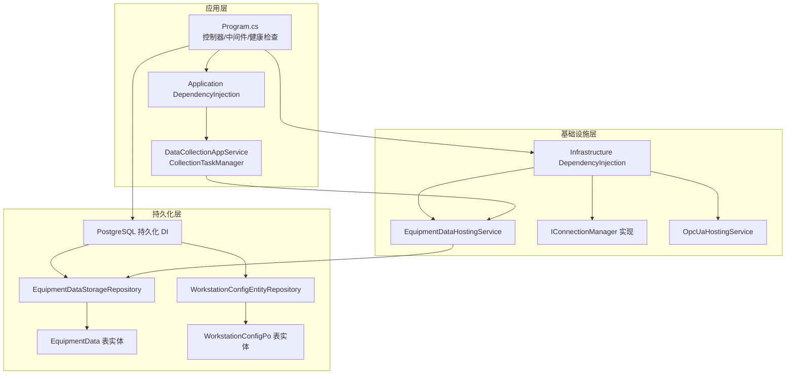
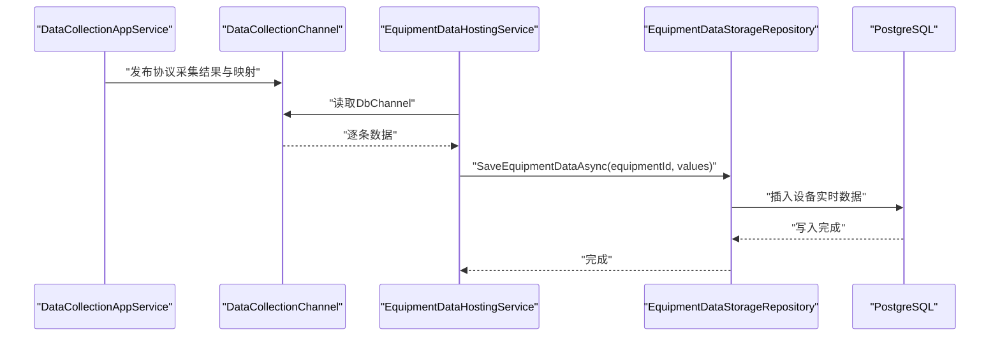
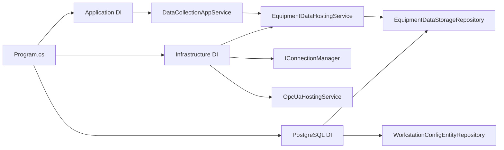

# 备份与灾难恢复

<cite>
**本文引用的文件**
- [IndustrialDataProcessor.Api\Program.cs](file://IndustrialDataSolution/IndustrialDataProcessor.Api/Program.cs)
- [IndustrialDataProcessor.Api\appsettings.json](file://IndustrialDataSolution/IndustrialDataProcessor.Api/appsettings.json)
- [IndustrialDataProcessor.Api\appsettings.Development.json](file://IndustrialDataSolution/IndustrialDataProcessor.Api/appsettings.Development.json)
- [IndustrialDataProcessor.Application\DependencyInjection.cs](file://IndustrialDataSolution/IndustrialDataProcessor.Application/DependencyInjection.cs)
- [IndustrialDataProcessor.Infrastructure\DependencyInjection.cs](file://IndustrialDataSolution/IndustrialDataProcessor.Infrastructure/DependencyInjection.cs)
- [IndustrialDataProcessor.Infrastructure\Persistence\SqlSugar\DependencyInjection.cs](file://IndustrialDataSolution/IndustrialDataProcessor.Infrastructure.Persistence.SqlSugar/DependencyInjection.cs)
- [IndustrialDataProcessor.Infrastructure\Persistence\SqlSugar\Repositories\EquipmentDataStorageRepository.cs](file://IndustrialDataSolution/IndustrialDataProcessor.Infrastructure.Persistence.SqlSugar/Repositories/EquipmentDataStorageRepository.cs)
- [IndustrialDataProcessor.Infrastructure\Persistence\SqlSugar\Repositories\WorkstationConfigEntityRepository.cs](file://IndustrialDataSolution/IndustrialDataProcessor.Infrastructure.Persistence.SqlSugar/Repositories/WorkstationConfigEntityRepository.cs)
- [IndustrialDataProcessor.Infrastructure\Persistence\SqlSugar\DbEntities\EquipmentData.cs](file://IndustrialDataSolution/IndustrialDataProcessor.Infrastructure.Persistence.SqlSugar/DbEntities/EquipmentData.cs)
- [IndustrialDataProcessor.Infrastructure\Persistence\SqlSugar\DbEntities\WorkstationConfigPo.cs](file://IndustrialDataSolution/IndustrialDataProcessor.Infrastructure.Persistence.SqlSugar/DbEntities/WorkstationConfigPo.cs)
- [IndustrialDataProcessor.Domain\Repositories\IEquipmentDataStorageRepository.cs](file://IndustrialDataSolution/IndustrialDataProcessor.Domain/Repositories/IEquipmentDataStorageRepository.cs)
- [IndustrialDataProcessor.Domain\Repositories\IWorkstationConfigRepository.cs](file://IndustrialDataSolution/IndustrialDataProcessor.Domain/Repositories/IWorkstationConfigRepository.cs)
- [IndustrialDataProcessor.Infrastructure\BackgroundServices\EquipmentDataHostingService.cs](file://IndustrialDataSolution/IndustrialDataProcessor.Infrastructure/BackgroundServices/EquipmentDataHostingService.cs)
- [IndustrialDataProcessor.Application\Services\DataCollectionAppService.cs](file://IndustrialDataSolution/IndustrialDataProcessor.Application/Services/DataCollectionAppService.cs)
- [IndustrialDataProcessor.Application\Services\CollectionTaskManager.cs](file://IndustrialDataSolution/IndustrialDataProcessor.Application/Services/CollectionTaskManager.cs)
</cite>

## 目录
1. [引言](#引言)
2. [项目结构](#项目结构)
3. [核心组件](#核心组件)
4. [架构总览](#架构总览)
5. [详细组件分析](#详细组件分析)
6. [依赖关系分析](#依赖关系分析)
7. [性能考量](#性能考量)
8. [故障排查指南](#故障排查指南)
9. [结论](#结论)
10. [附录](#附录)

## 引言
本文件面向DDD工业数据处理解决方案，围绕备份与灾难恢复制定系统化的策略与实施指南。内容覆盖全量备份、增量备份与实时备份方案，明确PostgreSQL的物理备份与逻辑备份方法，给出系统快照与镜像备份配置思路，设计RTO/RPO目标与恢复流程，阐述故障切换与高可用配置要点，并提供备份验证与恢复测试方法以及数据迁移和升级的备份策略。

## 项目结构
该系统采用多层架构（应用层、领域层、基础设施层、持久化层），数据库采用PostgreSQL并通过SqlSugar访问。数据采集与存储通过后台服务与进程内消息通道完成，配置与连接信息集中在应用配置文件中。

图表来源
- [IndustrialDataProcessor.Api\Program.cs](file://IndustrialDataSolution/IndustrialDataProcessor.Api/Program.cs#L1-L54)
- [IndustrialDataProcessor.Application\DependencyInjection.cs](file://IndustrialDataSolution/IndustrialDataProcessor.Application/DependencyInjection.cs#L1-L40)
- [IndustrialDataProcessor.Infrastructure\DependencyInjection.cs](file://IndustrialDataSolution/IndustrialDataProcessor.Infrastructure/DependencyInjection.cs#L1-L82)
- [IndustrialDataProcessor.Infrastructure\Persistence\SqlSugar\DependencyInjection.cs](file://IndustrialDataSolution/IndustrialDataProcessor.Infrastructure.Persistence.SqlSugar/DependencyInjection.cs#L1-L47)
- [IndustrialDataProcessor.Infrastructure\Persistence\SqlSugar\Repositories\EquipmentDataStorageRepository.cs](file://IndustrialDataSolution/IndustrialDataProcessor.Infrastructure.Persistence.SqlSugar/Repositories/EquipmentDataStorageRepository.cs#L1-L74)
- [IndustrialDataProcessor.Infrastructure\Persistence\SqlSugar\Repositories\WorkstationConfigEntityRepository.cs](file://IndustrialDataSolution/IndustrialDataProcessor.Infrastructure.Persistence.SqlSugar/Repositories/WorkstationConfigEntityRepository.cs#L1-L32)
- [IndustrialDataProcessor.Infrastructure\Persistence\SqlSugar\DbEntities\EquipmentData.cs](file://IndustrialDataSolution/IndustrialDataProcessor.Infrastructure.Persistence.SqlSugar/DbEntities/EquipmentData.cs#L1-L38)
- [IndustrialDataProcessor.Infrastructure\Persistence\SqlSugar\DbEntities\WorkstationConfigPo.cs](file://IndustrialDataSolution/IndustrialDataProcessor.Infrastructure.Persistence.SqlSugar/DbEntities/WorkstationConfigPo.cs#L1-L14)

章节来源
- [IndustrialDataProcessor.Api\Program.cs](file://IndustrialDataSolution/IndustrialDataProcessor.Api/Program.cs#L1-L54)
- [IndustrialDataProcessor.Api\appsettings.json](file://IndustrialDataSolution/IndustrialDataProcessor.Api/appsettings.json#L1-L17)
- [IndustrialDataProcessor.Application\DependencyInjection.cs](file://IndustrialDataSolution/IndustrialDataProcessor.Application/DependencyInjection.cs#L1-L40)
- [IndustrialDataProcessor.Infrastructure\DependencyInjection.cs](file://IndustrialDataSolution/IndustrialDataProcessor.Infrastructure/DependencyInjection.cs#L1-L82)
- [IndustrialDataProcessor.Infrastructure\Persistence\SqlSugar\DependencyInjection.cs](file://IndustrialDataSolution/IndustrialDataProcessor.Infrastructure.Persistence.SqlSugar/DependencyInjection.cs#L1-L47)

## 核心组件
- 应用入口与配置
  - 应用程序入口注册应用层、基础设施层与持久化层服务，启用健康检查与中间件链路。
  - 数据库连接字符串位于应用配置文件中，用于初始化PostgreSQL连接。
- 数据采集与存储
  - 应用服务负责启动各协议的采集任务，后台服务从进程内通道消费采集结果并写入数据库。
  - 存储仓库封装写入逻辑，统一处理异常与日志。
- 数据模型
  - 设备实时数据表实体与工作站配置表实体分别承载时序数据与配置数据的持久化需求。

章节来源
- [IndustrialDataProcessor.Api\Program.cs](file://IndustrialDataSolution/IndustrialDataProcessor.Api/Program.cs#L10-L51)
- [IndustrialDataProcessor.Api\appsettings.json](file://IndustrialDataSolution/IndustrialDataProcessor.Api/appsettings.json#L10-L12)
- [IndustrialDataProcessor.Application\Services\DataCollectionAppService.cs](file://IndustrialDataSolution/IndustrialDataProcessor.Application/Services/DataCollectionAppService.cs#L22-L41)
- [IndustrialDataProcessor.Infrastructure\BackgroundServices\EquipmentDataHostingService.cs](file://IndustrialDataSolution/IndustrialDataProcessor.Infrastructure/BackgroundServices/EquipmentDataHostingService.cs#L16-L41)
- [IndustrialDataProcessor.Infrastructure\Persistence\SqlSugar\Repositories\EquipmentDataStorageRepository.cs](file://IndustrialDataSolution/IndustrialDataProcessor.Infrastructure.Persistence.SqlSugar/Repositories/EquipmentDataStorageRepository.cs#L38-L72)
- [IndustrialDataProcessor.Infrastructure\Persistence\SqlSugar\DbEntities\EquipmentData.cs](file://IndustrialDataSolution/IndustrialDataProcessor.Infrastructure.Persistence.SqlSugar/DbEntities/EquipmentData.cs#L10-L38)
- [IndustrialDataProcessor.Infrastructure\Persistence\SqlSugar\DbEntities\WorkstationConfigPo.cs](file://IndustrialDataSolution/IndustrialDataProcessor.Infrastructure.Persistence.SqlSugar/DbEntities/WorkstationConfigPo.cs#L5-L13)

## 架构总览
系统通过“采集-通道-存储”的流水线实现工业数据的持续写入。采集任务由应用服务启动，后台服务从通道读取并调用存储仓库写入数据库。数据库为PostgreSQL，采用SqlSugar进行ORM访问。

图表来源
- [IndustrialDataProcessor.Application\Services\DataCollectionAppService.cs](file://IndustrialDataSolution/IndustrialDataProcessor.Application/Services/DataCollectionAppService.cs#L185-L198)
- [IndustrialDataProcessor.Infrastructure\BackgroundServices\EquipmentDataHostingService.cs](file://IndustrialDataSolution/IndustrialDataProcessor.Infrastructure/BackgroundServices/EquipmentDataHostingService.cs#L20-L35)
- [IndustrialDataProcessor.Infrastructure\Persistence\SqlSugar\Repositories\EquipmentDataStorageRepository.cs](file://IndustrialDataSolution/IndustrialDataProcessor.Infrastructure.Persistence.SqlSugar/Repositories/EquipmentDataStorageRepository.cs#L38-L53)

## 详细组件分析

### 数据库备份与恢复策略
- 全量备份
  - 物理备份：使用pg_start_backup/pg_stop_backup配合文件系统快照或块设备快照，确保一致性。
  - 逻辑备份：使用pg_dump或pg_dumpall导出SQL脚本，便于跨版本迁移与精细恢复。
- 增量备份
  - 使用WAL归档（archive_command）+ 时间点恢复（PITR），结合基础备份实现增量恢复。
- 实时备份
  - 流复制（主从/备库）+ WAL归档，实现近实时保护与快速切换。
- PostgreSQL配置要点
  - 启用归档与WAL保留策略，合理设置checkpoint与共享内存参数。
  - 对关键业务表（如设备实时数据表与配置表）进行分区与索引优化，提升备份/恢复效率。

章节来源
- [IndustrialDataProcessor.Api\appsettings.json](file://IndustrialDataSolution/IndustrialDataProcessor.Api/appsettings.json#L10-L12)
- [IndustrialDataProcessor.Infrastructure\Persistence\SqlSugar\DbEntities\EquipmentData.cs](file://IndustrialDataSolution/IndustrialDataProcessor.Infrastructure.Persistence.SqlSugar/DbEntities/EquipmentData.cs#L10-L38)
- [IndustrialDataProcessor.Infrastructure\Persistence\SqlSugar\DbEntities\WorkstationConfigPo.cs](file://IndustrialDataSolution/IndustrialDataProcessor.Infrastructure.Persistence.SqlSugar/DbEntities/WorkstationConfigPo.cs#L5-L13)

### 系统快照与镜像备份
- 文件系统快照
  - 在数据库数据目录与配置目录上创建快照，保证一致性。
- 容器/虚拟机镜像
  - 对运行环境（含数据库与应用）制作受控镜像，定期更新并验证恢复路径。
- 配置与证书
  - 将连接字符串、授权码等敏感配置纳入备份范围，确保可恢复至任意节点。

章节来源
- [IndustrialDataProcessor.Api\appsettings.json](file://IndustrialDataSolution/IndustrialDataProcessor.Api/appsettings.json#L10-L16)
- [IndustrialDataProcessor.Api\appsettings.Development.json](file://IndustrialDataSolution/IndustrialDataProcessor.Api/appsettings.Development.json#L1-L9)

### 灾难恢复计划（RTO/RPO）
- RTO/RPO目标
  - 全量+增量+流复制：RPO可至秒级，RTO取决于切换与恢复流程自动化程度。
  - 逻辑备份：RPO取决于备份频率，RTO包含导库与数据校验时间。
- 恢复流程
  - 识别故障类型（节点故障/网络故障/数据损坏），启动预案。
  - 优先恢复主库，若主库不可用则进行故障切换至备库。
  - 应用层重启后，确认健康检查与采集任务恢复。
- 故障切换
  - 主备切换：停止写入、Promote备库、更新DNS/负载均衡与连接串。
  - 读扩展：多备库只读副本用于报表与分析查询。

章节来源
- [IndustrialDataProcessor.Api\Program.cs](file://IndustrialDataSolution/IndustrialDataProcessor.Api/Program.cs#L26-L49)
- [IndustrialDataProcessor.Infrastructure\DependencyInjection.cs](file://IndustrialDataSolution/IndustrialDataProcessor.Infrastructure/DependencyInjection.cs#L37-L46)

### 备份验证与恢复测试
- 验证清单
  - 定期抽样校验备份文件完整性与可读性。
  - 对关键表执行随机抽样比对（设备实时数据与配置表）。
- 恢复演练
  - 定期在隔离环境执行恢复演练，记录RTO/RPO达成情况。
  - 验证应用层健康检查与采集任务自启动能力。
- 回归测试
  - 恢复后执行最小化功能回归，确保业务连续性。

章节来源
- [IndustrialDataProcessor.Infrastructure\BackgroundServices\EquipmentDataHostingService.cs](file://IndustrialDataSolution/IndustrialDataProcessor.Infrastructure/BackgroundServices/EquipmentDataHostingService.cs#L16-L41)
- [IndustrialDataProcessor.Application\Services\DataCollectionAppService.cs](file://IndustrialDataSolution/IndustrialDataProcessor.Application/Services/DataCollectionAppService.cs#L22-L41)

### 数据迁移与升级的备份策略
- 迁移前
  - 执行一次全量备份（物理/逻辑均可），记录元数据与版本号。
  - 对目标环境进行兼容性验证（数据库版本、扩展、权限）。
- 升级过程
  - 采用蓝绿部署或滚动升级，升级前对当前生产库做一次增量备份。
  - 升级完成后进行数据一致性校验与压力测试。
- 回滚策略
  - 若升级失败，基于最近一次增量备份回滚至升级前状态。
  - 回滚后验证健康检查与采集任务恢复。

章节来源
- [IndustrialDataProcessor.Infrastructure\Persistence\SqlSugar\DbEntities\EquipmentData.cs](file://IndustrialDataSolution/IndustrialDataProcessor.Infrastructure.Persistence.SqlSugar/DbEntities/EquipmentData.cs#L10-L38)
- [IndustrialDataProcessor.Infrastructure\Persistence\SqlSugar\DbEntities\WorkstationConfigPo.cs](file://IndustrialDataSolution/IndustrialDataProcessor.Infrastructure.Persistence.SqlSugar/DbEntities/WorkstationConfigPo.cs#L5-L13)

## 依赖关系分析
系统依赖关系清晰，应用层依赖基础设施层提供的连接管理与后台服务，基础设施层依赖持久化层的数据库访问，持久化层依赖PostgreSQL。

图表来源
- [IndustrialDataProcessor.Api\Program.cs](file://IndustrialDataSolution/IndustrialDataProcessor.Api/Program.cs#L18-L25)
- [IndustrialDataProcessor.Application\DependencyInjection.cs](file://IndustrialDataSolution/IndustrialDataProcessor.Application/DependencyInjection.cs#L21-L29)
- [IndustrialDataProcessor.Infrastructure\DependencyInjection.cs](file://IndustrialDataSolution/IndustrialDataProcessor.Infrastructure/DependencyInjection.cs#L31-L46)
- [IndustrialDataProcessor.Infrastructure\Persistence\SqlSugar\DependencyInjection.cs](file://IndustrialDataSolution/IndustrialDataProcessor.Infrastructure.Persistence.SqlSugar/DependencyInjection.cs#L13-L43)

章节来源
- [IndustrialDataProcessor.Api\Program.cs](file://IndustrialDataSolution/IndustrialDataProcessor.Api/Program.cs#L18-L25)
- [IndustrialDataProcessor.Application\DependencyInjection.cs](file://IndustrialDataSolution/IndustrialDataProcessor.Application/DependencyInjection.cs#L21-L29)
- [IndustrialDataProcessor.Infrastructure\DependencyInjection.cs](file://IndustrialDataSolution/IndustrialDataProcessor.Infrastructure/DependencyInjection.cs#L31-L46)
- [IndustrialDataProcessor.Infrastructure\Persistence\SqlSugar\DependencyInjection.cs](file://IndustrialDataSolution/IndustrialDataProcessor.Infrastructure.Persistence.SqlSugar/DependencyInjection.cs#L13-L43)

## 性能考量
- 写入性能
  - 采用后台服务批量写入与进程内通道解耦，降低采集线程阻塞。
  - 合理设置数据库连接池参数与命令超时，避免阻塞。
- 存储模型
  - 设备实时数据表采用时序字段与时序扩展（如TimescaleDB超表）可提升写入与查询性能。
- 备份性能
  - 物理备份适合大体量数据的快速恢复；逻辑备份便于跨平台与细粒度恢复。
  - 归档WAL与增量备份减少恢复窗口与数据丢失风险。

章节来源
- [IndustrialDataProcessor.Infrastructure\Persistence\SqlSugar\Repositories\EquipmentDataStorageRepository.cs](file://IndustrialDataSolution/IndustrialDataProcessor.Infrastructure.Persistence.SqlSugar/Repositories/EquipmentDataStorageRepository.cs#L38-L72)
- [IndustrialDataProcessor.Infrastructure\Persistence\SqlSugar\DbEntities\EquipmentData.cs](file://IndustrialDataSolution/IndustrialDataProcessor.Infrastructure.Persistence.SqlSugar/DbEntities/EquipmentData.cs#L10-L38)
- [IndustrialDataProcessor.Api\appsettings.json](file://IndustrialDataSolution/IndustrialDataProcessor.Api/appsettings.json#L10-L12)

## 故障排查指南
- 健康检查
  - 应用层提供健康检查端点，用于快速判断服务状态。
- 日志与异常
  - 存储仓库对数据库异常进行日志记录与包装，便于定位问题。
  - 采集服务在协议级异常时记录错误并继续下一轮循环，避免单点崩溃。
- 采集任务重启
  - 通过任务管理器创建新的CancellationTokenSource并重启采集任务，确保资源释放与安全过渡。

章节来源
- [IndustrialDataProcessor.Api\Program.cs](file://IndustrialDataSolution/IndustrialDataProcessor.Api/Program.cs#L26-L49)
- [IndustrialDataProcessor.Infrastructure\Persistence\SqlSugar\Repositories\EquipmentDataStorageRepository.cs](file://IndustrialDataSolution/IndustrialDataProcessor.Infrastructure.Persistence.SqlSugar/Repositories/EquipmentDataStorageRepository.cs#L55-L71)
- [IndustrialDataProcessor.Application\Services\DataCollectionAppService.cs](file://IndustrialDataSolution/IndustrialDataProcessor.Application/Services/DataCollectionAppService.cs#L154-L171)
- [IndustrialDataProcessor.Application\Services\CollectionTaskManager.cs](file://IndustrialDataSolution/IndustrialDataProcessor.Application/Services/CollectionTaskManager.cs#L32-L60)

## 结论
本方案以“物理+逻辑”双轨备份为核心，结合WAL归档与流复制实现近实时保护，辅以系统快照与镜像备份满足多场景恢复需求。通过明确的RTO/RPO目标、标准化的恢复流程与定期演练，确保在故障发生时快速、可靠地恢复业务。同时，针对配置与证书的统一备份、迁移与升级的受控流程，进一步提升整体韧性与可维护性。

## 附录
- 关键数据表
  - 设备实时数据表：承载设备参数的时序数据，建议启用压缩与分区。
  - 工作站配置表：承载配置JSON，建议对关键字段建立索引以加速查询。
- 配置要点
  - 数据库连接字符串与授权码需纳入备份与密钥管理流程。
  - 生产与开发环境配置分离，避免误用。

章节来源
- [IndustrialDataProcessor.Infrastructure\Persistence\SqlSugar\DbEntities\EquipmentData.cs](file://IndustrialDataSolution/IndustrialDataProcessor.Infrastructure.Persistence.SqlSugar/DbEntities/EquipmentData.cs#L10-L38)
- [IndustrialDataProcessor.Infrastructure\Persistence\SqlSugar\DbEntities\WorkstationConfigPo.cs](file://IndustrialDataSolution/IndustrialDataProcessor.Infrastructure.Persistence.SqlSugar/DbEntities/WorkstationConfigPo.cs#L5-L13)
- [IndustrialDataProcessor.Api\appsettings.json](file://IndustrialDataSolution/IndustrialDataProcessor.Api/appsettings.json#L10-L16)
- [IndustrialDataProcessor.Api\appsettings.Development.json](file://IndustrialDataSolution/IndustrialDataProcessor.Api/appsettings.Development.json#L1-L9)