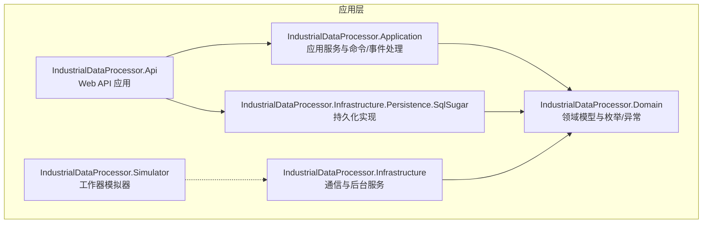
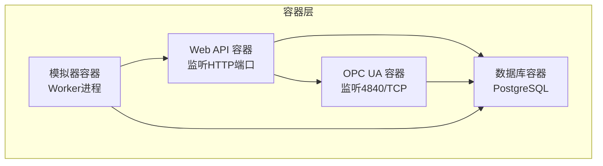
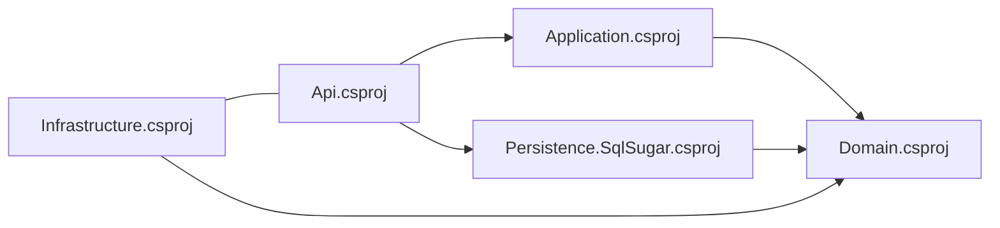

# 容器化部署

<cite>
**本文引用的文件**
- [Program.cs](file://IndustrialDataSolution/IndustrialDataProcessor.Api/Program.cs)
- [appsettings.json](file://IndustrialDataSolution/IndustrialDataProcessor.Api/appsettings.json)
- [appsettings.Development.json](file://IndustrialDataSolution/IndustrialDataProcessor.Api/appsettings.Development.json)
- [launchSettings.json](file://IndustrialDataSolution/IndustrialDataProcessor.Api/Properties/launchSettings.json)
- [IndustrialDataProcessor.Api.csproj](file://IndustrialDataSolution/IndustrialDataProcessor.Api/IndustrialDataProcessor.Api.csproj)
- [IndustrialDataProcessor.Application.csproj](file://IndustrialDataSolution/IndustrialDataProcessor.Application/IndustrialDataProcessor.Application.csproj)
- [IndustrialDataProcessor.Infrastructure.csproj](file://IndustrialDataSolution/IndustrialDataProcessor.Infrastructure/IndustrialDataProcessor.Infrastructure.csproj)
- [IndustrialDataProcessor.Infrastructure.Persistence.SqlSugar.csproj](file://IndustrialDataSolution/IndustrialDataProcessor.Infrastructure.Persistence.SqlSugar/IndustrialDataProcessor.Infrastructure.Persistence.SqlSugar.csproj)
- [IndustrialDataProcessor.Simulator.csproj](file://IndustrialDataSolution/IndustrialDataProcessor.Simulator/IndustrialDataProcessor.Simulator.csproj)
- [DataCollectionHostedService.cs](file://IndustrialDataSolution/IndustrialDataProcessor.Api/BackgroundServices/DataCollectionHostedService.cs)
- [EquipmentDataHostingService.cs](file://IndustrialDataSolution/IndustrialDataProcessor.Infrastructure/BackgroundServices/EquipmentDataHostingService.cs)
- [OpcUaHostingService.cs](file://IndustrialDataSolution/IndustrialDataProcessor.Infrastructure/BackgroundServices/OpcUaHostingService.cs)
- [GlobalExceptionHandler.cs](file://IndustrialDataSolution/IndustrialDataProcessor.Api/Middleware/GlobalExceptionHandler.cs)
- [RequestLoggingMiddleware.cs](file://IndustrialDataSolution/IndustrialDataProcessor.Api/Middleware/RequestLoggingMiddleware.cs)
</cite>

## 目录
1. [简介](#简介)
2. [项目结构](#项目结构)
3. [核心组件](#核心组件)
4. [架构总览](#架构总览)
5. [详细组件分析](#详细组件分析)
6. [依赖分析](#依赖分析)
7. [性能考虑](#性能考虑)
8. [故障排除指南](#故障排除指南)
9. [结论](#结论)
10. [附录](#附录)

## 简介
本文件面向DDD工业数据处理解决方案的容器化部署，提供从Dockerfile编写、多阶段构建、依赖与安全配置，到镜像构建流程、标签管理与优化，再到容器编排（Docker Compose与Kubernetes）、网络配置、监控与日志、安全最佳实践与资源限制的完整指南。文档同时结合项目实际代码结构与运行特性，给出可落地的实施建议。

## 项目结构
该仓库采用多项目解决方案，核心Web API位于IndustrialDataProcessor.Api，应用层、领域层、基础设施层与持久化层分别独立成项目，便于模块化与容器化分层构建与部署。此外，存在一个模拟器项目，可用于离线或测试环境下的数据模拟。

图表来源
- [IndustrialDataProcessor.Api.csproj](file://IndustrialDataSolution/IndustrialDataProcessor.Api/IndustrialDataProcessor.Api.csproj#L1-L21)
- [IndustrialDataProcessor.Application.csproj](file://IndustrialDataSolution/IndustrialDataProcessor.Application/IndustrialDataProcessor.Application.csproj#L1-L23)
- [IndustrialDataProcessor.Infrastructure.csproj](file://IndustrialDataSolution/IndustrialDataProcessor.Infrastructure/IndustrialDataProcessor.Infrastructure.csproj#L1-L33)
- [IndustrialDataProcessor.Infrastructure.Persistence.SqlSugar.csproj](file://IndustrialDataSolution/IndustrialDataProcessor.Infrastructure.Persistence.SqlSugar/IndustrialDataProcessor.Infrastructure.Persistence.SqlSugar.csproj#L1-L21)
- [IndustrialDataProcessor.Simulator.csproj](file://IndustrialDataSolution/IndustrialDataProcessor.Simulator/IndustrialDataProcessor.Simulator.csproj#L1-L15)

章节来源
- [IndustrialDataProcessor.Api.csproj](file://IndustrialDataSolution/IndustrialDataProcessor.Api/IndustrialDataProcessor.Api.csproj#L1-L21)
- [IndustrialDataProcessor.Application.csproj](file://IndustrialDataSolution/IndustrialDataProcessor.Application/IndustrialDataProcessor.Application.csproj#L1-L23)
- [IndustrialDataProcessor.Infrastructure.csproj](file://IndustrialDataSolution/IndustrialDataProcessor.Infrastructure/IndustrialDataProcessor.Infrastructure.csproj#L1-L33)
- [IndustrialDataProcessor.Infrastructure.Persistence.SqlSugar.csproj](file://IndustrialDataSolution/IndustrialDataProcessor.Infrastructure.Persistence.SqlSugar/IndustrialDataProcessor.Infrastructure.Persistence.SqlSugar.csproj#L1-L21)
- [IndustrialDataProcessor.Simulator.csproj](file://IndustrialDataSolution/IndustrialDataProcessor.Simulator/IndustrialDataProcessor.Simulator.csproj#L1-L15)

## 核心组件
- Web API入口与中间件链：应用通过Program.cs初始化，注册应用层、基础设施层、持久化层与健康检查；中间件顺序为请求日志、异常处理、Swagger、授权与控制器映射。
- 配置体系：appsettings.json定义日志级别、允许主机与默认连接串；开发环境配置覆盖日志级别；launchSettings.json定义本地开发端口与环境变量。
- 后台服务：数据采集托管服务启动任务管理器；设备数据持久化后台服务持续消费采集通道并入库；OPC UA后台服务启动并维护OPC UA服务器，监听采集结果更新节点。
- 中间件：全局异常处理器统一输出RFC 7807风格ProblemDetails；请求日志中间件记录请求/响应元数据与耗时。

章节来源
- [Program.cs](file://IndustrialDataSolution/IndustrialDataProcessor.Api/Program.cs#L10-L52)
- [appsettings.json](file://IndustrialDataSolution/IndustrialDataProcessor.Api/appsettings.json#L1-L17)
- [appsettings.Development.json](file://IndustrialDataSolution/IndustrialDataProcessor.Api/appsettings.Development.json#L1-L9)
- [launchSettings.json](file://IndustrialDataSolution/IndustrialDataProcessor.Api/Properties/launchSettings.json#L11-L30)
- [DataCollectionHostedService.cs](file://IndustrialDataSolution/IndustrialDataProcessor.Api/BackgroundServices/DataCollectionHostedService.cs#L8-L27)
- [EquipmentDataHostingService.cs](file://IndustrialDataSolution/IndustrialDataProcessor.Infrastructure/BackgroundServices/EquipmentDataHostingService.cs#L9-L42)
- [OpcUaHostingService.cs](file://IndustrialDataSolution/IndustrialDataProcessor.Infrastructure/BackgroundServices/OpcUaHostingService.cs#L20-L99)
- [GlobalExceptionHandler.cs](file://IndustrialDataSolution/IndustrialDataProcessor.Api/Middleware/GlobalExceptionHandler.cs#L8-L47)
- [RequestLoggingMiddleware.cs](file://IndustrialDataSolution/IndustrialDataProcessor.Api/Middleware/RequestLoggingMiddleware.cs#L9-L84)

## 架构总览
下图展示容器化部署视角下的系统交互：Web API作为入口，承载控制器与中间件；应用层协调业务；基础设施层负责通信与后台服务；持久化层对接数据库；OPC UA服务暴露工业协议接口；模拟器可作为独立工作器参与测试。

图表来源
- [Program.cs](file://IndustrialDataSolution/IndustrialDataProcessor.Api/Program.cs#L44-L49)
- [OpcUaHostingService.cs](file://IndustrialDataSolution/IndustrialDataProcessor.Infrastructure/BackgroundServices/OpcUaHostingService.cs#L204-L209)
- [appsettings.json](file://IndustrialDataSolution/IndustrialDataProcessor.Api/appsettings.json#L10-L12)

## 详细组件分析

### Web API 容器化要点
- 入口与运行时：基于.NET 8 Web SDK，支持健康检查与Swagger；中间件链顺序对可观测性至关重要。
- 端口与健康：对外暴露HTTP端口（由运行时决定），并提供“/health”健康检查路径。
- 配置注入：通过环境变量覆盖appsettings中的敏感项（如连接串）；开发环境端口在launchSettings.json中定义。
- 日志与异常：请求日志中间件与全局异常处理器共同保障可观测性与错误一致性。

章节来源
- [Program.cs](file://IndustrialDataSolution/IndustrialDataProcessor.Api/Program.cs#L12-L51)
- [appsettings.json](file://IndustrialDataSolution/IndustrialDataProcessor.Api/appsettings.json#L1-L17)
- [appsettings.Development.json](file://IndustrialDataSolution/IndustrialDataProcessor.Api/appsettings.Development.json#L1-L9)
- [launchSettings.json](file://IndustrialDataSolution/IndustrialDataProcessor.Api/Properties/launchSettings.json#L11-L30)
- [RequestLoggingMiddleware.cs](file://IndustrialDataSolution/IndustrialDataProcessor.Api/Middleware/RequestLoggingMiddleware.cs#L16-L84)
- [GlobalExceptionHandler.cs](file://IndustrialDataSolution/IndustrialDataProcessor.Api/Middleware/GlobalExceptionHandler.cs#L12-L47)

### OPC UA 服务容器化要点
- 证书与信任：OPC UA服务配置使用pki目录中的证书与信任列表，需在容器内正确挂载。
- 端口暴露：服务器基地址包含TCP 4840端口，需在容器网络中开放。
- 生命周期：后台服务负责启动/重启OPC UA服务器，监听采集通道并更新节点；停止时需正确取消与释放资源。

章节来源
- [OpcUaHostingService.cs](file://IndustrialDataSolution/IndustrialDataProcessor.Infrastructure/BackgroundServices/OpcUaHostingService.cs#L186-L214)

### 数据采集与持久化容器化要点
- 采集托管服务：启动任务管理器并保持运行直至宿主停止信号。
- 设备数据持久化：持续消费采集通道，逐条入库并记录异常。
- 数据库连接：默认连接串指向PostgreSQL，需确保容器网络可达。

章节来源
- [DataCollectionHostedService.cs](file://IndustrialDataSolution/IndustrialDataProcessor.Api/BackgroundServices/DataCollectionHostedService.cs#L15-L26)
- [EquipmentDataHostingService.cs](file://IndustrialDataSolution/IndustrialDataProcessor.Infrastructure/BackgroundServices/EquipmentDataHostingService.cs#L16-L41)
- [appsettings.json](file://IndustrialDataSolution/IndustrialDataProcessor.Api/appsettings.json#L10-L12)

### 模拟器容器化要点
- 工作器模式：模拟器项目采用Worker SDK，适合在容器中作为独立任务运行。
- 依赖与运行：可复用应用层与基础设施层的公共能力，按需挂载配置与证书。

章节来源
- [IndustrialDataProcessor.Simulator.csproj](file://IndustrialDataSolution/IndustrialDataProcessor.Simulator/IndustrialDataProcessor.Simulator.csproj#L1-L15)

## 依赖分析
项目采用分层依赖，Web API依赖应用层与持久化层；应用层依赖领域层；基础设施层同样依赖领域层，并引入大量工业通信相关包；持久化层依赖领域层。

图表来源
- [IndustrialDataProcessor.Api.csproj](file://IndustrialDataSolution/IndustrialDataProcessor.Api/IndustrialDataProcessor.Api.csproj#L14-L18)
- [IndustrialDataProcessor.Application.csproj](file://IndustrialDataSolution/IndustrialDataProcessor.Application/IndustrialDataProcessor.Application.csproj#L19)
- [IndustrialDataProcessor.Infrastructure.csproj](file://IndustrialDataSolution/IndustrialDataProcessor.Infrastructure/IndustrialDataProcessor.Infrastructure.csproj#L21-L23)
- [IndustrialDataProcessor.Infrastructure.Persistence.SqlSugar.csproj](file://IndustrialDataSolution/IndustrialDataProcessor.Infrastructure.Persistence.SqlSugar/IndustrialDataProcessor.Infrastructure.Persistence.SqlSugar.csproj#L16-L18)

章节来源
- [IndustrialDataProcessor.Api.csproj](file://IndustrialDataSolution/IndustrialDataProcessor.Api/IndustrialDataProcessor.Api.csproj#L14-L18)
- [IndustrialDataProcessor.Application.csproj](file://IndustrialDataSolution/IndustrialDataProcessor.Application/IndustrialDataProcessor.Application.csproj#L19)
- [IndustrialDataProcessor.Infrastructure.csproj](file://IndustrialDataSolution/IndustrialDataProcessor.Infrastructure/IndustrialDataProcessor.Infrastructure.csproj#L21-L23)
- [IndustrialDataProcessor.Infrastructure.Persistence.SqlSugar.csproj](file://IndustrialDataSolution/IndustrialDataProcessor.Infrastructure.Persistence.SqlSugar/IndustrialDataProcessor.Infrastructure.Persistence.SqlSugar.csproj#L16-L18)

## 性能考虑
- 后台服务生命周期：确保后台服务正确接收取消令牌并在停止时释放资源，避免容器重启时的资源泄漏。
- 通道消费：设备数据持久化服务采用异步迭代消费，注意异常隔离与日志记录，避免单条异常阻塞整体流水线。
- OPC UA服务器：启动/重启过程包含取消与延迟，确保端口释放后再启动新实例，减少端口占用风险。
- 健康检查：利用内置健康检查端点，结合容器编排进行存活/就绪探针配置。

章节来源
- [EquipmentDataHostingService.cs](file://IndustrialDataSolution/IndustrialDataProcessor.Infrastructure/BackgroundServices/EquipmentDataHostingService.cs#L16-L41)
- [OpcUaHostingService.cs](file://IndustrialDataSolution/IndustrialDataProcessor.Infrastructure/BackgroundServices/OpcUaHostingService.cs#L63-L99)
- [Program.cs](file://IndustrialDataSolution/IndustrialDataProcessor.Api/Program.cs#L47)

## 故障排除指南
- 异常处理：全局异常处理器统一输出ProblemDetails，便于客户端与监控系统识别错误类型与状态码。
- 请求日志：请求日志中间件记录请求/响应元数据、TraceId与耗时，有助于定位问题。
- OPC UA证书：若出现证书相关错误，检查pki目录挂载与权限，确认信任列表与拒绝列表路径正确。
- 数据库连接：确认容器网络可达与连接串配置正确，必要时通过环境变量覆盖默认连接串。

章节来源
- [GlobalExceptionHandler.cs](file://IndustrialDataSolution/IndustrialDataProcessor.Api/Middleware/GlobalExceptionHandler.cs#L12-L47)
- [RequestLoggingMiddleware.cs](file://IndustrialDataSolution/IndustrialDataProcessor.Api/Middleware/RequestLoggingMiddleware.cs#L16-L84)
- [OpcUaHostingService.cs](file://IndustrialDataSolution/IndustrialDataProcessor.Infrastructure/BackgroundServices/OpcUaHostingService.cs#L186-L214)
- [appsettings.json](file://IndustrialDataSolution/IndustrialDataProcessor.Api/appsettings.json#L10-L12)

## 结论
本方案以分层项目结构为基础，结合.NET 8容器化运行时与多阶段构建策略，可在保证功能完整性的同时实现高可维护性与可扩展性。通过合理的网络、安全与监控配置，可满足工业场景对稳定性与可观测性的要求。

## 附录

### Dockerfile编写指南（多阶段构建）
- 基础镜像选择：使用官方.NET SDK镜像进行构建，运行时使用轻量级ASP.NET Core运行时镜像。
- 多阶段构建：第一阶段拉取依赖并编译打包，第二阶段仅复制运行产物至运行时镜像，减小镜像体积。
- 依赖管理：在构建阶段安装必要工具与依赖，避免在运行时镜像中携带构建期依赖。
- 安全配置：非root用户运行、最小权限原则、禁用不必要的包管理器缓存、清理构建缓存。
- 运行参数：通过环境变量注入配置（如连接串、日志级别），避免硬编码。

### 镜像构建流程与标签管理
- 构建参数：通过ARG传递版本号、构建时间等元数据，便于镜像溯源。
- 标签策略：遵循语义化版本（vX.Y.Z）、分支/提交哈希、时间戳组合，确保唯一性与可追溯性。
- 镜像优化：合并RUN指令、使用.dockerignore过滤无关文件、分层缓存友好设计。

### 容器编排（Docker Compose）
- 服务定义：Web API、OPC UA服务、数据库、模拟器分别定义为独立服务。
- 网络与卷：定义自定义桥接网络，挂载pki证书目录与日志目录。
- 环境变量：通过env文件或compose环境变量覆盖敏感配置。
- 健康检查：为Web API与数据库配置健康检查探针，确保自动恢复。
- 依赖顺序：通过depends_on与健康检查配合，确保数据库先于应用启动。

### Kubernetes部署清单与集群管理
- Deployment：定义副本数、滚动更新策略、就绪/存活探针。
- Service：暴露Web API与OPC UA端口，使用ClusterIP/LoadBalancer根据需求选择。
- ConfigMap与Secret：分离配置与密钥，挂载为环境变量或只读卷。
- PVC：为数据库与日志目录提供持久化存储。
- HPA/资源限制：根据CPU/内存使用趋势配置HPA，设置requests/limits约束资源占用。

### 容器网络配置
- 端口映射：Web API默认HTTP端口、OPC UA TCP 4840端口需在容器中暴露。
- 服务发现：通过Kubernetes Service名称与命名空间进行服务发现。
- 负载均衡：Service层面对外提供负载均衡，Ingress可选用于边缘路由与TLS终止。

### 监控与日志收集
- 日志：统一输出结构化日志，结合容器日志驱动与集中式日志系统（如EFK/ELK）。
- 指标：暴露Prometheus指标端点，结合Grafana可视化。
- 健康检查：利用内置健康检查端点，配置探针以实现自动恢复。

### 安全最佳实践与资源限制
- 安全：非root运行、只读根文件系统、最小权限RBAC、镜像扫描与漏洞修复。
- 资源：为各容器设置CPU/内存requests与limits，避免资源争抢；为数据库与OPC UA服务适当放宽资源配额。
- 配置：敏感信息使用Secret，配置使用ConfigMap；避免在镜像或代码中硬编码。