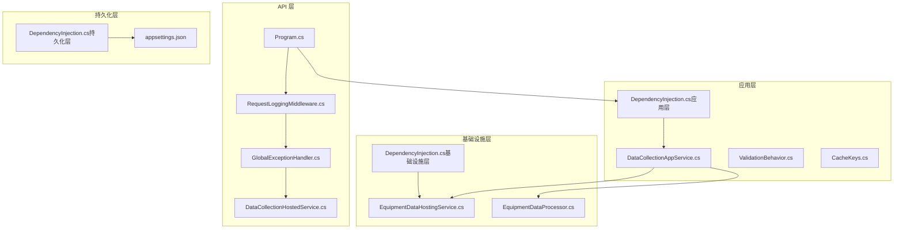
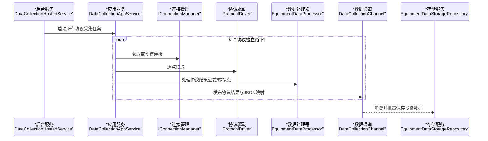
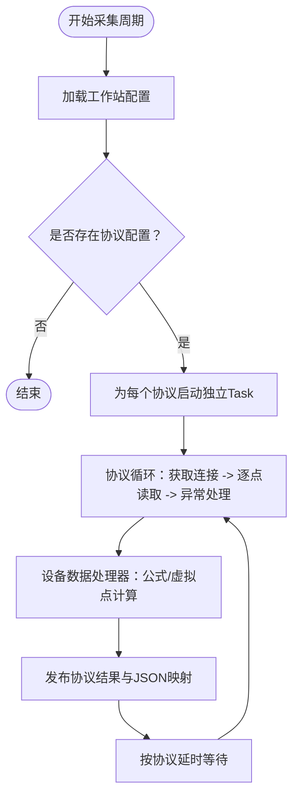
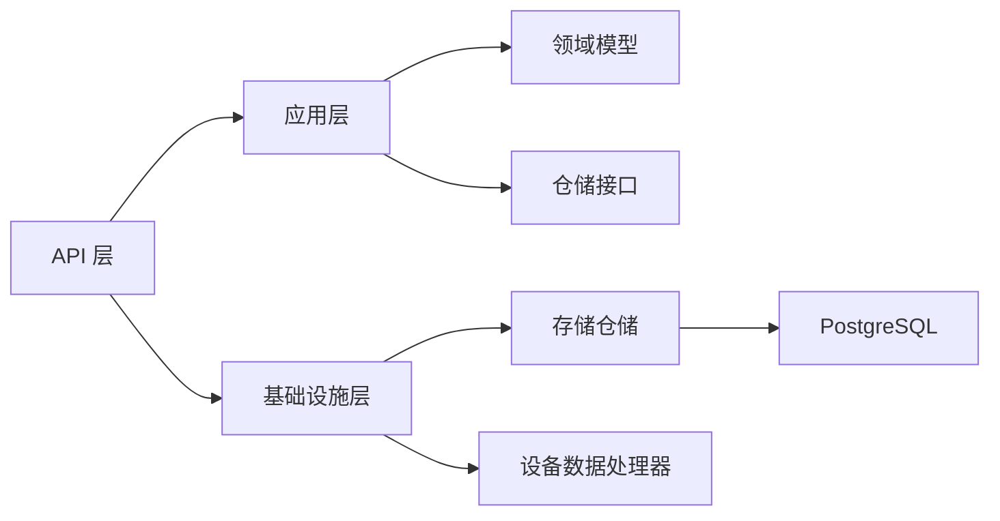

# 性能调优

<cite>
**本文引用的文件**
- [Program.cs](file://IndustrialDataSolution/IndustrialDataProcessor.Api/Program.cs)
- [appsettings.json](file://IndustrialDataSolution/IndustrialDataProcessor.Api/appsettings.json)
- [DependencyInjection.cs（应用层）](file://IndustrialDataSolution/IndustrialDataProcessor.Application/DependencyInjection.cs)
- [DependencyInjection.cs（基础设施层）](file://IndustrialDataSolution/IndustrialDataProcessor.Infrastructure/DependencyInjection.cs)
- [DependencyInjection.cs（持久化层）](file://IndustrialDataSolution/IndustrialDataProcessor.Infrastructure.Persistence.SqlSugar/DependencyInjection.cs)
- [GlobalExceptionHandler.cs](file://IndustrialDataSolution/IndustrialDataProcessor.Api/Middleware/GlobalExceptionHandler.cs)
- [RequestLoggingMiddleware.cs](file://IndustrialDataSolution/IndustrialDataProcessor.Api/Middleware/RequestLoggingMiddleware.cs)
- [DataCollectionAppService.cs](file://IndustrialDataSolution/IndustrialDataProcessor.Application/Services/DataCollectionAppService.cs)
- [DataCollectionHostedService.cs](file://IndustrialDataSolution/IndustrialDataProcessor.Api/BackgroundServices/DataCollectionHostedService.cs)
- [EquipmentDataHostingService.cs](file://IndustrialDataSolution/IndustrialDataProcessor.Infrastructure/BackgroundServices/EquipmentDataHostingService.cs)
- [EquipmentDataProcessor.cs](file://IndustrialDataSolution/IndustrialDataProcessor.Infrastructure/EquipmentCollectionDataProcessing/EquipmentDataProcessor.cs)
- [CacheKeys.cs](file://IndustrialDataSolution/IndustrialDataProcessor.Application/Constants/CacheKeys.cs)
- [ValidationBehavior.cs](file://IndustrialDataSolution/IndustrialDataProcessor.Application/Behaviors/ValidationBehavior.cs)
- [WorkstationConfig.cs](file://IndustrialDataSolution/IndustrialDataProcessor.Domain/Workstation/Configs/WorkstationConfig.cs)
- [SaveWorkstationConfigCommand.cs](file://IndustrialDataSolution/IndustrialDataProcessor.Application/Commands/SaveWorkstationConfigCommand.cs)
</cite>

## 目录
1. [简介](#简介)
2. [项目结构](#项目结构)
3. [核心组件](#核心组件)
4. [架构总览](#架构总览)
5. [详细组件分析](#详细组件分析)
6. [依赖关系分析](#依赖关系分析)
7. [性能评估与测试](#性能评估与测试)
8. [数据库性能优化](#数据库性能优化)
9. [应用性能调优](#应用性能调优)
10. [硬件资源评估与扩容建议](#硬件资源评估与扩容建议)
11. [性能监控指标与瓶颈识别](#性能监控指标与瓶颈识别)
12. [性能问题诊断与解决方案](#性能问题诊断与解决方案)
13. [容量规划与资源预测](#容量规划与资源预测)
14. [结论](#结论)

## 简介
本文件面向DDD工业数据处理解决方案，提供系统性能评估与调优的完整指南。内容涵盖基准测试、压力测试与负载测试的实施方法；数据库性能优化策略（索引、查询、连接池）；应用层性能优化（缓存、并发、内存管理）；硬件资源评估与扩容建议；性能监控指标与瓶颈识别；以及容量规划与资源预测方法。文档结合代码库中的实际组件与流程，给出可操作的优化路径与排障建议。

## 项目结构
系统采用多层架构（API、应用、领域、基础设施、持久化），配合后台托管服务与进程内消息通道，实现高并发数据采集与处理流水线。

**图示来源**
- [Program.cs](file://IndustrialDataSolution/IndustrialDataProcessor.Api/Program.cs#L10-L51)
- [DependencyInjection.cs（应用层）](file://IndustrialDataSolution/IndustrialDataProcessor.Application/DependencyInjection.cs#L16-L39)
- [DependencyInjection.cs（基础设施层）](file://IndustrialDataSolution/IndustrialDataProcessor.Infrastructure/DependencyInjection.cs#L17-L81)
- [DependencyInjection.cs（持久化层）](file://IndustrialDataSolution/IndustrialDataProcessor.Infrastructure.Persistence.SqlSugar/DependencyInjection.cs#L11-L46)
- [appsettings.json](file://IndustrialDataSolution/IndustrialDataProcessor.Api/appsettings.json#L10-L16)
- [DataCollectionAppService.cs](file://IndustrialDataSolution/IndustrialDataProcessor.Application/Services/DataCollectionAppService.cs#L22-L41)
- [EquipmentDataHostingService.cs](file://IndustrialDataSolution/IndustrialDataProcessor.Infrastructure/BackgroundServices/EquipmentDataHostingService.cs#L16-L41)

**章节来源**
- [Program.cs](file://IndustrialDataSolution/IndustrialDataProcessor.Api/Program.cs#L10-L51)
- [DependencyInjection.cs（应用层）](file://IndustrialDataSolution/IndustrialDataProcessor.Application/DependencyInjection.cs#L16-L39)
- [DependencyInjection.cs（基础设施层）](file://IndustrialDataSolution/IndustrialDataProcessor.Infrastructure/DependencyInjection.cs#L17-L81)
- [DependencyInjection.cs（持久化层）](file://IndustrialDataSolution/IndustrialDataProcessor.Infrastructure.Persistence.SqlSugar/DependencyInjection.cs#L11-L46)
- [appsettings.json](file://IndustrialDataSolution/IndustrialDataProcessor.Api/appsettings.json#L10-L16)

## 核心组件
- API入口与中间件：注册内存缓存、健康检查、Swagger、全局异常处理与请求日志中间件。
- 应用服务：启动协议级独立采集任务，按协议延时循环，聚合结果并通过通道发布。
- 基础设施后台服务：消费采集通道，批量持久化设备数据。
- 设备数据处理器：公式转换、虚拟点计算、最终聚合状态计算。
- 持久化层：基于SqlSugar的PostgreSQL客户端与仓储注入。
- 缓存键：集中管理缓存键常量，便于后续引入缓存策略。

**章节来源**
- [Program.cs](file://IndustrialDataSolution/IndustrialDataProcessor.Api/Program.cs#L14-L34)
- [DataCollectionAppService.cs](file://IndustrialDataSolution/IndustrialDataProcessor.Application/Services/DataCollectionAppService.cs#L22-L41)
- [EquipmentDataHostingService.cs](file://IndustrialDataSolution/IndustrialDataProcessor.Infrastructure/BackgroundServices/EquipmentDataHostingService.cs#L16-L41)
- [EquipmentDataProcessor.cs](file://IndustrialDataSolution/IndustrialDataProcessor.Infrastructure/EquipmentCollectionDataProcessing/EquipmentDataProcessor.cs#L21-L48)
- [DependencyInjection.cs（持久化层）](file://IndustrialDataSolution/IndustrialDataProcessor.Infrastructure.Persistence.SqlSugar/DependencyInjection.cs#L11-L46)
- [CacheKeys.cs](file://IndustrialDataSolution/IndustrialDataProcessor.Application/Constants/CacheKeys.cs#L5)

## 架构总览
系统采用“后台采集 + 通道分发 + 后台持久化”的异步流水线设计，协议级任务相互隔离，避免互相阻塞；设备数据处理器在采集完成后统一进行公式与虚拟点处理，随后批量入库。

**图示来源**
- [DataCollectionHostedService.cs](file://IndustrialDataSolution/IndustrialDataProcessor.Api/BackgroundServices/DataCollectionHostedService.cs#L15-L23)
- [DataCollectionAppService.cs](file://IndustrialDataSolution/IndustrialDataProcessor.Application/Services/DataCollectionAppService.cs#L35-L41)
- [EquipmentDataProcessor.cs](file://IndustrialDataSolution/IndustrialDataProcessor.Infrastructure/EquipmentCollectionDataProcessing/EquipmentDataProcessor.cs#L21-L48)
- [EquipmentDataHostingService.cs](file://IndustrialDataSolution/IndustrialDataProcessor.Infrastructure/BackgroundServices/EquipmentDataHostingService.cs#L21-L35)

## 详细组件分析

### 应用服务：数据采集与并发控制
- 协议级独立Task运行，互不影响，降低耦合与阻塞风险。
- 逐点读取与异常隔离，协议级异常不影响其他协议。
- 通过通道发布结果，下游可并行消费。
- 延时控制保障CPU占用与外部设备交互节奏。

**图示来源**
- [DataCollectionAppService.cs](file://IndustrialDataSolution/IndustrialDataProcessor.Application/Services/DataCollectionAppService.cs#L22-L41)
- [DataCollectionAppService.cs](file://IndustrialDataSolution/IndustrialDataProcessor.Application/Services/DataCollectionAppService.cs#L46-L214)

**章节来源**
- [DataCollectionAppService.cs](file://IndustrialDataSolution/IndustrialDataProcessor.Application/Services/DataCollectionAppService.cs#L22-L41)
- [DataCollectionAppService.cs](file://IndustrialDataSolution/IndustrialDataProcessor.Application/Services/DataCollectionAppService.cs#L46-L214)

### 基础设施后台服务：数据持久化
- 使用异步枚举消费通道，逐批写入存储，降低瞬时压力。
- 对单条数据异常进行日志记录，避免吞掉错误导致排查困难。

**章节来源**
- [EquipmentDataHostingService.cs](file://IndustrialDataSolution/IndustrialDataProcessor.Infrastructure/BackgroundServices/EquipmentDataHostingService.cs#L16-L41)

### 设备数据处理器：公式转换与聚合
- 并发字典与并发集合用于多点并行处理。
- 公式转换与虚拟点计算分离，统一序列化后入库。
- 最终聚合状态在处理器内一次性计算，减少重复遍历。

**章节来源**
- [EquipmentDataProcessor.cs](file://IndustrialDataSolution/IndustrialDataProcessor.Infrastructure/EquipmentCollectionDataProcessing/EquipmentDataProcessor.cs#L21-L48)
- [EquipmentDataProcessor.cs](file://IndustrialDataSolution/IndustrialDataProcessor.Infrastructure/EquipmentCollectionDataProcessing/EquipmentDataProcessor.cs#L50-L112)
- [EquipmentDataProcessor.cs](file://IndustrialDataSolution/IndustrialDataProcessor.Infrastructure/EquipmentCollectionDataProcessing/EquipmentDataProcessor.cs#L117-L155)

### API中间件：请求日志与异常处理
- 请求日志中间件记录请求/响应元数据与耗时，支持条件记录请求体/响应体，兼顾可观测性与性能。
- 全局异常处理中间件将异常标准化为RFC 7807格式，便于前端与监控系统消费。

**章节来源**
- [RequestLoggingMiddleware.cs](file://IndustrialDataSolution/IndustrialDataProcessor.Api/Middleware/RequestLoggingMiddleware.cs#L16-L84)
- [RequestLoggingMiddleware.cs](file://IndustrialDataSolution/IndustrialDataProcessor.Api/Middleware/RequestLoggingMiddleware.cs#L89-L141)
- [GlobalExceptionHandler.cs](file://IndustrialDataSolution/IndustrialDataProcessor.Api/Middleware/GlobalExceptionHandler.cs#L12-L47)
- [GlobalExceptionHandler.cs](file://IndustrialDataSolution/IndustrialDataProcessor.Api/Middleware/GlobalExceptionHandler.cs#L62-L92)

### 应用层DI：服务生命周期与行为
- MediatR注册与全局验证行为，前置校验降低后续处理成本。
- 单例/作用域生命周期合理分配，避免过度实例化。

**章节来源**
- [DependencyInjection.cs（应用层）](file://IndustrialDataSolution/IndustrialDataProcessor.Application/DependencyInjection.cs#L16-L39)
- [ValidationBehavior.cs](file://IndustrialDataSolution/IndustrialDataProcessor.Application/Behaviors/ValidationBehavior.cs#L9-L30)

### 基础设施层DI：通信与协议驱动
- HslCommunication授权校验，失败直接阻止启动。
- 注册IConnectionManager与多种协议驱动，按类型自动注册为单例，提升性能。

**章节来源**
- [DependencyInjection.cs（基础设施层）](file://IndustrialDataSolution/IndustrialDataProcessor.Infrastructure/DependencyInjection.cs#L17-L81)

### 持久化层DI：SqlSugar与连接池
- 注入ISqlSugarClient，开启自动关闭连接。
- 连接字符串包含连接池参数，支持最小/最大池大小、连接生命周期与命令超时。

**章节来源**
- [DependencyInjection.cs（持久化层）](file://IndustrialDataSolution/IndustrialDataProcessor.Infrastructure.Persistence.SqlSugar/DependencyInjection.cs#L11-L46)
- [appsettings.json](file://IndustrialDataSolution/IndustrialDataProcessor.Api/appsettings.json#L10-L16)

## 依赖关系分析
- API层依赖应用层与基础设施层，注册后台服务与中间件。
- 应用层依赖领域仓储、连接管理与协议驱动，组合形成采集流水线。
- 基础设施层依赖设备数据处理器与存储仓储，负责后台持久化。
- 持久化层依赖SqlSugar与PostgreSQL，提供数据访问能力。

**图示来源**
- [Program.cs](file://IndustrialDataSolution/IndustrialDataProcessor.Api/Program.cs#L18-L30)
- [DependencyInjection.cs（应用层）](file://IndustrialDataSolution/IndustrialDataProcessor.Application/DependencyInjection.cs#L23-L29)
- [DependencyInjection.cs（基础设施层）](file://IndustrialDataSolution/IndustrialDataProcessor.Infrastructure/DependencyInjection.cs#L31-L49)
- [DependencyInjection.cs（持久化层）](file://IndustrialDataSolution/IndustrialDataProcessor.Infrastructure.Persistence.SqlSugar/DependencyInjection.cs#L42-L43)

**章节来源**
- [Program.cs](file://IndustrialDataSolution/IndustrialDataProcessor.Api/Program.cs#L18-L30)
- [DependencyInjection.cs（应用层）](file://IndustrialDataSolution/IndustrialDataProcessor.Application/DependencyInjection.cs#L23-L29)
- [DependencyInjection.cs（基础设施层）](file://IndustrialDataSolution/IndustrialDataProcessor.Infrastructure/DependencyInjection.cs#L31-L49)
- [DependencyInjection.cs（持久化层）](file://IndustrialDataSolution/IndustrialDataProcessor.Infrastructure.Persistence.SqlSugar/DependencyInjection.cs#L42-L43)

## 性能评估与测试
- 基准测试
  - 场景：单协议/多协议采集吞吐、逐点读取耗时、公式转换耗时、通道发布延迟。
  - 工具：dotnet benchmark、自定义压测脚本（模拟设备点位与协议配置）。
  - 指标：每秒采集点数、平均/95百分位/99百分位耗时、CPU/内存占用。
- 压力测试
  - 场景：逐步增加协议数量、设备数量、点位数量，观察系统稳定性与退化点。
  - 工具：k6/JMeter、容器编排环境（Docker/K8s）。
  - 指标：P95/P99延迟、错误率、队列长度、GC暂停时间。
- 负载测试
  - 场景：长时间稳定运行（7×24小时），监控内存泄漏、连接池耗尽、通道积压。
  - 工具：Prometheus/Grafana + K6/本地压测。
  - 指标：连续运行期间的延迟抖动、错误累积、资源使用趋势。

[本节为通用方法论，无需特定文件引用]

## 数据库性能优化
- 连接池配置
  - 当前连接字符串已包含池参数，建议结合实际QPS与并发连接数调整最小/最大池大小与生命周期。
  - 命令超时设置需与采集周期匹配，避免长事务阻塞。
- 查询优化
  - 读取最新配置与批量保存设备数据应使用索引覆盖查询，避免全表扫描。
  - 分页/限流插入，避免单次大批量写入造成锁争用。
- 索引优化
  - 针对设备ID、采集时间、协议ID建立复合索引，加速聚合与筛选。
  - 对频繁过滤字段（如设备状态、协议类型）建立单独索引。
- 连接管理
  - 使用自动关闭连接，避免连接泄漏；结合健康检查与重试策略提升可用性。

**章节来源**
- [DependencyInjection.cs（持久化层）](file://IndustrialDataSolution/IndustrialDataProcessor.Infrastructure.Persistence.SqlSugar/DependencyInjection.cs#L11-L46)
- [appsettings.json](file://IndustrialDataSolution/IndustrialDataProcessor.Api/appsettings.json#L10-L16)

## 应用性能调优
- 缓存策略
  - 引入内存缓存与分布式缓存（Redis），对只读配置与热点查询进行缓存。
  - 使用集中缓存键常量，统一管理缓存失效策略。
- 并发控制
  - 协议级Task隔离已有效降低互相影响；可考虑线程池饱和阈值与队列长度调优。
  - 对设备数据处理器的并发字典/集合进行合理分区，减少锁竞争。
- 内存管理
  - 避免在请求路径中创建大对象；使用缓冲区复用与流式处理。
  - 监控GC代际分布与暂停时间，必要时调整大对象阈值与并发GC。
- 中间件与异常处理
  - 请求日志中间件仅在调试级别记录请求/响应体，避免生产环境性能损耗。
  - 全局异常处理中间件标准化错误输出，减少重复序列化开销。

**章节来源**
- [CacheKeys.cs](file://IndustrialDataSolution/IndustrialDataProcessor.Application/Constants/CacheKeys.cs#L5)
- [DataCollectionAppService.cs](file://IndustrialDataSolution/IndustrialDataProcessor.Application/Services/DataCollectionAppService.cs#L35-L41)
- [EquipmentDataProcessor.cs](file://IndustrialDataSolution/IndustrialDataProcessor.Infrastructure/EquipmentCollectionDataProcessing/EquipmentDataProcessor.cs#L21-L48)
- [RequestLoggingMiddleware.cs](file://IndustrialDataSolution/IndustrialDataProcessor.Api/Middleware/RequestLoggingMiddleware.cs#L29-L63)
- [GlobalExceptionHandler.cs](file://IndustrialDataSolution/IndustrialDataProcessor.Api/Middleware/GlobalExceptionHandler.cs#L12-L47)

## 硬件资源评估与扩容建议
- CPU
  - 采集线程数与协议数量线性相关；建议按协议数与点位数评估核数需求。
  - 公式转换与JSON序列化为CPU密集型，建议在高并发场景增加CPU核数。
- 内存
  - 并发字典/集合与序列化对象占用较大，建议预留20%以上内存冗余。
  - 监控GC暂停时间与堆大小，避免Full GC导致延迟尖峰。
- 存储
  - 写入峰值与点位密度相关；建议SSD与合理的WAL/检查点策略。
  - 分表/分区策略按时间维度拆分，降低单表膨胀。
- 网络
  - 外部设备RTU/PLC/OPC UA等网络延迟与带宽限制明显，建议就近部署与专线接入。

[本节为通用方法论，无需特定文件引用]

## 性能监控指标与瓶颈识别
- 关键指标
  - 后台采集：协议级耗时、点位读取耗时、异常率、通道积压长度。
  - 应用处理：公式转换耗时、虚拟点计算耗时、聚合状态计算耗时。
  - 存储：写入延迟、写入QPS、数据库锁等待、连接池使用率。
  - 系统：CPU使用率、内存占用、GC暂停时间、上下文切换。
- 瓶颈识别
  - 采集瓶颈：外部设备响应慢或协议驱动阻塞。
  - 处理瓶颈：公式转换复杂度高或JSON序列化开销大。
  - 存储瓶颈：写入队列堆积、数据库锁争用。
- 仪表盘建议
  - 采集延迟直方图、异常率趋势、通道积压与队列深度、数据库连接池使用率。

[本节为通用方法论，无需特定文件引用]

## 性能问题诊断与解决方案
- 采集线程卡住
  - 现象：某个协议长时间无进展。
  - 排查：检查连接管理器获取连接是否阻塞、协议驱动ReadAsync是否超时。
  - 方案：增加连接超时与重试、拆分协议任务粒度。
- 通道积压
  - 现象：设备数据持久化延迟持续上升。
  - 排查：后台持久化服务是否异常、存储写入是否阻塞。
  - 方案：批量大小与并发度调优、分片写入、异步I/O优化。
- 公式转换失败
  - 现象：点位转换异常增多。
  - 排查：表达式语法、数据类型不匹配、虚拟点计算异常。
  - 方案：表达式预编译、类型校验前置、虚拟点计算缓存。
- 数据库连接池耗尽
  - 现象：写入请求排队、超时增多。
  - 排查：连接池参数、命令超时、事务时间过长。
  - 方案：增大最大池大小、缩短命令超时、优化批量写入。

**章节来源**
- [DataCollectionAppService.cs](file://IndustrialDataSolution/IndustrialDataProcessor.Application/Services/DataCollectionAppService.cs#L77-L171)
- [EquipmentDataHostingService.cs](file://IndustrialDataSolution/IndustrialDataProcessor.Infrastructure/BackgroundServices/EquipmentDataHostingService.cs#L23-L35)
- [EquipmentDataProcessor.cs](file://IndustrialDataSolution/IndustrialDataProcessor.Infrastructure/EquipmentCollectionDataProcessing/EquipmentDataProcessor.cs#L64-L78)
- [DependencyInjection.cs（持久化层）](file://IndustrialDataSolution/IndustrialDataProcessor.Infrastructure.Persistence.SqlSugar/DependencyInjection.cs#L11-L46)

## 容量规划与资源预测
- 采集容量
  - 基于协议数×设备数×点位数×采集频率估算QPS与峰值。
- 存储容量
  - 按单点数据大小×点位数×设备数×协议数×保留天数估算。
- 资源预测
  - 使用历史峰值与增长曲线外推，结合弹性伸缩策略。
- 扩容策略
  - 垂直扩展：提升CPU/内存/磁盘IO。
  - 水平扩展：多实例部署、协议/设备分片、数据库读写分离。

[本节为通用方法论，无需特定文件引用]

## 结论
本方案通过协议级独立采集、通道分发与后台持久化，构建了高并发、低耦合的工业数据处理流水线。结合连接池优化、公式转换与虚拟点计算的性能改进、以及完善的监控与排障手段，可在保证稳定性的同时持续提升吞吐与降低延迟。建议在生产环境中逐步引入缓存、分片与弹性扩缩容策略，以应对业务增长与突发流量。