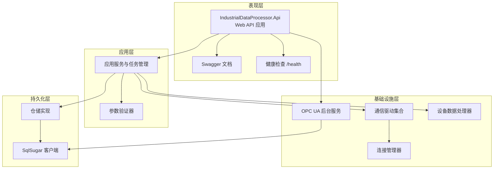
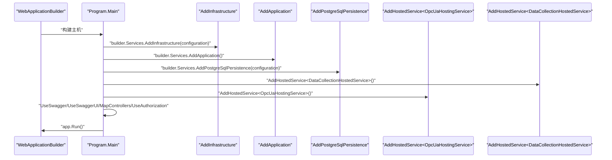
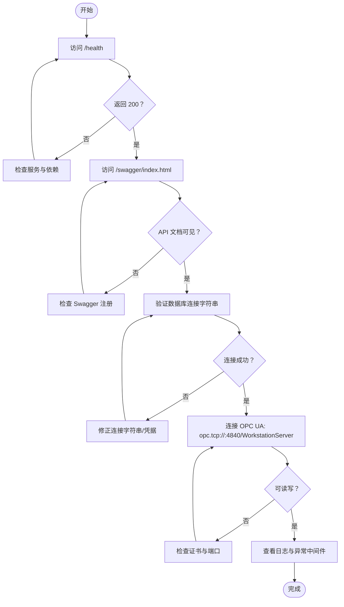
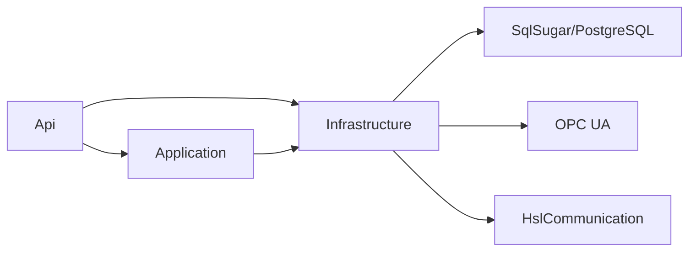

# 环境准备

<cite>
**本文引用的文件**
- [IndustrialDataProcessor.Api.csproj](file://IndustrialDataSolution/IndustrialDataProcessor.Api/IndustrialDataProcessor.Api.csproj)
- [Program.cs](file://IndustrialDataSolution/IndustrialDataProcessor.Api/Program.cs)
- [appsettings.json](file://IndustrialDataSolution/IndustrialDataProcessor.Api/appsettings.json)
- [appsettings.Development.json](file://IndustrialDataSolution/IndustrialDataProcessor.Api/appsettings.Development.json)
- [launchSettings.json](file://IndustrialDataSolution/IndustrialDataProcessor.Api/Properties/launchSettings.json)
- [DependencyInjection.cs（应用层）](file://IndustrialDataSolution/IndustrialDataProcessor.Application/DependencyInjection.cs)
- [DependencyInjection.cs（基础设施层）](file://IndustrialDataSolution/IndustrialDataProcessor.Infrastructure/DependencyInjection.cs)
- [DependencyInjection.cs（SqlSugar持久化）](file://IndustrialDataSolution/IndustrialDataProcessor.Infrastructure.Persistence.SqlSugar/DependencyInjection.cs)
- [DataCollectionHostedService.cs](file://IndustrialDataSolution/IndustrialDataProcessor.Api/BackgroundServices/DataCollectionHostedService.cs)
- [OpcUaHostingService.cs](file://IndustrialDataSolution/IndustrialDataProcessor.Infrastructure/BackgroundServices/OpcUaHostingService.cs)
- [GlobalExceptionHandler.cs](file://IndustrialDataSolution/IndustrialDataProcessor.Api/Middleware/GlobalExceptionHandler.cs)
- [WorkstationOpcServer.cs](file://IndustrialDataSolution/IndustrialDataProcessor.Infrastructure/OpcUa/WorkstationOpcServer.cs)
- [appsettings.json（模拟器）](file://IndustrialDataSolution/IndustrialDataProcessor.Simulator/appsettings.json)
- [appsettings.Development.json（模拟器）](file://IndustrialDataSolution/IndustrialDataProcessor.Simulator/appsettings.Development.json)
</cite>

## 目录
1. [简介](#简介)
2. [项目结构](#项目结构)
3. [核心组件](#核心组件)
4. [架构总览](#架构总览)
5. [详细组件分析](#详细组件分析)
6. [依赖关系分析](#依赖关系分析)
7. [性能考虑](#性能考虑)
8. [故障排查指南](#故障排查指南)
9. [结论](#结论)
10. [附录](#附录)

## 简介
本文件面向部署与运维工程师，提供 DDD 工业数据处理解决方案的环境准备与部署指南。内容覆盖生产与开发环境的系统要求、服务器硬件建议、系统依赖安装、环境变量与配置模板、以及环境验证与连通性测试方法。目标是帮助团队快速、稳定地完成从开发到生产的环境搭建与验证。

## 项目结构
该解决方案采用多项目分层架构，核心模块包括：
- 表现层：Web API 应用，负责控制器、中间件、健康检查、Swagger 文档与后台托管服务注册。
- 应用层：领域用例编排、验证、应用服务与任务管理。
- 基础设施层：通信驱动、OPC UA 服务器、设备数据处理、连接管理、后台服务等。
- 持久化层：基于 SqlSugar 的 PostgreSQL 访问与仓储实现。
- 共享与工具：共享异常与通用工具。
- 模拟器：独立运行的模拟采集服务，便于开发与联调。

**图表来源**
- [Program.cs](file://IndustrialDataSolution/IndustrialDataProcessor.Api/Program.cs#L18-L30)
- [DependencyInjection.cs（应用层）](file://IndustrialDataSolution/IndustrialDataProcessor.Application/DependencyInjection.cs#L16-L39)
- [DependencyInjection.cs（基础设施层）](file://IndustrialDataSolution/IndustrialDataProcessor.Infrastructure/DependencyInjection.cs#L17-L46)
- [DependencyInjection.cs（SqlSugar持久化）](file://IndustrialDataSolution/IndustrialDataProcessor.Infrastructure.Persistence.SqlSugar/DependencyInjection.cs#L11-L46)

**章节来源**
- [IndustrialDataProcessor.Api.csproj](file://IndustrialDataSolution/IndustrialDataProcessor.Api/IndustrialDataProcessor.Api.csproj#L1-L21)
- [Program.cs](file://IndustrialDataSolution/IndustrialDataProcessor.Api/Program.cs#L10-L51)

## 核心组件
- Web API 主机与中间件链：注册内存缓存、应用层与基础设施层、健康检查、Swagger、全局异常处理与请求日志中间件。
- 应用层：注册验证器、应用服务、任务管理器、进程内数据通道、MediatR。
- 基础设施层：HslCommunication 授权校验、连接管理器、设备数据处理器、OPC UA 后台服务注册与依赖注入。
- 持久化层：PostgreSQL 连接字符串解析、SqlSugar 客户端创建、仓储注册。
- 后台服务：数据采集托管服务、OPC UA 托管服务。

**章节来源**
- [Program.cs](file://IndustrialDataSolution/IndustrialDataProcessor.Api/Program.cs#L14-L51)
- [DependencyInjection.cs（应用层）](file://IndustrialDataSolution/IndustrialDataProcessor.Application/DependencyInjection.cs#L16-L39)
- [DependencyInjection.cs（基础设施层）](file://IndustrialDataSolution/IndustrialDataProcessor.Infrastructure/DependencyInjection.cs#L17-L46)
- [DependencyInjection.cs（SqlSugar持久化）](file://IndustrialDataSolution/IndustrialDataProcessor.Infrastructure.Persistence.SqlSugar/DependencyInjection.cs#L11-L46)

## 架构总览
下图展示应用启动时的核心依赖注入流程与后台服务装配：

**图表来源**
- [Program.cs](file://IndustrialDataSolution/IndustrialDataProcessor.Api/Program.cs#L18-L30)
- [DependencyInjection.cs（基础设施层）](file://IndustrialDataSolution/IndustrialDataProcessor.Infrastructure/DependencyInjection.cs#L17-L46)
- [DependencyInjection.cs（应用层）](file://IndustrialDataSolution/IndustrialDataProcessor.Application/DependencyInjection.cs#L16-L39)
- [DependencyInjection.cs（SqlSugar持久化）](file://IndustrialDataSolution/IndustrialDataProcessor.Infrastructure.Persistence.SqlSugar/DependencyInjection.cs#L11-L46)

## 详细组件分析

### 系统要求与运行时
- 操作系统
  - Windows Server 或 Linux（推荐使用长期支持版本 LTS）。
  - 需要具备 .NET 运行时的安装能力。
- .NET 版本
  - 目标框架为 net8.0，需安装 .NET 8 运行时或 SDK。
- 数据库
  - PostgreSQL（通过 SqlSugar 客户端连接）。
- 网络与端口
  - OPC UA 默认监听 TCP 端口：4840。
  - Web API 默认监听端口由启动配置决定（示例为 http://localhost:5170）。
- OPC UA 证书目录
  - pki/own、pki/trusted 等目录用于证书存储与信任链管理。

**章节来源**
- [IndustrialDataProcessor.Api.csproj](file://IndustrialDataSolution/IndustrialDataProcessor.Api/IndustrialDataProcessor.Api.csproj#L3-L7)
- [OpcUaHostingService.cs](file://IndustrialDataSolution/IndustrialDataProcessor.Infrastructure/BackgroundServices/OpcUaHostingService.cs#L204-L209)
- [WorkstationOpcServer.cs](file://IndustrialDataSolution/IndustrialDataProcessor.Infrastructure/OpcUa/WorkstationOpcServer.cs#L11-L35)

### 服务器硬件配置建议
- CPU
  - 生产环境建议双核起步，四核以上以应对并发采集与 OPC UA 通信。
- 内存
  - 至少 4 GB，建议 8 GB 以上，以便承载数据库连接池与并发任务。
- 存储
  - SSD 固态硬盘优先；系统盘 60 GB+；数据盘根据历史数据量规划。
- 网络
  - 千兆以太网；确保 OPC UA 4840 端口与 Web API 端口可达；防火墙放行相应端口。
- 容器/虚拟化
  - 如使用容器，建议限制 CPU/内存并开启健康检查；为 OPC UA 与数据库预留资源。

### 必要系统依赖项安装
- PostgreSQL
  - 安装 PostgreSQL 服务端与客户端工具；创建数据库与用户；确保网络可达。
- .NET 8 运行时/SDK
  - 安装 .NET 8 运行时；如需构建，安装 .NET 8 SDK。
- OPC UA 相关组件
  - 项目内置 OPC UA 服务器与证书目录；首次运行会生成证书目录（pki/*）。
- HslCommunication 授权
  - 需要在配置中提供 AuthorizationCode，否则应用无法启动。

**章节来源**
- [DependencyInjection.cs（基础设施层）](file://IndustrialDataSolution/IndustrialDataProcessor.Infrastructure/DependencyInjection.cs#L19-L28)
- [DependencyInjection.cs（SqlSugar持久化）](file://IndustrialDataSolution/IndustrialDataProcessor.Infrastructure.Persistence.SqlSugar/DependencyInjection.cs#L13-L13)
- [OpcUaHostingService.cs](file://IndustrialDataSolution/IndustrialDataProcessor.Infrastructure/BackgroundServices/OpcUaHostingService.cs#L195-L200)

### 环境变量与配置模板

- 开发环境（Development）
  - ASPNETCORE_ENVIRONMENT=Development
  - 日志级别默认为 Information，可按需调整。
  - Web API 启动端口示例：http://localhost:5170（可通过 launchSettings.json 修改）。
- 生产环境（Production）
  - ASPNETCORE_ENVIRONMENT=Production
  - 建议设置更严格的日志级别（如 Warning 或更高）。
  - 明确指定数据库连接字符串与 Hsl 授权码。

- 关键配置项
  - ConnectionStrings:DefaultConnection（PostgreSQL 连接字符串）
  - HslCommunication:AuthorizationCode（HslCommunication 授权码）
  - Logging:LogLevel（日志级别）

- 配置模板（路径参考）
  - Web API 配置：appsettings.json、appsettings.Development.json
  - 模拟器配置：appsettings.json、appsettings.Development.json
  - 启动配置：Properties/launchSettings.json

**章节来源**
- [appsettings.json](file://IndustrialDataSolution/IndustrialDataProcessor.Api/appsettings.json#L10-L15)
- [appsettings.Development.json](file://IndustrialDataSolution/IndustrialDataProcessor.Api/appsettings.Development.json#L1-L9)
- [launchSettings.json](file://IndustrialDataSolution/IndustrialDataProcessor.Api/Properties/launchSettings.json#L18-L20)
- [appsettings.json（模拟器）](file://IndustrialDataSolution/IndustrialDataProcessor.Simulator/appsettings.json#L1-L9)
- [appsettings.Development.json（模拟器）](file://IndustrialDataSolution/IndustrialDataProcessor.Simulator/appsettings.Development.json#L1-L9)

### 不同部署环境的最佳实践
- 开发环境
  - 使用 IIS Express 或 Kestrel（http://localhost:5170）。
  - 保持较低日志级别，便于调试。
  - 可临时使用本地 PostgreSQL 或 Docker Compose。
- 测试环境
  - 与生产隔离的数据库与 OPC UA 环境。
  - 启用健康检查与最小日志级别。
- 生产环境
  - 使用 systemd（Linux）或 Windows 服务（Windows）托管。
  - 明确设置 ASPNETCORE_ENVIRONMENT 与连接字符串。
  - 配置健康检查端点 /health 与反向代理（Nginx/IIS）。
  - 为 pki 目录配置持久化卷或备份策略。

**章节来源**
- [Program.cs](file://IndustrialDataSolution/IndustrialDataProcessor.Api/Program.cs#L47-L49)
- [launchSettings.json](file://IndustrialDataSolution/IndustrialDataProcessor.Api/Properties/launchSettings.json#L11-L30)

### 环境验证与连通性测试
- 健康检查
  - 访问 /health 确认服务就绪。
- Swagger 文档
  - 访问 /swagger/index.html 查看 API 列表与可用性。
- 数据库连通性
  - 使用连接字符串验证 PostgreSQL 可达与认证成功。
- OPC UA 连通性
  - 使用 UA 客户端连接 opc.tcp://<host>:4840/WorkstationServer，确认匿名访问可用。
- 日志与异常
  - 观察全局异常中间件输出，定位参数、业务规则与基础设施异常。

**图表来源**
- [Program.cs](file://IndustrialDataSolution/IndustrialDataProcessor.Api/Program.cs#L45-L49)
- [GlobalExceptionHandler.cs](file://IndustrialDataSolution/IndustrialDataProcessor.Api/Middleware/GlobalExceptionHandler.cs#L12-L47)
- [OpcUaHostingService.cs](file://IndustrialDataSolution/IndustrialDataProcessor.Infrastructure/BackgroundServices/OpcUaHostingService.cs#L204-L209)

## 依赖关系分析
- 组件耦合
  - 表现层依赖应用层与基础设施层；基础设施层依赖领域与第三方库（HslCommunication、OPC UA）。
  - 持久化层通过 SqlSugar 与 PostgreSQL 交互，仓储实现依赖 SqlSugar 客户端。
- 外部依赖
  - PostgreSQL（数据库）
  - HslCommunication（通信授权）
  - OPC UA（服务器与证书）
- 循环依赖
  - 项目间采用清晰的依赖方向，未见循环依赖迹象。

**图表来源**
- [Program.cs](file://IndustrialDataSolution/IndustrialDataProcessor.Api/Program.cs#L18-L22)
- [DependencyInjection.cs（基础设施层）](file://IndustrialDataSolution/IndustrialDataProcessor.Infrastructure/DependencyInjection.cs#L17-L46)
- [DependencyInjection.cs（SqlSugar持久化）](file://IndustrialDataSolution/IndustrialDataProcessor.Infrastructure.Persistence.SqlSugar/DependencyInjection.cs#L11-L46)

**章节来源**
- [Program.cs](file://IndustrialDataSolution/IndustrialDataProcessor.Api/Program.cs#L18-L22)
- [DependencyInjection.cs（基础设施层）](file://IndustrialDataSolution/IndustrialDataProcessor.Infrastructure/DependencyInjection.cs#L17-L46)
- [DependencyInjection.cs（SqlSugar持久化）](file://IndustrialDataSolution/IndustrialDataProcessor.Infrastructure.Persistence.SqlSugar/DependencyInjection.cs#L11-L46)

## 性能考虑
- 连接池与超时
  - PostgreSQL 连接字符串包含池化参数与命令超时，建议结合实际负载调优。
- 日志级别
  - 生产环境建议提升日志级别，减少 I/O 压力。
- OPC UA 与数据通道
  - 合理配置 OPC UA 服务器与数据通道消费节奏，避免阻塞。
- 并发与后台任务
  - 数据采集与 OPC UA 后台服务均使用托管服务，注意取消令牌与资源释放。

**章节来源**
- [appsettings.json](file://IndustrialDataSolution/IndustrialDataProcessor.Api/appsettings.json#L10-L12)
- [DataCollectionHostedService.cs](file://IndustrialDataSolution/IndustrialDataProcessor.Api/BackgroundServices/DataCollectionHostedService.cs#L15-L26)
- [OpcUaHostingService.cs](file://IndustrialDataSolution/IndustrialDataProcessor.Infrastructure/BackgroundServices/OpcUaHostingService.cs#L45-L61)

## 故障排查指南
- 启动失败：HslCommunication 授权未通过
  - 现象：应用启动即抛出授权失败异常。
  - 处理：在配置中提供正确的 AuthorizationCode。
- 数据库连接失败
  - 现象：持久化层初始化时报错。
  - 处理：检查连接字符串、网络连通性与凭据。
- OPC UA 证书问题
  - 现象：OPC UA 服务器启动失败或客户端连接被拒。
  - 处理：确认 pki 目录存在且权限正确，证书链有效。
- 全局异常
  - 现象：HTTP 500/400/409 等错误响应。
  - 处理：查看日志与异常中间件输出，定位参数、业务规则或基础设施问题。

**章节来源**
- [DependencyInjection.cs（基础设施层）](file://IndustrialDataSolution/IndustrialDataProcessor.Infrastructure/DependencyInjection.cs#L23-L28)
- [DependencyInjection.cs（SqlSugar持久化）](file://IndustrialDataSolution/IndustrialDataProcessor.Infrastructure.Persistence.SqlSugar/DependencyInjection.cs#L13-L13)
- [GlobalExceptionHandler.cs](file://IndustrialDataSolution/IndustrialDataProcessor.Api/Middleware/GlobalExceptionHandler.cs#L12-L47)

## 结论
通过明确的系统要求、硬件建议、依赖安装与配置模板，结合健康检查与连通性测试流程，可高效完成 DDD 工业数据处理解决方案的环境准备与部署。生产环境建议严格区分日志级别、连接字符串与证书策略，并配合健康检查与反向代理实现高可用。

## 附录
- 配置文件位置参考
  - Web API：appsettings.json、appsettings.Development.json、Properties/launchSettings.json
  - 模拟器：appsettings.json、appsettings.Development.json
- 关键端口
  - Web API：示例 http://localhost:5170（可在 launchSettings.json 中修改）
  - OPC UA：opc.tcp://<host>:4840/WorkstationServer