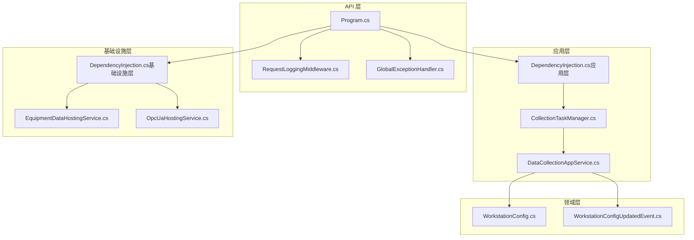
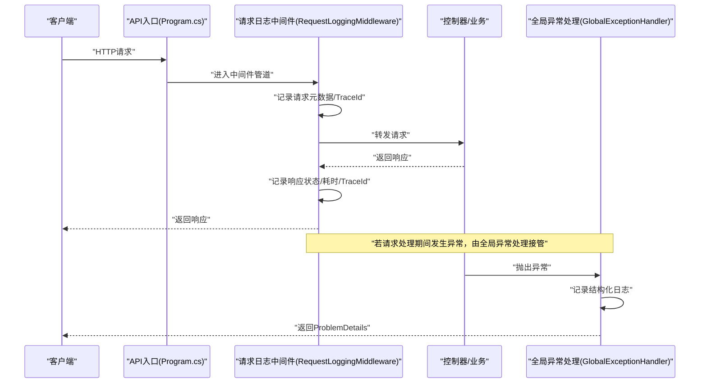
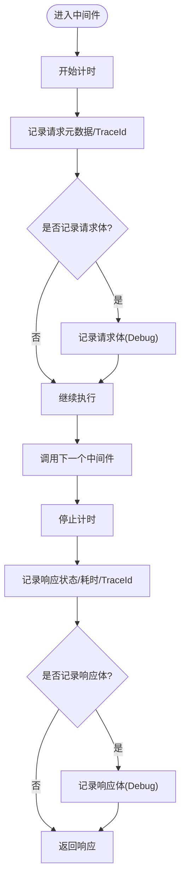
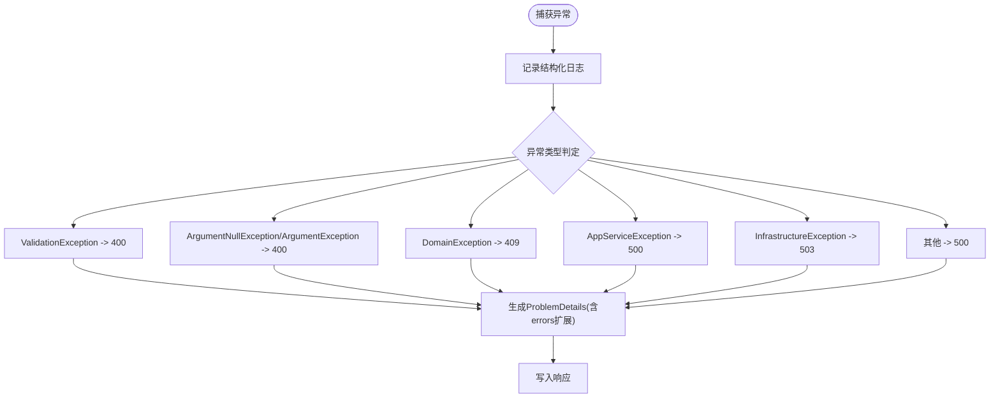
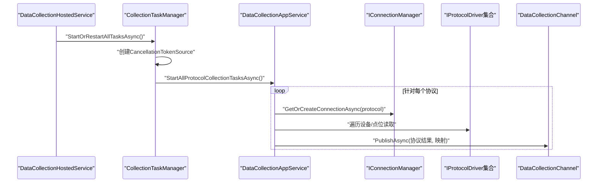
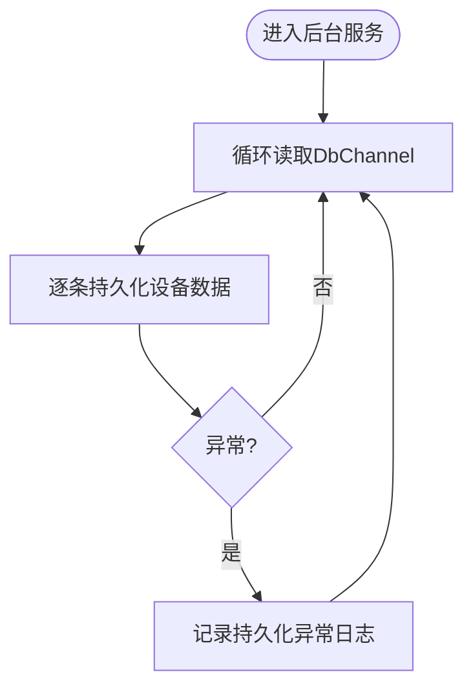
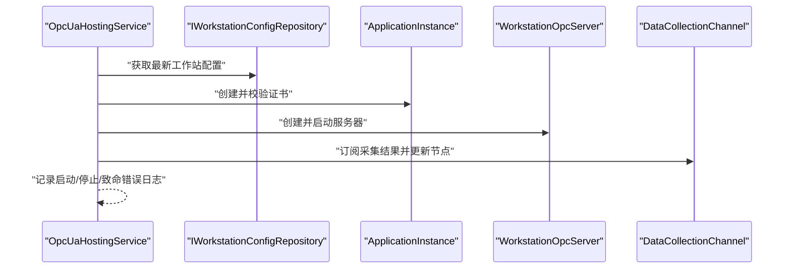
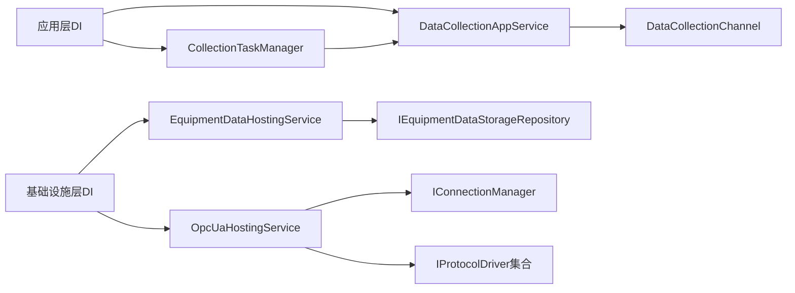

# 监控与日志

<cite>
**本文引用的文件**
- [Program.cs](file://IndustrialDataSolution/IndustrialDataProcessor.Api/Program.cs)
- [appsettings.json](file://IndustrialDataSolution/IndustrialDataProcessor.Api/appsettings.json)
- [appsettings.Development.json](file://IndustrialDataSolution/IndustrialDataProcessor.Api/appsettings.Development.json)
- [RequestLoggingMiddleware.cs](file://IndustrialDataSolution/IndustrialDataProcessor.Api/Middleware/RequestLoggingMiddleware.cs)
- [GlobalExceptionHandler.cs](file://IndustrialDataSolution/IndustrialDataProcessor.Api/Middleware/GlobalExceptionHandler.cs)
- [DataCollectionHostedService.cs](file://IndustrialDataSolution/IndustrialDataProcessor.Api/BackgroundServices/DataCollectionHostedService.cs)
- [CollectionTaskManager.cs](file://IndustrialDataSolution/IndustrialDataProcessor.Application/Services/CollectionTaskManager.cs)
- [DataCollectionAppService.cs](file://IndustrialDataSolution/IndustrialDataProcessor.Application/Services/DataCollectionAppService.cs)
- [EquipmentDataHostingService.cs](file://IndustrialDataSolution/IndustrialDataProcessor.Infrastructure/BackgroundServices/EquipmentDataHostingService.cs)
- [OpcUaHostingService.cs](file://IndustrialDataSolution/IndustrialDataProcessor.Infrastructure/BackgroundServices/OpcUaHostingService.cs)
- [DependencyInjection.cs（应用层）](file://IndustrialDataSolution/IndustrialDataProcessor.Application/DependencyInjection.cs)
- [DependencyInjection.cs（基础设施层）](file://IndustrialDataSolution/IndustrialDataProcessor.Infrastructure/DependencyInjection.cs)
- [WorkstationConfig.cs](file://IndustrialDataSolution/IndustrialDataProcessor.Domain/Workstation/Configs/WorkstationConfig.cs)
- [WorkstationConfigUpdatedEvent.cs](file://IndustrialDataSolution/IndustrialDataProcessor.Application/Events/WorkstationConfigUpdatedEvent.cs)
</cite>

## 目录
1. [简介](#简介)
2. [项目结构](#项目结构)
3. [核心组件](#核心组件)
4. [架构总览](#架构总览)
5. [详细组件分析](#详细组件分析)
6. [依赖关系分析](#依赖关系分析)
7. [性能考量](#性能考量)
8. [故障排查指南](#故障排查指南)
9. [结论](#结论)
10. [附录](#附录)

## 简介
本文件面向DDD工业数据处理解决方案，系统性阐述监控与日志的设计与落地实践。内容覆盖：
- 应用监控指标设计与采集：性能指标（吞吐、延迟、资源）、业务指标（协议/设备/点位成功率、处理速率）、健康检查指标（服务可用性、后台服务状态）
- 日志配置与管理：日志级别、统一格式、请求/响应体记录策略、异常与审计日志
- 监控系统集成：Prometheus、Grafana、APM工具的配置思路与指标暴露方式
- 告警规则与通知：基于阈值与趋势的告警策略与通知渠道
- 日志分析与故障排查：日志检索、关联追踪、关键路径定位
- 监控仪表板设计与关键指标解读：如何通过可视化理解系统健康度与性能瓶颈

## 项目结构
本项目采用多层架构（API、应用、领域、基础设施、持久化），监控与日志贯穿各层：
- API层：健康检查、请求日志中间件、全局异常处理
- 应用层：采集任务管理、采集服务、验证行为
- 基础设施层：设备数据持久化后台服务、OPC UA服务后台服务
- 领域层：工作站配置模型、事件

图表来源
- [Program.cs](file://IndustrialDataSolution/IndustrialDataProcessor.Api/Program.cs#L36-L51)
- [RequestLoggingMiddleware.cs](file://IndustrialDataSolution/IndustrialDataProcessor.Api/Middleware/RequestLoggingMiddleware.cs#L16-L84)
- [GlobalExceptionHandler.cs](file://IndustrialDataSolution/IndustrialDataProcessor.Api/Middleware/GlobalExceptionHandler.cs#L12-L47)
- [CollectionTaskManager.cs](file://IndustrialDataSolution/IndustrialDataProcessor.Application/Services/CollectionTaskManager.cs#L19-L51)
- [DataCollectionAppService.cs](file://IndustrialDataSolution/IndustrialDataProcessor.Application/Services/DataCollectionAppService.cs#L22-L41)
- [EquipmentDataHostingService.cs](file://IndustrialDataSolution/IndustrialDataProcessor.Infrastructure/BackgroundServices/EquipmentDataHostingService.cs#L16-L41)
- [OpcUaHostingService.cs](file://IndustrialDataSolution/IndustrialDataProcessor.Infrastructure/BackgroundServices/OpcUaHostingService.cs#L45-L61)
- [DependencyInjection.cs（应用层）](file://IndustrialDataSolution/IndustrialDataProcessor.Application/DependencyInjection.cs#L16-L39)
- [DependencyInjection.cs（基础设施层）](file://IndustrialDataSolution/IndustrialDataProcessor.Infrastructure/DependencyInjection.cs#L17-L46)
- [WorkstationConfig.cs](file://IndustrialDataSolution/IndustrialDataProcessor.Domain/Workstation/Configs/WorkstationConfig.cs#L6-L26)
- [WorkstationConfigUpdatedEvent.cs](file://IndustrialDataSolution/IndustrialDataProcessor.Application/Events/WorkstationConfigUpdatedEvent.cs#L7-L10)

章节来源
- [Program.cs](file://IndustrialDataSolution/IndustrialDataProcessor.Api/Program.cs#L10-L51)
- [appsettings.json](file://IndustrialDataSolution/IndustrialDataProcessor.Api/appsettings.json#L1-L17)
- [appsettings.Development.json](file://IndustrialDataSolution/IndustrialDataProcessor.Api/appsettings.Development.json#L1-L9)

## 核心组件
- 健康检查与路由：在API入口注册健康检查端点，便于外部系统探测服务可用性
- 请求日志中间件：统一记录请求/响应元数据、耗时、TraceId，按需记录请求/响应体
- 全局异常处理：将异常转化为标准ProblemDetails，同时记录结构化日志
- 采集任务管理：统一启动/重启所有协议采集任务，支持优雅取消
- 采集服务：按协议/设备/点位维度执行读取、聚合与通道发布
- 设备数据持久化后台服务：消费采集通道数据并持久化
- OPC UA后台服务：启动/重启OPC UA服务器，订阅采集通道并更新节点值

章节来源
- [Program.cs](file://IndustrialDataSolution/IndustrialDataProcessor.Api/Program.cs#L27-L49)
- [RequestLoggingMiddleware.cs](file://IndustrialDataSolution/IndustrialDataProcessor.Api/Middleware/RequestLoggingMiddleware.cs#L16-L84)
- [GlobalExceptionHandler.cs](file://IndustrialDataSolution/IndustrialDataProcessor.Api/Middleware/GlobalExceptionHandler.cs#L12-L47)
- [CollectionTaskManager.cs](file://IndustrialDataSolution/IndustrialDataProcessor.Application/Services/CollectionTaskManager.cs#L19-L51)
- [DataCollectionAppService.cs](file://IndustrialDataSolution/IndustrialDataProcessor.Application/Services/DataCollectionAppService.cs#L22-L41)
- [EquipmentDataHostingService.cs](file://IndustrialDataSolution/IndustrialDataProcessor.Infrastructure/BackgroundServices/EquipmentDataHostingService.cs#L16-L41)
- [OpcUaHostingService.cs](file://IndustrialDataSolution/IndustrialDataProcessor.Infrastructure/BackgroundServices/OpcUaHostingService.cs#L45-L61)

## 架构总览
以下序列图展示请求从进入系统到响应的完整链路，以及异常与日志记录的关键节点。

图表来源
- [Program.cs](file://IndustrialDataSolution/IndustrialDataProcessor.Api/Program.cs#L38-L49)
- [RequestLoggingMiddleware.cs](file://IndustrialDataSolution/IndustrialDataProcessor.Api/Middleware/RequestLoggingMiddleware.cs#L16-L84)
- [GlobalExceptionHandler.cs](file://IndustrialDataSolution/IndustrialDataProcessor.Api/Middleware/GlobalExceptionHandler.cs#L12-L47)

## 详细组件分析

### 请求日志中间件
- 功能要点
  - 记录请求开始与完成信息，包含方法、路径、TraceId
  - 可选记录请求体与响应体（按条件开启，避免性能开销）
  - 记录请求耗时，便于性能分析
- 关键决策
  - 仅对JSON请求/响应记录体，降低IO与日志体积
  - Debug级别才记录请求/响应体，生产环境默认关闭
- 适用场景
  - API调试、问题复现、审计追踪

图表来源
- [RequestLoggingMiddleware.cs](file://IndustrialDataSolution/IndustrialDataProcessor.Api/Middleware/RequestLoggingMiddleware.cs#L16-L84)

章节来源
- [RequestLoggingMiddleware.cs](file://IndustrialDataSolution/IndustrialDataProcessor.Api/Middleware/RequestLoggingMiddleware.cs#L16-L131)

### 全局异常处理
- 功能要点
  - 结构化记录异常日志（区分参数/业务/基础设施/未知）
  - 将异常映射为标准ProblemDetails，包含状态码、标题、详情与扩展字段
  - 对FluentValidation异常输出字段级错误字典
- 适用场景
  - 统一错误输出、前端友好提示、日志审计

图表来源
- [GlobalExceptionHandler.cs](file://IndustrialDataSolution/IndustrialDataProcessor.Api/Middleware/GlobalExceptionHandler.cs#L12-L47)

章节来源
- [GlobalExceptionHandler.cs](file://IndustrialDataSolution/IndustrialDataProcessor.Api/Middleware/GlobalExceptionHandler.cs#L12-L92)

### 采集任务管理与采集服务
- 采集任务管理
  - 提供统一启动/重启能力，支持优雅取消
  - 控制并发重启，避免重复任务
- 采集服务
  - 加载工作站配置，按协议启动独立采集线程
  - 按设备/点位循环读取，记录耗时与结果
  - 发布采集结果至通道，供下游持久化与OPC UA更新
  - 协议级异常隔离，不影响其他协议线程

图表来源
- [DataCollectionHostedService.cs](file://IndustrialDataSolution/IndustrialDataProcessor.Api/BackgroundServices/DataCollectionHostedService.cs#L15-L26)
- [CollectionTaskManager.cs](file://IndustrialDataSolution/IndustrialDataProcessor.Application/Services/CollectionTaskManager.cs#L19-L51)
- [DataCollectionAppService.cs](file://IndustrialDataSolution/IndustrialDataProcessor.Application/Services/DataCollectionAppService.cs#L22-L41)
- [DataCollectionAppService.cs](file://IndustrialDataSolution/IndustrialDataProcessor.Application/Services/DataCollectionAppService.cs#L46-L214)

章节来源
- [DataCollectionHostedService.cs](file://IndustrialDataSolution/IndustrialDataProcessor.Api/BackgroundServices/DataCollectionHostedService.cs#L15-L26)
- [CollectionTaskManager.cs](file://IndustrialDataSolution/IndustrialDataProcessor.Application/Services/CollectionTaskManager.cs#L19-L51)
- [DataCollectionAppService.cs](file://IndustrialDataSolution/IndustrialDataProcessor.Application/Services/DataCollectionAppService.cs#L22-L214)

### 设备数据持久化后台服务
- 功能要点
  - 订阅采集通道中的数据库写入映射
  - 逐条持久化设备数据，异常时记录日志
- 适用场景
  - 将采集结果可靠落库，支撑后续分析与查询

图表来源
- [EquipmentDataHostingService.cs](file://IndustrialDataSolution/IndustrialDataProcessor.Infrastructure/BackgroundServices/EquipmentDataHostingService.cs#L16-L41)

章节来源
- [EquipmentDataHostingService.cs](file://IndustrialDataSolution/IndustrialDataProcessor.Infrastructure/BackgroundServices/EquipmentDataHostingService.cs#L16-L41)

### OPC UA后台服务
- 功能要点
  - 启动/重启OPC UA服务器，绑定写入事件（反推物理值）
  - 订阅采集通道，更新OPC节点值
  - 记录关键生命周期日志（启动、停止、致命错误）
- 适用场景
  - 作为边缘数据源对外提供OPC UA访问

图表来源
- [OpcUaHostingService.cs](file://IndustrialDataSolution/IndustrialDataProcessor.Infrastructure/BackgroundServices/OpcUaHostingService.cs#L105-L133)
- [OpcUaHostingService.cs](file://IndustrialDataSolution/IndustrialDataProcessor.Infrastructure/BackgroundServices/OpcUaHostingService.cs#L160-L174)
- [OpcUaHostingService.cs](file://IndustrialDataSolution/IndustrialDataProcessor.Infrastructure/BackgroundServices/OpcUaHostingService.cs#L186-L214)

章节来源
- [OpcUaHostingService.cs](file://IndustrialDataSolution/IndustrialDataProcessor.Infrastructure/BackgroundServices/OpcUaHostingService.cs#L45-L184)

### 日志配置与管理
- 日志级别
  - 默认级别：Information
  - ASP.NET Core框架：Warning
- 日志格式
  - 统一使用结构化日志（包含TraceId、路径、方法、状态码、耗时等上下文）
  - 请求/响应体仅在Debug级别按条件记录
- 日志轮转
  - 建议结合平台日志系统（如容器日志、作业系统日志轮转）进行滚动与归档
- 关键日志点
  - 请求开始/完成、异常、后台服务启动/停止、持久化异常、OPC UA致命错误

章节来源
- [appsettings.json](file://IndustrialDataSolution/IndustrialDataProcessor.Api/appsettings.json#L2-L7)
- [appsettings.Development.json](file://IndustrialDataSolution/IndustrialDataProcessor.Api/appsettings.Development.json#L2-L7)
- [RequestLoggingMiddleware.cs](file://IndustrialDataSolution/IndustrialDataProcessor.Api/Middleware/RequestLoggingMiddleware.cs#L23-L77)
- [EquipmentDataHostingService.cs](file://IndustrialDataSolution/IndustrialDataProcessor.Infrastructure/BackgroundServices/EquipmentDataHostingService.cs#L33-L33)
- [OpcUaHostingService.cs](file://IndustrialDataSolution/IndustrialDataProcessor.Infrastructure/BackgroundServices/OpcUaHostingService.cs#L182-L182)

### 监控指标设计与采集
- 性能指标
  - 请求耗时（毫秒）：来自请求日志中间件
  - 吞吐量（QPS）：按路径/控制器统计
  - 资源占用：CPU、内存、连接池使用率（结合APM）
- 业务指标
  - 协议采集成功率：协议级ReadIsSuccess
  - 设备/点位采集成功率：设备/点位级ReadIsSuccess
  - 处理速率：每协议/每设备/每点位的平均耗时
  - 写入OPC UA成功率：写入事件回调结果
- 健康检查指标
  - /health端点可用性
  - 后台服务状态：采集服务、OPC UA服务、持久化服务
  - 数据库连接可用性

章节来源
- [Program.cs](file://IndustrialDataSolution/IndustrialDataProcessor.Api/Program.cs#L47-L47)
- [DataCollectionAppService.cs](file://IndustrialDataSolution/IndustrialDataProcessor.Application/Services/DataCollectionAppService.cs#L65-L75)
- [DataCollectionAppService.cs](file://IndustrialDataSolution/IndustrialDataProcessor.Application/Services/DataCollectionAppService.cs#L121-L137)
- [OpcUaHostingService.cs](file://IndustrialDataSolution/IndustrialDataProcessor.Infrastructure/BackgroundServices/OpcUaHostingService.cs#L136-L157)

### 监控系统集成（Prometheus、Grafana、APM）
- Prometheus
  - 使用ASP.NET Core内置指标导出（如通过第三方包或自定义端点）
  - 暴露关键指标：请求耗时直方图、异常计数、后台服务状态
- Grafana
  - 基于Prometheus数据源构建仪表板
  - 关键面板：请求延迟分布、错误率、采集成功率、后台服务存活
- APM工具
  - 推荐：Application Insights、New Relic或自建APM
  - 采集：事务跟踪、异常追踪、依赖链路、数据库/外部服务调用

[本节为通用集成指导，不直接分析具体代码文件]

### 告警规则与通知
- 告警规则示例
  - 错误率：5分钟内4xx/5xx错误占比超过阈值
  - 延迟：P95/P99请求延迟超过阈值
  - 成功率：协议/设备/点位成功率低于阈值
  - 健康：/health不可用或后台服务异常退出
- 通知机制
  - 邮件、企业微信、钉钉机器人、PagerDuty等
  - 分级告警：Warn/Critical，避免告警风暴

[本节为通用告警实践，不直接分析具体代码文件]

### 监控仪表板设计与关键指标解读
- 仪表板建议
  - 实时概览：请求QPS、错误率、P95延迟
  - 采集视图：协议/设备/点位成功率、耗时分布
  - 后台服务：采集服务、OPC UA服务、持久化服务状态
  - 异常视图：异常类型分布、Top错误路径
- 关键指标解读
  - 成功率下降：优先检查协议驱动、设备连接、网络波动
  - 延迟升高：关注数据库/外部服务、GC、锁竞争
  - 错误率上升：聚焦参数/业务异常与全局异常处理

[本节为通用仪表板设计，不直接分析具体代码文件]

## 依赖关系分析
- 依赖注入
  - 应用层：注册验证器、应用服务、任务管理器、数据采集通道
  - 基础设施层：注册连接管理器、后台服务、OPC UA服务、序列化选项
- 后台服务耦合
  - 采集服务与通道解耦，便于横向扩展
  - OPC UA与采集通道解耦，支持独立启停

图表来源
- [DependencyInjection.cs（应用层）](file://IndustrialDataSolution/IndustrialDataProcessor.Application/DependencyInjection.cs#L16-L39)
- [DependencyInjection.cs（基础设施层）](file://IndustrialDataSolution/IndustrialDataProcessor.Infrastructure/DependencyInjection.cs#L17-L46)
- [CollectionTaskManager.cs](file://IndustrialDataSolution/IndustrialDataProcessor.Application/Services/CollectionTaskManager.cs#L46-L51)
- [DataCollectionAppService.cs](file://IndustrialDataSolution/IndustrialDataProcessor.Application/Services/DataCollectionAppService.cs#L10-L17)
- [EquipmentDataHostingService.cs](file://IndustrialDataSolution/IndustrialDataProcessor.Infrastructure/BackgroundServices/EquipmentDataHostingService.cs#L09-L14)
- [OpcUaHostingService.cs](file://IndustrialDataSolution/IndustrialDataProcessor.Infrastructure/BackgroundServices/OpcUaHostingService.cs#L20-L27)

章节来源
- [DependencyInjection.cs（应用层）](file://IndustrialDataSolution/IndustrialDataProcessor.Application/DependencyInjection.cs#L16-L39)
- [DependencyInjection.cs（基础设施层）](file://IndustrialDataSolution/IndustrialDataProcessor.Infrastructure/DependencyInjection.cs#L17-L46)

## 性能考量
- 日志开销控制
  - 默认关闭请求/响应体记录，仅在Debug级别按条件开启
  - 使用结构化日志减少格式化成本
- 采集性能
  - 协议级独立线程，避免相互阻塞
  - 任务取消与优雅退出，避免资源泄漏
- 数据持久化
  - 逐条持久化，异常单独记录，避免单点故障放大

[本节为通用性能建议，不直接分析具体代码文件]

## 故障排查指南
- 快速定位
  - 通过TraceId串联请求全链路日志
  - 关注请求日志中间件记录的耗时与状态码
- 常见问题
  - 采集失败：检查协议驱动、设备连接、异常分支日志
  - 持久化异常：查看持久化后台服务日志
  - OPC UA异常：查看OPC UA服务日志与证书配置
- 事件与配置变更
  - 配置更新事件可用于触发服务重启或通道刷新

章节来源
- [RequestLoggingMiddleware.cs](file://IndustrialDataSolution/IndustrialDataProcessor.Api/Middleware/RequestLoggingMiddleware.cs#L23-L77)
- [EquipmentDataHostingService.cs](file://IndustrialDataSolution/IndustrialDataProcessor.Infrastructure/BackgroundServices/EquipmentDataHostingService.cs#L33-L33)
- [OpcUaHostingService.cs](file://IndustrialDataSolution/IndustrialDataProcessor.Infrastructure/BackgroundServices/OpcUaHostingService.cs#L182-L182)
- [WorkstationConfigUpdatedEvent.cs](file://IndustrialDataSolution/IndustrialDataProcessor.Application/Events/WorkstationConfigUpdatedEvent.cs#L7-L10)

## 结论
本方案通过统一的日志中间件、全局异常处理与后台服务监控，实现了对工业数据采集链路的可观测性闭环。配合Prometheus/Grafana/APM工具，可建立完善的性能与业务指标体系，并通过告警与仪表板快速定位问题。建议在生产环境中进一步完善指标导出、日志轮转与告警策略，持续优化采集与处理性能。

## 附录
- 配置参考
  - 日志级别与默认配置位于应用设置文件
  - 健康检查端点在API入口注册
- 关键文件索引
  - API入口与中间件：Program.cs、RequestLoggingMiddleware.cs、GlobalExceptionHandler.cs
  - 采集与后台服务：CollectionTaskManager.cs、DataCollectionAppService.cs、EquipmentDataHostingService.cs、OpcUaHostingService.cs
  - 依赖注入：应用层与基础设施层DI文件

章节来源
- [Program.cs](file://IndustrialDataSolution/IndustrialDataProcessor.Api/Program.cs#L27-L49)
- [appsettings.json](file://IndustrialDataSolution/IndustrialDataProcessor.Api/appsettings.json#L2-L7)
- [appsettings.Development.json](file://IndustrialDataSolution/IndustrialDataProcessor.Api/appsettings.Development.json#L2-L7)
- [DependencyInjection.cs（应用层）](file://IndustrialDataSolution/IndustrialDataProcessor.Application/DependencyInjection.cs#L16-L39)
- [DependencyInjection.cs（基础设施层）](file://IndustrialDataSolution/IndustrialDataProcessor.Infrastructure/DependencyInjection.cs#L17-L46)