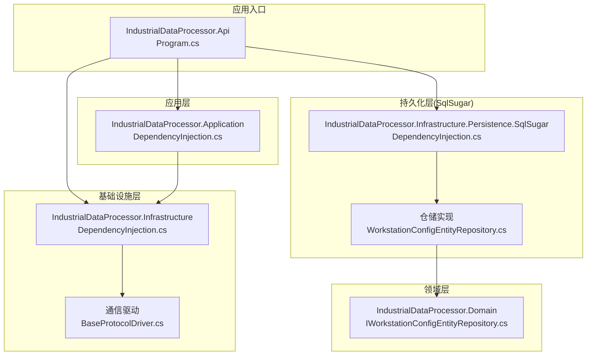
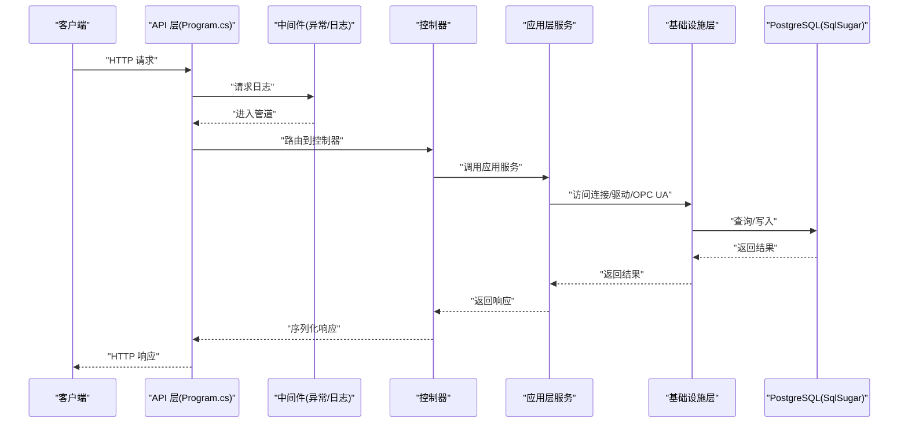
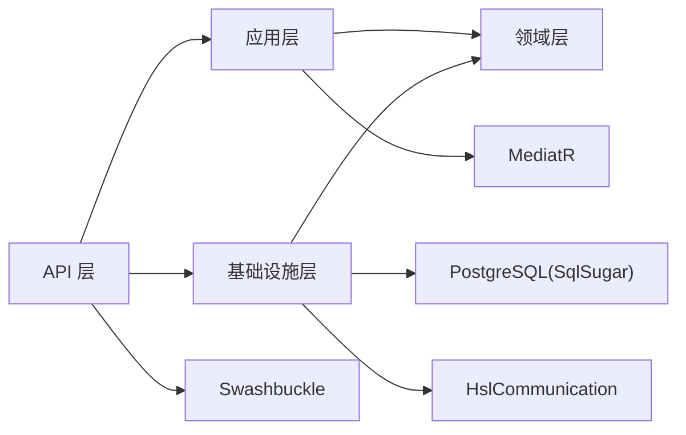

# 部署与运维

<cite>
**本文引用的文件**
- [IndustrialDataProcessor.Api\Program.cs](file://IndustrialDataSolution/IndustrialDataProcessor.Api/Program.cs)
- [IndustrialDataProcessor.Api\appsettings.json](file://IndustrialDataSolution/IndustrialDataProcessor.Api/appsettings.json)
- [IndustrialDataProcessor.Api\appsettings.Development.json](file://IndustrialDataSolution/IndustrialDataProcessor.Api/appsettings.Development.json)
- [IndustrialDataProcessor.Api\Properties\launchSettings.json](file://IndustrialDataSolution/IndustrialDataProcessor.Api/Properties/launchSettings.json)
- [IndustrialDataProcessor.Api\IndustrialDataProcessor.Api.csproj](file://IndustrialDataSolution/IndustrialDataProcessor.Api/IndustrialDataProcessor.Api.csproj)
- [IndustrialDataProcessor.Api\Middleware\GlobalExceptionHandler.cs](file://IndustrialDataSolution/IndustrialDataProcessor.Api/Middleware/GlobalExceptionHandler.cs)
- [IndustrialDataProcessor.Api\BackgroundServices\DataCollectionHostedService.cs](file://IndustrialDataSolution/IndustrialDataProcessor.Api/BackgroundServices/DataCollectionHostedService.cs)
- [IndustrialDataProcessor.Application\DependencyInjection.cs](file://IndustrialDataSolution/IndustrialDataProcessor.Application/DependencyInjection.cs)
- [IndustrialDataProcessor.Infrastructure\DependencyInjection.cs](file://IndustrialDataSolution/IndustrialDataProcessor.Infrastructure/DependencyInjection.cs)
- [IndustrialDataProcessor.Infrastructure\Persistence\SqlSugar\DependencyInjection.cs](file://IndustrialDataSolution/IndustrialDataProcessor.Infrastructure.Persistence.SqlSugar/DependencyInjection.cs)
- [IndustrialDataProcessor.Infrastructure\Persistence\SqlSugar\Repositories\WorkstationConfigEntityRepository.cs](file://IndustrialDataSolution/IndustrialDataProcessor.Infrastructure.Persistence.SqlSugar/Repositories/WorkstationConfigEntityRepository.cs)
- [IndustrialDataProcessor.Domain\Repositories\IWorkstationConfigEntityRepository.cs](file://IndustrialDataSolution/IndustrialDataProcessor.Domain/Repositories/IWorkstationConfigEntityRepository.cs)
- [IndustrialDataProcessor.Infrastructure\Communication\Drivers\TcpCommon\BaseProtocolDriver.cs](file://IndustrialDataSolution/IndustrialDataProcessor.Infrastructure/Communication/Drivers/TcpCommon/BaseProtocolDriver.cs)
- [IndustrialDataProcessor.Simulator\Program.cs](file://IndustrialDataSolution/IndustrialDataProcessor.Simulator/Program.cs)
</cite>

## 目录
1. [简介](#简介)
2. [项目结构](#项目结构)
3. [核心组件](#核心组件)
4. [架构总览](#架构总览)
5. [详细组件分析](#详细组件分析)
6. [依赖关系分析](#依赖关系分析)
7. [性能考虑](#性能考虑)
8. [故障排查指南](#故障排查指南)
9. [结论](#结论)
10. [附录](#附录)

## 简介
本文件面向生产环境的部署与运维，围绕 DDD 工业数据处理解决方案提供从服务器环境准备、依赖安装、系统配置、容器化部署、CI/CD 流水线、数据库部署与初始化、监控与日志、备份与灾备、性能调优与容量规划，到运维工具与常见问题处理的全流程指导。文档严格基于仓库中的实际代码与配置文件进行分析与总结，避免臆测。

## 项目结构
该解决方案采用多项目分层结构，核心模块包括：
- 应用层：负责用例编排、验证与服务注册
- 领域层：定义实体、枚举、接口与业务规则
- 基础设施层：实现通信协议驱动、OPC UA、连接管理、数据处理与仓储
- 持久化层（SqlSugar）：基于 PostgreSQL 的仓储实现
- API 层：Web 应用入口，注册中间件、健康检查、Swagger
- 模拟器：独立的后台服务模拟器，便于离线测试与演示

图表来源
- [IndustrialDataProcessor.Api\Program.cs](file://IndustrialDataSolution/IndustrialDataProcessor.Api/Program.cs#L1-L54)
- [IndustrialDataProcessor.Application\DependencyInjection.cs](file://IndustrialDataSolution/IndustrialDataProcessor.Application/DependencyInjection.cs#L1-L40)
- [IndustrialDataProcessor.Infrastructure\DependencyInjection.cs](file://IndustrialDataSolution/IndustrialDataProcessor.Infrastructure/DependencyInjection.cs#L1-L82)
- [IndustrialDataProcessor.Infrastructure\Persistence\SqlSugar\DependencyInjection.cs](file://IndustrialDataSolution/IndustrialDataProcessor.Infrastructure.Persistence.SqlSugar/DependencyInjection.cs#L1-L47)
- [IndustrialDataProcessor.Infrastructure\Persistence\SqlSugar\Repositories\WorkstationConfigEntityRepository.cs](file://IndustrialDataSolution/IndustrialDataProcessor.Infrastructure.Persistence.SqlSugar/Repositories/WorkstationConfigEntityRepository.cs#L1-L32)
- [IndustrialDataProcessor.Domain\Repositories\IWorkstationConfigEntityRepository.cs](file://IndustrialDataSolution/IndustrialDataProcessor.Domain/Repositories/IWorkstationConfigEntityRepository.cs#L1-L10)
- [IndustrialDataProcessor.Infrastructure\Communication\Drivers\TcpCommon\BaseProtocolDriver.cs](file://IndustrialDataSolution/IndustrialDataProcessor.Infrastructure/Communication/Drivers/TcpCommon/BaseProtocolDriver.cs#L1-L108)

章节来源
- [IndustrialDataProcessor.Api\Program.cs](file://IndustrialDataSolution/IndustrialDataProcessor.Api/Program.cs#L1-L54)
- [IndustrialDataProcessor.Api\IndustrialDataProcessor.Api.csproj](file://IndustrialDataSolution/IndustrialDataProcessor.Api/IndustrialDataProcessor.Api.csproj#L1-L21)

## 核心组件
- 应用入口与中间件链路
  - 入口注册内存缓存、应用层、基础设施层、持久化层、后台服务、健康检查、控制器、Swagger 与异常处理中间件
  - 请求处理顺序：请求日志 → 异常处理 → Swagger → 授权 → 控制器
- 应用层
  - 注册验证器、应用服务、任务管理器、数据采集通道、MediatR 与全局验证行为
- 基础设施层
  - HslCommunication 授权校验（启动即校验）、连接管理器、设备数据后台服务、OPC UA 后台服务、JSON 序列化选项与协议驱动注册
- 持久化层
  - 基于 PostgreSQL 的 SqlSugar 客户端注册、仓储注入与 SQL 日志开关
- 通信驱动
  - 协议驱动抽象基类，统一读写流程、并发锁与异常包装

章节来源
- [IndustrialDataProcessor.Api\Program.cs](file://IndustrialDataSolution/IndustrialDataProcessor.Api/Program.cs#L10-L51)
- [IndustrialDataProcessor.Application\DependencyInjection.cs](file://IndustrialDataSolution/IndustrialDataProcessor.Application/DependencyInjection.cs#L16-L39)
- [IndustrialDataProcessor.Infrastructure\DependencyInjection.cs](file://IndustrialDataSolution/IndustrialDataProcessor.Infrastructure/DependencyInjection.cs#L17-L81)
- [IndustrialDataProcessor.Infrastructure\Persistence\SqlSugar\DependencyInjection.cs](file://IndustrialDataSolution/IndustrialDataProcessor.Infrastructure.Persistence.SqlSugar/DependencyInjection.cs#L11-L46)
- [IndustrialDataProcessor.Infrastructure\Communication\Drivers\TcpCommon\BaseProtocolDriver.cs](file://IndustrialDataSolution/IndustrialDataProcessor.Infrastructure/Communication/Drivers/TcpCommon/BaseProtocolDriver.cs#L12-L108)

## 架构总览
下图展示生产运行时的组件交互与数据流：

图表来源
- [IndustrialDataProcessor.Api\Program.cs](file://IndustrialDataSolution/IndustrialDataProcessor.Api/Program.cs#L36-L51)
- [IndustrialDataProcessor.Application\DependencyInjection.cs](file://IndustrialDataSolution/IndustrialDataProcessor.Application/DependencyInjection.cs#L22-L26)
- [IndustrialDataProcessor.Infrastructure\Persistence\SqlSugar\Repositories\WorkstationConfigEntityRepository.cs](file://IndustrialDataSolution/IndustrialDataProcessor.Infrastructure.Persistence.SqlSugar/Repositories/WorkstationConfigEntityRepository.cs#L13-L31)

## 详细组件分析

### API 入口与中间件
- 启动流程
  - 注册内存缓存、应用层、基础设施层、持久化层、后台服务
  - 健康检查、Swagger、授权、控制器映射
- 中间件链
  - 请求日志中间件优先
  - 全局异常处理中间件
  - Swagger 文档
- 配置要点
  - 生产默认日志级别、允许主机通配符
  - 数据库连接字符串与 HslCommunication 授权码必须配置

章节来源
- [IndustrialDataProcessor.Api\Program.cs](file://IndustrialDataSolution/IndustrialDataProcessor.Api/Program.cs#L10-L51)
- [IndustrialDataProcessor.Api\appsettings.json](file://IndustrialDataSolution/IndustrialDataProcessor.Api/appsettings.json#L1-L16)
- [IndustrialDataProcessor.Api\appsettings.Development.json](file://IndustrialDataSolution/IndustrialDataProcessor.Api/appsettings.Development.json#L1-L9)

### 应用层服务与后台任务
- 应用服务
  - 注册数据采集应用服务、采集任务管理器、数据采集通道
  - MediatR 注册与全局验证行为
- 后台任务
  - 数据采集后台托管服务启动并保持运行，等待停止信号

章节来源
- [IndustrialDataProcessor.Application\DependencyInjection.cs](file://IndustrialDataSolution/IndustrialDataProcessor.Application/DependencyInjection.cs#L16-L39)
- [IndustrialDataProcessor.Api\BackgroundServices\DataCollectionHostedService.cs](file://IndustrialDataSolution/IndustrialDataProcessor.Api/BackgroundServices/DataCollectionHostedService.cs#L8-L27)

### 基础设施层与通信驱动
- HslCommunication 授权
  - 启动阶段必须提供有效授权码，否则直接抛出异常终止
- 连接与驱动
  - IConnectionManager 单例注册
  - 自动扫描并注册所有 IProtocolDriver 实现
  - JSON 序列化选项包含自定义转换器
- 设备数据处理
  - 设备数据处理器与表达式计算组件注册为单例

章节来源
- [IndustrialDataProcessor.Infrastructure\DependencyInjection.cs](file://IndustrialDataSolution/IndustrialDataProcessor.Infrastructure/DependencyInjection.cs#L17-L81)
- [IndustrialDataProcessor.Infrastructure\Communication\Drivers\TcpCommon\BaseProtocolDriver.cs](file://IndustrialDataSolution/IndustrialDataProcessor.Infrastructure/Communication/Drivers/TcpCommon/BaseProtocolDriver.cs#L12-L108)

### 持久化层与仓储
- SqlSugar 客户端
  - 从配置读取连接字符串，设置 PostgreSQL 类型与自动关闭连接
  - 可选 SQL 日志（调试）
- 仓储注入
  - 工作站配置实体仓储、设备数据存储仓储注册

章节来源
- [IndustrialDataProcessor.Infrastructure\Persistence\SqlSugar\DependencyInjection.cs](file://IndustrialDataSolution/IndustrialDataProcessor.Infrastructure.Persistence.SqlSugar/DependencyInjection.cs#L11-L46)
- [IndustrialDataProcessor.Infrastructure\Persistence\SqlSugar\Repositories\WorkstationConfigEntityRepository.cs](file://IndustrialDataSolution/IndustrialDataProcessor.Infrastructure.Persistence.SqlSugar/Repositories/WorkstationConfigEntityRepository.cs#L10-L31)
- [IndustrialDataProcessor.Domain\Repositories\IWorkstationConfigEntityRepository.cs](file://IndustrialDataSolution/IndustrialDataProcessor.Domain/Repositories/IWorkstationConfigEntityRepository.cs#L5-L9)

### 异常处理与日志
- 全局异常处理
  - 根据异常类型映射为不同 HTTP 状态码
  - 验证错误返回标准化 ProblemDetails，含字段级错误字典
  - 记录请求路径、方法与异常信息
- 日志配置
  - 生产默认日志级别为 Information，忽略 Microsoft.AspNetCore 警告
  - 开发环境日志级别覆盖

章节来源
- [IndustrialDataProcessor.Api\Middleware\GlobalExceptionHandler.cs](file://IndustrialDataSolution/IndustrialDataProcessor.Api/Middleware/GlobalExceptionHandler.cs#L8-L93)
- [IndustrialDataProcessor.Api\appsettings.json](file://IndustrialDataSolution/IndustrialDataProcessor.Api/appsettings.json#L2-L7)
- [IndustrialDataProcessor.Api\appsettings.Development.json](file://IndustrialDataSolution/IndustrialDataProcessor.Api/appsettings.Development.json#L2-L8)

## 依赖关系分析
- 组件耦合
  - API 层对应用层与基础设施层存在直接依赖
  - 应用层依赖领域层接口，实现与基础设施解耦
  - 基础设施层通过接口依赖领域层，降低对外部库耦合
- 外部依赖
  - PostgreSQL（通过 SqlSugar）
  - HslCommunication（通信协议能力）
  - Swashbuckle（Swagger 文档）
  - MediatR（命令/事件处理）

图表来源
- [IndustrialDataProcessor.Api\Program.cs](file://IndustrialDataSolution/IndustrialDataProcessor.Api/Program.cs#L18-L22)
- [IndustrialDataProcessor.Application\DependencyInjection.cs](file://IndustrialDataSolution/IndustrialDataProcessor.Application/DependencyInjection.cs#L21-L36)
- [IndustrialDataProcessor.Infrastructure\DependencyInjection.cs](file://IndustrialDataSolution/IndustrialDataProcessor.Infrastructure/DependencyInjection.cs#L19-L28)
- [IndustrialDataProcessor.Infrastructure\Persistence\SqlSugar\DependencyInjection.cs](file://IndustrialDataSolution/IndustrialDataProcessor.Infrastructure.Persistence.SqlSugar/DependencyInjection.cs#L13-L26)

章节来源
- [IndustrialDataProcessor.Api\IndustrialDataProcessor.Api.csproj](file://IndustrialDataSolution/IndustrialDataProcessor.Api/IndustrialDataProcessor.Api.csproj#L9-L18)

## 性能考虑
- 连接池与超时
  - PostgreSQL 连接字符串包含池化参数与命令超时，建议结合实际负载调整最大池大小与生命周期
- 序列化与转换器
  - 注册自定义 JSON 转换器，减少序列化开销与错误
- 单例与作用域
  - 无状态组件注册为单例提升性能；仓储与应用服务按生命周期设计
- 并发与锁
  - 通信驱动统一获取通道锁，避免并发冲突导致的重试与失败

章节来源
- [IndustrialDataProcessor.Api\appsettings.json](file://IndustrialDataSolution/IndustrialDataProcessor.Api/appsettings.json#L10-L12)
- [IndustrialDataProcessor.Application\DependencyInjection.cs](file://IndustrialDataSolution/IndustrialDataProcessor.Application/DependencyInjection.cs#L22-L26)
- [IndustrialDataProcessor.Infrastructure\DependencyInjection.cs](file://IndustrialDataSolution/IndustrialDataProcessor.Infrastructure/DependencyInjection.cs#L55-L62)
- [IndustrialDataProcessor.Infrastructure\Communication\Drivers\TcpCommon\BaseProtocolDriver.cs](file://IndustrialDataSolution/IndustrialDataProcessor.Infrastructure/Communication/Drivers/TcpCommon/BaseProtocolDriver.cs#L30-L34)

## 故障排查指南
- 启动失败：HslCommunication 授权未通过
  - 现象：启动即抛出无效授权码或授权失败异常
  - 处理：确认配置文件中授权码节点存在且正确
- 数据库连接失败
  - 现象：无法建立 PostgreSQL 连接
  - 处理：核对连接字符串、网络连通性与凭据
- 未处理异常
  - 现象：HTTP 5xx 错误
  - 处理：查看全局异常中间件日志，定位异常类型并修复
- 验证失败
  - 现象：HTTP 400 返回字段级错误
  - 处理：根据返回的错误字典修正请求体字段

章节来源
- [IndustrialDataProcessor.Infrastructure\DependencyInjection.cs](file://IndustrialDataSolution/IndustrialDataProcessor.Infrastructure/DependencyInjection.cs#L23-L28)
- [IndustrialDataProcessor.Api\Middleware\GlobalExceptionHandler.cs](file://IndustrialDataSolution/IndustrialDataProcessor.Api/Middleware/GlobalExceptionHandler.cs#L12-L47)
- [IndustrialDataProcessor.Api\appsettings.json](file://IndustrialDataSolution/IndustrialDataProcessor.Api/appsettings.json#L10-L15)

## 结论
本方案以 DDD 分层与依赖注入为核心，结合后台服务、健康检查与全局异常处理，形成稳定可运维的应用骨架。生产部署需重点关注数据库连接、通信授权、日志与监控配置，并结合性能参数与容量规划持续优化。

## 附录

### A. 生产环境部署指南
- 服务器环境准备
  - 操作系统：推荐 Linux（如 Ubuntu/CentOS）
  - 运行时：安装 .NET 8 运行时
  - 数据库：安装 PostgreSQL，创建数据库与用户
- 依赖软件安装
  - PostgreSQL 客户端与服务端
  - HslCommunication 授权码（用于通信协议能力）
- 系统配置
  - 设置环境变量或 appsettings 生产配置文件，覆盖默认日志级别与连接字符串
  - 配置反向代理（如 Nginx）与 HTTPS
  - 配置防火墙开放端口（如 80/443 与应用端口）

章节来源
- [IndustrialDataProcessor.Api\appsettings.json](file://IndustrialDataSolution/IndustrialDataProcessor.Api/appsettings.json#L2-L15)
- [IndustrialDataProcessor.Api\Properties\launchSettings.json](file://IndustrialDataSolution/IndustrialDataProcessor.Api/Properties/launchSettings.json#L11-L30)

### B. Docker 容器化部署方案
- 镜像构建
  - 使用多阶段构建：构建阶段安装 .NET SDK，运行阶段仅包含运行时
  - 将 API 输出复制到运行时镜像，设置工作目录与入口命令
- 容器编排
  - 使用 docker-compose 编排应用容器与 PostgreSQL 容器
  - 映射端口、挂载日志目录与配置文件卷
- 健康检查
  - 在 compose 中配置健康检查探针指向 /health

章节来源
- [IndustrialDataProcessor.Api\Program.cs](file://IndustrialDataSolution/IndustrialDataProcessor.Api/Program.cs#L47-L47)
- [IndustrialDataProcessor.Api\IndustrialDataProcessor.Api.csproj](file://IndustrialDataSolution/IndustrialDataProcessor.Api/IndustrialDataProcessor.Api.csproj#L1-L21)

### C. CI/CD 流水线与自动化部署
- 构建
  - 恢复 NuGet 包、编译、单元测试与集成测试
- 发布
  - 打包 API 输出，构建 Docker 镜像并推送至镜像仓库
- 部署
  - 在目标环境拉取镜像、启动容器、执行数据库迁移与初始化脚本
- 回滚
  - 保留镜像版本标签，支持回滚至上一个稳定版本

章节来源
- [IndustrialDataProcessor.Api\IndustrialDataProcessor.Api.csproj](file://IndustrialDataSolution/IndustrialDataProcessor.Api/IndustrialDataProcessor.Api.csproj#L1-L21)

### D. 数据库部署与初始化
- 安装 PostgreSQL
  - 创建数据库与用户，授予必要权限
- 初始化
  - 在首次启动前执行数据库迁移（如使用 EF Core 或 SqlSugar 提供的迁移工具）
  - 导入初始配置数据（如工作站配置）
- 连接配置
  - 在生产配置中设置连接字符串，启用连接池与合理超时

章节来源
- [IndustrialDataProcessor.Api\appsettings.json](file://IndustrialDataSolution/IndustrialDataProcessor.Api/appsettings.json#L10-L12)
- [IndustrialDataProcessor.Infrastructure\Persistence\SqlSugar\DependencyInjection.cs](file://IndustrialDataSolution/IndustrialDataProcessor.Infrastructure.Persistence.SqlSugar/DependencyInjection.cs#L13-L13)

### E. 监控与日志收集
- 应用监控
  - 使用内置健康检查端点 /health
  - 集成第三方监控（如 Prometheus/Grafana）暴露指标
- 系统监控
  - 收集 CPU、内存、磁盘与网络指标
- 日志聚合
  - 将应用日志输出到 stdout/stderr，配合容器日志驱动收集
  - 使用 ELK/EFK 或云日志服务集中检索与告警

章节来源
- [IndustrialDataProcessor.Api\Program.cs](file://IndustrialDataSolution/IndustrialDataProcessor.Api/Program.cs#L47-L47)
- [IndustrialDataProcessor.Api\appsettings.json](file://IndustrialDataSolution/IndustrialDataProcessor.Api/appsettings.json#L2-L7)

### F. 备份与灾难恢复
- 数据备份
  - 定期导出 PostgreSQL 数据库（逻辑备份）
- 系统快照
  - 对应用与配置文件进行快照备份
- 故障切换
  - 准备备用数据库实例，配置主从同步与自动切换
- 验证
  - 定期演练恢复流程，验证备份可用性

章节来源
- [IndustrialDataProcessor.Api\appsettings.json](file://IndustrialDataSolution/IndustrialDataProcessor.Api/appsettings.json#L10-L12)

### G. 性能调优与容量规划
- 资源评估
  - 基于历史峰值与增长趋势评估 CPU、内存与 I/O
- 负载测试
  - 使用压测工具模拟并发请求，观察数据库连接池与队列长度
- 参数优化
  - 调整 PostgreSQL 最大连接数、连接池大小与命令超时
  - 优化序列化与驱动并发策略

章节来源
- [IndustrialDataProcessor.Api\appsettings.json](file://IndustrialDataSolution/IndustrialDataProcessor.Api/appsettings.json#L10-L12)
- [IndustrialDataProcessor.Infrastructure\Communication\Drivers\TcpCommon\BaseProtocolDriver.cs](file://IndustrialDataSolution/IndustrialDataProcessor.Infrastructure/Communication/Drivers/TcpCommon/BaseProtocolDriver.cs#L30-L34)

### H. 运维工具与脚手架
- 运维工具
  - 使用 systemd 或容器编排平台管理服务生命周期
  - 使用日志收集与监控工具集中化管理
- 脚手架
  - 使用 dotnet CLI 生成新功能模块，遵循现有分层与命名约定
- 模拟器
  - 使用独立模拟器服务进行离线测试与演示，不干扰生产

章节来源
- [IndustrialDataProcessor.Simulator\Program.cs](file://IndustrialDataSolution/IndustrialDataProcessor.Simulator/Program.cs#L5-L12)