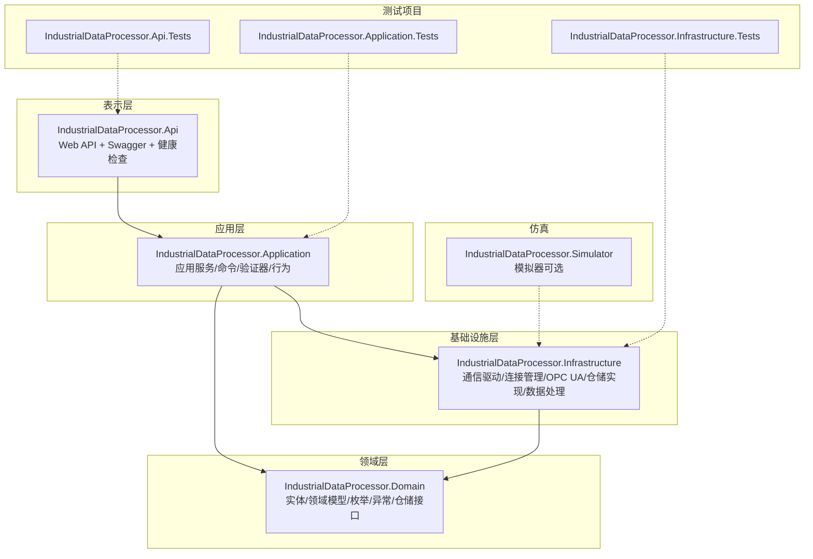
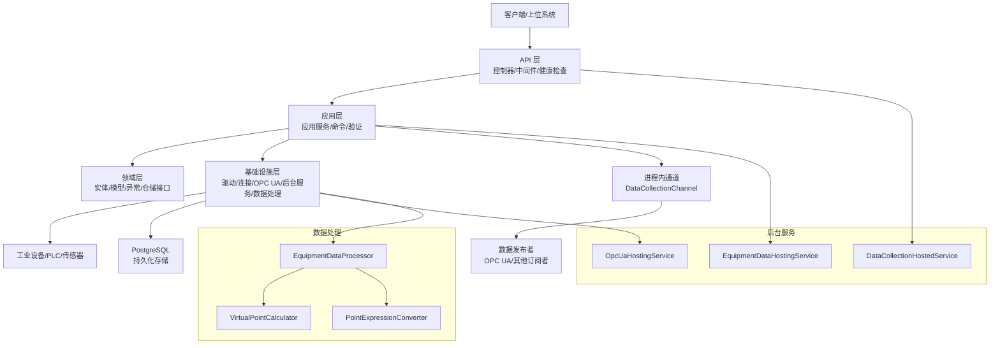
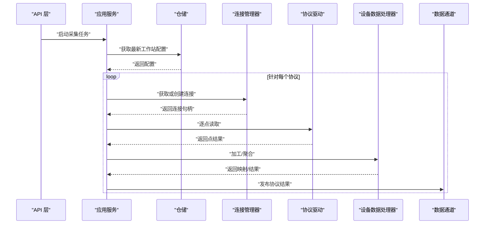
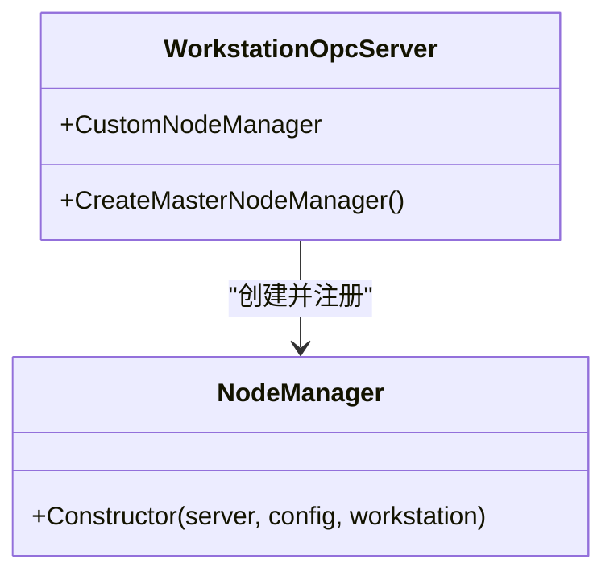
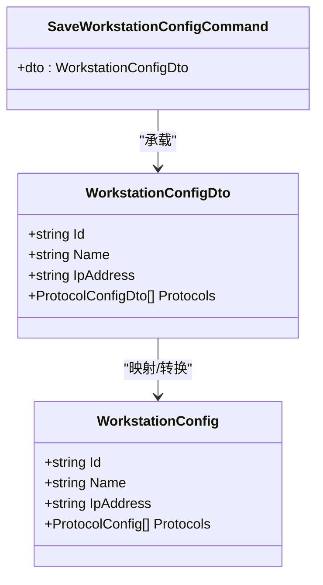
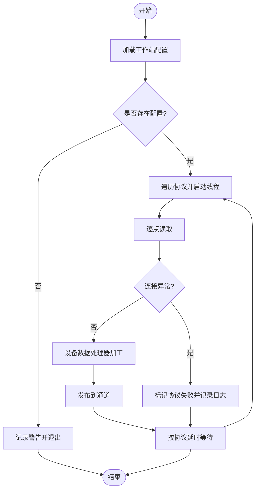
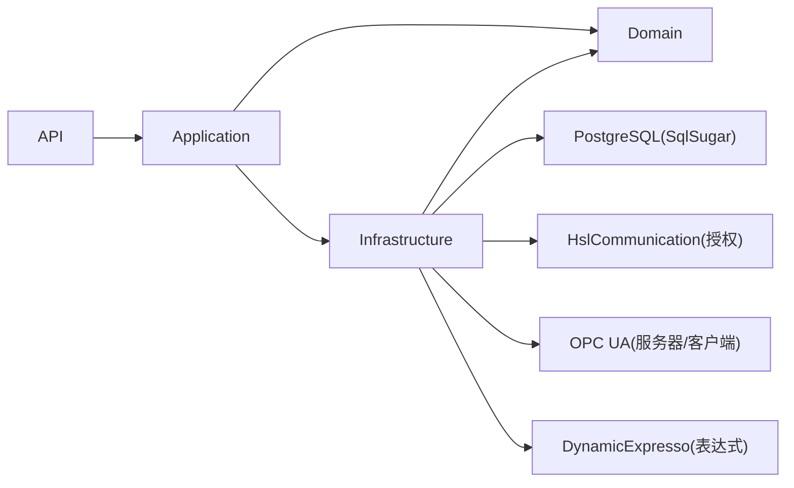

# 项目概述

<cite>
**本文档引用的文件**
- [Program.cs](file://IndustrialDataSolution/IndustrialDataProcessor.Api/Program.cs)
- [appsettings.json](file://IndustrialDataSolution/IndustrialDataProcessor.Api/appsettings.json)
- [DependencyInjection.cs（应用层）](file://IndustrialDataSolution/IndustrialDataProcessor.Application/DependencyInjection.cs)
- [DependencyInjection.cs（基础设施层）](file://IndustrialDataSolution/IndustrialDataProcessor.Infrastructure/DependencyInjection.cs)
- [DataCollectionAppService.cs](file://IndustrialDataSolution/IndustrialDataProcessor.Application/Services/DataCollectionAppService.cs)
- [IConnectionManager.cs](file://IndustrialDataSolution/IndustrialDataProcessor.Domain/Communication/IConnection/IConnectionManager.cs)
- [WorkstationConfig.cs（领域模型）](file://IndustrialDataSolution/IndustrialDataProcessor.Domain/Workstation/Configs/WorkstationConfig.cs)
- [WorkstationConfigEntity.cs](file://IndustrialDataSolution/IndustrialDataProcessor.Domain/Entities/WorkstationConfigEntity.cs)
- [WorkstationConfigDto.cs](file://IndustrialDataSolution/IndustrialDataProcessor.Application/Dtos/WorkstationDto/WorkstationConfigDto.cs)
- [SaveWorkstationConfigCommand.cs](file://IndustrialDataSolution/IndustrialDataProcessor.Application/Features/SaveWorkstationConfigCommand.cs)
- [WorkstationOpcServer.cs](file://IndustrialDataSolution/IndustrialDataProcessor.Infrastructure/OpcUa/WorkstationOpcServer.cs)
- [IndustrialDataProcessor.Domain.csproj](file://IndustrialDataSolution/IndustrialDataProcessor.Domain/IndustrialDataProcessor.Domain.csproj)
- [EquipmentDataProcessor.cs](file://IndustrialDataSolution/IndustrialDataProcessor.Infrastructure/EquipmentCollectionDataProcessing/EquipmentDataProcessor.cs)
- [VirtualPointCalculator.cs](file://IndustrialDataSolution/IndustrialDataProcessor.Infrastructure/EquipmentCollectionDataProcessing/VirtualPointCalculator.cs)
- [PointExpressionConverter.cs](file://IndustrialDataSolution/IndustrialDataProcessor.Infrastructure/EquipmentCollectionDataProcessing/PointExpressionConverter.cs)
</cite>

## 目录
1. [引言](#引言)
2. [项目结构](#项目结构)
3. [核心组件](#核心组件)
4. [架构总览](#架构总览)
5. [详细组件分析](#详细组件分析)
6. [依赖关系分析](#依赖关系分析)
7. [性能考量](#性能考量)
8. [故障排查指南](#故障排查指南)
9. [结论](#结论)
10. [附录](#附录)

## 引言
本项目面向工业物联网（IIoT）与工业自动化场景，提供一套基于领域驱动设计（DDD）的工业数据采集、处理与发布解决方案。项目通过清晰的分层架构与丰富的工业通信协议支持，实现从边缘设备到企业系统的数据闭环，满足实时性、可靠性与可扩展性的要求。

- 核心目标
  - 提供稳定可靠的工业数据采集能力，覆盖多种主流工业通信协议。
  - 以领域模型为核心，构建可演进的业务能力，降低复杂度与耦合。
  - 通过OPC UA等标准协议实现与上位系统、MES/ERP等的无缝集成。
  - 提供可配置的工作站配置与参数化采集策略，适配多场景部署。

- 核心价值主张
  - 分层解耦：应用层、领域层、基础设施层职责明确，便于维护与测试。
  - 协议即插即用：通过驱动抽象与依赖注入，快速扩展新的通信协议。
  - 异常隔离与容错：协议级异常不互相影响，具备断线恢复与重试策略。
  - 数据处理与发布：内置数据加工与进程内消息通道，支持后续订阅与发布。

- 技术特色
  - DDD分层架构：以领域模型为中心，应用服务编排业务流程，基础设施承载通信与存储。
  - 多协议驱动：覆盖Modbus、Siemens S7、Omron、IEC 61850-90-5、OPC UA等多种工业协议。
  - OPC UA集成：内置OPC UA服务器封装，支持标准化数据发布与上位系统访问。
  - 健壮的后台任务：基于托管服务的长驻采集循环，支持取消与资源回收。
  - 统一异常与日志：全局异常中间件与结构化日志，提升可观测性与可维护性。

## 项目结构
项目采用多项目解决方案组织，按关注点分层与功能模块划分，便于团队协作与持续演进。

图表来源
- [Program.cs](file://IndustrialDataSolution/IndustrialDataProcessor.Api/Program.cs#L18-L30)
- [DependencyInjection.cs（应用层）](file://IndustrialDataSolution/IndustrialDataProcessor.Application/DependencyInjection.cs#L16-L39)
- [DependencyInjection.cs（基础设施层）](file://IndustrialDataSolution/IndustrialDataProcessor.Infrastructure/DependencyInjection.cs#L17-L81)

章节来源
- [Program.cs](file://IndustrialDataSolution/IndustrialDataProcessor.Api/Program.cs#L10-L52)
- [IndustrialDataProcessor.Domain.csproj](file://IndustrialDataSolution/IndustrialDataProcessor.Domain/IndustrialDataProcessor.Domain.csproj#L1-L10)

## 核心组件
- 表示层（API）
  - 负责HTTP请求接入、Swagger文档、健康检查、全局异常处理与请求日志。
  - 注册应用层、基础设施层服务，并启动后台托管服务。
- 应用服务（Application）
  - 编排采集流程：加载配置、启动协议级采集任务、扇出数据至通道。
  - 通过MediatR与行为拦截器实现命令处理与全局验证。
- 领域层（Domain）
  - 定义工作站配置、协议配置、设备与参数等核心领域模型。
  - 提供异常体系与仓储接口，约束业务不变量。
- 基础设施层（Infrastructure）
  - 提供协议驱动实现、连接管理、OPC UA服务器封装与数据处理工具。
  - 包含虚拟点计算、表达式转换、数据聚合等核心处理能力。
  - 通过依赖注入注册驱动与后台服务，完成协议即插即用。

章节来源
- [Program.cs](file://IndustrialDataSolution/IndustrialDataProcessor.Api/Program.cs#L18-L52)
- [DependencyInjection.cs（应用层）](file://IndustrialDataSolution/IndustrialDataProcessor.Application/DependencyInjection.cs#L16-L39)
- [DependencyInjection.cs（基础设施层）](file://IndustrialDataSolution/IndustrialDataProcessor.Infrastructure/DependencyInjection.cs#L17-L81)
- [DataCollectionAppService.cs](file://IndustrialDataSolution/IndustrialDataProcessor.Application/Services/DataCollectionAppService.cs#L22-L41)

## 架构总览
系统采用"分层+事件"的架构风格，结合后台托管服务与进程内消息通道，形成稳定的采集-处理-发布链路。

图表来源
- [Program.cs](file://IndustrialDataSolution/IndustrialDataProcessor.Api/Program.cs#L19-L29)
- [DependencyInjection.cs（应用层）](file://IndustrialDataSolution/IndustrialDataProcessor.Application/DependencyInjection.cs#L23-L26)
- [DependencyInjection.cs（基础设施层）](file://IndustrialDataSolution/IndustrialDataProcessor.Infrastructure/DependencyInjection.cs#L37-L46)
- [DataCollectionAppService.cs](file://IndustrialDataSolution/IndustrialDataProcessor.Application/Services/DataCollectionAppService.cs#L22-L41)

## 详细组件分析

### 采集流程与协议驱动
- 启动与初始化
  - API层注册应用与基础设施服务，并启动数据采集托管服务。
  - 应用服务加载最新工作站配置，针对每个协议创建独立的长驻采集循环。
- 协议级采集循环
  - 对每个启用的设备，按参数顺序执行读取，支持虚拟点与真实点混合。
  - 使用连接管理器获取或复用连接，异常隔离在协议级别，避免相互影响。
  - 采集完成后，通过设备数据处理器进行加工与聚合，再通过通道广播。
- 关键路径
  - 应用服务负责编排与扇出。
  - 领域连接管理器负责连接生命周期与自动重连。
  - 协议驱动负责具体协议的读写实现。

图表来源
- [Program.cs](file://IndustrialDataSolution/IndustrialDataProcessor.Api/Program.cs#L25-L25)
- [DataCollectionAppService.cs](file://IndustrialDataSolution/IndustrialDataProcessor.Application/Services/DataCollectionAppService.cs#L22-L41)
- [IConnectionManager.cs](file://IndustrialDataSolution/IndustrialDataProcessor.Domain/Communication/IConnection/IConnectionManager.cs#L10-L12)

章节来源
- [Program.cs](file://IndustrialDataSolution/IndustrialDataProcessor.Api/Program.cs#L19-L29)
- [DataCollectionAppService.cs](file://IndustrialDataSolution/IndustrialDataProcessor.Application/Services/DataCollectionAppService.cs#L22-L214)
- [IConnectionManager.cs](file://IndustrialDataSolution/IndustrialDataProcessor.Domain/Communication/IConnection/IConnectionManager.cs#L5-L18)

### OPC UA 发布与集成
- OPC UA 服务器封装
  - 以工作站配置为输入，创建自定义节点管理器，统一管理地址空间。
  - 通过后台托管服务启动服务器，支持外部订阅者访问。
- 集成优势
  - 标准化接口：与各类上位系统、SCADA/MES/云平台实现即插即用。
  - 安全与可靠：内置证书与会话管理，保障数据传输安全。

图表来源
- [WorkstationOpcServer.cs](file://IndustrialDataSolution/IndustrialDataProcessor.Infrastructure/OpcUa/WorkstationOpcServer.cs#L11-L35)

章节来源
- [WorkstationOpcServer.cs](file://IndustrialDataSolution/IndustrialDataProcessor.Infrastructure/OpcUa/WorkstationOpcServer.cs#L11-L35)
- [DependencyInjection.cs（基础设施层）](file://IndustrialDataSolution/IndustrialDataProcessor.Infrastructure/DependencyInjection.cs#L40-L46)

### 配置模型与DTO
- 领域模型
  - 工作站配置包含Id、名称、IP与协议列表，作为采集与发布的基础依据。
- 应用DTO
  - 与领域模型一一对应，用于API层的请求/响应与验证。
- 命令与事件
  - 保存工作站配置的命令由应用服务处理，事件用于清理缓存与通知订阅者。

图表来源
- [WorkstationConfig.cs（领域模型）](file://IndustrialDataSolution/IndustrialDataProcessor.Domain/Workstation/Configs/WorkstationConfig.cs#L6-L27)
- [WorkstationConfigDto.cs](file://IndustrialDataSolution/IndustrialDataProcessor.Application/Dtos/WorkstationDto/WorkstationConfigDto.cs#L5-L26)
- [SaveWorkstationConfigCommand.cs](file://IndustrialDataSolution/IndustrialDataProcessor.Application/Commands/SaveWorkstationConfigCommand.cs#L7-L8)

章节来源
- [WorkstationConfig.cs（领域模型）](file://IndustrialDataSolution/IndustrialDataProcessor.Domain/Workstation/Configs/WorkstationConfig.cs#L6-L27)
- [WorkstationConfigDto.cs](file://IndustrialDataSolution/IndustrialDataProcessor.Application/Dtos/WorkstationDto/WorkstationConfigDto.cs#L5-L26)
- [SaveWorkstationConfigCommand.cs](file://IndustrialDataSolution/IndustrialDataProcessor.Application/Commands/SaveWorkstationConfigCommand.cs#L7-L8)

### 异常与错误处理
- 异常分层
  - 全局异常基类位于领域层，应用层、基础设施层分别定义专用异常类型。
- 错误处理策略
  - API层注册全局异常中间件与问题详情，统一输出。
  - 应用服务捕获协议级异常，保证单协议失败不影响其他协议。
- 日志与可观测性
  - 请求日志中间件优先于异常处理，便于定位问题。

图表来源
- [DataCollectionAppService.cs](file://IndustrialDataSolution/IndustrialDataProcessor.Application/Services/DataCollectionAppService.cs#L22-L214)

章节来源
- [Program.cs](file://IndustrialDataSolution/IndustrialDataProcessor.Api/Program.cs#L32-L41)
- [DataCollectionAppService.cs](file://IndustrialDataSolution/IndustrialDataProcessor.Application/Services/DataCollectionAppService.cs#L154-L171)

## 依赖关系分析
- 依赖注入与生命周期
  - 应用层：应用服务、任务管理器、进程内通道注册为作用域或单例。
  - 基础设施层：连接管理器、驱动、OPC UA托管服务、数据处理器注册为单例或后台服务。
  - 领域层：仓储接口与实体定义，驱动通过接口注入实现解耦。
- 外部依赖
  - PostgreSQL：通过SqlSugar实现仓储持久化。
  - HslCommunication：授权校验与部分驱动能力。
  - OPC UA：标准服务器框架与客户端库。
  - DynamicExpresso：动态表达式解析，用于虚拟点计算。

图表来源
- [Program.cs](file://IndustrialDataSolution/IndustrialDataProcessor.Api/Program.cs#L19-L22)
- [DependencyInjection.cs（应用层）](file://IndustrialDataSolution/IndustrialDataProcessor.Application/DependencyInjection.cs#L23-L26)
- [DependencyInjection.cs（基础设施层）](file://IndustrialDataSolution/IndustrialDataProcessor.Infrastructure/DependencyInjection.cs#L20-L28)

章节来源
- [Program.cs](file://IndustrialDataSolution/IndustrialDataProcessor.Api/Program.cs#L18-L30)
- [appsettings.json](file://IndustrialDataSolution/IndustrialDataProcessor.Api/appsettings.json#L10-L15)
- [DependencyInjection.cs（基础设施层）](file://IndustrialDataSolution/IndustrialDataProcessor.Infrastructure/DependencyInjection.cs#L17-L81)

## 性能考量
- 并发与隔离
  - 每个协议拥有独立的采集线程，互不阻塞，提升吞吐与稳定性。
- 资源复用
  - 连接管理器复用连接，减少握手与重连开销。
- 延迟与节流
  - 协议级延时配置避免CPU占用过高，同时满足采集频率需求。
- 序列化优化
  - 统一JSON序列化选项与转换器，减少解析成本与歧义。
- 存储与查询
  - PostgreSQL连接池配置与命令超时设置，平衡并发与稳定性。

章节来源
- [DataCollectionAppService.cs](file://IndustrialDataSolution/IndustrialDataProcessor.Application/Services/DataCollectionAppService.cs#L20-L214)
- [DependencyInjection.cs（基础设施层）](file://IndustrialDataSolution/IndustrialDataProcessor.Infrastructure/DependencyInjection.cs#L64-L77)
- [appsettings.json](file://IndustrialDataSolution/IndustrialDataProcessor.Api/appsettings.json#L10-L12)

## 故障排查指南
- 启动失败
  - HslCommunication授权码缺失或无效会导致启动直接失败。请检查配置文件中的授权节点。
- 采集无数据
  - 检查工作站配置是否加载成功，确认协议与设备处于启用状态。
  - 查看协议级异常日志，定位连接或读取失败原因。
- OPC UA 访问异常
  - 确认OPC UA后台服务已注册并运行，检查证书与会话配置。
- 数据未发布
  - 确认数据通道已正确发布，订阅者是否已连接。

章节来源
- [DependencyInjection.cs（基础设施层）](file://IndustrialDataSolution/IndustrialDataProcessor.Infrastructure/DependencyInjection.cs#L20-L28)
- [Program.cs](file://IndustrialDataSolution/IndustrialDataProcessor.Api/Program.cs#L32-L41)
- [DataCollectionAppService.cs](file://IndustrialDataSolution/IndustrialDataProcessor.Application/Services/DataCollectionAppService.cs#L154-L171)

## 结论
本项目以DDD为核心思想，结合分层架构与后台托管服务，构建了高可用、可扩展的工业数据采集与发布体系。通过协议驱动与OPC UA集成，能够灵活适配多品牌、多协议的工业设备，并与上位系统实现标准化对接。对于初学者，建议从领域模型与应用服务入手；对于有经验的开发者，可重点关注协议扩展、异常隔离与性能优化实践。

## 附录
- 技术栈概览
  - 运行时与框架：.NET 8
  - Web：ASP.NET Core（Swagger、健康检查）
  - 应用编排：MediatR、FluentValidation
  - 通信：HslCommunication（授权）、OPC UA
  - 存储：PostgreSQL + SqlSugar
  - 表达式解析：DynamicExpresso
  - 依赖注入：标准DI容器
- 工业通信协议支持
  - TCP类：Modbus（RTU/TCP）、西门子S7系列（S200/S200Smart/S300/S400/S1200/S1500）、欧姆龙（FINS/TCP/UDP、CIP）、三菱FxSerial、IEC104、OPC UA客户端
  - 串口类：ModbusRtu、DLT6452007、CJT1882004、FxSerial
  - API类：HTTP API接口
  - 数据库类：MySQL
  - 特殊协议：FJ1000Jet、FJ60W、GP1125T、BottomImageF1970
  - 接口抽象：IProtocolDriver，便于扩展新协议
- 集成能力
  - OPC UA：标准服务器封装，支持订阅与历史数据访问
  - 上位系统：通过OPC UA或HTTP API对接MES/SCADA/云平台
- 核心处理能力
  - 虚拟点计算：基于表达式的派生指标计算
  - 表达式转换：支持一元一次方程、进制转换（HEX2DEC/DEC2HEX）
  - 数据聚合：设备级、协议级状态统计与聚合