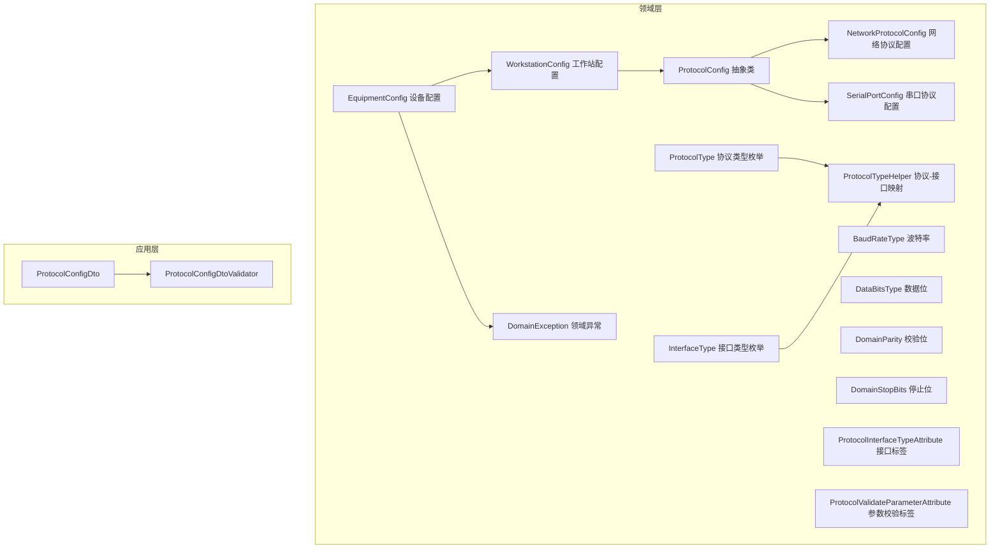
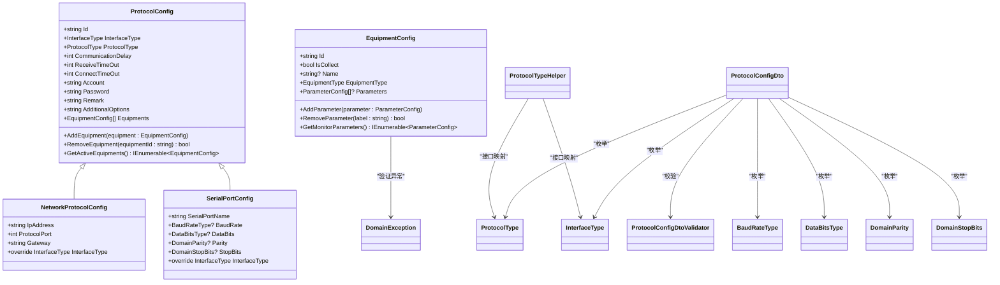
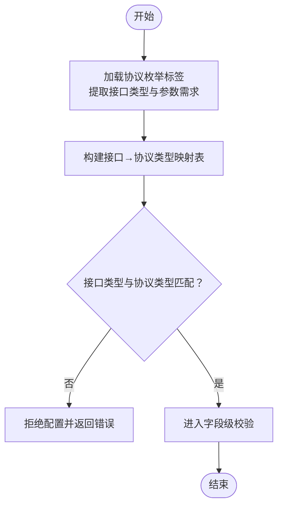
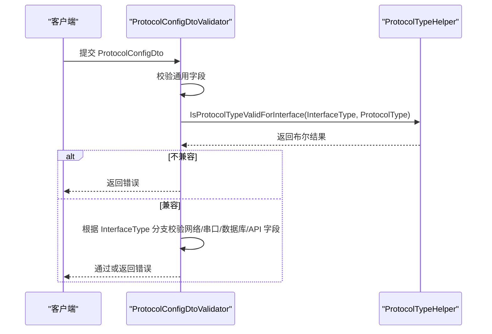
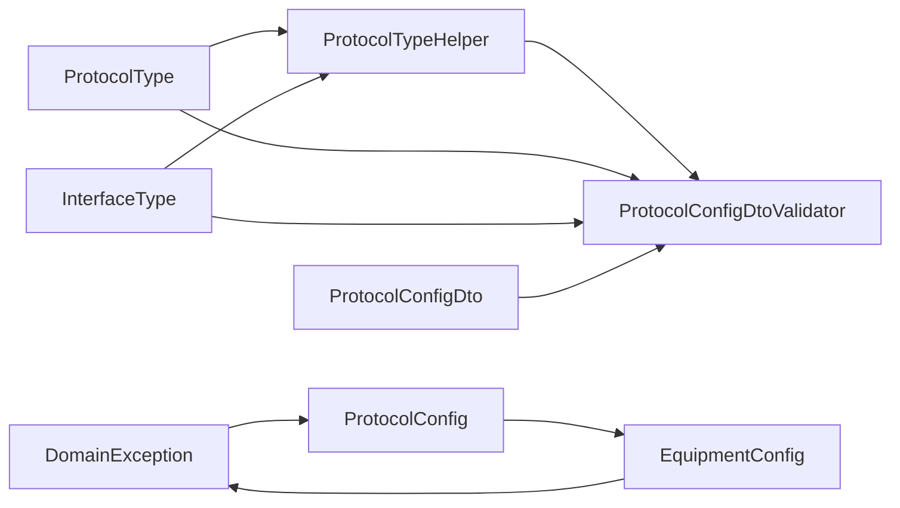

# 协议配置模型

<cite>
**本文引用的文件**
- [ProtocolConfig.cs](file://IndustrialDataSolution/IndustrialDataProcessor.Domain/Workstation/Configs/ProtocolConfig.cs)
- [NetworkProtocolConfig.cs](file://IndustrialDataSolution/IndustrialDataProcessor.Domain/Workstation/Configs/ProtocolSub/NetworkProtocolConfig.cs)
- [SerialPortConfig.cs](file://IndustrialDataSolution/IndustrialDataProcessor.Domain/Workstation/Configs/ProtocolSub/SerialPortConfig.cs)
- [ProtocolType.cs](file://IndustrialDataSolution/IndustrialDataProcessor.Domain/Enums/ProtocolType.cs)
- [InterfaceType.cs](file://IndustrialDataSolution/IndustrialDataProcessor.Domain/Enums/InterfaceType.cs)
- [BaudRateType.cs](file://IndustrialDataSolution/IndustrialDataProcessor.Domain/Enums/BaudRateType.cs)
- [DataBitsType.cs](file://IndustrialDataSolution/IndustrialDataProcessor.Domain/Enums/DataBitsType.cs)
- [DomainParity.cs](file://IndustrialDataSolution/IndustrialDataProcessor.Domain/Enums/DomainParity.cs)
- [DomainStopBits.cs](file://IndustrialDataSolution/IndustrialDataProcessor.Domain/Enums/DomainStopBits.cs)
- [ProtocolInterfaceTypeAttribute.cs](file://IndustrialDataSolution/IndustrialDataProcessor.Domain/Attributes/ProtocolInterfaceTypeAttribute.cs)
- [ProtocolValidateParameterAttribute.cs](file://IndustrialDataSolution/IndustrialDataProcessor.Domain/Attributes/ProtocolValidateParameterAttribute.cs)
- [ProtocolTypeHelper.cs](file://IndustrialDataSolution/IndustrialDataProcessor.Domain/Helpers/ProtocolTypeHelper.cs)
- [ProtocolConfigDto.cs](file://IndustrialDataSolution/IndustrialDataProcessor.Application/Dtos/WorkstationDto/ProtocolConfigDto.cs)
- [ProtocolConfigDtoValidator.cs](file://IndustrialDataSolution/IndustrialDataProcessor.Application/Validators/ProtocolConfigDtoValidator.cs)
- [WorkstationConfig.cs](file://IndustrialDataSolution/IndustrialDataProcessor.Domain/Workstation/Configs/WorkstationConfig.cs)
- [EquipmentConfig.cs](file://IndustrialDataSolution/IndustrialDataProcessor.Domain/Workstation/Configs/EquipmentConfig.cs)
- [DomainException.cs](file://IndustrialDataSolution/IndustrialDataProcessor.Domain/Exceptions/DomainException.cs)
</cite>

## 更新摘要
**变更内容**
- 新增协议配置的设备管理能力章节，详细介绍 AddEquipment、RemoveEquipment 和 GetActiveEquipments 方法
- 更新设备配置验证规则，包括重复设备 ID 验证机制
- 增加设备管理的最佳实践和故障排查指南
- 完善协议配置与设备配置的映射关系说明

## 目录
1. [引言](#引言)
2. [项目结构](#项目结构)
3. [核心组件](#核心组件)
4. [架构总览](#架构总览)
5. [详细组件分析](#详细组件分析)
6. [设备管理能力](#设备管理能力)
7. [依赖关系分析](#依赖关系分析)
8. [性能考虑](#性能考虑)
9. [故障排查指南](#故障排查指南)
10. [结论](#结论)
11. [附录：配置模板与使用指南](#附录配置模板与使用指南)

## 引言
本文件面向工业数据采集与控制领域的协议配置模型，系统化阐述协议配置实体的设计架构、业务含义与运行机制。重点覆盖以下方面：
- 协议配置基类与派生类的职责划分与差异
- 协议类型与接口类型的分类体系及选择标准
- 验证规则与兼容性检查机制
- 协议配置与设备配置的映射关系与约束
- **新增**：协议配置的设备管理能力与最佳实践
- 工业通信协议的配置模板与实践建议
- 故障排查与性能优化策略
- 实际工业场景的应用案例说明

## 项目结构
协议配置模型位于领域层与应用层之间，通过 DTO 与验证器在应用层进行输入校验与转换，最终驱动基础设施层的协议驱动实现。



**图表来源**
- [ProtocolConfig.cs](file://IndustrialDataSolution/IndustrialDataProcessor.Domain/Workstation/Configs/ProtocolConfig.cs#L1-L116)
- [NetworkProtocolConfig.cs](file://IndustrialDataSolution/IndustrialDataProcessor.Domain/Workstation/Configs/ProtocolSub/NetworkProtocolConfig.cs#L1-L28)
- [SerialPortConfig.cs](file://IndustrialDataSolution/IndustrialDataProcessor.Domain/Workstation/Configs/ProtocolSub/SerialPortConfig.cs#L1-L38)
- [ProtocolType.cs](file://IndustrialDataSolution/IndustrialDataProcessor.Domain/Enums/ProtocolType.cs#L1-L231)
- [InterfaceType.cs](file://IndustrialDataSolution/IndustrialDataProcessor.Domain/Enums/InterfaceType.cs#L1-L32)
- [BaudRateType.cs](file://IndustrialDataSolution/IndustrialDataProcessor.Domain/Enums/BaudRateType.cs#L1-L99)
- [DataBitsType.cs](file://IndustrialDataSolution/IndustrialDataProcessor.Domain/Enums/DataBitsType.cs#L1-L21)
- [DomainParity.cs](file://IndustrialDataSolution/IndustrialDataProcessor.Domain/Enums/DomainParity.cs#L1-L13)
- [DomainStopBits.cs](file://IndustrialDataSolution/IndustrialDataProcessor.Domain/Enums/DomainStopBits.cs#L1-L13)
- [ProtocolInterfaceTypeAttribute.cs](file://IndustrialDataSolution/IndustrialDataProcessor.Domain/Attributes/ProtocolInterfaceTypeAttribute.cs#L1-L19)
- [ProtocolValidateParameterAttribute.cs](file://IndustrialDataSolution/IndustrialDataProcessor.Domain/Attributes/ProtocolValidateParameterAttribute.cs#L1-L28)
- [ProtocolTypeHelper.cs](file://IndustrialDataSolution/IndustrialDataProcessor.Domain/Helpers/ProtocolTypeHelper.cs#L1-L35)
- [WorkstationConfig.cs](file://IndustrialDataSolution/IndustrialDataProcessor.Domain/Workstation/Configs/WorkstationConfig.cs#L1-L27)
- [EquipmentConfig.cs](file://IndustrialDataSolution/IndustrialDataProcessor.Domain/Workstation/Configs/EquipmentConfig.cs#L1-L107)
- [DomainException.cs](file://IndustrialDataSolution/IndustrialDataProcessor.Domain/Exceptions/DomainException.cs#L1-L7)

**章节来源**
- [ProtocolConfig.cs](file://IndustrialDataSolution/IndustrialDataProcessor.Domain/Workstation/Configs/ProtocolConfig.cs#L1-L116)
- [NetworkProtocolConfig.cs](file://IndustrialDataSolution/IndustrialDataProcessor.Domain/Workstation/Configs/ProtocolSub/NetworkProtocolConfig.cs#L1-L28)
- [SerialPortConfig.cs](file://IndustrialDataSolution/IndustrialDataProcessor.Domain/Workstation/Configs/ProtocolSub/SerialPortConfig.cs#L1-L38)
- [ProtocolType.cs](file://IndustrialDataSolution/IndustrialDataProcessor.Domain/Enums/ProtocolType.cs#L1-L231)
- [InterfaceType.cs](file://IndustrialDataSolution/IndustrialDataProcessor.Domain/Enums/InterfaceType.cs#L1-L32)
- [ProtocolConfigDto.cs](file://IndustrialDataSolution/IndustrialDataProcessor.Application/Dtos/WorkstationDto/ProtocolConfigDto.cs#L1-L92)

## 核心组件
- 协议配置基类：统一承载协议标识、接口类型、协议类型、通信超时、账号密码、备注、附加选项以及设备集合等公共属性。
- 网络协议配置：继承自协议配置基类，增加 IP 地址、端口与可选网关等网络通信参数。
- 串口协议配置：继承自协议配置基类，增加串口名称、波特率、数据位、校验位、停止位等串口通信参数。
- 协议类型枚举：按接口类型分组列举所有支持的协议，如 ModbusTcpNet、IEC104、ModbusRtu、CJT1882004Serial 等。
- 接口类型枚举：LAN、COM、API、DATABASE 四类接口类型，用于限定协议可用范围。
- 参数校验标签：为协议类型标注"是否必须提供站号、数据格式、数据类型、地址起始规则、仪表类型"等校验要求。
- 协议-接口映射助手：基于枚举标签构建接口到协议类型的映射表，提供兼容性校验能力。
- DTO 与验证器：将输入参数标准化为传输对象，并执行跨字段、跨接口类型的综合验证。
- 工作站与设备配置：工作站聚合多个协议配置，协议配置再聚合设备集合，形成"工作站 → 协议 → 设备"的树形结构。
- **新增**：设备管理能力：协议配置类提供完整的设备生命周期管理，包括添加、移除和活动设备筛选。

**章节来源**
- [ProtocolConfig.cs](file://IndustrialDataSolution/IndustrialDataProcessor.Domain/Workstation/Configs/ProtocolConfig.cs#L1-L116)
- [NetworkProtocolConfig.cs](file://IndustrialDataSolution/IndustrialDataProcessor.Domain/Workstation/Configs/ProtocolSub/NetworkProtocolConfig.cs#L1-L28)
- [SerialPortConfig.cs](file://IndustrialDataSolution/IndustrialDataProcessor.Domain/Workstation/Configs/ProtocolSub/SerialPortConfig.cs#L1-L38)
- [ProtocolType.cs](file://IndustrialDataSolution/IndustrialDataProcessor.Domain/Enums/ProtocolType.cs#L1-L231)
- [InterfaceType.cs](file://IndustrialDataSolution/IndustrialDataProcessor.Domain/Enums/InterfaceType.cs#L1-L32)
- [ProtocolValidateParameterAttribute.cs](file://IndustrialDataSolution/IndustrialDataProcessor.Domain/Attributes/ProtocolValidateParameterAttribute.cs#L1-L28)
- [ProtocolTypeHelper.cs](file://IndustrialDataSolution/IndustrialDataProcessor.Domain/Helpers/ProtocolTypeHelper.cs#L1-L35)
- [ProtocolConfigDto.cs](file://IndustrialDataSolution/IndustrialDataProcessor.Application/Dtos/WorkstationDto/ProtocolConfigDto.cs#L1-L92)
- [ProtocolConfigDtoValidator.cs](file://IndustrialDataSolution/IndustrialDataProcessor.Application/Validators/ProtocolConfigDtoValidator.cs#L1-L164)
- [WorkstationConfig.cs](file://IndustrialDataSolution/IndustrialDataProcessor.Domain/Workstation/Configs/WorkstationConfig.cs#L1-L27)
- [EquipmentConfig.cs](file://IndustrialDataSolution/IndustrialDataProcessor.Domain/Workstation/Configs/EquipmentConfig.cs#L1-L107)

## 架构总览
协议配置模型采用"领域模型 + 应用 DTO + 验证器 + 映射助手"的分层设计，确保：
- 领域层以强类型枚举与特性表达业务约束
- 应用层负责输入校验与跨字段一致性检查
- 基础设施层依据配置选择合适的协议驱动
- **新增**：设备管理能力提供完整的设备生命周期控制



**图表来源**
- [ProtocolConfig.cs](file://IndustrialDataSolution/IndustrialDataProcessor.Domain/Workstation/Configs/ProtocolConfig.cs#L1-L116)
- [NetworkProtocolConfig.cs](file://IndustrialDataSolution/IndustrialDataProcessor.Domain/Workstation/Configs/ProtocolSub/NetworkProtocolConfig.cs#L1-L28)
- [SerialPortConfig.cs](file://IndustrialDataSolution/IndustrialDataProcessor.Domain/Workstation/Configs/ProtocolSub/SerialPortConfig.cs#L1-L38)
- [EquipmentConfig.cs](file://IndustrialDataSolution/IndustrialDataProcessor.Domain/Workstation/Configs/EquipmentConfig.cs#L1-L107)
- [ProtocolType.cs](file://IndustrialDataSolution/IndustrialDataProcessor.Domain/Enums/ProtocolType.cs#L1-L231)
- [InterfaceType.cs](file://IndustrialDataSolution/IndustrialDataProcessor.Domain/Enums/InterfaceType.cs#L1-L32)
- [BaudRateType.cs](file://IndustrialDataSolution/IndustrialDataProcessor.Domain/Enums/BaudRateType.cs#L1-L99)
- [DataBitsType.cs](file://IndustrialDataSolution/IndustrialDataProcessor.Domain/Enums/DataBitsType.cs#L1-L21)
- [DomainParity.cs](file://IndustrialDataSolution/IndustrialDataProcessor.Domain/Enums/DomainParity.cs#L1-L13)
- [DomainStopBits.cs](file://IndustrialDataSolution/IndustrialDataProcessor.Domain/Enums/DomainStopBits.cs#L1-L13)
- [ProtocolTypeHelper.cs](file://IndustrialDataSolution/IndustrialDataProcessor.Domain/Helpers/ProtocolTypeHelper.cs#L1-L35)
- [ProtocolConfigDto.cs](file://IndustrialDataSolution/IndustrialDataProcessor.Application/Dtos/WorkstationDto/ProtocolConfigDto.cs#L1-L92)
- [ProtocolConfigDtoValidator.cs](file://IndustrialDataSolution/IndustrialDataProcessor.Application/Validators/ProtocolConfigDtoValidator.cs#L1-L164)
- [DomainException.cs](file://IndustrialDataSolution/IndustrialDataProcessor.Domain/Exceptions/DomainException.cs#L1-L7)

## 详细组件分析

### 协议配置基类与派生类
- 基类职责
  - 统一标识与元信息：协议 Id、协议类型、接口类型、账号密码、备注、附加选项
  - 通信参数：通讯延时、接收超时、连接超时
  - 设备集合：协议下挂载的设备列表
  - **新增**：设备管理方法：添加、移除和筛选设备
- 网络协议配置
  - 必填：接口类型固定为 LAN；IP 地址与端口
  - 可选：网关
- 串口协议配置
  - 必填：接口类型固定为 COM；串口名称、波特率、数据位、校验位、停止位
- 设计要点
  - 派生类仅暴露与自身接口相关的必要字段，避免冗余
  - 通过抽象属性约束派生类的接口类型，保证类型安全
  - **新增**：设备管理方法提供完整的设备生命周期控制

**章节来源**
- [ProtocolConfig.cs](file://IndustrialDataSolution/IndustrialDataProcessor.Domain/Workstation/Configs/ProtocolConfig.cs#L1-L116)
- [NetworkProtocolConfig.cs](file://IndustrialDataSolution/IndustrialDataProcessor.Domain/Workstation/Configs/ProtocolSub/NetworkProtocolConfig.cs#L1-L28)
- [SerialPortConfig.cs](file://IndustrialDataSolution/IndustrialDataProcessor.Domain/Workstation/Configs/ProtocolSub/SerialPortConfig.cs#L1-L38)
- [EquipmentConfig.cs](file://IndustrialDataSolution/IndustrialDataProcessor.Domain/Workstation/Configs/EquipmentConfig.cs#L1-L107)

### 协议类型与接口类型
- 协议类型枚举
  - LAN 类：ModbusTcpNet、ModbusRtuOverTcp、OmronFinsTcp/Udp、Siemens 系列、DLT6452007/2004、FxSerialOverTcp、IEC104、OpcUa 等
  - COM 类：ModbusRtu、DLT6452007Serial、CJT1882004Serial、FxSerial
  - API 类：Api
  - DATABASE 类：MySQL
- 接口类型枚举
  - LAN、COM、API、DATABASE
- 选择标准
  - 优先根据目标设备的物理接口与通信协议选择对应枚举项
  - 使用协议-接口映射助手确保所选协议与接口匹配

**章节来源**
- [ProtocolType.cs](file://IndustrialDataSolution/IndustrialDataProcessor.Domain/Enums/ProtocolType.cs#L1-L231)
- [InterfaceType.cs](file://IndustrialDataSolution/IndustrialDataProcessor.Domain/Enums/InterfaceType.cs#L1-L32)
- [ProtocolInterfaceTypeAttribute.cs](file://IndustrialDataSolution/IndustrialDataProcessor.Domain/Attributes/ProtocolInterfaceTypeAttribute.cs#L1-L19)
- [ProtocolTypeHelper.cs](file://IndustrialDataSolution/IndustrialDataProcessor.Domain/Helpers/ProtocolTypeHelper.cs#L1-L35)

### 参数校验标签与兼容性检查
- 参数校验标签
  - 标注协议对"站号、数据格式、数据类型、地址起始规则、仪表类型"的强制需求
- 兼容性检查
  - 基于枚举标签构建接口到协议类型的映射
  - 在应用层验证器中调用映射助手，拒绝不兼容组合



**图表来源**
- [ProtocolType.cs](file://IndustrialDataSolution/IndustrialDataProcessor.Domain/Enums/ProtocolType.cs#L1-L231)
- [ProtocolInterfaceTypeAttribute.cs](file://IndustrialDataSolution/IndustrialDataProcessor.Domain/Attributes/ProtocolInterfaceTypeAttribute.cs#L1-L19)
- [ProtocolValidateParameterAttribute.cs](file://IndustrialDataSolution/IndustrialDataProcessor.Domain/Attributes/ProtocolValidateParameterAttribute.cs#L1-L28)
- [ProtocolTypeHelper.cs](file://IndustrialDataSolution/IndustrialDataProcessor.Domain/Helpers/ProtocolTypeHelper.cs#L1-L35)

**章节来源**
- [ProtocolValidateParameterAttribute.cs](file://IndustrialDataSolution/IndustrialDataProcessor.Domain/Attributes/ProtocolValidateParameterAttribute.cs#L1-L28)
- [ProtocolTypeHelper.cs](file://IndustrialDataSolution/IndustrialDataProcessor.Domain/Helpers/ProtocolTypeHelper.cs#L1-L35)
- [ProtocolConfigDtoValidator.cs](file://IndustrialDataSolution/IndustrialDataProcessor.Application/Validators/ProtocolConfigDtoValidator.cs#L1-L164)

### DTO 与验证器
- DTO 设计
  - 将领域枚举以字符串形式序列化，便于前端与外部系统交互
  - 同时保留网络/串口/数据库/API 所需的全部字段，便于一次性校验
- 验证规则
  - 通用字段：Id、ProtocolType、InterfaceType、Equipments 非空
  - 超时参数：非负、最小阈值校验
  - 接口特定字段：串口/网络/数据库/API 的必填与取值范围
  - 协议-接口兼容性：调用映射助手进行约束
- 校验流程



**图表来源**
- [ProtocolConfigDtoValidator.cs](file://IndustrialDataSolution/IndustrialDataProcessor.Application/Validators/ProtocolConfigDtoValidator.cs#L1-L164)
- [ProtocolTypeHelper.cs](file://IndustrialDataSolution/IndustrialDataProcessor.Domain/Helpers/ProtocolTypeHelper.cs#L1-L35)
- [ProtocolConfigDto.cs](file://IndustrialDataSolution/IndustrialDataProcessor.Application/Dtos/WorkstationDto/ProtocolConfigDto.cs#L1-L92)

**章节来源**
- [ProtocolConfigDto.cs](file://IndustrialDataSolution/IndustrialDataProcessor.Application/Dtos/WorkstationDto/ProtocolConfigDto.cs#L1-L92)
- [ProtocolConfigDtoValidator.cs](file://IndustrialDataSolution/IndustrialDataProcessor.Application/Validators/ProtocolConfigDtoValidator.cs#L1-L164)

### 协议配置与设备配置的映射关系
- 结构关系
  - 工作站配置包含多个协议配置
  - 协议配置包含多个设备配置
  - 设备配置包含变量集合
- 约束条件
  - 协议 Id 唯一且非空
  - 设备 Id 唯一且非空
  - 协议下至少包含一个设备
  - 设备的变量集合可为空但需保持结构完整
  - **新增**：设备 Id 重复验证，防止重复配置

**章节来源**
- [WorkstationConfig.cs](file://IndustrialDataSolution/IndustrialDataProcessor.Domain/Workstation/Configs/WorkstationConfig.cs#L1-L27)
- [EquipmentConfig.cs](file://IndustrialDataSolution/IndustrialDataProcessor.Domain/Workstation/Configs/EquipmentConfig.cs#L1-L107)
- [ProtocolConfig.cs](file://IndustrialDataSolution/IndustrialDataProcessor.Domain/Workstation/Configs/ProtocolConfig.cs#L1-L116)

## 设备管理能力

### 设备管理方法概述
协议配置类提供了完整的设备生命周期管理能力，包括设备的添加、移除和活动设备筛选。这些方法确保了设备配置的完整性和一致性。

### AddEquipment 方法
**功能**：向协议配置中添加新的设备配置

**参数**：
- `equipment`: EquipmentConfig - 要添加的设备配置对象

**验证规则**：
- 设备 ID 不能为空（使用 `string.IsNullOrWhiteSpace` 检查）
- 设备 ID 必须唯一，不能与现有设备重复
- 设备对象不能为 null

**异常处理**：
- 当设备 ID 为空时抛出 `DomainException`
- 当设备 ID 重复时抛出 `DomainException`
- 当设备对象为 null 时抛出 `ArgumentNullException`

**使用示例**：
```csharp
var protocol = new NetworkProtocolConfig();
var equipment = new EquipmentConfig("E-001", true, "温度传感器", EquipmentType.Sensor);

try
{
    protocol.AddEquipment(equipment);
    Console.WriteLine("设备添加成功");
}
catch (DomainException ex)
{
    Console.WriteLine($"添加失败: {ex.Message}");
}
```

### RemoveEquipment 方法
**功能**：从协议配置中移除指定的设备配置

**参数**：
- `equipmentId`: string - 要移除的设备 ID

**返回值**：
- `bool`: 如果成功移除设备返回 true，否则返回 false

**实现逻辑**：
- 查找具有指定 ID 的设备
- 如果找到设备则移除并返回 true
- 如果未找到设备返回 false

**使用示例**：
```csharp
var success = protocol.RemoveEquipment("E-001");
if (success)
{
    Console.WriteLine("设备移除成功");
}
else
{
    Console.WriteLine("设备不存在或移除失败");
}
```

### GetActiveEquipments 方法
**功能**：获取协议配置中所有启用的设备

**返回值**：
- `IEnumerable<EquipmentConfig>`: 包含所有 `IsCollect` 属性为 true 的设备

**实现逻辑**：
- 过滤设备集合，只返回 `IsCollect` 为 true 的设备
- 使用 LINQ 的 Where 方法进行筛选

**使用示例**：
```csharp
var activeEquipments = protocol.GetActiveEquipments();
foreach (var equipment in activeEquipments)
{
    Console.WriteLine($"活动设备: {equipment.Id} - {equipment.Name}");
}
```

### 设备管理最佳实践

#### 设备 ID 管理
- 使用有意义的设备 ID 格式，如 "PLC-001"、"TEMP-001"
- 确保设备 ID 在同一协议配置内唯一
- 避免使用特殊字符和空格

#### 设备状态管理
- 启用设备：设置 `IsCollect` 为 true
- 停用设备：设置 `IsCollect` 为 false
- 使用 `GetActiveEquipments` 方法获取当前活跃设备

#### 错误处理策略
- 在添加设备前验证设备 ID 的唯一性
- 捕获 `DomainException` 并提供用户友好的错误信息
- 使用 try-catch 包装设备管理操作

#### 性能优化建议
- 批量操作设备时，考虑使用 `Equipments` 属性直接访问底层列表
- 避免频繁的设备添加/移除操作
- 使用 `GetActiveEquipments` 缓存结果，避免重复计算

**章节来源**
- [ProtocolConfig.cs](file://IndustrialDataSolution/IndustrialDataProcessor.Domain/Workstation/Configs/ProtocolConfig.cs#L80-L116)
- [EquipmentConfig.cs](file://IndustrialDataSolution/IndustrialDataProcessor.Domain/Workstation/Configs/EquipmentConfig.cs#L1-L107)
- [DomainException.cs](file://IndustrialDataSolution/IndustrialDataProcessor.Domain/Exceptions/DomainException.cs#L1-L7)

## 依赖关系分析
- 领域层依赖
  - 协议类型与接口类型枚举作为约束基础
  - 特性用于声明式约束（接口映射、参数需求）
  - 助手类提供运行时映射与校验
  - **新增**：设备管理依赖 DomainException 进行业务规则验证
- 应用层依赖
  - DTO 作为跨层数据载体
  - 验证器依赖枚举与助手类进行约束检查
- 耦合与内聚
  - 领域层高内聚：协议配置与其接口/参数需求紧密耦合
  - 应用层低耦合：验证逻辑与 DTO 解耦，便于扩展新协议
  - **新增**：设备管理功能与协议配置紧密集成



**图表来源**
- [ProtocolType.cs](file://IndustrialDataSolution/IndustrialDataProcessor.Domain/Enums/ProtocolType.cs#L1-L231)
- [InterfaceType.cs](file://IndustrialDataSolution/IndustrialDataProcessor.Domain/Enums/InterfaceType.cs#L1-L32)
- [ProtocolTypeHelper.cs](file://IndustrialDataSolution/IndustrialDataProcessor.Domain/Helpers/ProtocolTypeHelper.cs#L1-L35)
- [ProtocolConfigDtoValidator.cs](file://IndustrialDataSolution/IndustrialDataProcessor.Application/Validators/ProtocolConfigDtoValidator.cs#L1-L164)
- [ProtocolConfigDto.cs](file://IndustrialDataSolution/IndustrialDataProcessor.Application/Dtos/WorkstationDto/ProtocolConfigDto.cs#L1-L92)
- [DomainException.cs](file://IndustrialDataSolution/IndustrialDataProcessor.Domain/Exceptions/DomainException.cs#L1-L7)
- [ProtocolConfig.cs](file://IndustrialDataSolution/IndustrialDataProcessor.Domain/Workstation/Configs/ProtocolConfig.cs#L1-L116)
- [EquipmentConfig.cs](file://IndustrialDataSolution/IndustrialDataProcessor.Domain/Workstation/Configs/EquipmentConfig.cs#L1-L107)

**章节来源**
- [ProtocolTypeHelper.cs](file://IndustrialDataSolution/IndustrialDataProcessor.Domain/Helpers/ProtocolTypeHelper.cs#L1-L35)
- [ProtocolConfigDtoValidator.cs](file://IndustrialDataSolution/IndustrialDataProcessor.Application/Validators/ProtocolConfigDtoValidator.cs#L1-L164)
- [DomainException.cs](file://IndustrialDataSolution/IndustrialDataProcessor.Domain/Exceptions/DomainException.cs#L1-L7)

## 性能考虑
- 超时参数设置
  - 通讯延时、接收超时、连接超时应结合网络质量与设备响应时间合理设置，避免过小导致频繁重试，过大影响实时性
- 串口参数优化
  - 波特率、数据位、校验位、停止位需与设备一致，避免误码与重传
- 并发与批处理
  - 对多设备批量读取时，建议分组并发与限流，防止接口拥塞
- 日志与监控
  - 记录关键超时与失败事件，辅助定位瓶颈
- **新增**：设备管理性能优化
  - 设备集合使用 `List<EquipmentConfig>` 提供高效的随机访问
  - `GetActiveEquipments` 使用 LINQ 过滤，适合中小规模设备集
  - 大规模设备集建议缓存过滤结果，避免重复计算

## 故障排查指南
- 常见错误与定位
  - 协议与接口不兼容：检查协议类型与接口类型是否匹配
  - 网络配置错误：确认 IP 与端口格式、范围与可达性
  - 串口配置错误：确认串口名称、波特率、数据位、校验位、停止位
  - 超时参数异常：检查通讯延时、接收超时、连接超时是否满足业务需求
  - **新增**：设备管理错误
    - 设备 ID 重复：检查设备 ID 是否已在同一协议配置中存在
    - 设备 ID 为空：确认设备 ID 是否正确设置
    - 设备移除失败：检查设备 ID 是否正确，设备是否存在
- 排查步骤
  - 逐项核对 DTO 字段与枚举取值
  - 使用映射助手验证协议-接口兼容性
  - 检查设备列表是否为空
  - 针对数据库/API 接口，确认连接字符串或访问路径是否满足二选一要求
  - **新增**：设备管理排查
    - 使用 `GetActiveEquipments` 验证设备状态
    - 检查设备 ID 的唯一性
    - 确认设备对象的完整性

**章节来源**
- [ProtocolConfigDtoValidator.cs](file://IndustrialDataSolution/IndustrialDataProcessor.Application/Validators/ProtocolConfigDtoValidator.cs#L1-L164)
- [ProtocolTypeHelper.cs](file://IndustrialDataSolution/IndustrialDataProcessor.Domain/Helpers/ProtocolTypeHelper.cs#L1-L35)
- [ProtocolConfig.cs](file://IndustrialDataSolution/IndustrialDataProcessor.Domain/Workstation/Configs/ProtocolConfig.cs#L80-L116)
- [EquipmentConfig.cs](file://IndustrialDataSolution/IndustrialDataProcessor.Domain/Workstation/Configs/EquipmentConfig.cs#L1-L107)

## 结论
协议配置模型通过"枚举 + 特性 + 助手 + DTO + 验证器 + 设备管理"的组合，实现了对工业协议配置的强类型约束与可扩展校验。其设计兼顾了领域抽象与应用落地，既保证了配置的正确性，也为后续新增协议提供了清晰的扩展路径。**新增的设备管理能力进一步增强了协议配置的实用性，为工业数据采集系统提供了完整的设备生命周期管理解决方案。**

## 附录：配置模板与使用指南

### 模板与示例（概念性说明）
- 网络协议（ModbusTcpNet）
  - 接口类型：LAN
  - 必填字段：协议类型、IP 地址、端口、设备列表
  - 可选字段：通讯延时、接收超时、连接超时、账号、密码、备注、附加选项
- 串口协议（ModbusRtu）
  - 接口类型：COM
  - 必填字段：协议类型、串口名称、波特率、数据位、校验位、停止位、设备列表
  - 可选字段：通讯延时、接收超时、连接超时、账号、密码、备注、附加选项
- 数据库协议（MySQL）
  - 接口类型：DATABASE
  - 必填字段：协议类型、查询 SQL、连接字符串或 IP+端口+数据库名三者之一
  - 可选字段：账号、密码、备注、附加选项
- API 协议（Api）
  - 接口类型：API
  - 必填字段：协议类型、请求方式、访问 API 语句
  - 可选字段：账号、密码、备注、附加选项

### 使用指南
- 选择协议类型
  - 根据设备通信方式与协议族选择对应枚举值
- 选择接口类型
  - LAN/COM/API/DATABASE 四类接口，与协议类型一一映射
- 填写参数
  - 严格遵循字段必填与取值范围要求
- 校验与保存
  - 通过验证器后提交至应用服务，持久化到领域实体
- **新增**：设备管理使用指南
  - 使用 `AddEquipment` 添加设备，确保设备 ID 唯一
  - 使用 `RemoveEquipment` 移除不需要的设备
  - 使用 `GetActiveEquipments` 获取当前活跃设备进行数据采集

### 实际工业场景应用
- 智能制造产线
  - 使用 ModbusTcpNet 或 IEC104 连接 PLC/智能仪表，按站点与寄存器地址组织设备变量
  - 通过设备管理功能动态添加/移除产线设备
- 能源监控
  - 使用 DLT6452007/2004 或 CJT1882004 协议采集电表/水表数据，配置串口参数与仪表类型
  - 利用活动设备筛选功能，只采集需要监控的设备
- 数据中心边缘网关
  - 使用 OpcUa 与 API 协议对接上层系统，统一汇聚与转发
  - 通过设备管理功能实现设备的热插拔支持
- **新增**：设备生命周期管理
  - 新设备上线：使用 `AddEquipment` 添加设备配置
  - 设备维护：使用 `RemoveEquipment` 移除故障设备
  - 设备状态监控：使用 `GetActiveEquipments` 获取当前活跃设备列表