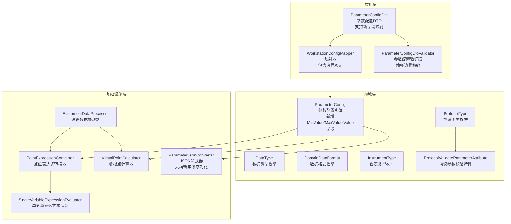
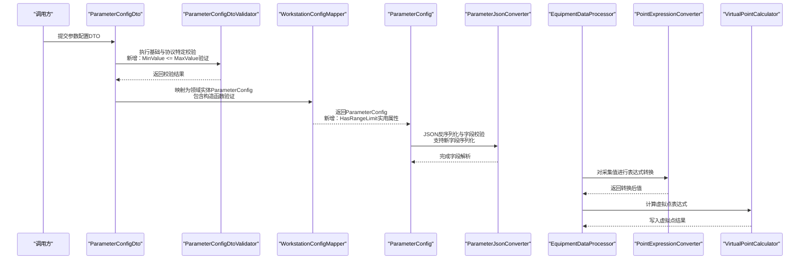
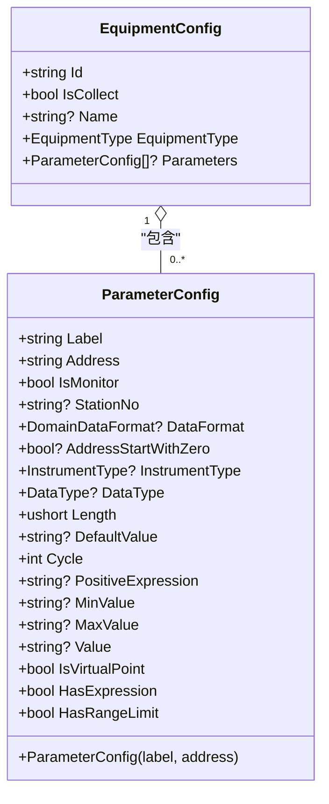
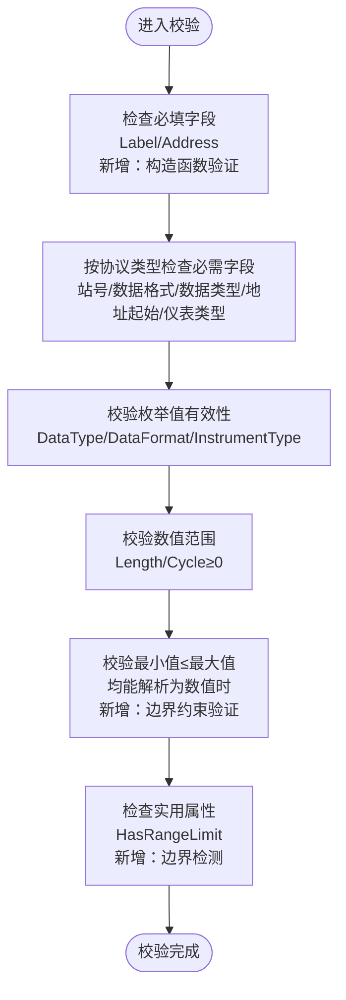
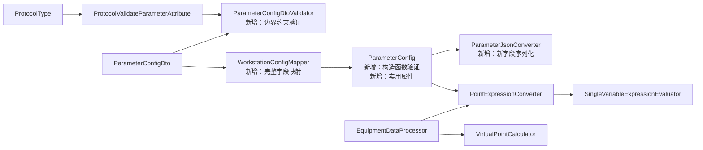
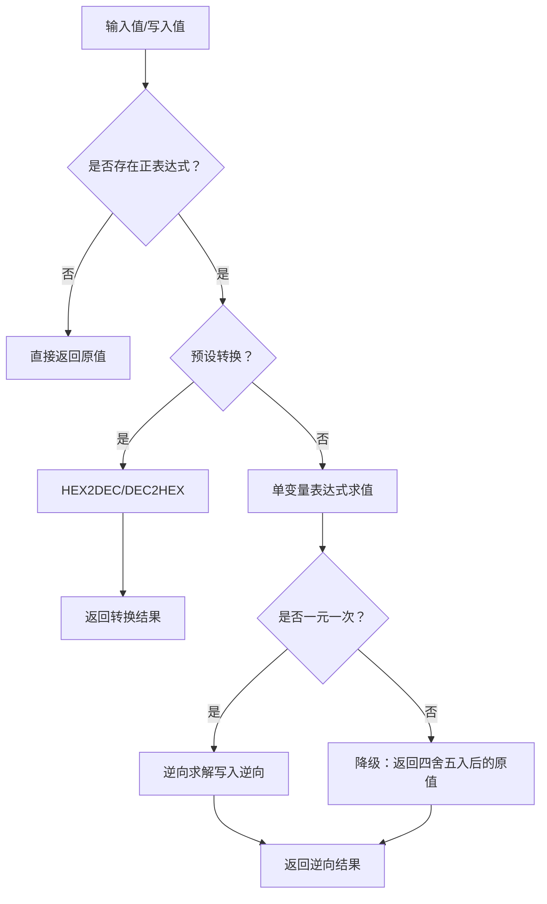
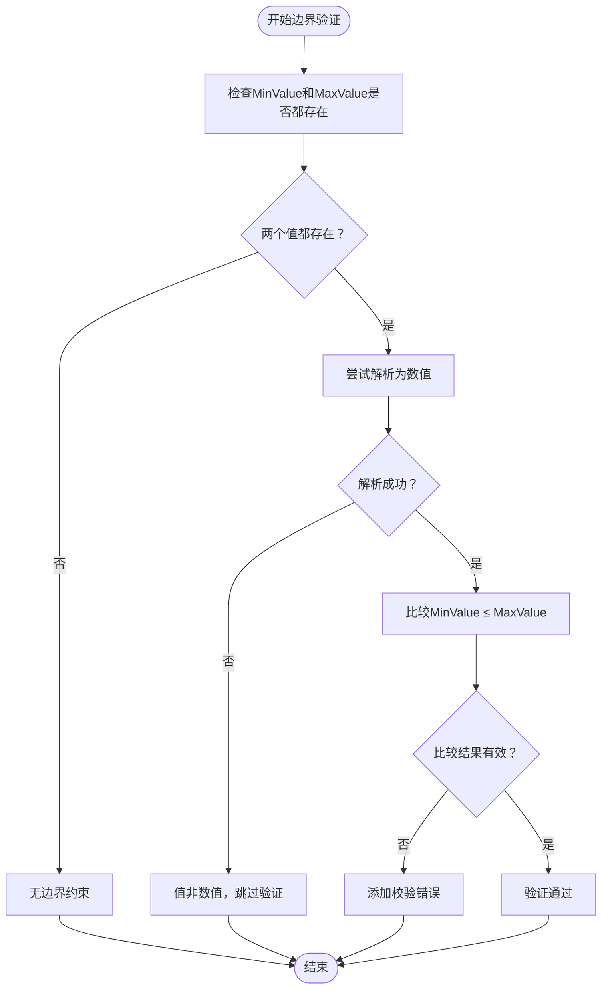

# 参数配置模型

<cite>
**本文引用的文件**
- [ParameterConfig.cs](file://IndustrialDataSolution/IndustrialDataProcessor.Domain/Workstation/Configs/ParameterConfig.cs)
- [DataType.cs](file://IndustrialDataSolution/IndustrialDataProcessor.Domain/Enums/DataType.cs)
- [DomainDataFormat.cs](file://IndustrialDataSolution/IndustrialDataProcessor.Domain/Enums/DomainDataFormat.cs)
- [InstrumentType.cs](file://IndustrialDataSolution/IndustrialDataProcessor.Domain/Enums/InstrumentType.cs)
- [ProtocolType.cs](file://IndustrialDataSolution/IndustrialDataProcessor.Domain/Enums/ProtocolType.cs)
- [ProtocolValidateParameterAttribute.cs](file://IndustrialDataSolution/IndustrialDataProcessor.Domain/Attributes/ProtocolValidateParameterAttribute.cs)
- [ParameterConfigDto.cs](file://IndustrialDataSolution/IndustrialDataProcessor.Application/Dtos/WorkstationDto/ParameterConfigDto.cs)
- [ParameterConfigDtoValidator.cs](file://IndustrialDataSolution/IndustrialDataProcessor.Application/Validators/ParameterConfigDtoValidator.cs)
- [ParameterJsonConverter.cs](file://IndustrialDataSolution/IndustrialDataProcessor.Infrastructure/Serialization/Converters/ParameterJsonConverter.cs)
- [WorkstationConfigMapper.cs](file://IndustrialDataSolution/IndustrialDataProcessor.Application/Mappers/WorkstationConfigMapper.cs)
- [EquipmentConfig.cs](file://IndustrialDataSolution/IndustrialDataProcessor.Domain/Workstation/Configs/EquipmentConfig.cs)
- [VirtualPointCalculator.cs](file://IndustrialDataSolution/IndustrialDataProcessor.Infrastructure/EquipmentCollectionDataProcessing/VirtualPointCalculator.cs)
- [PointExpressionConverter.cs](file://IndustrialDataSolution/IndustrialDataProcessor.Infrastructure/EquipmentCollectionDataProcessing/PointExpressionConverter.cs)
- [SingleVariableExpressionEvaluator.cs](file://IndustrialDataSolution/IndustrialDataProcessor.Infrastructure/EquipmentCollectionDataProcessing/SingleVariableExpressionEvaluator.cs)
- [EquipmentDataProcessor.cs](file://IndustrialDataSolution/IndustrialDataProcessor.Infrastructure/EquipmentCollectionDataProcessing/EquipmentDataProcessor.cs)
- [ParameterConfigDtoValidatorTests.cs](file://IndustrialDataSolution/IndustrialDataProcessor.Application.Test/Validators/ParameterConfigDtoValidatorTests.cs)
</cite>

## 更新摘要
**变更内容**
- 更新了ParameterConfig实体的字段说明，新增MinValue、MaxValue和Value字段的详细描述
- 增强了构造函数验证逻辑的说明，包括参数验证和异常处理
- 新增了实用属性HasRangeLimit的详细说明和应用场景
- 更新了验证逻辑部分，重点说明MinValue <= MaxValue的验证规则
- 更新了序列化和映射部分，说明新字段在JSON转换和DTO映射中的处理
- 增加了边界约束和告警机制的最佳实践指导

## 目录
1. [引言](#引言)
2. [项目结构](#项目结构)
3. [核心组件](#核心组件)
4. [架构总览](#架构总览)
5. [详细组件分析](#详细组件分析)
6. [依赖关系分析](#依赖关系分析)
7. [性能考量](#性能考量)
8. [故障排查指南](#故障排查指南)
9. [结论](#结论)
10. [附录](#附录)

## 引言
本文件系统性阐述参数配置模型（ParameterConfig）的设计与实现，覆盖以下主题：
- ParameterConfig 实体的业务含义与关键属性设计，包括新增的MinValue、MaxValue和Value字段
- 数据类型枚举（DataType）、数据格式枚举（DomainDataFormat）、仪表类型枚举（InstrumentType）的定义与应用场景
- 参数配置与设备配置（EquipmentConfig）的绑定关系与继承机制
- 参数配置的验证逻辑与转换规则，包括增强的边界验证
- 参数配置在数据采集与处理流程中的作用
- 标准化设置指南、最佳实践与典型工业参数配置示例
- 在数据转换与计算中的具体应用与常见模式

## 项目结构
参数配置模型横跨领域层、应用层与基础设施层，围绕"参数配置"形成如下分层协作：
- 领域层：定义参数配置实体与枚举，承载业务语义，包含新增的边界约束字段
- 应用层：提供 DTO、映射器与验证器，负责协议特定校验与边界控制
- 基础设施层：提供序列化转换器、表达式求值与虚拟点计算等运行时能力

**图表来源**
- [ParameterConfig.cs](file://IndustrialDataSolution/IndustrialDataProcessor.Domain/Workstation/Configs/ParameterConfig.cs#L1-L121)
- [ParameterConfigDto.cs](file://IndustrialDataSolution/IndustrialDataProcessor.Application/Dtos/WorkstationDto/ParameterConfigDto.cs#L1-L94)
- [ParameterConfigDtoValidator.cs](file://IndustrialDataSolution/IndustrialDataProcessor.Application/Validators/ParameterConfigDtoValidator.cs#L1-L97)
- [WorkstationConfigMapper.cs](file://IndustrialDataSolution/IndustrialDataProcessor.Application/Mappers/WorkstationConfigMapper.cs#L1-L123)
- [ParameterJsonConverter.cs](file://IndustrialDataSolution/IndustrialDataProcessor.Infrastructure/Serialization/Converters/ParameterJsonConverter.cs#L1-L63)

**章节来源**
- [ParameterConfig.cs](file://IndustrialDataSolution/IndustrialDataProcessor.Domain/Workstation/Configs/ParameterConfig.cs#L1-L121)
- [ParameterConfigDto.cs](file://IndustrialDataSolution/IndustrialDataProcessor.Application/Dtos/WorkstationDto/ParameterConfigDto.cs#L1-L94)
- [ParameterConfigDtoValidator.cs](file://IndustrialDataSolution/IndustrialDataProcessor.Application/Validators/ParameterConfigDtoValidator.cs#L1-L97)
- [WorkstationConfigMapper.cs](file://IndustrialDataSolution/IndustrialDataProcessor.Application/Mappers/WorkstationConfigMapper.cs#L1-L123)
- [ParameterJsonConverter.cs](file://IndustrialDataSolution/IndustrialDataProcessor.Infrastructure/Serialization/Converters/ParameterJsonConverter.cs#L1-L63)
- [EquipmentConfig.cs](file://IndustrialDataSolution/IndustrialDataProcessor.Domain/Workstation/Configs/EquipmentConfig.cs#L1-L34)

## 核心组件
- ParameterConfig（参数配置实体）
  - 关键属性：标签（Label）、地址（Address）、是否监控（IsMonitor）、站号（StationNo）、数据格式（DataFormat）、地址起始是否为0（AddressStartWithZero）、仪表类型（InstrumentType）、数据类型（DataType）、长度（Length）、默认值（DefaultValue）、采集周期（Cycle）、正表达式（PositiveExpression）、最小值（MinValue）、最大值（MaxValue）、写入值（Value）
  - **新增功能**：构造函数验证（标签和地址不能为空）、实用属性（IsVirtualPoint、HasExpression、HasRangeLimit）
  - 设计要点：以"点位"为中心，既支持物理采集点，也支持通过表达式生成的虚拟点；通过枚举与可空类型适配不同协议与现场差异；新增边界约束支持告警与数据质量控制
- DataType（数据类型枚举）
  - 覆盖布尔、整型（无符号/有符号）、长整型（无符号/有符号）、浮点型（单/双精度）、字符串等
  - 应用场景：决定底层读取/写入的数据宽度与解析策略
- DomainDataFormat（数据格式/字节序枚举）
  - ABCD、BADC、CDAB、DCBA 四种字节序，用于多字节数据的高低位组合
  - 应用场景：Modbus、DLT645、CJT188 等协议的字节序差异处理
- InstrumentType（仪表类型枚举）
  - 水表类（冷水、生活热水、直饮、中水）、热量表类（热量、冷量）、燃气表、电度表等
  - 应用场景：CJT188 协议下的仪表类型判定与特殊解析
- ProtocolType（协议类型枚举）与 ProtocolValidateParameterAttribute（协议参数校验特性）
  - 通过特性标注每种协议在参数配置上所需的字段集合（如站号、数据格式、数据类型、地址起始是否为0、仪表类型）
  - 应用场景：参数配置的协议特定校验与约束

**章节来源**
- [ParameterConfig.cs](file://IndustrialDataSolution/IndustrialDataProcessor.Domain/Workstation/Configs/ParameterConfig.cs#L1-L121)
- [DataType.cs](file://IndustrialDataSolution/IndustrialDataProcessor.Domain/Enums/DataType.cs#L1-L69)
- [DomainDataFormat.cs](file://IndustrialDataSolution/IndustrialDataProcessor.Domain/Enums/DomainDataFormat.cs#L1-L9)
- [InstrumentType.cs](file://IndustrialDataSolution/IndustrialDataProcessor.Domain/Enums/InstrumentType.cs#L1-L58)
- [ProtocolType.cs](file://IndustrialDataSolution/IndustrialDataProcessor.Domain/Enums/ProtocolType.cs#L1-L231)
- [ProtocolValidateParameterAttribute.cs](file://IndustrialDataSolution/IndustrialDataProcessor.Domain/Attributes/ProtocolValidateParameterAttribute.cs#L1-L28)

## 架构总览
参数配置贯穿"配置—验证—序列化—采集—转换—虚拟点计算"的完整链路，新增边界约束验证确保数据质量。

**图表来源**
- [ParameterConfigDto.cs](file://IndustrialDataSolution/IndustrialDataProcessor.Application/Dtos/WorkstationDto/ParameterConfigDto.cs#L1-L94)
- [ParameterConfigDtoValidator.cs](file://IndustrialDataSolution/IndustrialDataProcessor.Application/Validators/ParameterConfigDtoValidator.cs#L1-L97)
- [WorkstationConfigMapper.cs](file://IndustrialDataSolution/IndustrialDataProcessor.Application/Mappers/WorkstationConfigMapper.cs#L1-L123)
- [ParameterJsonConverter.cs](file://IndustrialDataSolution/IndustrialDataProcessor.Infrastructure/Serialization/Converters/ParameterJsonConverter.cs#L1-L63)
- [EquipmentDataProcessor.cs](file://IndustrialDataSolution/IndustrialDataProcessor.Infrastructure/EquipmentCollectionDataProcessing/EquipmentDataProcessor.cs#L67-L95)
- [PointExpressionConverter.cs](file://IndustrialDataSolution/IndustrialDataProcessor.Infrastructure/EquipmentCollectionDataProcessing/PointExpressionConverter.cs#L1-L110)
- [VirtualPointCalculator.cs](file://IndustrialDataSolution/IndustrialDataProcessor.Infrastructure/EquipmentCollectionDataProcessing/VirtualPointCalculator.cs#L1-L50)

## 详细组件分析

### ParameterConfig 实体设计与业务用途
- **属性设计原则**
  - 必填项：标签（Label）、地址（Address）、是否监控（IsMonitor）
  - 可选项：站号（StationNo）、数据格式（DataFormat）、地址起始是否为0（AddressStartWithZero）、仪表类型（InstrumentType）、数据类型（DataType）、长度（Length）、默认值（DefaultValue）、采集周期（Cycle）、正表达式（PositiveExpression）、最小值（MinValue）、最大值（MaxValue）、写入值（Value）
  - **新增字段**：MinValue、MaxValue、Value均为可空字符串类型，支持灵活的边界约束和写入值管理
- **构造函数验证**
  - 标签和地址不能为空，否则抛出ArgumentException异常
  - 确保参数配置的基本完整性
- **实用属性**
  - IsVirtualPoint：判断是否为虚拟点（地址包含"VirtualPoint"）
  - HasExpression：判断是否存在正表达式转换
  - HasRangeLimit：判断是否存在最小值或最大值约束
- **业务用途**
  - 物理采集点：通过地址、数据类型、长度、字节序等描述底层寄存器/内存布局
  - 虚拟点：通过正表达式引用其他点位或数值，实现单位换算、标度变换、组合计算
  - **边界约束**：最小值/最大值用于告警与数据质量控制，增强系统稳定性
  - 采集控制：采集周期与默认值参与调度与初始化
  - **写入管理**：Value字段专门用于存储写入操作的目标值

**章节来源**
- [ParameterConfig.cs](file://IndustrialDataSolution/IndustrialDataProcessor.Domain/Workstation/Configs/ParameterConfig.cs#L1-L121)

### 数据类型枚举（DataType）与应用场景
- 覆盖范围：布尔、无符号/有符号短整型、无符号/有符号长整型、单/双精度浮点、字符串
- 应用场景
  - Modbus 寄存器读取：Short/Int/UShort/UInt 与字节序配合
  - 浮点数：Float/Double 用于流量、压力、温度等连续量
  - 字符串：用于协议文本字段或调试输出

**章节来源**
- [DataType.cs](file://IndustrialDataSolution/IndustrialDataProcessor.Domain/Enums/DataType.cs#L1-L69)

### 数据格式枚举（DomainDataFormat）与应用场景
- 枚举值：ABCD、BADC、CDAB、DCBA
- 应用场景：多字节数据的高低位排列，适配不同设备/协议的字节序约定

**章节来源**
- [DomainDataFormat.cs](file://IndustrialDataSolution/IndustrialDataProcessor.Domain/Enums/DomainDataFormat.cs#L1-L9)

### 仪表类型枚举（InstrumentType）与应用场景
- 类别：水表类、热量表类、燃气表、电度表
- 应用场景：CJT188 协议下依据仪表类型执行特定解析与校验

**章节来源**
- [InstrumentType.cs](file://IndustrialDataSolution/IndustrialDataProcessor.Domain/Enums/InstrumentType.cs#L1-L58)

### 参数配置与设备配置的绑定关系与继承机制
- **绑定关系**
  - 设备配置（EquipmentConfig）包含参数配置列表（Parameters），体现"设备拥有多个参数点"
- **继承机制**
  - 参数配置在不同协议下通过特性（ProtocolValidateParameterAttribute）声明必需字段，形成"按协议继承"的约束集
- **映射关系**
  - 应用层映射器将 DTO 转换为领域实体，保留协议上下文（ProtocolType）与设备标识（EquipmentId）
  - **新增**：映射器支持新字段的完整映射，包括边界约束和写入值

**图表来源**
- [EquipmentConfig.cs](file://IndustrialDataSolution/IndustrialDataProcessor.Domain/Workstation/Configs/EquipmentConfig.cs#L1-L34)
- [ParameterConfig.cs](file://IndustrialDataSolution/IndustrialDataProcessor.Domain/Workstation/Configs/ParameterConfig.cs#L1-L121)

**章节来源**
- [EquipmentConfig.cs](file://IndustrialDataSolution/IndustrialDataProcessor.Domain/Workstation/Configs/EquipmentConfig.cs#L1-L34)
- [WorkstationConfigMapper.cs](file://IndustrialDataSolution/IndustrialDataProcessor.Application/Mappers/WorkstationConfigMapper.cs#L1-L123)

### 参数配置验证逻辑与转换规则
- **基础必填校验**
  - 标签（Label）与地址（Address）必须非空
  - **新增**：构造函数验证确保基本完整性
- **协议特定校验**
  - 通过 ProtocolType + ProtocolValidateParameterAttribute 动态注入字段约束（站号、数据格式、数据类型、地址起始是否为0、仪表类型）
- **枚举有效性校验**
  - DataType、DataFormat、InstrumentType 必须在各自枚举范围内
- **数值范围校验**
  - 长度（Length）与采集周期（Cycle）需非负
- **边界约束验证**
  - **新增**：最小值（MinValue）≤ 最大值（MaxValue），仅当两者均可解析为数值时进行比较
  - **新增**：HasRangeLimit实用属性自动检测是否存在边界约束
- **表达式转换规则**
  - 支持预设转换（HEX2DEC、DEC2HEX）与单变量表达式求值
  - 写入逆向转换：基于表达式反解，将目标值还原为底层驱动所需物理值

**图表来源**
- [ParameterConfigDtoValidator.cs](file://IndustrialDataSolution/IndustrialDataProcessor.Application/Validators/ParameterConfigDtoValidator.cs#L1-L97)
- [ParameterConfig.cs](file://IndustrialDataSolution/IndustrialDataProcessor.Domain/Workstation/Configs/ParameterConfig.cs#L1-L121)
- [ParameterConfigDtoValidatorTests.cs](file://IndustrialDataSolution/IndustrialDataProcessor.Application.Test/Validators/ParameterConfigDtoValidatorTests.cs#L130-L195)

**章节来源**
- [ParameterConfigDtoValidator.cs](file://IndustrialDataSolution/IndustrialDataProcessor.Application/Validators/ParameterConfigDtoValidator.cs#L1-L97)
- [ParameterConfigDtoValidatorTests.cs](file://IndustrialDataSolution/IndustrialDataProcessor.Application.Test/Validators/ParameterConfigDtoValidatorTests.cs#L130-L195)

### 参数配置在数据采集与处理中的作用
- **采集阶段**
  - 依据地址、数据类型、长度、字节序读取底层数据
  - 采集周期控制轮询频率
  - **新增**：边界约束参与数据质量控制
- **转换阶段**
  - 表达式转换：将原始值按规则转换为目标单位或工程量
  - 写入逆向转换：将上位机下发值还原为底层可写入的物理值
- **虚拟点计算**
  - 基于表达式引用其他点位，生成派生指标（如平均值、差值、报警标志）
- **边界监控**
  - **新增**：实时监控采集值是否超出边界范围，触发告警机制

**章节来源**
- [PointExpressionConverter.cs](file://IndustrialDataSolution/IndustrialDataProcessor.Infrastructure/EquipmentCollectionDataProcessing/PointExpressionConverter.cs#L1-L110)
- [VirtualPointCalculator.cs](file://IndustrialDataSolution/IndustrialDataProcessor.Infrastructure/EquipmentCollectionDataProcessing/VirtualPointCalculator.cs#L1-L50)
- [EquipmentDataProcessor.cs](file://IndustrialDataSolution/IndustrialDataProcessor.Infrastructure/EquipmentCollectionDataProcessing/EquipmentDataProcessor.cs#L67-L95)

### 标准化设置指南与最佳实践
- **标准化命名**
  - Label 使用清晰、唯一的业务标识，避免歧义
- **地址与数据类型匹配**
  - 地址与数据类型、长度严格对应设备寄存器布局，避免越界或误读
- **字节序一致性**
  - DataFormat 与设备/协议说明一致，避免高低位颠倒
- **表达式设计**
  - 表达式仅引用已存在的点位，避免循环依赖；尽量使用一元一次表达式以便逆向转换
- **边界与告警**
  - **新增**：合理设置 MinValue/MaxValue，结合业务阈值进行告警
  - **新增**：利用 HasRangeLimit 实用属性自动检测边界约束
  - **新增**：为关键参数配置边界约束，提升系统稳定性
- **写入值管理**
  - **新增**：Value 字段专门用于存储写入操作的目标值
  - **新增**：确保写入值符合边界约束范围
- **协议特定字段**
  - 根据协议类型启用必需字段（站号、数据格式、仪表类型等），避免遗漏

### 典型工业参数配置示例与常见模式
- **温度模拟量（Modbus RTU）**
  - 数据类型：Float/Double
  - 地址：4x寄存器起始地址
  - 长度：2（双寄存器）
  - 字节序：ABCD/BADC 视设备而定
  - 表达式：x*0.01 或 x/100（标度因子）
  - **新增边界**：MinValue = "0"，MaxValue = "200"（防止异常高温）
- **流量累积量（DLT645/CJT188）**
  - 数据类型：UInt/ULong
  - 地址：用户地址
  - 仪表类型：水表/热量表等
  - 表达式：单位换算（m³→吨、GJ→kW）
  - **新增边界**：MinValue = "0"，MaxValue = "999999"（防止溢出）
- **虚拟点（报警/组合）**
  - 表达式：多个条件组合（如"x>阈值?1:0"）
  - 用于上位机显示与告警联动
  - **新增边界**：Value = "1"（报警状态）
- **压力传感器（工业标准）**
  - 数据类型：Float
  - 地址：40001
  - 表达式：x*0.1（工程单位）
  - **新增边界**：MinValue = "-1"（允许微负压），MaxValue = "100"（最大量程）

### 参数配置在数据转换与计算中的应用
- **单变量表达式求值**
  - 支持加减乘除、括号与常量，结果保留两位小数
- **逆向求解**
  - 对一元一次表达式进行反解，实现写值的物理还原
- **预设转换**
  - HEX2DEC/DEC2HEX 快速进制转换，兼容底层驱动输入
- **边界约束应用**
  - **新增**：在表达式求值前后进行边界检查
  - **新增**：支持动态边界调整的虚拟点计算

**章节来源**
- [SingleVariableExpressionEvaluator.cs](file://IndustrialDataSolution/IndustrialDataProcessor.Infrastructure/EquipmentCollectionDataProcessing/SingleVariableExpressionEvaluator.cs#L1-L105)
- [PointExpressionConverter.cs](file://IndustrialDataSolution/IndustrialDataProcessor.Infrastructure/EquipmentCollectionDataProcessing/PointExpressionConverter.cs#L1-L110)

## 依赖关系分析
- **领域层依赖**
  - ParameterConfig 依赖 DataType、DomainDataFormat、InstrumentType
  - **新增**：构造函数验证依赖参数完整性检查
  - **新增**：实用属性依赖字符串比较和数值解析
  - ProtocolType 通过 ProtocolValidateParameterAttribute 为参数配置提供约束
- **应用层依赖**
  - ParameterConfigDtoValidator 基于 ProtocolType 与特性进行协议特定校验
  - **新增**：增强的边界约束验证逻辑
  - WorkstationConfigMapper 将 DTO 映射为 ParameterConfig，携带协议与设备上下文
  - **新增**：完整的新字段映射支持
- **基础设施层依赖**
  - ParameterJsonConverter 负责 JSON 反序列化与字段校验
  - **新增**：支持新字段的序列化和反序列化
  - PointExpressionConverter 与 VirtualPointCalculator 依赖表达式求值器完成转换与计算

**图表来源**
- [ProtocolType.cs](file://IndustrialDataSolution/IndustrialDataProcessor.Domain/Enums/ProtocolType.cs#L1-L231)
- [ProtocolValidateParameterAttribute.cs](file://IndustrialDataSolution/IndustrialDataProcessor.Domain/Attributes/ProtocolValidateParameterAttribute.cs#L1-L28)
- [ParameterConfigDtoValidator.cs](file://IndustrialDataSolution/IndustrialDataProcessor.Application/Validators/ParameterConfigDtoValidator.cs#L1-L97)
- [WorkstationConfigMapper.cs](file://IndustrialDataSolution/IndustrialDataProcessor.Application/Mappers/WorkstationConfigMapper.cs#L1-L123)
- [ParameterJsonConverter.cs](file://IndustrialDataSolution/IndustrialDataProcessor.Infrastructure/Serialization/Converters/ParameterJsonConverter.cs#L1-L63)
- [ParameterConfig.cs](file://IndustrialDataSolution/IndustrialDataProcessor.Domain/Workstation/Configs/ParameterConfig.cs#L1-L121)

**章节来源**
- [ParameterConfigDtoValidator.cs](file://IndustrialDataSolution/IndustrialDataProcessor.Application/Validators/ParameterConfigDtoValidator.cs#L1-L97)
- [WorkstationConfigMapper.cs](file://IndustrialDataSolution/IndustrialDataProcessor.Application/Mappers/WorkstationConfigMapper.cs#L1-L123)
- [ParameterJsonConverter.cs](file://IndustrialDataSolution/IndustrialDataProcessor.Infrastructure/Serialization/Converters/ParameterJsonConverter.cs#L1-L63)

## 性能考量
- **表达式求值**
  - 单变量表达式求值器每次新建解释器，保证线程安全；建议复用或缓存稳定表达式
- **虚拟点计算**
  - 表达式解析与求值可能带来开销，应限制复杂度与计算频率
- **字节序与进制转换**
  - 预设转换（HEX2DEC/DEC2HEX）为常量时间操作，优先使用以减少表达式开销
- **校验与序列化**
  - JSON 反序列化与字段校验在应用层集中处理，避免重复解析
  - **新增**：边界约束验证仅在必要时进行数值解析，提升性能
- **实用属性优化**
  - **新增**：HasRangeLimit使用惰性计算，仅在需要时检查边界值

## 故障排查指南
- **常见问题与定位**
  - 校验失败：检查协议类型与必需字段是否满足要求；确认枚举值有效且范围正确
  - **新增**：边界约束失败：检查 MinValue 和 MaxValue 的数值关系和可解析性
  - 表达式异常：核对表达式语法与变量引用；对于非一元一次表达式，逆向转换不可用
  - 虚拟点计算失败：查看日志中表达式与变量值，确认变量存在且可解析
  - **新增**：构造函数异常：检查标签和地址参数的有效性
- **排查步骤**
  - 逐条核对参数配置字段（标签、地址、数据类型、长度、字节序、表达式、边界值）
  - **新增**：使用单元测试覆盖协议特定校验与边界条件，包括 MinValue <= MaxValue 验证
  - **新增**：检查实用属性（HasRangeLimit）的正确性
  - 查看表达式求值器返回的错误信息与降级行为（如四舍五入）
  - **新增**：验证写入值（Value）与边界约束的一致性

**章节来源**
- [ParameterConfigDtoValidator.cs](file://IndustrialDataSolution/IndustrialDataProcessor.Application/Validators/ParameterConfigDtoValidator.cs#L1-L97)
- [ParameterConfigDtoValidatorTests.cs](file://IndustrialDataSolution/IndustrialDataProcessor.Application.Test/Validators/ParameterConfigDtoValidatorTests.cs#L130-L195)
- [VirtualPointCalculator.cs](file://IndustrialDataSolution/IndustrialDataProcessor.Infrastructure/EquipmentCollectionDataProcessing/VirtualPointCalculator.cs#L1-L50)
- [PointExpressionConverter.cs](file://IndustrialDataSolution/IndustrialDataProcessor.Infrastructure/EquipmentCollectionDataProcessing/PointExpressionConverter.cs#L1-L110)
- [SingleVariableExpressionEvaluator.cs](file://IndustrialDataSolution/IndustrialDataProcessor.Infrastructure/EquipmentCollectionDataProcessing/SingleVariableExpressionEvaluator.cs#L1-L105)

## 结论
参数配置模型以 ParameterConfig 为核心，通过枚举与可选字段适配多样协议与现场差异，借助协议特性实现"按协议继承"的约束机制。**新增的边界约束功能**（MinValue、MaxValue、HasRangeLimit）显著提升了系统的数据质量控制能力，为工业应用提供了可靠的告警和保护机制。应用层的验证器与映射器保障配置的合法性与一致性，基础设施层的转换器与计算器完成从原始值到工程值的闭环处理。遵循标准化设置与最佳实践，可显著提升配置的可维护性与系统的稳定性。

## 附录
- **关键流程图（表达式转换与逆向转换）**

**图表来源**
- [PointExpressionConverter.cs](file://IndustrialDataSolution/IndustrialDataProcessor.Infrastructure/EquipmentCollectionDataProcessing/PointExpressionConverter.cs#L1-L110)
- [SingleVariableExpressionEvaluator.cs](file://IndustrialDataSolution/IndustrialDataProcessor.Infrastructure/EquipmentCollectionDataProcessing/SingleVariableExpressionEvaluator.cs#L1-L105)

- **边界约束验证流程图**

**图表来源**
- [ParameterConfigDtoValidator.cs](file://IndustrialDataSolution/IndustrialDataProcessor.Application/Validators/ParameterConfigDtoValidator.cs#L54-L71)
- [ParameterConfigDtoValidatorTests.cs](file://IndustrialDataSolution/IndustrialDataProcessor.Application.Test/Validators/ParameterConfigDtoValidatorTests.cs#L130-L195)