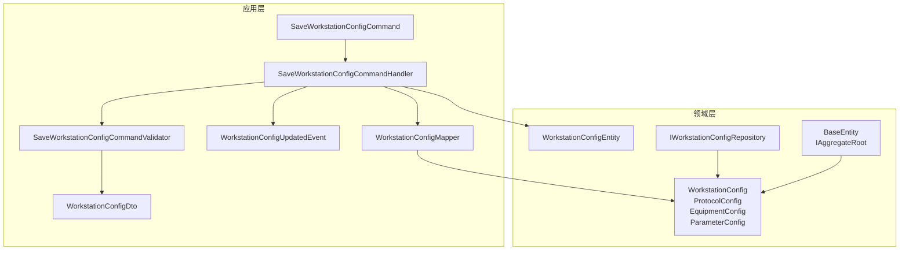
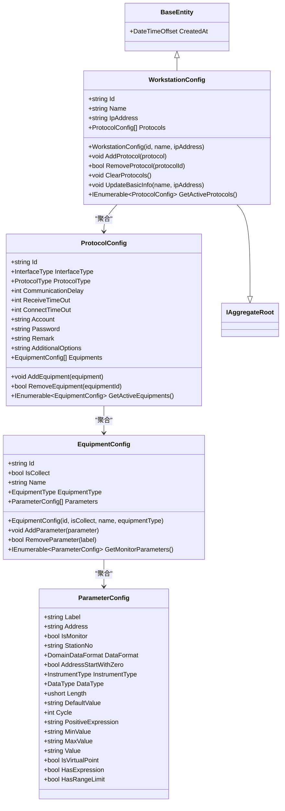
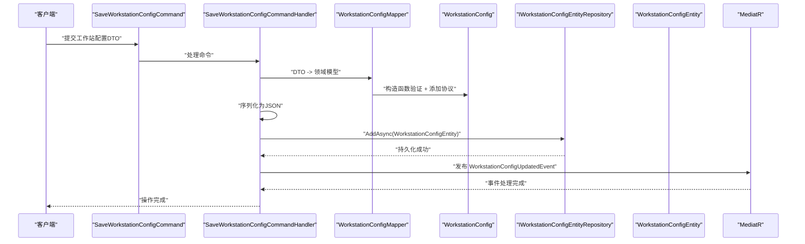
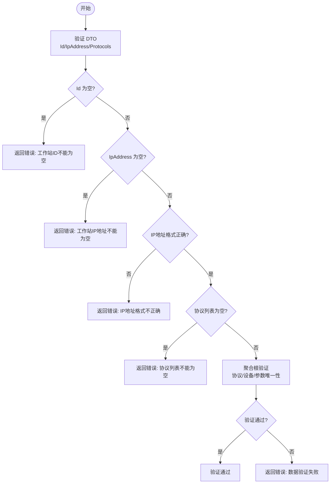
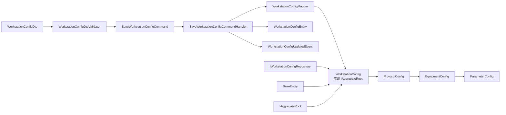

# 工作站配置模型

<cite>
**本文引用的文件**
- [WorkstationConfig.cs](file://IndustrialDataSolution/IndustrialDataProcessor.Domain/Workstation/Configs/WorkstationConfig.cs)
- [ProtocolConfig.cs](file://IndustrialDataSolution/IndustrialDataProcessor.Domain/Workstation/Configs/ProtocolConfig.cs)
- [EquipmentConfig.cs](file://IndustrialDataSolution/IndustrialDataProcessor.Domain/Workstation/Configs/EquipmentConfig.cs)
- [ParameterConfig.cs](file://IndustrialDataSolution/IndustrialDataProcessor.Domain/Workstation/Configs/ParameterConfig.cs)
- [BaseEntity.cs](file://IndustrialDataSolution/IndustrialDataProcessor.Domain/Entities/BaseEntity.cs)
- [WorkstationConfigEntity.cs](file://IndustrialDataSolution/IndustrialDataProcessor.Domain/Entities/WorkstationConfigEntity.cs)
- [IWorkstationConfigRepository.cs](file://IndustrialDataSolution/IndustrialDataProcessor.Domain/Repositories/IWorkstationConfigRepository.cs)
- [WorkstationConfigDto.cs](file://IndustrialDataSolution/IndustrialDataProcessor.Application/Dtos/WorkstationDto/WorkstationConfigDto.cs)
- [SaveWorkstationConfigCommand.cs](file://IndustrialDataSolution/IndustrialDataProcessor.Application/Commands/SaveWorkstationConfigCommand.cs)
- [SaveWorkstationConfigCommandHandler.cs](file://IndustrialDataSolution/IndustrialDataProcessor.Application/CommandHandlers/SaveWorkstationConfigCommandHandler.cs)
- [WorkstationConfigDtoValidator.cs](file://IndustrialDataSolution/IndustrialDataProcessor.Application/Validators/WorkstationConfigDtoValidator.cs)
- [SaveWorkstationConfigCommandValidator.cs](file://IndustrialDataSolution/IndustrialDataProcessor.Application/Validators/SaveWorkstationConfigCommandValidator.cs)
- [WorkstationConfigUpdatedEvent.cs](file://IndustrialDataSolution/IndustrialDataProcessor.Application/Events/WorkstationConfigUpdatedEvent.cs)
- [WorkstationConfigMapper.cs](file://IndustrialDataSolution/IndustrialDataProcessor.Application/Mappers/WorkstationConfigMapper.cs)
- [ProtocolType.cs](file://IndustrialDataSolution/IndustrialDataProcessor.Domain/Enums/ProtocolType.cs)
- [EquipmentType.cs](file://IndustrialDataSolution/IndustrialDataProcessor.Domain/Enums/EquipmentType.cs)
</cite>

## 更新摘要
**变更内容**
- WorkstationConfig类已重构为完整的聚合根，实现IAggregateRoot接口
- 新增构造函数验证机制，确保数据完整性
- 增加协议管理方法，支持动态添加、移除和清空协议
- 增加业务方法如GetActiveProtocols()，提供查询功能
- 所有属性增加[JsonInclude]特性，支持JSON序列化
- 增强了领域模型的封装性和业务逻辑内聚性

## 目录
1. [引言](#引言)
2. [项目结构](#项目结构)
3. [核心组件](#核心组件)
4. [架构总览](#架构总览)
5. [详细组件分析](#详细组件分析)
6. [依赖分析](#依赖分析)
7. [性能考虑](#性能考虑)
8. [故障排查指南](#故障排查指南)
9. [结论](#结论)
10. [附录](#附录)

## 引言
本技术文档围绕"工作站配置模型"展开，系统性阐述 WorkstationConfig 领域模型的设计理念、业务语义与约束、聚合关系与管理机制，并结合 DDD 聚合根的边界划分说明其生命周期（创建、更新、删除）的业务规则。经过重构，WorkstationConfig 已从简单数据容器升级为完整的聚合根，具备完善的验证机制、协议管理和业务方法。同时，文档给出与领域模型之间的关系与依赖，提供工业数据采集场景下的使用示例，以及数据验证与业务约束的实现细节。

## 项目结构
工作站配置模型位于领域层的 Workstation.Configs 命名空间中，采用纯领域对象设计，配合应用层 DTO、命令、验证器与事件，形成清晰的分层职责。持久化通过实体类 WorkstationConfigEntity 将序列化后的 JSON 存储于数据库，应用层负责将 DTO 映射为领域模型并持久化。

**图表来源**
- [SaveWorkstationConfigCommand.cs](file://IndustrialDataSolution/IndustrialDataProcessor.Application/Commands/SaveWorkstationConfigCommand.cs#L1-L9)
- [SaveWorkstationConfigCommandHandler.cs](file://IndustrialDataSolution/IndustrialDataProcessor.Application/CommandHandlers/SaveWorkstationConfigCommandHandler.cs#L1-L32)
- [SaveWorkstationConfigCommandValidator.cs](file://IndustrialDataSolution/IndustrialDataProcessor.Application/Validators/SaveWorkstationConfigCommandValidator.cs#L1-L13)
- [WorkstationConfigDto.cs](file://IndustrialDataSolution/IndustrialDataProcessor.Application/Dtos/WorkstationDto/WorkstationConfigDto.cs#L1-L29)
- [WorkstationConfig.cs](file://IndustrialDataSolution/IndustrialDataProcessor.Domain/Workstation/Configs/WorkstationConfig.cs#L1-L134)
- [ProtocolConfig.cs](file://IndustrialDataSolution/IndustrialDataProcessor.Domain/Workstation/Configs/ProtocolConfig.cs#L1-L116)
- [EquipmentConfig.cs](file://IndustrialDataSolution/IndustrialDataProcessor.Domain/Workstation/Configs/EquipmentConfig.cs#L1-L107)
- [ParameterConfig.cs](file://IndustrialDataSolution/IndustrialDataProcessor.Domain/Workstation/Configs/ParameterConfig.cs#L1-L121)
- [BaseEntity.cs](file://IndustrialDataSolution/IndustrialDataProcessor.Domain/Entities/BaseEntity.cs#L1-L30)
- [WorkstationConfigEntity.cs](file://IndustrialDataSolution/IndustrialDataProcessor.Domain/Entities/WorkstationConfigEntity.cs#L1-L7)
- [IWorkstationConfigRepository.cs](file://IndustrialDataSolution/IndustrialDataProcessor.Domain/Repositories/IWorkstationConfigRepository.cs#L1-L12)
- [WorkstationConfigUpdatedEvent.cs](file://IndustrialDataSolution/IndustrialDataProcessor.Application/Events/WorkstationConfigUpdatedEvent.cs#L1-L11)
- [WorkstationConfigMapper.cs](file://IndustrialDataSolution/IndustrialDataProcessor.Application/Mappers/WorkstationConfigMapper.cs#L1-L123)

**章节来源**
- [WorkstationConfig.cs](file://IndustrialDataSolution/IndustrialDataProcessor.Domain/Workstation/Configs/WorkstationConfig.cs#L1-L134)
- [WorkstationConfigDto.cs](file://IndustrialDataSolution/IndustrialDataProcessor.Application/Dtos/WorkstationDto/WorkstationConfigDto.cs#L1-L29)
- [SaveWorkstationConfigCommandHandler.cs](file://IndustrialDataSolution/IndustrialDataProcessor.Application/CommandHandlers/SaveWorkstationConfigCommandHandler.cs#L1-L32)

## 核心组件
- **WorkstationConfig**：重构后的完整聚合根，实现 IAggregateRoot 接口，包含 Id、Name、IpAddress 与协议列表 Protocols，具备构造函数验证和协议管理方法。
- **ProtocolConfig**：抽象协议配置基类，定义接口类型、协议类型、超时与账号密码等通用字段，以及设备列表 Equipments。
- **EquipmentConfig**：设备配置，包含设备标识、采集开关、类型与变量列表 Parameters。
- **ParameterConfig**：变量配置，包含标签、地址、监控标志、格式、长度、表达式、上下限等。
- **BaseEntity**：实体基类，提供创建时间等基础属性，IAggregateRoot 接口标识聚合根。
- **WorkstationConfigEntity**：持久化实体，以 JSON 字符串存储完整配置。
- **IWorkstationConfigRepository**：仓储接口，提供获取最新解析配置的能力。
- **应用层命令与处理器**：SaveWorkstationConfigCommand 与 SaveWorkstationConfigCommandHandler，负责接收 DTO、映射为领域模型、序列化并持久化，同时发布配置更新事件。
- **验证器**：WorkstationConfigDtoValidator 对工作站 ID、IP 地址与协议列表进行校验；SaveWorkstationConfigCommandValidator 组合并委派验证。
- **事件**：WorkstationConfigUpdatedEvent 表示配置已更新，用于触发后续处理（如清理缓存）。
- **映射器**：WorkstationConfigMapper 负责 DTO 到领域模型的转换，支持复杂协议类型的动态创建。

**章节来源**
- [WorkstationConfig.cs](file://IndustrialDataSolution/IndustrialDataProcessor.Domain/Workstation/Configs/WorkstationConfig.cs#L1-L134)
- [ProtocolConfig.cs](file://IndustrialDataSolution/IndustrialDataProcessor.Domain/Workstation/Configs/ProtocolConfig.cs#L1-L116)
- [EquipmentConfig.cs](file://IndustrialDataSolution/IndustrialDataProcessor.Domain/Workstation/Configs/EquipmentConfig.cs#L1-L107)
- [ParameterConfig.cs](file://IndustrialDataSolution/IndustrialDataProcessor.Domain/Workstation/Configs/ParameterConfig.cs#L1-L121)
- [BaseEntity.cs](file://IndustrialDataSolution/IndustrialDataProcessor.Domain/Entities/BaseEntity.cs#L1-L30)
- [WorkstationConfigEntity.cs](file://IndustrialDataSolution/IndustrialDataProcessor.Domain/Entities/WorkstationConfigEntity.cs#L1-L7)
- [IWorkstationConfigRepository.cs](file://IndustrialDataSolution/IndustrialDataProcessor.Domain/Repositories/IWorkstationConfigRepository.cs#L1-L12)
- [SaveWorkstationConfigCommand.cs](file://IndustrialDataSolution/IndustrialDataProcessor.Application/Commands/SaveWorkstationConfigCommand.cs#L1-L9)
- [SaveWorkstationConfigCommandHandler.cs](file://IndustrialDataSolution/IndustrialDataProcessor.Application/CommandHandlers/SaveWorkstationConfigCommandHandler.cs#L1-L32)
- [WorkstationConfigDtoValidator.cs](file://IndustrialDataSolution/IndustrialDataProcessor.Application/Validators/WorkstationConfigDtoValidator.cs#L1-L36)
- [SaveWorkstationConfigCommandValidator.cs](file://IndustrialDataSolution/IndustrialDataProcessor.Application/Validators/SaveWorkstationConfigCommandValidator.cs#L1-L13)
- [WorkstationConfigUpdatedEvent.cs](file://IndustrialDataSolution/IndustrialDataProcessor.Application/Events/WorkstationConfigUpdatedEvent.cs#L1-L11)
- [WorkstationConfigMapper.cs](file://IndustrialDataSolution/IndustrialDataProcessor.Application/Mappers/WorkstationConfigMapper.cs#L1-L123)

## 架构总览
工作站配置模型遵循 DDD 分层与聚合设计，经过重构后更加完善：
- **领域层**：WorkstationConfig 作为完整的聚合根，实现 IAggregateRoot 接口，聚合 ProtocolConfig、EquipmentConfig、ParameterConfig，形成完整的采集配置树。
- **应用层**：通过命令与处理器协调 DTO 到领域模型的转换、验证与持久化，并发布领域事件。
- **基础设施层**：仓储接口定义访问契约，实体 WorkstationConfigEntity 以 JSON 形式落库，便于跨版本兼容与扩展。

**图表来源**
- [WorkstationConfig.cs](file://IndustrialDataSolution/IndustrialDataProcessor.Domain/Workstation/Configs/WorkstationConfig.cs#L1-L134)
- [ProtocolConfig.cs](file://IndustrialDataSolution/IndustrialDataProcessor.Domain/Workstation/Configs/ProtocolConfig.cs#L1-L116)
- [EquipmentConfig.cs](file://IndustrialDataSolution/IndustrialDataProcessor.Domain/Workstation/Configs/EquipmentConfig.cs#L1-L107)
- [ParameterConfig.cs](file://IndustrialDataSolution/IndustrialDataProcessor.Domain/Workstation/Configs/ParameterConfig.cs#L1-L121)
- [BaseEntity.cs](file://IndustrialDataSolution/IndustrialDataProcessor.Domain/Entities/BaseEntity.cs#L1-L30)

## 详细组件分析

### WorkstationConfig 聚合根与业务语义
**更新** WorkstationConfig 已重构为完整的聚合根，具备以下特性：

- **Id**：工作站唯一标识，必须存在且不可为空，通过构造函数验证。
- **Name**：工作站名称，可空但建议填写以便运维识别。
- **IpAddress**：工作站网络地址，必须存在且必须为 IPv4 地址格式，通过构造函数验证。
- **Protocols**：协议配置列表，必须存在且至少包含一个协议项；每个协议项包含接口类型、协议类型、超时参数、账号密码、备注及设备列表等。

**聚合根特性**：
- 实现 IAggregateRoot 接口，作为领域模型的边界标识
- 提供构造函数验证，确保创建时的数据完整性
- 增加协议管理方法，支持动态协议操作
- 增加业务方法，提供查询功能

**协议管理方法**：
- `AddProtocol(ProtocolConfig)`：添加协议配置，包含重复性验证
- `RemoveProtocol(string)`：移除指定协议配置
- `ClearProtocols()`：清空所有协议配置
- `UpdateBasicInfo(string, string)`：更新工作站基本信息
- `GetActiveProtocols()`：获取所有启用的协议

**章节来源**
- [WorkstationConfig.cs](file://IndustrialDataSolution/IndustrialDataProcessor.Domain/Workstation/Configs/WorkstationConfig.cs#L1-L134)
- [WorkstationConfigDtoValidator.cs](file://IndustrialDataSolution/IndustrialDataProcessor.Application/Validators/WorkstationConfigDtoValidator.cs#L1-L36)

### 协议配置 ProtocolConfig
- **Id**：协议唯一标识，必须存在。
- **InterfaceType**：接口类型（LAN/COM/API/DATABASE 等），由枚举定义，协议类型需与之匹配。
- **ProtocolType**：具体协议类型，如 ModbusTcpNet、IEC104、OpcUa 等，枚举中包含丰富的协议族与参数要求标记。
- **超时与通信参数**：CommunicationDelay、ReceiveTimeOut、ConnectTimeOut 提供默认值，便于快速部署。
- **认证信息**：Account、Password 支持可空配置，满足不同协议的安全需求。
- **备注与附加选项**：Remark、AdditionalOptions 支持扩展字段。
- **Equipments**：设备列表，必须存在，至少包含一个设备。
- **设备管理方法**：支持动态添加、移除设备和查询启用设备。

**章节来源**
- [ProtocolConfig.cs](file://IndustrialDataSolution/IndustrialDataProcessor.Domain/Workstation/Configs/ProtocolConfig.cs#L1-L116)
- [ProtocolType.cs](file://IndustrialDataSolution/IndustrialDataProcessor.Domain/Enums/ProtocolType.cs#L1-L231)

### 设备配置 EquipmentConfig
- **Id**：设备唯一标识，必须存在。
- **IsCollect**：是否参与采集，必须存在。
- **Name**：设备名称，可空。
- **EquipmentType**：设备类型枚举（设备/仪表），默认为设备。
- **Parameters**：变量列表，可空但通常应包含至少一个变量。
- **构造函数**：提供参数化构造函数，包含设备ID验证。
- **参数管理方法**：支持动态添加、移除参数和查询监控参数。

**章节来源**
- [EquipmentConfig.cs](file://IndustrialDataSolution/IndustrialDataProcessor.Domain/Workstation/Configs/EquipmentConfig.cs#L1-L107)
- [EquipmentType.cs](file://IndustrialDataSolution/IndustrialDataProcessor.Domain/Enums/EquipmentType.cs#L1-L22)

### 变量配置 ParameterConfig
- **Label**：变量标签，必须存在。
- **Address**：地址，支持虚拟点固定地址 VirtualPoint，必须存在。
- **IsMonitor**：是否监控，默认 false。
- **StationNo、DataFormat、AddressStartWithZero、InstrumentType**：与协议相关的可选参数，按协议类型要求而定。
- **DataType**：数据类型，按协议族要求设置。
- **Length、DefaultValue、Cycle**：长度与默认值、采集周期等。
- **PositiveExpression、MinValue、MaxValue**：表达式与上下限，用于后处理与告警。
- **Value**：写入用途的值，可空。
- **辅助属性**：IsVirtualPoint、HasExpression、HasRangeLimit 提供便捷判断。

**章节来源**
- [ParameterConfig.cs](file://IndustrialDataSolution/IndustrialDataProcessor.Domain/Workstation/Configs/ParameterConfig.cs#L1-L121)

### 持久化与仓储
- **WorkstationConfigEntity**：仅包含 JsonContent 字段，用于存储序列化后的完整配置，确保跨版本兼容与扩展。
- **IWorkstationConfigRepository**：提供获取最新解析配置的能力，应用层通过该接口读取最新配置并解析为领域模型。

**章节来源**
- [WorkstationConfigEntity.cs](file://IndustrialDataSolution/IndustrialDataProcessor.Domain/Entities/WorkstationConfigEntity.cs#L1-L7)
- [IWorkstationConfigRepository.cs](file://IndustrialDataSolution/IndustrialDataProcessor.Domain/Repositories/IWorkstationConfigRepository.cs#L1-L12)

### 生命周期与业务规则
**更新** 经过重构后，生命周期管理更加完善：

- **创建**：应用层接收 WorkstationConfigDto，通过 WorkstationConfigMapper 的 ToDomain 方法创建 WorkstationConfig 聚合根，自动调用构造函数进行验证，随后由 SaveWorkstationConfigCommandHandler 将领域模型序列化为 JSON 并持久化至 WorkstationConfigEntity，最后发布 WorkstationConfigUpdatedEvent。
- **更新**：通过 UpdateBasicInfo 方法更新工作站基本信息，或通过协议管理方法动态调整协议配置。
- **删除**：未发现显式的删除操作；若需删除，可在应用层增加删除命令与处理器，并在仓储中实现删除逻辑。

**图表来源**
- [SaveWorkstationConfigCommand.cs](file://IndustrialDataSolution/IndustrialDataProcessor.Application/Commands/SaveWorkstationConfigCommand.cs#L1-L9)
- [SaveWorkstationConfigCommandHandler.cs](file://IndustrialDataSolution/IndustrialDataProcessor.Application/CommandHandlers/SaveWorkstationConfigCommandHandler.cs#L1-L32)
- [WorkstationConfigMapper.cs](file://IndustrialDataSolution/IndustrialDataProcessor.Application/Mappers/WorkstationConfigMapper.cs#L1-L123)
- [WorkstationConfig.cs](file://IndustrialDataSolution/IndustrialDataProcessor.Domain/Workstation/Configs/WorkstationConfig.cs#L1-L134)
- [WorkstationConfigUpdatedEvent.cs](file://IndustrialDataSolution/IndustrialDataProcessor.Application/Events/WorkstationConfigUpdatedEvent.cs#L1-L11)

**章节来源**
- [SaveWorkstationConfigCommandHandler.cs](file://IndustrialDataSolution/IndustrialDataProcessor.Application/CommandHandlers/SaveWorkstationConfigCommandHandler.cs#L1-L32)
- [WorkstationConfigUpdatedEvent.cs](file://IndustrialDataSolution/IndustrialDataProcessor.Application/Events/WorkstationConfigUpdatedEvent.cs#L1-L11)

### 数据验证与业务约束
**更新** 验证机制更加完善：

- **WorkstationConfigDtoValidator**：
  - Id 不可为空。
  - IpAddress 不可为空且必须为 IPv4 地址格式。
  - Protocols 不可为空，逐个委托给 ProtocolConfigDtoValidator 进行验证。

- **WorkstationConfig 聚合根验证**：
  - 构造函数验证：工作站ID和IP地址不能为空。
  - 协议验证：协议ID不能为空且必须唯一。
  - 设备验证：设备ID不能为空且必须唯一。
  - 参数验证：参数标签不能为空且必须唯一。

- **SaveWorkstationConfigCommandValidator**：
  - 将验证责任委派给 WorkstationConfigDtoValidator，确保命令级别的输入一致性。

**图表来源**
- [WorkstationConfigDtoValidator.cs](file://IndustrialDataSolution/IndustrialDataProcessor.Application/Validators/WorkstationConfigDtoValidator.cs#L1-L36)
- [WorkstationConfig.cs](file://IndustrialDataSolution/IndustrialDataProcessor.Domain/Workstation/Configs/WorkstationConfig.cs#L118-L133)

**章节来源**
- [WorkstationConfigDtoValidator.cs](file://IndustrialDataSolution/IndustrialDataProcessor.Application/Validators/WorkstationConfigDtoValidator.cs#L1-L36)
- [SaveWorkstationConfigCommandValidator.cs](file://IndustrialDataSolution/IndustrialDataProcessor.Application/Validators/SaveWorkstationConfigCommandValidator.cs#L1-L13)
- [WorkstationConfig.cs](file://IndustrialDataSolution/IndustrialDataProcessor.Domain/Workstation/Configs/WorkstationConfig.cs#L118-L133)

### 与其他领域模型的关系与依赖
**更新** 依赖关系更加清晰：

- **聚合根接口**：WorkstationConfig 实现 IAggregateRoot 接口，明确其聚合根地位。
- **基类继承**：通过 BaseEntity 提供统一的实体基类特性。
- **协议类型与接口类型**：ProtocolType 通过特性标注 InterfaceType 与参数要求，确保协议配置在领域层具备强约束。
- **设备类型**：EquipmentType 区分设备与仪表，影响变量解析与展示策略。
- **事件驱动**：WorkstationConfigUpdatedEvent 用于触发下游缓存清理等副作用，体现事件驱动的解耦设计。

**章节来源**
- [BaseEntity.cs](file://IndustrialDataSolution/IndustrialDataProcessor.Domain/Entities/BaseEntity.cs#L1-L30)
- [ProtocolType.cs](file://IndustrialDataSolution/IndustrialDataProcessor.Domain/Enums/ProtocolType.cs#L1-L231)
- [EquipmentType.cs](file://IndustrialDataSolution/IndustrialDataProcessor.Domain/Enums/EquipmentType.cs#L1-L22)
- [WorkstationConfigUpdatedEvent.cs](file://IndustrialDataSolution/IndustrialDataProcessor.Application/Events/WorkstationConfigUpdatedEvent.cs#L1-L11)

### 具体业务场景示例
**更新** 业务场景更加丰富：

- **工业数据采集系统中的某条产线需要接入多台 PLC 与仪表，每台设备下挂载多个变量点位**。管理员通过工作站配置界面维护：
  - 工作站标识与 IP 地址，通过构造函数验证确保数据完整性。
  - 协议配置：选择 ModbusTcpNet 或 IEC104 等协议，设置通信超时、账号密码与设备列表。
  - 设备配置：为每台设备设置采集开关、类型与变量列表，支持动态添加和移除。
  - 变量配置：为每个点位设置标签、地址、监控标志、数据类型、长度、表达式与上下限。
  - 协议管理：支持动态添加新协议、移除废弃协议、清空所有协议配置。

- **应用层接收配置后**，通过命令处理器持久化为 JSON 实体，并发布配置更新事件，触发缓存刷新与服务重启，确保新配置生效。

- **运行时管理**：通过 GetActiveProtocols() 方法获取启用的协议，支持动态监控和管理。

## 依赖分析
**更新** 依赖关系更加完善：

- **领域层内部依赖**：WorkstationConfig 聚合根依赖 ProtocolConfig、EquipmentConfig、ParameterConfig；枚举类型为协议与设备提供约束。
- **聚合根接口**：WorkstationConfig 实现 IAggregateRoot 接口，明确聚合根地位。
- **基类继承**：通过 BaseEntity 提供统一的实体基类特性。
- **应用层依赖**：命令处理器依赖仓储接口与事件总线；验证器依赖命令与 DTO；映射器依赖复杂的协议类型转换。
- **基础设施依赖**：实体以 JSON 存储，仓储接口定义访问契约，便于替换实现。

**图表来源**
- [WorkstationConfigDto.cs](file://IndustrialDataSolution/IndustrialDataProcessor.Application/Dtos/WorkstationDto/WorkstationConfigDto.cs#L1-L29)
- [WorkstationConfigDtoValidator.cs](file://IndustrialDataSolution/IndustrialDataProcessor.Application/Validators/WorkstationConfigDtoValidator.cs#L1-L36)
- [SaveWorkstationConfigCommand.cs](file://IndustrialDataSolution/IndustrialDataProcessor.Application/Commands/SaveWorkstationConfigCommand.cs#L1-L9)
- [SaveWorkstationConfigCommandHandler.cs](file://IndustrialDataSolution/IndustrialDataProcessor.Application/CommandHandlers/SaveWorkstationConfigCommandHandler.cs#L1-L32)
- [WorkstationConfigMapper.cs](file://IndustrialDataSolution/IndustrialDataProcessor.Application/Mappers/WorkstationConfigMapper.cs#L1-L123)
- [WorkstationConfig.cs](file://IndustrialDataSolution/IndustrialDataProcessor.Domain/Workstation/Configs/WorkstationConfig.cs#L1-L134)
- [WorkstationConfigEntity.cs](file://IndustrialDataSolution/IndustrialDataProcessor.Domain/Entities/WorkstationConfigEntity.cs#L1-L7)
- [IWorkstationConfigRepository.cs](file://IndustrialDataSolution/IndustrialDataProcessor.Domain/Repositories/IWorkstationConfigRepository.cs#L1-L12)
- [BaseEntity.cs](file://IndustrialDataSolution/IndustrialDataProcessor.Domain/Entities/BaseEntity.cs#L1-L30)

**章节来源**
- [SaveWorkstationConfigCommandHandler.cs](file://IndustrialDataSolution/IndustrialDataProcessor.Application/CommandHandlers/SaveWorkstationConfigCommandHandler.cs#L1-L32)
- [IWorkstationConfigRepository.cs](file://IndustrialDataSolution/IndustrialDataProcessor.Domain/Repositories/IWorkstationConfigRepository.cs#L1-L12)

## 性能考虑
**更新** 性能优化更加全面：

- **JSON 序列化/反序列化**：以 JSON 存储完整配置，便于跨版本兼容与快速读取，但需注意大型配置带来的序列化开销。
- **事件驱动**：通过发布配置更新事件触发缓存清理等副作用，避免同步阻塞主流程。
- **超时参数**：合理设置通信超时与连接超时，避免长时间阻塞导致系统资源浪费。
- **集合操作优化**：协议、设备、参数的集合操作使用 LINQ 查询，注意大数据量时的性能影响。
- **延迟初始化**：参数列表采用延迟初始化，减少内存占用。

## 故障排查指南
**更新** 故障排查更加完善：

- **输入校验失败**：
  - 工作站 ID 为空：检查前端表单与命令构造。
  - IP 地址为空或格式不正确：确认网络配置与验证逻辑。
  - 协议列表为空：确保至少包含一个协议配置。
  - 协议ID重复：检查协议唯一性约束。

- **聚合根验证失败**：
  - 设备ID重复：检查设备唯一性约束。
  - 参数标签重复：检查参数唯一性约束。
  - 数据类型不匹配：确认参数类型与协议要求一致。

- **持久化失败**：
  - 检查仓储实现与数据库连接状态。
  - 确认 JSON 序列化过程无异常。
  - 验证聚合根状态的一致性。

- **事件未触发**：
  - 检查 MediatR 注册与事件发布调用链。
  - 确认事件处理器的正确配置。

**章节来源**
- [WorkstationConfigDtoValidator.cs](file://IndustrialDataSolution/IndustrialDataProcessor.Application/Validators/WorkstationConfigDtoValidator.cs#L1-L36)
- [SaveWorkstationConfigCommandHandler.cs](file://IndustrialDataSolution/IndustrialDataProcessor.Application/CommandHandlers/SaveWorkstationConfigCommandHandler.cs#L1-L32)
- [WorkstationConfig.cs](file://IndustrialDataSolution/IndustrialDataProcessor.Domain/Workstation/Configs/WorkstationConfig.cs#L67-L81)

## 结论
**更新** 结论更加全面：

工作站配置模型经过重构后，以 WorkstationConfig 为核心聚合根，实现了完整的 DDD 聚合根设计。通过实现 IAggregateRoot 接口、增加构造函数验证、提供协议管理方法和业务查询功能，显著提升了模型的封装性、一致性和可用性。JSON 序列化支持确保了跨版本兼容性，复杂的协议类型映射提供了强大的扩展能力。

模型现已具备：
- 完整的聚合根边界和一致性保证
- 动态的协议管理能力
- 丰富的业务查询方法
- 严格的验证机制
- 良好的序列化支持

未来可在应用层补充删除与变更历史能力，进一步完善生命周期管理，同时可以考虑添加更细粒度的事件通知机制，提升系统的响应性和可观测性。

## 附录
**更新** 附录更加完整：

- **聚合根接口**：IAggregateRoot 接口作为聚合根的标识，WorkstationConfig 实现该接口明确其聚合根地位。
- **基类继承**：BaseEntity 提供统一的实体基类特性，包括创建时间等基础属性。
- **协议类型与接口类型映射**：参考 ProtocolType 枚举及其特性标注，确保协议配置与接口类型一致。
- **设备类型**：EquipmentType 提供设备与仪表区分，影响变量解析与展示策略。
- **JSON 序列化**：所有属性增加 [JsonInclude] 特性，支持完整的 JSON 序列化和反序列化。

**章节来源**
- [BaseEntity.cs](file://IndustrialDataSolution/IndustrialDataProcessor.Domain/Entities/BaseEntity.cs#L1-L30)
- [ProtocolType.cs](file://IndustrialDataSolution/IndustrialDataProcessor.Domain/Enums/ProtocolType.cs#L1-L231)
- [EquipmentType.cs](file://IndustrialDataSolution/IndustrialDataProcessor.Domain/Enums/EquipmentType.cs#L1-L22)
- [WorkstationConfig.cs](file://IndustrialDataSolution/IndustrialDataProcessor.Domain/Workstation/Configs/WorkstationConfig.cs#L17-L43)