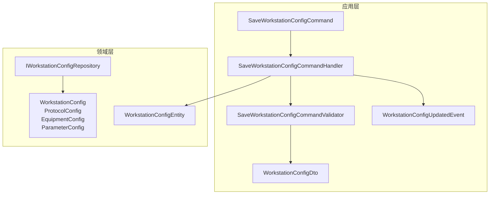
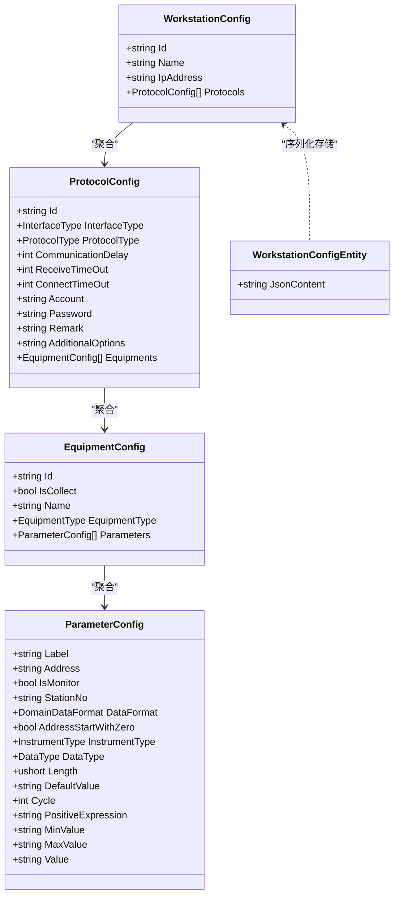
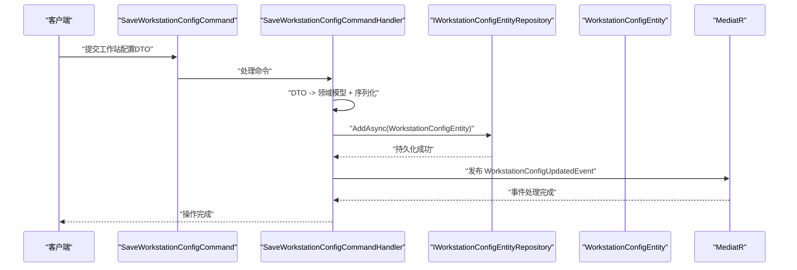
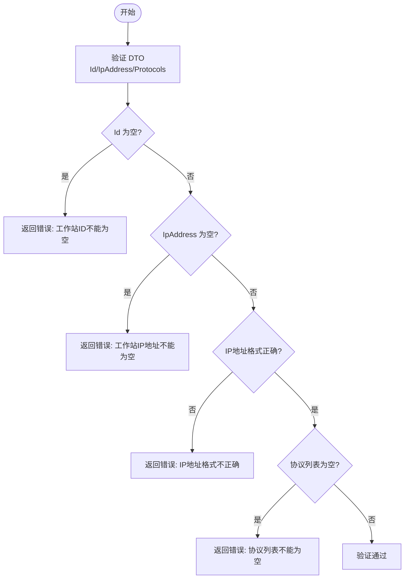
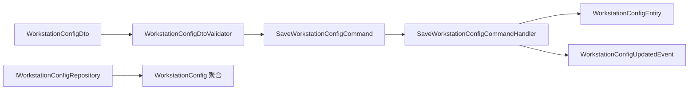

# 工作站配置模型

<cite>
**本文引用的文件**
- [WorkstationConfig.cs](file://IndustrialDataSolution/IndustrialDataProcessor.Domain/Workstation/Configs/WorkstationConfig.cs)
- [ProtocolConfig.cs](file://IndustrialDataSolution/IndustrialDataProcessor.Domain/Workstation/Configs/ProtocolConfig.cs)
- [EquipmentConfig.cs](file://IndustrialDataSolution/IndustrialDataProcessor.Domain/Workstation/Configs/EquipmentConfig.cs)
- [ParameterConfig.cs](file://IndustrialDataSolution/IndustrialDataProcessor.Domain/Workstation/Configs/ParameterConfig.cs)
- [WorkstationConfigEntity.cs](file://IndustrialDataSolution/IndustrialDataProcessor.Domain/Entities/WorkstationConfigEntity.cs)
- [IWorkstationConfigRepository.cs](file://IndustrialDataSolution/IndustrialDataProcessor.Domain/Repositories/IWorkstationConfigRepository.cs)
- [WorkstationConfigDto.cs](file://IndustrialDataSolution/IndustrialDataProcessor.Application/Dtos/WorkstationDto/WorkstationConfigDto.cs)
- [SaveWorkstationConfigCommand.cs](file://IndustrialDataSolution/IndustrialDataProcessor.Application/Commands/SaveWorkstationConfigCommand.cs)
- [SaveWorkstationConfigCommandHandler.cs](file://IndustrialDataSolution/IndustrialDataProcessor.Application/CommandHandlers/SaveWorkstationConfigCommandHandler.cs)
- [WorkstationConfigDtoValidator.cs](file://IndustrialDataSolution/IndustrialDataProcessor.Application/Validators/WorkstationConfigDtoValidator.cs)
- [SaveWorkstationConfigCommandValidator.cs](file://IndustrialDataSolution/IndustrialDataProcessor.Application/Validators/SaveWorkstationConfigCommandValidator.cs)
- [WorkstationConfigUpdatedEvent.cs](file://IndustrialDataSolution/IndustrialDataProcessor.Application/Events/WorkstationConfigUpdatedEvent.cs)
- [ProtocolType.cs](file://IndustrialDataSolution/IndustrialDataProcessor.Domain/Enums/ProtocolType.cs)
- [EquipmentType.cs](file://IndustrialDataSolution/IndustrialDataProcessor.Domain/Enums/EquipmentType.cs)
</cite>

## 目录
1. [引言](#引言)
2. [项目结构](#项目结构)
3. [核心组件](#核心组件)
4. [架构总览](#架构总览)
5. [详细组件分析](#详细组件分析)
6. [依赖分析](#依赖分析)
7. [性能考虑](#性能考虑)
8. [故障排查指南](#故障排查指南)
9. [结论](#结论)
10. [附录](#附录)

## 引言
本技术文档围绕“工作站配置模型”展开，系统性阐述 WorkstationConfig 领域模型的设计理念、业务语义与约束、聚合关系与管理机制，并结合 DDD 聚合根的边界划分说明其生命周期（创建、更新、删除）的业务规则。同时，文档给出与领域模型之间的关系与依赖，提供工业数据采集场景下的使用示例，以及数据验证与业务约束的实现细节。

## 项目结构
工作站配置模型位于领域层的 Workstation.Configs 命名空间中，采用纯领域对象设计，配合应用层 DTO、命令、验证器与事件，形成清晰的分层职责。持久化通过实体类 WorkstationConfigEntity 将序列化后的 JSON 存储于数据库，应用层负责将 DTO 映射为领域模型并持久化。

图表来源
- [SaveWorkstationConfigCommand.cs](file://IndustrialDataSolution/IndustrialDataProcessor.Application/Commands/SaveWorkstationConfigCommand.cs#L1-L9)
- [SaveWorkstationConfigCommandHandler.cs](file://IndustrialDataSolution/IndustrialDataProcessor.Application/CommandHandlers/SaveWorkstationConfigCommandHandler.cs#L1-L32)
- [SaveWorkstationConfigCommandValidator.cs](file://IndustrialDataSolution/IndustrialDataProcessor.Application/Validators/SaveWorkstationConfigCommandValidator.cs#L1-L13)
- [WorkstationConfigDto.cs](file://IndustrialDataSolution/IndustrialDataProcessor.Application/Dtos/WorkstationDto/WorkstationConfigDto.cs#L1-L27)
- [WorkstationConfig.cs](file://IndustrialDataSolution/IndustrialDataProcessor.Domain/Workstation/Configs/WorkstationConfig.cs#L1-L27)
- [ProtocolConfig.cs](file://IndustrialDataSolution/IndustrialDataProcessor.Domain/Workstation/Configs/ProtocolConfig.cs#L1-L64)
- [EquipmentConfig.cs](file://IndustrialDataSolution/IndustrialDataProcessor.Domain/Workstation/Configs/EquipmentConfig.cs#L1-L34)
- [ParameterConfig.cs](file://IndustrialDataSolution/IndustrialDataProcessor.Domain/Workstation/Configs/ParameterConfig.cs#L1-L84)
- [WorkstationConfigEntity.cs](file://IndustrialDataSolution/IndustrialDataProcessor.Domain/Entities/WorkstationConfigEntity.cs#L1-L7)
- [IWorkstationConfigRepository.cs](file://IndustrialDataSolution/IndustrialDataProcessor.Domain/Repositories/IWorkstationConfigRepository.cs#L1-L12)
- [WorkstationConfigUpdatedEvent.cs](file://IndustrialDataSolution/IndustrialDataProcessor.Application/Events/WorkstationConfigUpdatedEvent.cs#L1-L11)

章节来源
- [WorkstationConfig.cs](file://IndustrialDataSolution/IndustrialDataProcessor.Domain/Workstation/Configs/WorkstationConfig.cs#L1-L27)
- [WorkstationConfigDto.cs](file://IndustrialDataSolution/IndustrialDataProcessor.Application/Dtos/WorkstationDto/WorkstationConfigDto.cs#L1-L27)
- [SaveWorkstationConfigCommandHandler.cs](file://IndustrialDataSolution/IndustrialDataProcessor.Application/CommandHandlers/SaveWorkstationConfigCommandHandler.cs#L1-L32)

## 核心组件
- WorkstationConfig：工作站聚合根，包含 Id、Name、IpAddress 与协议列表 Protocols。
- ProtocolConfig：抽象协议配置基类，定义接口类型、协议类型、超时与账号密码等通用字段，以及设备列表 Equipments。
- EquipmentConfig：设备配置，包含设备标识、采集开关、类型与变量列表 Parameters。
- ParameterConfig：变量配置，包含标签、地址、监控标志、格式、长度、表达式、上下限等。
- WorkstationConfigEntity：持久化实体，以 JSON 字符串存储完整配置。
- IWorkstationConfigRepository：仓储接口，提供获取最新解析配置的能力。
- 应用层命令与处理器：SaveWorkstationConfigCommand 与 SaveWorkstationConfigCommandHandler，负责接收 DTO、映射为领域模型、序列化并持久化，同时发布配置更新事件。
- 验证器：WorkstationConfigDtoValidator 对工作站 ID、IP 地址与协议列表进行校验；SaveWorkstationConfigCommandValidator 组合并委派验证。
- 事件：WorkstationConfigUpdatedEvent 表示配置已更新，用于触发后续处理（如清理缓存）。

章节来源
- [WorkstationConfig.cs](file://IndustrialDataSolution/IndustrialDataProcessor.Domain/Workstation/Configs/WorkstationConfig.cs#L1-L27)
- [ProtocolConfig.cs](file://IndustrialDataSolution/IndustrialDataProcessor.Domain/Workstation/Configs/ProtocolConfig.cs#L1-L64)
- [EquipmentConfig.cs](file://IndustrialDataSolution/IndustrialDataProcessor.Domain/Workstation/Configs/EquipmentConfig.cs#L1-L34)
- [ParameterConfig.cs](file://IndustrialDataSolution/IndustrialDataProcessor.Domain/Workstation/Configs/ParameterConfig.cs#L1-L84)
- [WorkstationConfigEntity.cs](file://IndustrialDataSolution/IndustrialDataProcessor.Domain/Entities/WorkstationConfigEntity.cs#L1-L7)
- [IWorkstationConfigRepository.cs](file://IndustrialDataSolution/IndustrialDataProcessor.Domain/Repositories/IWorkstationConfigRepository.cs#L1-L12)
- [SaveWorkstationConfigCommand.cs](file://IndustrialDataSolution/IndustrialDataProcessor.Application/Commands/SaveWorkstationConfigCommand.cs#L1-L9)
- [SaveWorkstationConfigCommandHandler.cs](file://IndustrialDataSolution/IndustrialDataProcessor.Application/CommandHandlers/SaveWorkstationConfigCommandHandler.cs#L1-L32)
- [WorkstationConfigDtoValidator.cs](file://IndustrialDataSolution/IndustrialDataProcessor.Application/Validators/WorkstationConfigDtoValidator.cs#L1-L36)
- [SaveWorkstationConfigCommandValidator.cs](file://IndustrialDataSolution/IndustrialDataProcessor.Application/Validators/SaveWorkstationConfigCommandValidator.cs#L1-L13)
- [WorkstationConfigUpdatedEvent.cs](file://IndustrialDataSolution/IndustrialDataProcessor.Application/Events/WorkstationConfigUpdatedEvent.cs#L1-L11)

## 架构总览
工作站配置模型遵循 DDD 分层与聚合设计：
- 领域层：WorkstationConfig 作为聚合根，聚合 ProtocolConfig、EquipmentConfig、ParameterConfig，形成完整的采集配置树。
- 应用层：通过命令与处理器协调 DTO 到领域模型的转换、验证与持久化，并发布领域事件。
- 基础设施层：仓储接口定义访问契约，实体 WorkstationConfigEntity 以 JSON 形式落库，便于跨版本兼容与扩展。

图表来源
- [WorkstationConfig.cs](file://IndustrialDataSolution/IndustrialDataProcessor.Domain/Workstation/Configs/WorkstationConfig.cs#L1-L27)
- [ProtocolConfig.cs](file://IndustrialDataSolution/IndustrialDataProcessor.Domain/Workstation/Configs/ProtocolConfig.cs#L1-L64)
- [EquipmentConfig.cs](file://IndustrialDataSolution/IndustrialDataProcessor.Domain/Workstation/Configs/EquipmentConfig.cs#L1-L34)
- [ParameterConfig.cs](file://IndustrialDataSolution/IndustrialDataProcessor.Domain/Workstation/Configs/ParameterConfig.cs#L1-L84)
- [WorkstationConfigEntity.cs](file://IndustrialDataSolution/IndustrialDataProcessor.Domain/Entities/WorkstationConfigEntity.cs#L1-L7)

## 详细组件分析

### WorkstationConfig 聚合根与业务语义
- Id：工作站唯一标识，必须存在且不可为空。
- Name：工作站名称，可空但建议填写以便运维识别。
- IpAddress：工作站网络地址，必须存在且必须为 IPv4 地址格式。
- Protocols：协议配置列表，必须存在且至少包含一个协议项；每个协议项包含接口类型、协议类型、超时参数、账号密码、备注及设备列表等。

聚合边界与一致性：
- WorkstationConfig 作为聚合根，负责维护工作站级的一致性与完整性。
- 协议列表的增删改应在聚合内保持一致性，避免出现孤立的协议或设备配置。

章节来源
- [WorkstationConfig.cs](file://IndustrialDataSolution/IndustrialDataProcessor.Domain/Workstation/Configs/WorkstationConfig.cs#L1-L27)
- [WorkstationConfigDtoValidator.cs](file://IndustrialDataSolution/IndustrialDataProcessor.Application/Validators/WorkstationConfigDtoValidator.cs#L1-L36)

### 协议配置 ProtocolConfig
- Id：协议唯一标识，必须存在。
- InterfaceType：接口类型（LAN/COM/API/DATABASE 等），由枚举定义，协议类型需与之匹配。
- ProtocolType：具体协议类型，如 ModbusTcpNet、IEC104、OpcUa 等，枚举中包含丰富的协议族与参数要求标记。
- 超时与通信参数：CommunicationDelay、ReceiveTimeOut、ConnectTimeOut 提供默认值，便于快速部署。
- 认证信息：Account、Password 支持可空配置，满足不同协议的安全需求。
- 备注与附加选项：Remark、AdditionalOptions 支持扩展字段。
- Equipments：设备列表，必须存在，至少包含一个设备。

章节来源
- [ProtocolConfig.cs](file://IndustrialDataSolution/IndustrialDataProcessor.Domain/Workstation/Configs/ProtocolConfig.cs#L1-L64)
- [ProtocolType.cs](file://IndustrialDataSolution/IndustrialDataProcessor.Domain/Enums/ProtocolType.cs#L1-L231)

### 设备配置 EquipmentConfig
- Id：设备唯一标识，必须存在。
- IsCollect：是否参与采集，必须存在。
- Name：设备名称，可空。
- EquipmentType：设备类型枚举（设备/仪表），默认为设备。
- Parameters：变量列表，可空但通常应包含至少一个变量。

章节来源
- [EquipmentConfig.cs](file://IndustrialDataSolution/IndustrialDataProcessor.Domain/Workstation/Configs/EquipmentConfig.cs#L1-L34)
- [EquipmentType.cs](file://IndustrialDataSolution/IndustrialDataProcessor.Domain/Enums/EquipmentType.cs#L1-L22)

### 变量配置 ParameterConfig
- Label：变量标签，必须存在。
- Address：地址，支持虚拟点固定地址 VirtualPoint，必须存在。
- IsMonitor：是否监控，默认 false。
- StationNo、DataFormat、AddressStartWithZero、InstrumentType：与协议相关的可选参数，按协议类型要求而定。
- DataType：数据类型，按协议族要求设置。
- Length、DefaultValue、Cycle：长度与默认值、采集周期等。
- PositiveExpression、MinValue、MaxValue：表达式与上下限，用于后处理与告警。
- Value：写入用途的值，可空。

章节来源
- [ParameterConfig.cs](file://IndustrialDataSolution/IndustrialDataProcessor.Domain/Workstation/Configs/ParameterConfig.cs#L1-L84)

### 持久化与仓储
- WorkstationConfigEntity：仅包含 JsonContent 字段，用于存储序列化后的完整配置，确保跨版本兼容与扩展。
- IWorkstationConfigRepository：提供获取最新解析配置的能力，应用层通过该接口读取最新配置并解析为领域模型。

章节来源
- [WorkstationConfigEntity.cs](file://IndustrialDataSolution/IndustrialDataProcessor.Domain/Entities/WorkstationConfigEntity.cs#L1-L7)
- [IWorkstationConfigRepository.cs](file://IndustrialDataSolution/IndustrialDataProcessor.Domain/Repositories/IWorkstationConfigRepository.cs#L1-L12)

### 生命周期与业务规则
- 创建：应用层接收 WorkstationConfigDto，通过 SaveWorkstationConfigCommandValidator 与 WorkstationConfigDtoValidator 完成数据校验，随后由 SaveWorkstationConfigCommandHandler 将 DTO 映射为领域模型，序列化为 JSON 并持久化至 WorkstationConfigEntity，最后发布 WorkstationConfigUpdatedEvent。
- 更新：当前实现通过覆盖最新配置的方式实现“更新”，即新增一条包含最新配置的实体记录，仓储提供获取最新解析配置的能力。
- 删除：未发现显式的删除操作；若需删除，可在应用层增加删除命令与处理器，并在仓储中实现删除逻辑。

图表来源
- [SaveWorkstationConfigCommand.cs](file://IndustrialDataSolution/IndustrialDataProcessor.Application/Commands/SaveWorkstationConfigCommand.cs#L1-L9)
- [SaveWorkstationConfigCommandHandler.cs](file://IndustrialDataSolution/IndustrialDataProcessor.Application/CommandHandlers/SaveWorkstationConfigCommandHandler.cs#L1-L32)
- [WorkstationConfigUpdatedEvent.cs](file://IndustrialDataSolution/IndustrialDataProcessor.Application/Events/WorkstationConfigUpdatedEvent.cs#L1-L11)

章节来源
- [SaveWorkstationConfigCommandHandler.cs](file://IndustrialDataSolution/IndustrialDataProcessor.Application/CommandHandlers/SaveWorkstationConfigCommandHandler.cs#L1-L32)
- [WorkstationConfigUpdatedEvent.cs](file://IndustrialDataSolution/IndustrialDataProcessor.Application/Events/WorkstationConfigUpdatedEvent.cs#L1-L11)

### 数据验证与业务约束
- WorkstationConfigDtoValidator：
  - Id 不可为空。
  - IpAddress 不可为空且必须为 IPv4 地址格式。
  - Protocols 不可为空，逐个委托给 ProtocolConfigDtoValidator 进行验证。
- SaveWorkstationConfigCommandValidator：
  - 将验证责任委派给 WorkstationConfigDtoValidator，确保命令级别的输入一致性。

图表来源
- [WorkstationConfigDtoValidator.cs](file://IndustrialDataSolution/IndustrialDataProcessor.Application/Validators/WorkstationConfigDtoValidator.cs#L1-L36)

章节来源
- [WorkstationConfigDtoValidator.cs](file://IndustrialDataSolution/IndustrialDataProcessor.Application/Validators/WorkstationConfigDtoValidator.cs#L1-L36)
- [SaveWorkstationConfigCommandValidator.cs](file://IndustrialDataSolution/IndustrialDataProcessor.Application/Validators/SaveWorkstationConfigCommandValidator.cs#L1-L13)

### 与其他领域模型的关系与依赖
- 协议类型与接口类型：ProtocolType 通过特性标注 InterfaceType 与参数要求，确保协议配置在领域层具备强约束。
- 设备类型：EquipmentType 区分设备与仪表，影响变量解析与展示策略。
- 事件驱动：WorkstationConfigUpdatedEvent 用于触发下游缓存清理等副作用，体现事件驱动的解耦设计。

章节来源
- [ProtocolType.cs](file://IndustrialDataSolution/IndustrialDataProcessor.Domain/Enums/ProtocolType.cs#L1-L231)
- [EquipmentType.cs](file://IndustrialDataSolution/IndustrialDataProcessor.Domain/Enums/EquipmentType.cs#L1-L22)
- [WorkstationConfigUpdatedEvent.cs](file://IndustrialDataSolution/IndustrialDataProcessor.Application/Events/WorkstationConfigUpdatedEvent.cs#L1-L11)

### 具体业务场景示例
- 工业数据采集系统中的某条产线需要接入多台 PLC 与仪表，每台设备下挂载多个变量点位。管理员通过工作站配置界面维护：
  - 工作站标识与 IP 地址，确保网络可达。
  - 协议配置：选择 ModbusTcpNet 或 IEC104 等协议，设置通信超时、账号密码与设备列表。
  - 设备配置：为每台设备设置采集开关、类型与变量列表。
  - 变量配置：为每个点位设置标签、地址、监控标志、数据类型、长度、表达式与上下限。
- 应用层接收配置后，通过命令处理器持久化为 JSON 实体，并发布配置更新事件，触发缓存刷新与服务重启，确保新配置生效。

## 依赖分析
- 领域层内部依赖：WorkstationConfig 聚合根依赖 ProtocolConfig、EquipmentConfig、ParameterConfig；枚举类型为协议与设备提供约束。
- 应用层依赖：命令处理器依赖仓储接口与事件总线；验证器依赖命令与 DTO。
- 基础设施依赖：实体以 JSON 存储，仓储接口定义访问契约，便于替换实现。

图表来源
- [WorkstationConfigDto.cs](file://IndustrialDataSolution/IndustrialDataProcessor.Application/Dtos/WorkstationDto/WorkstationConfigDto.cs#L1-L27)
- [WorkstationConfigDtoValidator.cs](file://IndustrialDataSolution/IndustrialDataProcessor.Application/Validators/WorkstationConfigDtoValidator.cs#L1-L36)
- [SaveWorkstationConfigCommand.cs](file://IndustrialDataSolution/IndustrialDataProcessor.Application/Commands/SaveWorkstationConfigCommand.cs#L1-L9)
- [SaveWorkstationConfigCommandHandler.cs](file://IndustrialDataSolution/IndustrialDataProcessor.Application/CommandHandlers/SaveWorkstationConfigCommandHandler.cs#L1-L32)
- [WorkstationConfigEntity.cs](file://IndustrialDataSolution/IndustrialDataProcessor.Domain/Entities/WorkstationConfigEntity.cs#L1-L7)
- [IWorkstationConfigRepository.cs](file://IndustrialDataSolution/IndustrialDataProcessor.Domain/Repositories/IWorkstationConfigRepository.cs#L1-L12)

章节来源
- [SaveWorkstationConfigCommandHandler.cs](file://IndustrialDataSolution/IndustrialDataProcessor.Application/CommandHandlers/SaveWorkstationConfigCommandHandler.cs#L1-L32)
- [IWorkstationConfigRepository.cs](file://IndustrialDataSolution/IndustrialDataProcessor.Domain/Repositories/IWorkstationConfigRepository.cs#L1-L12)

## 性能考虑
- JSON 序列化/反序列化：以 JSON 存储完整配置，便于跨版本兼容与快速读取，但需注意大型配置带来的序列化开销。
- 事件驱动：通过发布配置更新事件触发缓存清理等副作用，避免同步阻塞主流程。
- 超时参数：合理设置通信超时与连接超时，避免长时间阻塞导致系统资源浪费。

## 故障排查指南
- 输入校验失败：
  - 工作站 ID 为空：检查前端表单与命令构造。
  - IP 地址为空或格式不正确：确认网络配置与验证逻辑。
  - 协议列表为空：确保至少包含一个协议配置。
- 持久化失败：
  - 检查仓储实现与数据库连接状态。
  - 确认 JSON 序列化过程无异常。
- 事件未触发：
  - 检查 MediatR 注册与事件发布调用链。

章节来源
- [WorkstationConfigDtoValidator.cs](file://IndustrialDataSolution/IndustrialDataProcessor.Application/Validators/WorkstationConfigDtoValidator.cs#L1-L36)
- [SaveWorkstationConfigCommandHandler.cs](file://IndustrialDataSolution/IndustrialDataProcessor.Application/CommandHandlers/SaveWorkstationConfigCommandHandler.cs#L1-L32)

## 结论
工作站配置模型以 WorkstationConfig 为核心聚合根，围绕协议、设备与变量三层结构构建完整的采集配置体系。通过严格的 DTO 验证、命令处理器与事件发布，实现了配置的可靠创建与更新。JSON 持久化策略兼顾了扩展性与兼容性。未来可在应用层补充删除与变更历史能力，进一步完善生命周期管理。

## 附录
- 协议类型与接口类型映射：参考 ProtocolType 枚举及其特性标注，确保协议配置与接口类型一致。
- 设备类型：EquipmentType 提供设备与仪表区分，影响变量解析与展示策略。

章节来源
- [ProtocolType.cs](file://IndustrialDataSolution/IndustrialDataProcessor.Domain/Enums/ProtocolType.cs#L1-L231)
- [EquipmentType.cs](file://IndustrialDataSolution/IndustrialDataProcessor.Domain/Enums/EquipmentType.cs#L1-L22)