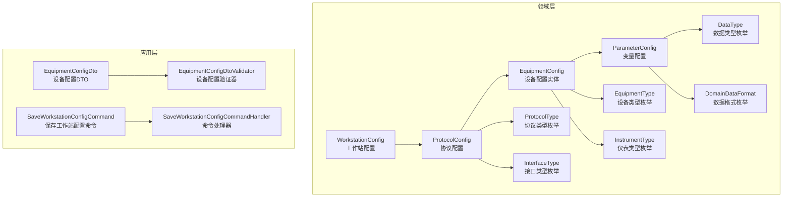
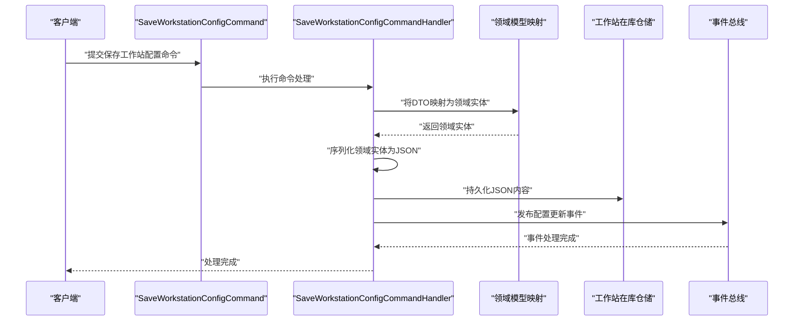
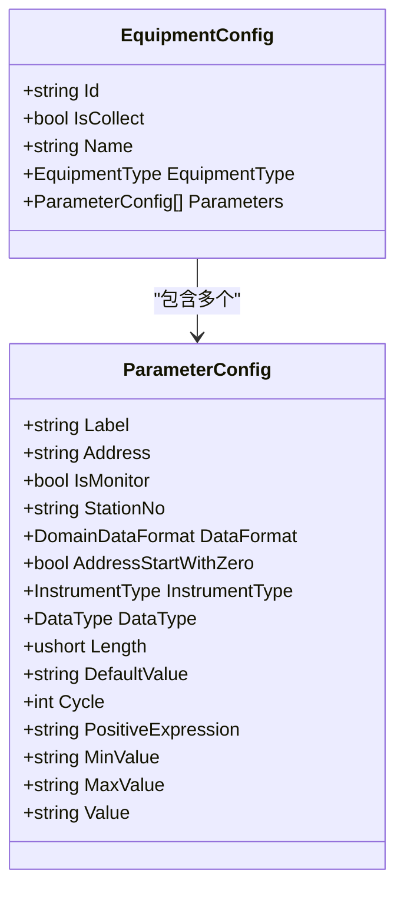
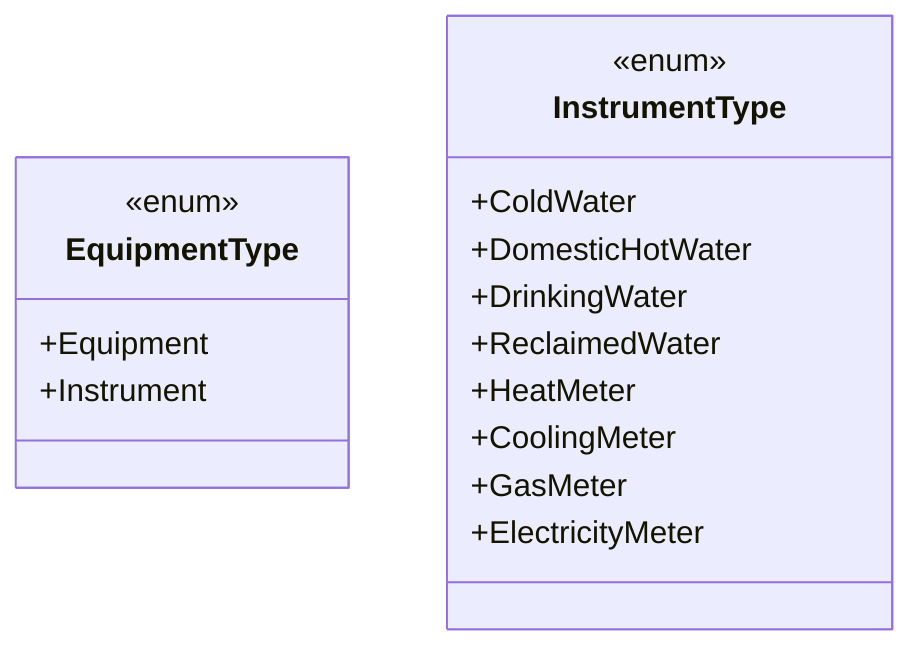
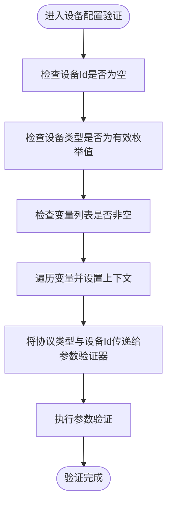
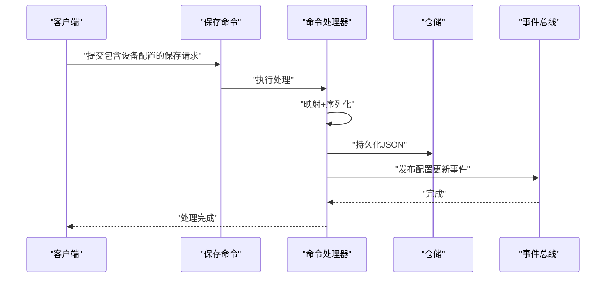
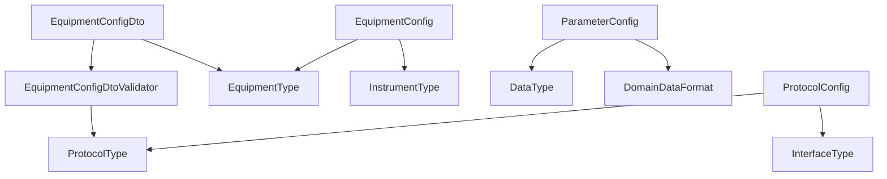

# 设备配置模型

<cite>
**本文引用的文件**
- [EquipmentConfig.cs](file://IndustrialDataSolution/IndustrialDataProcessor.Domain/Workstation/Configs/EquipmentConfig.cs)
- [EquipmentType.cs](file://IndustrialDataProcessor.Domain/Enums/EquipmentType.cs)
- [InstrumentType.cs](file://IndustrialDataProcessor.Domain/Enums/InstrumentType.cs)
- [WorkstationConfig.cs](file://IndustrialDataProcessor.Domain/Workstation/Configs/WorkstationConfig.cs)
- [EquipmentConfigDto.cs](file://IndustrialDataProcessor.Application/Dtos/WorkstationDto/EquipmentConfigDto.cs)
- [ParameterConfig.cs](file://IndustrialDataProcessor.Domain/Workstation/Configs/ParameterConfig.cs)
- [EquipmentConfigDtoValidator.cs](file://IndustrialDataProcessor.Application/Validators/EquipmentConfigDtoValidator.cs)
- [ProtocolConfig.cs](file://IndustrialDataProcessor.Domain/Workstation/Configs/ProtocolConfig.cs)
- [SaveWorkstationConfigCommand.cs](file://IndustrialDataProcessor.Application/Commands/SaveWorkstationConfigCommand.cs)
- [SaveWorkstationConfigCommandHandler.cs](file://IndustrialDataProcessor.Application/CommandHandlers/SaveWorkstationConfigCommandHandler.cs)
- [DataType.cs](file://IndustrialDataProcessor.Domain/Enums/DataType.cs)
- [DomainDataFormat.cs](file://IndustrialDataProcessor.Domain/Enums/DomainDataFormat.cs)
- [ProtocolType.cs](file://IndustrialDataProcessor.Domain/Enums/ProtocolType.cs)
- [InterfaceType.cs](file://IndustrialDataProcessor.Domain/Enums/InterfaceType.cs)
- [BaudRateType.cs](file://IndustrialDataProcessor.Domain/Enums/BaudRateType.cs)
- [DataBitsType.cs](file://IndustrialDataProcessor.Domain/Enums/DataBitsType.cs)
- [DomainParity.cs](file://IndustrialDataProcessor.Domain/Enums/DomainParity.cs)
</cite>

## 目录
1. [引言](#引言)
2. [项目结构](#项目结构)
3. [核心组件](#核心组件)
4. [架构总览](#架构总览)
5. [详细组件分析](#详细组件分析)
6. [依赖分析](#依赖分析)
7. [性能考虑](#性能考虑)
8. [故障排查指南](#故障排查指南)
9. [结论](#结论)
10. [附录](#附录)

## 引言
本技术文档围绕“设备配置模型”展开，系统性阐述设备配置在工业数据采集系统中的设计原理、业务价值与实现细节。重点覆盖以下方面：
- EquipmentConfig 实体的设计与职责边界
- 设备类型枚举（EquipmentType、InstrumentType）的分类体系与使用场景
- 设备配置与工作站配置的关联关系与一致性保障
- 设备配置的验证规则与业务约束
- 设备配置在数据采集流程中的作用与影响
- 设备配置的创建、修改、删除业务流程
- 设备类型选择的最佳实践与常见配置模式
- 不同工业场景下的应用示例

## 项目结构
本项目采用分层与领域驱动设计（DDD）组织代码，设备配置模型主要分布在领域层与应用层：
- 领域层：定义设备配置实体、协议配置、参数配置以及各类枚举
- 应用层：提供 DTO、验证器、命令处理器与映射器，负责业务编排与持久化

图表来源
- [EquipmentConfig.cs](file://IndustrialDataProcessor.Domain/Workstation/Configs/EquipmentConfig.cs#L1-L34)
- [ParameterConfig.cs](file://IndustrialDataProcessor.Domain/Workstation/Configs/ParameterConfig.cs#L1-L84)
- [WorkstationConfig.cs](file://IndustrialDataProcessor.Domain/Workstation/Configs/WorkstationConfig.cs#L1-L27)
- [ProtocolConfig.cs](file://IndustrialDataProcessor.Domain/Workstation/Configs/ProtocolConfig.cs#L1-L64)
- [EquipmentType.cs](file://IndustrialDataProcessor.Domain/Enums/EquipmentType.cs#L1-L22)
- [InstrumentType.cs](file://IndustrialDataProcessor.Domain/Enums/InstrumentType.cs#L1-L58)
- [DataType.cs](file://IndustrialDataProcessor.Domain/Enums/DataType.cs#L1-L69)
- [DomainDataFormat.cs](file://IndustrialDataProcessor.Domain/Enums/DomainDataFormat.cs#L1-L9)
- [ProtocolType.cs](file://IndustrialDataProcessor.Domain/Enums/ProtocolType.cs#L1-L231)
- [InterfaceType.cs](file://IndustrialDataProcessor.Domain/Enums/InterfaceType.cs#L1-L32)
- [EquipmentConfigDto.cs](file://IndustrialDataProcessor.Application/Dtos/WorkstationDto/EquipmentConfigDto.cs#L1-L39)
- [EquipmentConfigDtoValidator.cs](file://IndustrialDataProcessor.Application/Validators/EquipmentConfigDtoValidator.cs#L1-L43)
- [SaveWorkstationConfigCommand.cs](file://IndustrialDataProcessor.Application/Commands/SaveWorkstationConfigCommand.cs#L1-L9)
- [SaveWorkstationConfigCommandHandler.cs](file://IndustrialDataProcessor.Application/CommandHandlers/SaveWorkstationConfigCommandHandler.cs#L1-L32)

章节来源
- [EquipmentConfig.cs](file://IndustrialDataProcessor.Domain/Workstation/Configs/EquipmentConfig.cs#L1-L34)
- [EquipmentConfigDto.cs](file://IndustrialDataProcessor.Application/Dtos/WorkstationDto/EquipmentConfigDto.cs#L1-L39)

## 核心组件
- 设备配置实体（EquipmentConfig）
  - 关键属性：设备标识（Id）、是否采集（IsCollect）、设备名称（Name）、设备类型（EquipmentType）、变量列表（Parameters）
  - 设计要点：以设备为中心的聚合根，承载采集开关、命名与类型；变量列表作为采集点清单
- 工作站配置（WorkstationConfig）
  - 关键属性：工作站标识（Id）、名称（Name）、IP地址（IpAddress）、协议列表（Protocols）
  - 设计要点：工作站在网络层面的统一入口，聚合多个协议配置
- 协议配置（ProtocolConfig）
  - 关键属性：协议标识（Id）、接口类型（InterfaceType）、协议类型（ProtocolType）、超时与延时参数、账号密码、备注、可选参数、设备列表（Equipments）
  - 设计要点：抽象协议配置，约束通信参数与设备绑定关系
- 变量配置（ParameterConfig）
  - 关键属性：标签（Label）、地址（Address）、是否监控（IsMonitor）、站号（StationNo）、数据格式（DataFormat）、起始地址约定（AddressStartWithZero）、仪表类型（InstrumentType）、数据类型（DataType）、长度（Length）、默认值（DefaultValue）、采集周期（Cycle）、正表达式（PositiveExpression）、最小/最大值（MinValue/MaxValue）、写入值（Value）
  - 设计要点：面向采集点的细粒度配置，支持表达式与范围约束

章节来源
- [EquipmentConfig.cs](file://IndustrialDataProcessor.Domain/Workstation/Configs/EquipmentConfig.cs#L1-L34)
- [WorkstationConfig.cs](file://IndustrialDataProcessor.Domain/Workstation/Configs/WorkstationConfig.cs#L1-L27)
- [ProtocolConfig.cs](file://IndustrialDataProcessor.Domain/Workstation/Configs/ProtocolConfig.cs#L1-L64)
- [ParameterConfig.cs](file://IndustrialDataProcessor.Domain/Workstation/Configs/ParameterConfig.cs#L1-L84)

## 架构总览
设备配置模型贯穿领域层与应用层，通过命令处理器完成序列化、持久化与事件发布，确保配置变更的一致性与可观测性。

图表来源
- [SaveWorkstationConfigCommand.cs](file://IndustrialDataProcessor.Application/Commands/SaveWorkstationConfigCommand.cs#L1-L9)
- [SaveWorkstationConfigCommandHandler.cs](file://IndustrialDataProcessor.Application/CommandHandlers/SaveWorkstationConfigCommandHandler.cs#L1-L32)

章节来源
- [SaveWorkstationConfigCommand.cs](file://IndustrialDataProcessor.Application/Commands/SaveWorkstationConfigCommand.cs#L1-L9)
- [SaveWorkstationConfigCommandHandler.cs](file://IndustrialDataProcessor.Application/CommandHandlers/SaveWorkstationConfigCommandHandler.cs#L1-L32)

## 详细组件分析

### 设备配置实体（EquipmentConfig）
- 设计原则
  - 聚合内高内聚：设备标识、类型、采集开关与变量列表紧密耦合
  - 明确边界：设备配置不直接管理通信参数，通信参数由协议配置承担
- 业务价值
  - 统一设备维度的采集策略与命名规范
  - 支持按设备进行启停与批量配置管理
- 关键关系
  - 与变量配置（ParameterConfig）一对多
  - 与协议配置（ProtocolConfig）间接关联（通过协议配置的设备列表）

图表来源
- [EquipmentConfig.cs](file://IndustrialDataProcessor.Domain/Workstation/Configs/EquipmentConfig.cs#L1-L34)
- [ParameterConfig.cs](file://IndustrialDataProcessor.Domain/Workstation/Configs/ParameterConfig.cs#L1-L84)

章节来源
- [EquipmentConfig.cs](file://IndustrialDataProcessor.Domain/Workstation/Configs/EquipmentConfig.cs#L1-L34)
- [ParameterConfig.cs](file://IndustrialDataProcessor.Domain/Workstation/Configs/ParameterConfig.cs#L1-L84)

### 设备类型枚举（EquipmentType、InstrumentType）
- EquipmentType
  - 分类：设备（Equipment）、仪表（Instrument）
  - 使用场景：区分通用设备与计量类仪表，用于后续协议适配与数据处理策略差异化
- InstrumentType
  - 分类：水表类（冷水水表、生活热水水表、直饮水水表、中水水表）、热量表类（热量、冷量）、燃气表、电度表
  - 使用场景：针对特定仪表协议（如 CJT1882004）进行参数校验与解析策略定制

图表来源
- [EquipmentType.cs](file://IndustrialDataProcessor.Domain/Enums/EquipmentType.cs#L1-L22)
- [InstrumentType.cs](file://IndustrialDataProcessor.Domain/Enums/InstrumentType.cs#L1-L58)

章节来源
- [EquipmentType.cs](file://IndustrialDataProcessor.Domain/Enums/EquipmentType.cs#L1-L22)
- [InstrumentType.cs](file://IndustrialDataProcessor.Domain/Enums/InstrumentType.cs#L1-L58)

### 设备配置与工作站配置的关联关系与一致性
- 关联关系
  - 协议配置（ProtocolConfig）聚合设备配置（EquipmentConfig），形成“协议-设备-变量”的三层聚合
  - 工作站配置（WorkstationConfig）聚合协议配置（ProtocolConfig），形成“工作站-协议-设备-变量”的完整采集链路
- 一致性保障
  - 命令处理器在保存前将 DTO 映射为领域实体并序列化为 JSON，统一存储，避免中间态不一致
  - 保存完成后发布“配置更新事件”，触发缓存清理与下游同步

图表来源
- [WorkstationConfig.cs](file://IndustrialDataProcessor.Domain/Workstation/Configs/WorkstationConfig.cs#L1-L27)
- [ProtocolConfig.cs](file://IndustrialDataProcessor.Domain/Workstation/Configs/ProtocolConfig.cs#L1-L64)
- [EquipmentConfig.cs](file://IndustrialDataProcessor.Domain/Workstation/Configs/EquipmentConfig.cs#L1-L34)
- [ParameterConfig.cs](file://IndustrialDataProcessor.Domain/Workstation/Configs/ParameterConfig.cs#L1-L84)

章节来源
- [WorkstationConfig.cs](file://IndustrialDataProcessor.Domain/Workstation/Configs/WorkstationConfig.cs#L1-L27)
- [ProtocolConfig.cs](file://IndustrialDataProcessor.Domain/Workstation/Configs/ProtocolConfig.cs#L1-L64)
- [SaveWorkstationConfigCommandHandler.cs](file://IndustrialDataProcessor.Application/CommandHandlers/SaveWorkstationConfigCommandHandler.cs#L1-L32)

### 设备配置验证规则与业务约束
- 设备级验证
  - 设备标识（Id）必填
  - 设备类型（EquipmentType）必须为有效枚举值
  - 变量列表（Parameters）不可为 null 且至少包含一项
- 参数级验证（通过参数验证器）
  - 每个变量需满足其自身的数据类型、地址、格式等约束
  - 在参数验证前，自动将上级设备的协议类型与设备 Id 向下传递，确保参数与设备/协议上下文一致
- 协议参数要求（基于协议类型）
  - 不同协议类型对站号、数据格式、数据类型、地址起始约定、仪表类型等有不同的强制要求
  - 通过协议类型特性与验证器共同保证参数合法性

图表来源
- [EquipmentConfigDtoValidator.cs](file://IndustrialDataProcessor.Application/Validators/EquipmentConfigDtoValidator.cs#L1-L43)
- [EquipmentConfigDto.cs](file://IndustrialDataProcessor.Application/Dtos/WorkstationDto/EquipmentConfigDto.cs#L1-L39)
- [ProtocolType.cs](file://IndustrialDataProcessor.Domain/Enums/ProtocolType.cs#L1-L231)

章节来源
- [EquipmentConfigDtoValidator.cs](file://IndustrialDataProcessor.Application/Validators/EquipmentConfigDtoValidator.cs#L1-L43)
- [EquipmentConfigDto.cs](file://IndustrialDataProcessor.Application/Dtos/WorkstationDto/EquipmentConfigDto.cs#L1-L39)
- [ProtocolType.cs](file://IndustrialDataProcessor.Domain/Enums/ProtocolType.cs#L1-L231)

### 设备配置在数据采集流程中的作用与影响
- 采集策略控制
  - 通过设备的采集开关（IsCollect）决定是否参与采集任务
- 采集点清单
  - 变量配置（ParameterConfig）定义采集点的地址、格式、表达式、周期等，直接影响采集结果与计算
- 协议适配
  - 协议类型（ProtocolType）与接口类型（InterfaceType）决定通信方式与参数要求，进而影响采集通道的建立与稳定性
- 数据质量
  - 数据类型（DataType）、数据格式（DomainDataFormat）、最小/最大值（MinValue/MaxValue）等约束保障数据合理性与一致性

章节来源
- [EquipmentConfig.cs](file://IndustrialDataProcessor.Domain/Workstation/Configs/EquipmentConfig.cs#L1-L34)
- [ParameterConfig.cs](file://IndustrialDataProcessor.Domain/Workstation/Configs/ParameterConfig.cs#L1-L84)
- [ProtocolConfig.cs](file://IndustrialDataProcessor.Domain/Workstation/Configs/ProtocolConfig.cs#L1-L64)
- [DataType.cs](file://IndustrialDataProcessor.Domain/Enums/DataType.cs#L1-L69)
- [DomainDataFormat.cs](file://IndustrialDataProcessor.Domain/Enums/DomainDataFormat.cs#L1-L9)

### 设备配置的业务流程（创建、修改、删除）
- 创建流程
  - 客户端提交保存工作站配置命令（包含设备配置与协议配置）
  - 命令处理器将 DTO 映射为领域实体，序列化为 JSON 并持久化
  - 发布配置更新事件，触发缓存清理与下游同步
- 修改流程
  - 重复创建流程，新版本覆盖旧版本 JSON 存储
- 删除流程
  - 通过命令处理器将空或移除对应设备的 JSON 内容进行持久化，发布更新事件
  - 清理相关缓存与任务调度

图表来源
- [SaveWorkstationConfigCommand.cs](file://IndustrialDataProcessor.Application/Commands/SaveWorkstationConfigCommand.cs#L1-L9)
- [SaveWorkstationConfigCommandHandler.cs](file://IndustrialDataProcessor.Application/CommandHandlers/SaveWorkstationConfigCommandHandler.cs#L1-L32)

章节来源
- [SaveWorkstationConfigCommand.cs](file://IndustrialDataProcessor.Application/Commands/SaveWorkstationConfigCommand.cs#L1-L9)
- [SaveWorkstationConfigCommandHandler.cs](file://IndustrialDataProcessor.Application/CommandHandlers/SaveWorkstationConfigCommandHandler.cs#L1-L32)

### 设备类型选择的最佳实践与常见配置模式
- 设备类型（EquipmentType）
  - 通用设备：适用于常规PLC、传感器等，优先选择与设备匹配的协议类型
  - 仪表设备：优先选择对应仪表类型的协议与参数校验策略
- 仪表类型（InstrumentType）
  - 水表类：关注地址起始约定与数据格式，必要时启用仪表类型以启用特定解析
  - 热量/冷量表：结合表达式与单位换算，确保采集值可读且符合业务口径
  - 燃气/电度表：注意周期与精度，避免频繁采集导致通信压力
- 常见配置模式
  - 批量设备：通过同一协议类型与相近参数模板，减少配置复杂度
  - 分组采集：按区域/楼层/产线划分协议与设备，提升任务调度效率
  - 表达式与阈值：为关键变量配置表达式与上下限，提前发现异常

章节来源
- [EquipmentType.cs](file://IndustrialDataProcessor.Domain/Enums/EquipmentType.cs#L1-L22)
- [InstrumentType.cs](file://IndustrialDataProcessor.Domain/Enums/InstrumentType.cs#L1-L58)
- [ProtocolType.cs](file://IndustrialDataProcessor.Domain/Enums/ProtocolType.cs#L1-L231)

### 不同工业场景下的应用示例
- 智慧水务
  - 仪表类型：水表类（冷水水表、生活热水水表、直饮水水表、中水水表）
  - 配置要点：明确地址起始约定与数据格式；根据协议类型启用仪表类型参数校验
- 能源管理
  - 仪表类型：热量表、冷量表、燃气表、电度表
  - 配置要点：设置合理采集周期；为关键变量配置表达式与上下限
- 工业自动化
  - 设备类型：设备（通用PLC/传感器）
  - 配置要点：根据协议类型（如 ModbusTcpNet、Siemens 系列）设置站号与数据格式；为变量配置监控与表达式

章节来源
- [InstrumentType.cs](file://IndustrialDataProcessor.Domain/Enums/InstrumentType.cs#L1-L58)
- [ProtocolType.cs](file://IndustrialDataProcessor.Domain/Enums/ProtocolType.cs#L1-L231)

## 依赖分析
- 枚举依赖
  - 设备配置依赖设备类型与仪表类型
  - 变量配置依赖数据类型与数据格式
  - 协议配置依赖协议类型与接口类型
- 层间依赖
  - 应用层 DTO 与验证器依赖领域层枚举与配置模型
  - 命令处理器依赖仓储与事件总线，完成持久化与通知

图表来源
- [EquipmentConfigDto.cs](file://IndustrialDataProcessor.Application/Dtos/WorkstationDto/EquipmentConfigDto.cs#L1-L39)
- [EquipmentConfigDtoValidator.cs](file://IndustrialDataProcessor.Application/Validators/EquipmentConfigDtoValidator.cs#L1-L43)
- [EquipmentConfig.cs](file://IndustrialDataProcessor.Domain/Workstation/Configs/EquipmentConfig.cs#L1-L34)
- [ParameterConfig.cs](file://IndustrialDataProcessor.Domain/Workstation/Configs/ParameterConfig.cs#L1-L84)
- [ProtocolConfig.cs](file://IndustrialDataProcessor.Domain/Workstation/Configs/ProtocolConfig.cs#L1-L64)
- [ProtocolType.cs](file://IndustrialDataProcessor.Domain/Enums/ProtocolType.cs#L1-L231)
- [InterfaceType.cs](file://IndustrialDataProcessor.Domain/Enums/InterfaceType.cs#L1-L32)
- [EquipmentType.cs](file://IndustrialDataProcessor.Domain/Enums/EquipmentType.cs#L1-L22)
- [InstrumentType.cs](file://IndustrialDataProcessor.Domain/Enums/InstrumentType.cs#L1-L58)
- [DataType.cs](file://IndustrialDataProcessor.Domain/Enums/DataType.cs#L1-L69)
- [DomainDataFormat.cs](file://IndustrialDataProcessor.Domain/Enums/DomainDataFormat.cs#L1-L9)

章节来源
- [EquipmentConfigDto.cs](file://IndustrialDataProcessor.Application/Dtos/WorkstationDto/EquipmentConfigDto.cs#L1-L39)
- [EquipmentConfigDtoValidator.cs](file://IndustrialDataProcessor.Application/Validators/EquipmentConfigDtoValidator.cs#L1-L43)
- [EquipmentConfig.cs](file://IndustrialDataProcessor.Domain/Workstation/Configs/EquipmentConfig.cs#L1-L34)
- [ParameterConfig.cs](file://IndustrialDataProcessor.Domain/Workstation/Configs/ParameterConfig.cs#L1-L84)
- [ProtocolConfig.cs](file://IndustrialDataProcessor.Domain/Workstation/Configs/ProtocolConfig.cs#L1-L64)
- [ProtocolType.cs](file://IndustrialDataProcessor.Domain/Enums/ProtocolType.cs#L1-L231)
- [InterfaceType.cs](file://IndustrialDataProcessor.Domain/Enums/InterfaceType.cs#L1-L32)
- [EquipmentType.cs](file://IndustrialDataProcessor.Domain/Enums/EquipmentType.cs#L1-L22)
- [InstrumentType.cs](file://IndustrialDataProcessor.Domain/Enums/InstrumentType.cs#L1-L58)
- [DataType.cs](file://IndustrialDataProcessor.Domain/Enums/DataType.cs#L1-L69)
- [DomainDataFormat.cs](file://IndustrialDataProcessor.Domain/Enums/DomainDataFormat.cs#L1-L9)

## 性能考虑
- 采集周期与并发
  - 合理设置变量采集周期，避免过度频繁导致通信拥塞
- 表达式计算
  - 表达式应简洁高效，避免在高频采集中引入额外开销
- 缓存与事件
  - 配置更新后及时清理缓存，确保读取一致性
- 通信参数
  - 根据接口类型（LAN/COM/API/DATABASE）与协议类型优化超时与延时参数

## 故障排查指南
- 常见问题
  - 设备Id为空或重复：检查设备唯一性与必填约束
  - 变量列表为空：确认变量配置是否正确下发
  - 参数类型不匹配：核对数据类型与数据格式
  - 协议参数缺失：依据协议类型特性补齐站号、数据格式、仪表类型等
- 排查步骤
  - 校验 DTO 验证器输出，定位具体字段
  - 查看命令处理器序列化后的 JSON 内容，确认存储一致性
  - 触发配置更新事件，检查缓存清理与下游同步状态

章节来源
- [EquipmentConfigDtoValidator.cs](file://IndustrialDataProcessor.Application/Validators/EquipmentConfigDtoValidator.cs#L1-L43)
- [SaveWorkstationConfigCommandHandler.cs](file://IndustrialDataProcessor.Application/CommandHandlers/SaveWorkstationConfigCommandHandler.cs#L1-L32)

## 结论
设备配置模型以领域驱动为核心，通过清晰的聚合边界与严格的验证约束，实现了设备、变量与协议之间的强关联与可维护性。配合工作站配置与命令处理器，系统在创建、修改、删除等全生命周期中保持数据一致性与可观测性。在不同工业场景中，合理选择设备类型与仪表类型，并遵循最佳实践与常见配置模式，可显著提升采集效率与数据质量。

## 附录
- 串口通信参数（参考）
  - 波特率（BaudRateType）、数据位（DataBitsType）、校验位（DomainParity）等枚举用于串口协议配置
- 协议与接口类型
  - 协议类型（ProtocolType）与接口类型（InterfaceType）共同决定通信方式与参数要求

章节来源
- [BaudRateType.cs](file://IndustrialDataProcessor.Domain/Enums/BaudRateType.cs#L1-L99)
- [DataBitsType.cs](file://IndustrialDataProcessor.Domain/Enums/DataBitsType.cs#L1-L21)
- [DomainParity.cs](file://IndustrialDataProcessor.Domain/Enums/DomainParity.cs#L1-L13)
- [ProtocolType.cs](file://IndustrialDataProcessor.Domain/Enums/ProtocolType.cs#L1-L231)
- [InterfaceType.cs](file://IndustrialDataProcessor.Domain/Enums/InterfaceType.cs#L1-L32)