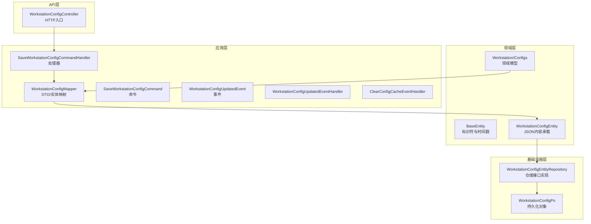
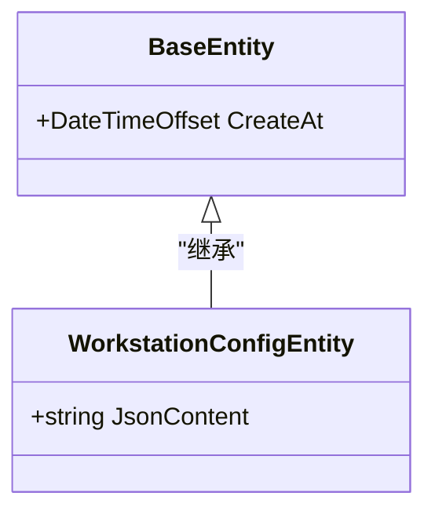
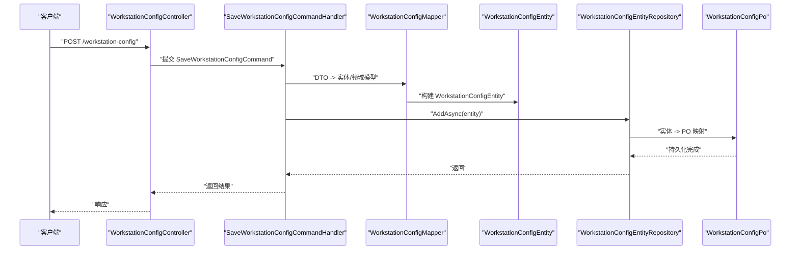
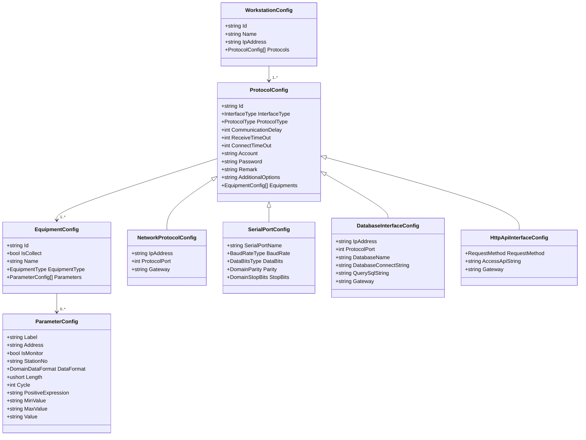
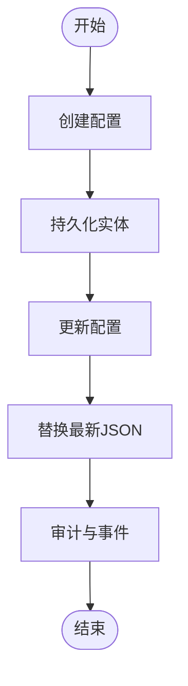
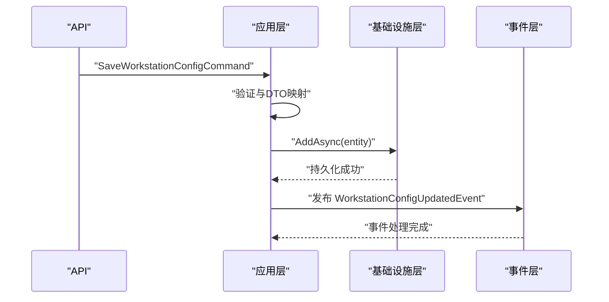
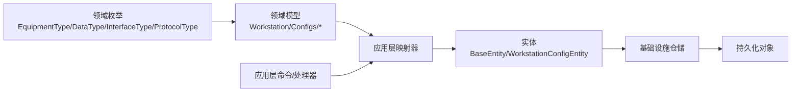

# 领域实体

<cite>
**本文档引用的文件**
- [BaseEntity.cs](file://IndustrialDataSolution/IndustrialDataProcessor.Domain/Entities/BaseEntity.cs)
- [WorkstationConfigEntity.cs](file://IndustrialDataProcessor.Domain/Entities/WorkstationConfigEntity.cs)
- [IWorkstationConfigEntityRepository.cs](file://IndustrialDataProcessor.Domain/Repositories/IWorkstationConfigEntityRepository.cs)
- [WorkstationConfig.cs](file://IndustrialDataProcessor.Domain/Workstation/Configs/WorkstationConfig.cs)
- [EquipmentConfig.cs](file://IndustrialDataProcessor.Domain/Workstation/Configs/EquipmentConfig.cs)
- [ParameterConfig.cs](file://IndustrialDataProcessor.Domain/Workstation/Configs/ParameterConfig.cs)
- [ProtocolConfig.cs](file://IndustrialDataProcessor.Domain/Workstation/Configs/ProtocolConfig.cs)
- [NetworkProtocolConfig.cs](file://IndustrialDataProcessor.Domain/Workstation/Configs/ProtocolSub/NetworkProtocolConfig.cs)
- [SerialPortConfig.cs](file://IndustrialDataProcessor.Domain/Workstation/Configs/ProtocolSub/SerialPortConfig.cs)
- [DatabaseInterfaceConfig.cs](file://IndustrialDataProcessor.Domain/Workstation/Configs/ProtocolSub/DatabaseInterfaceConfig.cs)
- [HttpApiInterfaceConfig.cs](file://IndustrialDataProcessor.Domain/Workstation/Configs/ProtocolSub/HttpApiInterfaceConfig.cs)
- [EquipmentType.cs](file://IndustrialDataProcessor.Domain/Enums/EquipmentType.cs)
- [DataType.cs](file://IndustrialDataProcessor.Domain/Enums/DataType.cs)
- [InterfaceType.cs](file://IndustrialDataProcessor.Domain/Enums/InterfaceType.cs)
- [ProtocolType.cs](file://IndustrialDataProcessor.Domain/Enums/ProtocolType.cs)
- [WorkstationConfigMapper.cs](file://IndustrialDataProcessor.Application/Mappers/WorkstationConfigMapper.cs)
- [SaveWorkstationConfigCommand.cs](file://IndustrialDataProcessor.Application/Commands/SaveWorkstationConfigCommand.cs)
- [SaveWorkstationConfigCommandHandler.cs](file://IndustrialDataProcessor.Application/CommandHandlers/SaveWorkstationConfigCommandHandler.cs)
- [WorkstationConfigController.cs](file://IndustrialDataProcessor.Api/Controllers/WorkstationConfigController.cs)
- [WorkstationConfigDto.cs](file://IndustrialDataProcessor.Application/Dtos/WorkstationDto/WorkstationConfigDto.cs)
- [SaveWorkstationConfigRequest.cs](file://IndustrialDataProcessor.Application/Dtos/SaveWorkstationConfigRequest.cs)
- [WorkstationConfigUpdatedEvent.cs](file://IndustrialDataProcessor.Application/Events/WorkstationConfigUpdatedEvent.cs)
- [WorkstationConfigUpdatedEventHandler.cs](file://IndustrialDataProcessor.Application/EventHandlers/WorkstationConfigUpdatedEventHandler.cs)
- [ClearConfigCacheEventHandler.cs](file://IndustrialDataProcessor.Application/EventHandlers/ClearConfigCacheEventHandler.cs)
- [WorkstationConfigEntityRepository.cs](file://IndustrialDataProcessor.Infrastructure/Persistence.SqlSugar/Repositories/WorkstationConfigEntityRepository.cs)
- [WorkstationConfigPo.cs](file://IndustrialDataProcessor.Infrastructure.Persistence.SqlSugar/DbEntities/WorkstationConfigPo.cs)
- [WorkstationConfigMapper.cs](file://IndustrialDataProcessor.Infrastructure.Persistence.SqlSugar/Mappers/WorkstationConfigMapper.cs)
</cite>

## 目录
1. [引言](#引言)
2. [项目结构](#项目结构)
3. [核心组件](#核心组件)
4. [架构总览](#架构总览)
5. [详细组件分析](#详细组件分析)
6. [依赖分析](#依赖分析)
7. [性能考虑](#性能考虑)
8. [故障排查指南](#故障排查指南)
9. [结论](#结论)
10. [附录](#附录)

## 引言
本文件聚焦于工业数据处理系统中的领域实体，系统性阐述 BaseEntity 基类的设计理念与通用能力（如标识符管理、时间戳处理、状态跟踪等），并深入解析 WorkstationConfigEntity 实体与其领域模型之间的映射关系与转换逻辑。文档还覆盖实体生命周期管理（创建、更新、软删除等）、实体间关联关系与引用完整性约束、跨层次传递与转换机制，并给出实体创建、查询、更新的完整业务流程。最后总结最佳实践与常见陷阱，提供在数据持久化与业务逻辑层的应用示例。

## 项目结构
本项目采用分层与领域驱动设计（DDD）组织代码，涉及领域层、应用层、基础设施层与 API 层。与实体相关的关键目录如下：
- 领域层 Entities：定义 BaseEntity 与 WorkstationConfigEntity
- 领域层 Workstation/Configs：定义完整的领域模型（工作站、设备、变量、协议等）
- 应用层 Mappers/Commands/CommandHandlers/EventHandlers：负责 DTO 与实体的映射、命令处理与事件发布
- 基础设施层 Persistence.SqlSugar：负责实体到持久化对象（PO）的映射与仓储实现
- API 层 Controllers：对外暴露配置保存接口

图表来源
- [BaseEntity.cs](file://IndustrialDataProcessor.Domain/Entities/BaseEntity.cs#L1-L7)
- [WorkstationConfigEntity.cs](file://IndustrialDataProcessor.Domain/Entities/WorkstationConfigEntity.cs#L1-L7)
- [WorkstationConfig.cs](file://IndustrialDataProcessor.Domain/Workstation/Configs/WorkstationConfig.cs#L1-L27)
- [WorkstationConfigMapper.cs](file://IndustrialDataProcessor.Application/Mappers/WorkstationConfigMapper.cs)
- [SaveWorkstationConfigCommand.cs](file://IndustrialDataProcessor.Application/Commands/SaveWorkstationConfigCommand.cs)
- [SaveWorkstationConfigCommandHandler.cs](file://IndustrialDataProcessor.Application/CommandHandlers/SaveWorkstationConfigCommandHandler.cs)
- [WorkstationConfigController.cs](file://IndustrialDataProcessor.Api/Controllers/WorkstationConfigController.cs)
- [WorkstationConfigEntityRepository.cs](file://IndustrialDataProcessor.Infrastructure/Persistence.SqlSugar/Repositories/WorkstationConfigEntityRepository.cs)
- [WorkstationConfigPo.cs](file://IndustrialDataProcessor.Infrastructure.Persistence.SqlSugar/DbEntities/WorkstationConfigPo.cs)

章节来源
- [BaseEntity.cs](file://IndustrialDataProcessor.Domain/Entities/BaseEntity.cs#L1-L7)
- [WorkstationConfigEntity.cs](file://IndustrialDataProcessor.Domain/Entities/WorkstationConfigEntity.cs#L1-L7)
- [WorkstationConfig.cs](file://IndustrialDataProcessor.Domain/Workstation/Configs/WorkstationConfig.cs#L1-L27)

## 核心组件
本节聚焦 BaseEntity 与 WorkstationConfigEntity 的职责与协作关系。

- BaseEntity
  - 设计理念：作为所有领域实体的抽象基类，统一提供创建时间戳字段，确保每个实体具备一致的时间维度属性。
  - 关键能力：集中式时间戳初始化，便于审计与排序；可扩展以引入标识符管理与状态跟踪。
- WorkstationConfigEntity
  - 设计理念：承载工作站配置的 JSON 文本，作为领域模型与持久化之间的桥梁。
  - 关键能力：通过 JSONContent 字段实现与复杂领域模型的序列化/反序列化映射；继承 BaseEntity 的时间戳能力。

图表来源
- [BaseEntity.cs](file://IndustrialDataProcessor.Domain/Entities/BaseEntity.cs#L1-L7)
- [WorkstationConfigEntity.cs](file://IndustrialDataProcessor.Domain/Entities/WorkstationConfigEntity.cs#L1-L7)

章节来源
- [BaseEntity.cs](file://IndustrialDataProcessor.Domain/Entities/BaseEntity.cs#L1-L7)
- [WorkstationConfigEntity.cs](file://IndustrialDataProcessor.Domain/Entities/WorkstationConfigEntity.cs#L1-L7)

## 架构总览
下图展示了从 API 到仓储与持久化的完整调用链，以及实体与领域模型之间的映射关系。

图表来源
- [WorkstationConfigController.cs](file://IndustrialDataProcessor.Api/Controllers/WorkstationConfigController.cs)
- [SaveWorkstationConfigCommand.cs](file://IndustrialDataProcessor.Application/Commands/SaveWorkstationConfigCommand.cs)
- [SaveWorkstationConfigCommandHandler.cs](file://IndustrialDataProcessor.Application/CommandHandlers/SaveWorkstationConfigCommandHandler.cs)
- [WorkstationConfigMapper.cs](file://IndustrialDataProcessor.Application/Mappers/WorkstationConfigMapper.cs)
- [WorkstationConfigEntityRepository.cs](file://IndustrialDataProcessor.Infrastructure/Persistence.SqlSugar/Repositories/WorkstationConfigEntityRepository.cs)
- [WorkstationConfigPo.cs](file://IndustrialDataProcessor.Infrastructure.Persistence.SqlSugar/DbEntities/WorkstationConfigPo.cs)

## 详细组件分析

### BaseEntity 基类
- 统一时间戳：提供 CreateAt 字段，使用 UTC 时间，便于分布式与多时区场景的一致性。
- 扩展空间：未来可在此添加标识符（如全局唯一 ID）、状态字段（如启用/禁用）、更新时间戳等，提升审计与治理能力。
- 设计建议：保持最小可用原则，避免过度设计；新增字段需与业务需求对齐，防止“贫血模型”。

章节来源
- [BaseEntity.cs](file://IndustrialDataProcessor.Domain/Entities/BaseEntity.cs#L1-L7)

### WorkstationConfigEntity 实体
- 角色定位：作为领域模型的载体，通过 JsonContent 存储复杂配置树，简化持久化与传输。
- 生命周期：创建即写入 JSON 内容；更新时替换旧 JSON；软删除可通过状态字段扩展（建议在 BaseEntity 中增加）。
- 约束与校验：JSON 结构应与领域模型严格对应；建议在应用层进行结构校验与版本兼容检查。

章节来源
- [WorkstationConfigEntity.cs](file://IndustrialDataProcessor.Domain/Entities/WorkstationConfigEntity.cs#L1-L7)

### 领域模型与实体映射
- 领域模型：WorkstationConfig、EquipmentConfig、ParameterConfig、ProtocolConfig 及其子类构成完整的配置模型树。
- 映射策略：应用层 Mapper 将 DTO/领域模型转换为 WorkstationConfigEntity；基础设施层 Mapper 将实体映射为持久化对象（PO）。
- 转换逻辑：Mapper 负责 JSON 序列化/反序列化、字段映射与默认值处理；确保一致性与可追溯性。

图表来源
- [WorkstationConfig.cs](file://IndustrialDataProcessor.Domain/Workstation/Configs/WorkstationConfig.cs#L1-L27)
- [EquipmentConfig.cs](file://IndustrialDataProcessor.Domain/Workstation/Configs/EquipmentConfig.cs#L1-L34)
- [ParameterConfig.cs](file://IndustrialDataProcessor.Domain/Workstation/Configs/ParameterConfig.cs#L1-L84)
- [ProtocolConfig.cs](file://IndustrialDataProcessor.Domain/Workstation/Configs/ProtocolConfig.cs#L1-L64)
- [NetworkProtocolConfig.cs](file://IndustrialDataProcessor.Domain/Workstation/Configs/ProtocolSub/NetworkProtocolConfig.cs#L1-L28)
- [SerialPortConfig.cs](file://IndustrialDataProcessor.Domain/Workstation/Configs/ProtocolSub/SerialPortConfig.cs#L1-L38)
- [DatabaseInterfaceConfig.cs](file://IndustrialDataProcessor.Domain/Workstation/Configs/ProtocolSub/DatabaseInterfaceConfig.cs#L1-L45)
- [HttpApiInterfaceConfig.cs](file://IndustrialDataProcessor.Domain/Workstation/Configs/ProtocolSub/HttpApiInterfaceConfig.cs#L1-L30)

章节来源
- [WorkstationConfig.cs](file://IndustrialDataProcessor.Domain/Workstation/Configs/WorkstationConfig.cs#L1-L27)
- [EquipmentConfig.cs](file://IndustrialDataProcessor.Domain/Workstation/Configs/EquipmentConfig.cs#L1-L34)
- [ParameterConfig.cs](file://IndustrialDataProcessor.Domain/Workstation/Configs/ParameterConfig.cs#L1-L84)
- [ProtocolConfig.cs](file://IndustrialDataProcessor.Domain/Workstation/Configs/ProtocolConfig.cs#L1-L64)
- [NetworkProtocolConfig.cs](file://IndustrialDataProcessor.Domain/Workstation/Configs/ProtocolSub/NetworkProtocolConfig.cs#L1-L28)
- [SerialPortConfig.cs](file://IndustrialDataProcessor.Domain/Workstation/Configs/ProtocolSub/SerialPortConfig.cs#L1-L38)
- [DatabaseInterfaceConfig.cs](file://IndustrialDataProcessor.Domain/Workstation/Configs/ProtocolSub/DatabaseInterfaceConfig.cs#L1-L45)
- [HttpApiInterfaceConfig.cs](file://IndustrialDataProcessor.Domain/Workstation/Configs/ProtocolSub/HttpApiInterfaceConfig.cs#L1-L30)

### 实体生命周期管理
- 创建：API 接收请求后，应用层命令处理器将 DTO 转换为实体并持久化；实体继承自 BaseEntity，自动具备创建时间戳。
- 更新：通过“替换最新配置”的方式实现；应用层先查询最新实体，再写入新 JSON 内容，保持历史可追溯。
- 软删除：当前未实现软删除字段；建议在 BaseEntity 中增加状态字段（如启用/禁用/已删除），并在查询与更新时加以过滤。

图表来源
- [BaseEntity.cs](file://IndustrialDataProcessor.Domain/Entities/BaseEntity.cs#L1-L7)
- [WorkstationConfigEntity.cs](file://IndustrialDataProcessor.Domain/Entities/WorkstationConfigEntity.cs#L1-L7)
- [SaveWorkstationConfigCommandHandler.cs](file://IndustrialDataProcessor.Application/CommandHandlers/SaveWorkstationConfigCommandHandler.cs)
- [WorkstationConfigUpdatedEvent.cs](file://IndustrialDataProcessor.Application/Events/WorkstationConfigUpdatedEvent.cs)

章节来源
- [BaseEntity.cs](file://IndustrialDataProcessor.Domain/Entities/BaseEntity.cs#L1-L7)
- [WorkstationConfigEntity.cs](file://IndustrialDataProcessor.Domain/Entities/WorkstationConfigEntity.cs#L1-L7)
- [SaveWorkstationConfigCommandHandler.cs](file://IndustrialDataProcessor.Application/CommandHandlers/SaveWorkstationConfigCommandHandler.cs)
- [WorkstationConfigUpdatedEvent.cs](file://IndustrialDataProcessor.Application/Events/WorkstationConfigUpdatedEvent.cs)

### 实体间关联关系与引用完整性
- WorkstationConfig 与 ProtocolConfig：一对多关系，一个工作站可配置多个协议。
- ProtocolConfig 与 EquipmentConfig：一对多关系，一个协议可包含多个设备。
- EquipmentConfig 与 ParameterConfig：一对多关系，一个设备可包含多个变量。
- 引用完整性：通过 Id 字段保证层级引用；建议在应用层进行引用校验与循环依赖检测。

章节来源
- [WorkstationConfig.cs](file://IndustrialDataProcessor.Domain/Workstation/Configs/WorkstationConfig.cs#L1-L27)
- [ProtocolConfig.cs](file://IndustrialDataProcessor.Domain/Workstation/Configs/ProtocolConfig.cs#L1-L64)
- [EquipmentConfig.cs](file://IndustrialDataProcessor.Domain/Workstation/Configs/EquipmentConfig.cs#L1-L34)
- [ParameterConfig.cs](file://IndustrialDataProcessor.Domain/Workstation/Configs/ParameterConfig.cs#L1-L84)

### 不同层次间的传递与转换机制
- API 层：接收 SaveWorkstationConfigRequest，封装为 SaveWorkstationConfigCommand。
- 应用层：命令处理器执行验证与映射，调用 Mapper 将 DTO/领域模型转换为实体。
- 基础设施层：仓储接口定义实体的增删改查；PO 映射器将实体转换为持久化对象。
- 事件层：更新完成后发布 WorkstationConfigUpdatedEvent，触发缓存清理与后续处理。

图表来源
- [SaveWorkstationConfigCommand.cs](file://IndustrialDataProcessor.Application/Commands/SaveWorkstationConfigCommand.cs)
- [SaveWorkstationConfigCommandHandler.cs](file://IndustrialDataProcessor.Application/CommandHandlers/SaveWorkstationConfigCommandHandler.cs)
- [WorkstationConfigMapper.cs](file://IndustrialDataProcessor.Application/Mappers/WorkstationConfigMapper.cs)
- [WorkstationConfigEntityRepository.cs](file://IndustrialDataProcessor.Infrastructure/Persistence.SqlSugar/Repositories/WorkstationConfigEntityRepository.cs)
- [WorkstationConfigUpdatedEvent.cs](file://IndustrialDataProcessor.Application/Events/WorkstationConfigUpdatedEvent.cs)
- [WorkstationConfigUpdatedEventHandler.cs](file://IndustrialDataProcessor.Application/EventHandlers/WorkstationConfigUpdatedEventHandler.cs)
- [ClearConfigCacheEventHandler.cs](file://IndustrialDataProcessor.Application/EventHandlers/ClearConfigCacheEventHandler.cs)

章节来源
- [SaveWorkstationConfigCommand.cs](file://IndustrialDataProcessor.Application/Commands/SaveWorkstationConfigCommand.cs)
- [SaveWorkstationConfigCommandHandler.cs](file://IndustrialDataProcessor.Application/CommandHandlers/SaveWorkstationConfigCommandHandler.cs)
- [WorkstationConfigMapper.cs](file://IndustrialDataProcessor.Application/Mappers/WorkstationConfigMapper.cs)
- [WorkstationConfigEntityRepository.cs](file://IndustrialDataProcessor.Infrastructure/Persistence.SqlSugar/Repositories/WorkstationConfigEntityRepository.cs)
- [WorkstationConfigUpdatedEvent.cs](file://IndustrialDataProcessor.Application/Events/WorkstationConfigUpdatedEvent.cs)
- [WorkstationConfigUpdatedEventHandler.cs](file://IndustrialDataProcessor.Application/EventHandlers/WorkstationConfigUpdatedEventHandler.cs)
- [ClearConfigCacheEventHandler.cs](file://IndustrialDataProcessor.Application/EventHandlers/ClearConfigCacheEventHandler.cs)

### 完整业务流程（创建/查询/更新）
- 创建流程
  - API 接收请求，命令处理器校验参数，Mapper 转换为实体，仓储持久化，发布事件。
- 查询流程
  - 仓储提供获取最新配置的方法；应用层可结合缓存与事件实现读取优化。
- 更新流程
  - 先查询最新实体，再替换 JSON 内容并持久化，发布更新事件，清理相关缓存。

章节来源
- [WorkstationConfigController.cs](file://IndustrialDataProcessor.Api/Controllers/WorkstationConfigController.cs)
- [IWorkstationConfigEntityRepository.cs](file://IndustrialDataProcessor.Domain/Repositories/IWorkstationConfigEntityRepository.cs#L1-L10)
- [WorkstationConfigEntityRepository.cs](file://IndustrialDataProcessor.Infrastructure/Persistence.SqlSugar/Repositories/WorkstationConfigEntityRepository.cs)

### 最佳实践与常见陷阱
- 最佳实践
  - 在 BaseEntity 中扩展状态字段与更新时间戳，支持软删除与审计。
  - 使用枚举与特性（如 ProtocolValidateParameter）约束协议参数，减少运行期错误。
  - 在应用层进行结构校验与版本兼容检查，避免 JSON 不一致导致的异常。
  - 通过事件解耦更新后的缓存清理与通知逻辑。
- 常见陷阱
  - 忽视 JSON 结构变更的向后兼容性，导致历史配置无法加载。
  - 缺少软删除字段，误删配置造成不可恢复。
  - 未对引用完整性进行校验，导致层级引用断裂。

章节来源
- [BaseEntity.cs](file://IndustrialDataProcessor.Domain/Entities/BaseEntity.cs#L1-L7)
- [ProtocolType.cs](file://IndustrialDataProcessor.Domain/Enums/ProtocolType.cs#L1-L231)
- [WorkstationConfigUpdatedEvent.cs](file://IndustrialDataProcessor.Application/Events/WorkstationConfigUpdatedEvent.cs)
- [ClearConfigCacheEventHandler.cs](file://IndustrialDataProcessor.Application/EventHandlers/ClearConfigCacheEventHandler.cs)

## 依赖分析
- 领域层依赖：实体依赖枚举与领域模型；仓储接口定义实体访问契约。
- 应用层依赖：命令处理器依赖 Mapper 与仓储；事件处理器依赖事件模型。
- 基础设施层依赖：仓储实现依赖持久化对象与数据库访问框架。

图表来源
- [EquipmentType.cs](file://IndustrialDataProcessor.Domain/Enums/EquipmentType.cs#L1-L22)
- [DataType.cs](file://IndustrialDataProcessor.Domain/Enums/DataType.cs#L1-L69)
- [InterfaceType.cs](file://IndustrialDataProcessor.Domain/Enums/InterfaceType.cs#L1-L32)
- [ProtocolType.cs](file://IndustrialDataProcessor.Domain/Enums/ProtocolType.cs#L1-L231)
- [WorkstationConfig.cs](file://IndustrialDataProcessor.Domain/Workstation/Configs/WorkstationConfig.cs#L1-L27)
- [WorkstationConfigEntity.cs](file://IndustrialDataProcessor.Domain/Entities/WorkstationConfigEntity.cs#L1-L7)
- [WorkstationConfigMapper.cs](file://IndustrialDataProcessor.Application/Mappers/WorkstationConfigMapper.cs)
- [SaveWorkstationConfigCommandHandler.cs](file://IndustrialDataProcessor.Application/CommandHandlers/SaveWorkstationConfigCommandHandler.cs)
- [WorkstationConfigEntityRepository.cs](file://IndustrialDataProcessor.Infrastructure/Persistence.SqlSugar/Repositories/WorkstationConfigEntityRepository.cs)
- [WorkstationConfigPo.cs](file://IndustrialDataProcessor.Infrastructure.Persistence.SqlSugar/DbEntities/WorkstationConfigPo.cs)

章节来源
- [EquipmentType.cs](file://IndustrialDataProcessor.Domain/Enums/EquipmentType.cs#L1-L22)
- [DataType.cs](file://IndustrialDataProcessor.Domain/Enums/DataType.cs#L1-L69)
- [InterfaceType.cs](file://IndustrialDataProcessor.Domain/Enums/InterfaceType.cs#L1-L32)
- [ProtocolType.cs](file://IndustrialDataProcessor.Domain/Enums/ProtocolType.cs#L1-L231)
- [WorkstationConfig.cs](file://IndustrialDataProcessor.Domain/Workstation/Configs/WorkstationConfig.cs#L1-L27)
- [WorkstationConfigEntity.cs](file://IndustrialDataProcessor.Domain/Entities/WorkstationConfigEntity.cs#L1-L7)
- [WorkstationConfigMapper.cs](file://IndustrialDataProcessor.Application/Mappers/WorkstationConfigMapper.cs)
- [SaveWorkstationConfigCommandHandler.cs](file://IndustrialDataProcessor.Application/CommandHandlers/SaveWorkstationConfigCommandHandler.cs)
- [WorkstationConfigEntityRepository.cs](file://IndustrialDataProcessor.Infrastructure/Persistence.SqlSugar/Repositories/WorkstationConfigEntityRepository.cs)
- [WorkstationConfigPo.cs](file://IndustrialDataProcessor.Infrastructure.Persistence.SqlSugar/DbEntities/WorkstationConfigPo.cs)

## 性能考虑
- JSON 序列化/反序列化：建议使用流式或高性能序列化库，避免大对象频繁分配。
- 缓存策略：更新后及时清理相关缓存，降低重复计算与 IO。
- 并发控制：在命令处理器中使用幂等设计与乐观锁，避免并发写入冲突。
- 分页与批量：查询最新配置时尽量只读取必要字段，减少网络与存储压力。

## 故障排查指南
- JSON 结构不匹配：检查 DTO 与领域模型字段映射，确认默认值与空值处理策略。
- 事件未触发：确认事件发布与订阅配置，检查事件处理器注册与日志输出。
- 仓储异常：核对实体到 PO 的映射规则，检查数据库连接与事务边界。
- 参数校验失败：根据枚举与特性约束逐项排查，确保协议参数满足要求。

章节来源
- [WorkstationConfigUpdatedEvent.cs](file://IndustrialDataProcessor.Application/Events/WorkstationConfigUpdatedEvent.cs)
- [WorkstationConfigUpdatedEventHandler.cs](file://IndustrialDataProcessor.Application/EventHandlers/WorkstationConfigUpdatedEventHandler.cs)
- [ClearConfigCacheEventHandler.cs](file://IndustrialDataProcessor.Application/EventHandlers/ClearConfigCacheEventHandler.cs)
- [ProtocolType.cs](file://IndustrialDataProcessor.Domain/Enums/ProtocolType.cs#L1-L231)

## 结论
本文件系统性梳理了 BaseEntity 与 WorkstationConfigEntity 的设计理念与通用能力，明确了实体与领域模型的映射关系与转换机制，给出了生命周期管理、关联关系与引用完整性约束、跨层次传递与转换的完整流程，并总结了最佳实践与常见陷阱。通过事件与缓存解耦，系统实现了高内聚、低耦合的配置管理能力，适合在工业数据采集与边缘计算场景中稳定演进。

## 附录
- 实体与 DTO 对照表（字段级映射建议）
  - WorkstationConfigDto <-> WorkstationConfig：Id、Name、IpAddress、Protocols
  - EquipmentConfigDto <-> EquipmentConfig：Id、IsCollect、Name、EquipmentType、Parameters
  - ParameterConfigDto <-> ParameterConfig：Label、Address、IsMonitor、StationNo、DataFormat、Length、Cycle、PositiveExpression、MinValue、MaxValue、Value
  - 协议子类映射：NetworkProtocolConfig、SerialPortConfig、DatabaseInterfaceConfig、HttpApiInterfaceConfig
- 建议扩展
  - BaseEntity：增加 Id、状态、更新时间戳
  - 领域模型：增加版本号与兼容性检查
  - 应用层：增加幂等与重试策略