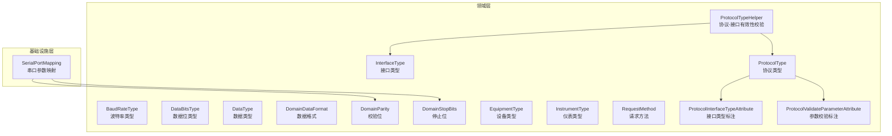
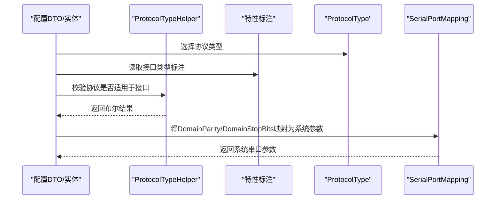
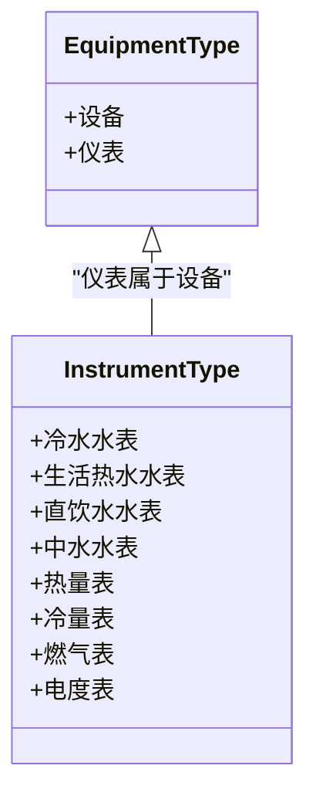
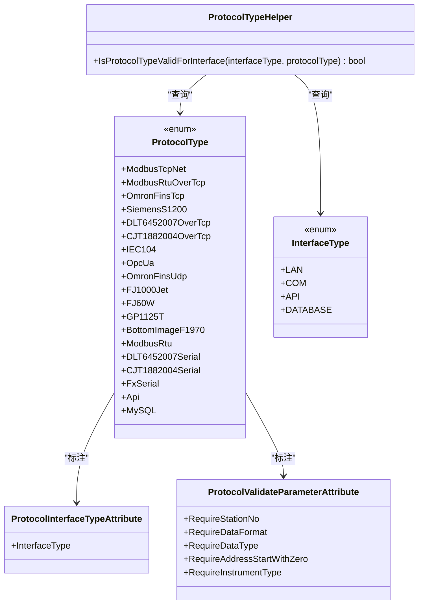
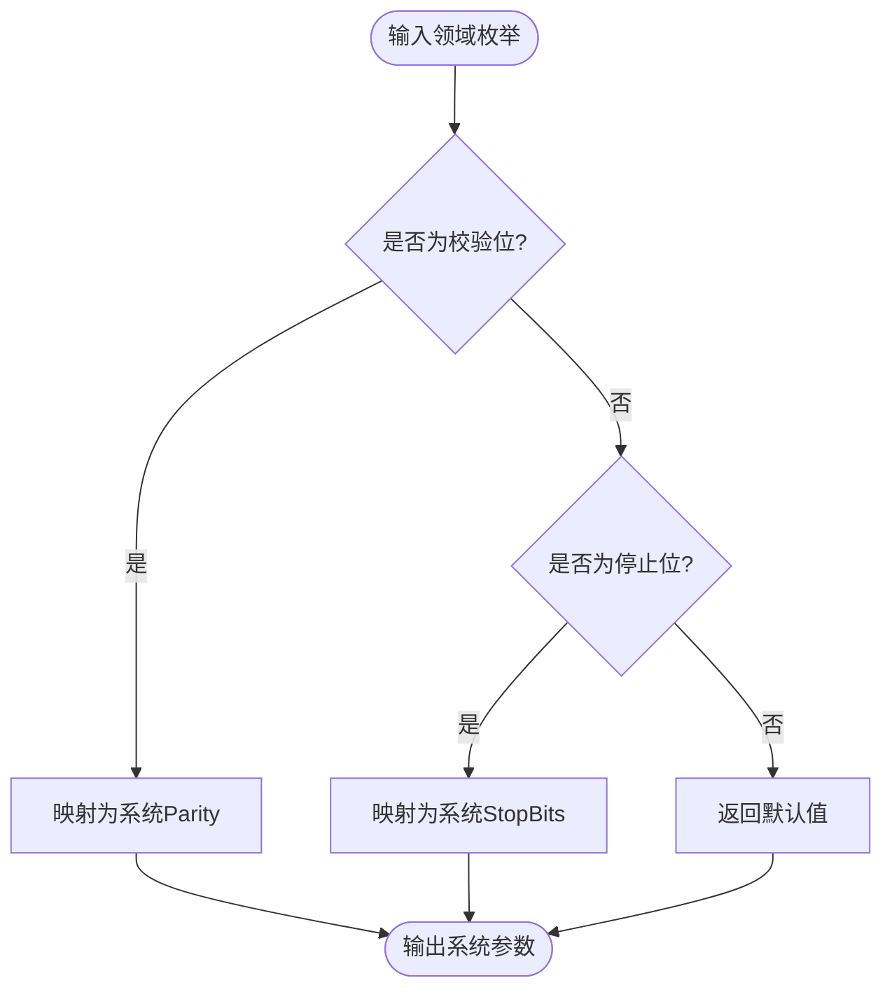
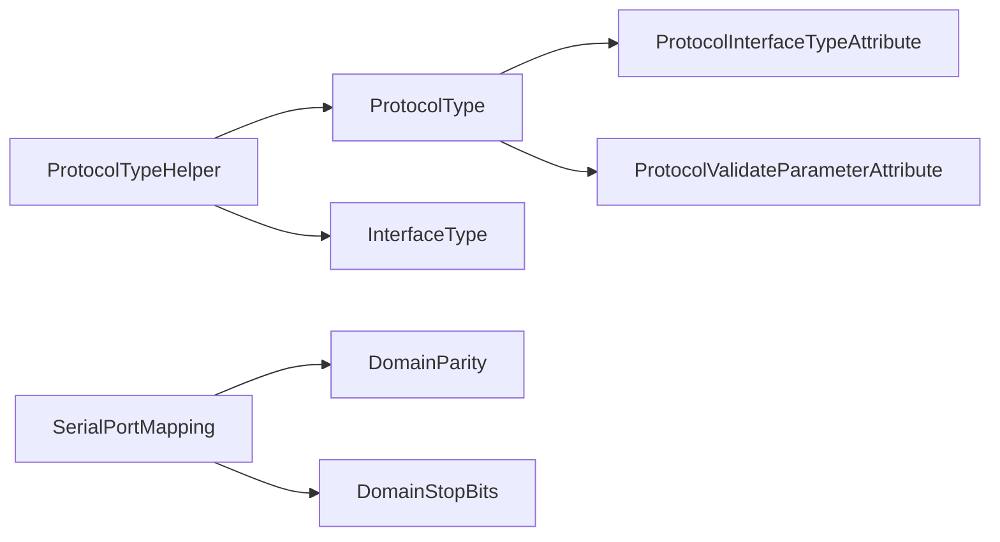

# 领域枚举

<cite>
**本文引用的文件**
- [BaudRateType.cs](file://IndustrialDataSolution/IndustrialDataProcessor.Domain/Enums/BaudRateType.cs)
- [DataBitsType.cs](file://IndustrialDataProcessor.Domain/Enums/DataBitsType.cs)
- [DataType.cs](file://IndustrialDataProcessor.Domain/Enums/DataType.cs)
- [DomainDataFormat.cs](file://IndustrialDataProcessor.Domain/Enums/DomainDataFormat.cs)
- [DomainParity.cs](file://IndustrialDataProcessor.Domain/Enums/DomainParity.cs)
- [DomainStopBits.cs](file://IndustrialDataProcessor.Domain/Enums/DomainStopBits.cs)
- [EquipmentType.cs](file://IndustrialDataProcessor.Domain/Enums/EquipmentType.cs)
- [InstrumentType.cs](file://IndustrialDataProcessor.Domain/Enums/InstrumentType.cs)
- [InterfaceType.cs](file://IndustrialDataProcessor.Domain/Enums/InterfaceType.cs)
- [ProtocolType.cs](file://IndustrialDataProcessor.Domain/Enums/ProtocolType.cs)
- [RequestMethod.cs](file://IndustrialDataProcessor.Domain/Enums/RequestMethod.cs)
- [ProtocolInterfaceTypeAttribute.cs](file://IndustrialDataProcessor.Domain/Attributes/ProtocolInterfaceTypeAttribute.cs)
- [ProtocolValidateParameterAttribute.cs](file://IndustrialDataProcessor.Domain/Attributes/ProtocolValidateParameterAttribute.cs)
- [ProtocolTypeHelper.cs](file://IndustrialDataProcessor.Domain/Helpers/ProtocolTypeHelper.cs)
- [SerialPortMapping.cs](file://IndustrialDataProcessor.Infrastructure/Extensions/SerialPortMapping.cs)
</cite>

## 目录
1. [简介](#简介)
2. [项目结构](#项目结构)
3. [核心组件](#核心组件)
4. [架构总览](#架构总览)
5. [详细组件分析](#详细组件分析)
6. [依赖关系分析](#依赖关系分析)
7. [性能考量](#性能考量)
8. [故障排查指南](#故障排查指南)
9. [结论](#结论)
10. [附录](#附录)

## 简介
本文件系统性梳理工业数据处理领域的枚举设计与应用，覆盖通信相关枚举（波特率、数据位、数据类型、数据格式、校验位、停止位）、设备与仪表类型、协议与接口类型、以及请求方法等。重点阐述各枚举的设计目的、业务含义、参数校验规则、跨层映射与转换逻辑，并给出配置验证与业务决策中的使用建议与扩展指南。

## 项目结构
领域层的枚举集中于 IndustrialDataProcessor.Domain/Enums，配合 Attributes 与 Helpers 提供接口约束与运行时校验；基础设施层通过扩展方法将领域枚举映射到系统串口参数类型，确保领域抽象与实现解耦。

图表来源
- [ProtocolType.cs](file://IndustrialDataProcessor.Domain/Enums/ProtocolType.cs#L1-L231)
- [ProtocolInterfaceTypeAttribute.cs](file://IndustrialDataProcessor.Domain/Attributes/ProtocolInterfaceTypeAttribute.cs#L1-L19)
- [ProtocolValidateParameterAttribute.cs](file://IndustrialDataProcessor.Domain/Attributes/ProtocolValidateParameterAttribute.cs#L1-L28)
- [ProtocolTypeHelper.cs](file://IndustrialDataProcessor.Domain/Helpers/ProtocolTypeHelper.cs#L1-L35)
- [SerialPortMapping.cs](file://IndustrialDataProcessor.Infrastructure/Extensions/SerialPortMapping.cs#L1-L32)

章节来源
- [ProtocolType.cs](file://IndustrialDataProcessor.Domain/Enums/ProtocolType.cs#L1-L231)
- [ProtocolInterfaceTypeAttribute.cs](file://IndustrialDataProcessor.Domain/Attributes/ProtocolInterfaceTypeAttribute.cs#L1-L19)
- [ProtocolValidateParameterAttribute.cs](file://IndustrialDataProcessor.Domain/Attributes/ProtocolValidateParameterAttribute.cs#L1-L28)
- [ProtocolTypeHelper.cs](file://IndustrialDataProcessor.Domain/Helpers/ProtocolTypeHelper.cs#L1-L35)
- [SerialPortMapping.cs](file://IndustrialDataProcessor.Infrastructure/Extensions/SerialPortMapping.cs#L1-L32)

## 核心组件
- 通信相关枚举：用于串口通信参数与数据表达的标准化，确保跨设备、跨协议的一致性与可配置性。
- 设备与仪表类型：对设备进行分类，便于业务决策与策略分发。
- 协议与接口类型：明确协议适用的物理/逻辑接口，结合参数校验标注实现配置层面的强约束。
- 请求方法：统一 API 调用的动词语义，支撑不同协议下的读写操作建模。

章节来源
- [BaudRateType.cs](file://IndustrialDataProcessor.Domain/Enums/BaudRateType.cs#L1-L99)
- [DataBitsType.cs](file://IndustrialDataProcessor.Domain/Enums/DataBitsType.cs#L1-L21)
- [DataType.cs](file://IndustrialDataProcessor.Domain/Enums/DataType.cs#L1-L69)
- [DomainDataFormat.cs](file://IndustrialDataProcessor.Domain/Enums/DomainDataFormat.cs#L1-L9)
- [DomainParity.cs](file://IndustrialDataProcessor.Domain/Enums/DomainParity.cs#L1-L13)
- [DomainStopBits.cs](file://IndustrialDataProcessor.Domain/Enums/DomainStopBits.cs#L1-L13)
- [EquipmentType.cs](file://IndustrialDataProcessor.Domain/Enums/EquipmentType.cs#L1-L22)
- [InstrumentType.cs](file://IndustrialDataProcessor.Domain/Enums/InstrumentType.cs#L1-L58)
- [InterfaceType.cs](file://IndustrialDataProcessor.Domain/Enums/InterfaceType.cs#L1-L32)
- [ProtocolType.cs](file://IndustrialDataProcessor.Domain/Enums/ProtocolType.cs#L1-L231)
- [RequestMethod.cs](file://IndustrialDataProcessor.Domain/Enums/RequestMethod.cs#L1-L40)

## 架构总览
领域枚举通过特性标注协议的接口约束与参数校验需求，运行时由 Helper 做集合化缓存与快速判定；基础设施层负责将领域枚举映射到系统串口参数类型，保证领域抽象与实现解耦。

图表来源
- [ProtocolTypeHelper.cs](file://IndustrialDataProcessor.Domain/Helpers/ProtocolTypeHelper.cs#L1-L35)
- [ProtocolInterfaceTypeAttribute.cs](file://IndustrialDataProcessor.Domain/Attributes/ProtocolInterfaceTypeAttribute.cs#L1-L19)
- [SerialPortMapping.cs](file://IndustrialDataProcessor.Infrastructure/Extensions/SerialPortMapping.cs#L1-L32)

## 详细组件分析

### 通信相关枚举

- 波特率类型（BaudRateType）
  - 设计目的：标准化串口通信速率，避免魔法数与字符串误配。
  - 使用场景：串口初始化、连接建立、参数校验。
  - 复杂度：常量时间映射，无额外空间开销。
  - 最佳实践：与数据位、校验位、停止位组合使用，形成完整的串口参数集；在配置校验阶段强制存在且有效。

- 数据位类型（DataBitsType）
  - 设计目的：限定数据帧中的数据位数量，常见为7或8。
  - 使用场景：串口参数一致性校验。
  - 复杂度：常量时间，O(1)。

- 数据类型（DataType）
  - 设计目的：统一数据读写的数据类型语义，支持布尔、整型、浮点、字符串等。
  - 使用场景：点位读写、表达式计算、序列化/反序列化。
  - 复杂度：常量时间，O(1)。

- 数据格式（DomainDataFormat）
  - 设计目的：定义多字节数据的字节序排列模式，适配不同设备/协议的字节序约定。
  - 使用场景：多字节寄存器/数值解析与打包。
  - 复杂度：常量时间，O(1)。

- 校验位（DomainParity）
  - 设计目的：提供串口通信的奇偶校验与标记/空格校验能力。
  - 使用场景：串口参数配置与系统串口库映射。
  - 复杂度：常量时间，O(1)。

- 停止位（DomainStopBits）
  - 设计目的：控制数据帧结束标志，支持None、One、Two、OnePointFive。
  - 使用场景：串口参数配置与系统串口库映射。
  - 复杂度：常量时间，O(1)。

章节来源
- [BaudRateType.cs](file://IndustrialDataProcessor.Domain/Enums/BaudRateType.cs#L1-L99)
- [DataBitsType.cs](file://IndustrialDataProcessor.Domain/Enums/DataBitsType.cs#L1-L21)
- [DataType.cs](file://IndustrialDataProcessor.Domain/Enums/DataType.cs#L1-L69)
- [DomainDataFormat.cs](file://IndustrialDataProcessor.Domain/Enums/DomainDataFormat.cs#L1-L9)
- [DomainParity.cs](file://IndustrialDataProcessor.Domain/Enums/DomainParity.cs#L1-L13)
- [DomainStopBits.cs](file://IndustrialDataProcessor.Domain/Enums/DomainStopBits.cs#L1-L13)

### 设备与仪表类型

- 设备类型（EquipmentType）
  - 分类：设备、仪表。
  - 业务含义：区分通用设备与计量仪表，便于后续策略、权限、采集策略差异化处理。

- 仪表类型（InstrumentType）
  - 分类体系：水表（冷水、生活热水、直饮、中水）、热量表（热量、冷量）、燃气表、电度表。
  - 业务含义：面向计量类仪表的细分，便于协议选择、地址范围、数据解析策略的差异化。

图表来源
- [EquipmentType.cs](file://IndustrialDataProcessor.Domain/Enums/EquipmentType.cs#L1-L22)
- [InstrumentType.cs](file://IndustrialDataProcessor.Domain/Enums/InstrumentType.cs#L1-L58)

章节来源
- [EquipmentType.cs](file://IndustrialDataProcessor.Domain/Enums/EquipmentType.cs#L1-L22)
- [InstrumentType.cs](file://IndustrialDataProcessor.Domain/Enums/InstrumentType.cs#L1-L58)

### 协议与接口类型

- 接口类型（InterfaceType）
  - 定义：LAN、COM、API、DATABASE。
  - 应用场景：限制协议可用的物理/逻辑接口，避免错误配置。

- 协议类型（ProtocolType）
  - 定义：覆盖 LAN/TCP、LAN/UDP、自由协议、COM、API、DATABASE 等多种协议族。
  - 参数校验标注：通过特性标注每个协议所需的参数项（站号、数据格式、数据类型、地址起始规则、仪表类型要求）。
  - 接口标注：通过特性标注协议所属接口类型，便于运行时校验。

- 协议-接口有效性校验（ProtocolTypeHelper）
  - 功能：基于反射收集协议-接口映射，构建接口到协议集合的映射表，提供快速查询。
  - 性能：静态构造一次，后续查询为哈希集合查找，O(1) 平均时间。

图表来源
- [ProtocolType.cs](file://IndustrialDataProcessor.Domain/Enums/ProtocolType.cs#L1-L231)
- [InterfaceType.cs](file://IndustrialDataProcessor.Domain/Enums/InterfaceType.cs#L1-L32)
- [ProtocolInterfaceTypeAttribute.cs](file://IndustrialDataProcessor.Domain/Attributes/ProtocolInterfaceTypeAttribute.cs#L1-L19)
- [ProtocolValidateParameterAttribute.cs](file://IndustrialDataProcessor.Domain/Attributes/ProtocolValidateParameterAttribute.cs#L1-L28)
- [ProtocolTypeHelper.cs](file://IndustrialDataProcessor.Domain/Helpers/ProtocolTypeHelper.cs#L1-L35)

章节来源
- [InterfaceType.cs](file://IndustrialDataProcessor.Domain/Enums/InterfaceType.cs#L1-L32)
- [ProtocolType.cs](file://IndustrialDataProcessor.Domain/Enums/ProtocolType.cs#L1-L231)
- [ProtocolInterfaceTypeAttribute.cs](file://IndustrialDataProcessor.Domain/Attributes/ProtocolInterfaceTypeAttribute.cs#L1-L19)
- [ProtocolValidateParameterAttribute.cs](file://IndustrialDataProcessor.Domain/Attributes/ProtocolValidateParameterAttribute.cs#L1-L28)
- [ProtocolTypeHelper.cs](file://IndustrialDataProcessor.Domain/Helpers/ProtocolTypeHelper.cs#L1-L35)

### 请求方法枚举（RequestMethod）

- 设计目的：统一 API 请求动词，便于协议层抽象与上层调用一致性。
- 应用场景：HTTP API 协议下 GET/POST/PUT/DELETE/PATCH 的语义化表达。
- 复杂度：常量时间，O(1)。

章节来源
- [RequestMethod.cs](file://IndustrialDataProcessor.Domain/Enums/RequestMethod.cs#L1-L40)

### 串口参数映射与转换

- 领域到系统映射
  - DomainParity → System.IO.Ports.Parity
  - DomainStopBits → System.IO.Ports.StopBits
- 映射策略
  - 一对一映射，未匹配项回退到安全默认值（如 None/One）。
- 性能与健壮性
  - 常量时间映射，switch/case 结构，编译器优化良好。

图表来源
- [SerialPortMapping.cs](file://IndustrialDataProcessor.Infrastructure/Extensions/SerialPortMapping.cs#L1-L32)
- [DomainParity.cs](file://IndustrialDataProcessor.Domain/Enums/DomainParity.cs#L1-L13)
- [DomainStopBits.cs](file://IndustrialDataProcessor.Domain/Enums/DomainStopBits.cs#L1-L13)

章节来源
- [SerialPortMapping.cs](file://IndustrialDataProcessor.Infrastructure/Extensions/SerialPortMapping.cs#L1-L32)
- [DomainParity.cs](file://IndustrialDataProcessor.Domain/Enums/DomainParity.cs#L1-L13)
- [DomainStopBits.cs](file://IndustrialDataProcessor.Domain/Enums/DomainStopBits.cs#L1-L13)

## 依赖关系分析

图表来源
- [ProtocolType.cs](file://IndustrialDataProcessor.Domain/Enums/ProtocolType.cs#L1-L231)
- [ProtocolInterfaceTypeAttribute.cs](file://IndustrialDataProcessor.Domain/Attributes/ProtocolInterfaceTypeAttribute.cs#L1-L19)
- [ProtocolValidateParameterAttribute.cs](file://IndustrialDataProcessor.Domain/Attributes/ProtocolValidateParameterAttribute.cs#L1-L28)
- [ProtocolTypeHelper.cs](file://IndustrialDataProcessor.Domain/Helpers/ProtocolTypeHelper.cs#L1-L35)
- [SerialPortMapping.cs](file://IndustrialDataProcessor.Infrastructure/Extensions/SerialPortMapping.cs#L1-L32)

章节来源
- [ProtocolType.cs](file://IndustrialDataProcessor.Domain/Enums/ProtocolType.cs#L1-L231)
- [ProtocolInterfaceTypeAttribute.cs](file://IndustrialDataProcessor.Domain/Attributes/ProtocolInterfaceTypeAttribute.cs#L1-L19)
- [ProtocolValidateParameterAttribute.cs](file://IndustrialDataProcessor.Domain/Attributes/ProtocolValidateParameterAttribute.cs#L1-L28)
- [ProtocolTypeHelper.cs](file://IndustrialDataProcessor.Domain/Helpers/ProtocolTypeHelper.cs#L1-L35)
- [SerialPortMapping.cs](file://IndustrialDataProcessor.Infrastructure/Extensions/SerialPortMapping.cs#L1-L32)

## 性能考量
- 枚举比较与映射均为 O(1)，对性能影响可忽略。
- ProtocolTypeHelper 在静态构造时完成一次反射扫描并缓存映射，后续查询为哈希集合 Contains 操作，时间复杂度 O(1)。
- 建议：在高频路径中复用已缓存的校验结果，避免重复反射。

## 故障排查指南
- 协议与接口不匹配
  - 现象：配置保存或连接建立失败。
  - 排查：确认 ProtocolType 是否标注了正确的 InterfaceType；使用 ProtocolTypeHelper 校验。
  - 参考
    - [ProtocolTypeHelper.cs](file://IndustrialDataProcessor.Domain/Helpers/ProtocolTypeHelper.cs#L1-L35)
    - [ProtocolInterfaceTypeAttribute.cs](file://IndustrialDataProcessor.Domain/Attributes/ProtocolInterfaceTypeAttribute.cs#L1-L19)

- 参数缺失导致校验失败
  - 现象：保存配置时报错缺少站号/数据格式/数据类型等。
  - 排查：核对 ProtocolType 上的 ProtocolValidateParameterAttribute 标注，补齐必填项。
  - 参考
    - [ProtocolType.cs](file://IndustrialDataProcessor.Domain/Enums/ProtocolType.cs#L1-L231)
    - [ProtocolValidateParameterAttribute.cs](file://IndustrialDataProcessor.Domain/Attributes/ProtocolValidateParameterAttribute.cs#L1-L28)

- 串口参数异常
  - 现象：串口打开失败或通信不稳定。
  - 排查：检查 DomainParity/DomainStopBits 是否映射到系统串口参数；确认默认回退值是否合理。
  - 参考
    - [SerialPortMapping.cs](file://IndustrialDataProcessor.Infrastructure/Extensions/SerialPortMapping.cs#L1-L32)

章节来源
- [ProtocolTypeHelper.cs](file://IndustrialDataProcessor.Domain/Helpers/ProtocolTypeHelper.cs#L1-L35)
- [ProtocolInterfaceTypeAttribute.cs](file://IndustrialDataProcessor.Domain/Attributes/ProtocolInterfaceTypeAttribute.cs#L1-L19)
- [ProtocolValidateParameterAttribute.cs](file://IndustrialDataProcessor.Domain/Attributes/ProtocolValidateParameterAttribute.cs#L1-L28)
- [ProtocolType.cs](file://IndustrialDataProcessor.Domain/Enums/ProtocolType.cs#L1-L231)
- [SerialPortMapping.cs](file://IndustrialDataProcessor.Infrastructure/Extensions/SerialPortMapping.cs#L1-L32)

## 结论
本领域的枚举体系以“领域抽象+特性标注+运行时校验”为核心，实现了配置层面的强约束与运行时的高效校验。通信相关枚举确保串口参数一致与可配置；设备/仪表类型为业务策略提供清晰边界；协议与接口类型结合参数校验标注，使配置验证与业务决策具备可追溯性与可扩展性。通过基础设施层的映射扩展，领域抽象与系统实现保持解耦。

## 附录

### 枚举值验证与转换清单
- 波特率（BaudRateType）
  - 验证：必须为枚举内值；与数据位、校验位、停止位共同构成完整串口参数集。
  - 转换：直接使用，无需映射。
  - 参考
    - [BaudRateType.cs](file://IndustrialDataProcessor.Domain/Enums/BaudRateType.cs#L1-L99)

- 数据位（DataBitsType）
  - 验证：仅允许 D7/D8。
  - 转换：直接使用。
  - 参考
    - [DataBitsType.cs](file://IndustrialDataProcessor.Domain/Enums/DataBitsType.cs#L1-L21)

- 数据类型（DataType）
  - 验证：按协议标注的 RequireDataType 决定是否必填。
  - 转换：用于序列化/反序列化与表达式计算。
  - 参考
    - [DataType.cs](file://IndustrialDataProcessor.Domain/Enums/DataType.cs#L1-L69)

- 数据格式（DomainDataFormat）
  - 验证：按协议标注的 RequireDataFormat 决定是否必填。
  - 转换：用于多字节数据的字节序处理。
  - 参考
    - [DomainDataFormat.cs](file://IndustrialDataProcessor.Domain/Enums/DomainDataFormat.cs#L1-L9)

- 校验位（DomainParity）
  - 验证：None/Odd/Even/Mark/Space。
  - 转换：映射至系统 Parity。
  - 参考
    - [DomainParity.cs](file://IndustrialDataProcessor.Domain/Enums/DomainParity.cs#L1-L13)
    - [SerialPortMapping.cs](file://IndustrialDataProcessor.Infrastructure/Extensions/SerialPortMapping.cs#L1-L32)

- 停止位（DomainStopBits）
  - 验证：None/One/Two/OnePointFive。
  - 转换：映射至系统 StopBits。
  - 参考
    - [DomainStopBits.cs](file://IndustrialDataProcessor.Domain/Enums/DomainStopBits.cs#L1-L13)
    - [SerialPortMapping.cs](file://IndustrialDataProcessor.Infrastructure/Extensions/SerialPortMapping.cs#L1-L32)

- 设备类型（EquipmentType）
  - 验证：Equipment/Instrument。
  - 转换：用于业务策略分发。
  - 参考
    - [EquipmentType.cs](file://IndustrialDataProcessor.Domain/Enums/EquipmentType.cs#L1-L22)

- 仪表类型（InstrumentType）
  - 验证：水表/热量表/燃气表/电度表等。
  - 转换：用于协议选择与数据解析策略。
  - 参考
    - [InstrumentType.cs](file://IndustrialDataProcessor.Domain/Enums/InstrumentType.cs#L1-L58)

- 接口类型（InterfaceType）
  - 验证：LAN/COM/API/DATABASE。
  - 转换：用于协议-接口合法性校验。
  - 参考
    - [InterfaceType.cs](file://IndustrialDataProcessor.Domain/Enums/InterfaceType.cs#L1-L32)

- 协议类型（ProtocolType）
  - 验证：通过特性标注的参数校验与接口标注决定配置合法性。
  - 转换：驱动具体协议实现。
  - 参考
    - [ProtocolType.cs](file://IndustrialDataProcessor.Domain/Enums/ProtocolType.cs#L1-L231)
    - [ProtocolValidateParameterAttribute.cs](file://IndustrialDataProcessor.Domain/Attributes/ProtocolValidateParameterAttribute.cs#L1-L28)
    - [ProtocolInterfaceTypeAttribute.cs](file://IndustrialDataProcessor.Domain/Attributes/ProtocolInterfaceTypeAttribute.cs#L1-L19)

- 请求方法（RequestMethod）
  - 验证：Get/Post/Put/Delete/Patch。
  - 转换：用于 HTTP API 调用。
  - 参考
    - [RequestMethod.cs](file://IndustrialDataProcessor.Domain/Enums/RequestMethod.cs#L1-L40)

### 扩展指南
- 新增协议
  - 步骤：在 ProtocolType 中新增枚举值，添加 ProtocolInterfaceTypeAttribute 与 ProtocolValidateParameterAttribute 标注；必要时在 ProtocolTypeHelper 中自动识别（静态构造会扫描特性）。
  - 参考
    - [ProtocolType.cs](file://IndustrialDataProcessor.Domain/Enums/ProtocolType.cs#L1-L231)
    - [ProtocolInterfaceTypeAttribute.cs](file://IndustrialDataProcessor.Domain/Attributes/ProtocolInterfaceTypeAttribute.cs#L1-L19)
    - [ProtocolValidateParameterAttribute.cs](file://IndustrialDataProcessor.Domain/Attributes/ProtocolValidateParameterAttribute.cs#L1-L28)
    - [ProtocolTypeHelper.cs](file://IndustrialDataProcessor.Domain/Helpers/ProtocolTypeHelper.cs#L1-L35)

- 新增串口参数映射
  - 步骤：在 SerialPortMapping 中增加新的映射方法，确保未匹配项有安全默认值。
  - 参考
    - [SerialPortMapping.cs](file://IndustrialDataProcessor.Infrastructure/Extensions/SerialPortMapping.cs#L1-L32)

- 新增数据格式/数据类型
  - 步骤：在 DomainDataFormat/DataType 中新增枚举值；更新相关协议的参数校验标注与解析逻辑。
  - 参考
    - [DomainDataFormat.cs](file://IndustrialDataProcessor.Domain/Enums/DomainDataFormat.cs#L1-L9)
    - [DataType.cs](file://IndustrialDataProcessor.Domain/Enums/DataType.cs#L1-L69)