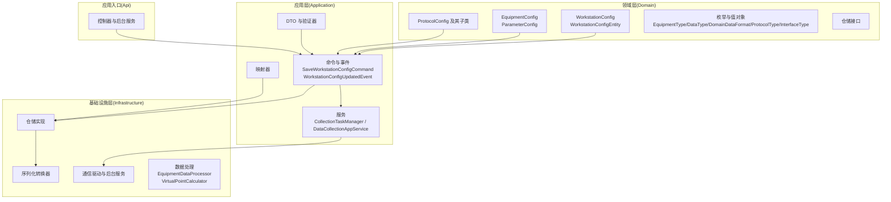
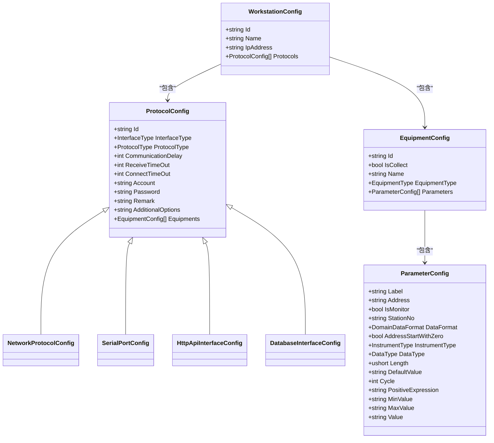
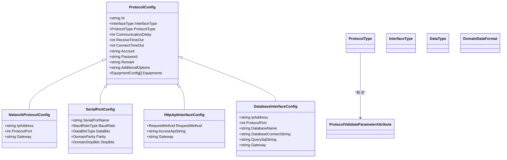
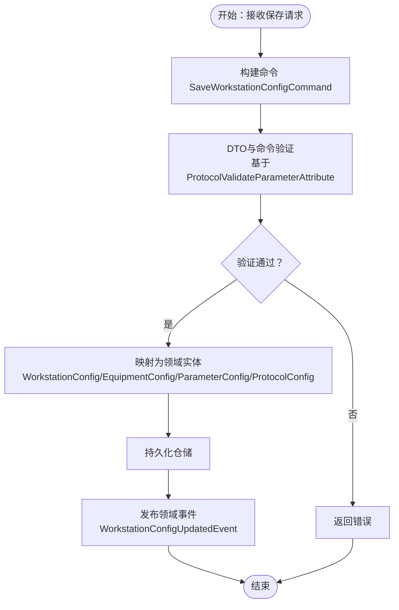
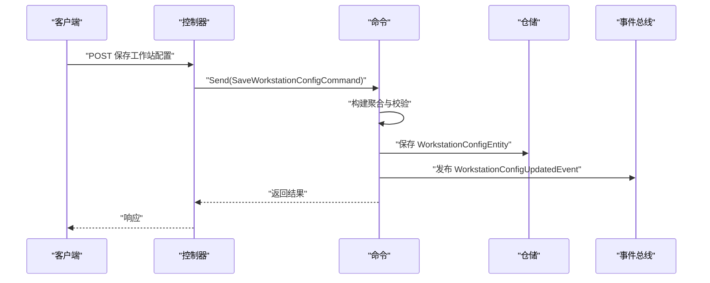
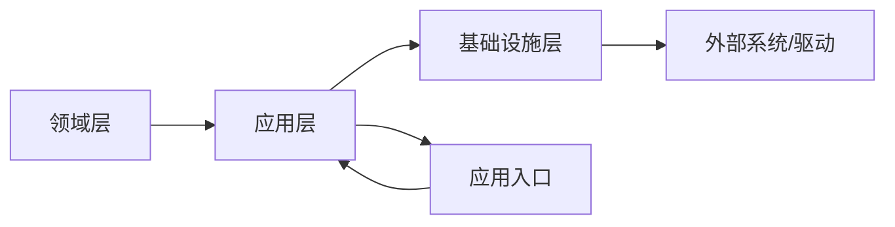

# 领域模型设计

<cite>
**本文引用的文件**
- [WorkstationConfig.cs](file://IndustrialDataSolution/IndustrialDataProcessor.Domain/Workstation/Configs/WorkstationConfig.cs)
- [EquipmentConfig.cs](file://IndustrialDataSolution/IndustrialDataProcessor.Domain/Workstation/Configs/EquipmentConfig.cs)
- [ParameterConfig.cs](file://IndustrialDataSolution/IndustrialDataProcessor.Domain/Workstation/Configs/ParameterConfig.cs)
- [ProtocolConfig.cs](file://IndustrialDataSolution/IndustrialDataProcessor.Domain/Workstation/Configs/ProtocolConfig.cs)
- [NetworkProtocolConfig.cs](file://IndustrialDataSolution/IndustrialDataProcessor.Domain/Workstation/Configs/ProtocolSub/NetworkProtocolConfig.cs)
- [SerialPortConfig.cs](file://IndustrialDataSolution/IndustrialDataProcessor.Domain/Workstation/Configs/ProtocolSub/SerialPortConfig.cs)
- [HttpApiInterfaceConfig.cs](file://IndustrialDataSolution/IndustrialDataProcessor.Domain/Workstation/Configs/ProtocolSub/HttpApiInterfaceConfig.cs)
- [DatabaseInterfaceConfig.cs](file://IndustrialDataSolution/IndustrialDataProcessor.Domain/Workstation/Configs/ProtocolSub/DatabaseInterfaceConfig.cs)
- [WorkstationConfigEntity.cs](file://IndustrialDataSolution/IndustrialDataProcessor.Domain/Entities/WorkstationConfigEntity.cs)
- [EquipmentType.cs](file://IndustrialDataSolution/IndustrialDataProcessor.Domain/Enums/EquipmentType.cs)
- [DataType.cs](file://IndustrialDataSolution/IndustrialDataProcessor.Domain/Enums/DataType.cs)
- [DomainDataFormat.cs](file://IndustrialDataSolution/IndustrialDataProcessor.Domain/Enums/DomainDataFormat.cs)
- [ProtocolType.cs](file://IndustrialDataSolution/IndustrialDataProcessor.Domain/Enums/ProtocolType.cs)
- [InterfaceType.cs](file://IndustrialDataSolution/IndustrialDataProcessor.Domain/Enums/InterfaceType.cs)
- [ProtocolValidateParameterAttribute.cs](file://IndustrialDataSolution/IndustrialDataProcessor.Domain/Attributes/ProtocolValidateParameterAttribute.cs)
- [ProtocolTypeHelper.cs](file://IndustrialDataSolution/IndustrialDataProcessor.Domain/Helpers/ProtocolTypeHelper.cs)
- [SaveWorkstationConfigCommand.cs](file://IndustrialDataSolution/IndustrialDataProcessor.Application/Features/SaveWorkstationConfigCommand.cs)
- [WorkstationConfigUpdatedEvent.cs](file://IndustrialDataSolution/IndustrialDataProcessor.Application/Features/WorkstationConfigUpdatedEvent.cs)
- [WorkstationConfigDto.cs](file://IndustrialDataSolution/IndustrialDataProcessor.Application/Dtos/WorkstationDto/WorkstationConfigDto.cs)
- [EquipmentConfigDto.cs](file://IndustrialDataSolution/IndustrialDataProcessor.Application/Dtos/WorkstationDto/EquipmentConfigDto.cs)
- [ParameterConfigDto.cs](file://IndustrialDataSolution/IndustrialDataProcessor.Application/Dtos/WorkstationDto/ParameterConfigDto.cs)
- [ProtocolConfigDto.cs](file://IndustrialDataSolution/IndustrialDataProcessor.Application/Dtos/WorkstationDto/ProtocolConfigDto.cs)
- [WorkstationConfigController.cs](file://IndustrialDataSolution/IndustrialDataProcessor.Api/Controllers/WorkstationConfigController.cs)
- [DataCollectionHostedService.cs](file://IndustrialDataSolution/IndustrialDataProcessor.Api/BackgroundServices/DataCollectionHostedService.cs)
- [CollectionTaskManager.cs](file://IndustrialDataSolution/IndustrialDataProcessor.Application/Services/CollectionTaskManager.cs)
- [DataCollectionAppService.cs](file://IndustrialDataSolution/IndustrialDataProcessor.Application/Services/DataCollectionAppService.cs)
- [IWorkstationConfigRepository.cs](file://IndustrialDataSolution/IndustrialDataProcessor.Domain/Repositories/IWorkstationConfigRepository.cs)
- [IWorkstationConfigPersistenceRepository.cs](file://IndustrialDataSolution/IndustrialDataProcessor.Domain/Repositories/IWorkstationConfigPersistenceRepository.cs)
- [WorkstationConfigRepository.cs](file://IndustrialDataSolution/IndustrialDataProcessor.Infrastructure/Persistence/Repositories/WorkstationConfigRepository.cs)
- [WorkstationConfigPersistenceRepository.cs](file://IndustrialDataSolution/IndustrialDataProcessor.Infrastructure/Persistence/Repositories/WorkstationConfigPersistenceRepository.cs)
- [WorkstationConfigMapper.cs](file://IndustrialDataSolution/IndustrialDataProcessor.Application/Mappers/WorkstationConfigMapper.cs)
- [WorkstationJsonConverter.cs](file://IndustrialDataSolution/IndustrialDataProcessor.Infrastructure/Serialization/Converters/WorkstationJsonConverter.cs)
- [EquipmentJsonConverter.cs](file://IndustrialDataSolution/IndustrialDataProcessor.Infrastructure/Serialization/Converters/EquipmentJsonConverter.cs)
- [ParameterJsonConverter.cs](file://IndustrialDataSolution/IndustrialDataProcessor.Infrastructure/Serialization/Converters/ParameterJsonConverter.cs)
- [ProtocolConfigJsonConverter.cs](file://IndustrialDataSolution/IndustrialDataProcessor.Infrastructure/Serialization/Converters/ProtocolConfigJsonConverter.cs)
- [WorkstationConfigDtoValidator.cs](file://IndustrialDataSolution/IndustrialDataProcessor.Application/Validators/WorkstationConfigDtoValidator.cs)
- [EquipmentConfigDtoValidator.cs](file://IndustrialDataSolution/IndustrialDataProcessor.Application/Validators/EquipmentConfigDtoValidator.cs)
- [ParameterConfigDtoValidator.cs](file://IndustrialDataSolution/IndustrialDataProcessor.Application/Validators/ParameterConfigDtoValidator.cs)
- [ProtocolConfigDtoValidator.cs](file://IndustrialDataSolution/IndustrialDataProcessor.Application/Validators/ProtocolConfigDtoValidator.cs)
- [SaveWorkstationConfigCommandValidator.cs](file://IndustrialDataSolution/IndustrialDataProcessor.Application/Validators/SaveWorkstationConfigCommandValidator.cs)
</cite>

## 目录
1. [引言](#引言)
2. [项目结构](#项目结构)
3. [核心组件](#核心组件)
4. [架构总览](#架构总览)
5. [详细组件分析](#详细组件分析)
6. [依赖关系分析](#依赖关系分析)
7. [性能考虑](#性能考虑)
8. [故障排查指南](#故障排查指南)
9. [结论](#结论)
10. [附录](#附录)

## 引言
本文件面向DDD工业数据处理解决方案，系统化梳理领域模型与值对象，明确WorkstationConfig、EquipmentConfig、ParameterConfig等关键实体的设计理念与业务含义；阐述协议配置、设备类型枚举等值对象的定义与使用场景；解释聚合根边界与关系约束；记录业务规则与验证逻辑；给出实体生命周期管理（创建、更新、删除）的业务语义；说明领域事件的设计与触发机制；并提供数据模型演进与版本管理策略建议及典型业务场景示例。

## 项目结构
该仓库采用分层与子域结合的DDD组织方式：
- Domain：领域层，包含实体、值对象、枚举、属性、仓储接口与异常等
- Application：应用层，包含命令、事件、服务、DTO、验证器、映射器等
- Infrastructure：基础设施层，包含仓储实现、序列化转换器、通信驱动、后台服务、数据处理等
- Api：应用服务入口，控制器、中间件、后台服务等



图示来源
- [WorkstationConfig.cs](file://IndustrialDataSolution/IndustrialDataProcessor.Domain/Workstation/Configs/WorkstationConfig.cs#L1-L27)
- [EquipmentConfig.cs](file://IndustrialDataSolution/IndustrialDataProcessor.Domain/Workstation/Configs/EquipmentConfig.cs#L1-L34)
- [ParameterConfig.cs](file://IndustrialDataSolution/IndustrialDataProcessor.Domain/Workstation/Configs/ParameterConfig.cs#L1-L84)
- [ProtocolConfig.cs](file://IndustrialDataSolution/IndustrialDataProcessor.Domain/Workstation/Configs/ProtocolConfig.cs#L1-L64)
- [NetworkProtocolConfig.cs](file://IndustrialDataSolution/IndustrialDataProcessor.Domain/Workstation/Configs/ProtocolSub/NetworkProtocolConfig.cs#L1-L28)
- [SerialPortConfig.cs](file://IndustrialDataSolution/IndustrialDataProcessor.Domain/Workstation/Configs/ProtocolSub/SerialPortConfig.cs#L1-L38)
- [HttpApiInterfaceConfig.cs](file://IndustrialDataSolution/IndustrialDataProcessor.Domain/Workstation/Configs/ProtocolSub/HttpApiInterfaceConfig.cs#L1-L30)
- [DatabaseInterfaceConfig.cs](file://IndustrialDataSolution/IndustrialDataProcessor.Domain/Workstation/Configs/ProtocolSub/DatabaseInterfaceConfig.cs#L1-L45)
- [EquipmentType.cs](file://IndustrialDataSolution/IndustrialDataProcessor.Domain/Enums/EquipmentType.cs#L1-L22)
- [DataType.cs](file://IndustrialDataSolution/IndustrialDataProcessor.Domain/Enums/DataType.cs#L1-L69)
- [DomainDataFormat.cs](file://IndustrialDataSolution/IndustrialDataProcessor.Domain/Enums/DomainDataFormat.cs#L1-L9)
- [ProtocolType.cs](file://IndustrialDataSolution/IndustrialDataProcessor.Domain/Enums/ProtocolType.cs#L1-L231)
- [InterfaceType.cs](file://IndustrialDataSolution/IndustrialDataProcessor.Domain/Enums/InterfaceType.cs#L1-L32)
- [SaveWorkstationConfigCommand.cs](file://IndustrialDataSolution/IndustrialDataProcessor.Application/Commands/SaveWorkstationConfigCommand.cs)
- [SaveWorkstationConfigCommandHandler.cs](file://IndustrialDataSolution/IndustrialDataProcessor.Application/CommandHandlers/SaveWorkstationConfigCommandHandler.cs)
- [WorkstationConfigUpdatedEvent.cs](file://IndustrialDataSolution/IndustrialDataProcessor.Application/Events/WorkstationConfigUpdatedEvent.cs)
- [WorkstationConfigUpdatedEventHandler.cs](file://IndustrialDataSolution/IndustrialDataProcessor.Application/EventHandlers/WorkstationConfigUpdatedEventHandler.cs)
- [CollectionTaskManager.cs](file://IndustrialDataSolution/IndustrialDataProcessor.Application/Services/CollectionTaskManager.cs)
- [DataCollectionAppService.cs](file://IndustrialDataSolution/IndustrialDataProcessor.Application/Services/DataCollectionAppService.cs)
- [WorkstationConfigRepository.cs](file://IndustrialDataSolution/IndustrialDataProcessor.Infrastructure/Repositories/WorkstationConfigRepository.cs)
- [WorkstationConfigEntityRepository.cs](file://IndustrialDataSolution/IndustrialDataProcessor.Infrastructure.Persistence.SqlSugar/Repositories/WorkstationConfigEntityRepository.cs)
- [WorkstationJsonConverter.cs](file://IndustrialDataSolution/IndustrialDataProcessor.Infrastructure/Serialization/Converters/WorkstationJsonConverter.cs)
- [WorkstationConfigController.cs](file://IndustrialDataSolution/IndustrialDataProcessor.Api/Controllers/WorkstationConfigController.cs)

章节来源
- [WorkstationConfig.cs](file://IndustrialDataSolution/IndustrialDataProcessor.Domain/Workstation/Configs/WorkstationConfig.cs#L1-L27)
- [ProtocolConfig.cs](file://IndustrialDataSolution/IndustrialDataProcessor.Domain/Workstation/Configs/ProtocolConfig.cs#L1-L64)

## 核心组件
本节聚焦关键实体与值对象，阐明其职责、属性与约束。

- WorkstationConfig（工作站配置）
  - 职责：聚合根，承载边缘标识、名称、IP地址以及协议集合
  - 关键属性：Id、Name、IpAddress、Protocols
  - 约束：Id与IpAddress必填；Protocols非空
  - 业务语义：代表一个边缘节点的完整采集配置，作为上层调度与数据采集的入口

- EquipmentConfig（设备配置）
  - 职责：描述单个设备的采集开关、名称、类型与变量集合
  - 关键属性：Id、IsCollect、Name、EquipmentType、Parameters
  - 约束：Id必填；EquipmentType默认值为设备类型；Parameters可为空集合
  - 业务语义：控制某设备是否参与采集，以及其变量清单

- ParameterConfig（变量配置）
  - 职责：描述单个变量的采集参数、表达式、范围与写入值等
  - 关键属性：Label、Address、IsMonitor、StationNo、DataFormat、AddressStartWithZero、InstrumentType、DataType、Length、DefaultValue、Cycle、PositiveExpression、MinValue、MaxValue、Value
  - 约束：Label与Address必填；IsMonitor默认false；DataType、Length、Cycle等可选
  - 业务语义：定义变量的采集行为、解析规则与安全上下限

- ProtocolConfig（协议配置抽象）
  - 职责：协议配置的抽象基类，统一账户、密码、超时、设备集合等通用字段
  - 关键属性：Id、InterfaceType（抽象）、ProtocolType、CommunicationDelay、ReceiveTimeOut、ConnectTimeOut、Account、Password、Remark、AdditionalOptions、Equipments
  - 约束：Id必填；各超时字段有默认值；Equipments非空
  - 业务语义：作为网络、串口、API、数据库等具体协议类型的父类

- 具体协议子类
  - NetworkProtocolConfig（网口协议）：LAN接口，包含Ip地址、端口、网关
  - SerialPortConfig（串口协议）：COM接口，包含串口名、波特率、数据位、校验位、停止位
  - HttpApiInterfaceConfig（HTTP API协议）：API接口，请求方法、访问路径、网关
  - DatabaseInterfaceConfig（数据库协议）：DATABASE接口，IP、端口、库名、连接串、查询SQL、网关

- 值对象与枚举
  - EquipmentType：设备类型枚举（设备/仪表）
  - DataType：数据类型枚举（布尔、整型、浮点、字符串等）
  - DomainDataFormat：数据字节序（ABCD/BADC/CDAB/DCBA）
  - ProtocolType：协议类型枚举，覆盖LAN/COM/API/DATABASE多接口族
  - InterfaceType：接口类型枚举（LAN/COM/API/DATABASE）

章节来源
- [WorkstationConfig.cs](file://IndustrialDataSolution/IndustrialDataProcessor.Domain/Workstation/Configs/WorkstationConfig.cs#L1-L27)
- [EquipmentConfig.cs](file://IndustrialDataSolution/IndustrialDataProcessor.Domain/Workstation/Configs/EquipmentConfig.cs#L1-L34)
- [ParameterConfig.cs](file://IndustrialDataSolution/IndustrialDataProcessor.Domain/Workstation/Configs/ParameterConfig.cs#L1-L84)
- [ProtocolConfig.cs](file://IndustrialDataSolution/IndustrialDataProcessor.Domain/Workstation/Configs/ProtocolConfig.cs#L1-L64)
- [NetworkProtocolConfig.cs](file://IndustrialDataSolution/IndustrialDataProcessor.Domain/Workstation/Configs/ProtocolSub/NetworkProtocolConfig.cs#L1-L28)
- [SerialPortConfig.cs](file://IndustrialDataSolution/IndustrialDataProcessor.Domain/Workstation/Configs/ProtocolSub/SerialPortConfig.cs#L1-L38)
- [HttpApiInterfaceConfig.cs](file://IndustrialDataSolution/IndustrialDataProcessor.Domain/Workstation/Configs/ProtocolSub/HttpApiInterfaceConfig.cs#L1-L30)
- [DatabaseInterfaceConfig.cs](file://IndustrialDataSolution/IndustrialDataProcessor.Domain/Workstation/Configs/ProtocolSub/DatabaseInterfaceConfig.cs#L1-L45)
- [EquipmentType.cs](file://IndustrialDataSolution/IndustrialDataProcessor.Domain/Enums/EquipmentType.cs#L1-L22)
- [DataType.cs](file://IndustrialDataSolution/IndustrialDataProcessor.Domain/Enums/DataType.cs#L1-L69)
- [DomainDataFormat.cs](file://IndustrialDataSolution/IndustrialDataProcessor.Domain/Enums/DomainDataFormat.cs#L1-L9)
- [ProtocolType.cs](file://IndustrialDataSolution/IndustrialDataProcessor.Domain/Enums/ProtocolType.cs#L1-L231)
- [InterfaceType.cs](file://IndustrialDataSolution/IndustrialDataProcessor.Domain/Enums/InterfaceType.cs#L1-L32)

## 架构总览
下图展示了领域模型在应用层、基础设施层与外部系统的交互关系，以及命令、事件与服务的协作流程。

```mermaid
graph TB
Ctl["控制器<br/>WorkstationConfigController"] --> Cmd["命令<br/>SaveWorkstationConfigCommand"]
Cmd --> Agg["聚合根<br/>WorkstationConfig"]
Agg --> Eq["设备集合<br/>EquipmentConfig[]"]
Eq --> Param["变量集合<br/>ParameterConfig[]"]
Agg --> Proto["协议集合<br/>ProtocolConfig[]"]
Proto --> Net["NetworkProtocolConfig"]
Proto --> Ser["SerialPortConfig"]
Proto --> Api["HttpApiInterfaceConfig"]
Proto --> Db["DatabaseInterfaceConfig"]
Cmd --> Svc["应用服务<br/>DataCollectionAppService"]
Svc --> Tsk["任务管理<br/>CollectionTaskManager"]
Cmd --> Repo["仓储接口<br/>IWorkstationConfigRepository"]
Repo --> InfraRepo["仓储实现<br/>WorkstationConfigRepository"]
Cmd --> Ev["领域事件<br/>WorkstationConfigUpdatedEvent"]
end
```

图示来源
- [WorkstationConfigController.cs](file://IndustrialDataSolution/IndustrialDataProcessor.Api/Controllers/WorkstationConfigController.cs)
- [SaveWorkstationConfigCommand.cs](file://IndustrialDataSolution/IndustrialDataProcessor.Application/Commands/SaveWorkstationConfigCommand.cs)
- [SaveWorkstationConfigCommandHandler.cs](file://IndustrialDataSolution/IndustrialDataProcessor.Application/CommandHandlers/SaveWorkstationConfigCommandHandler.cs)
- [WorkstationConfig.cs](file://IndustrialDataSolution/IndustrialDataProcessor.Domain/Workstation/Configs/WorkstationConfig.cs#L1-L27)
- [EquipmentConfig.cs](file://IndustrialDataSolution/IndustrialDataProcessor.Domain/Workstation/Configs/EquipmentConfig.cs#L1-L34)
- [ParameterConfig.cs](file://IndustrialDataSolution/IndustrialDataProcessor.Domain/Workstation/Configs/ParameterConfig.cs#L1-L84)
- [ProtocolConfig.cs](file://IndustrialDataSolution/IndustrialDataProcessor.Domain/Workstation/Configs/ProtocolConfig.cs#L1-L64)
- [NetworkProtocolConfig.cs](file://IndustrialDataSolution/IndustrialDataProcessor.Domain/Workstation/Configs/ProtocolSub/NetworkProtocolConfig.cs#L1-L28)
- [SerialPortConfig.cs](file://IndustrialDataSolution/IndustrialDataProcessor.Domain/Workstation/Configs/ProtocolSub/SerialPortConfig.cs#L1-L38)
- [HttpApiInterfaceConfig.cs](file://IndustrialDataSolution/IndustrialDataProcessor.Domain/Workstation/Configs/ProtocolSub/HttpApiInterfaceConfig.cs#L1-L30)
- [DatabaseInterfaceConfig.cs](file://IndustrialDataSolution/IndustrialDataProcessor.Domain/Workstation/Configs/ProtocolSub/DatabaseInterfaceConfig.cs#L1-L45)
- [DataCollectionAppService.cs](file://IndustrialDataSolution/IndustrialDataProcessor.Application/Services/DataCollectionAppService.cs)
- [CollectionTaskManager.cs](file://IndustrialDataSolution/IndustrialDataProcessor.Application/Services/CollectionTaskManager.cs)
- [IWorkstationConfigRepository.cs](file://IndustrialDataSolution/IndustrialDataProcessor.Domain/Repositories/IWorkstationConfigRepository.cs)
- [WorkstationConfigRepository.cs](file://IndustrialDataSolution/IndustrialDataProcessor.Infrastructure/Repositories/WorkstationConfigRepository.cs)
- [WorkstationConfigUpdatedEvent.cs](file://IndustrialDataSolution/IndustrialDataProcessor.Application/Events/WorkstationConfigUpdatedEvent.cs)
- [WorkstationConfigUpdatedEventHandler.cs](file://IndustrialDataSolution/IndustrialDataProcessor.Application/EventHandlers/WorkstationConfigUpdatedEventHandler.cs)
- [ClearConfigCacheEventHandler.cs](file://IndustrialDataSolution/IndustrialDataProcessor.Application/EventHandlers/ClearConfigCacheEventHandler.cs)

## 详细组件分析

### WorkstationConfig 聚合根设计
- 设计原则
  - 聚合边界：以WorkstationConfig为核心，包含其下的ProtocolConfig、EquipmentConfig、ParameterConfig形成完整的采集配置聚合
  - 不变约束：Id与IpAddress必须唯一且有效；Protocols非空
  - 一致性：同一WorkstationConfig内的设备与变量应满足协议参数校验要求
- 关系与约束
  - 一对多：WorkstationConfig → ProtocolConfig[]
  - 一对多：ProtocolConfig → EquipmentConfig[]
  - 一对多：EquipmentConfig → ParameterConfig[]
- 生命周期
  - 创建：接收SaveWorkstationConfigRequest，构建聚合并进行参数校验
  - 更新：变更后触发WorkstationConfigUpdatedEvent，通知缓存清理与重新加载
  - 删除：通过仓储接口删除WorkstationConfigEntity（持久化实体）



图示来源
- [WorkstationConfig.cs](file://IndustrialDataSolution/IndustrialDataProcessor.Domain/Workstation/Configs/WorkstationConfig.cs#L1-L27)
- [ProtocolConfig.cs](file://IndustrialDataSolution/IndustrialDataProcessor.Domain/Workstation/Configs/ProtocolConfig.cs#L1-L64)
- [NetworkProtocolConfig.cs](file://IndustrialDataSolution/IndustrialDataProcessor.Domain/Workstation/Configs/ProtocolSub/NetworkProtocolConfig.cs#L1-L28)
- [SerialPortConfig.cs](file://IndustrialDataSolution/IndustrialDataProcessor.Domain/Workstation/Configs/ProtocolSub/SerialPortConfig.cs#L1-L38)
- [HttpApiInterfaceConfig.cs](file://IndustrialDataSolution/IndustrialDataProcessor.Domain/Workstation/Configs/ProtocolSub/HttpApiInterfaceConfig.cs#L1-L30)
- [DatabaseInterfaceConfig.cs](file://IndustrialDataSolution/IndustrialDataProcessor.Domain/Workstation/Configs/ProtocolSub/DatabaseInterfaceConfig.cs#L1-L45)
- [EquipmentConfig.cs](file://IndustrialDataSolution/IndustrialDataProcessor.Domain/Workstation/Configs/EquipmentConfig.cs#L1-L34)
- [ParameterConfig.cs](file://IndustrialDataSolution/IndustrialDataProcessor.Domain/Workstation/Configs/ParameterConfig.cs#L1-L84)

章节来源
- [WorkstationConfig.cs](file://IndustrialDataSolution/IndustrialDataProcessor.Domain/Workstation/Configs/WorkstationConfig.cs#L1-L27)
- [EquipmentConfig.cs](file://IndustrialDataSolution/IndustrialDataProcessor.Domain/Workstation/Configs/EquipmentConfig.cs#L1-L34)
- [ParameterConfig.cs](file://IndustrialDataSolution/IndustrialDataProcessor.Domain/Workstation/Configs/ParameterConfig.cs#L1-L84)
- [ProtocolConfig.cs](file://IndustrialDataSolution/IndustrialDataProcessor.Domain/Workstation/Configs/ProtocolConfig.cs#L1-L64)

### 协议配置与值对象
- 值对象与枚举
  - InterfaceType：区分LAN/COM/API/DATABASE四类接口
  - ProtocolType：覆盖主流工业协议族，含参数校验标注
  - DataType：涵盖布尔、整数、浮点、字符串等基础数据类型
  - DomainDataFormat：字节序格式，用于多字节数据解析
- 协议配置类
  - NetworkProtocolConfig：LAN接口，包含IP、端口、网关
  - SerialPortConfig：COM接口，包含串口名、波特率、数据位、校验位、停止位
  - HttpApiInterfaceConfig：API接口，包含请求方法、访问路径、网关
  - DatabaseInterfaceConfig：DATABASE接口，包含数据库连接信息与查询SQL
- 参数校验机制
  - ProtocolValidateParameterAttribute：为ProtocolType枚举项标注参数需求
  - ProtocolTypeHelper：辅助根据协议类型提取校验规则，驱动DTO/命令验证器



图示来源
- [ProtocolConfig.cs](file://IndustrialDataSolution/IndustrialDataProcessor.Domain/Workstation/Configs/ProtocolConfig.cs#L1-L64)
- [NetworkProtocolConfig.cs](file://IndustrialDataSolution/IndustrialDataProcessor.Domain/Workstation/Configs/ProtocolSub/NetworkProtocolConfig.cs#L1-L28)
- [SerialPortConfig.cs](file://IndustrialDataSolution/IndustrialDataProcessor.Domain/Workstation/Configs/ProtocolSub/SerialPortConfig.cs#L1-L38)
- [HttpApiInterfaceConfig.cs](file://IndustrialDataSolution/IndustrialDataProcessor.Domain/Workstation/Configs/ProtocolSub/HttpApiInterfaceConfig.cs#L1-L30)
- [DatabaseInterfaceConfig.cs](file://IndustrialDataSolution/IndustrialDataProcessor.Domain/Workstation/Configs/ProtocolSub/DatabaseInterfaceConfig.cs#L1-L45)
- [ProtocolType.cs](file://IndustrialDataSolution/IndustrialDataProcessor.Domain/Enums/ProtocolType.cs#L1-L231)
- [InterfaceType.cs](file://IndustrialDataSolution/IndustrialDataProcessor.Domain/Enums/InterfaceType.cs#L1-L32)
- [DataType.cs](file://IndustrialDataSolution/IndustrialDataProcessor.Domain/Enums/DataType.cs#L1-L69)
- [DomainDataFormat.cs](file://IndustrialDataSolution/IndustrialDataProcessor.Domain/Enums/DomainDataFormat.cs#L1-L9)
- [ProtocolValidateParameterAttribute.cs](file://IndustrialDataSolution/IndustrialDataProcessor.Domain/Attributes/ProtocolValidateParameterAttribute.cs#L1-L28)

章节来源
- [ProtocolConfig.cs](file://IndustrialDataSolution/IndustrialDataProcessor.Domain/Workstation/Configs/ProtocolConfig.cs#L1-L64)
- [NetworkProtocolConfig.cs](file://IndustrialDataSolution/IndustrialDataProcessor.Domain/Workstation/Configs/ProtocolSub/NetworkProtocolConfig.cs#L1-L28)
- [SerialPortConfig.cs](file://IndustrialDataSolution/IndustrialDataProcessor.Domain/Workstation/Configs/ProtocolSub/SerialPortConfig.cs#L1-L38)
- [HttpApiInterfaceConfig.cs](file://IndustrialDataSolution/IndustrialDataProcessor.Domain/Workstation/Configs/ProtocolSub/HttpApiInterfaceConfig.cs#L1-L30)
- [DatabaseInterfaceConfig.cs](file://IndustrialDataSolution/IndustrialDataProcessor.Domain/Workstation/Configs/ProtocolSub/DatabaseInterfaceConfig.cs#L1-L45)
- [ProtocolType.cs](file://IndustrialDataSolution/IndustrialDataProcessor.Domain/Enums/ProtocolType.cs#L1-L231)
- [ProtocolValidateParameterAttribute.cs](file://IndustrialDataSolution/IndustrialDataProcessor.Domain/Attributes/ProtocolValidateParameterAttribute.cs#L1-L28)

### 业务规则与验证逻辑
- DTO到聚合的映射
  - 应用层提供WorkstationConfigDto、EquipmentConfigDto、ParameterConfigDto、ProtocolConfigDto，用于传输与校验
  - 映射器负责将DTO转换为领域实体，同时执行必要的业务规则检查
- 命令与验证
  - SaveWorkstationConfigCommand封装保存工作站配置的业务意图
  - SaveWorkstationConfigCommandValidator与各DtoValidator组合，确保输入符合协议参数要求
- 参数校验策略
  - 基于ProtocolType的ProtocolValidateParameterAttribute标注，动态推导必填字段
  - ProtocolTypeHelper提供运行时规则提取，支持DTO与命令验证器联动



### 实体生命周期管理
- 创建
  - 通过控制器接收保存请求
  - 命令创建WorkstationConfig聚合，填充ProtocolConfig/EquipmentConfig/ParameterConfig
  - 持久化仓储保存WorkstationConfigEntity（JSON内容）
- 更新
  - 修改配置后，发布WorkstationConfigUpdatedEvent
  - 事件触发缓存清理与重新加载，保证配置生效
- 删除
  - 通过仓储接口删除对应WorkstationConfigEntity，级联影响采集任务与通道



### 领域事件设计与触发机制
- WorkstationConfigUpdatedEvent：当工作站配置被保存或修改时发布
- 事件用于通知相关组件刷新缓存或重新加载配置

### 数据模型演进与版本管理策略
- 当前模型
  - 使用WorkstationConfigEntity存储JSON化的完整配置，便于快速序列化/反序列化
  - 领域模型与持久化模型分离，通过映射器完成转换
- 演进建议
  - 版本字段：在WorkstationConfigEntity中增加Version字段，支持并发控制与审计
  - 渐进式拆分：将ProtocolConfig/EquipmentConfig/ParameterConfig拆分为独立PO，建立外键关联，提升查询灵活性
  - 元数据：引入Created/Updated时间戳与操作人信息，增强可追溯性
  - 向后兼容：新增字段采用可选策略，避免破坏既有配置

章节来源
- [WorkstationConfigEntity.cs](file://IndustrialDataSolution/IndustrialDataProcessor.Domain/Entities/WorkstationConfigEntity.cs#L1-L7)
- [WorkstationJsonConverter.cs](file://IndustrialDataSolution/IndustrialDataProcessor.Infrastructure/Serialization/Converters/WorkstationJsonConverter.cs)
- [EquipmentJsonConverter.cs](file://IndustrialDataSolution/IndustrialDataProcessor.Infrastructure/Serialization/Converters/EquipmentJsonConverter.cs)
- [ParameterJsonConverter.cs](file://IndustrialDataSolution/IndustrialDataProcessor.Infrastructure/Serialization/Converters/ParameterJsonConverter.cs)
- [ProtocolConfigJsonConverter.cs](file://IndustrialDataSolution/IndustrialDataProcessor.Infrastructure/Serialization/Converters/ProtocolConfigJsonConverter.cs)

### 业务场景示例
- 场景一：新增工作站并配置采集任务
  - 步骤：通过控制器提交SaveWorkstationConfigRequest，命令处理器构建WorkstationConfig聚合，持久化后发布WorkstationConfigUpdatedEvent，事件处理器刷新缓存，采集服务启动对应任务
  - 关键点：协议参数校验、设备采集开关、变量表达式与范围
- 场景二：修改工作站配置
  - 步骤：更新WorkstationConfigDto，命令处理器执行验证与映射，保存实体并发布事件，事件处理器清理缓存
  - 关键点：参数可选性与默认值、协议类型变更的影响范围
- 场景三：删除工作站配置
  - 步骤：调用删除接口，仓储删除WorkstationConfigEntity，采集服务停止对应任务

章节来源
- [WorkstationConfigController.cs](file://IndustrialDataSolution/IndustrialDataProcessor.Api/Controllers/WorkstationConfigController.cs)
- [SaveWorkstationConfigCommandHandler.cs](file://IndustrialDataSolution/IndustrialDataProcessor.Application/CommandHandlers/SaveWorkstationConfigCommandHandler.cs)
- [WorkstationConfigUpdatedEvent.cs](file://IndustrialDataSolution/IndustrialDataProcessor.Application/Events/WorkstationConfigUpdatedEvent.cs)
- [DataCollectionAppService.cs](file://IndustrialDataSolution/IndustrialDataProcessor.Application/Services/DataCollectionAppService.cs)
- [CollectionTaskManager.cs](file://IndustrialDataSolution/IndustrialDataProcessor.Application/Services/CollectionTaskManager.cs)

## 依赖关系分析
- 耦合与内聚
  - 领域层内聚高：WorkstationConfig聚合内部职责清晰，协议、设备、变量层次分明
  - 应用层通过命令与事件解耦：命令处理器不直接依赖具体基础设施
  - 基础设施层通过仓储接口隔离：实现可替换，便于测试与扩展
- 外部依赖
  - 通信驱动与后台服务：DataCollectionAppService与CollectionTaskManager协调采集任务
  - 序列化转换器：将领域模型序列化为JSON，便于持久化与传输



图示来源
- [DataCollectionAppService.cs](file://IndustrialDataSolution/IndustrialDataProcessor.Application/Services/DataCollectionAppService.cs)
- [CollectionTaskManager.cs](file://IndustrialDataSolution/IndustrialDataProcessor.Application/Services/CollectionTaskManager.cs)
- [WorkstationConfigRepository.cs](file://IndustrialDataSolution/IndustrialDataProcessor.Infrastructure/Repositories/WorkstationConfigRepository.cs)
- [WorkstationConfigController.cs](file://IndustrialDataSolution/IndustrialDataProcessor.Api/Controllers/WorkstationConfigController.cs)

章节来源
- [DataCollectionAppService.cs](file://IndustrialDataSolution/IndustrialDataProcessor.Application/Services/DataCollectionAppService.cs)
- [CollectionTaskManager.cs](file://IndustrialDataSolution/IndustrialDataProcessor.Application/Services/CollectionTaskManager.cs)
- [WorkstationConfigRepository.cs](file://IndustrialDataSolution/IndustrialDataProcessor.Infrastructure/Repositories/WorkstationConfigRepository.cs)
- [WorkstationConfigController.cs](file://IndustrialDataSolution/IndustrialDataProcessor.Api/Controllers/WorkstationConfigController.cs)

## 性能考虑
- 序列化开销：JSON序列化/反序列化成本较高，建议在高频读取场景引入缓存与版本控制
- 并发控制：通过版本字段与乐观锁避免并发覆盖
- 任务调度：采集任务按协议与设备粒度拆分，减少单点压力
- 日志与监控：在控制器与事件处理器中加入关键指标埋点，便于定位瓶颈

## 故障排查指南
- 常见问题
  - 协议参数缺失：检查ProtocolValidateParameterAttribute标注与DTO验证器
  - 设备未采集：确认EquipmentConfig.IsCollect为true，且Parameters非空
  - 变量表达式错误：核对PositiveExpression与DataType、Length、DataFormat
  - 虚拟点计算失败：检查表达式语法与变量引用是否正确
- 定位手段
  - 查看控制器日志与全局异常中间件输出
  - 检查仓储保存状态与实体JSON内容
  - 验证数据处理器的转换与计算结果

## 结论
本领域模型以WorkstationConfig为核心聚合，围绕协议、设备与变量构建了完整的工业数据采集配置体系。通过值对象与枚举明确业务语义，借助命令、事件与验证器实现清晰的业务规则与生命周期管理。建议在现有基础上引入版本控制与渐进式拆分，持续提升可维护性与扩展性。

## 附录
- 关键文件索引
  - 领域模型：WorkstationConfig、EquipmentConfig、ParameterConfig、ProtocolConfig及其子类
  - 值对象与枚举：EquipmentType、DataType、DomainDataFormat、ProtocolType、InterfaceType
  - 应用层：命令、处理器、事件、事件处理器、服务、DTO与验证器
  - 基础设施层：仓储实现、序列化转换器、通信驱动与后台服务
  - 应用入口：控制器与后台服务